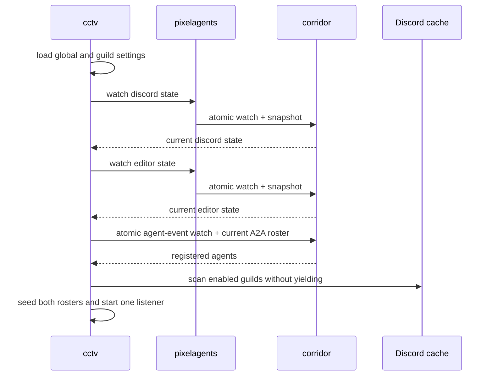
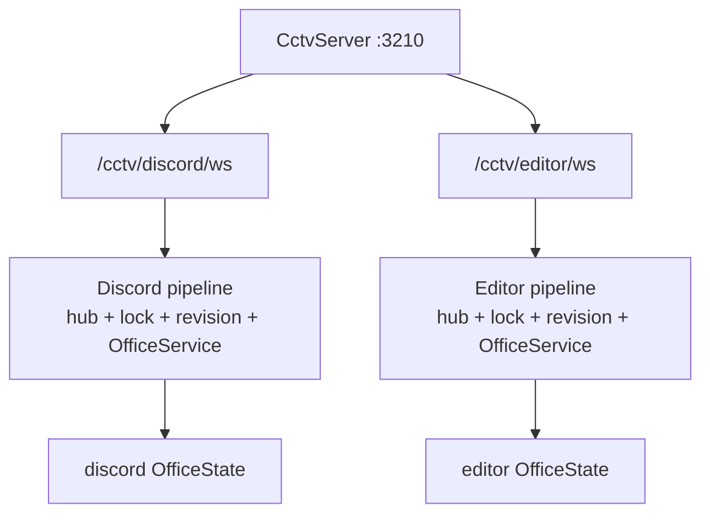

# CCTV architecture

CCTV owns one aiohttp listener with two isolated Pixel Agents pipelines. It is a
state observer and browser adapter; Pixelagents validates state and Corridor
persists it.

## Components

| Component | Responsibility |
|---|---|
| `domain/settings.py` | Immutable global and per-guild display settings |
| `contracts/websocket.py` | Validated client message parsing |
| `application/pipeline.py` | Per-page revision ordering, bootstrap, writes, roster, and activity projection |
| `application/tasks.py` | Supervised delayed activity clears |
| `infrastructure/settings.py` | Fresh CCTV Config identity |
| `infrastructure/client_hub.py` | Per-page connections, editor flags, and broadcasts |
| `infrastructure/server.py` | One aiohttp listener, two WebSocket routes, and a JSON health endpoint |
| `infrastructure/tickets.py` | Short-lived Discord-page browser identity tickets |
| `infrastructure/webview.py` | Pixelagents bundle loading and per-page HTML rewriting |
| `adapters/dashboard.py` | Discord/editor/session/static Dashboard routes |
| `adapters/cog_base.py` | Atomic watches, initial scans, event projection, lifecycle, and health |
| `adapters/commands.py` | Listener, guild, display, delay, and status commands |

## Startup ordering

There is one long-lived state watcher per aggregate, not one per browser. A
writer cannot land between subscription and snapshot because Corridor performs
both under its state lock. Agent event registration and the current A2A roster
are similarly atomic; CCTV then scans the Discord cache without an intervening
await.

## Pipeline isolation and revisions

Each `OfficeStateChanged` contains the complete post-write aggregate. A pipeline
ignores an event whose revision is not newer than the state it has already
applied. On `webviewReady`, it reads the current state again and serializes that
bootstrap with live event application, preventing late clients from receiving a
stale startup snapshot.

Browser layout and seat writes use Pixelagents' field-specific facade. A layout
write preserves seats; a seat write preserves layout. The Discord route drops
writes unless its connection is authorized. The editor route marks every
connection as an editor by design.

## Projection policy

The Discord pipeline includes members from enabled guilds, subject to the
per-guild `include_bots` setting, plus every registered A2A agent. Rich presence
and messages use global display toggles. The editor pipeline includes every
registered A2A agent and the bot's own Discord identity. Agent activities route
to either or both pipelines based on those rosters and use independent clear
delays.

Changing guild enablement or include-bots performs a full reconciliation.
Disabling a guild despawns its roster and reauthorizes Discord clients. Browser
authorization fails closed if Discord or Corridor lookups fail.

## Failure and shutdown

Bundle, state, and listener failures become health reasons rather than load
failures. Dashboard page access retries the bundle/state read, so repairs do not
require a restart unless the listener itself must rebind. The listener also
exposes `GET /cctv/health`, returning the same status/listener/assets/pipeline
snapshot as `[p]cctv status` as JSON, for reverse-proxy or uptime-monitor checks
that don't go through Discord. Shutdown removes all Corridor subscriptions,
cancels supervised tasks, closes both hubs and the listener, and clears the
pipelines.
