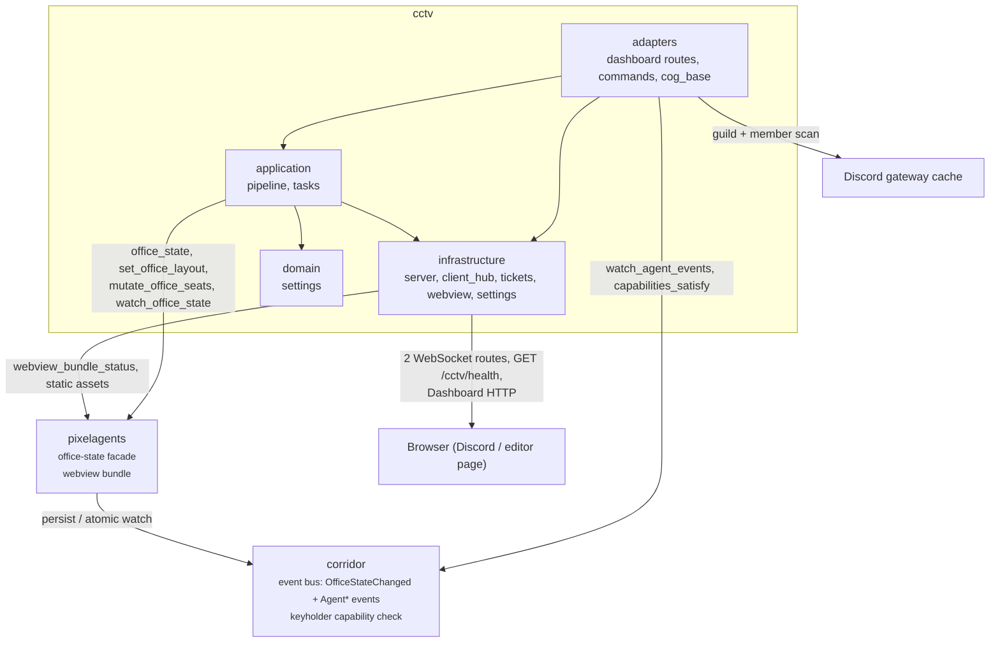
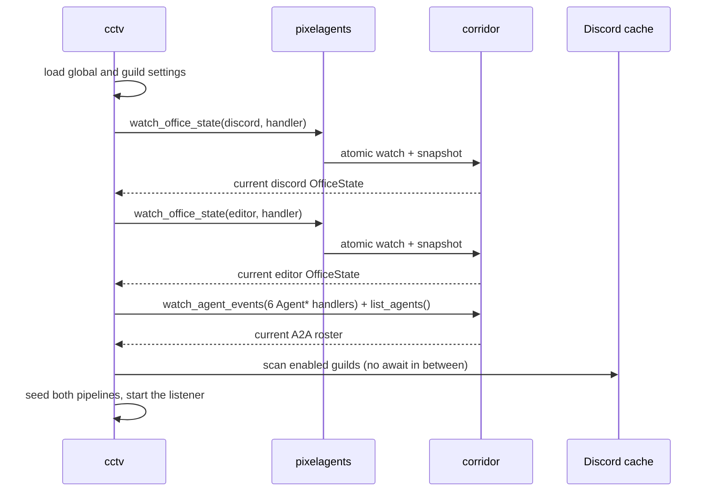
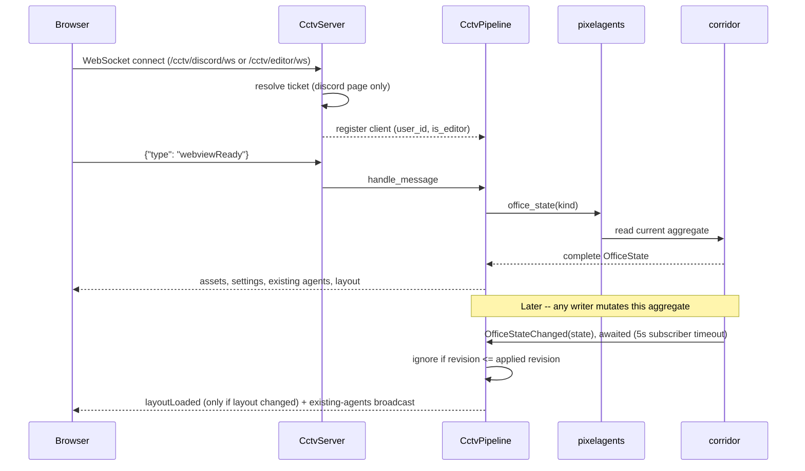

# CCTV architecture

CCTV is a state observer and browser adapter: it renders and transports
office state, but never owns the schema. Pixelagents validates every write
and provides the office-state facade; Corridor persists the two aggregates
and publishes their change events.

## Overview

| Component | Responsibility |
|---|---|
| `domain/settings.py` | Immutable global and per-guild display-settings values |
| `contracts/websocket.py` | Pydantic-validated parsing of every inbound client message |
| `application/pipeline.py` | Per-page revision ordering, bootstrap, writes, roster, and activity projection |
| `application/tasks.py` | Supervised, cancellable delayed activity clears |
| `infrastructure/settings.py` | CCTV's own Red Config identity for listener/display settings |
| `infrastructure/client_hub.py` | Per-page connection registry, editor flags, and broadcasts |
| `infrastructure/server.py` | One aiohttp listener: two WebSocket routes plus a JSON health route |
| `infrastructure/tickets.py` | Short-lived Discord-page browser identity tickets |
| `infrastructure/webview.py` | Pixelagents bundle loading and per-page HTML/WebSocket-target rewriting |
| `adapters/dashboard.py` | Discord/editor/session/static Dashboard route registrations |
| `adapters/cog_base.py` | Dependency wiring, atomic startup watches, pub/sub projection, lifecycle, health |
| `adapters/commands.py` | Listener, guild, display, delay, and status commands |

Corridor and Pixelagents are the only cross-cog dependencies. `cog_base.py`
loads both on demand via `corridor.dependency_loader.ensure_loaded`, never
through a module-scope import, so a reload ordering that runs before either
dependency is loaded cannot crash the module.

## Key flows

### Startup

Each aggregate has exactly one long-lived watcher for CCTV's lifetime, not
one per browser connection. Corridor performs subscribe-and-snapshot under
its office-state lock, so no writer can land in the gap between them.
Agent-event subscription and the current A2A roster are captured the same
way, and CCTV's Discord cache scan runs immediately after with no
intervening `await`, so no presence change can be missed at startup.

### Browser connect and live update

A pipeline never trusts its own startup snapshot for a late-connecting
client: `webviewReady` always re-reads the current aggregate and
serializes that read against concurrent event application under the
pipeline's lock, so a client that connects mid-write still bootstraps from
a consistent state. `layoutLoaded` is only rebroadcast when the layout
field itself changed -- most revision bumps are seat-only (an agent spawned,
despawned, or was assigned a palette) and would otherwise race the editor's
own unsaved-changes guard.

See [`docs/cctv-design.md`](../docs/cctv-design.md) for the full domain
model, the WebSocket/HTTP route reference, and validation/error-handling
detail.
