# corridor

Shared infrastructure for every other cog in this repository: permissions,
reply rendering, the LLM connection, the A2A agent directory, the MCP
tool-server bridge, a pub/sub event bus, a cross-cog LLM tool registry, and
revisioned office-state persistence.

## Overview

`corridor` is a hidden (`"hidden": true` in `info.json`), `COG`-type cog —
auto-loaded, running infrastructure, not a `SHARED_LIBRARY` like
[`contracts/`](../contracts/) (a CI-only, non-runtime package). Every other
cog in this repository declares it via `required_cogs` and loads it through
`corridor.dependency_loader.ensure_corridor_loaded()`.

It owns one guild-wide `Config` store for the two things every cog would
otherwise reinvent — **who is allowed to run a command** and **how a reply
gets formatted** — plus a set of process-wide, in-memory registries that
let cogs discover each other's capabilities without importing one another:
an A2A agent directory, an MCP tool bridge, a pub/sub event bus, and an LLM
tool registry. It also persists the shared office layout every A2A agent
mutates.

```mermaid
flowchart TB
    subgraph Corridor["corridor"]
        Perm["Permissions<br/>PermissionService"]
        Reply["Reply rendering<br/>ReplyService + ReplySender"]
        LLM["LLM connection<br/>LiteLLMClient"]
        A2A["A2A agent directory<br/>+ shared listener"]
        MCP["MCP tool-server bridge<br/>AgentToolServerRegistry"]
        Bus["Pub/Sub event bus<br/>EventBusService"]
        Tools["LLM tool registry<br/>ToolRegistryService"]
        Office["Office state<br/>OfficeStateService"]
    end

    AllCogs["every dependent cog"] -->|require_permission| Perm
    AllCogs -->|send_reply / render_reply| Reply
    Pico["pico"] & Architect["architect"] & Painter["painter"] -->|llm_settings| LLM
    Architect & Painter -->|register_agent| A2A
    Pico -->|per-agent consult tool via list_agents| A2A
    Suggestionbox["suggestionbox"] -->|register_mcp_server| MCP
    Architect & Painter -->|list_agent_tools_for| MCP
    Corridor -->|publish presence/replies| Bus
    Pico & Architect & Painter -->|publish AgentReplied| Bus
    Cctv["cctv"] -->|subscribe_event| Bus
    Deskutils["deskutils"] & Toolbox["toolbox"] -->|register_llm_tools| Tools
    Pico -->|list_tools_for| Tools
    Architect & Painter -->|set_office_layout / set_office_seats| Office
    Pixelagents["pixelagents"] -->|office_state facade| Office
```

## Commands

| Command | Access | Description |
|---|---|---|
| `[p]corridorsettings` | Manage Server / admin role / owner | Opens the shared Components V2 panel: permission groups (add/remove/rename, assign roles and Discord permissions) and reply style (text vs. embed, timestamp, footer, icon). |
| `[p]corridor` | anyone | Base group; shows help. |
| `[p]corridor llm endpoint <url>` | bot owner | Sets the shared LiteLLM proxy base URL used by pico, architect, and painter. |
| `[p]corridor llm key <key>` | bot owner | Sets the shared LiteLLM virtual key; deletes the invoking message immediately. |
| `[p]corridor llm model <model>` | bot owner | Sets the model name passed to the LLM endpoint. |
| `[p]corridor a2a host <host>` | bot owner | Sets the shared A2A listener's bind host and live-restarts it, re-mounting every registered agent. |
| `[p]corridor a2a port <port>` | bot owner | Sets the shared A2A listener's bind port and live-restarts it, re-mounting every registered agent. |
| `[p]corridor status` | anyone | Shows the current LLM endpoint/model/key state, the A2A listener's host/port and running state, and every currently registered agent key. |

Group management (adding/removing/renaming a permission group, assigning
roles and permissions) is UI-only, reached through `[p]corridorsettings` —
there is no text-command equivalent. Any cog's own settings command can
also embed the same controls inline via `build_shared_settings_container()`.

## Configuration

Two built-in permission groups seed by default: **Building Manager**
(`building_manager`) and **Keyholder** (`keyholder`). Two reserved,
non-role-backed tiers always exist: **Owner** (bot owner, or a member with
guild Administrator permission — bypasses every check) and **Employee**
(everyone — never restricts). A guild admin can add, remove, or rename
further groups at any time, assigning any number of Discord roles and/or
Discord permissions to each; a member satisfies a group by matching either
criterion, not both.

Reply style is also guild-wide: plain text vs. rich embed, and if embed,
whether it shows a timestamp, a footer, and where its icon comes from (a
custom URL, the bot's own avatar, or the server's icon).

Every dependent cog also gets a per-cog reply **identity**: it calls
`corridor.reply_sender(owner="MyCog", avatar_path=<cog>/assets/avatar.png)`
once, typically in `cog_load`, and sends every reply through the returned
`ReplySender` instead of calling `corridor` directly. The owner name always
shows as the embed author (or a `"**MyCog:** "` text prefix in
`ReplyMode.TEXT`); the avatar attaches once a real `avatar.png` exists at
that conventional path. `architect`, `corridor`, `deskutils`, `floorplan`,
`pico`, `pixelagents`, `testbench`, and `toolbox` all ship one; `painter`
binds the same conventional path and shows name-only until an image is
added.

Separate from per-guild settings, `[p]corridor llm ...` and
`[p]corridor a2a ...` (bot-owner only) configure the one shared LLM
connection (read by `pico`/`architect`/`painter`) and the one shared A2A
listener every A2A agent mounts onto.

`corridor` also hosts a cross-cog **LLM tool registry**: applying
`@corridor.domain.llm_tool()` to a command's callback makes it a tool
`pico` can call directly from its tool-calling loop, inferring name,
description, parameter schema, and availability from the command itself
unless overridden. See
[`docs/corridor-tool-registry-design.md`](../docs/corridor-tool-registry-design.md).

Corridor runs the one process-wide A2A listener every LLM agent mounts
onto (`register_agent`/`unregister_agent_owner`) and bridges cog-owned MCP
tool servers (`register_mcp_server`) into a registered agent's own tool
loop (`list_agent_tools_for`) — e.g. `suggestionbox`'s feedback tools
reaching `architect`/`painter` without either side importing the other.
`architect` (structural layout) and `painter` (color) are both A2A-only
agents, reachable as `consult_architect`/`consult_painter` tools; `pico`
is the sole A2A coordinator and the only one with a real Discord bot login.

`corridor.publish_event(event)`/`corridor.subscribe_event(event_type,
handler, owner=...)` dispatch a closed set of `Agent*` events (presence,
replies, tool-use steps, highlight/select) by concrete type, synchronously,
with per-subscriber error isolation. Corridor, `pico`, `architect`, and
`painter` all publish; `cctv` is the current sole subscriber, rendering the
shared office canvas.

Corridor persists two independent opaque aggregates, `discord` and
`editor`. Each holds a Pixel Agents layout, avatar-seat records, and a
monotonically increasing revision. Corridor never interprets either JSON
schema; [`pixelagents`](../pixelagents) owns the Semantic IR domain model
and provides the validated facade (`office_state`/`set_office_layout`/
`set_office_seats`) that `architect`/`painter` call through. Every
successful field mutation preserves the other field, advances the
revision, then publishes a complete `OfficeStateChanged` after releasing
the per-kind lock; subscribers are awaited sequentially with exception
isolation and a five-second timeout.

See [`docs/corridor.md`](../docs/corridor.md) for the full reference —
every subsystem's design, sequence diagrams, and rationale.

## Related docs

- [`docs/corridor.md`](../docs/corridor.md) — full reference: permissions,
  reply rendering, LLM connection, A2A directory, MCP bridge, event bus,
  tool registry, office state.
- [`docs/corridor-tool-registry-design.md`](../docs/corridor-tool-registry-design.md) —
  the cross-cog LLM tool registry in depth.
- [`docs/corridor-pubsub-design.md`](../docs/corridor-pubsub-design.md) —
  the pub/sub event bus in depth.
- [`docs/agent-directory-design.md`](../docs/agent-directory-design.md) —
  the A2A agent directory and shared listener.
- [`docs/reply-identity-design.md`](../docs/reply-identity-design.md) —
  per-cog reply identity and footer overrides.
- [`docs/suggestionbox-design.md`](../docs/suggestionbox-design.md) §6 —
  the MCP tool-server bridge.
