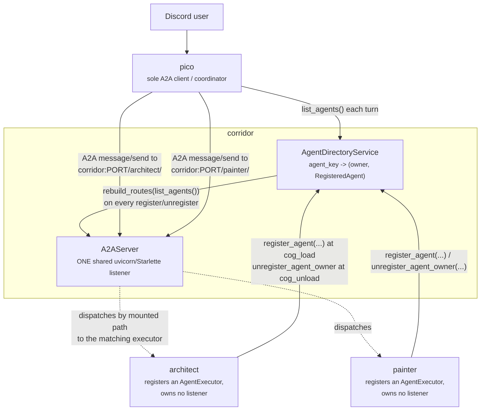
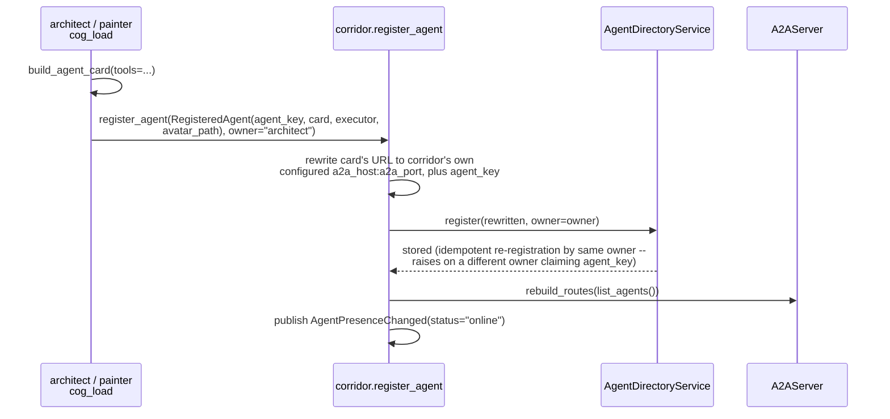
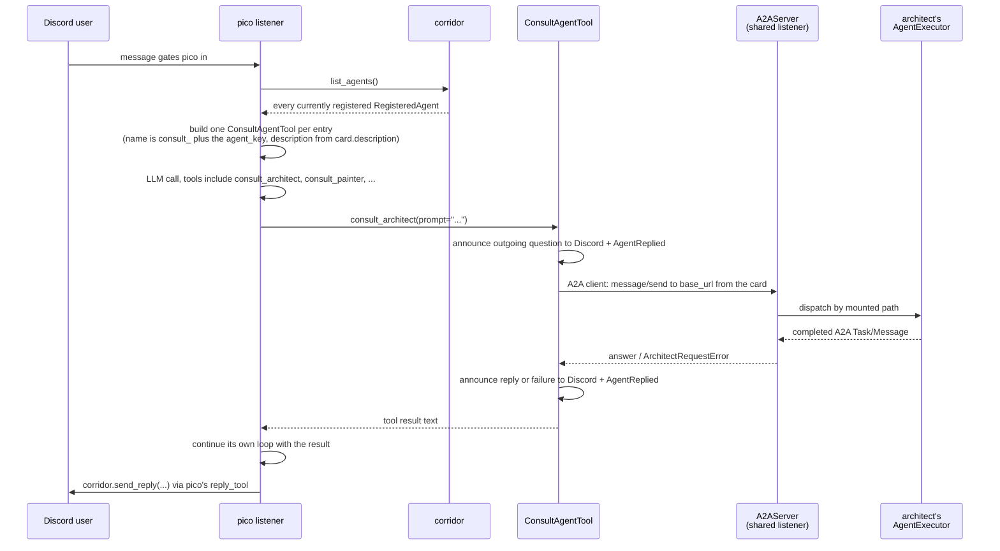

# Agent directory: corridor as the A2A registry between pico and every agent

## Overview

`pico` is the only cog in this repo that holds an A2A *client*: a Discord
user only ever talks to pico, and every other LLM agent (`architect`,
`painter`, and any future one) is a pure A2A *server* pico can delegate a
sub-task to. Adding agent N+1 must not mean copy-pasting agent N's
plumbing, so two things are centralized in `corridor`:

1. **Discovery.** Pico never hardcodes a per-agent Config field or a
   per-agent tool class. It calls `corridor.list_agents()` once per turn
   while assembling its tool list and builds one `consult_<agent_key>`
   tool per entry, dynamically.
2. **Listener ownership.** No agent binds its own socket. Corridor owns
   the single process-wide `uvicorn`/Starlette A2A listener; every agent
   registers an `AgentCard` + `AgentExecutor` into corridor's
   `AgentDirectoryService` at `cog_load`, and corridor mounts it under its
   own path on that one listener.

Both are the same underlying move: corridor becomes the one process-wide
A2A host, the same way it's already the one process-wide cross-cog tool
registry and event bus. An agent's own `cog_load` never touches `uvicorn`
and never risks a port-bind failure -- that risk exists exactly once, in
corridor, regardless of how many agents are loaded.

## Architecture



`AgentDirectoryService` (`corridor/application/agent_directory_service.py`)
is parallel to `ToolRegistryService`, not folded into it: an agent
registration carries an `AgentCard` + `AgentExecutor` pair to mount on the
shared A2A listener, while a tool registration carries a plain in-process
callable -- different-shaped things, even though both are "an owner hands
corridor something to run in-process." Every `register_agent`/
`unregister_agent`/`unregister_agent_owner` call rebuilds and remounts the
Starlette route table in the same call, so the directory's contents and
the live listener's routes are always in lock-step -- never two separate
steps a caller could forget to pair.

`A2AServer` (`corridor/infrastructure/a2a_server.py`) mounts one Starlette
`Mount` per registered agent at `/<agent_key>/`, each with its own fresh
`InMemoryTaskStore` (task stores are not shared across agents). It probes
the bind synchronously before ever starting `uvicorn`'s own server task:
`uvicorn.Server.startup()` calls `sys.exit()` on a bind failure, and a
`SystemExit` raised inside an `asyncio.Task` is re-raised by CPython's own
Task implementation straight out of the event loop, bypassing any
`try/except` wrapped around that task's result. Probing the bind directly
turns a bad host/port into an ordinary, catchable `OSError` instead, so
corridor keeps working as a Discord cog even when its A2A listener can't
come up. `rebuild_routes` replaces the live app's whole route list in a
single attribute assignment (never `.append()`/`.remove()` in place) --
Starlette's router re-reads `self.routes` fresh on every request, so a
clean swap between requests never mutates a list an in-flight request is
still iterating.

## Domain model / schema

```python
@dataclass(frozen=True, slots=True)
class RegisteredAgent:
    agent_key: str
    card: AgentCard          # real a2a-sdk protobuf message
    executor: AgentExecutor  # the a2a-sdk extension point
    avatar_path: Path | None = None
```

- **`agent_key`** -- the mount path segment (`/<agent_key>/`) and the
  suffix of pico's dynamically built tool name (`consult_<agent_key>`).
- **`card`** -- the real `a2a-sdk` `AgentCard` the registering agent
  built (name, description, skills). This is corridor's one deliberate
  exception to its usual "zero framework types in domain-adjacent code"
  convention: the whole point of the directory is to hand pico's A2A
  client the exact card it needs to call `create_client`, and
  re-deriving a neutral shape from the real card (then re-deriving the
  real card back out of it client-side) buys nothing. Corridor overwrites
  the card's one `supported_interfaces[0].url` (and `icon_url`, when
  `avatar_path` is set) with its own configured host/port plus
  `/<agent_key>/` before storing it -- the registering agent has no way
  to know what host/port it will ultimately be reachable at, since it no
  longer binds a listener of its own.
- **`executor`** -- the `a2a-sdk` `AgentExecutor` extension point the
  registering agent built to bridge one inbound A2A message to its own
  tool-calling loop. Corridor never inspects it; it's only wired into a
  `DefaultRequestHandler` mounted under that agent's path.
- **`avatar_path`** -- an optional bundled image file on the registering
  agent's own disk. When set, corridor serves it at
  `/<agent_key>/avatar.png` on its shared listener and sets the card's
  `icon_url` to that address, so a consulting agent can show it as a
  `FooterOverride` distinct from its own author identity (see
  `docs/reply-identity-design.md`).

`AgentDirectoryService` stores `agent_key -> (owner, RegisteredAgent)` in
one process-wide dict -- one directory per bot process, not per guild,
the same scoping `ToolRegistryService`/`EventBusService` already use.

## Key flows

### An agent registers at `cog_load`



At `cog_unload`, the agent calls `corridor.unregister_agent_owner(owner)`,
which removes every agent that owner registered, rebuilds the route
table, and publishes `AgentPresenceChanged(status="offline")` for each one
-- an agent's directory membership and its presence-broadcast lifecycle
are the same event, not two things a registering cog must remember to
keep in sync separately. Corridor's own `on_cog_remove` defensive cleanup
also calls `unregister_owner` for a cog that crashes mid-`cog_unload`,
the same distrust `_tool_registry`/`_visibility_filters` cleanup already
has.

### Pico discovers and consults an agent dynamically



If corridor has zero registered agents, `_agent_tools` returns an empty
list -- no error, no special-cased "not configured" branch, since
discovery is entirely dynamic: there is no single hardcoded agent whose
absence would need its own error path. One malformed card's
tool-building failure is logged and skipped rather than
dropping every other agent's tool, the same convention
`_cross_cog_tools` already uses for corridor's cross-cog tool registry.

## API reference

```python
class AgentDirectoryService:
    def register(self, agent: RegisteredAgent, *, owner: str) -> None:
        """Idempotent re-registration by the same owner (repeat cog_load).
        A different owner claiming an already-registered agent_key raises
        ValueError -- same collision policy as ToolRegistryService.register."""

    def unregister_owner(self, owner: str) -> None:
        """Remove every agent currently registered under `owner`."""

    def unregister(self, agent_key: str) -> None:
        """Remove one agent by key, regardless of owner. No-op if absent."""

    def list_agents(self) -> tuple[RegisteredAgent, ...]: ...

    def list_agents_for_owner(self, owner: str) -> tuple[RegisteredAgent, ...]:
        """Snapshot exactly which agents an unregister_owner() call is
        about to remove, before it removes them, so corridor can publish
        one AgentPresenceChanged(status="offline") per agent afterward."""
```

`CogBase` exposes the matching cross-cog surface, each keeping the
directory and the live listener's route table in lock-step and each
publishing `AgentPresenceChanged`:

```python
async def register_agent(self, agent: RegisteredAgent, *, owner: str) -> None: ...
async def unregister_agent_owner(self, owner: str) -> None: ...
async def unregister_agent(self, agent_key: str) -> None: ...
def list_agents(self) -> tuple[RegisteredAgent, ...]: ...
```

`[p]corridor a2a host/port` (bot owner) configures and live-restarts
corridor's one shared listener; there is no per-agent equivalent, since no
agent binds anything of its own.

## Design rationale

- **One shared listener instead of per-agent sockets.** Giving each agent
  its own `uvicorn.Server`, its own bound port, its own reverse-proxy
  rule, and its own owner-facing `a2a host/port` command pair would mean
  N+1 agents require N+1 copies of that entire class, and N+1 chances for
  the bind-failure incident class corridor's bind-probe defends against
  exactly once. Mounting every agent on one listener, under one
  `AgentDirectoryService`, means that risk and that
  configuration surface exist exactly once, regardless of how many
  agents are loaded.
- **Dynamic discovery instead of hardcoded URLs.** A hardcoded
  `[p]pico <agent> url <url>` Config field and a hand-written tool class
  per agent meant every new agent was a code change in pico. Pulling
  `corridor.list_agents()` fresh each turn and building one tool per
  entry means a new agent cog needs zero pico-side changes to become
  consultable -- registering with corridor is the whole integration.
- **Pull, not push, on the pico side.** Pico calls `list_agents()` once
  per turn while assembling its tool list, the same shape
  `_cross_cog_tools()` already uses for corridor's tool registry. No
  local cache and no subscription lifecycle to manage: the registry list
  is already a synchronous in-process call, so there's no round-trip cost
  pushing would save.
- **One dynamic tool per agent, not one dispatch-by-name tool.** Each
  agent gets its own LLM-visible name (`consult_<agent_key>`) and
  description (from its own `AgentCard.description`), matching how
  corridor's cross-cog tool registry already gives each registered tool
  its own identity rather than a single `consult_agent(agent_key,
  prompt)` dispatcher -- a model reasons better about "call
  `consult_architect`" than about picking a key out of an enum.
- **A parallel service, not folded into the tool registry.** An agent
  registration and a tool registration are different-shaped things (one
  carries an `AgentCard` + `AgentExecutor` pair to mount on a network
  listener, the other a plain in-process callable). Keeping
  `AgentDirectoryService` separate from `ToolRegistryService` keeps each
  one's own collision/lifecycle rules simple and specific to what it
  actually stores.
- **Directory membership doubles as presence.** `register_agent`/
  `unregister_agent`/`unregister_agent_owner` publish
  `AgentPresenceChanged` directly, so a registering cog never hand-rolls
  a separate presence-publish call that could drift out of sync with its
  actual registration state.
- **Topology stays hub-and-spoke, with one narrow, read-only exception.**
  Pico holds the one A2A client used for general-purpose delegation; every
  agent it reaches contributes an `AgentExecutor` for corridor to run and
  never calls back into pico. Corridor's directory is where executors are
  registered and mounted -- it does not turn any other cog into a second
  general-purpose coordinator. The one exception is
  `painter/tools/consult_architect_tool.py`: painter resolves architect's
  registered URL itself via `corridor.list_agents()` and calls it
  directly, peer-to-peer, bypassing pico entirely -- but that call is
  strictly read-only by construction (see docs/painter-design.md): painter
  has no tool that can ask architect to change anything, and architect has
  no tool that accepts a color.
- **Health is directory membership, not liveness.** A card in the
  directory means "this agent registered and hasn't unregistered," not
  "this agent is currently reachable." A dead-but-still-registered agent
  behaves exactly like an unreachable URL: the A2A call fails, surfaces
  as a tool error to pico's LLM, and pico keeps working. Any auth/signing
  on the shared listener, or genuine liveness checking, is out of scope
  here -- if an agent is ever exposed outside a trusted network, that
  needs its own design pass.

See [`docs/architect-design.md`](architect-design.md) for architect's own
side of registering with this directory, and
[`docs/cctv-design.md`](cctv-design.md) for how `AgentPresenceChanged`
drives the office canvas's live agent roster.
