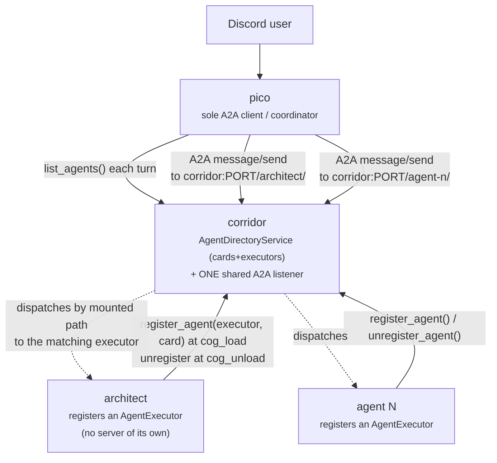
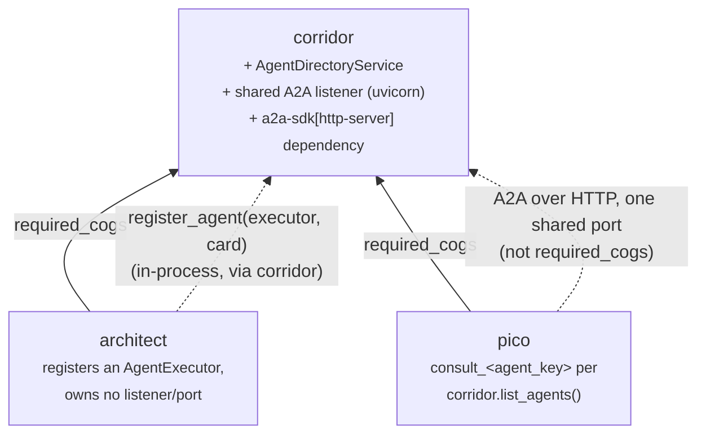

# Agent directory: corridor as the A2A registry between pico and many agents

**Status: implemented.** Sections 1-8 describe what's actually running
today; §8's checklist is complete, including tests (corridor's
`AgentDirectoryService`/`A2AServer` unit and live-routing tests,
architect's registration tests, pico's `_agent_tools`/`ConsultAgentTool`
tests, and a real, unmocked pico→corridor→architect A2A round trip in
`pico/tests/test_architect_client.py`).

## 1. Problem

This design has two parts, both aimed at "adding agent N+1 should not
mean copy-pasting agent N's plumbing":

1. **Discovery.** `pico -> architect` is a single hardcoded edge: an
   owner sets `[p]pico architect url <url>`, and
   `pico/tools/architect_tool.py` always builds exactly one
   `consult_architect` tool pointed at that one URL
   (`pico/adapters/listener.py:81-82`). A second agent means a new
   Config field, a new hardcoded tool class, a new
   `if settings.<agent>_url:` line, repeated forever.
2. **Listener ownership.** `architect` owns its *own* A2A listener —
   its own `uvicorn.Server`, its own bound host/port
   (`architect/infrastructure/a2a_server.py`'s `A2AServer`, started from
   `architect/adapters/cog_base.py`'s `cog_load`), including the whole
   probe-bind-uvicorn-startup-failure dance documented in
   `architect-design.md` §9's incident writeup. Every future agent would
   duplicate that entire class *and* need its own port, its own
   reverse-proxy rule, its own owner-facing `a2a host/port` command pair
   — the same "N+1 means copy-paste" problem as discovery, just one
   layer lower, in infrastructure instead of in pico's tool list.

Both are fixed the same way: **corridor becomes the one process-wide A2A
host.** It owns the single `uvicorn.Server`/Starlette app and the single
public port; every agent (architect today, more later) registers an
`AgentExecutor` + `AgentCard` into corridor's `AgentDirectoryService`
at `cog_load` — the same in-process registration shape
`ToolRegistryService`/`EventBusService` already use — instead of
building and binding a server of its own. Corridor mounts each
registered agent under its own path (`/<agent_key>/…`) on its one
listener, exactly the way it already aggregates registered tools and
subscribed events from every dependent cog. Pico discovers the current
agent roster from corridor each turn and builds one tool per agent
dynamically, calling straight through to corridor's one public URL —
no hardcoded per-agent Config field, no hardcoded per-agent tool class,
and now no hardcoded per-agent port either.

## 2. Locked decisions

Decided explicitly for this design, mirroring `architect-design.md`'s
"Key decisions locked" convention:

- **Corridor stores the real `a2a-sdk` `AgentCard`** (protobuf message),
  not a hand-rolled neutral record. This is a deliberate exception to
  corridor's usual "zero framework types in domain-adjacent code"
  convention (`RegisteredTool`, `AgentRef`, … all avoid it) — accepted
  here because the whole point of the registry is to hand pico's A2A
  client the exact card it needs to call `create_client`, and
  re-deriving a neutral shape from the real card (then re-deriving the
  real card back out of it client-side) buys nothing. Corridor's
  `info.json` gains `a2a-sdk` as a requirement as a direct consequence.
- **One dynamic tool per registered agent** in pico's tool loop
  (`consult_<agent_key>`), rebuilt every turn from corridor's current
  roster — not one generic `consult_agent(agent_key, prompt)` tool. Each
  agent gets its own LLM-visible name and description (from its
  `AgentCard.description`), matching how corridor's own cross-cog tool
  registry already gives each registered tool its own identity rather
  than one dispatch-by-name tool.
- **Pull, not push, on the pico side.** Pico calls
  `corridor.list_agents()` once per turn while assembling its tool list,
  exactly the shape `_cross_cog_tools()` already uses for
  `corridor.list_tools_for(ctx)`. No local cache, no subscription
  lifecycle to manage — the registry list is already a synchronous
  in-process call, so there's no round-trip cost pushing would save.
- **A new `AgentDirectoryService`, parallel to `ToolRegistryService`**,
  not folded into it — an agent registration and a tool registration are
  different-shaped things (one carries an `AgentCard`+`AgentExecutor`
  pair to mount on the shared A2A listener, the other a plain
  in-process callable), even though both are now "an owner hands
  corridor something to run in-process."
- **Corridor owns the one shared A2A listener; no agent binds its own
  socket.** `architect`'s `A2AServer`/`_build_app` (uvicorn lifecycle,
  bind-probe, Starlette app construction) relocates to corridor,
  generalized to host *any* number of registered agents on one
  host/port instead of being architect-specific. An agent's own
  `cog_load` never touches uvicorn, never has an `a2a_host`/`a2a_port`
  Config field, and never risks the port-bind-failure class of incident
  `architect-design.md` §9 documented — that risk now exists exactly
  once, in corridor, instead of once per agent.
- **One shared public URL, one path per agent.** Every agent is
  reachable at `http://<corridor's a2a host>:<corridor's a2a
  port>/<agent_key>/`. No more one reverse-proxy rule per agent
  (`architect-design.md` §5's `/architect/ws` precedent for the
  *webview* WebSocket is a separate, still-per-agent concern — see §5's
  note below — this bullet is only about the A2A listener).
- **Topology stays hub-and-spoke, pico is the sole coordinator.**
  Confirmed explicitly: a Discord user only ever talks to pico; pico is
  the only cog that holds an A2A *client* and calls out to other agents;
  every other agent (architect today, more later) contributes an
  `AgentExecutor` for corridor to run, never itself calling another
  agent or another agent's client. Corridor's directory is where
  executors are registered and mounted — it does not turn any other cog
  into a second coordinator.



## 3. Corridor: `AgentDirectoryService` + the shared A2A listener

### The directory

New file `corridor/application/agent_directory_service.py`, same shape
as `tool_registry_service.py`, now storing an executor alongside the
card:

```python
@dataclass(frozen=True, slots=True)
class RegisteredAgent:
    agent_key: str
    card: AgentCard          # corridor overwrites the card's own URL field, see below
    executor: AgentExecutor  # the a2a-sdk extension point, built by the registering agent


class AgentDirectoryService:
    """One directory per bot process, not per guild -- same scoping as
    ToolRegistryService/EventBusService."""

    def __init__(self) -> None:
        self._agents: dict[str, tuple[str, RegisteredAgent]] = {}  # agent_key -> (owner, agent)

    def register(self, agent: RegisteredAgent, *, owner: str) -> None:
        """Idempotent re-registration by the same owner (repeat cog_load).
        A different owner claiming an already-registered agent_key raises,
        same collision policy as ToolRegistryService.register."""

    def unregister_owner(self, owner: str) -> None: ...
    def unregister(self, agent_key: str) -> None: ...
    def list_agents(self) -> tuple[RegisteredAgent, ...]: ...
```

`CogBase` gains the matching public methods (`register_agent`,
`unregister_agent_owner`, `unregister_agent`, `list_agents`), and
`on_cog_remove`'s defensive cleanup
(`corridor/adapters/cog_base.py:249-262`) gains
`self._agent_directory.unregister_owner(cog.qualified_name)` alongside
the existing `_tool_registry`/`_visibility_filters` cleanup — same
distrust of a cog that crashes mid-`cog_unload`. Every `register_agent`/
`unregister_agent` call also rebuilds and remounts the Starlette route
table (next section) — the directory and the live listener are kept in
lock-step by construction, never two separate steps a caller could
forget to pair.

### The shared listener

`corridor/infrastructure/a2a_server.py` is a **relocation** of
`architect/infrastructure/a2a_server.py`'s `A2AServer` class
(bind-probe, uvicorn lifecycle, the `SystemExit`-from-uvicorn defense —
all of it verbatim, see `architect-design.md` §9's incident writeup for
why that code looks the way it does), generalized from "one agent's
routes" to "whatever's currently in the directory":

```python
class A2AServer:
    """Owns corridor's one process-wide A2A listener. Started once from
    corridor's own cog_load, host/port configured via `[p]corridor a2a
    host/port` (bot owner) -- NOT per-agent. `rebuild_routes` is called
    by AgentDirectoryService.register/unregister; it replaces the
    Starlette app's route list with a freshly built one in a single
    attribute assignment (never .append()/.remove() in place) so an
    in-flight request iterating the *old* list object is never mutated
    out from under it -- Starlette's Router re-reads self.routes fresh
    on every request, so a clean swap is all that's needed."""

    async def start(self, *, host: str, port: int) -> str | None: ...
    async def stop(self) -> None: ...
    def rebuild_routes(self, agents: Sequence[RegisteredAgent]) -> None:
        """One Starlette Mount per agent, at f"/{agent.agent_key}/":
        create_agent_card_routes(agent.card) + create_jsonrpc_routes(
            DefaultRequestHandler(agent.executor, InMemoryTaskStore(), agent.card), "/"
        ), each built fresh (a fresh InMemoryTaskStore per agent, matching
        today's one-task-store-per-agent scope) and mounted under that
        prefix. Safe to call with zero agents (empty route list -- the
        listener stays up with nothing mounted, same as corridor already
        tolerating zero registered tools)."""
```

Corridor's `cog_load` starts this listener immediately (host/port from
corridor's own Config, replacing architect's former `a2a_host`/
`a2a_port` fields — see §8), independent of whether any agent has
registered yet — same "the capability exists with zero consumers"
shape the tool registry and event bus already have. `AgentCard.
supported_interfaces[0].url` is **set by corridor**, not by the
registering agent, from corridor's own configured host/port plus the
agent's `agent_key` mount path — an agent no longer needs to know (or
guess) what host/port it will ultimately be reachable at.

## 4. `architect`: contributes an executor, owns no listener

`architect/infrastructure/a2a_server.py` shrinks to just
`build_agent_card` (name/description/skills — the *business*-facing
part) and `ArchitectAgentExecutor` (already framework-agnostic business
logic bridging one A2A message to architect's own `ToolLoopService`) —
the `A2AServer`/`_build_app` machinery moves to corridor per §3.
`architect/adapters/cog_base.py`'s `_start_a2a_server` becomes registration,
not listener startup:

```python
async def cog_load(self) -> None:
    ...
    card = build_agent_card(tools=self._tools)  # no host/port param anymore -- corridor fills in the URL
    self._corridor.register_agent(
        RegisteredAgent(agent_key="architect", card=card, executor=self._executor),
        owner="architect",
    )
```

There is no longer a failure mode where architect's *own* listener
fails to bind — that risk lives entirely in corridor now, once, for
every agent (`_notify_owners_a2a_failed`-equivalent logic also
relocates to corridor's own `cog_load`). `cog_unload` calls
`self._corridor.unregister_agent_owner("architect")`, replacing the old
`self._a2a_server.stop()` call. `[p]architect a2a host/port` is removed
entirely — there is no longer an architect-owned bind to configure; see
§8's command migration to `[p]corridor a2a host/port`.

Every future agent follows this exact same shape at its own
`cog_load`/`cog_unload`: build a card, build an `AgentExecutor` for its
own tool-calling logic, call `register_agent(RegisteredAgent(agent_key=
<its own key>, card=..., executor=...), owner=<its own qualified
name>)`, unregister on unload. Nothing here is architect-specific, and
no future agent ever imports `uvicorn` or touches a socket.

## 5. `pico`: dynamic per-agent tools, no more `architect_url`

Unchanged from the previous revision of this design except the URL
every agent's card now carries: `card.supported_interfaces[0].url`
is `http://<corridor's a2a host>:<corridor's a2a port>/<agent_key>/`
for every agent, set by corridor (§3) — pico's own code doesn't change
at all to account for the single-listener move; it was already just
reading `base_url` off whatever card corridor handed it. (This section
is unrelated to `architect-design.md` §5's `/architect/ws` webview
WebSocket path, which stays a separate, still-per-agent reverse-proxy
rule — this design only consolidates the A2A listener, not the webview
one.)

`pico/domain/models.py`'s `architect_url` Config field and
`[p]pico architect url <url>` command are dropped — no migration path,
same precedent as the LLM-field drop in §2 of `architect-design.md` and
the permission-group redesign
([[project-corridor-permission-redesign]]). `pico/tools/architect_tool.py`
is replaced by a generic `pico/tools/consult_agent_tool.py`:

```python
class ConsultAgentTool:
    """One instance per currently-registered agent, built fresh each turn."""

    def __init__(self, client: ArchitectAsker, *, agent_key: str, card: AgentCard) -> None:
        self.name = f"consult_{agent_key}"
        self.description = card.description or f"Delegate a task to {agent_key}."
        self._client = client
        self._base_url = card.supported_interfaces[0].url  # same field ArchitectClient.ask already resolves via base_url today

    # Input/Output/handler: unchanged shape from ArchitectTool -- still one prompt in, one answer/error out.
```

`pico/infrastructure/architect_client.py`'s `ArchitectClient.ask` is
unchanged (it already takes `base_url` per-call, not cached at
construction — see its own module docstring on why). It's renamed
`AgentClient` only for naming clarity; its behavior doesn't change.

`pico/adapters/listener.py`'s tool assembly
(currently lines 78-83) becomes:

```python
tools: list[ToolSpec] = [
    ReplyTool(self._corridor, ctx, guild_id=guild.id, bot_user_id=_bot_user_id(self.bot)),
]
tools.extend(_agent_tools(self._corridor, self._agent_client))
tools.extend(await _cross_cog_tools(self._corridor, ctx))
```

```python
def _agent_tools(corridor: Any, client: AgentAsker) -> list[ToolSpec]:
    tools: list[ToolSpec] = []
    for agent_key, card in corridor.list_agents():
        try:
            tools.append(ConsultAgentTool(client, agent_key=agent_key, card=card))
        except Exception:
            log.warning("pico: could not build tool for agent %r, skipping", agent_key, exc_info=True)
    return tools
```

Same per-entry try/except-and-skip shape `_cross_cog_tools` already
uses, for the same reason: one malformed card must never take down the
whole turn's tool list. If corridor has zero registered agents (no
agent cog loaded, or every one currently unregistered), pico simply
offers zero `consult_*` tools that turn — no error, no special-cased
"architect not configured" branch to maintain, since there's no longer
a single hardcoded agent to be "not configured."

**Addendum (added after initial implementation, same design): the A2A
exchange itself is now visible in Discord, not just pico's own final
paraphrase.** `ConsultAgentTool` (`pico/tools/consult_agent_tool.py`)
also takes `corridor`/`ctx` (same convention `ReplyTool`/`CrossCogTool`
already use) and calls `corridor.send_reply` directly, twice per
invocation: once immediately with the outgoing question ("🔧 Asking
**architect**: ..."), once with the target agent's raw answer or a
failure once the A2A call returns ("📩 **architect** replied: ..." /
"⚠️ **architect** could not be reached: ..."). This makes `ReplyTool` no
longer the *only* Discord-send in pico — it remains the only place the
LLM's own composed words reach Discord; `ConsultAgentTool`'s
announcements are deterministic, not left to the LLM's discretion, so
they can't be skipped or silently paraphrased away. Pico's own
subsequent "Architect says ..." reply (still via `ReplyTool`) is
additive on top of this, not a replacement for it — a user sees three
messages for one consult: the question, the raw answer, and pico's own
summary. `_agent_tools` (`pico/adapters/listener.py`) passes `ctx`
through to each `ConsultAgentTool` it builds for exactly this reason.

## 6. Updated dependency graph



The `pico -> corridor` A2A edge is not a `required_cogs` entry — same
"networked, not coded" reasoning `architect-design.md` §7 gave for
`pico -> architect`, now pointed at corridor's single listener instead
of each agent's own. Note this edge changed shape from the previous
revision: pico's A2A traffic now terminates at **corridor**, which
dispatches by mounted path, rather than going directly to each agent's
own bind. `architect -> corridor` for `register_agent` is already
covered by architect's existing `required_cogs: corridor` entry.

## 7. Out of scope for this pass

- **Any A2A auth/signing.** Same explicit non-goal as
  `architect-design.md` §8 — the directory only changes *how pico finds*
  an agent's URL, not the trust model of the call itself. If any agent
  is ever exposed outside a trusted network, that's its own design pass.
- **Health-checking / liveness of a registered agent.** A card in the
  directory means "this agent registered and hasn't unregistered," not
  "this agent is currently reachable." A dead-but-still-registered
  agent behaves exactly like today's unreachable-URL case:
  `ArchitectRequestError` surfaces as a tool error to the LLM, pico
  keeps working.
- **Cross-guild or per-guild agent scoping.** Like
  `ToolRegistryService`/`EventBusService`, the directory is one-per-bot-
  process, not one-per-guild — an agent is either registered process-wide
  or not registered at all.
- **A UI/command to list registered agents.** `[p]corridor` gains an
  `a2a host/port` pair (replacing architect's old ones — required, not
  optional, now that corridor owns the bind) but no agent-listing
  inspection command in this pass; `list_agents()` is an in-process API
  for pico only. A `[p]corridor agents` inspection command is a natural
  follow-up, not required for pico to discover and call agents.
- **Consolidating the webview WebSocket the same way.** `architect-
  design.md` §5's `/architect/ws` reverse-proxy path stays per-agent —
  this design only moves the A2A listener into corridor, not the office
  WebSocket server. A follow-up could ask the same "should corridor own
  this too?" question for the webview surface, but it's a separate
  protocol with a separate design (ticket/editor-authorization concepts
  the A2A side has none of) and isn't decided here.
- **Any other agent talking to another agent.** Confirmed in §2: only
  pico is a coordinator/A2A client. A second agent that itself needs to
  delegate to a third would be a new design question, not something this
  pass's directory shape already answers.

## 8. Implementation checklist

1. Move `architect/infrastructure/a2a_server.py`'s `A2AServer`/
   `_build_app` (bind-probe, uvicorn lifecycle) to
   `corridor/infrastructure/a2a_server.py`, generalized to build its
   Starlette app from a `Sequence[RegisteredAgent]` (§3) instead of one
   agent's fixed tool list; add `rebuild_routes`.
2. Add `corridor/application/agent_directory_service.py`
   (`AgentDirectoryService`, `RegisteredAgent`, mirroring
   `tool_registry_service.py`'s register/unregister_owner/unregister/
   list shape) and its own `a2a_host`/`a2a_port` Config fields
   (defaulting to architect's old `127.0.0.1:8931`).
3. Wire both into `CogBase.__init__`/`cog_load`/`cog_unload`
   (`corridor/adapters/cog_base.py`): start the shared `A2AServer` in
   `cog_load`; add `register_agent`, `unregister_agent_owner`,
   `unregister_agent`, `list_agents`, each calling
   `A2AServer.rebuild_routes` after mutating the directory; extend
   `on_cog_remove`'s cleanup; add `[p]corridor a2a host/port` (bot
   owner, live-restarts the listener — same restart-on-change
   convention architect's old command had).
4. Move `a2a-sdk[http-server]` + `uvicorn` from `architect/info.json` to
   `corridor/info.json`'s `requirements` (architect keeps plain
   `a2a-sdk` for the `AgentCard`/`AgentExecutor` types it still builds).
5. `architect`: drop `A2AServer`/`a2a_host`/`a2a_port`/
   `[p]architect a2a host/port`; `build_agent_card` drops its `host`/
   `port` params; `cog_load` calls `corridor.register_agent(...)`
   instead of starting a listener; `cog_unload` calls
   `corridor.unregister_agent_owner("architect")`. `[p]architect
   status`'s "A2A listener" field is replaced with "registered with
   corridor: yes/no."
6. `pico`: replace `ArchitectTool`/`architect_url` with
   `ConsultAgentTool` + `_agent_tools()`; drop the `[p]pico architect
   url` command and the `architect_url` Config field (no migration);
   update `pico`'s `info.json` description/install message and
   `end_user_data_statement` to describe "whichever agents corridor
   currently lists" instead of naming architect specifically.
7. Update `docs/architecture.md`'s dependency graph and ownership map;
   supersede `architect-design.md` §4's "Server side (architect)" and
   "Client side (pico)" subsections with a pointer to this doc — the
   A2A *listener* section no longer describes what's actually running.
8. Tests: `AgentDirectoryService` unit tests (register/collision/
   unregister, mirroring `tool_registry_service`'s own test shape);
   corridor's `A2AServer.rebuild_routes` correctly mounts/unmounts an
   agent's routes and a request while a concurrent register/unregister
   happens still resolves against one consistent route table (the
   atomic-swap property §3 calls out); architect registers/unregisters
   at cog_load/unload without ever importing uvicorn; pico builds one
   tool per `list_agents()` entry and zero tools when the directory is
   empty; an end-to-end test hitting corridor's one listener at
   `/architect/` gets architect's real tool-loop response (relocating
   `architect/tests/test_office_websocket_live.py`'s "verified for
   real, not mocked" bar to the new location).
