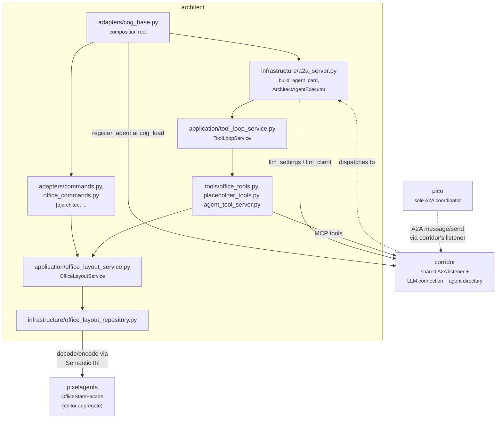
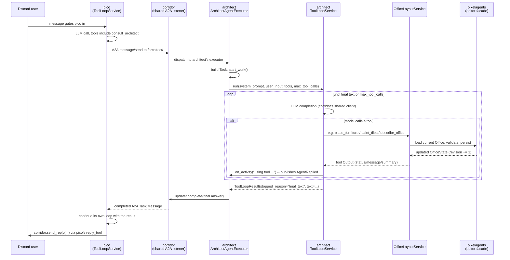
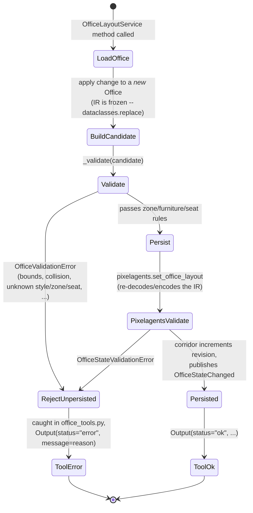

# The `architect` cog

## Overview

`architect` is a second, independent LLM agent in this repo, reachable
only over the [A2A (Agent2Agent) protocol](https://a2a-protocol.org/) --
no Discord user ever talks to it directly. `pico` is the sole A2A
coordinator: a Discord message gates it in, and one of its tools
(`consult_architect`) sends architect a prompt and folds the answer back
into pico's own reply. Architect owns every **structural** mutation on the
shared editor office layout -- walls, floor tiles, furniture placement,
zones, and seat assignment.
[`painter`](../painter) is architect's color-only counterpart: it
registers with corridor exactly the same way and shares the same editor
aggregate, but its tools can only recolor tiles and furniture, never add,
move, remove, or resize anything. Neither agent has memory across
consultations -- every delegated prompt is answered on its own, with no
persisted conversation state.

Architect has no Dashboard route, WebSocket listener, or browser client of
its own. [`cctv`](../cctv) serves the editor page and renders whatever
state architect (or painter) changes.

## Architecture

Architect uses the official `a2a-sdk` (PyPI) rather than hand-rolling the
A2A protocol. It registers an `AgentCard` and `AgentExecutor` with
corridor's shared A2A listener at `cog_load` instead of binding a listener
of its own -- corridor owns the one process-wide `uvicorn`/Starlette
server and mounts every registered agent under its own path
(`/<agent_key>/`). See
[`docs/agent-directory-design.md`](agent-directory-design.md) for that
shared listener and directory in full; this document covers only
architect's own side of it.



Both the Discord command surface (`adapters/office_commands.py`) and the
LLM tool surface (`tools/office_tools.py`) call the same
`OfficeLayoutService` methods, so a mutation made from `[p]architect
office ...` and one made from the LLM's tool loop receive identical
validation and persistence behavior.

## Domain model / schema

Architect's own domain module (`architect/domain/__init__.py`)
re-exports the shared Semantic IR types (`Office`, `FurnitureItem`,
`Zone`, `TileCell`, `Seat`, `GridPosition`, `GridRect`, `Direction`,
`FurnitureKind`, `TileKind`) directly from
`pixelagents.domain.office_ir` -- architect has no IR of its own. See
[`docs/architect-semantic-ir-design.md`](architect-semantic-ir-design.md)
for that shared model and its Pixel Agents JSON codec; this section only
covers the shapes architect's own tool layer adds on top of it.

Architect's only genuinely own domain type is its tool-loop configuration:

```python
@dataclass(frozen=True, slots=True)
class GlobalSettings:
    max_tool_calls: int
    system_prompt: str
    debug_logging: bool
```

Every LLM tool's `Output` wraps the IR into an LLM-facing summary rather
than exposing the IR dataclasses on the wire:

| Summary type | Fields |
|---|---|
| `FurnitureSummary` | `id`, `kind`, `style`, `col`, `row` (anchor tile), `facing`, `label`, `color` (`ColorSummary`, exact hex + hue/saturation/brightness/contrast), `occupied_cells`, `background_cells` (each an `OccupiedCellSummary { col, row, is_anchor }`) |
| `ZoneSummary` | `id`, `label`, `color`, `col`, `row`, `width`, `height` |
| `SeatSummary` | `id`, `occupies_furniture_id`, `facing`, `occupant_id` |
| `TileSummary` | `col`, `row`, `kind`, `material`, `color` (`ColorSummary`), `zone_label`, `furniture_id` |
| `FurnitureStyleSummary` | `style`, `kind`, `label`, `can_place_on_walls`, `can_place_on_surfaces`, `default_facing`, `facings` (one `FurnitureStyleFacingSummary` per supported facing: `facing`, `catalog_id`, `footprint_width`, `footprint_height`, `background_tiles`) |

`place_furniture` and `move_furniture` build a fresh pydantic `Input`
model on every access (`pydantic.create_model`), so the `style` field's
JSON Schema `enum` always reflects the *live* furniture-style manifest --
a style added to a new webview build becomes callable immediately, with
no architect-side schema change. There is no "room" concept anywhere in
this schema: `Zone` is the only spatial-grouping concept exposed to the
LLM, matching Pixel Agents' own model.

## Key flows

### Pico consults architect over A2A



`context.get_user_input()` (the inbound A2A message's text, joined) is the
tool loop's entire user turn -- there is no persisted multi-turn
conversation, mirroring pico's own no-session design. Unlike pico's loop
(which may only ever act via a tool call), architect's final plain-text
reply *is* the A2A result: the loop keeps calling tools until the model
returns a turn with no tool calls, and that turn's content becomes the
answer.

## API / tool reference

| Tool | Params | Behavior | Errors |
|---|---|---|---|
| `describe_office` | -- | Full office summary: dimensions, zones, furniture, seats | -- |
| `find_furniture` | `kind?` | Furniture filtered by kind | -- |
| `list_furniture_styles` | `kind?` | Every placeable style, with per-facing footprint/background-tile geometry | -- |
| `describe_tiles` | `col, row, width, height` | Per-tile kind/material/color/zone/occupant in a bounded region (max 400 tiles), plus `is_empty`/`blocking_furniture_ids` | region too large or out of bounds |
| `find_furniture_anchors` | `style, facing?, col, row, width, height, limit=20` | Every anchor in/near a region where `place_furniture` would currently succeed for that style/facing, in scan order | region too large or out of bounds |
| `paint_tiles` | `col, row, width/height` or `end_col/end_row`, `kind`, `material?`, `color?` | Paint a rectangular region to floor or wall | painting a wall over furniture; region out of bounds; both/neither of width-height and end_col/end_row given |
| `place_furniture` | `kind, style, col+row` or `touching {furniture_id, side, offset}`, `facing?, label?` | Place a new item; `touching` computes a flush anchor against an existing item instead of an absolute coordinate | unknown style; footprint off-grid; anchor not on the required floor/wall tile; overlaps another item's `occupied_cells` (except desk/surface-item stacking) |
| `move_furniture` | `furniture_id, col, row, facing?` | Atomic teleport of an existing item to a new anchor (never a swap) | destination overlaps another item; unknown furniture id |
| `remove_furniture` | `furniture_id` | Remove an item and any seat on it | unknown furniture id |
| `create_zone` | `label, color, col, row, width, height` | Create a named overlay zone | duplicate label; unknown color; out of bounds |
| `resize_zone` | `zone_id, col, row, width, height` | Replace a zone's tile region | unknown zone; out of bounds |
| `remove_zone` | `zone_id` | Remove a zone | unknown zone |
| `seat_occupant` | `seat_id, occupant_id` | Assign an occupant to an empty seat | unknown seat/occupant |
| `vacate_seat` | `seat_id` | Clear a seat's occupant | unknown seat |
| `review_design` | `topic` | Placeholder: always returns `status="not_implemented"` | never |
| `break_down_task` | `task` | Placeholder: always returns `status="not_implemented"` | never |

Architect additionally adapts, at every A2A turn, whatever MCP tools are
currently enabled for it in corridor's agent-tool registry (see
[`docs/suggestionbox-design.md`](suggestionbox-design.md)) -- fetched
fresh rather than cached, so an owner's toggle takes effect on the very
next consultation.

Every mutation/query `Output` that can fail carries `status: "ok" |
"error"` and an optional `message`; a tool that can only ever succeed
(`describe_office`, `review_design`, `break_down_task`) omits `status`
entirely.

## Validation & error handling



Nothing is written until validation passes: every mutation loads the
current `Office`, applies the change to a new value, validates the whole
resulting `Office`, and only then persists -- a validation failure leaves
the stored layout untouched. The same `OfficeValidationError` path is
shared by every tool and every Discord command, so `reason` is always
LLM-readable and is surfaced verbatim as the tool's `message` field or the
command's reply text.

Two error paths sit above the tool layer, in the A2A executor itself:

- **LLM not configured.** If corridor's shared LLM connection isn't ready
  when a turn starts, the executor fails the A2A task immediately with an
  explanation, before any tool call is attempted.
- **Unhandled exception during the tool loop.** A2A's SSE transport
  silently drops the connection on an uncaught exception with no
  traceback logged anywhere else, so the executor's `except Exception`
  around the whole turn is the only place this failure mode is ever
  logged (`log.exception`, kept noisy on purpose). The message returned
  to the caller is generic -- it never echoes exception text, since that
  could leak secrets (API keys, internal paths) into a channel or another
  agent's context.

Inside the tool loop itself (`ToolLoopService.run`), three additional
outcomes stop the loop without an exception: `max_tool_calls` reached,
the LLM call itself failing (`LLMRequestError`), or an empty choice list
from the LLM -- each reported back as `ToolLoopResult.stopped_reason`
(`"max_tool_calls"` / `"llm_error"`), which the executor turns into a
failed A2A task with an explanatory message.

## Design rationale

- **One mutation surface, two callers.** `OfficeLayoutService` is called
  identically by Discord owner commands and by LLM tools, so there is
  exactly one place validation and persistence behavior can drift --
  never two parallel implementations to keep in sync.
- **`touching` over raw coordinates for adjacency.** `place_furniture`'s
  `touching` parameter computes a flush anchor against an existing item's
  current position at call time, rather than asking the LLM to compute a
  coordinate itself. This removes an entire class of off-by-one and
  background-row arithmetic errors, and it can't go stale the way a
  precomputed coordinate from an earlier call in the same session could
  if the layout changed in between.
- **`end_col`/`end_row` alongside `width`/`height` for regions.**
  `paint_tiles` accepts either a start point plus a count or a start
  point plus an inclusive far corner, because a caller that already knows
  the last tile it wants painted otherwise has to do exclusive-bound
  arithmetic by hand to get there.
- **Dynamic style/facing enums.** `place_furniture`, `move_furniture`,
  and `find_furniture_anchors` build their `Input` schema fresh from the
  live furniture-style manifest on every access, so an unknown style is
  rejected by pydantic's own `Literal` validation before the mutation
  layer ever runs, with no separate validator to maintain.
- **No memory across A2A turns.** Each consultation is answered from
  scratch, matching pico's own no-session design -- a follow-up
  consultation must restate any context it needs, and there is no
  session state to leak between unrelated callers.
- **A parallel tool-loop implementation, not a shared library.** Pico and
  architect (and painter) each keep their own copy of the bounded
  tool-calling loop shape. They are independent agents with independent
  tool sets and independent per-turn budgets; the only thing they share
  is corridor's LLM connection. A shared tool-loop library is worth
  building only once a third agent needs the identical shape.
- **Placeholder tools ship with real schemas.** `review_design` and
  `break_down_task` exist so architect's agent card advertises a
  non-empty skill set and the tool-calling loop has something to exercise
  end to end beyond the office tools, without committing to what those
  two tools actually do yet.

See [`docs/agent-directory-design.md`](agent-directory-design.md) for how
architect registers with corridor and gets discovered by pico,
[`docs/architect-semantic-ir-design.md`](architect-semantic-ir-design.md)
for the shared Semantic IR and its codec, and
[`docs/cctv-design.md`](cctv-design.md) for how the editor state architect
changes gets rendered in a browser.
