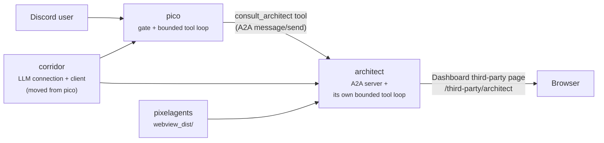
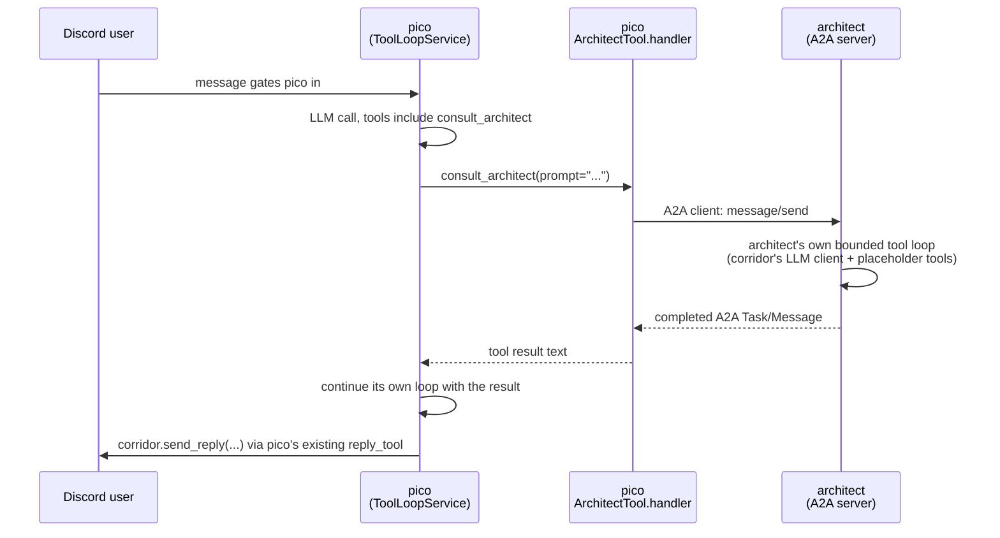
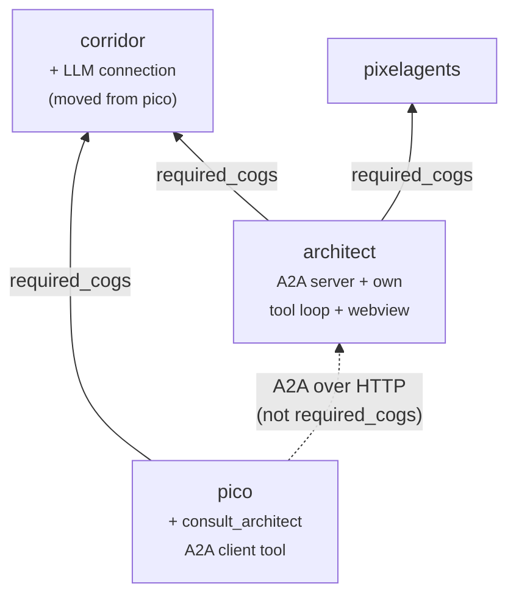

# The `architect` cog: an A2A-reachable agent with its own webview

**Status: implemented**, except the design-review/task-breakdown
placeholder tools' real functionality (explicitly out of scope, see
section 8) and an in-browser editor for architect's office. Sections 1-7
describe what's actually running today; section 9's checklist is
complete. Editing architect's own layout — once out of scope, see
section 8's own note — is now implemented; see
`docs/architect-semantic-ir-design.md` for that design.

**Superseded in part by `docs/agent-directory-design.md`:** section 4's
"Server side (architect)" subsection (architect binding its own A2A
listener/port) and "Client side (pico)" subsection (pico's hardcoded
`[p]pico architecturl` + single `ArchitectTool`) no longer describe what's
actually running. Architect now registers its `AgentCard`/`AgentExecutor`
with corridor's own shared A2A listener instead of binding a listener of
its own, and pico discovers every registered agent dynamically instead of
being pointed at one hardcoded URL — see `docs/agent-directory-design.md`
for the current design. Section 4's description of architect's own
`AgentExecutor`/tool-loop shape, and its "not a `required_cogs` edge"
reasoning for `pico -> architect`, both remain accurate.

## 1. Overview

Today `pico` is the only LLM-backed agent in this repo, and it is
exclusively Discord-facing: a human message gates it in, and its only
output channel is a Discord reply (`docs/architecture.md` §4). `architect`
introduces a second, independent LLM agent that no Discord user talks to
directly. Instead:

- `architect` exposes itself over the
  [A2A (Agent2Agent) protocol](https://a2a-protocol.org/) — an agent card
  plus task/message endpoints another agent can call.
- `pico` becomes an A2A **client**: one new tool in its existing bounded
  tool-calling loop lets it delegate a sub-task to `architect` and fold the
  result back into its own reply, without pico's gate/loop shape changing.
- `architect` serves its own webview, following the same
  Dashboard-third-party-page pattern `floorplan` already uses to serve
  `pixelagents`' built bundle — a second, independent consumer of the same
  build output, not a second copy of floorplan's office.
- `architect` and `pico` share one LLM connection. That connection's
  settings and HTTP client move out of `pico` and into `corridor`, so
  `architect` doesn't have to duplicate them and `pico` doesn't have to
  depend on a sibling leaf cog to reach them.



## 2. LLM provider migration: `pico` → `corridor`

### What moves, what stays

`pico/infrastructure/llm_client.py` (`LiteLLMClient`, the wire models, and
`LLMRequestError`) relocates verbatim to `corridor/infrastructure/llm_client.py`.
Only the **connection** — endpoint, virtual key, model — and the shared
HTTP client move. Each consumer keeps its own per-agent behavior settings:

| Setting | Owner today | Owner after this change |
|---|---|---|
| `llm_base_url`, `llm_api_key`, `llm_model` | `pico` (global Config) | **`corridor`** (global Config) |
| Shared `LiteLLMClient` instance | `pico` (`CogBase.__init__`) | **`corridor`** (`CogBase.__init__`) |
| `max_tool_calls` | `pico` (global Config) | `pico` (unchanged) |
| `system_prompt` | `pico` (global Config) | `pico` (unchanged) |
| per-guild `enabled` | `pico` (guild Config) | `pico` (unchanged) |
| `architect`'s own per-turn tool-call budget / system prompt | — | `architect` (new, mirrors pico's shape) |

This mirrors the existing convention corridor already sets for permission
tiers and reply style ([[project-corridor-permission-redesign]],
`docs/architecture.md` §2): the shared, provider-facing piece lives in
corridor once two dependents need the same thing; per-agent behavior stays
with the agent.

### New corridor surface

Corridor gains an `LLMProviderService` (application layer) wrapping the
relocated settings repository fields and the shared `LiteLLMClient`,
exposed on the Cog the same way `send_reply`/`register_tool` already are:

```python
async def llm_settings(self) -> LLMSettings:  # base_url, api_key, model
    ...

def llm_client(self) -> LiteLLMClient:
    """One shared client for the Cog's lifetime, started lazily on first use."""
```

`pico`'s `GateService`/`ToolLoopService` and `architect`'s equivalent loop
service are unchanged in shape — both already depend only on the narrow
`GateLLM`/`ToolLLM` Protocols (`pico/application/gate_service.py`,
`pico/application/tool_loop_service.py`), which `corridor.llm_client()`
satisfies without modification. Only construction moves: `CogBase.__init__`
in both `pico` and `architect` calls `self._corridor.llm_client()` instead
of building its own `LiteLLMClient()`, once `cog_load` has resolved
`corridor` — mirroring how both cogs already defer `self._corridor` itself
until `cog_load` (`pico/adapters/cog_base.py`).

### Command migration: `[p]pico llm` → `[p]corridor llm`

| Before | After |
|---|---|
| `[p]pico llm endpoint <url>` | `[p]corridor llm endpoint <url>` |
| `[p]pico llm key <key>` | `[p]corridor llm key <key>` |
| `[p]pico llm model <model>` | `[p]corridor llm model <model>` |
| `[p]pico maxtoolcalls <n>` | unchanged (pico-owned) |
| `[p]pico prompt ...` | unchanged (pico-owned) |
| `[p]pico status` | still shows LLM fields, now reading them from `corridor.llm_settings()` instead of pico's own repository |

Following the precedent already set for corridor's permission-group
redesign ([[project-corridor-permission-redesign]]): **this is a breaking
change with no migration path.** `pico`'s existing `llm_base_url` /
`llm_api_key` / `llm_model` Config values are dropped, not copied forward,
the same way the old `moderator_role_ids`/`privileged_role_ids` values
were dropped rather than migrated. A bot owner reconfigures once via
`[p]corridor llm ...` after upgrading. `pico`'s `info.json` install
message and end-user-data statement need updating to reflect that the LLM
connection is now corridor's responsibility.

## 3. The `architect` cog

Scaffolded from `.cookiecutter/cog-cookiecutter/` per
[[cog-cookiecutter-template]] — same hexagonal domain/application/
infrastructure/adapters split every other cog in this repo uses, sized for
what `architect` actually needs:

```
architect/
  __init__.py                    # deferred-import pattern, per the cookiecutter's own convention
  architect.py                   # composition root (mirrors pico.py)
  dependency_loader.py           # ensure_corridor_loaded / ensure_pixelagents_loaded
  domain/
    models.py                    # AgentTurnContext, ToolSpec (own copy, same shape as pico's)
  application/
    tool_loop_service.py         # architect's own bounded LLM tool-calling loop (reuses corridor's ToolLLM)
  adapters/
    cog_base.py                  # wires services, owns the A2A server + webview lifecycle
    commands.py                  # [p]architect status / settings (owner + admin scoped, see §6)
  infrastructure/
    settings_repository.py       # architect's own Config: system_prompt, max_tool_calls, a2a port, enabled
    a2a_server.py                # §4
    webview.py                   # own WebviewAssetProvider instance, same shape as floorplan's (§5)
  tools/
    base.py                      # ToolSpec Protocol (copy of pico/tools/base.py's shape)
    placeholder_tools.py         # §4's no-op tools
  tests/
```

`architect`'s own `ToolSpec`/tool-loop code is a **parallel copy** of
pico's shape, not a shared import — `pico` and `architect` are independent
agents with independent tool sets and independent per-turn budgets; the
only thing they share is the LLM connection now living in corridor
(§2). This keeps `contracts/`'s job (CDC testing) and each cog's own
domain unambiguous ([[project-contracts-purpose]]) instead of inventing a
new shared-library folder for two call sites — revisit only if a third
agent needs the same tool-loop shape.

`info.json`:

```json
{
    "required_cogs": {
        "corridor": "https://github.com/pixel-agents-hq/pixel-agents-cogs",
        "pixelagents": "https://github.com/pixel-agents-hq/pixel-agents-cogs"
    },
    "requirements": ["aiohttp", "pydantic>=2.6,<2.11", "a2a-sdk"],
    "hidden": false
}
```

## 4. The A2A surface

`architect` uses the official `a2a-sdk` (PyPI) rather than hand-rolling the
protocol — the same reasoning `pico/infrastructure/llm_client.py` already
gives for reaching for `aiohttp` directly instead of the `openai`/`litellm`
packages doesn't apply here: there's no known upstream SDK bug to route
around, so the default is to take the maintained implementation.

### Server side (`architect`)

- `architect` publishes an **AgentCard** describing itself (name,
  description, one skill per placeholder tool) at the SDK's well-known
  discovery path.
- An `AgentExecutor` (the SDK's extension point) drives `architect`'s own
  `ToolLoopService` per incoming A2A message: build a turn from the
  message content, run the bounded tool-calling loop against corridor's
  LLM client with `architect`'s own placeholder tools and system prompt,
  and emit the loop's final text as the task's completed A2A Message.
- This is a **separate network listener** from both Discord and Red
  Dashboard — A2A is a machine-to-machine HTTP/JSON-RPC surface, not a
  browser page, so it does not go through the Dashboard third-party page
  router. `architect` binds its own host/port (configurable via
  `[p]architect a2a port <n>`, bot-owner scope) and runs it as a
  Cog-lifetime background task, the same lifecycle shape floorplan already
  uses for its own WebSocket server (`floorplan/infrastructure/websocket.py`,
  started/stopped from `cog_load`/`cog_unload`).

### Placeholder tools

`architect/tools/placeholder_tools.py` ships tools with real schemas and
descriptions but no real effect — each handler returns a static
acknowledgement mapping (e.g. `{"status": "not_implemented"}`) without
touching Discord, corridor, or any external system. Exactly which tools
ship as placeholders (a design-review tool? a task-breakdown tool?) is
deferred to the implementation pass; this document only fixes the
*mechanism* — same `ToolSpec` Input/Output-model shape pico's tools already
use — not the tool list itself.

### Client side (`pico`)

`pico` gains one new tool, `pico/tools/architect_tool.py`, following the
existing `ToolSpec` contract (`pico/tools/base.py`) exactly like
`reply_tool.py` and the cross-cog adapter in `pico/tools/cross_cog.py`
already do:



`pico`'s own bounded-loop guarantee (`docs/architecture.md` §4) is
unaffected: `ArchitectTool.handler` is not itself a Discord send, so the
"only `ReplyTool.handler` touches Discord" invariant
(`contracts/discord_replies/lint_reply_channel.py`) still holds — pico
still only ever replies through corridor, regardless of how many
intermediate tool calls (including this new one) it makes to produce that
reply. `pico` needs one new owner-scoped setting for architect's A2A base
URL (`[p]pico architect url <url>`), analogous to how it already points at
an LLM endpoint.

## 5. The webview surface

`architect` depends on `pixelagents` the same way `floorplan` does, and
gets its **own** `WebviewAssetProvider` instance (same class, a second
instantiation — `floorplan/infrastructure/webview.py`'s implementation is
generic over "one immutable webview root" already) pointed at
`pixelagents.webview_bundle_status()`, the identical cross-cog surface
floorplan already reads (`docs/architecture.md` §2's
`pixelagents -> floorplan` edge gains a second, parallel
`pixelagents -> architect` edge). `architect` mounts it under its own
Dashboard route, `/third-party/architect`, with its own `base_href` —
exactly floorplan's `DashboardMixin` shape
(`floorplan/adapters/dashboard.py`), duplicated rather than shared for the
same reason the tool-loop code is duplicated in §3: two independent
consumers of one build artifact, not a shared library
([[project-contracts-purpose]]).

`architect` renders its **own** office layout — a separate Config field,
seeded once from pixelagents' bundled default layout and changed only
through future Discord commands/tools, never through floorplan's own
per-guild office Config. This required more than separate storage: the
vendored webview bundle computes its live WebSocket URL from the page's
*hostname alone* (`wss://${window.location.host}/ws`, verified directly
against the built bundle's own minified source), not the page's path, so
two Dashboard pages under the same host would otherwise silently connect
to the exact same backend regardless of which cog served the static HTML
— a real incident this design originally missed, since it assumed a
static-only page would trivially stay independent. It doesn't: floorplan's
existing `/ws` server would answer *both* pages' connections, making
architect's page mirror floorplan's live layout with zero involvement of
architect's own Config or Python code at all.

The fix has three parts:

1. **`architect` runs its own office WebSocket server**
   (`infrastructure/websocket.py`, `infrastructure/client_hub.py`) — a
   deliberate parallel copy of floorplan's `WebSocketServer`/`ClientHub`,
   pared down to read-only (no ticket/editor-authorization concept at all,
   since nothing can mutate this layout from the browser yet). On its one
   handled inbound message, `webviewReady`, it sends the connecting client
   a bootstrap sequence built by **reusing**
   `pixelagents.application.office.OfficeService.bootstrap_messages`
   directly (not duplicated — unlike the transport classes, `OfficeService`
   is pixelagents' own generic, framework-neutral application layer, the
   intended shared surface floorplan itself already builds its own
   bootstrap from) with an always-empty seat/agent roster (`NullSeatRepository`)
   and architect's own stored layout.
2. **A distinct external path, `/architect/ws`**, so an operator's
   reverse-proxy rule can route it to architect's own bind (`ws_host`/
   `ws_port`, its own Config fields, defaulting to `127.0.0.1:8932`)
   independently of whatever rule already routes `/ws` to floorplan's.
   This is a real, required deployment change outside this repo's control
   — without it, architect's WebSocket server only accepts local
   connections and the webview page shows no live layout at all
   (`[p]architect status`'s "Office WebSocket" field reports the local
   bind's own state, not proxy reachability).
3. **A client-side rewrite shim** (`infrastructure/webview.py`'s
   `WS_REWRITE_SHIM`) injected into architect's served page, *before*
   `TICKET_SHIM`: it patches `window.WebSocket` to rewrite any URL ending
   in `/ws` to end in `/architect/ws` instead, before the real connection
   is ever opened. Injection order matters — `TICKET_SHIM` captures
   whatever `window.WebSocket` already is as its own `Native` at *its*
   injection time, so running the rewrite shim first means `TICKET_SHIM`
   transparently wraps the rewriting constructor; both patches compose
   without either needing to know about the other. Verified for real: this
   shim's actual JavaScript is executed in Node (not just read) in
   `architect/tests/test_ws_rewrite_shim.py`, including the composition
   case.

`architect`'s own live WebSocket connection was verified end-to-end (not
mocked) in `architect/tests/test_office_websocket_live.py`: a real
loopback server, a real `aiohttp` client, `webviewReady` in, the seeded
`layoutLoaded` message out. What the webview actually *displays* beyond
the raw layout — its own agent's pixel-sprite representation, a status
view, … — remains deferred, same as originally scoped.

## 6. Discord command surface

`architect` is not hidden the way `corridor` is — it ships a small,
mostly owner/admin-scoped command group mirroring `pico`'s
(`pico/adapters/commands.py`), but with no equivalent of `[p]pico enabled`
gating a *reactive* Discord presence, since architect never reacts to
Discord messages directly:

- `[p]architect status` — LLM connection (read via `corridor.llm_settings()`),
  system prompt, max tool calls, A2A listener and office WebSocket server
  host/port and up/down state, webview asset status, layout-seeded state.
  Open to anyone who can run bot commands, matching `[p]pico status`.
- `[p]architect a2a host/port <n>` — bot owner only; each live-restarts the
  A2A listener immediately.
- `[p]architect ws host/port <n>` — bot owner only; unlike the A2A pair,
  these persist the setting and ask the owner to reload the cog to rebind
  — matching floorplan's own `[p]floorplan wsport` convention (rebinding a
  socket server with already-connected browser tabs is riskier than an
  explicit reload).
- `[p]architect maxtoolcalls <n>` / `[p]architect prompt ...` — bot owner
  only, same shape as pico's equivalents.

No `[p]architect enabled` per-guild toggle: architect's A2A listener,
office WebSocket server, and webview are process-scoped, not per-guild, so
there is no per-guild on/off switch to design here — only `pico`'s
consumption of it is guild-scoped, already covered by `[p]pico enabled`.

## 7. Updated dependency graph



The `pico -> architect` edge is deliberately **not** a `required_cogs`
entry: it's a network call to a configured URL, the same kind of edge
`toolbox -> pixelagents` already is in `docs/architecture.md` §1 (there,
"operational, not coded"; here, "networked, not coded") — pico degrades to
"the tool errors" if `architect` is unloaded or unreachable, it does not
fail to load.

## 8. Out of scope for this pass

- Real implementations of the design-review/task-breakdown placeholder
  tools specifically (`review_design`, `break_down_task`) — still
  no-ops. Editing architect's own layout is **no longer** out of scope:
  see `docs/architect-semantic-ir-design.md` for the Semantic IR, its
  `OfficeLayoutService` mutation surface, the LLM tools
  (`tools/office_tools.py`), and the `[p]architect office ...` Discord
  commands (`adapters/office_commands.py`) that now both write to it.
- What `architect`'s webview actually displays beyond the raw layout (its
  own agent's pixel-sprite representation, a status view, …).
- An in-browser editor for architect's office (no `/session` ticket
  endpoint, no editor-authorization concept, no `saveLayout` handling —
  every WebSocket connection is a read-only viewer).
- Live-rebinding the office WebSocket server on a `[p]architect ws
  host/port` change (persist-only + reload, matching floorplan's own
  convention — see §6).
- Streaming partial A2A task updates back into pico's tool loop (the
  sequence in §4 treats the A2A call as request/response — the SDK's
  streaming task-update surface is available but unused here).
- Any auth/signing on the A2A listener or the office WebSocket server
  beyond each binding to a bot-owner-configured host/port; if `architect`
  is ever exposed outside a trusted network, that needs its own design
  pass.
- A shared tool-loop/tool-registry library for `pico` and `architect` —
  revisit only once a third agent needs the same shape (§3).

## 9. Implementation checklist

All done. Notable departures from the plan as originally written,
discovered during implementation:

- The installed `a2a-sdk` (1.x) turned out to use **protobuf message**
  wire types (`a2a.types`, generated from `a2a_pb2`), not the plain
  pydantic models an earlier SDK generation used — §4's code sketches
  predated this discovery. `architect/infrastructure/a2a_server.py` is
  written against the real, installed API.
- `a2a-sdk`'s server-side HTTP routes are hard-coupled to Starlette
  (`starlette.requests.Request`/`starlette.responses.Response`), which
  pulled in `uvicorn` as the ASGI server actually accepting connections —
  not a choice made independently of picking the real SDK, but a direct
  consequence of it.
- §5's `WebviewAssetProvider` ended up a full duplicate of floorplan's
  class (`architect/infrastructure/webview.py`), not an import from
  `floorplan` — importing it directly would force `floorplan`'s own
  package onto disk for anyone installing `architect` alone, since Red's
  Downloader only guarantees a cog's own `required_cogs` install
  alongside it, and `floorplan` was never one of architect's
  dependencies. `architect/adapters/dashboard.py` is also narrower than
  floorplan's: no `/session` ticket endpoint or WebSocket server, since
  there's no live-editable state to authorize an editor into yet.
- A real production incident (§4/§9 territory, not foreseen by the
  design): uvicorn's own `Server.startup()` calls `sys.exit()` on a bind
  failure, and `SystemExit` raised inside an `asyncio.Task` is re-raised
  by CPython's own Task implementation straight out of the event loop —
  bypassing any `try/except`, however broad, wrapped around that task's
  result. `A2AServer.start()` now probes the bind itself, synchronously,
  before ever creating uvicorn's task, so a failure is an ordinary
  `OSError` instead. See the git history on `architect/infrastructure/a2a_server.py`
  for the full incident writeup.
- A second real incident, reported after the webview first shipped
  static-only (item 7 below): `/third-party/architect` and
  `/third-party/floorplan` rendered the *same* live layout, because
  nothing in item 7's original scope gave architect its own WebSocket
  server — the vendored bundle's hardcoded, page-path-independent
  `wss://<host>/ws` meant architect's page was quietly talking to
  floorplan's real backend the whole time. §5 above now covers the full
  fix (architect's own `WebSocketServer`/`ClientHub`, the distinct
  `/architect/ws` path, and the client-side rewrite shim) and why a
  static-only webview was never actually going to stay independent.

1. ✅ Move `LiteLLMClient` + wire models from `pico/infrastructure/` to
   `corridor/infrastructure/`; add `corridor`'s `LLMProviderService` and
   `llm_settings()`/`llm_client()` surface.
2. ✅ Move the `llm_base_url`/`llm_api_key`/`llm_model` Config fields and the
   `[p]pico llm ...` command group into `corridor`; update `pico`'s
   `CogBase`, `commands.py`, `info.json` accordingly. No migration of old
   pico-side values.
3. ✅ Scaffold `architect/` from `.cookiecutter/cog-cookiecutter/`.
4. ✅ Add `architect`'s settings repository, tool-loop service, and
   placeholder tools.
5. ✅ Add the `a2a-sdk` dependency; implement the `AgentCard` +
   `AgentExecutor` and the Cog-lifetime listener start/stop.
6. ✅ Add `pico`'s `ArchitectTool` + its A2A base-URL setting.
7. ✅ Add `architect`'s `WebviewAssetProvider` instance and
   `/third-party/architect` Dashboard route.
8. ✅ Update `docs/architecture.md` (dependency graph, ownership map) and
   `docs/AGENTS.md`'s per-package summary once implemented.
9. ✅ Give `architect` its own placeholder layout store (Config field,
   seeded from pixelagents' bundled default) — added after item 7 shipped,
   once it became clear the webview needed somewhere of its own to render
   from.
10. ✅ Give `architect` its own live office WebSocket server, distinct
    external path (`/architect/ws`), and client-side URL-rewrite shim —
    added after discovering item 7's static-only webview silently shared
    floorplan's live layout (see the incident note above).
