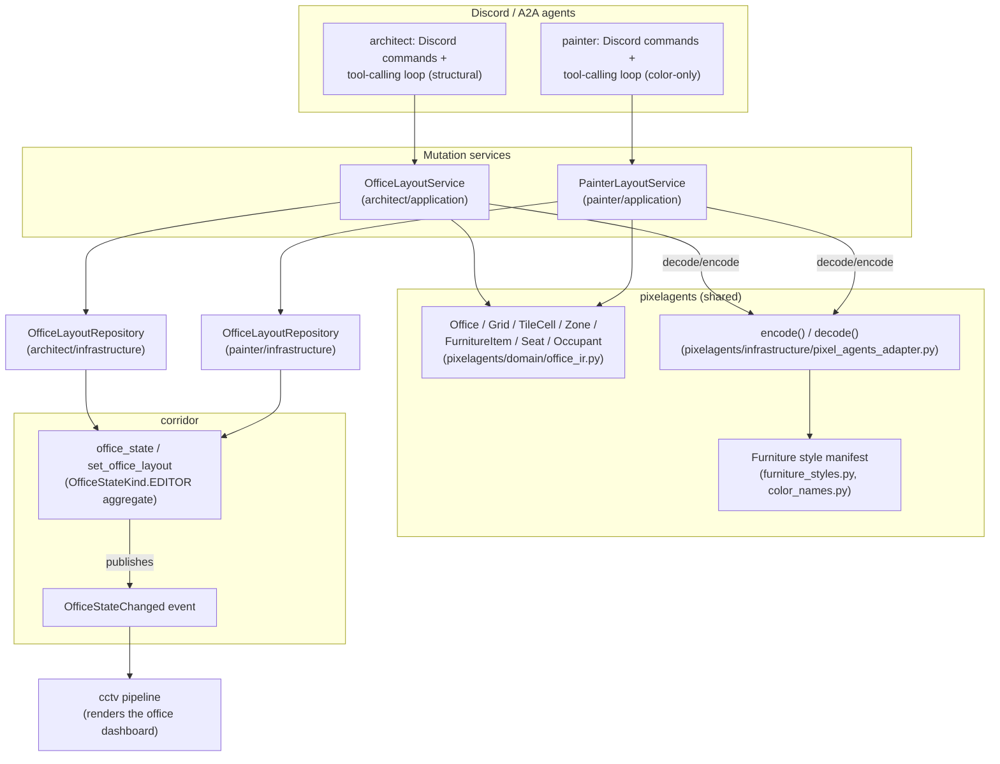
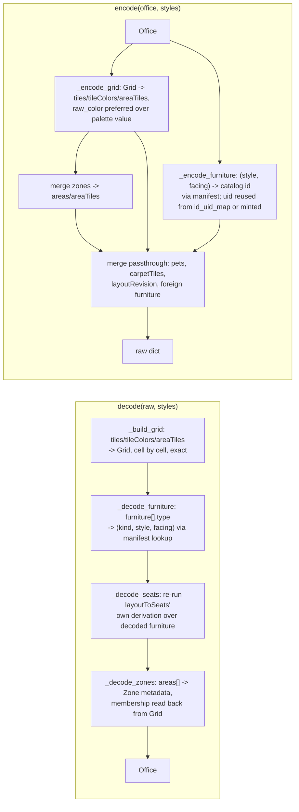
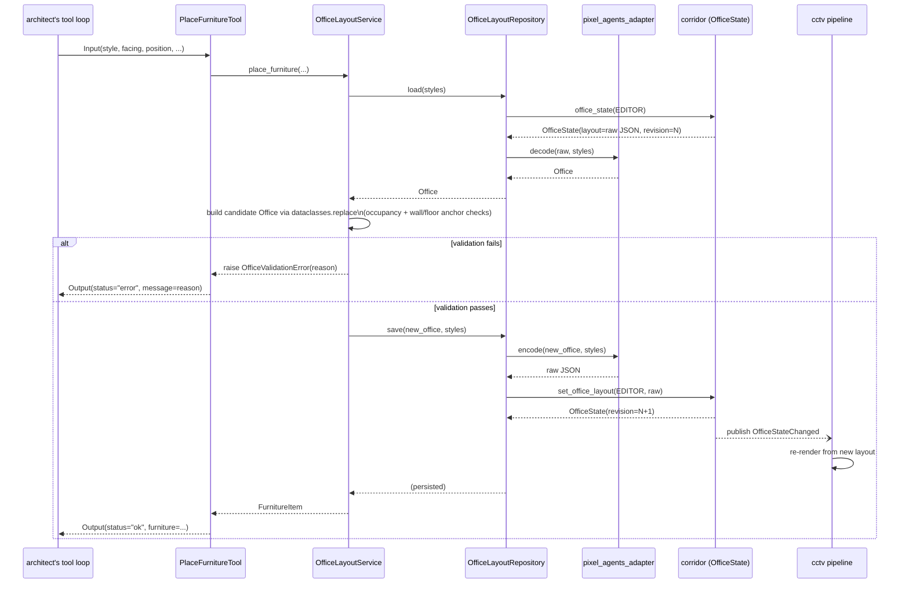
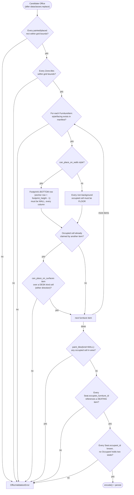

# Semantic IR: architect/painter ↔ Pixel Agents office

The office layout the webview renders is a flat, position-indexed JSON
blob: palette-indexed tile arrays, HSB color-shift objects, and furniture
entries keyed by opaque asset IDs like `CUSHIONED_CHAIR_FRONT:left`. That
shape is exactly what a canvas renderer wants and exactly what an LLM
reasons about badly — it has no notion of "desk," "seat facing a
whiteboard," or "the Quiet Zone" without first reverse-engineering it from
index arithmetic.

This document specifies the **Semantic Intermediate Representation
(IR)** that sits between `architect`'s and `painter`'s LLM-facing tool
surfaces and that raw Pixel Agents JSON, and the **adapter** that
translates between them, losslessly, in both directions.

## 1. Overview

Two independent A2A agents mutate one shared office layout:

- **architect** owns every structural mutation — placing/moving/removing
  furniture, painting floor and wall tiles, creating and resizing zones.
- **painter** owns every color mutation on the same layout — recoloring
  tiles and furniture — and can never change structure: no method on its
  service surface accepts a `kind`/`material` parameter, so it is
  physically incapable of turning a floor cell into a wall or moving a
  piece of furniture, not merely instructed not to.

Both agents build their tools on the identical `Office` IR and the
identical `encode()`/`decode()` codec, so there is exactly one place that
understands "what a Pixel Agents layout means" and exactly one place that
knows how to turn that understanding back into renderer JSON.

Two design decisions shape everything below:

> Do not design a prettier version of the Pixel Agents JSON.

Renaming `furniture` to `objects` and `col`/`row` to `x`/`y` while keeping
the same flat, position-indexed, renderer-shaped structure would not be a
semantic model. The test applied to every field: **would an LLM (or a
human giving Discord commands) ever want to reason about this without
knowing it's about rendering?** If yes, it belongs in the IR as a semantic
concept. If the honest answer is "only the canvas renderer cares," it
stays out of the IR and is either dropped, defaulted, or carried through
opaquely.

> The IR is a lossless data structure, not a lossless prompt.

Losslessness does not mean exposing every raw number to the LLM — the
IR's internal model (`Office.grid`, §3.3) retains every bit Pixel JSON
carries, while the LLM-facing tool schemas stay exactly as semantic as
before: a `material` integer the LLM picks without needing to know what
it renders as, never a raw tile array dumped into a prompt.

## 2. Grounding: what Pixel Agents' JSON actually contains

| JSON field | Real shape | What it encodes |
|---|---|---|
| `cols`, `rows` | `int` | Grid dimensions (default 21×22) |
| `tiles` | `number[cols*rows]`, row-major | Per-tile floor pattern index (`0`=wall, `1`-`9`=floor patterns, `255`=void/outside) |
| `tileColors` | `Array<{h,s,b,c} \| null>`, parallel to `tiles` | Per-tile HSB color-shift, applied to the floor *or wall* sprite — upstream's `wallTiles.ts`/`renderer.ts` colorize wall sprites from it exactly like floor ones; `null` on void, or on a wall/floor tile with no color set |
| `furniture` | `{uid, type, col, row, color?}[]` | Placed furniture: `type` is a catalog asset ID (e.g. `DESK_FRONT`, `WOODEN_CHAIR_SIDE:left`), `col`/`row` is its top-left footprint tile, `color` is an optional HSB override in colorize mode |
| `pets` | `{id, petType}[]` | Decorative pets; `petType` indexes a loaded sprite array |
| `carpetTiles` | `Array<{variant, color?, accentColor?, order?} \| null>` | Decorative overlay layer, walkable |
| `areas` | `{label, color}[]` | Named translucent zone definitions, `color` a hex string |
| `areaTiles` | `Array<string \| null>`, parallel to `tiles` | Per-tile area-label assignment (FK into `areas`) |
| `layoutRevision` | `int?` | Bundled-default migration marker, not layout content |

Derived by the webview's renderer, never stored:

- **Seats.** Every "chair"-category item's footprint anchor becomes a
  seat. Facing comes from the chair's own orientation, or (absent that)
  an adjacent desk tile, or defaults downward. A seat is implied by
  furniture placement plus the catalog's `category === 'chairs'` flag —
  never itself a JSON field.
- **Walkability.** Derived from `tiles` (wall/void) plus each furniture
  item's catalog `footprintW/H` and `backgroundTiles` (rows of a
  footprint that don't block walking, e.g. wall art).
- **Desk-surface placement.** Whether an item can sit "on" a desk comes
  from the catalog's `canPlaceOnSurfaces` flag plus z-sorting, not a
  parent/child field in the JSON.

The furniture **catalog** (`furniture-catalog.json`) carries the only
real semantic hints upstream already has: `category` (`desks`, `chairs`,
`storage`, `decor`, `electronics`, `wall`, `misc`), `isDesk`,
`canPlaceOnSurfaces`, `canPlaceOnWalls`, `backgroundTiles`,
`footprintW`/`footprintH`, and rotation/state-group membership
(front/back/left/right, on/off). This is the seam the IR builds on. A
concrete detail that matters for placement math: footprint is **not** a
transpose of one `(w, h)` pair — `DESK_FRONT` is `footprintW:3,
footprintH:2, backgroundTiles:1`, while `DESK_SIDE` (the same style,
rotated) is `footprintW:1, footprintH:4`. Footprint is looked up per
concrete facing, never derived by rotating a single number.

What carries no semantic meaning: tile pattern indices (`1`-`9` are
arbitrary bundled patterns, not "carpet" vs. "wood"), HSB color-shift math
and raw `col`/`row` integers (implementation coordinates, not "near the
window" — though `col`/`row` is exactly the coordinate system the IR uses
directly), and asset-ID suffixes like `:left` (a mirrored-variant marker
internal to the rotation-group system, not a semantic property).

## 3. Architecture



- **pixelagents** owns the IR dataclasses, the codec, and the furniture
  style / color-name manifests. It has zero knowledge of Discord, LLM
  tool schemas, or which cog is calling it.
- **architect** and **painter** each own a thin `OfficeLayoutRepository`
  and a mutation service (`OfficeLayoutService`,
  `PainterLayoutService`) built only against the IR types and the
  codec's `decode`/`encode` function signatures — never against Pixel
  JSON's shape directly. Both services' Discord commands and LLM tools
  call the same methods; there is exactly one mutation surface per cog,
  two callers each.
- **corridor** persists the raw JSON opaquely as one revision of its
  `editor`-kind `OfficeState` aggregate (`OfficeStateKind.EDITOR`) and
  publishes `OfficeStateChanged` whenever a save succeeds. Corridor never
  parses the layout it stores — it is exactly as opaque to corridor as it
  was to the old single-Config-value design, just versioned and
  fan-out-capable now instead of a single mutable field.
- **cctv** subscribes to `OfficeStateChanged` and renders the office
  dashboard from whatever `OfficeState.layout` it receives — it never
  calls `decode()`/`encode()` itself; it consumes the same raw JSON shape
  the webview always has.

## 4. Domain model / schema

All types below live in `pixelagents/domain/office_ir.py` — plain,
frozen, `slots=True` dataclasses with **zero framework imports** (no
`pydantic`, no `redbot`) and, just as importantly, zero imports of this
package's own `pixel_agents_adapter.py`/`color_names.py`/
`furniture_styles.py`. The module must never know an asset-ID string or
HSB math itself; it *does* store raw tile pattern integers
(`TileCell.material`) and raw HSB tuples (`raw_color` fields below), but
that is a lossless-*storage* decision, not a Pixel-Agents-*format*
import. A contract test statically walks the module's AST and asserts
this: no absolute import of `pydantic`/`redbot`/`discord`, and no
relative import at all, since there is no sibling module in this package
`office_ir.py` should ever need.

`architect/domain/__init__.py` and `painter`'s own domain module both
just re-export these same types from `pixelagents.domain.office_ir` —
there is exactly one copy of every IR dataclass, never a per-cog fork.
`architect/domain/models.py` holds only `GlobalSettings` (architect's own
tool-loop configuration), unrelated to the office IR.

### 4.1 Design choices

- **Grid coordinates, not pixels.** The IR keeps integer `col`/`row` tile
  coordinates — the one spatial concept every layer already agrees on —
  rather than inventing an abstract coordinate space Pixel Agents would
  have to re-derive. Z-sort ordering, sprite mirroring, and per-pixel
  offsets stay out of the IR entirely; they are pure rendering concerns
  the adapter and the webview own.
- **`Grid` is a direct, exhaustive, one-cell-per-tile mirror of
  `tiles`/`tileColors`/`areaTiles`** — every cell, always, not just
  non-wall ones. There is no inference step between the raw arrays and
  the IR: cell `i` of `Grid.cells` corresponds exactly to `tiles[i]`.
  This is what makes the round trip lossless — an untouched cell's exact
  material, color, and zone label survive any number of encode/decode
  cycles, because nothing about encoding a *different* cell ever touches
  it.
- **`Zone` is a label attached to grid cells, not a shape derived from
  them.** A zone can span multiple visually distinct floor regions, and
  one region can carry multiple zones — matching exactly how Pixel
  Agents' own zone/area painting already works upstream (§2): there is no
  room concept anywhere in Pixel Agents' own source, so the IR does not
  invent one. A rectangle an LLM wants to treat as "a room" is just
  `paint_tiles` (shared floor material/color) plus, optionally,
  `create_zone` (a name) — no separate persisted grouping concept exists,
  because it would carry no information `Zone` doesn't already.
- **Furniture is a `FurnitureItem` with a `kind`**, derived from the
  catalog's `category`/`isDesk`/`canPlaceOnSurfaces` flags, not the raw
  asset ID. `kind` is what an LLM reasons about ("place a desk here");
  `style` is a stable, non-semantic handle the adapter resolves to a
  concrete asset ID (§5.4). Every valid `style` value is one row of a
  **generated** manifest, not a hand-picked example string, so an LLM's
  tool calls are constrained to styles that actually exist in whichever
  `pixel-agents` commit is currently vendored.
- **Orientation is a direction, not an asset-ID suffix.** `:left`/
  `_FRONT`/`_BACK` naming becomes a `facing: Direction` enum
  (`north`/`south`/`east`/`west`) on the IR item. The adapter re-derives
  the correct concrete asset ID *and* footprint from `(style, facing)`
  via the manifest's own rotation-group data — never by rotating a single
  canonical footprint.
- **Seats are first-class IR entities**, not implied by chair placement.
  Pixel Agents derives seats from furniture at render time; the IR
  declares a `Seat` explicitly, linked to the `FurnitureItem` it sits on
  and, if applicable, an `Occupant`.
- **Occupants are IR entities, not seat metadata.** No Pixel Agents JSON
  field corresponds to an occupant today — `Occupant` is modeled so
  "assign agent X to the seat near the whiteboard" has somewhere to live
  once a creation path exists; there is no such path yet, so
  `Office.occupants` decodes as `[]` today.
- **Placement is tile-exact, not pixel-exact.** A `FurnitureItem`'s
  occupied cells, a painted floor rectangle, and a painted wall rectangle
  are all exact, real, multi-tile-aware placements, computed from the
  style manifest's real per-facing footprint. What stays out of scope is
  anything *below* the tile grid — z-sort order, sprite mirroring,
  per-pixel offsets — which remains the adapter/renderer's business
  alone.
- **A raw ground-truth color travels alongside every semantic color
  name.** `TileCell`, `FurnitureItem`, and `Zone` each carry both a
  semantic `color` (a fixed palette name, or nearest-match for
  `Zone.color`) and a `raw_color` — the exact `(h, s, b, c)` tuple (or hex
  string, for `Zone`) that cell/item/zone decoded with, when it hasn't
  been repainted since. `encode()` always prefers `raw_color` over the
  semantic name's canonical palette value when both are present (§5.3),
  so an untouched color round-trips byte-for-byte; only a cell or item a
  mutation actually repaints loses its exact prior value in favor of a
  freshly authored one. `raw_color` is `None` exactly when there is no
  more precise ground truth than the semantic name itself — a color a
  mutation just authored, or a cell with no color set at all.

### 4.2 Entities

```python
# pixelagents/domain/office_ir.py

from dataclasses import dataclass, field
from enum import Enum


class Direction(Enum):
    NORTH = "north"   # away from viewer / "back"
    SOUTH = "south"   # toward viewer / "front"
    EAST = "east"     # viewer's right / "right"
    WEST = "west"     # viewer's left / "left"


class FurnitureKind(Enum):
    """Coarse semantic category an LLM reasons in. Derived from the
    catalog's own category/isDesk flags (section 5.4), not invented."""
    DESK = "desk"
    SEATING = "seating"      # chairs, benches, sofas
    STORAGE = "storage"      # bookshelves, bins
    DECOR = "decor"          # plants, paintings, clocks
    ELECTRONICS = "electronics"
    WALL_FIXTURE = "wall_fixture"   # whiteboard, wall-mounted decor
    MISC = "misc"


@dataclass(frozen=True, slots=True)
class GridPosition:
    col: int
    row: int


@dataclass(frozen=True, slots=True)
class GridRect:
    """A solid tile rectangle, not a polygon -- a zone's exact per-tile
    membership always lives on Grid.cells[i].zone_label directly, this is
    just the bounding-box summary. Half-open like range(): the rectangle
    covers columns top_left.col .. top_left.col + width - 1."""
    top_left: GridPosition
    width: int
    height: int

    def contains(self, position: GridPosition) -> bool: ...
    def overlaps(self, other: "GridRect") -> bool: ...
    def positions(self) -> list[GridPosition]: ...   # every cell, row-major


class TileKind(Enum):
    """Derived, never independently authored -- see TileCell's own
    invariant. Kept as an explicit enum purely for readability at every
    "is this walkable/wall/void" call site."""
    WALL = "wall"    # Pixel JSON pattern 0
    VOID = "void"    # Pixel JSON pattern 255 -- outside the playable map
    FLOOR = "floor"  # Pixel JSON pattern 1-9


@dataclass(frozen=True, slots=True)
class TileCell:
    """One grid cell, exactly mirroring one tiles[i]/tileColors[i]/
    areaTiles[i] triple. kind and material must never disagree -- use
    TileCell.floor()/.wall()/.void() below, never the raw constructor
    with a hand-picked kind."""
    kind: TileKind
    material: int | None   # 1-9 for FLOOR, always None otherwise -- opaque,
                            # no semantic meaning, constrained 1-9 wherever
                            # a tool accepts it
    color: str | None      # semantic color name, FLOOR or WALL (walls carry
                            # a real rendered color upstream too -- VOID never does)
    raw_color: tuple[int, int, int, int] | None  # exact (h, s, b, c) this
                            # cell decoded from, when never repainted since;
                            # None once a mutation authors a new color
    zone_label: str | None  # which Zone owns this cell, if any

    @classmethod
    def wall(cls, *, color=None, raw_color=None, zone_label=None) -> "TileCell": ...
    @classmethod
    def void(cls, *, zone_label=None) -> "TileCell": ...
    @classmethod
    def floor(cls, material: int, color, *, raw_color=None, zone_label=None) -> "TileCell": ...


@dataclass(frozen=True, slots=True)
class Grid:
    """The lossless ground truth. Row-major, exactly width * height
    cells, always -- constructed once per decode(), replaced wholesale
    (never patched in place) by every mutation's copy-on-write."""
    width: int
    height: int
    cells: tuple[TileCell, ...]

    def in_bounds(self, position: GridPosition) -> bool: ...
    def at(self, position: GridPosition) -> TileCell: ...
    def replacing(self, updates: dict[GridPosition, TileCell]) -> "Grid": ...


@dataclass(frozen=True, slots=True)
class FurnitureItem:
    """One placed piece of furniture. id is always identical to the
    Pixel Agents uid it was decoded from (or, for an item just created,
    the freshly-minted id that becomes its uid on first save, section
    5.2) -- there is no separate id namespace. Occupied cells are
    *derived* on demand from (style, facing, position) against the style
    manifest's real footprint, never stored here."""
    id: str
    kind: FurnitureKind
    style: str          # a generated-manifest style id, never a Pixel
                         # Agents asset id and never a freely chosen string
    position: GridPosition   # top-left anchor of its footprint
    facing: Direction | None = None   # None for non-orientable items
    label: str | None = None          # optional human/LLM-given name
    color: str | None = None          # optional semantic color name
    raw_color: tuple[int, int, int, int] | None = None  # exact (h, s, b, c)
                         # this item decoded with, when unmodified since


@dataclass(frozen=True, slots=True)
class Seat:
    """A place an occupant can sit. First-class even though Pixel Agents
    derives seats from chair footprints at render time."""
    id: str
    occupies_furniture_id: str    # a SEATING-kind FurnitureItem's id
    facing: Direction
    occupant_id: str | None = None


@dataclass(frozen=True, slots=True)
class Occupant:
    """An agent or person who can hold a seat. No Pixel Agents JSON field
    corresponds to this today."""
    id: str
    display_name: str
    role: str | None = None


@dataclass(frozen=True, slots=True)
class Zone:
    """Promotes Pixel Agents' own AreaDefinition/areaTiles concept to a
    first-class IR entity. tiles is a bounding-rect summary, computed
    from Grid at read time -- every cell with this zone's zone_label is
    the real, exact membership; not separately authored or persisted."""
    id: str
    label: str
    color: str                    # semantic color name, not hex
    tiles: GridRect                # bounding-box summary, derived from Grid
    raw_color: str | None = None  # exact hex this zone decoded with, when
                                   # unmodified since


@dataclass(frozen=True, slots=True)
class Office:
    """The IR root -- one office layout. grid is the lossless ground
    truth; zones are labels over it, the only spatial-grouping concept
    exposed to the LLM. width/height delegate to grid so there is exactly
    one place grid dimensions can live.

    passthrough holds what the IR has no concept for at all: pets,
    carpetTiles, layoutRevision, unrecognized furniture entries, and the
    id <-> uid map (section 5.2)."""
    grid: Grid
    zones: list[Zone] = field(default_factory=list)
    furniture: list[FurnitureItem] = field(default_factory=list)
    seats: list[Seat] = field(default_factory=list)
    occupants: list[Occupant] = field(default_factory=list)
    passthrough: dict[str, object] = field(default_factory=dict)

    @property
    def width(self) -> int: return self.grid.width
    @property
    def height(self) -> int: return self.grid.height
```

### 4.3 What belongs in the IR vs. Pixel Agents JSON

| Concept | IR | Pixel JSON | Why |
|---|---|---|---|
| Grid size | `Office.width/height` | `cols`/`rows` | Genuinely shared — both layers need "how big is the space." |
| Tile position | `GridPosition` | `col`/`row` | Shared coordinate system, kept 1:1. |
| Floor pattern index | `TileCell.material`, opaque int | `tiles` | Semantically meaningless (§2), stored exactly regardless — dropping it is exactly what breaks a lossless round trip. |
| Tile HSB color shift | `TileCell.color` + `raw_color` | `tileColors` | Mapped to a semantic name for the LLM-facing side; the exact raw value travels alongside so an untouched cell never loses precision. |
| Furniture asset ID | mapped to `kind`/`style`/`facing` | `furniture[].type` | Rotation-group/mirror-variant naming is a rendering-catalog implementation detail. |
| Furniture footprint | derivable via the style manifest, not stored on the item | via catalog, keyed by `type` | Looked up from `(style, facing)` against the generated manifest so it can never drift from what the manifest says. |
| Furniture uid | adapter-owned mapping (§5.2) | `furniture[].uid` | Pixel Agents' own internal identity scheme; the IR's `id` is set equal to it, not a second namespace. |
| Seats | first-class `Seat` | derived at render time | The IR needs to *declare* intent; Pixel Agents *re-derives* the same seat from furniture footprint + category, so no JSON field is written. |
| Occupants | `Occupant` | no field today | Modeled for future use. |
| Zones/areas | `Zone` (metadata) + `TileCell.zone_label` (membership) | `areas`/`areaTiles` | Already semantic upstream — the IR promotes it, doesn't reinterpret it; exact per-tile membership lives directly in `Grid`. |
| Rooms | not modeled | no field at all | Pixel Agents has no room concept anywhere in its own source; a rectangle with a shared floor material/color plus an optional `Zone` label already covers what a "room" would mean. |
| Pets | not modeled | `pets` | Decorative-only, carried opaquely so round-tripping never drops them. |
| Carpets | not modeled | `carpetTiles` | Same reasoning as pets. |
| `layoutRevision` | not modeled | present | Pure bundled-default migration bookkeeping, irrelevant once a layout is owned live. |

Everything the IR has no concept for at all —
`pets`/`carpetTiles`/`layoutRevision`, any furniture `type` string not in
the style manifest, and the `id ↔ uid` map — survives round-tripping in
`Office.passthrough`, merged back in verbatim on `encode()`.

## 5. Encode/decode

`pixelagents/infrastructure/pixel_agents_adapter.py` is the **only**
module that knows Pixel Agents' raw JSON shape — a pure `decode`/`encode`
function pair with no side effects, unit-testable against fixture JSON
with no running cog.



### 5.1 `decode(raw, styles) -> Office`

1. **Grid**: `cols`/`rows` → `Office.width/height`, 1:1. `tiles[i]` →
   `TileCell.kind`/`.material` (`0`→`wall()`, `255`→`void()`,
   `1`-`9`→`floor(material=tiles[i], ...)`); `tileColors[i]` → `.color`
   (nearest semantic name) and `.raw_color` (the exact tuple), `None` on
   a cell with no color set; `areaTiles[i]` → `.zone_label`. Wall cells
   read `tileColors[i]` the same way floor cells do — upstream genuinely
   renders a colorized wall sprite from it. Direct, one cell at a time:
   no clustering, no inference, no sampling.
2. **Furniture**: for each `furniture[]` entry, look up its `type` in
   the generated style manifest (§5.4) via
   `FurnitureStyleManifest.style_and_facing_for(catalog_id)` to recover
   `(kind, style, facing)` — e.g. `"WOODEN_CHAIR_SIDE:left"` →
   `(SEATING, "wooden_chair", WEST)`. The mirror-suffix/orientation-group
   collapsing that produces this mapping already happened once, when the
   manifest was generated; `decode()` itself does no rotation-group math,
   just a lookup. An asset ID not in the manifest becomes a `passthrough`
   foreign-furniture entry — kept, not dropped, not modeled. Each item's
   `id` is set to its Pixel Agents `uid` directly, and that mapping is
   recorded in `passthrough["id_uid_map"]`.
3. **Seats**: re-run the same derivation the webview itself uses
   (`layoutToSeats` in `layoutSerializer.ts`) against the decoded
   furniture: every `SEATING`-kind item's anchor tile becomes one `Seat`
   (one seat per item, not one per occupied cell — a two-tile sofa is
   still one seat). `facing` comes from the item's own orientation first,
   then from an adjacent `DESK`-kind item's position, then defaults
   south.
4. **Occupants**: always `[]` — there is no source data for this yet.
5. **Zones**: `areas[]` → `Zone` metadata 1:1 (`label`→`label`, hex
   `color` → nearest semantic name via `nearest_hex_name`, with the exact
   hex kept as `raw_color`). `Zone.tiles`, the bounding-rect summary, is
   computed by scanning `Grid` for cells whose `zone_label` matches —
   the *exact* shape is already sitting in every affected `TileCell`,
   computed once at decode time, never approximated.

### 5.2 `encode(office, styles) -> raw`

1. **Grid**: `Office.width/height` → `cols`/`rows`, 1:1. Each `TileCell`
   → `tiles[i]` (`0` for `WALL`, `255` for `VOID`, `.material` for
   `FLOOR`); `tileColors[i]` from `.color`/`.raw_color` — `None` if the
   cell has no color, the exact `raw_color` tuple if present, otherwise
   the semantic name's canonical HSB value; `areaTiles[i]` from
   `.zone_label`. Direct, per-cell, exact: an untouched cell is still
   exactly the `TileCell` `decode()` produced for it, byte-for-byte,
   because encoding a *different* cell never touches it.
2. **Furniture**: for each `FurnitureItem`, reverse the style manifest
   (`catalog_id_for(style, facing)`) to get a concrete asset ID, reusing
   the original `uid` if this item's `id` was seen in the previous
   `Office.passthrough["id_uid_map"]` — so re-encoding an unmodified item
   never spuriously changes its Pixel Agents identity. A brand-new item
   gets a freshly generated `uid` (`f-<timestamp>-<random>`, matching the
   webview's own editor scheme). When `item.color` is set, the encoded
   entry carries `{**hsb, "colorize": True}` — every color this system
   itself ever authors is colorize-mode (an absolute target color), never
   upstream's default "adjust" mode (a relative shift of the sprite's own
   pixel colors).
3. **Seats**: not written — Pixel Agents derives seats from furniture at
   render time.
4. **Occupants**: not encoded — no target field exists yet.
5. **Passthrough**: `pets`, `carpetTiles`, `layoutRevision`, and any
   foreign furniture entries are merged back in verbatim from
   `Office.passthrough`.

**What "lossless" means precisely**: for any `Office` produced by
`decode(json, styles)`, `encode(decode(json, styles), styles)` reproduces
a JSON value functionally identical to `json` — same `tiles`, same
`tileColors` (an untouched cell's exact HSB value, not merely its nearest
palette match), same `areaTiles`/`areas`, same furniture (`uid`s,
`type`s, `col`/`row`), same `pets`/`carpetTiles`/`layoutRevision` — for
any real layout, not only a uniform hand-built fixture: irregular
per-tile pattern variation, multi-tile furniture, an item legitimately
overlapping a desk, a wall fixture anchored on a wall cell.

### 5.3 Semantic color names

`pixelagents/infrastructure/color_names.py` maps `{h, s, b, c}` ↔ a
closed set of twelve names (`"warm_beige"`, `"cool_blue"`,
`"forest_green"`, …) via nearest-hue/brightness-bucket matching on
decode, and a fixed reverse table on encode; a parallel hex-based table
does the same for `Zone.color`, since areas use plain hex RGB, a
different representation from the HSB tile-shift. This is intentionally
coarse — architect's own `paint_tiles`/`create_zone` validate against it:
an LLM should say "make this floor warm and beige," not compute an HSB
tuple.

The palette is deliberately lossy only when a color is *freshly
authored*. Every `TileCell`/`FurnitureItem`/`Zone` also carries a
`raw_color` — the exact value it decoded with — and `encode()` always
prefers that over the palette's canonical value when present (§5.2 step
1). An untouched cell's exact HSB (or hex) value round-trips perfectly
regardless of how coarse the twelve-name palette is; only a cell or item
a mutation actually *repaints* loses its prior exact value in favor of
the palette's nearest match — the correct tradeoff, since an LLM that
asks to repaint something "warm beige" should get exactly that named
color, not an approximation of whatever HSB values happened to be there
before.

`painter` uses a separate, unconstrained conversion pair in the same
module — `hex_to_hsb`/`hsb_to_hex` — with no fixed name set at all.
Painter has full control over hue/saturation/brightness/contrast and
reasons about natural-language color requests ("a lighter shade,"
"#3b5a7a") in its own LLM; it stores the caller's exact `HsbColor` as
`raw_color` and only computes a nearest semantic `color` name as a
human-readable label for its own `describe_tile_colors`/
`describe_furniture_colors` output — that label is never used to
reconstruct the color on encode.

### 5.4 The furniture style manifest

Decode's furniture lookup and every placement validation rule need an
answer to "what styles/facings/footprints actually exist," and that
answer must track whichever `pixel-agents` commit a given bot instance
has vendored. `pixelagents` generates this manifest itself as part of the
webview build pipeline it already runs: `ensure_webview_built()` clones
the pinned commit, builds it, and
`pixelagents/infrastructure/furniture_style_builder.py`'s
`build_furniture_style_manifest()` reads the freshly copied
`furniture-catalog.json` and writes `furniture-styles.json` beside it.

Derivation rules:

1. **`kind`** — a small, fixed, hand-maintained `category →
   FurnitureKind` table (7 entries: `desks→DESK`, `chairs→SEATING`,
   `storage→STORAGE`, `decor→DECOR`, `electronics→ELECTRONICS`,
   `wall→WALL_FIXTURE`, `misc→MISC`).
2. **`style`** — the entry's `groupId`, lower-cased, when present;
   otherwise the bare catalog `id`, lower-cased.
3. **`facings`** — `{direction: {catalog_id, footprint_width,
   footprint_height, background_tiles}}`, read directly from that
   catalog entry's own `footprintW`/`footprintH`/`backgroundTiles`
   fields — never rotated or derived from a single canonical value,
   since real assets don't rotate that way (§2's `DESK_FRONT`/
   `DESK_SIDE` example). A facing-less/ungrouped style (no `groupId`, no
   orientation — `CUSHIONED_BENCH`, `WHITEBOARD`, most `decor`) carries
   the same footprint record on its own top-level `catalog_id` field
   instead, since it has no `facings` map to hold it in. This top-level
   `catalog_id` matters specifically because the lower-cased `style` id
   is a tool-facing handle, almost never the real, original-case
   catalog ID Pixel JSON actually spells `furniture[].type` as —
   conflating the two would silently fail every facing-less item's
   decode.
4. **`can_place_on_walls`, `can_place_on_surfaces`** — two style-level
   booleans, read directly from the catalog entry's own
   `canPlaceOnWalls`/`canPlaceOnSurfaces` fields (`WHITEBOARD` has
   `canPlaceOnWalls: true`; `COFFEE` and `PC` both have
   `canPlaceOnSurfaces: true`). These gate placement validation (§7): a
   `can_place_on_walls` style's footprint's **bottom row** (not the
   anchor cell) must sit on `WALL` cells, since a wall fixture's sprite
   extends *upward* from the tile it's mounted on — ported directly from
   the webview's own `canPlaceFurniture`/`getWallPlacementRow`
   (`editorActions.ts`). A non-wall style's footprint (every
   non-background cell, not just the anchor) must sit on `FLOOR` cells. A
   `can_place_on_surfaces` style is exempt from the overlap check when
   the cell it shares belongs to a `DESK`-kind item.
5. **On/off `state` variants** are not modeled as separate styles — only
   the off/stateless variant's ID (and footprint) is used.
6. **Unrecognized `category`** entries are omitted from the manifest, not
   a crash; a furniture entry using one degrades to a `passthrough`
   foreign entry on decode.

Example manifest entries — `desk` shows why per-facing footprint lookup
is necessary (3×2 south-facing vs. 1×4 east-facing), `whiteboard` shows
the facing-less shape:

```json
{
  "styles": [
    {
      "style": "desk",
      "kind": "desk",
      "label": "Desk",
      "can_place_on_walls": false,
      "can_place_on_surfaces": false,
      "facings": {
        "south": {"catalog_id": "DESK_FRONT", "footprint_width": 3, "footprint_height": 2, "background_tiles": 1},
        "east":  {"catalog_id": "DESK_SIDE",  "footprint_width": 1, "footprint_height": 4, "background_tiles": 1}
      },
      "default_facing": "south"
    },
    {
      "style": "whiteboard",
      "kind": "wall_fixture",
      "label": "Whiteboard",
      "can_place_on_walls": true,
      "can_place_on_surfaces": false,
      "facings": {},
      "default_facing": null,
      "catalog_id": "WHITEBOARD",
      "footprint_width": 2,
      "footprint_height": 2,
      "background_tiles": 0
    }
  ]
}
```

`pixelagents.furniture_style_manifest()` exposes this raw JSON
cross-cog, alongside `webview_bundle_status()`. Both `architect` and
`painter` load it through the identical
`pixelagents.infrastructure.furniture_styles.FurnitureStyleLoader`: a
cog-lifetime cache keyed on `webview_bundle_status().built_commit`, so a
rebuild or a commit bump is picked up on the next call rather than
requiring a restart. `FurnitureStyleManifest` (also in
`furniture_styles.py`) is the typed view services and the adapter
actually query:

- `by_style_id(style_id)` / `style_ids()` / `styles()`
- `catalog_id_for(style_id, facing)` — the encode-direction lookup
- `style_and_facing_for(catalog_id)` — the decode-direction reverse
  lookup
- `occupied_cells(style_id, facing, position)` — every cell the item's
  real footprint covers when anchored at `position`, *excluding* the top
  `background_tiles` rows (which don't block placement) — the ported
  equivalent of the webview's own `getPlacementBlockedTiles`. This is the
  single place footprint occupancy is computed; nothing else computes it
  independently, so there is exactly one place this logic could disagree
  with the manifest: nowhere.
- `background_cells(style_id, facing, position)` — the complementary top
  rows `occupied_cells` excludes. Not merely informational: since nothing
  else's placement is rejected for landing on a background cell, this is
  exactly where an adjacent chair belongs to sit flush against that side
  of an item — e.g. a desk's background row is its north/back edge, so a
  chair "behind" it anchors at that row, not one tile further out.

## 6. Key flows

A structural mutation — `place_furniture`, as a representative example —
flows through every layer the same way every other `OfficeLayoutService`
method does:



Every mutation method on `OfficeLayoutService` and
`PainterLayoutService` follows this same load → validate → encode →
persist shape:

1. Load the current `Office` via `Repository.load()`, which calls
   `pixelagents`' `office_state(OfficeStateKind.EDITOR)` and decodes the
   raw layout it returns.
2. Apply the change to a **new** `Office` value — every IR dataclass is
   frozen, so this is always `dataclasses.replace(...)` or
   `Grid.replacing(...)`, never an in-place edit.
3. For `architect`: validate the resulting `Office` as a whole (§7)
   before ever calling `encode()`. For `painter`: every check is a
   precondition verified before the `replace()` happens (bounds, HSB
   range, "not void"), since painter's narrower write surface has no
   structural invariant that can be violated by a color-only change —
   there is no separate post-mutation validation pass.
4. Only once validation passes: call `encode()` and persist via
   `Repository.save()`, which calls `pixelagents`' `set_office_layout()`.
   Corridor stores this as a new revision of the `editor` `OfficeState`
   aggregate and publishes `OfficeStateChanged`; `cctv` is the actual
   subscriber that notices the new revision and re-renders the office
   dashboard from it. Neither architect nor painter pushes anything to a
   renderer directly.
5. On any validation failure, raise `OfficeValidationError` (architect)
   or `PainterValidationError` (painter) with the specific rule that
   failed; the stored layout is untouched, since step 2 never wrote
   anywhere shared.

Every mutation tool's `Output` carries `status: Literal["ok", "error"]`
and, on error, an LLM-readable `message` naming exactly which rule
failed — the tool layer translates a validation exception into that
`Output` shape rather than letting it propagate.

## 7. Validation rules

`OfficeLayoutService._validate` (architect) checks the whole candidate
`Office` before any `encode()` call. `painter`'s narrower write surface
has no equivalent whole-office pass — every check it performs is a
precondition on the specific cells/items being touched, since it can
never introduce a structural inconsistency.



The invariants, in the same order the service checks them
(`_validate_zones_in_bounds`, `_validate_furniture`, `_validate_seats`,
plus `paint_tiles`'s own inline check):

- **Bounds.** Every painted rectangle, placed/moved footprint, and zone
  rectangle must lie fully within `0 <= col < width`, `0 <= row <
  height` — the one exception being a `can_place_on_walls` item's
  footprint rows *above* its wall row, which may legitimately extend to
  a negative `row` when the fixture hangs from the grid's own north
  edge (there is no floor/void tile "above" row 0 for those rows to be
  in-bounds against in the first place; only the wall row itself has to
  be real).
- **Furniture style/facing existence.** Every `FurnitureItem.style` must
  resolve in the live manifest, and `(style, facing)` must have a
  `FurnitureFacing` record — an item referencing a style the currently
  vendored `pixel-agents` commit doesn't have is rejected outright, never
  silently dropped.
- **Wall-vs-floor anchoring**, keyed on the style's `can_place_on_walls`
  flag:
  - **Wall-mountable style**: the footprint's **bottom row** — column by
    column across `footprint_width` — must be `TileKind.WALL`. This is
    intentionally *not* the anchor cell: a multi-row wall fixture (e.g.
    a plant with `footprint_height=2`) has its sprite extending upward
    from the tile it's actually mounted on, so its anchor legitimately
    sits one or more rows above the real wall tile. Checking the anchor
    directly instead of the bottom row rejects every real multi-row
    wall fixture — this was a real regression once, caught only because
    a pre-existing, correctly placed fixture started failing
    re-validation on every unrelated future mutation (whole-office
    revalidation runs on every save).
  - **Everything else**: every non-background occupied cell (from
    `occupied_cells`, which already excludes `background_tiles` rows)
    must be `TileKind.FLOOR`.
- **Overlap.** A candidate item's occupied cells must not already be
  claimed by another item, *unless* one of the two is a
  `can_place_on_surfaces` style sharing a cell with the other when the
  other is `DESK`-kind — checked in both directions, since either the
  new item or the existing one could be the surface-placeable one (a PC
  placed on an existing desk, or a desk placed under an existing PC).
- **No silent furniture deletion.** `paint_tiles(kind="wall")` refuses to
  run over any cell currently occupied by furniture — the caller must
  `remove_furniture` first. Converting floor to wall never implicitly
  clears what was sitting on it.
- **Seat consistency.** Every `Seat.occupies_furniture_id` must reference
  an existing `SEATING`-kind `FurnitureItem`; every non-`None`
  `Seat.occupant_id` must reference an existing `Occupant`; no
  `Occupant` may hold two seats simultaneously.
- **Zone name uniqueness on creation.** `create_zone` additionally
  rejects a `label` that already names another zone, and rejects an
  out-of-bounds rectangle before it ever reaches the grid.

`painter`'s own preconditions, checked per call rather than as a
whole-office pass: every `HsbColor` field is range-checked (`h` 0-360,
`s` 0-100, `b`/`c` -100..100) before use, every target area/position must
be in bounds, and `recolor_tiles` rejects any `VOID` cell in its target
area outright — a void tile is outside the playable map and has no
sprite to color.

Validation runs entirely **before** `encode()`/persist, never after: an
`Office` value only ever reaches `encode()` once every structural
invariant the webview's own renderer implicitly assumes already holds.
This is what lets a failed validation leave the stored layout completely
untouched — nothing was written anywhere shared until the very last step
of a mutation method.

## 8. API / module reference

| Import | From | What it provides |
|---|---|---|
| `Direction`, `FurnitureKind`, `GridPosition`, `GridRect`, `TileKind`, `TileCell`, `Grid`, `FurnitureItem`, `Seat`, `Occupant`, `Zone`, `Office` | `pixelagents.domain.office_ir` (re-exported via `pixelagents.domain`, `architect.domain`, and painter's own domain module) | Every IR dataclass/enum (§4) — one copy, shared by both agents. |
| `decode`, `encode` | `pixelagents.infrastructure.pixel_agents_adapter` | The lossless codec (§5). |
| `known_names`, `hsb_for`, `nearest_name`, `hex_for`, `nearest_hex_name` | `pixelagents.infrastructure.color_names` | The fixed twelve-name semantic palette architect validates against (§5.3). |
| `hex_to_hsb`, `hsb_to_hex`, `HsbColor`, `HUE_MIN/MAX`, `SATURATION_MIN/MAX`, `BRIGHTNESS_MIN/MAX`, `CONTRAST_MIN/MAX` | `pixelagents.infrastructure.color_names` | Unconstrained hex↔HSB conversion painter uses instead of the fixed palette (§5.3). |
| `FurnitureStyleManifest`, `FurnitureStyle`, `FurnitureFacing`, `FurnitureStyleLoader`, `SupportsFurnitureStyles` | `pixelagents.infrastructure.furniture_styles` | The typed, cached view over the generated style manifest (§5.4), including `occupied_cells`/`background_cells`. |
| `build_furniture_style_manifest` | `pixelagents.infrastructure.furniture_style_builder` | The catalog→manifest generator, run at webview-build time. |
| `OfficeLayoutService`, `OfficeValidationError`, `Touching` | `architect.application.office_layout_service` | architect's structural mutation surface (§6, §7). |
| `PainterLayoutService`, `PainterValidationError` | `painter.application.painter_layout_service` | painter's color-only mutation surface (§6, §7). |
| `OfficeLayoutRepository` | `architect.infrastructure.office_layout_repository` / painter's own equivalent | Thin adapter from the IR to `pixelagents`' `office_state`/`set_office_layout` facade (`OfficeStateKind.EDITOR`). |
| `OfficeState`, `OfficeStateChanged`, `OfficeStateKind` | `corridor.domain` | Corridor's revisioned aggregate and the event it publishes on every save. |

**architect's tool surface** (`architect/tools/office_tools.py`, one file
of thin pydantic `Input`/`Output` wrappers around `OfficeLayoutService`):
query tools `describe_office`, `find_furniture`, `describe_tiles`,
`list_furniture_styles`, `find_furniture_anchors`; mutation tools
`paint_tiles`, `place_furniture`, `move_furniture`, `remove_furniture`,
`create_zone`, `resize_zone`, `remove_zone`, `seat_occupant`,
`vacate_seat`. `place_furniture`/`move_furniture` require exactly one of
an explicit `position` or a `touching` reference (an existing item's ID,
side, and offset) — `touching` computes the flush anchor from live state
at call time, so there is no coordinate arithmetic for the caller to get
wrong and no staleness risk from reusing a position computed earlier in
the same session. `place_furniture`/`move_furniture`'s `Input` model is
rebuilt fresh via `pydantic.create_model(...)` on every access so the
`style` field's JSON Schema `enum` always reflects the live manifest.
Matching `[p]architect office ...` Discord subcommands
(`painttiles`, `describetiles`, `resizezone`, `removezone`, …) call the
exact same service methods.

**painter's tool surface** (`painter/tools/painter_tools.py`):
`describe_tile_colors`, `describe_furniture_colors`, `recolor_tiles`,
`recolor_furniture`, `recolor_furniture_by_style` (returns the count of
items recolored — `0` is a normal answer, not an error, when nothing
matched).

## 9. Design rationale

- **The color palette is a fixed enum for architect, free-form HSB for
  painter — by design, not oversight.** architect's tools exist so an
  LLM can say "make this floor warm and beige" without computing a color
  tuple; a twelve-name closed set makes every color request
  unambiguous and every `describe_*` response human-readable. Painter's
  whole reason to exist is fine color control ("a slightly lighter
  shade," "#3b5a7a"), so it bypasses the named palette entirely and
  works in raw HSB, while still surfacing a nearest semantic name purely
  as a label. Relaxing architect's palette to free text would mean an
  LLM inventing color names with no fixed meaning, breaking the
  guarantee that a given name always maps to the same rendered color.
- **An anchor-plus-facing addressing scheme, not absolute pixel
  coordinates, and not a raw asset ID.** `(style, facing, position)` is
  exactly the information a placement decision needs and no more:
  `position` is the one coordinate system every layer already shares
  (tile `col`/`row`), and `style`/`facing` resolve to a concrete asset ID
  and real footprint through the generated manifest rather than
  requiring the LLM (or a hand-maintained table) to know that
  `DESK_FRONT` is 3×2 while `DESK_SIDE` is 1×4. This is also why
  footprint is looked up per `(style, facing)` rather than computed by
  rotating one canonical `(width, height)` — real assets are authored
  per orientation, not geometrically symmetric.
- **Validation always happens before persistence, never after.** Every
  mutation method builds its candidate `Office` value first, validates
  the whole thing, and only then calls `encode()`/`save()`. This is what
  makes "the stored layout is untouched on failure" true by
  construction rather than requiring a rollback path: nothing is written
  anywhere shared until the very last line of a successful mutation.
  Validating after persistence would mean either a window where a
  broken layout is live, or a second write to undo the first.
- **The raw ground-truth color travels alongside the semantic name
  instead of the semantic name being the only stored value.** Storing
  only `color` (the nearest-match name) would mean *every* encode/decode
  cycle degrades a cell's color to the palette's nearest match, even for
  a cell nothing ever touched. Carrying `raw_color` alongside it, and
  preferring it whenever present, confines that precision loss to
  exactly the cells and items a mutation actually repaints — the only
  place losing precision is ever the correct tradeoff, since the LLM
  asked for a specific named color there.
- **The furniture style manifest is generated, never hand-maintained.**
  A new asset (or a changed footprint on an existing one) needs zero
  `architect`/`painter` code changes — only a webview rebuild — because
  the manifest is derived mechanically from `furniture-catalog.json`
  every time. The alternative, a hand-authored style table, would
  silently drift from whatever `pixel-agents` commit is actually
  vendored the first time upstream added or changed an asset.
  `occupied_cells`/`background_cells` living inside the manifest loader
  (rather than being recomputed ad hoc in each service) is the same
  argument at a smaller scale: exactly one place can disagree with what
  the manifest says, and that place is nowhere.
- **`Zone` is the only spatial-grouping concept the IR exposes — there
  is deliberately no "room."** Pixel Agents' own source has no room
  concept anywhere; inventing one in the IR would mean maintaining a
  second, redundant grouping concept that adds no information `Zone`
  doesn't already carry once floor/wall/furniture state is fully
  lossless in `Grid`. An LLM that wants a named, colored region uses
  `create_zone`; one that wants a shared floor material/color uses
  `paint_tiles`. This is also why `place_furniture` requires an explicit
  `position` rather than auto-placing within some enclosing area: with
  no room concept to scope a search to, guessing "the whole grid, first
  free cell" is no more principled than any other guess, so the tool
  doesn't guess — the caller inspects `describe_tiles` and decides.
- **`painter`'s write surface has no `kind`/`material` parameter
  anywhere, by construction.** The goal is that painter cannot make a
  structural change even by mistake — not that it is merely told not to.
  Restricting its service methods' parameters to color values only
  (never a `TileKind`, never a footprint/position for creating new
  furniture) makes "painter never mutates structure" a property of its
  type signatures, not a policy an LLM could be prompted around.
