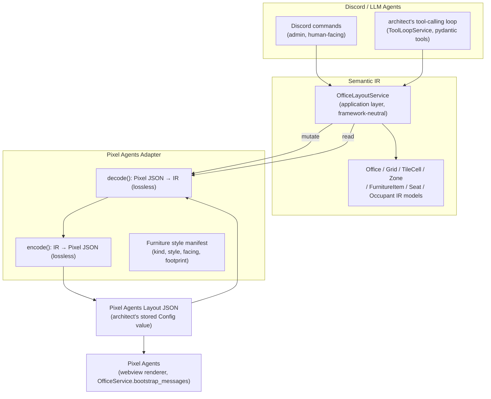

# Semantic IR: architect ↔ Pixel Agents office

> **Persistence topology updated by [`cctv-design.md`](cctv-design.md).** The IR,
> codec, and mutation rules remain current, but Architect now reads/writes
> Pixelagents' revisioned editor aggregate rather than an Architect-owned layout
> Config. CCTV owns browser rendering.

**Status: implemented (v2).** v1 (described in
`## Appendix: v1 implementation history` at the end of this document) shipped
a working but *deliberately lossy* Semantic IR: single-tile furniture
footprints, rooms inferred by flood-fill instead of stored, floor tiles
always re-encoded as one arbitrary pattern, wall tiles that nothing could
paint. That was enough for the original ask ("architect can describe its
own office"). It was not enough for this one: **architect must be able to
*modify* the layout — place floors, furniture, and walls at exact
positions — with a truly lossless round trip.** Sections 4–8, 10, and 11
below specify that (as built); §0–3 and §9 (why an IR exists at all, the
grounding in real Pixel Agents JSON, the design principle, the
architecture, and the decoupling argument) still hold and are unchanged.

v2 shipped in two passes. The first pass (§12's implementation plan)
carried over a `Room` concept from v1 — a named, persisted grouping of
`GridRect`s with its own flood-fill bootstrap and wall-adjacency
reporting. A follow-up review established that Pixel Agents itself has no
room concept anywhere in its own source, and that a `Room` added no
information `Zone` didn't already carry once floor/wall/furniture state
was fully lossless — so it was removed entirely in a second pass. This
document describes the system as it exists *after* that removal; §13 and
the appendix's own history notes record what changed and why.

## 0. Why this exists

`architect`'s own office layout (`docs/architect-design.md` §5) is
currently a raw, opaque JSON blob — one Config value seeded once from
`pixelagents`' bundled default and never mutated since. The moment
`architect` needs Discord commands or LLM tools that actually *change* that
layout ("move the desk near the window," "seat the new agent next to
Priya," "clear out the meeting nook"), two bad options present themselves:

1. Hand the LLM the raw Pixel Agents JSON and ask it to edit tile-index
   arrays and furniture arrays directly.
2. Hand-write one narrow Discord command per edit imaginable.

Both fail for the same reason: Pixel Agents' JSON is a **rendering format**,
not a **semantic model**. A flat `tiles: number[]` array of palette indices,
a `furniture: {type, col, row}[]` list keyed by opaque asset IDs like
`CUSHIONED_CHAIR_FRONT:left`, and HSB color-shift objects (`{h,s,b,c}`) are
exactly the representation a canvas renderer wants and exactly the
representation an LLM reasons about badly — it has no notion of "desk,"
"room," "seat facing a whiteboard," or "the design corner" without first
reverse-engineering it from index arithmetic.

This document designs a **Semantic Intermediate Representation (IR)** that
sits between architect's LLM-facing surface and Pixel Agents' JSON, and the
**adapter** that translates between them in both directions.

## 1. Grounding: what Pixel Agents' JSON actually contains

Read directly from `pixel-agents` (`webview-ui/src/office/types.ts`,
`layout/layoutSerializer.ts`, `layout/furnitureCatalog.ts`,
`dist/webview/assets/furniture-catalog.json`), not assumed:

| JSON field | Real shape | What it actually encodes |
|---|---|---|
| `cols`, `rows` | `int` | Grid dimensions (default 21×22) |
| `tiles` | `number[cols*rows]`, row-major | Per-tile floor pattern index (`0`=wall, `1`-`9`=floor patterns, `255`=void/outside) |
| `tileColors` | `Array<{h,s,b,c} \| null>`, parallel to `tiles` | Per-tile HSB color-shift, applied to the floor *or wall* sprite (upstream's `wallTiles.ts`/`renderer.ts` colorize wall sprites from it exactly like floor ones — see docs/painter-design.md part B); `null` on void, or on a wall/floor tile with no color set |
| `furniture` | `{uid, type, col, row, color?}[]` | Placed furniture: `type` is a catalog asset ID (e.g. `DESK_FRONT`, `PC_FRONT_OFF`, `WOODEN_CHAIR_SIDE:left`), `col`/`row` is its top-left footprint tile, `color` is an optional HSB override |
| `pets` | `{id, petType}[]` | Decorative pets; `petType` is an index into a loaded sprite array |
| `carpetTiles` | `Array<{variant, color?, accentColor?, order?} \| null>` | Decorative overlay layer, walkable |
| `areas` | `{label, color}[]` | Named translucent zone definitions |
| `areaTiles` | `Array<string \| null>`, parallel to `tiles` | Per-tile area-label assignment (FK into `areas`) |
| `layoutRevision` | `int?` | Bundled-default migration marker, not layout content |

Derived, not stored, by `layoutSerializer.ts`/`furnitureCatalog.ts` at
render time:

- **Seats**: every "chair" category furniture item's footprint tile(s)
  become a `Seat {uid, seatCol, seatRow, facingDir}`. Facing direction comes
  from the chair's own orientation, or (if the chair has none) from an
  adjacent desk tile, or defaults downward. A seat is *implied* by
  furniture placement + the catalog's `category === 'chairs'` flag — it is
  never itself a JSON field.
- **Walkability / blocked tiles**: derived from `tiles` (wall/void) plus
  each furniture item's catalog `footprintW/H` and `backgroundTiles` (rows
  of a footprint that don't block walking, e.g. wall art).
- **Desk-surface placement**: whether an item can sit "on" a desk comes
  from the catalog's `canPlaceOnSurfaces` flag plus z-sorting math, not a
  parent/child field in the JSON.

The furniture **catalog** itself (`furniture-catalog.json`, 38 assets today)
carries the only real semantic hints already present upstream:
`category` (`desks`, `chairs`, `storage`, `decor`, `electronics`, `wall`,
`misc`), `isDesk`, `canPlaceOnSurfaces`, `canPlaceOnWalls`,
`backgroundTiles`, `footprintW`/`footprintH`, and rotation/state group
membership (front/back/left/right orientation, on/off power state). This
is the seam the IR should build on — it is the one place upstream already
distinguishes "this is a desk" from "this is a decoration," and (as of v2,
§2.4) the one place real per-orientation footprint dimensions live —
rather than re-inventing furniture semantics from scratch. Confirmed
directly against real manifests, not assumed: `DESK_FRONT` is
`footprintW:3, footprintH:2, backgroundTiles:1`; `DESK_SIDE` (the same
style, rotated) is `footprintW:1, footprintH:4` — footprint is **not** a
simple transpose of one `(w,h)` pair, it's authored per concrete asset and
must be looked up per facing, never derived by rotating a single number.

**What has no semantic meaning at all today**: tile pattern indices
(`1`-`9` are arbitrary bundled patterns, not "carpet" vs. "tile" vs.
"wood" — this stays true in v2 too, see §2.1), HSB color-shift math and raw
`col`/`row` integers (implementation coordinates, not "near the window" —
though `col`/`row` *is* exactly the coordinate system the IR now places
things in exactly, §2.1), and asset ID strings like `CUSHIONED_CHAIR_FRONT:left`
(`:left` is a mirrored-variant suffix, an implementation detail of the
rotation-group system in `furnitureCatalog.ts`, not a semantic property).

## 2. Design principle

> Do not design a prettier version of the Pixel Agents JSON.

Concretely, this rules out an IR that just renames fields 1:1
(`furniture` → `objects`, `col`/`row` → `x`/`y`) while keeping the same
flat, position-indexed, renderer-shaped structure. The test applied to
every concept below: **would an LLM (or a human giving Discord commands)
ever want to reason or talk about this without knowing it's about
rendering?** If yes, it's semantic and belongs in the IR. If the honest
answer is "only the canvas renderer cares," it stays in Pixel Agents JSON
and is either dropped, defaulted, or carried as opaque passthrough.

**v2 sharpens this test, it doesn't relax it.** Losslessness does not mean
"expose every raw number to the LLM" — it means the *IR's internal model*
retains every bit Pixel JSON has (§2.1's `Grid`), while the *LLM-facing
tool schemas* stay exactly as semantic as before (a `material` int the LLM
picks without needing to know what it renders as, never a raw tile array
dumped into a prompt). The grid is a lossless **data structure**, not a
lossless **prompt**.

## 3. Architecture



- **Discord / LLM Agents** never sees Pixel JSON. Discord commands and LLM
  tools both call the same `OfficeLayoutService` methods (§8) — one mutation
  surface, two callers, matching the "clean service/domain layer" requirement.
- **Semantic IR** is a set of plain dataclasses (`architect/domain/office_ir.py`)
  with zero Pixel-Agents-specific knowledge: no asset ID strings, no HSB
  math, no furniture-catalog imports. It does, as of v2, retain tile
  pattern indices directly (`Grid`/`TileCell.material`, §4.2) — those
  numbers are still semantically meaningless (§1), but meaninglessness and
  losslessness are different axes, and the IR's job is now to be lossless
  on every axis while staying semantic on the axis that matters to an LLM.
- **Pixel Agents Adapter** (`architect/infrastructure/pixel_agents_adapter.py`)
  is the *only* module that imports furniture-style-manifest knowledge and
  knows the tile/furniture/color JSON shape. It is a pure function pair,
  `encode`/`decode`, with no side effects — trivially unit-testable against
  fixture JSON without a running cog, matching this repo's existing
  `contracts/`-adjacent testing style ([[project-contracts-purpose]]). v2
  makes this pair *simpler* than v1's, not more complex (§6) — a direct
  per-cell mapping replaces v1's inference/rebuild logic.
- **Pixel Agents Layout JSON** is exactly what's stored today
  (`architect`'s `layout` Config field) and what `pixelagents.OfficeService`
  already consumes — this design changes nothing about that storage format
  or the webview/bootstrap path.

## 4. The Semantic IR schema

### 4.1 Design choices up front

- **Grid coordinates, not pixels.** The IR keeps `col`/`row` integer tile
  coordinates (matching the one spatial concept every layer already agrees
  on) rather than inventing an abstract coordinate space Pixel Agents would
  have to re-derive. What's cut is everything *below* that: z-sort
  ordering, sprite mirroring, per-pixel offsets — pure rendering concerns
  the adapter and Pixel Agents own, never exposed as something to place
  "at."
- **A lossless `Grid` is the ground truth; `Zone` is a label over it, not
  the thing floor tiles are derived from.** This is the central change
  from v1. v1 inferred `Room` rectangles from tile-pattern contiguity and
  then discarded the raw tile array — the array was never retained, so
  anything not captured by a `Room`'s bounding rectangle (a hallway, a
  hand-painted irregular patch, per-tile pattern variation within a
  "room") was unrecoverable, and encoding always emitted one arbitrary
  pattern index for every room cell regardless of what was actually
  authored there. v2's `Office.grid` is a direct, exhaustive,
  one-cell-per-tile mirror of `tiles`/`tileColors`/`areaTiles` — every
  cell, always, not just non-wall ones. `Zone` becomes a **label attached
  to grid cells** for organization and LLM ergonomics ("the Quiet Zone"),
  fully decoupled from what's actually painted underneath: a zone can
  cross multiple visually-implied rooms and one visually-implied room can
  carry multiple zones, matching exactly how Pixel Agents' own zone/area
  painting already works upstream (§1) — there is no room concept
  anywhere in Pixel Agents itself, and the v2 IR shipped one for one
  implementation pass before an independent review established it added
  no information `Zone` didn't already carry; it was removed in a
  follow-up pass (§12 step 7, §13).
- **Furniture becomes `FurnitureItem`s with a `kind`**, derived from the
  catalog's `category`/`isDesk`/`canPlaceOnSurfaces` flags, not the raw
  asset ID. `type: "DESK_FRONT"` becomes `kind: "desk", style: "desk"`
  — `kind` is what an LLM reasons about ("place a desk here"), `style` is
  a stable but non-semantic hint the adapter uses to pick a concrete asset
  ID (§6 covers this mapping). Every valid `style` value is one row of a
  **generated** manifest (§6.4), not a hand-picked example string — an
  LLM's tool calls are constrained to styles that actually exist in
  whatever `pixel-agents` commit is currently vendored. As of v2, that same
  manifest also carries each style's **real per-facing footprint**
  (§2.4) — placement is now exact, not single-tile-approximate.
- **Orientation is a direction, not an asset-ID suffix.** `:left` /
  `_FRONT` / `_BACK` naming becomes a `facing: Direction` enum
  (`north`/`south`/`east`/`west`) on the IR item. The adapter re-derives
  the correct concrete asset ID *and* footprint from `(style, facing)` via
  the manifest's own rotation-group data.
- **Seats are first-class IR entities**, not implied by chair placement.
  Pixel Agents *derives* seats from furniture at render time; the IR
  *declares* a `Seat` explicitly, linked to the `FurnitureItem` it sits on
  (`occupies_furniture_id`) and, if applicable, an `Occupant`.
- **Occupants (agents) are IR entities, not seat metadata.** Today
  architect's layout has no agent-seating story at all (`NullSeatRepository`
  — deliberately empty, `docs/architect-design.md` §5). The IR still models
  `Occupant`, so "assign agent X to the seat near the whiteboard" has
  somewhere to live the day architect's tools need it — still no creation
  path in this pass either (§13's v1 note on this remains true; unchanged
  by this redesign).
- **Placement is tile-exact, not pixel-exact.** v1 said "no pixel-perfect
  layout algebra in the IR" and meant both "no exact positions" and "no
  sub-tile rendering detail." v2 keeps the second half and drops the
  first: a `FurnitureItem`'s occupied cells, a painted floor rectangle, a
  painted wall rectangle are now all exact, real, multi-tile-aware
  placements — what's still explicitly out of scope is anything *below*
  the tile grid (z-sort order, sprite mirroring, per-pixel offsets), which
  remains the adapter/renderer's business alone.

### 4.2 Entities

```python
# architect/domain/office_ir.py (framework-neutral, plain dataclasses,
# matching domain/models.py's existing "zero framework imports" convention)

from dataclasses import dataclass, field
from enum import Enum


class Direction(Enum):
    NORTH = "north"   # away from viewer / "back"
    SOUTH = "south"   # toward viewer / "front"
    EAST = "east"     # viewer's right / "right"
    WEST = "west"     # viewer's left / "left"


class FurnitureKind(Enum):
    """Coarse semantic category an LLM reasons in. Derived from the
    catalog's own `category`/`isDesk` flags (§6.4), not invented."""
    DESK = "desk"
    SEATING = "seating"      # chairs, benches, sofas
    STORAGE = "storage"      # bookshelves, bins
    DECOR = "decor"          # plants, paintings, clocks
    ELECTRONICS = "electronics"
    WALL_FIXTURE = "wall_fixture"   # whiteboard, wall-mounted decor
    MISC = "misc"


@dataclass(frozen=True, slots=True)
class GridPosition:
    col: int
    row: int


@dataclass(frozen=True, slots=True)
class GridRect:
    """Inclusive tile rectangle. Used for a `Zone`'s bounding box and for
    any tool that paints/queries a bounded region (`paint_tiles`,
    `describe_tiles`) -- a plain rectangle, not a polygon, since a zone's
    *exact* per-tile membership always lives on `Grid.cells[i].zone_label`
    directly; this is just the bounding-box summary."""
    top_left: GridPosition
    width: int
    height: int

    def contains(self, position: GridPosition) -> bool: ...
    def overlaps(self, other: "GridRect") -> bool: ...
    def positions(self) -> list[GridPosition]: ...   # every cell inside, row-major


class TileKind(Enum):
    """Derived, never independently authored -- see TileCell's own
    invariant below. Kept as an explicit enum (rather than making every
    caller compare `material` to magic numbers 0/255) purely for
    readability at every call site that asks "is this walkable/wall/void."
    """
    WALL = "wall"    # Pixel JSON pattern 0
    VOID = "void"    # Pixel JSON pattern 255 -- outside the playable map
    FLOOR = "floor"  # Pixel JSON pattern 1-9


@dataclass(frozen=True, slots=True)
class TileCell:
    """One grid cell, exactly mirroring one `tiles[i]`/`tileColors[i]`/
    `areaTiles[i]` triple -- the lossless ground truth §4.1 describes.
    `kind` and `material` are never constructed independently: use
    `TileCell.floor(...)`, `.wall()`, or `.void()` below, never the raw
    constructor with a hand-picked `kind` -- this is the single invariant
    that keeps `kind` from ever disagreeing with `material`."""
    kind: TileKind
    material: int | None     # 1-9 for FLOOR, always None otherwise -- opaque,
                              # no semantic meaning (§1), constrained 1-9 by
                              # Field(ge=1, le=9) wherever a tool accepts it
    color: str | None        # semantic color name (§6.3), FLOOR or WALL
                              # (not VOID -- see docs/painter-design.md part B)
    zone_label: str | None   # which Zone owns this cell, if any

    @classmethod
    def wall(cls, *, zone_label: str | None = None) -> "TileCell":
        return cls(TileKind.WALL, material=None, color=None, zone_label=zone_label)

    @classmethod
    def void(cls, *, zone_label: str | None = None) -> "TileCell":
        return cls(TileKind.VOID, material=None, color=None, zone_label=zone_label)

    @classmethod
    def floor(cls, material: int, color: str | None, *, zone_label: str | None = None) -> "TileCell":
        return cls(TileKind.FLOOR, material=material, color=color, zone_label=zone_label)


@dataclass(frozen=True, slots=True)
class Grid:
    """The lossless ground truth (§4.1). Row-major, exactly
    `width * height` cells, always -- constructed once per `decode()`,
    replaced wholesale (not patched) by every mutation's copy-on-write,
    same shape `Office` itself already uses."""
    width: int
    height: int
    cells: tuple[TileCell, ...]

    def at(self, position: GridPosition) -> TileCell: ...
    def replacing(self, updates: dict[GridPosition, TileCell]) -> "Grid": ...  # copy-on-write helper


@dataclass(frozen=True, slots=True)
class FurnitureItem:
    """One placed piece of furniture. `id` is always identical to the
    Pixel Agents `uid` it was decoded from (or, for an item architect just
    created, the freshly-minted id that becomes its `uid` on first save --
    §6.2) -- there is no separate architect-owned id namespace. Occupied
    cells are *derived* on demand
    from `(style, facing, position)` against the style manifest's real
    footprint (§2.4/§6.4), not stored here -- storing them would risk
    disagreeing with the manifest after a webview rebuild changes it."""
    id: str
    kind: FurnitureKind
    style: str          # one of the ids in the generated style manifest (§6.4) --
                         # NOT a Pixel Agents asset ID and NOT a freely chosen string
    position: GridPosition   # top-left anchor of its footprint
    facing: Direction | None = None   # None for non-orientable items (plants, clocks)
    label: str | None = None          # optional human/LLM-given name, e.g. "Priya's desk"
    color: str | None = None          # optional semantic color name, e.g. "blue" (§6.3)


@dataclass(frozen=True, slots=True)
class Seat:
    """A place an occupant can sit. First-class in the IR even though
    Pixel Agents derives seats from chair footprints at render time (§1)."""
    id: str
    occupies_furniture_id: str    # FurnitureItem.id of the chair/bench/sofa
    facing: Direction
    occupant_id: str | None = None  # Occupant.id, or None if empty


@dataclass(frozen=True, slots=True)
class Occupant:
    """An agent or person who can hold a seat. No Pixel Agents JSON field
    corresponds to this today -- modeled now so seat-assignment tools have
    a target the day architect grows a creation path (still absent, §13's
    v1 note)."""
    id: str
    display_name: str
    role: str | None = None       # e.g. "lead", "reviewer" -- free text for now


@dataclass(frozen=True, slots=True)
class Zone:
    """Promotes Pixel Agents' own `AreaDefinition`/`areaTiles` concept to
    a first-class IR entity. `tiles` is a bounding-rect *summary*,
    computed from `Grid` at read time (every cell with this zone's
    `zone_label` is the real, exact membership) -- not separately
    authored or persisted, so there is no passthrough side-channel to keep
    in sync (v1 needed one, `Office.passthrough["zone_raw_tiles"]`; v2
    doesn't, since the grid itself already holds the exact shape)."""
    id: str
    label: str
    color: str                    # semantic color name (§6.3), not hex
    tiles: GridRect                # bounding-box summary, derived from Grid


@dataclass(frozen=True, slots=True)
class Office:
    """The IR root -- one architect layout. `grid` is the lossless ground
    truth (§4.1); `zones` are labels over it -- the only spatial-grouping
    concept exposed to the LLM, matching Pixel Agents' own model, which
    has no room concept at all (§1). `furniture`/`seats`/`occupants` are
    unchanged in shape from v1. `width`/`height` delegate to `grid` rather
    than being separately stored, so there is exactly one place grid
    dimensions can live -- never two fields that could disagree.
    `passthrough` still exists for what the IR has no concept for at all
    -- `pets`, `carpetTiles`, `layoutRevision`, unrecognized furniture, and
    the `id <-> uid` map (§6.2) -- but no longer needs `zone_raw_tiles`
    (superseded by `grid` itself, §4.1)."""
    grid: Grid
    zones: list[Zone] = field(default_factory=list)
    furniture: list[FurnitureItem] = field(default_factory=list)
    seats: list[Seat] = field(default_factory=list)
    occupants: list[Occupant] = field(default_factory=list)
    passthrough: dict[str, object] = field(default_factory=dict)

    @property
    def width(self) -> int: return self.grid.width
    @property
    def height(self) -> int: return self.grid.height
```

### 4.3 Realistic example

The same slice of the bundled default layout §4.3 has always used, now
with its grid ground truth shown alongside the semantic view an LLM
actually reasons over (the grid itself is 21×22 = 462 cells — far too much
to inline in full, so only the cells relevant to this slice are shown):

```python
office = Office(
    width=21, height=22,
    grid=Grid(
        width=21, height=22,
        cells=(
            # ... 462 cells total; the ones this example's furniture
            # actually touch look like:
            # (2, 12): TileCell.floor(material=7, color="warm_beige")
            # (5, 9):  TileCell.wall()  -- f5's whiteboard mounts on this wall tile
            # (13, 14): TileCell.floor(material=1, color="warm_brown",
            #                          zone_label="Quiet Zone")
            ...
        ),
    ),
    zones=[
        Zone(id="zone-quiet", label="Quiet Zone", color="blue",
             tiles=GridRect(GridPosition(11, 17), width=8, height=3)),
    ],
    furniture=[
        FurnitureItem(id="f1", kind=FurnitureKind.DESK, style="desk",
                      position=GridPosition(2, 12), facing=Direction.SOUTH,
                      label="Desk A"),   # occupies (2,12)-(4,13): real 3x2 footprint (§2.4)
        FurnitureItem(id="f2", kind=FurnitureKind.SEATING, style="wooden_chair",
                      position=GridPosition(3, 12), facing=Direction.NORTH),
        FurnitureItem(id="f3", kind=FurnitureKind.ELECTRONICS, style="pc",
                      position=GridPosition(2, 12), facing=Direction.SOUTH),
                      # legitimately shares (2,12) with f1 -- canPlaceOnSurfaces (§2.4)
        FurnitureItem(id="f4", kind=FurnitureKind.SEATING, style="sofa",
                      position=GridPosition(13, 14), facing=Direction.SOUTH),
                      # occupies (13,14)-(14,14): real 2x1 footprint, not 1x1
        FurnitureItem(id="f5", kind=FurnitureKind.WALL_FIXTURE, style="whiteboard",
                      position=GridPosition(5, 9)),
                      # anchor tile is a WALL cell, not a floor tile -- valid
                      # because whiteboard's style has can_place_on_walls=True (§2.7)
    ],
    seats=[
        Seat(id="s1", occupies_furniture_id="f2", facing=Direction.NORTH, occupant_id=None),
        Seat(id="s2", occupies_furniture_id="f4", facing=Direction.SOUTH, occupant_id=None),
    ],
    occupants=[],
)
```

Compare this to v1's version of the same example: `f1`'s desk now
genuinely occupies 6 tiles, not 1; `f3`'s PC legitimately overlaps `f1`
because the model understands `canPlaceOnSurfaces`; `f5`'s whiteboard is
placeable at all (v1's room-containment rule would have rejected it
outright, §1 item 6); there is no `Room` at all, only `Zone`, matching
Pixel Agents' own model exactly; and the grid means a real, irregular,
hand-painted office survives a round trip byte-for-byte, not just this
tidy synthetic one.

## 5. What belongs in the IR vs. Pixel Agents JSON

| Concept | IR | Pixel JSON | Why |
|---|---|---|---|
| Grid size | ✅ `Office.width/height` | ✅ `cols`/`rows` | Genuinely shared — both layers need "how big is the space." |
| Tile position | ✅ `GridPosition` (col/row) | ✅ `col`/`row` | Shared coordinate system, kept 1:1 (§3). |
| Floor pattern index (1-9) | ✅ `TileCell.material`, opaque int | ✅ `tiles` | **Changed in v2.** Still semantically meaningless (§1) — never surfaced as anything but an opaque int a tool constrains 1-9 — but now stored exactly, not dropped, since dropping it is exactly what broke losslessness in v1. |
| Tile HSB color shift | ✅ `TileCell.color`, semantic name | ✅ `tileColors` | Mapped to/from a semantic name (§6.3) for the LLM-facing side, but the grid holds one per cell, exactly — no more dominant-color sampling loss. |
| Furniture asset ID (`DESK_FRONT`, `:left` suffix) | ❌ (mapped to `kind`/`style`/`facing`) | ✅ `furniture[].type` | Rotation-group/mirror-variant naming is a rendering-catalog implementation detail. |
| Furniture footprint (`footprintW/H`) | ❌ stored on `FurnitureItem`; ✅ derivable via the style manifest | ✅ (via catalog, keyed by `type`) | **Changed in v2.** The IR now models real footprint *precisely*, just not as a field on the item — it's looked up from `(style, facing)` against the generated manifest (§2.4/§6.4), so it can never drift from what the manifest actually says. |
| Furniture uid | ❌ (adapter-owned mapping, §6.2) | ✅ `furniture[].uid` | Pixel Agents' own internal identity scheme (timestamp+random); IR uses its own stable `id`. |
| Seats | ✅ first-class `Seat` | ❌ (derived at render time) | IR needs to *declare* intent ("seat someone here"); Pixel Agents *re-derives* the same seat from furniture footprint + catalog category, so no JSON field is needed or written. |
| Occupants/agents | ✅ `Occupant` | ❌ (no field today) | Modeled for future use, currently has no Pixel JSON counterpart at all (`NullSeatRepository`). |
| Zones/areas | ✅ `Zone` (metadata) + `TileCell.zone_label` (membership) | ✅ `areas`/`areaTiles` | Already semantic upstream — the IR promotes it, doesn't reinterpret it. **Changed in v2**: exact per-tile membership now lives directly in `Grid`, not a bounding-rect approximation plus a passthrough side-channel. |
| Rooms | ❌ removed | ❌ (no field at all) | Pixel Agents has no room concept anywhere in its own source. v1 and v2's first pass both invented one on top of raw tiles (v1 via flood-fill inference, v2's first pass via an explicitly persisted `Room`); a follow-up review established it added no information `Zone` didn't already carry once floor/wall/furniture state was fully lossless, and it was removed entirely (§12 step 7, §13). |
| Pets | ❌ (out of scope this pass) | ✅ `pets` | Decorative-only, no semantic operations planned for them yet; carried as opaque passthrough so round-tripping never silently deletes them. Unchanged from v1 — still explicitly not part of "floors, furniture, walls." |
| Carpets | ❌ (out of scope this pass) | ✅ `carpetTiles` | Same reasoning as pets — decorative layer, no IR operations proposed, preserved as passthrough. Unchanged from v1. |
| `layoutRevision` | ❌ | ✅ | Pure migration bookkeeping for the bundled default; irrelevant once architect owns its own layout. |

**How unmapped information survives round-tripping:** `Office.passthrough`
still exists for what the IR genuinely has no concept for —
`pets`/`carpetTiles`/`layoutRevision` (opaque, unchanged from v1), any
furniture `type` string not in the style manifest (unchanged from v1), and
the `id ↔ uid` map (§6.2, unchanged from v1). **What's gone in v2**:
`zone_raw_tiles` — the exact zone shape now lives directly in `Grid`
(§4.2's `Zone` docstring), so there is nothing left to shadow-track in a
side channel for it. This is a real simplification, not just a rename:
one less place `encode()`/`decode()` have to keep in sync with each other.

## 6. Conversion: mapping and lossiness

v2's `decode()`/`encode()` are **simpler** than v1's, not more complex —
almost everything that made v1's versions intricate (room flood-fill,
dominant-color sampling, wholesale-tile-rebuild-from-rectangles,
zone-shape passthrough bookkeeping) is exactly what a direct, per-cell
`Grid` mapping eliminates. What's new in v2 is real, but additive:
per-facing footprint lookups and the wall/floor painting rules.

### 6.1 `decode(): Pixel JSON → IR`

1. **Grid**: `cols`/`rows` → `Office.width/height`, 1:1. `tiles[i]` →
   `TileCell.kind`/`.material` (`0`→`TileCell.wall()`, `255`→`TileCell.void()`,
   `1`-`9`→`TileCell.floor(material=tiles[i], ...)`), `tileColors[i]` →
   `.color` (nearest semantic name, §6.3, `None` on wall/void cells — this
   is a real, deliberately accepted lossy step, §11), `areaTiles[i]` →
   `.zone_label`, directly, one cell at a time — **no clustering, no
   inference, no sampling**.
2. **Furniture**: for each `furniture[]` entry, look up its `type` in the
   **generated style manifest** (§6.4) — loaded via
   `architect/infrastructure/furniture_styles.py`'s thin cache/loader, not
   a hand-maintained table — to recover `(kind, style, facing)`, e.g.
   `"DESK_FRONT"` → `(DESK, "desk", SOUTH)`,
   `"WOODEN_CHAIR_SIDE:left"` → `(SEATING, "wooden_chair", WEST)`. The
   mirror-suffix and orientation-group collapsing that produces this
   mapping already happened once, when the manifest was generated (§6.4
   step 3) — `decode()` itself does no rotation-group math, just a lookup.
   An asset ID *not* in the manifest becomes a `passthrough` foreign-
   furniture entry (kept, not dropped, not modeled), unchanged from v1.
3. **Seats**: re-run the *same* derivation Pixel Agents itself uses
   (`layoutToSeats` in `layoutSerializer.ts`) against the decoded furniture,
   unchanged from v1: every `SEATING`-kind item's *anchor* tile becomes a
   `Seat` (still one seat per item, not one per occupied cell — a 2-tile
   sofa is one seat, matching what v1 already did and what the tool API
   §7 exposes; modeling one `Seat` per occupied cell is deferred, not
   needed for "place furniture/floors/walls exactly"), `facing` from the
   item's own `facing` (chair orientation takes priority, matching
   upstream) or from an adjacent `DESK`-kind item, or `SOUTH` as fallback.
4. **Occupants**: none, currently — always `[]` on decode, unchanged.
5. **Zones**: `areas[]` → `Zone` metadata 1:1 (`label`→`label`, hex `color`
   → nearest semantic color name via a small fixed palette table, §6.3).
   `Zone.tiles` (the bounding-rect summary) is computed by scanning `Grid`
   for cells whose `zone_label` matches — no longer lossy: the *exact*
   shape is already sitting in every affected `TileCell`, computed once at
   decode time and never approximated. (v1's non-rectangular-area
   limitation and its `area_tiles_raw` passthrough workaround are both
   gone — superseded, not merely worked around, §5.)

   There is no room concept anywhere in this step, or anywhere in
   `decode()` at all — v2's first implementation pass carried one over
   from v1 (a persisted `Room` + a one-time bootstrap flood-fill,
   replacing v1's every-decode flood-fill), but a follow-up review
   established Pixel Agents itself has no room concept in its own source,
   and the persisted `Room` added no information `Zone` didn't already
   carry once floor/wall/furniture state was fully lossless. It was
   removed entirely (§12 step 7, §13) — `decode()` is simpler for it: a
   direct grid build, furniture/seat decode, and zone decode, nothing
   else.

### 6.2 `encode(): IR → Pixel JSON`

1. **Grid**: `Office.width/height` → `cols`/`rows`, 1:1. Each `TileCell` →
   `tiles[i]` (`0` for `WALL`, `255` for `VOID`, `.material` for `FLOOR`),
   `tileColors[i]` (`.color` mapped back to HSB, §6.3, `None`→`null`),
   `areaTiles[i]` (`.zone_label`). **Direct, per-cell, exact** — this
   replaces v1's "rebuild wholesale from Room rectangles, always emitting
   pattern 1" entirely. There is no reconciliation problem to solve
   anymore (v1's biggest accepted tradeoff, §11): an untouched cell is
   still exactly the `TileCell` `decode()` produced for it, byte-for-byte,
   because nothing about encoding a *different* cell ever touches it.
2. **Furniture**: for each `FurnitureItem`, reverse the generated style
   manifest (§6.4) (`style`+`facing` → concrete asset ID), reusing the
   original `uid` if this item's `id` was seen on the last `decode()` (an
   `id ↔ uid` map persisted in `passthrough`, unchanged from v1, so
   re-encoding an *unmodified* item never spuriously changes its Pixel
   Agents identity). A newly-created `FurnitureItem` gets a freshly
   generated `uid` (`f-<timestamp>-<random>`, matching upstream's own
   editor).
3. **Seats**: not written directly, unchanged from v1 — Pixel Agents
   derives seats from furniture at render time.
4. **Occupants**: not encoded, unchanged from v1 (no target field, §5).
5. **Passthrough**: `pets`, `carpetTiles`, `layoutRevision`, and any
   foreign furniture entries are merged back in verbatim from
   `Office.passthrough`, unchanged from v1.

**What "lossless" now actually means, precisely**: for any `Office` value
produced by `decode(json)`, `encode(decode(json))` reproduces a JSON value
that is *functionally identical* to `json` — same `tiles`, same
`tileColors` (mapped through the semantic-color palette, §6.3's one
accepted lossy step, unchanged in v2), same `areaTiles`/`areas`, same
furniture (same `uid`s, same `type`s, same `col`/`row`), same `pets`/
`carpetTiles`/`layoutRevision` — for *any* real layout, not only the
uniform hand-built fixtures v1's test suite exercised. §12 step 6's test
plan is written specifically to prove this against layouts that actually
stress it (irregular per-tile pattern variation, multi-tile furniture,
a wall painted between existing floor tiles).

### 6.3 Semantic color names

Unchanged from v1. A small fixed palette
(`architect/infrastructure/color_names.py`) maps `{h,s,b,c}` ↔ a closed
set of ~12-16 names (`"warm_beige"`, `"cool_blue"`, `"forest_green"`, ...)
via nearest-hue/brightness-bucket matching on decode, and a fixed reverse
table on encode. This is intentionally coarse — an LLM should say "make
this floor warm and beige," not compute an HSB tuple — and is the **one
remaining deliberately lossy step** in the whole v2 model (§11): repainting
a cell with the nearest palette color instead of its exact original HSB
value, every time that cell is *touched* by a mutation. An *untouched*
cell's exact HSB value round-trips perfectly regardless (§6.1/§6.2 step
1 is a direct per-cell copy) — only a cell a tool actually repaints loses
its pre-existing exact value in favor of the palette's nearest match,
which is the correct tradeoff: an LLM asked to repaint a cell "warm beige"
should get exactly that named color, not an approximation of whatever
arbitrary HSB values happened to be there before.

### 6.4 Generating the style manifest from the `pixelagents` build

§6.1's furniture lookup and §7/§8's validation both need an answer to
"what styles/facings/footprints actually exist," and that answer must
track whatever `pixel-agents` commit a given bot instance actually has
vendored. `pixelagents` generates this manifest itself, as part of the
webview build pipeline it already runs, the same way it already generates
`furniture-catalog.json` and the `decoded/*.json` asset files consumed
elsewhere.

**Where this plugs in** (unchanged from v1): `pixelagents/infrastructure/webview_build.py`'s
`ensure_webview_built()` clones `pixel-agents-hq/pixel-agents` at a pinned
commit, `npm ci` + `vite build`, runs `emit_decoded_assets.ts`, then
`_sync_dist()` copies `furniture-catalog.json` into `webview_dist/`,
immediately followed by `_build_furniture_styles()` reading that copy and
writing `furniture-styles.json` beside it via
`pixelagents/infrastructure/furniture_style_builder.py`'s
`build_furniture_style_manifest()`.

**Derivation rules, v2** (extends v1's, changes marked):

1. **`kind`** — unchanged: a small, fixed, hand-maintained
   `category → FurnitureKind` table (7 entries: `desks→DESK`,
   `chairs→SEATING`, `storage→STORAGE`, `decor→DECOR`,
   `electronics→ELECTRONICS`, `wall→WALL_FIXTURE`, `misc→MISC`).
2. **`style`** id — unchanged: the entry's `groupId`, lower-cased, when
   present; otherwise the bare catalog `id`, lower-cased.
3. **`facings`** — unchanged shape (`{direction: catalog_id}`, including
   the mirrored-`:left`-variant handling), **plus, new in v2, a footprint
   record per facing**: `{catalog_id, footprint_width, footprint_height,
   background_tiles}`, read directly from that catalog entry's own
   `footprintW`/`footprintH`/`backgroundTiles` fields — never rotated or
   derived from a single canonical value, since real assets don't rotate
   that way (§1's `DESK_FRONT`/`DESK_SIDE` example: 3×2 vs. 1×4, not a
   transpose of one pair). Facing-less/ungrouped styles get the same
   footprint record attached to their top-level `catalog_id` field instead
   (§6.4's v1 fix for the case-sensitivity bug, unchanged, now carrying
   footprint data too).
4. **New in v2, two style-level (not per-facing) booleans**:
   `can_place_on_walls`, `can_place_on_surfaces`, read directly from the
   catalog entry's own `canPlaceOnWalls`/`canPlaceOnSurfaces` fields
   (confirmed real: `WHITEBOARD` has `canPlaceOnWalls:true`; `COFFEE` and
   `PC` both have `canPlaceOnSurfaces:true`). These gate placement
   validation (§8) — a `can_place_on_walls` style's footprint's **bottom
   row** must sit on `WALL` cells (not the anchor/top-left cell itself,
   for a multi-row footprint like `HANGING_PLANT` — ported directly from
   Pixel Agents' own `canPlaceFurniture`/`getWallPlacementRow` in
   `editorActions.ts`: a wall fixture's sprite extends *upward* from the
   tile it's actually mounted on, so `position.row` can legitimately be
   `footprint_height - 1` rows above the nearest `WALL` cell); a
   non-wall style's footprint (every non-background cell, not just the
   anchor) must sit on `FLOOR` cells; a `can_place_on_surfaces` style is
   exempt from the overlap check when the cell it shares belongs to a
   `DESK`-kind item.
5. **On/off `state` variants** — unchanged: not modeled as separate
   styles, only the off/stateless variant's id (and footprint) is used.
6. **Unrecognized `category`** — unchanged: omitted from the manifest,
   not a crash; degrades to a `passthrough` foreign entry on decode.

Example output, `furniture-styles.json` (v2 shape, showing the DESK style
specifically because it's the clearest real illustration of
per-facing-footprint necessity):

```json
{
  "styles": [
    {
      "style": "desk",
      "kind": "desk",
      "label": "Desk",
      "can_place_on_walls": false,
      "can_place_on_surfaces": false,
      "facings": {
        "south": {"catalog_id": "DESK_FRONT", "footprint_width": 3, "footprint_height": 2, "background_tiles": 1},
        "east":  {"catalog_id": "DESK_SIDE",  "footprint_width": 1, "footprint_height": 4, "background_tiles": 1}
      },
      "default_facing": "south"
    },
    {
      "style": "whiteboard",
      "kind": "wall_fixture",
      "label": "Whiteboard",
      "can_place_on_walls": true,
      "can_place_on_surfaces": false,
      "facings": {},
      "default_facing": null,
      "catalog_id": "WHITEBOARD",
      "footprint_width": 2,
      "footprint_height": 2,
      "background_tiles": 0
    }
  ]
}
```

**Cross-cog exposure** (unchanged from v1): `pixelagents.furniture_style_manifest()`
on its Cog, alongside `webview_bundle_status()`.

**Consumption in `architect`.** `architect/infrastructure/furniture_styles.py`
is a thin loader/cache around `pixelagents.furniture_style_manifest()`,
unchanged in its refresh-on-rebuild behavior from v1. New in v2: it gains
`occupied_cells(style_id, facing, position) -> list[GridPosition]`, the
ported equivalent of Pixel Agents' own `getPlacementBlockedTiles`
(`layoutSerializer.ts`) — returns every cell the item's real footprint
covers at that position, *excluding* the top `background_tiles` rows
(which don't block placement, matching upstream exactly). `OfficeLayoutService`
(§8) calls this for every furniture validation; nothing computes footprint
occupancy independently, so there is exactly one place this logic can
disagree with the manifest: nowhere.

## 7. LLM / tool API

Per §3's grounding of `architect`'s actual tool-calling shape
(`architect/tools/base.py`'s `ToolSpec` Protocol,
`architect/application/tool_loop_service.py` calling
`tool.Input.model_json_schema()`), tool `Input`/`Output` are full Pydantic
v2 models — **not** subject to the flat str/int/float/bool constraint
`corridor.domain.llm_tools.llm_tool` imposes on Discord-command-backed
tools. Architect's own tools can and should take structured IR objects
directly, one file (`architect/tools/office_tools.py`).

**Query tools:**

| Tool | Change from v1 |
|---|---|
| `describe_office` | No longer reports rooms (§12 step 7) — `zones`, `furniture`, `seats` only. |
| `find_furniture` | Results include the item's full occupied-cell footprint (§6.4), not just its anchor position. No `room_id` filter (removed with `Room`) — `kind` only. |
| `describe_tiles(col, row, width, height)` | **New.** Exact per-cell state for a bounded region: kind, material, color, zone label, occupying-furniture id if any. Capped at `width*height <= 400` (`OfficeValidationError` if exceeded, §8) so a careless request can't blow up the LLM's context — this is how the agent checks "what's actually at (5,10)" before placing something there, instead of guessing blind. |

**Mutation tools:**

| Tool | Change from v1 |
|---|---|
| `paint_tiles(col, row, width, height, kind: "floor"\|"wall", material: int\|None, color: str\|None)` | **New** — the floor/wall painting primitive (§8). `material` required (and `Field(ge=1,le=9)`-constrained) when `kind="floor"`; ignored for `kind="wall"`. Painting `"wall"` over occupied cells fails (remove furniture first). |
| `place_furniture` | Validates the *real* footprint (§6.4): fully in bounds, every non-background cell free or exempted by `can_place_on_surfaces` onto a `DESK`-kind cell; for `can_place_on_walls` styles, the footprint's **bottom row** (not the anchor) must be `WALL`; for others, every non-background cell must be `FLOOR`. **The v1 "must be inside some Room" rule is dropped** — a floor tile is placeable whether or not it's tagged to a zone, matching the real renderer, which has no concept of rooms to check against either. `position` is **required** (§12 step 7) — auto-placement inside a room no longer has a room to scope its search to, so the LLM calls `describe_tiles` first and always passes an exact `col`/`row`. |
| `move_furniture` | Same footprint validation as `place_furniture`. |
| `remove_furniture` | Unchanged. |
| `create_zone` | Unchanged signature; internally no longer needs `zone_raw_tiles` bookkeeping (§4.2). |
| `resize_zone` / `remove_zone` | **New** — editing a zone after creation, not just authoring it once. |
| `seat_occupant` / `vacate_seat` | Unchanged — still blocked on no occupant-creation path (§13's v1 note, still true); out of scope for this pass (floors/furniture/walls, not occupants). |

There is no `create_room`/`resize_room`/`remove_room`/`list_rooms` — v2's
first implementation pass shipped these, but they were removed entirely
once a follow-up review established `Room` added no information `Zone`
didn't already carry (§12 step 7, §13). A rectangle an LLM wants to treat
as a room is just `paint_tiles` (to give it a shared floor material/color)
plus, optionally, `create_zone` (to give it a name) — no separate
persisted grouping concept is needed.

`[p]architect office ...` Discord commands get matching subcommands
(`painttiles`, `resizezone`, `removezone`, `describetiles`), calling the
exact same `OfficeLayoutService` methods — unchanged "one mutation
surface, two callers" principle from v1.

Every mutation tool's `Output` includes a `status: Literal["ok", "error"]`
and, on error, a `message: str` describing *which validation rule* failed
(§8) in LLM-readable terms, unchanged convention from v1.

**Constraining `style`/`facing`/`material` to values that really exist**
(unchanged mechanism from v1, extended to cover the new tools):
`place_furniture`/`move_furniture`'s `Input` is built fresh per call via
`pydantic.create_model(...)` so `style`'s JSON Schema `enum` always
reflects the live manifest (§6.4) — no staleness risk, since
`ToolLoopService._wire_spec()` already calls `tool.Input.model_json_schema()`
fresh every turn. `paint_tiles`' `material` field is `Field(ge=1, le=9)`
rather than a dynamic enum, since floor pattern numbers are fixed (unlike
styles, which change whenever `pixel-agents` ships new assets). A
`field_validator` on every generated model re-checks constraints at call
time regardless of what the LLM sent — defense in depth, not a
replacement for §8's service-level check, since Discord commands reach
`OfficeLayoutService` without ever constructing a pydantic `Input` at all.

## 8. Mutation service and validation

```python
# architect/application/office_layout_service.py

class OfficeLayoutService:
    """The single place Discord commands and LLM tools both call to read
    or mutate architect's office. Framework-neutral: depends only on an
    OfficeLayoutRepository Protocol and the Pixel Agents adapter's
    encode/decode functions -- no discord.py, no pydantic requirement."""

    async def describe(self) -> Office: ...
    async def find_furniture(self, *, kind: FurnitureKind | None) -> list[FurnitureItem]: ...
    async def describe_tiles(self, *, area: GridRect) -> list[TileCell]: ...  # NEW

    async def paint_tiles(  # NEW
        self, *, area: GridRect, kind: TileKind, material: int | None, color: str | None,
    ) -> None: ...

    async def place_furniture(
        self, *, kind: FurnitureKind, style: str,
        position: GridPosition, facing: Direction | None, label: str | None,
    ) -> FurnitureItem: ...   # raises OfficeValidationError, not framework exceptions

    async def move_furniture(
        self, *, furniture_id: str, position: GridPosition, facing: Direction | None,
    ) -> FurnitureItem: ...

    async def remove_furniture(self, *, furniture_id: str) -> None: ...
    async def create_zone(self, *, label: str, color: str, tiles: GridRect) -> Zone: ...
    async def resize_zone(self, *, zone_id: str, tiles: GridRect) -> Zone: ...        # NEW
    async def remove_zone(self, *, zone_id: str) -> None: ...                        # NEW
    async def seat_occupant(self, *, seat_id: str, occupant_id: str) -> Seat: ...
    async def vacate_seat(self, *, seat_id: str) -> Seat: ...
```

There is no `create_room`/`resize_room`/`remove_room`/`list_rooms` and no
`room_id` parameter anywhere — removed entirely, §12 step 7. `place_furniture`'s
`position` is required, not optional: v2's first pass let it auto-search a
given room for a free cell; with no room to scope that search to, the LLM
calls `describe_tiles` first and always passes an exact position instead.

Every mutation method (unchanged shape from v1):

1. Loads the current `Office` IR via the adapter's `decode()`.
2. Applies the change to a **new** `Office` value (frozen dataclasses,
   `dataclasses.replace`/`Grid.replacing`, never in-place edits).
3. **Validates** the resulting `Office` as a whole before ever calling
   `encode()`:
   - Every painted/placed rect fully within grid bounds.
   - **Furniture** (rewritten for real footprints, §6.4): style/facing
     exists in the live manifest; every occupied cell (the footprint minus
     `background_tiles` rows) is in bounds and either free or legitimately
     shared (a `can_place_on_surfaces` item over a `DESK`-kind cell, in
     either direction — the newly placed item may be the surface item or
     the desk); for a `can_place_on_walls` style, the footprint's
     **bottom row** (`position.row + footprint_height - 1`, every column
     in `footprint_width`) must be `WALL` — not the anchor cell itself,
     which for a multi-row wall fixture (e.g. `HANGING_PLANT`,
     `footprint_height=2`) legitimately sits one or more rows *above* its
     actual wall tile (ported from Pixel Agents' own
     `canPlaceFurniture`/`getWallPlacementRow`, `editorActions.ts` —
     checking the anchor cell directly, as if every wall item were
     single-tile, rejected every real multi-row wall fixture, a bug this
     document's own §12 step 4 originally shipped); for any other style,
     every occupied cell must be `FLOOR`. **The v1 room-containment rule
     is gone** — placement no longer requires the target cell belong to
     any room.
   - **`paint_tiles(kind=WALL)`**: no furniture currently occupies any
     target cell (must be removed first — no silent deletion).
   - `Zone` rects within grid bounds; zones may freely overlap each other,
     unchanged from v1.
   - Every `Seat.occupies_furniture_id` references an existing, `SEATING`-
     kind `FurnitureItem`; every `Seat.occupant_id` references an existing
     `Occupant`; no `Occupant` holds two seats at once. Unchanged from v1.
4. Only once validation passes: calls `encode()`, persists via the
   existing `set_layout`-shaped repository call, and broadcasts
   `layoutLoaded` to connected webview clients (unchanged from v1,
   `CogBase._broadcast_layout`).
5. On any validation failure: raises `OfficeValidationError(reason)` with
   the specific rule that failed; the stored layout is untouched (nothing
   to roll back, since step 2 never wrote anywhere shared).

This satisfies "basic validation so invalid changes cannot produce broken
Pixel Agents layouts" by construction, same argument as v1: `encode()` is
only ever called on an `Office` value that has already passed every
structural invariant Pixel Agents' own renderer implicitly assumes — now
including real multi-tile footprints and wall-vs-floor anchor rules, not
just single-tile positions inside a room rectangle.

## 9. Decoupling from Pixel Agents

Unchanged from v1 — the explicit goal (**a Pixel Agents JSON format change
should primarily touch the adapter, not the LLM-facing API**) and the three
practices that make it hold still apply exactly as before:

1. **The style manifest is the only place asset IDs (now including
   footprint dimensions) are spelled out, and it's generated, not
   hand-maintained.** `furniture-styles.json` (§6.4) is produced
   automatically from `furniture-catalog.json` every time `pixelagents`
   rebuilds its webview bundle — a new asset (or a new footprint on an
   existing one) needs zero `architect` code changes, only a rebuild.
2. **The IR never imports anything from `pixel-agents`.** `office_ir.py`
   (§4.2) has zero knowledge of asset ID strings or HSB math — it *does*
   now store raw pattern integers (`TileCell.material`), but that's a
   lossless-storage decision, not a Pixel-Agents-*import* — the module
   still has no dependency on `pixelagents`' package or catalog shape. A
   contract test (mirroring `floorplan/tests/test_compatibility.py`'s
   existing role) asserts this by construction.
3. **`OfficeLayoutService` and every tool/command depend only on the IR
   and the adapter's `encode`/`decode` function signatures**, never on
   Pixel JSON's shape directly. If Pixel Agents ever changes its wire
   format, only `decode()`/`encode()` need to change.

## 10. Project/module boundaries

```
architect/
  domain/
    office_ir.py                 # Office/Grid/TileCell/TileKind/Zone/
                                  #   FurnitureItem/Seat/Occupant/GridPosition/
                                  #   GridRect/enums -- zero Pixel-Agents
                                  #   imports (§9). Grid/TileCell and
                                  #   TileCell.wall()/.void()/.floor()
                                  #   constructors are NEW in v2. No Room/
                                  #   RoomBoundary/BoundaryKind (§12 step 7).
  application/
    office_layout_service.py     # OfficeLayoutService (§8) -- one mutation
                                  #   surface Discord + tools share. NEW in v2:
                                  #   paint_tiles, resize_zone, remove_zone,
                                  #   describe_tiles.
  infrastructure/
    pixel_agents_adapter.py      # encode()/decode() (§6) -- the ONLY module
                                  #   that knows Pixel JSON shape. Rewritten
                                  #   in v2 around direct Grid mapping; no
                                  #   room inference of any kind (§12 step 7).
    furniture_styles.py          # Loader/cache around
                                  #   pixelagents.furniture_style_manifest()
                                  #   (§6.4). NEW in v2: occupied_cells().
    color_names.py               # HSB <-> semantic color name table (§6.3),
                                  #   unchanged from v1.
    office_layout_repository.py  # Protocol + Config-backed impl storing the
                                  #   Office IR + passthrough bag alongside
                                  #   the existing `layout` Config field.
  tools/
    office_tools.py              # ToolSpec implementations (§7), thin
                                  #   pydantic-Input -> service-call ->
                                  #   pydantic-Output wrappers. NEW tools
                                  #   in v2 per §7's table.
  adapters/
    office_commands.py           # `[p]architect office ...` Discord command
                                  #   group calling the SAME OfficeLayoutService
                                  #   methods (§8). New subcommands per §7.
    cog_base.py                  # MODIFIED (existing file): _broadcast_layout
                                  #   unchanged from v1, no v2 changes needed here.
```

`floorplan` and `pixelagents` are both unaffected beyond §6.4's manifest
schema growing new fields — `pixelagents/infrastructure/furniture_style_builder.py`
gains the footprint/`can_place_on_*` derivation (§6.4), no other file in
either package changes.

## 11. Key design decisions and tradeoffs

| Decision | Tradeoff accepted |
|---|---|
| IR keeps grid `col`/`row`, doesn't go fully positionless ("near the window") | Unchanged from v1 — simpler, testable adapter math; an LLM must still reason in tile coordinates for placement, though zones give it a coarser semantic handle first. |
| `Grid` stores every cell, always — including every wall and void tile, not just floor | Larger in-memory `Office` objects (462 `TileCell`s for the bundled default) in exchange for the actual lossless-round-trip guarantee this whole redesign exists to provide. Office layouts are small; this is not a hot path (unchanged reasoning from v1's "full IR revalidation on every mutation" row, still true and still accepted here). |
| There is no `Room` concept at all — only `Zone` | v2's first implementation pass shipped a persisted, explicitly-authored `Room` (never inferred, except a one-time bootstrap) as a stronger replacement for v1's every-decode flood-fill. A follow-up review established Pixel Agents itself has no room concept in its own source, and that this `Room` added no information `Zone` didn't already carry once floor/wall/furniture state was fully lossless — it was removed entirely. The tradeoff v1's flood-fill forced (room membership silently reshuffling as paint strokes changed tile contiguity) is now moot: there is no room membership to reshuffle. An LLM that wants a named, colored region uses `create_zone`; one that wants a shared floor material/color uses `paint_tiles`. |
| Semantic color names are a small fixed palette, not free text | Unchanged from v1 — an LLM can't say "slightly more teal" and get exact HSB control. **What's new in v2**: this is now the *only* place any lossiness is deliberately accepted in the whole model (§6.3) — every other v1 tradeoff row this table used to carry (room bounding-rect approximation, wholesale tile rebuild, single-tile footprint) is resolved, not merely mitigated. |
| Style manifest is generated at webview-build time, not hand-maintained, and now carries footprint/placement metadata too | Unchanged reasoning from v1 (always in sync with the vendored commit, zero `architect` code changes for a new asset) — the `category → FurnitureKind` table is still small and hand-maintained (7 entries), and there's now more per-style data (`facings` carry footprint records, plus two booleans) generated and validated per build, a larger but still fully automatic surface. |
| `paint_tiles(kind="wall")` refuses to run over occupied furniture rather than auto-removing it | Slightly more friction (an LLM must issue `remove_furniture` first) in exchange for never silently deleting placed furniture as a side effect of an unrelated wall edit — matches this codebase's general "no silent destructive side effects" preference. |
| `VOID` is not a paintable state | The user's own scope ("place floors, furniture, walls") never mentioned removing tiles from the playable map — a `VOID` cell from the original JSON still round-trips losslessly, it's just not a state any v2 tool can *set*. Revisit only if a real need for it appears. |
| `place_furniture`'s `position` is required, no auto-placement | v1 (and v2's first pass) let an LLM omit `col`/`row` and auto-search within a given room. With no room to scope that search to, the tool no longer guesses — the LLM calls `describe_tiles` and picks a spot itself. Slightly more tool calls per placement in exchange for never silently landing furniture somewhere the caller didn't intend. |

## 12. Implementation plan (v2)

Seven phases. The first six mirror how v1 was actually built (small,
independently testable, one commit each) and shipped a `Room` concept
carried over from v1; the seventh phase removed it after a follow-up
review established it was unnecessary (§13).

1. **`pixelagents/infrastructure/furniture_style_builder.py`** (§6.4): add
   `footprint_width`/`footprint_height`/`background_tiles` per facing (and
   for facing-less `catalog_id` entries) plus `can_place_on_walls`/
   `can_place_on_surfaces` per style, sourced from the real catalog
   fields.
2. **`architect/domain/office_ir.py`**: `TileKind`, `TileCell` (with its
   `wall()`/`void()`/`floor()` constructors as the only sanctioned way to
   build one), `Grid`; `Office.grid` replacing the old implicit tile
   handling. Contract test: `office_ir.py` still imports cleanly with
   `pixelagents` absent (unchanged assertion from v1).
3. **`architect/infrastructure/pixel_agents_adapter.py`**: rewrite
   `decode()`/`encode()` around direct per-cell `Grid` mapping (§6.1/§6.2);
   delete `zone_raw_tiles` passthrough entirely. Round-trip tests against
   fixtures that actually stress losslessness: per-tile pattern variation,
   a wall tile painted between existing floor tiles, multi-tile furniture
   (a real `DESK_FRONT`, a real `SOFA_SIDE`), a `PC` legitimately
   overlapping a `DESK` cell, a `WHITEBOARD` anchored on a wall cell — not
   only the flat, uniform fixtures v1's suite used.
4. **`architect/application/office_layout_service.py`**: `paint_tiles`,
   `resize_zone`/`remove_zone`, `describe_tiles`; rewritten furniture
   validation (§8) covering the dropped room-containment rule, the
   `can_place_on_walls` anchor check, and the `can_place_on_surfaces`
   overlap exception explicitly.
5. **`architect/tools/office_tools.py` + `architect/adapters/office_commands.py`**:
   the new/changed tools and matching Discord subcommands (§7).
6. **Lossless round-trip proof, end to end**: a test (or small suite) that
   takes a genuinely irregular, hand-authored-style layout — not a
   uniform rectangle — through `decode → encode → decode` and asserts
   equality on every field Pixel JSON defines, replacing v1's narrower
   "flat fixtures only" round-trip tests. This is the test that actually
   backs the word "lossless" in this document's own title going forward.
7. **Remove the `Room` concept entirely** (§13): delete `Room`,
   `RoomBoundary`, `BoundaryKind`, `TileCell.room_id`, the `rooms_snapshot`
   sidecar and its one-time bootstrap flood-fill, and every tool/command
   built on them (`list_rooms`, `create_room`, `resize_room`,
   `remove_room`). `place_furniture` drops its room-scoped auto-placement
   in favor of a required `position`. Every file steps 1–6 touched that
   also referenced `Room` gets updated in the same pass; this document is
   updated to describe the system as it exists afterward rather than
   carrying two histories forward.

Each of the first six steps is independently testable without the ones
after it, same property v1's plan had and delivered on; step 7 is a
single atomic removal, verified by the full suite plus a repo-wide grep
for any remaining `room` reference outside historical/explanatory prose.

## 13. Implementation notes (v2)

- **Wall-anchor validation checked the wrong cell for multi-row wall
  fixtures — a real production incident, not a hypothetical.** §12 step
  4's furniture validation originally checked a `can_place_on_walls`
  style's *anchor* (top-left) cell directly against `TileKind.WALL`,
  treating every wall item as if it were single-tile. This broke the
  moment a real multi-row wall fixture was involved: `HANGING_PLANT`
  (`footprint_height=2`) already existed, correctly placed, in a live
  office — but every subsequent mutation re-validates the *whole* office
  (step 3 above), so that one pre-existing, perfectly valid item now
  failed validation on every single future call, silently blocking
  unrelated furniture placement with a confusing error naming an item the
  caller never touched. Root cause, found by reading Pixel Agents' own
  `canPlaceFurniture`/`getWallPlacementRow` (`editorActions.ts`) directly:
  a wall fixture's sprite extends *upward* from the tile it's mounted on,
  so only the footprint's **bottom row** has to be `WALL` — the anchor
  cell for a 2-tall fixture is one row *above* its actual wall tile, and
  is allowed to be anything (even void). Fixed to check
  `position.row + footprint_height - 1` across the footprint's width,
  not `position` itself; also tightened the non-wall path to check every
  occupied cell for `FLOOR` (not just the anchor), matching upstream's
  own per-cell loop. Caught via the debug-logging feature added in
  response to this same incident (`[p]architect debuglogging on`),
  without which the tool's error message ("style X must be anchored on a
  wall tile," naming an unrelated pre-existing item) was invisible to the
  operator entirely.
- **`Room` was removed after shipping**, not merely revised. It was built
  faithfully to the plan §12 steps 1–6 describe (a persisted, explicitly-
  authored grouping with a one-time bootstrap flood-fill, replacing v1's
  every-decode flood-fill and its two documented bugs) — that part
  worked, and worked correctly. What triggered the removal wasn't a bug:
  a user review during a later work session established two things by
  reading Pixel Agents' own source directly: (1) there is no room concept
  anywhere in `pixel-agents` itself — `webview-ui/src`, `core`, and
  `server` contain zero references to "room" — so `Room` had always been
  a pure office-cogs invention with nothing upstream to ground it, unlike
  `Zone`, which mirrors Pixel Agents' own `AreaDefinition`/`areaTiles`
  concept directly; and (2) once `Grid` made floor/wall/furniture state
  fully lossless, `Room` carried no information a `Zone` couldn't already
  express — a "room" is just a rectangle with a shared floor
  material/color (`paint_tiles`) and, optionally, a name (`create_zone`).
  Keeping it would have meant maintaining a second, redundant spatial-
  grouping concept indefinitely for no benefit. It was deleted rather than
  deprecated, matching this codebase's general preference for removing
  unused code outright over leaving compatibility shims behind.
- **`place_furniture`'s auto-placement went with it.** The room-removal
  review surfaced a real design question `Room`'s presence had been
  quietly answering: what should `place_furniture` search *within* when
  no position is given, if there's no room to scope the search to? The
  options considered were searching the whole grid, scoping to an
  optional `zone_label` instead, or dropping auto-placement and requiring
  an explicit position. The last was chosen: an LLM that hasn't looked at
  the grid yet has no principled way to pick "the whole grid, first free
  cell" over any other cell either, so the tool no longer guesses on its
  behalf — it calls `describe_tiles` and decides.
- **`FurnitureItem.id`/Pixel Agents `uid` — a stale doc claim, not a code
  bug.** The same review flagged that §4.2's docstring called `id` "not
  Pixel Agents' `uid`," describing a separate id namespace. The shipped
  `decode()` has always set `id = uid` directly, and newly created items'
  ids become their persisted `uid` on first save (§6.2) — there never was
  a separate namespace. Round-tripping is correct either way (the code's
  actual invariant, "an item's id is always its own uid," is internally
  consistent and requires no `id ↔ uid` translation at all beyond knowing
  whether a given id has been persisted before), so this was a doc
  correction, not a behavior change: §4.2 and §6.2 now describe what the
  code has always done.

## Appendix: v1 implementation history

The following two sections are the *original* `## 12. Implementation plan`
and `## 13. Implementation notes` from before this v2 redesign, preserved
verbatim as a historical record — including the three real production
incidents they document. One of those incidents (room identity silently
reassigning on every decode) is the direct motivation for v2's first
implementation pass replacing v1's every-decode flood-fill with a
persisted, explicitly-authored `Room` — itself later removed entirely
once `Zone` was established to already cover the same ground without a
room concept at all (§12 step 7, §13). The furniture-uid incident is why
`FurnitureItem.id` has always been set equal to Pixel Agents' own `uid`,
not a separately generated identifier (§13's note above corrects this
document's own claim to the contrary). The third incident (the
facing-less style case-sensitivity bug) is why §12 (v2) step 1's tests
exercise real, differently-shaped manifest entries rather than only
hand-built fixtures that happen not to trigger a given bug.

### Appendix A. v1 implementation plan (superseded by §12 above)

1. **`domain/office_ir.py`**: the dataclasses in §4.2, plus a contract test
   asserting zero imports from `pixelagents`/`pixel_agents_adapter` (§9).
2. **`pixelagents/infrastructure/furniture_style_builder.py`** (§6.4):
   `build_furniture_style_manifest()`, the pure catalog→manifest derivation,
   tested directly against the real 38-entry `furniture-catalog.json` (§1)
   — not guessed — covering every category, every grouped/ungrouped and
   mirrored/stateful asset. Then wire `_build_furniture_styles()` into
   `webview_build.py`'s existing pipeline and add
   `furniture_style_manifest()` to `pixelagents/adapters/cog_base.py`.
3. **`architect/infrastructure/furniture_styles.py` + `color_names.py`**:
   the former is now a loader/cache around
   `pixelagents.furniture_style_manifest()` (§6.4) — no table to author,
   just cache-refresh-on-rebuild logic to test; the latter is still a
   small hand-authored lookup table (§6.3), built by reading real HSB
   samples from the bundled default layout (§1).
4. **`infrastructure/pixel_agents_adapter.py`**: `decode()`/`encode()`
   (§6), tested against real fixture JSON (the bundled `default-layout-1.json`
   from §1, plus hand-built edge cases: an unrecognized furniture type, an
   irregular area shape, empty layout, a style manifest missing a style a
   test layout references). Round-trip test:
   `decode(encode(decode(json))) == decode(json)` for every fixture.
5. **`infrastructure/office_layout_repository.py`**: Protocol + Config-backed
   implementation, wrapping the existing `settings_repository.py` layout
   field (or extending it — §10).
6. **`application/office_layout_service.py`**: the service methods (§8)
   and validation rules, unit-tested directly against the IR (no Discord,
   no pydantic, no running cog needed) — invalid-placement, overlapping-
   furniture, unknown-style, and seat-consistency cases each get an
   explicit test.
7. **`tools/office_tools.py`**: pydantic `Input`/`Output` wrappers (§7)
   around the service, including the per-call `pydantic.create_model(...)`
   construction that bakes the live style/facing `enum` into each schema
   — tested the way `test_placeholder_tools.py` already tests the current
   placeholder tools (schema shape + handler behavior), including a test
   that the generated `enum` actually changes when the underlying manifest
   does. Then wire into `architect`'s tool list (`ToolLoopService`'s
   existing `tools=` sequence) alongside/replacing the current placeholders.
8. **`adapters/office_commands.py`**: `[p]architect office ...` Discord
   command group calling the same service methods, following the existing
   `commands.py` owner/admin-scoping conventions (§6 of
   `docs/architect-design.md`).
9. **`office_gateway.py` broadcast wiring**: extend the existing WebSocket
   send path so a service-driven mutation pushes `layoutLoaded` to
   connected clients (§8 step 4) — the smallest possible change to
   `infrastructure/websocket.py`'s existing read-only-inbound design, since
   this is an outbound push, not a new inbound message type.
10. **Update `docs/architect-design.md`** §8's "out of scope" list (remove
   "editing architect's own layout" once shipped) and `docs/architecture.md`'s
   ownership map with the new `office_ir`/adapter modules — following this
   repo's existing convention of keeping architecture docs in sync with
   what's actually implemented (`docs/architect-design.md`'s own §9
   implementation-checklist style).

Each step is independently testable without the ones after it (the IR and
adapter need no running Discord bot at all; the service needs no LLM; the
tools need no Discord command dispatch) — matching this repo's general
preference for framework-neutral domain/application layers that are
"trivially unit-testable" (`architect/domain/models.py`'s own docstring).

### Appendix B. v1 implementation notes

All ten steps above shipped. Real departures from the plan as originally
written, discovered during implementation (mirroring
`docs/architect-design.md` §9's own incident-note convention):

- **`RoomBoundary`/`BoundaryKind` (§4.2, §6.1 step 8, §7) is a genuine
  addition beyond the original ten-step plan, not a departure from it** —
  added after a user asked whether architect could detect how a wall is
  built and the honest answer was no, by design gap: the IR had no wall
  concept at all, and the raw tile array (the only place that information
  lives) is discarded once `Room` rectangles are computed. Scoped
  deliberately narrow: read-only (no wall-editing tool), folded into
  `describe_office`/`list_rooms`' existing output rather than a new tool,
  and derived fresh on every `decode()` rather than persisted — the same
  "derived, not stored" treatment `Seat` already gets.
- **Two production bugs found only after real furniture was described
  through the live A2A path**, not by any test written against hand-built
  fixtures (§6.4's own generator tests all happened to use fixtures where
  the bug was invisible — see below):
  - **`is_up_to_date()` never checked for the new generated artifact.** A
    host whose `webview_dist/` was already built before this design
    shipped has an unchanged commit and `base_path`, so `cog_load()`'s
    non-forced rebuild always short-circuited and `furniture-styles.json`
    was simply never generated there. Symptom: `describe_office` reported
    correct room counts/sizes (room inference never touches the style
    manifest) but zero furniture and zero seats in a layout stocked with
    both, because every real asset id fell into the unrecognized/"foreign"
    passthrough bucket against an empty style manifest. Fixed by adding
    the missing-file check to `is_up_to_date()` (`webview_build.py`) so an
    affected host self-heals on its next `cog_load()`.
  - **Facing-less furniture styles registered the wrong reverse-lookup
    key.** `build_furniture_style_manifest` lower-cases every style id for
    LLM/tool use (`"cushioned_bench"`, `"whiteboard"`) — for a
    grouped/oriented style the real, original-case asset ids survive
    correctly inside the `facings` map, but a facing-less item (no
    `groupId`, no `orientation` — `CUSHIONED_BENCH`, `WOODEN_BENCH`,
    `WHITEBOARD`, `BIN`, most `decor`) has no `facings` map to carry its
    real id in at all, so the manifest's reverse lookup registered the
    *lower-cased style id* as if it were the catalog id. Pixel JSON never
    spells a real `furniture[].type` in lower case, so every such item
    silently failed `decode()`'s lookup and was reported as missing
    furniture entirely — a real deployment had two `CUSHIONED_BENCH`
    pieces in its default layout that never appeared in `describe_office`/
    `find_furniture` at all, undercounting a room's chair count and the
    total furniture/seat count by exactly the missing benches. Fixed by
    adding an explicit `catalog_id` field to the generated manifest for
    facing-less styles, threaded through `FurnitureStyle`/
    `FurnitureStyleManifest` and used by both `catalog_id_for()` (encode
    direction) and the reverse lookup (decode direction) instead of the
    style id itself. The existing generator/loader tests had all
    hand-built their one facing-less fixture (`WHITEBOARD`) with a style
    id that happened to still work as a stand-in catalog id in the test's
    own assertions — the bug was only visible against a *second*,
    differently-cased real asset, which is exactly why the v1 plan's
    intent to test against the real vendored catalog (never actually
    done — every test used small hand-built fixtures instead) would have
    caught it immediately. **This is the direct precedent behind §12
    (v2) step 1's insistence on testing footprint derivation against real,
    differently-shaped manifest entries.**
- **Room identity needed its own persisted snapshot — a real bug, not
  anticipated by §6.1/§8's original sketch.** Because Pixel Agents has no
  room field at all, a `Room`'s `id` and `label` exist only in the IR; the
  first working version of `OfficeLayoutService` decoded a *fresh* `Office`
  from the raw JSON on every call, which re-ran room inference from
  scratch and silently regenerated a new synthetic `room-N` id for every
  room on every single load — including the one immediately after
  `create_room()` returned an id to its caller. `place_furniture(room_id=...)`
  calling `create_room()`'s own just-returned id one line later would
  therefore always fail with "room does not exist." Fixed by adding a
  `rooms_snapshot` Config field (`settings_repository.py`), stored
  alongside (never inside) the opaque Pixel JSON blob, giving `decode()` a
  set of `{id, label, rects}` hints so a flood-filled region matching a
  known room's exact bounding rect keeps that room's real identity. Caught
  by an actual end-to-end service test (`create_room` then
  `place_furniture` into it), not by inspection — the design doc's own
  §6.1 step 6 anticipated rooms being *lossy* across a round trip, but not
  *unstable* within a single logical operation. **This bug, specifically
  its root cause (inference re-running on every decode), is why §2/§6.1 of
  this v2 document deletes ongoing inference entirely rather than
  hardening the hint-matching mechanism further.**
- **New furniture had the identical bug via its `uid`, fixed the same
  way, in the service instead of the adapter.** `encode()`'s uid
  preservation only helps an item a *previous* `decode()` already knew
  about — a brand-new `FurnitureItem` created by `place_furniture()` had
  no such history, so `encode()` correctly fell back to generating a
  fresh uid, but that uid differed from the `uuid.uuid4()` id the service
  had already returned to its caller. Fixed in
  `OfficeLayoutService.place_furniture` by seeding
  `passthrough["id_uid_map"]` with `{item.id: item.id}` at creation time.
- **Furniture footprints were single-tile, not their real
  `footprintW`/`footprintH`.** Deferred at the time because "adding those
  would mean either duplicating more of the catalog's shape into the
  manifest or having the adapter fetch the full `furniture-catalog.json`
  as a second dependency." **This is precisely the v1 tradeoff this v2
  document resolves** (§2.4/§6.4) — the day this mattered in practice
  arrived, and the manifest now carries real per-facing footprint data.
- **Room floor tiles always encoded as pattern index 1, not a
  style-specific pattern.** Deliberate in v1 ("picks *a* pattern... the
  LLM never needs to know which"). **Also resolved in v2** — `Grid` now
  stores the exact `material` per cell, so an untouched cell's original
  pattern index round-trips exactly; a newly painted cell still just gets
  whatever `material` int the caller (or `create_room`'s convenience
  default) chose, since the pattern number remains semantically
  meaningless (§1) even though it's now stored precisely.
- **`place_furniture`/`move_furniture`'s `facing` schema was constrained
  to the full `Direction` enum, not narrowed per the chosen `style`'s
  actual `facings`**, because narrowing a sibling field's enum based on
  another field's value needs a JSON Schema conditional
  (`oneOf`/`if`-`then`) `pydantic.create_model` doesn't build for free.
  The runtime check happened anyway via `OfficeLayoutService`'s
  validation. **Still true in v2** — not resolved by this redesign, same
  accepted gap, still backed by the same service-level enforcement.
- **`seat_occupant` has no occupant-creation path to actually exercise
  its success case.** `Occupant`s are modeled for future use, but no tool
  or command creates one. **Still true in v2** — explicitly out of scope
  for this pass (occupants were never part of "floors, furniture, walls").
- **`architect/adapters/office_gateway.py`'s broadcast wiring landed as a
  plain method on `CogBase` (`_broadcast_layout`) rather than a change to
  `office_gateway.py` itself** — the existing `_send`/`_client_hub.broadcast`
  primitives were the natural place for one more thin wrapper.
  **Unchanged in v2** — `OfficeLayoutService` still takes a plain
  `Callable[[dict], Awaitable[None]]` broadcast argument; no new wiring
  needed for the new mutation tools, they call the same method.
