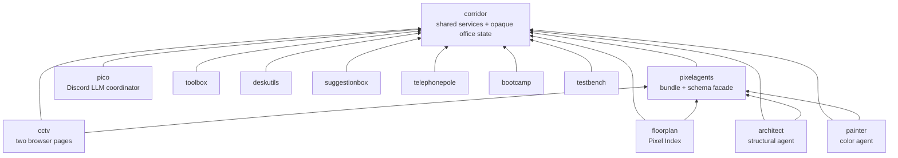
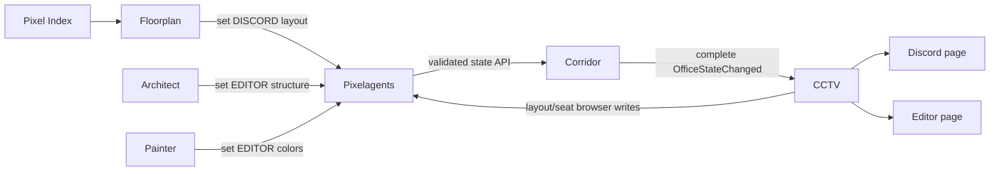
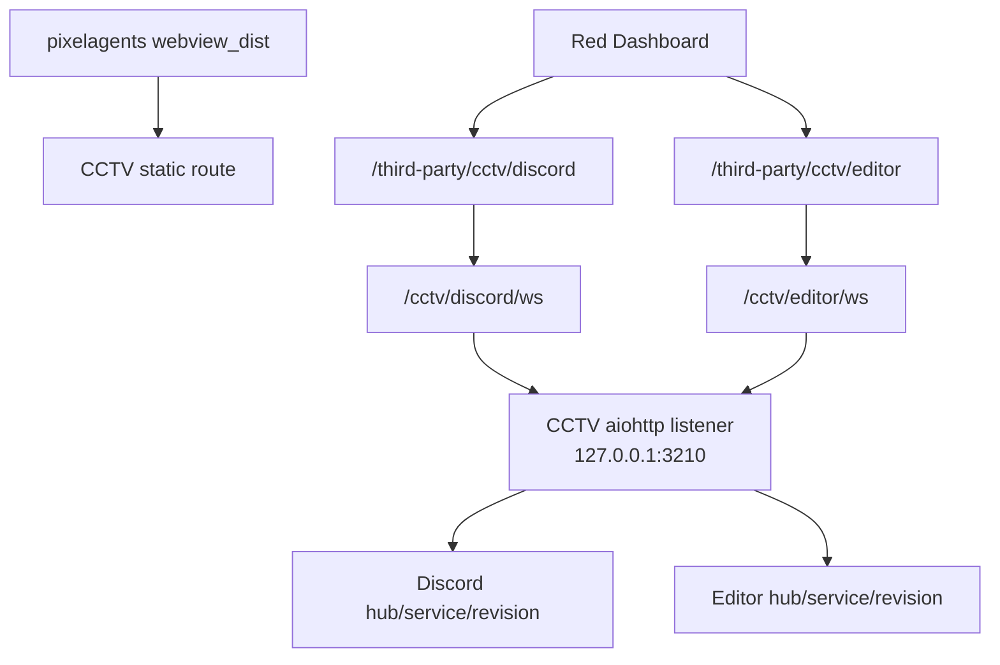

# Cross-cog architecture

This document describes ownership and runtime data flow across the repository's
thirteen cogs plus the CI-only `contracts` package. Package-specific architecture
documents remain the source for internal layering.

## Runtime dependencies

`required_cogs` is a Downloader installation hint; each cog also resolves its
runtime dependencies explicitly. Corridor is the shared foundation.



Painter's optional A2A call to Architect and Pico's calls to registered agents
are network interactions through Corridor's shared listener, not dependency
edges. Suggestionbox similarly registers an MCP server with Corridor, and
Telephonepole registers an open-ended, bot-owner-managed set of third-party
ones the same way; a missing server removes those tools rather than
preventing other cogs from loading. Bootcamp registers an open-ended set of
dynamically-created agents with Corridor's agent directory the same way
Architect/Painter each register their one singleton agent -- a removed
Bootcamp agent simply stops appearing in Pico's tool list, the same way an
unloaded Architect/Painter would.

All cogs in this repository are deployed from one synchronized revision.
Mixed-version runtime protocols are unsupported and fail through ordinary import
or API errors; no compatibility negotiation is implemented.

Runtime dependency edges also mean a dependent must react when Corridor or
Pixelagents reload independently of it, after this diagram's `-->` edges are
already resolved — see [`dependency-cascades.md`](dependency-cascades.md) for
Corridor's cascade-unload of dependents versus Pixelagents pushing a fresh
Cog reference to them instead.

## Ownership map

| Owner | Exclusive responsibilities |
|---|---|
| Corridor | Permissions/replies, LLM connection, A2A directory/listener, event bus, tool registries, and two opaque revisioned office aggregates |
| Pixelagents | Pixel Agents bundle build, raw layout schema, Semantic IR/codec, furniture manifest, seat validation, lazy initialization, and typed state facade |
| CCTV | Dashboard/static/session routes, one office listener, two client pipelines, Discord guild projection, registered-agent projection, display settings, and browser authorization |
| Floorplan | Pixel Index API/Web settings, catalogue search/detail UI, and loading a layout into the Discord aggregate |
| Architect | A2A/tool behavior and structural editor-layout mutations |
| Painter | A2A/tool behavior and editor-layout color mutations |
| Pico | Discord LLM gate/tool loop and dynamic A2A coordination |
| Toolbox | Host tooling and command-to-LLM-tool controls |
| Deskutils | Small Discord utilities/LLM tools |
| Suggestionbox | Feedback MCP server and agent-tool visibility controls |
| Telephonepole | Runtime registration of third-party MCP servers and per-server, per-agent visibility controls |
| Bootcamp | Runtime creation of custom LLM agents, each with its own system prompt and permission-group gate |
| Testbench | Owner-only manual Corridor event publication |
| Contracts | CI-only consumer and repository policy checks; not a Red cog |

The important boundary is that browser hosting does not live in Floorplan or
Architect, and persisted office JSON does not live in CCTV or Pixelagents.

## Office-state data flow

Corridor stores two independent complete aggregates:

```text
OfficeState(kind, layout, seats, revision)
```

`kind` is `discord` or `editor`. Pixelagents is the only schema-aware path to
them. Layout and seat writes are field-specific, preserve the other field, and
advance a monotonically increasing aggregate revision. Concurrent writes to the
same field are last-write-wins.



The Discord office receives catalogue layouts and an enabled-guild roster. The
editor office receives Architect/Painter mutations and a registered-agent
roster. They share a schema and default, not state. Loading one layout never
changes the other aggregate.

Corridor's `watch_office_state` atomically registers a handler and captures the
snapshot under the same lock. It publishes complete post-write snapshots after
releasing that lock, awaits subscribers sequentially, isolates errors, and
cancels any office-state subscriber exceeding five seconds. Persistence remains
successful even if display delivery fails.

## CCTV browser flow



Both pages use one bundle and listener, while their client hubs, projections,
revisions, authorization, and clear timing remain isolated. The Discord page
uses a Dashboard session ticket and requires bot-owner/keyholder access in an
enabled guild for writes. The editor page is intentionally open. On every
`webviewReady`, CCTV reads the current aggregate and serializes bootstrap with
event application.

Without CCTV, Floorplan catalogue operations and Architect/Painter mutations
still work. There is simply no browser surface.

## Agent and event flow

Architect and Painter register agent cards/executors with Corridor, and
Bootcamp registers one such pair per custom agent it creates at runtime. Pico
builds its `consult_<agent>` tools fresh from that directory each turn --
skipping any agent whose `required_permission_group` the triggering member
doesn't satisfy, the gate Bootcamp's own agents use -- and sends A2A requests
to Corridor's single listener. Registered-agent load/unload and activity
events are published on Corridor's bus.

Discord gateway publishers also live in Corridor. CCTV is the single office
subscriber: it filters those events through its enabled-guild and display
policy, projects them into Pixel Agents messages, and sends them to the relevant
page pipeline. Testbench can publish the same event contracts manually.

## Configuration compatibility

The office refactor deliberately uses fresh Config identities for Corridor's
office state, CCTV, Floorplan, and Architect. There is no migration or fallback
read. Old data is not deleted, but the new code cannot read it. The old
Floorplan/Architect Dashboard and WebSocket paths have no redirect or alias.

## CI-only edges

The root `contracts` package is a `SHARED_LIBRARY`, never loaded by Red.

- Pixel Index checks generate schemas from Floorplan's runtime models and verify
  live production/staging APIs.
- Pixel Agents checks execute Pixelagents' real clone/build path, serve the
  result through CCTV's `WebviewAssets`, and validate outbound messages against
  upstream AsyncAPI.
- Corridor contract generators verify both agent events and office-state
  contracts are synchronized with the domain model.
- Reply-channel lint AST-scans every real cog for Corridor reply compliance.

See [`contract-testing.md`](contract-testing.md),
[`cctv-design.md`](cctv-design.md), and each package README for operational
details.
