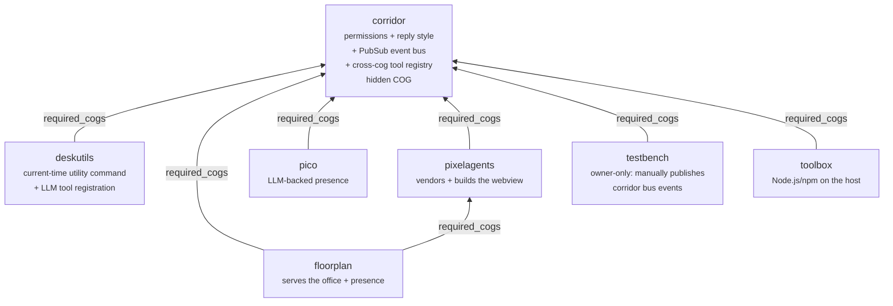
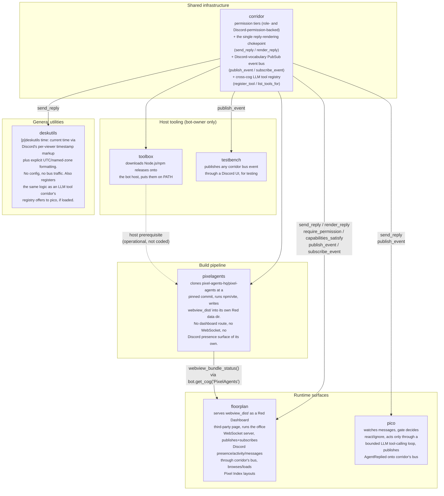
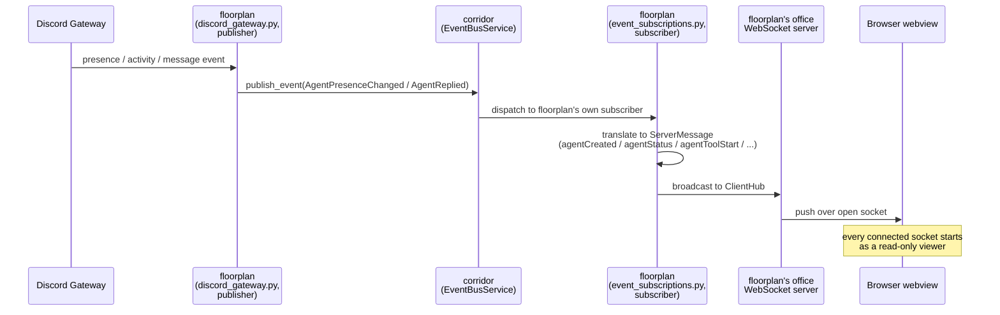
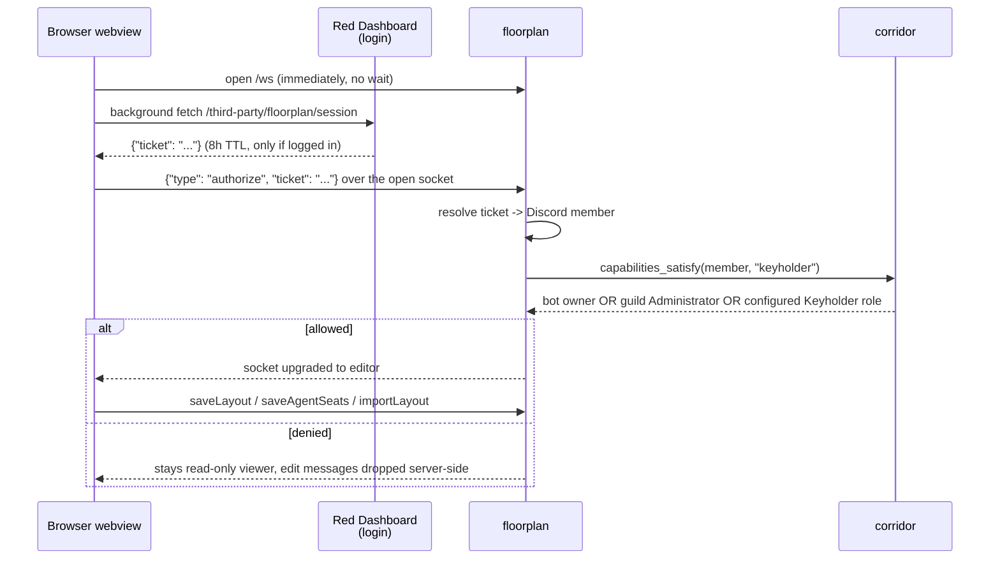
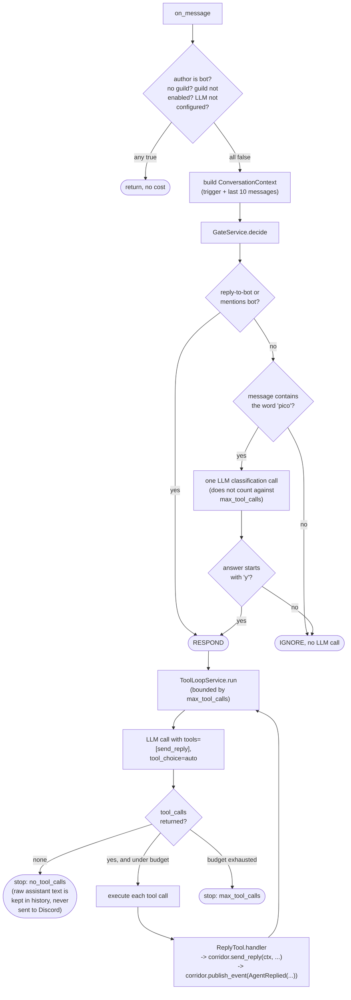
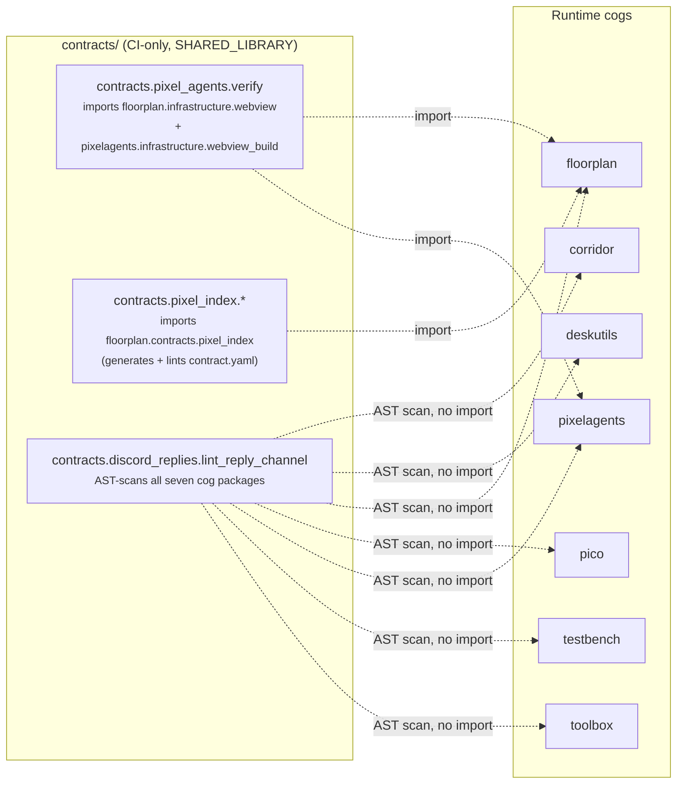

# Cross-cog architecture

This doc is the one place that shows how this repo's eight packages —
[`corridor`](../corridor), [`deskutils`](../deskutils),
[`floorplan`](../floorplan), [`pico`](../pico),
[`pixelagents`](../pixelagents), [`testbench`](../testbench),
[`toolbox`](../toolbox), and the CI-only [`contracts`](../contracts) —
relate to and depend on each other. It does
not replace any package's own `Architecture.md` (linked throughout below);
those cover one package's internal layers in depth. This doc's only job is
the picture across packages: who depends on whom to load, who owns what,
and how a request actually crosses package boundaries at runtime.

If you're new to this repo, read [`docs/AGENTS.md`](AGENTS.md) first for
the one-paragraph purpose of each package, then come back here for the
diagrams.

## 1. Runtime dependency graph

This is the `required_cogs` graph declared in each package's `info.json`,
verified against `develop`. It's the most basic "who needs whom to load"
picture — see [`docs/dependency-loading.md`](dependency-loading.md) for
*how* that loading actually happens (Red itself doesn't enforce
`required_cogs`; every cog hand-rolls it).

Notes, all confirmed against each package's `info.json`:

- **corridor's own `required_cogs` is empty.** It sits at the bottom of the
  graph — every other cog depends on it, it depends on nothing here.
- **floorplan is the only cog with two dependencies** — it declares both
  `corridor` and `pixelagents`.
- **No cog depends on floorplan, pico, testbench, toolbox, or deskutils.**
  They're leaves: things end here, nothing in this repo builds on top of
  them.
- corridor's `info.json` sets `"type": "COG"` and `"hidden": true`. It is a
  real, loaded Red Cog — not the `SHARED_LIBRARY` type `contracts` uses —
  but it's hidden from end users because its own command surface
  (`[p]corridorsettings`) is the only thing meant to be discovered
  directly; see [`docs/corridor.md`](corridor.md)'s opening section for why
  that distinction matters. Functionally it behaves like shared
  infrastructure every other cog is built on, even though `info.json`
  classifies it the same way as any other cog.
- `toolbox` and `pixelagents` have **no direct dependency on each other** —
  neither lists the other in `required_cogs`, and nothing in
  `pixelagents/infrastructure/webview_build.py`'s missing-tool error
  message (`owner_notification_for`) mentions `[p]toolbox node install` or
  any toolbox command; it only says "Install the missing tool(s), then run
  `[p]pixelagents webview rebuild`." The relationship is operational, not
  coded: `toolbox/README.md` documents that toolbox is "useful alongside
  `pixelagents`, whose webview build needs `node`/`npm` present on the same
  host" — a bot owner runs `[p]toolbox node install` on a fresh host
  *before* `pixelagents`' build pipeline can succeed there, but neither cog
  enforces or checks that ordering in code.

## 2. Ownership map: who does what

The dependency graph above says nothing about what each package actually
*does*. Grouped by responsibility instead of by edges:

Every arrow into `corridor` in diagram 1 becomes an arrow *out of*
`corridor` here, because corridor is a provider every dependent calls into
— it's not itself calling into anything downstream. The
`pixelagents -> floorplan` edge is deliberately not a filesystem
convention: it's resolved cross-cog via `bot.get_cog("PixelAgents")` (or
`corridor.dependency_loader.ensure_loaded`), reading a small
`WebviewBundleStatus` surface (`dist_path`, `ready`, `detail`,
`built_commit`, `built_base_path`) — see
[`pixelagents/Architecture.md`](../pixelagents/Architecture.md#the-webview_bundle_status-cross-cog-surface)
and [`docs/dependency-loading.md`](dependency-loading.md).

## 3. Runtime data flow: floorplan (the most complex path)

floorplan is the one package that fans out across Discord, Red Dashboard,
corridor, and pixelagents' build output at once. The full routing,
Traefik, and dashboard-serving detail lives in
[`floorplan/Architecture.md`](../floorplan/Architecture.md) — this section
only shows how the *other packages* enter that picture; go there for the
byte-level HTTP/WebSocket routes.

### 3a. Presence mirroring (via corridor's PubSub bus)

floorplan is both publisher and subscriber here — the bus is the seam
between "listening to Discord" and "rendering to the canvas" inside
floorplan itself, which is what lets a second producer plug in without
floorplan's gateway listeners or translation code changing at all. pico
is that second producer (§4): it publishes `AgentReplied` directly for
its own replies, and `testbench` can publish any of corridor's six event
types manually, for testing. See
[`docs/corridor-pubsub-design.md`](corridor-pubsub-design.md) for the
full domain model, all six event types, delivery semantics, and the
subscription-lifecycle/defensive-cleanup details this condensed diagram
leaves out.

### 3b. Editor authorization and layout edits (corridor-gated)

Permission *configuration* (which Discord roles count as Keyholder) lives
entirely in corridor, set via `[p]corridorsettings` — floorplan holds no
role IDs of its own. See
[corridor's permission model](corridor.md#the-permission-model) and
[floorplan's own editor-authorization section](../floorplan/Architecture.md#editor-authorization)
for the full ticket/socket handshake.

### 3c. Serving the bundle pixelagents built

```mermaid
flowchart LR
    PA["pixel-agents-hq/pixel-agents<br/><small>upstream source, pinned commit</small>"]
    PIX["pixelagents<br/><small>clone + npm/vite build<br/>at cog_load</small>"]
    DIST["webview_dist/<br/><small>pixelagents' own<br/>Red cog_data_path</small>"]
    FP["floorplan<br/><small>WebviewAssetProvider</small>"]
    DASH["Red Dashboard<br/><small>third-party page router</small>"]
    B["Browser"]

    PA -->|"git clone/fetch @ pinned commit"| PIX
    PIX -->|"vite build --base ./<br/>(asset-URL-relative)"| DIST
    DIST -->|"webview_bundle_status()<br/>polled before every render"| FP
    FP -->|"injects &lt;base href='/third-party/floorplan/static/'&gt;"| DASH
    DASH -->|"/third-party/floorplan"| B
```

The build is asset-URL-relative on purpose — pixelagents doesn't know in
advance which cog will serve it, so it bakes in no cog-specific route.
floorplan is the only current consumer and is the one that injects its own
`<base href>` at serve time. See
[pixelagents' "Building `webview_dist`"](../pixelagents/Architecture.md#building-webview_dist)
and [floorplan's "The webview bundle"](../floorplan/Architecture.md#the-webview-bundle).

## 4. Runtime data flow: pico's gate-then-tool-loop

Verified directly against `pico/adapters/listener.py`,
`pico/application/gate_service.py`,
`pico/application/tool_loop_service.py`, and `pico/tools/reply_tool.py` —
not just the one-grep summary this doc started from. The actual shape:

The bounded-loop guarantee is structural, not a convention: `ToolLoopService`
never calls anything Discord-facing itself — the *only* Discord send in the
whole cog is `ReplyTool.handler`, which is why pico stays compliant with
`contracts/discord_replies/lint_reply_channel.py`'s "always through
corridor" rule without needing any pico-specific exception. `pico` ships
one native tool (`send_reply`), plus whatever any other cog has registered
into corridor's cross-cog tool registry (`deskutils`' `time` today) —
`ToolLoopService` itself doesn't distinguish between the two; the tool-loop
shape supports both without changing this diagram. See
[`docs/corridor-tool-registry-design.md`](corridor-tool-registry-design.md)
for how a cog registers one and how pico adapts it.

`ReplyTool.handler` also publishes `AgentReplied` onto corridor's bus
right after a successful send (§3a) — floorplan's own subscriber renders
it the same way it renders a tracked member's own message, with no
pico-specific code anywhere in floorplan. That `send_reply` call also
creates a real Discord message, which floorplan's `on_message` listener
(§3a's publisher half) would otherwise see and publish a *second*
`AgentReplied` for — `on_message` specifically excludes messages from
this bot's own account (never other bots) to avoid that double-publish.
See [`docs/corridor-pubsub-design.md`](corridor-pubsub-design.md) for the
full mapping table and the `AgentStatusChanged` publish pico doesn't make
yet.

## 5. CI-only relationships (not `required_cogs`)

The edges above are all things that matter at runtime, when a bot is
actually running. `contracts/` (repo root) introduces a second, unrelated
kind of edge that only exists in CI: Python **imports**, not Red **cog
dependencies**. `contracts/info.json` sets `"type": "SHARED_LIBRARY"`
specifically so Red's Downloader excludes it from cog discovery — it is
never `[p]load`ed by a running bot.

Confirmed one-directional: nothing under `pixelagents/` or `floorplan/`
imports from `contracts/` (a `grep` across both trees for
`from contracts` / `import contracts`, outside test fixtures, comes back
empty). The dashed arrows above only run in CI — they never execute inside
a live bot process, and reversing the direction of any of them would be a
real, if strange, code change; today it's structurally impossible.

- **`contracts.pixel_agents.verify`** runs the *actual* production build
  path (`pixelagents.infrastructure.webview_build.ensure_webview_built`)
  against the currently pinned commit, then hands the result to
  floorplan's real `WebviewAssetProvider` — a consumer-driven contract
  test, not a mock.
- **`contracts.pixel_index.*`** generates `contract.yaml` from
  `floorplan/contracts/pixel_index.py` + `contracts/pixel_index/endpoints.py`
  on every run (never hand-maintained), then verifies it against a live
  Pixel Index environment.
- **`contracts.discord_replies.lint_reply_channel`** is different in kind
  from the two above: it doesn't import any cog's code as a live module at
  all. It statically indexes every function/method in each of
  `corridor`, `deskutils`, `floorplan`, `pico`, `pixelagents`, `testbench`,
  `toolbox` (`COG_PACKAGES` in the script), AST-walks every Red command
  handler's reachable call graph, and fails the build if a handler reaches
  a raw `ctx.send`/`interaction.response.send_message`/`.followup.send`
  without that call graph ever reaching `corridor.send_reply`/`render_reply`.

See [`docs/contract-testing.md`](contract-testing.md) for the full
methodology behind the two `verify` scripts, and
[`pixelagents/Architecture.md`](../pixelagents/Architecture.md#pixelagents-and-the-repo-root-contracts)
for why `pixelagents/contracts/` (webview outbound-message builders, part
of pixelagents' own runtime) and repo-root `contracts/` (this CI-only
package) are two unrelated things that happen to share a name.

Separately, [`.github/workflows/check-cogs.yml`](../.github/workflows/check-cogs.yml)
load-tests each of the seven real cogs one at a time, alphabetically
(`corridor` → `deskutils` → `floorplan` → `pico` → `pixelagents` →
`testbench` → `toolbox`, per
[`docs/dependency-loading.md`](dependency-loading.md#the-ci-smoke-test-and-the-tradeoff-we-accept)),
checking each loads cleanly from a clean state rather than being silently
dragged in by an earlier cog's own dependency loading. That's a different
CI check again — a Red-Downloader load smoke test, not a Python import or
an AST scan — and doesn't touch `contracts/` at all.
