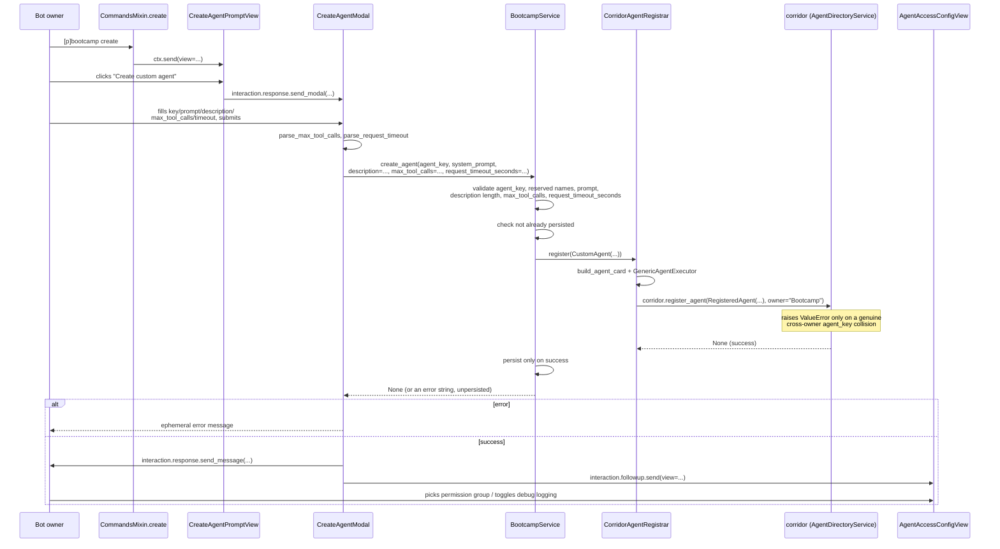
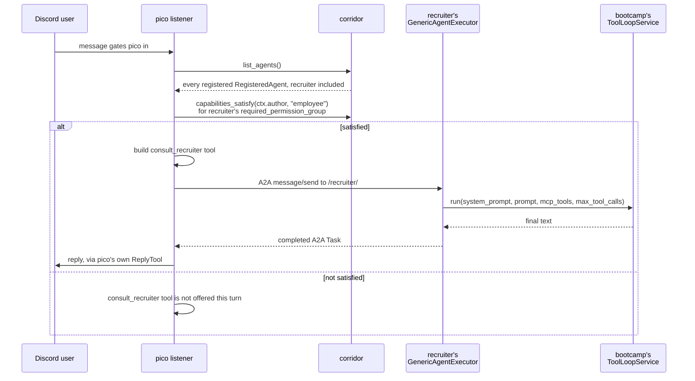
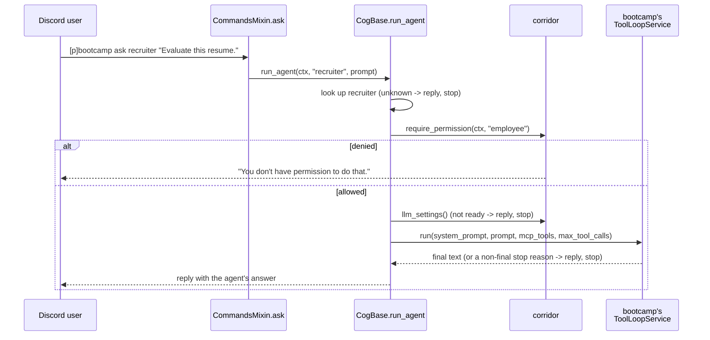

# bootcamp: dynamically created LLM agents, gated per agent

## 1. Overview

`bootcamp` lets a bot owner create/remove/edit an open-ended set of custom
LLM agents at runtime, each with its own system prompt, description,
tool-call budget, and LLM request timeout, via a Components V2 panel
(`[p]bootcamp create`) plus a handful of per-field edit commands
(`[p]bootcamp remove/list/permission/maxtoolcalls/debuglogging/
requesttimeout/description`).
Every custom agent registers into corridor's shared `AgentDirectoryService`
-- the same directory [`architect`](architect-design.md) and
[`painter`](painter-design.md) each register their one singleton agent
into (see [`docs/agent-directory-design.md`](agent-directory-design.md)) --
so `pico` discovers and consults it dynamically with zero pico-specific
code beyond the shared permission gate this cog introduced, it gets
whatever MCP tools are currently granted to it via corridor's
`AgentToolServerRegistry` (`suggestionbox`/`telephonepole`, see
[`docs/suggestionbox-design.md`](suggestionbox-design.md)/
[`docs/telephonepole-design.md`](telephonepole-design.md)) with zero
changes to either of those cogs, and its presence/tool-usage activity
shows up on cctv exactly like architect/painter's already do.

Unlike architect/painter -- one hardcoded agent each, registered once at
`cog_load` -- bootcamp hosts a bot-owner-managed, growing set of agents,
each registered/unregistered independently at runtime. A custom agent can
also be consulted directly, bypassing pico entirely, with
`[p]bootcamp ask <agent_key> <prompt>`.

**Who may create an agent** is a separate, bot-owner-only concern
(matching telephonepole's own precedent for registering bot-wide LLM
capability) from **who may use one once created**, which each agent's own
creator sets via a corridor permission-group key
(`[p]bootcamp permission <agent_key> <group_key>`, default `"employee"`
-- corridor's reserved always-satisfied tier, see
[`docs/corridor.md`](corridor.md)'s Permissions section).

## 2. Architecture

```mermaid
flowchart LR
    subgraph BC["bootcamp"]
        Cmds["Commands<br/>[p]bootcamp create/remove/list/<br/>permission/maxtoolcalls/debuglogging/<br/>requesttimeout/description/ask"]
        Panel["CreateAgentPromptView -> CreateAgentModal<br/>-> AgentAccessConfigView"]
        Svc["BootcampService<br/>create_agent, remove_agent, restore_all"]
        Repo["RedBootcampRepository<br/>Config: agents"]
        Registrar["CorridorAgentRegistrar<br/>the only corridor.domain.RegisteredAgent /<br/>agent_executor import"]
        TL["ToolLoopService<br/>bootcamp's own bounded tool-calling loop"]
    end

    subgraph Corridor["corridor"]
        Dir["AgentDirectoryService<br/>agent_key -> (owner, RegisteredAgent)"]
        McpReg["AgentToolServerRegistry"]
        A2A["A2AServer<br/>ONE shared listener"]
    end

    Pico["pico<br/>sole A2A coordinator"]
    MCP["suggestionbox / telephonepole<br/>registered MCP servers"]

    Cmds -- "create opens" --> Panel
    Panel -- "on modal submit: create_agent(...);<br/>then set_permission_group/set_debug_logging" --> Svc
    Cmds -- "remove/edit" --> Svc
    Svc -- "persist agent_key -> settings" --> Repo
    Svc -- "register/unregister" --> Registrar
    Registrar -- "register_agent(RegisteredAgent(...,<br/>required_permission_group))" --> Dir
    Dir -- "rebuild_routes" --> A2A
    Registrar -- "GenericAgentExecutor(tool_loop=TL, ...)" --> TL
    Pico -- "list_agents() each turn,<br/>capabilities_satisfy per agent" --> Dir
    Pico -- "A2A message/send to<br/>corridor:PORT/<agent_key>/" --> A2A
    A2A -. "dispatches to that<br/>agent's GenericAgentExecutor" .-> TL
    Cmds -- "ask: run_agent(...) in-process,<br/>no A2A round-trip" --> TL
    TL -- "list_agent_tools_for(agent_key)<br/>each turn" --> McpReg
    McpReg --> MCP
```



bootcamp is a pure consumer of corridor's existing `AgentDirectoryService`
and `AgentToolServerRegistry` -- no corridor change was needed to support
*multiple* agents from one owner (`AgentDirectoryService.register` is
already keyed by `agent_key` alone, with `owner` as a plain string tag;
`unregister_agent_owner("Bootcamp")` removes every agent this cog ever
registered in one call, regardless of how many). The one corridor change
this cog needed is additive: `RegisteredAgent` gained an optional
`required_permission_group: str | None = None` field (default preserves
architect/painter's existing unrestricted behavior exactly), and pico's
own `_agent_tools` (`pico/adapters/listener.py`) now checks it via
`corridor.capabilities_satisfy` before offering a `consult_<agent_key>`
tool for a given turn. See
[`docs/agent-directory-design.md`](agent-directory-design.md) for that
field's own documentation.

Also unlike architect/painter, which each carry a thin `AgentExecutor`
subclass fixing a constant `agent_name`/`logger`
(`ArchitectAgentExecutor`, `PainterAgentExecutor`), bootcamp constructs
`corridor.domain.agent_executor.GenericAgentExecutor` directly, once per
custom agent, passing that agent's own `agent_key` as `agent_name` --
there is no fixed identity to subclass for, since bootcamp hosts an
open-ended set of them.

## 3. Domain model / schema

```python
# domain/models.py
@dataclass(frozen=True, slots=True)
class CustomAgent:
    agent_key: str                      # display name + pico's consult_<agent_key> suffix
    system_prompt: str
    permission_group: str = "employee"  # gates *use*, both directly and through pico
    max_tool_calls: int = 8
    debug_logging: bool = False
    request_timeout_seconds: float | None = None  # None = corridor's own default (30s)
    description: str | None = None      # None = auto preview of system_prompt
```

`agent_key` doubles as the display name and corridor's A2A mount path --
there is no separate `name`/`base_url` split like telephonepole's, since a
bootcamp agent has no external URL identity to preserve across a rename.
It must match `^[a-z][a-z0-9_]*$` and cannot be one of the reserved
subcommand names (`create`, `remove`, `list`, `permission`,
`maxtoolcalls`, `debuglogging`, `requesttimeout`, `description`) -- both
checked by `BootcampService.create_agent`, never by the dataclass itself.

`description` becomes this agent's `AgentCard.description` -- the
LLM-facing text pico's own `_agent_tools` hands the model as the
`consult_<agent_key>` tool's description, i.e. the one signal pico's LLM
has when deciding *whether* to consult this agent at all (see
`docs/agent-directory-design.md`). `None` (the default) falls back to a
truncated preview of `system_prompt` (`adapters/cog_base.py`'s
`_agent_description`) -- a creator should set this explicitly whenever the
system prompt doesn't front-load a clear statement of purpose in its
first ~200 characters, since that makes a poor routing signal. Capped at
`MAX_DESCRIPTION_LENGTH` (500 characters) -- a concise "when to use this
agent" blurb, not the full prompt.

`request_timeout_seconds` overrides corridor's shared LLM connection's own
default total-request timeout (`REQUEST_TIMEOUT_SECONDS` in
`corridor/infrastructure/llm_client.py`, 30s) for this one agent's calls,
on both the direct-`ask` and pico/A2A paths -- unlike `max_tool_calls`/
`debug_logging`, architect and painter have no way to configure this
themselves; it's bootcamp-specific. Flows to `LiteLLMClient.complete`'s own `timeout` kwarg through
`ToolLoopService.run`'s `request_timeout_seconds` parameter and corridor's
shared `SupportsAgentSettings`/`SupportsToolLoop` protocols
(`corridor/domain/agent_executor.py`) -- architect and painter carry a
matching but always-`None`, unused field on their own `GlobalSettings`
purely to keep satisfying that same shared protocol.

Persisted in Red `Config` (global, not per-guild -- corridor's agent
directory is process-wide, so a registered agent's own settings must be
too, same rationale telephonepole's `agent_access` uses):

```python
GLOBAL_DEFAULTS = {
    # agent_key -> {system_prompt, permission_group, max_tool_calls,
    # debug_logging, request_timeout_seconds, description}
    "agents": {},
}
```

## 4. Key flows

### Creating an agent

Discord caps a `Modal` at 5 components, so creation is a two-step
Components V2 flow rather than one text command: `[p]bootcamp create`
sends `CreateAgentPromptView` (one button, since a `Modal` can only be
opened in response to a real interaction -- a classic prefix invocation is
not one); clicking it opens `CreateAgentModal`, whose five `TextInput`s
are exactly the fields that are free-form text (`agent_key`,
`system_prompt`, `description`, `max_tool_calls`, `request_timeout`).
`permission_group`/`debug_logging` don't fit a sixth/seventh field anyway
-- a `Select` constrained to the guild's actually-configured groups, and a
toggle button, both fit better than typed text -- so they're chosen right
after, on `AgentAccessConfigView`, sent as a follow-up once the modal
successfully creates the agent (default `"employee"`/`False` until then).



`create_agent` only persists the entry if registration actually
succeeded -- an invalid/reserved/already-used `agent_key`, an empty
prompt, an overlong `description`, or a genuine cross-owner collision all
come back as an error string instead of a silent no-op or a stale,
unreachable persisted entry, matching telephonepole's own `add_server`
never-raise convention.

### Restoring on `cog_load`

Corridor's `AgentDirectoryService` is in-process, in-memory state -- it
does not survive a bot restart, even though bootcamp's own `Config` does.
`cog_load` calls `BootcampService.restore_all()`, which re-registers every
persisted agent and collects `{agent_key: error}` for any that fail
(a fresh cross-owner collision, in practice) without raising -- a failed
entry stays in `Config` (so `[p]bootcamp list` still shows it) and the bot
owner is notified by DM.

### Pico consults a custom agent dynamically



An agent's `permission_group` is baked into corridor's stored
`RegisteredAgent` snapshot at registration time -- `[p]bootcamp
permission` re-registers to update it immediately; `[p]bootcamp
maxtoolcalls`/`debuglogging`/`requesttimeout` only touch `Config`, since
`GenericAgentExecutor`'s `settings` callable re-reads that agent's
`CustomAgent` fresh every turn regardless.

### Direct invocation: `[p]bootcamp ask`



`run_agent` calls bootcamp's own `ToolLoopService` **directly, in-process
-- no A2A round-trip to itself**: a cog invoking its own agent has no cog
boundary to cross, unlike pico's `ConsultAgentTool` (or architect/painter
consulting each other), which are genuinely crossing one. This is the
same reasoning that keeps painter's `consult_architect` on real A2A (a
genuine cross-cog boundary) while this stays a plain method call.

## 5. Command reference

| Command | Gate | Description |
|---|---|---|
| `[p]bootcamp create` | bot owner | Open `CreateAgentPromptView` -> `CreateAgentModal` to create a custom agent (key, system prompt, description, max tool calls, request timeout), then `AgentAccessConfigView` to choose who may use it |
| `[p]bootcamp remove <agent_key>` | bot owner | Remove a custom agent |
| `[p]bootcamp list` | bot owner | Open a Components V2 panel listing every custom agent and its full settings |
| `[p]bootcamp permission <agent_key> <group_key>` | bot owner | Set which corridor permission group gates use of an agent |
| `[p]bootcamp maxtoolcalls <agent_key> <value>` | bot owner | Set an agent's per-turn tool-call budget |
| `[p]bootcamp debuglogging <agent_key> <true\|false>` | bot owner | Toggle an agent's debug-event streaming |
| `[p]bootcamp requesttimeout <agent_key> <seconds\|default>` | bot owner | Override an agent's LLM request timeout, or reset it to corridor's own default |
| `[p]bootcamp description <agent_key> <text\|default>` | bot owner | Set an agent's `AgentCard` description, or reset it to the auto-derived preview |
| `[p]bootcamp ask <agent_key> <prompt...>` | that agent's own `permission_group` | Directly consult a custom agent |

Every field the modal sets (`description`, `max_tool_calls`,
`request_timeout_seconds`) is independently editable afterward through its
own command above -- the modal is the fast path for creation, not the only
way to change these settings.

`ask` is deliberately **not** decorated with `@commands.is_owner()`, and
the top-level `bootcamp_group` callback carries no permission check either
(discord.py checks on a `Group` are inherited by every subcommand,
`ask` included) -- its authorization lives entirely in `CogBase.run_agent`,
against that specific agent's own `permission_group`, checked via
corridor's existing `require_permission`.

Every custom agent also automatically appears as a toggle row in
`[p]telephonepole agents <name>`/`[p]suggestionbox agents` -- both list
`corridor.list_agents()` generically, with no code change needed here.

## 6. Validation & error handling

`BootcampService` never raises out to its caller -- every failure mode
returns an error string (or, for `restore_all`, a `{agent_key: error}`
mapping), matching corridor's own `AgentDirectoryService.register`
never-raise convention:

- **Invalid `agent_key`** -- must match `^[a-z][a-z0-9_]*$`, checked
  before anything else.
- **Reserved `agent_key`** -- one of the fixed subcommand names above;
  rejected so `[p]bootcamp <agent_key> ...` can never collide with a
  real subcommand.
- **Empty `system_prompt`** / **overlong `description`** (over
  `MAX_DESCRIPTION_LENGTH`, 500 chars) / **non-positive `max_tool_calls`**
  / **non-positive `request_timeout_seconds`** -- rejected up front.
- **An unparseable `max_tool_calls`/`request_timeout` in the create
  modal** -- every `TextInput` arrives as a plain string, so `CreateAgentModal.on_submit`
  parses them (`adapters/validation.py`'s `parse_max_tool_calls`/
  `parse_request_timeout`) before ever calling `create_agent`, and replies
  with an ephemeral error on failure rather than forwarding a raw
  `ValueError` from `int()`/`float()`.
- **Already exists** -- checked against bootcamp's own repository
  *before* calling the registrar, so a duplicate `create` never triggers
  a redundant registration attempt.
- **Cross-owner `agent_key` collision** -- corridor's directory
  deliberately *raises* `ValueError` (not an error string) when the same
  `agent_key` is already registered by a different owner, treating it as
  a real authoring conflict rather than something to silently paper over.
  `BootcampService` catches that `ValueError` and folds it into the same
  string-error return, so a bot owner sees one consistent failure surface
  regardless of which layer rejected the request.
- **`restore_all` on `cog_load`** -- a per-agent failure is collected, not
  fatal to the cog's own load; the bot owner is notified by DM (a
  best-effort send, itself wrapped so a DM failure can't fail `cog_load`).

`run_agent`'s own error paths (unknown agent, permission denied, LLM not
configured, a non-`final_text` stop reason) each reply once to `ctx` and
return `None` -- no exception ever escapes to Discord's own command error
handler.

## 7. Design rationale

**Why a corridor extension instead of a bootcamp-only workaround.**
Enforcing "a Discord user without the right permission group can't get
pico to consult this agent" requires checking that specific user's
capabilities *before* pico ever issues the A2A call -- and only pico's
own turn-handling code has that Discord member identity at all; a
registered agent's own `AgentExecutor` receives no caller identity over
A2A by design (see the hub-and-spoke rationale in
[`docs/agent-directory-design.md`](agent-directory-design.md)). The
alternative -- skip pico-side gating, only gate the direct `ask` command
-- would leave the pico-mediated path always unrestricted, defeating the
whole point of a per-agent permission group. Making the new field
optional (`None` default) means architect/painter, which never set it,
keep their exact current behavior with zero change to their own code.

**Why `agent_key` doubles as the display name, unlike telephonepole's
`name`/`base_url` split.** Telephonepole's split exists so the same
external `base_url` can be re-added under a new `name` without colliding
with corridor's own base_url-keyed bookkeeping. A bootcamp agent has no
external URL of its own -- its identity *is* its `agent_key`, mounted at
corridor's own `/<agent_key>/` -- so a second field would only add
indirection with nothing to preserve across a rename (renaming is instead
just "remove, then create under the new key").

**Why creation is bot-owner-only but *use* is a configurable permission
group.** Creating an agent hands it an arbitrary system prompt and,
depending on what's currently registered, real MCP tool access -- bot-wide
capability configuration, the same class of decision telephonepole's
third-party MCP server registration already treats as owner-only. Once
created, though, the whole point is for ordinary members (or a narrower
tier) to actually use it -- a single global "owner-only to use" gate would
make the feature pointless for anything but the owner's own testing.

**Why `GenericAgentExecutor` directly, not a thin per-cog subclass.**
Architect/painter's own subclasses (`ArchitectAgentExecutor`,
`PainterAgentExecutor`) exist purely to fix a constant `agent_name`/
`logger` on construction -- there is no such per-cog constant here, since
every instance is a different, dynamically-named agent. Passing
`agent_name`/`tool_loop`/`settings`/etc. straight to `GenericAgentExecutor`
per `CustomAgent` needs no subclass at all.

**Why a modal plus a separate follow-up panel, not one form.** A Discord
`Modal` is hard-capped at 5 components, and `agent_key`/`system_prompt`/
`description`/`max_tool_calls`/`request_timeout` already fill all five --
there is no room left for `permission_group`/`debug_logging` even if a
`TextInput` were the right widget for them, which it isn't:
`permission_group` should be a `Select` constrained to the guild's
actually-configured groups (typing a stale or misspelled key would
silently degrade to "owner only," the same footgun
`docs/agent-directory-design.md` already flags for a hardcoded group key),
and `debug_logging` is a plain boolean toggle. Splitting the flow across a
modal (free text) and a follow-up panel (constrained choices) matches each
setting to the input widget suited to it, rather than forcing everything
into free-form text or a second five-field modal.

**Why `ask` runs the tool loop in-process instead of over A2A.**
Pico's `ConsultAgentTool` and painter's `consult_architect` both cross a
real cog boundary -- a different process-role, if not always a different
process. A bootcamp Discord command invoking one of bootcamp's own agents
has no such boundary: the `CustomAgent`'s settings, corridor's shared LLM
connection, and the MCP tool registry are all already available in the
same call. Round-tripping through corridor's own A2A listener to reach
code running in the same cog would add a real network hop for no benefit.

See [`docs/agent-directory-design.md`](agent-directory-design.md) for how
bootcamp's agents register with corridor and get discovered by pico,
[`docs/corridor.md`](corridor.md) for the permission-group model
`permission_group` references, and
[`docs/telephonepole-design.md`](telephonepole-design.md)/
[`docs/suggestionbox-design.md`](suggestionbox-design.md) for the MCP
tool registry every custom agent draws from.
