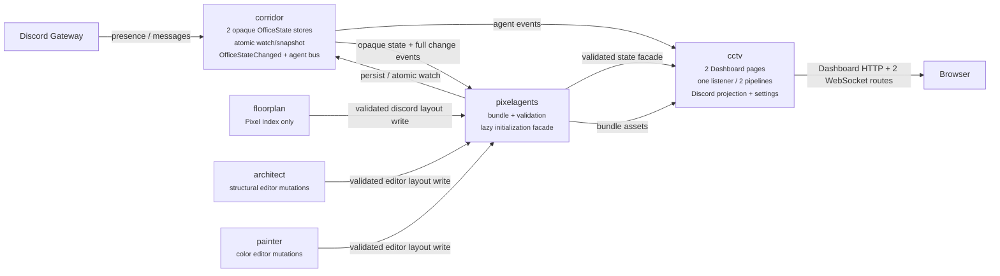
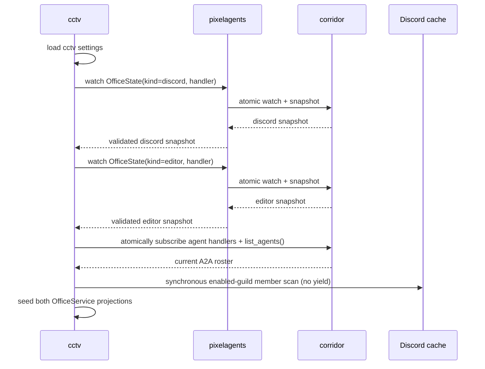
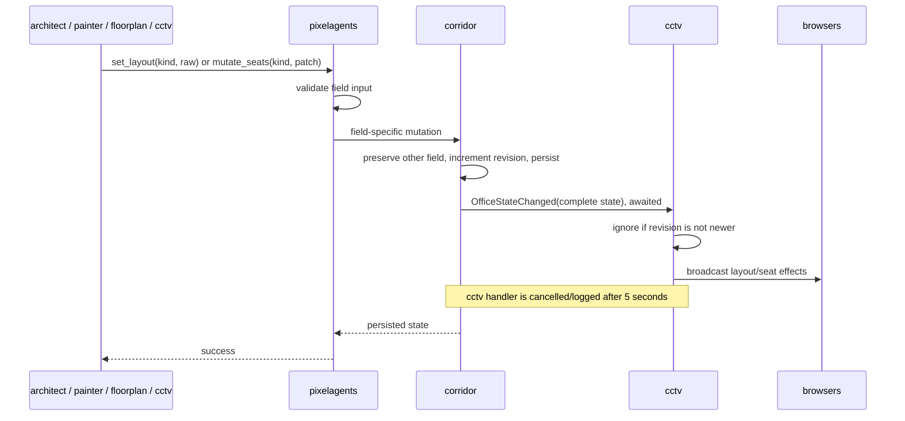
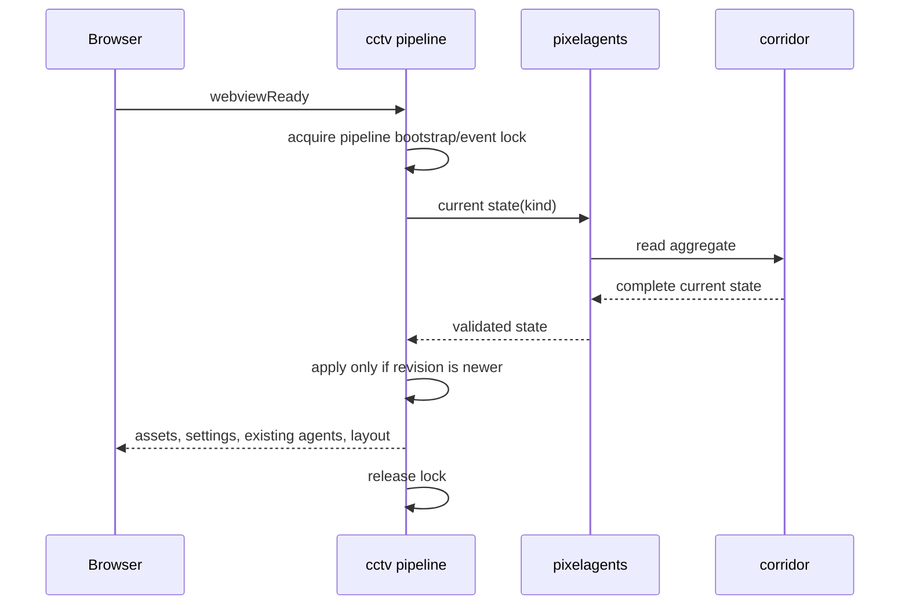

# Extracting dashboard hosting into a new `cctv` cog

**Status: decided, implementation pending.** This document is the agreed
implementation design. Its factual baseline was checked against this repository
on 2026-08-31, and every architecture choice below was resolved with the repo
owner during design validation. There are no remaining product or cross-cog
architecture questions; exact private helper names remain implementation details.

The refactor extracts all browser-facing office hosting from `floorplan` and
`architect` into one new cog, `cctv`. Loading `cctv` provides two independent
Pixel Agents pages through one Dashboard namespace and one HTTP/WebSocket
listener. Without `cctv`, there is no dashboard or office WebSocket surface, but
Pixel Index operations and architect/painter layout mutations continue to work.

## 1. Verified current state

### 1.1 Two independently hosted pages

`floorplan` and `architect` currently each carry their own dashboard stack:

| Concern | `floorplan` | `architect` |
|---|---|---|
| Persisted layout | Its own Config `layout` plus avatar `seats` | The pixelagents-owned office-layout Config shared with painter |
| WebSocket | `/ws`, normally `0.0.0.0:3210` | `/architect/ws`, normally `127.0.0.1:8932` |
| Dashboard route | `/third-party/floorplan` | `/third-party/architect` |
| Assets | Its own `WebviewAssetProvider` copy | A parallel `WebviewAssetProvider` copy |
| Editing | Ticket-gated by bot owner/keyholder | Open to any connected client |
| Roster | Enabled-guild Discord members plus registered A2A agents | Registered A2A agents plus the bot's own Discord account |

The asset provider, client hub, WebSocket transport, and Dashboard adapter are
duplicated because neither cog may import the other. Both instead consume the one
static bundle built by `pixelagents`.

Architect does **not** have a `TicketStore`; its four dashboard/WebSocket files
are the three infrastructure modules (`websocket`, `client_hub`, `webview`) plus
`adapters/dashboard.py`. Floorplan has those four concerns plus `tickets.py`.

### 1.2 The bundle needs distinct WebSocket paths

The vendored bundle derives its live URL from `window.location.host` and always
opens `/ws`. The page path is not part of that decision. Architect therefore
injects a rewrite shim that redirects its page to `/architect/ws`.

This remains necessary after extraction. The two pages share static files, but
each entry page injects a different rewrite target. Sharing a cog or TCP listener
does not mean sharing live state.

### 1.3 The two office states are intentionally different

- The **Discord office** is the floorplan-style presence canvas. It is editable
  by bot owners/keyholders, is populated from enabled Discord guilds, and is the
  target of Pixel Index layout loads.
- The **editor office** is architect/painter's shared sandbox. Architect mutates
  structure, painter mutates colors, and its browser editor remains deliberately
  unauthenticated.

They do not merge. A Pixel Index load does not alter architect's office; an
architect or painter mutation does not alter the Discord office.

### 1.4 Presence publishing already belongs to corridor

Corridor, not floorplan, owns the Discord gateway event publishers. Floorplan is
currently a pure subscriber that filters corridor's unconditional events using
its own guild/display settings and performs a direct full guild scan at startup.
The previous version of this design incorrectly described floorplan as retaining
presence publishing.

Corridor's A2A directory also publishes `AgentPresenceChanged` when architect,
painter, or another registered agent loads/unloads. `list_agents()` supplies the
current A2A roster, but the event bus has no history.

### 1.5 Painter is implemented

Painter is a shipped cog, not a future issue. It reads/writes the same editor
layout as architect and currently calls architect's best-effort
`notify_shared_layout_changed()` hook after a successful recolor. The new shared
office-state event removes that hook.

### 1.6 Current writes persist before broadcasting

Architect and painter persist a complete layout before attempting a browser
notification. A missing dashboard never prevents the data write. Corridor's
existing event bus dispatch is synchronous and awaited with per-subscriber
exception isolation; a publisher does not return until handlers finish.

The new design preserves synchronous office-state delivery, but bounds each
office-state subscriber to five seconds so a stuck dashboard cannot block a
writer indefinitely.

## 2. Final architecture

### 2.1 Responsibility map

| Cog | Responsibility after the refactor |
|---|---|
| `corridor` | Persist two opaque revisioned office aggregates; provide atomic watch-and-snapshot; publish full office-state events |
| `pixelagents` | Own office-state schemas, validation, field-specific update facade, and lazy default initialization |
| `cctv` | Own both Dashboard pages, the single listener, both client pipelines, Discord roster projection, display settings, and editor authorization |
| `floorplan` | Own Pixel Index API/Web configuration, browsing, and loading a catalogue layout into the Discord aggregate |
| `architect` | Own its LLM/A2A/tool behavior and structural editor-layout mutations; no dashboard/WebSocket code |
| `painter` | Own its LLM/A2A/color behavior and editor-layout color mutations; no dashboard notification hook |

Every cog in this repository is released from one synchronized Git revision.
Mixed revisions are unsupported and no runtime protocol-version negotiation is
added.

### 2.2 Two revisioned aggregates

Corridor owns two separately persisted aggregates selected by a closed kind:

```python
OfficeStateKind = Literal["discord", "editor"]

@dataclass(frozen=True, slots=True)
class OfficeState:
    kind: OfficeStateKind
    layout: dict[str, object]
    seats: dict[str, dict[str, object]]
    revision: int
```

Both aggregates contain all three state fields:

- `layout`: raw Pixel Agents layout JSON;
- `seats`: avatar palette/hue/seat-assignment records;
- `revision`: a monotonically increasing aggregate revision.

The editor's `seats` is no longer a null repository. It persists A2A-agent
avatar placement in the same wire-shaped record used by the Discord page.
Semantic chairs and occupants remain inside `layout`; they are not duplicated in
the aggregate's avatar-seat map.

Both aggregates initialize independently and lazily from the same bundled
default layout, with an empty `seats` map and their initial revision. Initialization
is atomic and idempotent, so whichever consumer reaches an absent aggregate first
creates it exactly once.

### 2.3 Field-specific, last-write-wins mutations

Pixelagents exposes typed operations over corridor's opaque persistence:

- read one complete aggregate;
- set/replace `layout`, preserving the current `seats`;
- mutate/replace `seats`, preserving the current `layout`;
- atomically watch an aggregate and receive its initial snapshot.

Every successful layout or seat mutation increments the aggregate revision and
publishes the resulting complete state. Callers never replace the whole aggregate,
so a layout write cannot erase unrelated avatar assignments and a seat write
cannot restore an older layout.

Concurrency is deliberately **last-write-wins within each field**. Revisions are
used to order snapshots/events, not as compare-and-set preconditions. The existing
browser protocol carries no revision, and it is not extended by this refactor.
Concurrent layout writers can overwrite one another; this is an accepted tradeoff,
not an unhandled case.

### 2.4 Atomic watch and snapshot

Corridor provides an atomic watch-and-snapshot operation. Under the office-state
lock it registers the subscriber and captures the current aggregate. A writer
cannot land in an unobservable gap between those actions.

The returned snapshot and every later event include a revision. `cctv` ignores a
state whose revision is not newer than the one already applied. Duplicate delivery
therefore remains harmless.

Corridor also atomically subscribes `cctv` to agent presence/activity and returns
the current A2A directory roster. Immediately after that call returns, `cctv`
performs its Discord guild-cache scan synchronously, without yielding, using
settings it loaded first. This preserves `cctv`'s ownership of the Discord scan
while eliminating the startup gap.

There is one long-lived watcher per aggregate for the lifetime of `cctv`, not one
watcher per browser. On every `webviewReady`, `cctv` still reads the current state
fresh and serializes the bootstrap against live event application, so a late
client never receives only the snapshot from `cctv`'s own startup.

### 2.5 `OfficeStateChanged` delivery

Office mutation publishes a complete post-write snapshot:

```python
@dataclass(frozen=True, slots=True)
class OfficeStateChanged:
    state: OfficeState
```

Office state has its own generated contract/catalog. It is not forced into the
`Agent*` naming convention, does not become part of `AgentActivityEvent`, and is
not offered by testbench's agent-activity UI.

Delivery rules:

1. Persist the field update and new revision.
2. Release the persistence lock.
3. Synchronously await each `OfficeStateChanged` subscriber.
4. Isolate and log subscriber exceptions.
5. Cancel/log a subscriber that exceeds five seconds.
6. Return success to the writer because persistence already succeeded.

The five-second timeout applies only to office-state subscribers. Existing
agent-activity event delivery is unchanged. Since every office event carries the
complete aggregate, the next event or a client's next `webviewReady` repairs a
missed display update.

### 2.6 Pixelagents is the schema boundary

Corridor deliberately treats `layout` and `seats` as opaque JSON-compatible
data. It knows storage, locking, revisions, snapshots, and events, but not the
Pixel Agents schema.

Pixelagents provides the single office-state facade used by `cctv`, floorplan,
architect, and painter. It:

- validates Discord-page layouts against the Pixel Agents wire schema;
- validates editor layouts through the shared Semantic IR codec and furniture
  style manifest;
- validates/merges avatar-seat patches;
- lazily initializes either missing aggregate from the bundled default;
- delegates atomic persistence/watch operations to corridor.

No consumer bypasses this facade for office-state writes.

### 2.7 One `cctv` listener, two isolated pipelines

`cctv` binds one aiohttp listener at `127.0.0.1:3210` by default. The reverse
proxy exposes two distinct live paths:

- `/cctv/discord/ws`
- `/cctv/editor/ws`

One listener/router dispatches those paths to two independent pipelines. Each
pipeline has its own `ClientHub`, `OfficeService`, current revision, bootstrap
lock, and message handler. Only static assets and the TCP listener are shared.

| Page | Dashboard route | Roster | Edit policy |
|---|---|---|---|
| Discord | `/third-party/cctv/discord` | Enabled-guild Discord members plus all registered A2A agents | Ticket required; bot owner or keyholder in an enabled guild |
| Editor | `/third-party/cctv/editor` | All registered A2A agents plus the bot's own Discord account | Open; any connected client may save |

Both pages persist avatar-seat assignments in their respective aggregate.
Registered A2A agents intentionally appear on both pages, preserving current
behavior. The editor retains the bot-account entry so pico's activity can render.

Static assets use one provider and one Dashboard static route. Each entry page
injects its own base path and WebSocket rewrite shim. Only the Discord page
injects the ticket/session upgrade behavior.

### 2.8 `cctv` settings and commands

`cctv` owns a fresh Config identity. No old floorplan or architect setting is
migrated.

Fresh defaults:

- listener host `127.0.0.1`, port `3210`;
- guild disabled;
- include bots enabled;
- rich-presence display enabled;
- message-activity display enabled;
- Discord-page activity clear delay `2.0` seconds;
- editor-page activity clear delay `2.0` seconds.

Guild enablement, include-bots, rich-presence, and message-display settings apply
only to the Discord page. The two clear delays are independently configurable.

Command ownership after extraction:

- **`[p]cctv`**: listener status/configuration, guild enablement, include-bots,
  rich-presence/message display, per-page clear delays, and dashboard status;
- **`[p]floorplan`**: Pixel Index API/Web URL configuration, catalogue browsing,
  and loading;
- **`[p]architect`**: LLM/agent/tool configuration and status, with every
  WebSocket/webview field and command removed.

Changing a Discord display setting reconciles or despawns the affected roster as
floorplan does today. Authorization is re-evaluated after relevant guild/permission
changes and fails closed.

### 2.9 Fresh Config identities; no migration

There is deliberately no migration and no legacy read fallback.

- Corridor's office-state repository uses a fresh Config identity.
- Cctv uses a fresh Config identity for its listener/display settings.
- Floorplan uses a fresh Config identity containing only Pixel Index API/Web
  settings, so previous custom endpoints reset to defaults.
- Architect uses a fresh Config identity for its remaining prompt/max-tool/debug
  settings, so those settings reset to defaults.
- The former floorplan layout/seats/settings, architect WebSocket/settings, and
  pixelagents office-layout values are never read by the new implementation.

Old Config data is not erased. It remains orphaned and manually recoverable, but
the new code exposes no compatibility command or automatic recovery path.

### 2.10 No route or command compatibility

The following old endpoints are removed with no redirect or alias:

- `/third-party/floorplan`
- `/third-party/architect`
- `/ws`
- `/architect/ws`

Old floorplan/architect WebSocket commands and status fields are removed rather
than delegated. Operators must update their reverse proxy and bookmarks for the
new `cctv` paths.

### 2.11 Degraded operation

`cctv` does not fail its cog load solely because the listener cannot bind, the
webview bundle/default is missing, or an aggregate fails validation.

Instead it:

- remains loaded so status/configuration commands work;
- reports the failing component in `[p]cctv status`;
- notifies bot owners best-effort;
- returns a descriptive HTTP 503 from an affected Dashboard page;
- never silently resets corrupt persisted state.

Architect/painter mutations against absent or invalid editor state fail with an
explicit domain error. Once the underlying bundle/configuration is repaired, a
fresh access may initialize/read successfully; no process restart is required
unless the listener bind itself must be retried.

## 3. Runtime flows

### 3.1 Dependency and ownership flow



### 3.2 Atomic startup



### 3.3 State write and live delivery



### 3.4 Browser bootstrap ordering



## 4. Concrete package changes

### 4.1 Corridor

- Add pure `OfficeState`/`OfficeStateChanged` domain values and a closed state
  kind.
- Add a dedicated Config-backed office-state repository with a fresh identifier.
- Add locked field-specific mutation and atomic watch/snapshot services.
- Add a separately generated office-state catalog/contract.
- Preserve the existing agent event catalog and delivery behavior unchanged.

### 4.2 Pixelagents

- Add the one validated office-state facade all consumers use.
- Move/centralize raw layout validation needed by both pages.
- Add lazy, atomic default initialization for both state kinds.
- Keep the bundle build and furniture-style manifest surfaces.
- Stop owning the old shared editor-layout Config store at runtime.

### 4.3 Cctv

- New cog package with corridor and pixelagents as dependencies.
- One Dashboard adapter, asset provider, ticket store, aiohttp listener, and
  health surface.
- Two hubs/services/gateways with distinct paths and auth policies.
- Discord gateway projection, A2A roster projection, and settings commands/panel.
- Degraded status/503/owner-notification behavior.

### 4.4 Floorplan

- Remove WebSocket, client hub, tickets, webview, Dashboard, presence projection,
  and display settings.
- Retain Pixel Index client/catalogue commands/views/tools.
- Load a catalogue layout through pixelagents' Discord-state facade.
- Use a fresh minimal Config repository for Pixel Index API/Web settings.

### 4.5 Architect

- Remove WebSocket, client hub, webview, Dashboard, local presence subscription,
  null avatar-seat repository, and all WebSocket/webview commands/status.
- Read/write the editor aggregate through pixelagents' facade.
- Retain Semantic IR mutation validation, A2A registration, LLM/tool behavior,
  and agent activity publishing.
- Use a fresh Config identifier for remaining settings.

### 4.6 Painter

- Read/write the editor aggregate through pixelagents' facade.
- Remove `on_layout_changed`, `bot.get_cog("Architect")`, and
  `notify_shared_layout_changed()` plumbing.
- Retain its A2A, LLM, color validation, and tool behavior unchanged.

## 5. Accepted tradeoffs and invariants

- The two offices remain independent even though their aggregate schemas match.
- Last-write-wins can lose one of two concurrent writes to the same field.
- A successful persistence is never rolled back because display delivery failed.
- A loaded but stuck office-state subscriber delays a writer by at most five
  seconds.
- No `cctv` means no browser surface, but state writers remain functional.
- Old layouts, seats, routes, endpoints, and settings are intentionally not
  migrated or aliased.
- Old Config data remains recoverable manually because fresh identifiers ignore
  it rather than deleting it.
- Corrupt state is reported, never automatically replaced with a default.
- The open editor remains open; binding the listener to loopback by default keeps
  direct host-network exposure opt-in through the operator's reverse proxy.

## 6. Readiness

This architecture is ready for implementation. Implementation is complete only
when:

1. both state aggregates and atomic watches are covered by concurrency tests;
2. office events have contract generation and five-second timeout tests;
3. `cctv` live tests exercise both routes on one listener and both authorization
   policies;
4. cold-start tests cover cctv-before/after architect and painter;
5. floorplan/architect/painter work with `cctv` unloaded;
6. no old Dashboard/WebSocket route or command remains;
7. all package-specific test suites, Ruff, mypy, contract checks, and Mermaid
   validation pass.
