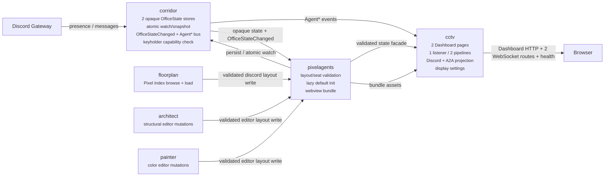
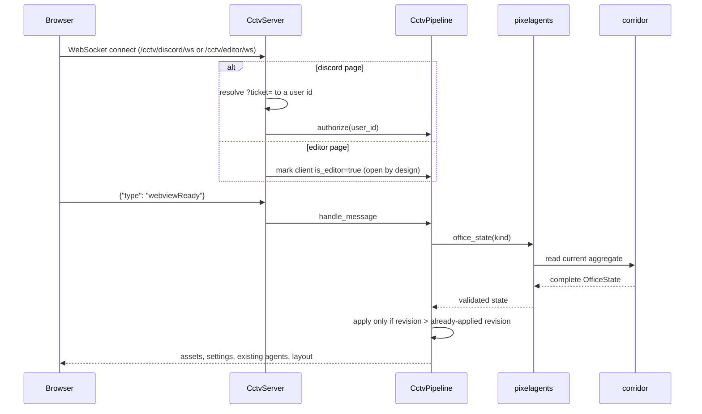
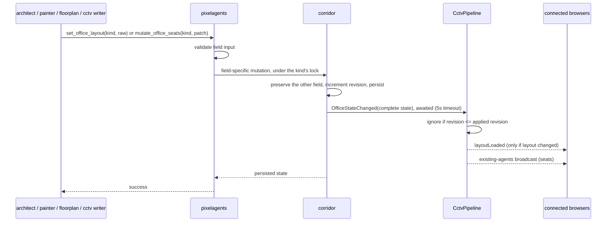
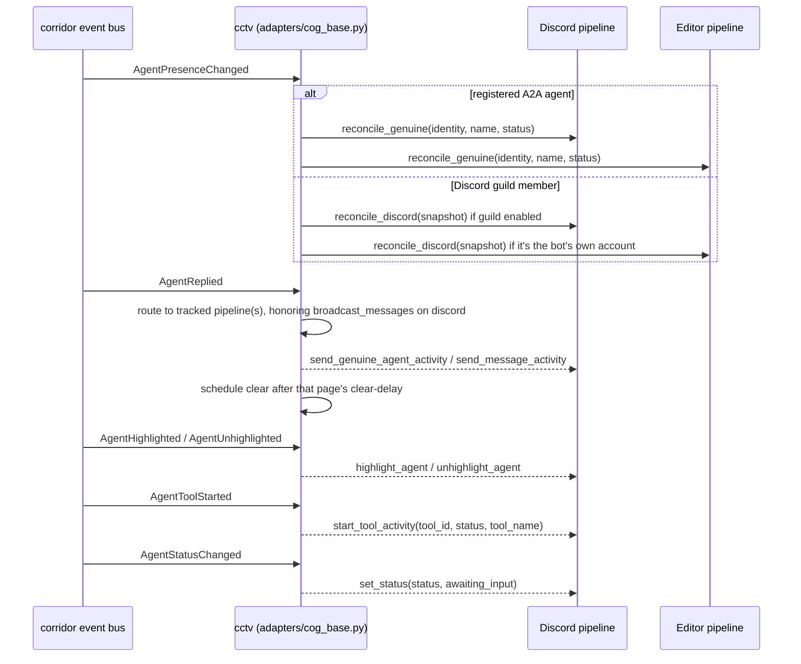
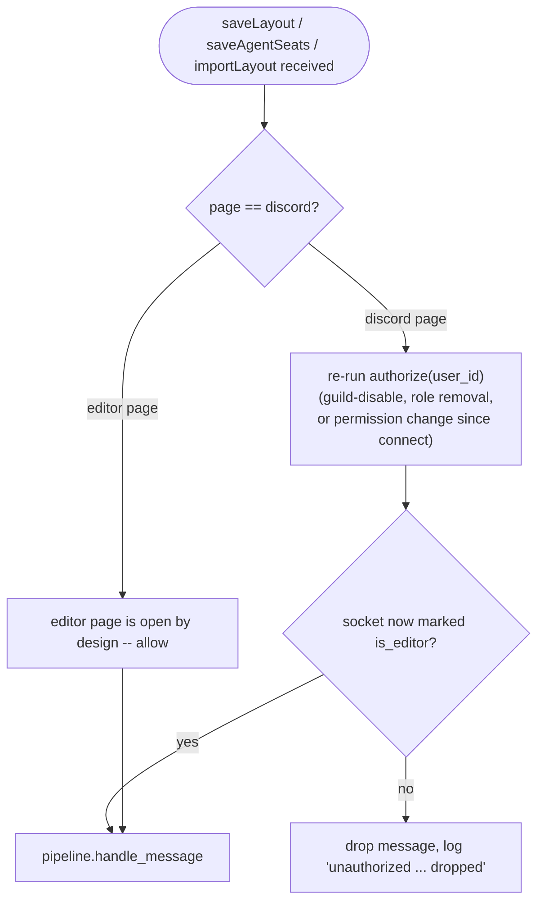
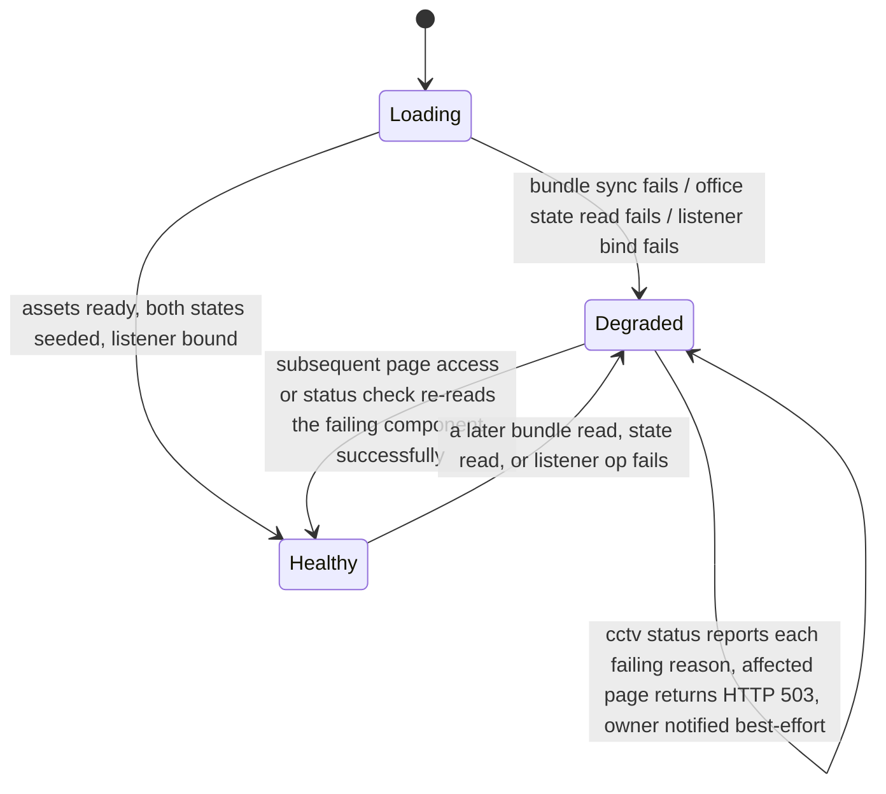

# CCTV design

CCTV owns every browser-facing surface of the Pixel Agents office: both
Dashboard pages, static asset serving, the WebSocket transport, Discord
presence/activity projection, registered-agent projection, display policy,
seat persistence, and browser authorization. It renders state; it does not
own the state's schema or its persistence.

## Overview

Two independent, revisioned "office" aggregates exist side by side:

- the **Discord office**, a presence canvas populated from enabled Discord
  guilds plus every registered A2A agent, editable only by the bot owner or
  a keyholder, and the target of a Pixel Index layout load;
- the **editor office**, Architect and Painter's shared structural/color
  sandbox, populated from registered A2A agents plus the bot's own Discord
  identity, with an editor deliberately left open to any connected client.

They never merge. Loading a Pixel Index layout changes only the Discord
aggregate; an Architect structural edit or a Painter recolor changes only
the editor aggregate. CCTV runs one aiohttp listener with two isolated
per-page pipelines so a client on one page can never see or affect the
other's state.

## Architecture

Ownership is split cleanly across four cogs. Corridor treats office data as
opaque JSON; Pixelagents is the only schema-aware layer; CCTV renders and
transports; Floorplan, Architect, and Painter write through Pixelagents.



**Corridor** persists the two `OfficeState` aggregates under a per-kind
lock, exposes atomic watch-and-snapshot so a subscriber can never miss a
write landing between subscribe and snapshot, and publishes
`OfficeStateChanged` synchronously to every subscriber (bounded to a
five-second timeout per subscriber). It also runs the A2A event bus CCTV
subscribes to for presence and activity, and the `keyholder` capability
check CCTV's Discord authorization relies on. Corridor knows nothing about
what `layout` or `seats` mean.

**Pixelagents** is the schema boundary. It validates Discord-page layouts
against the Pixel Agents wire schema, validates editor layouts through the
shared Semantic IR codec and furniture-style manifest, validates and merges
avatar-seat patches, lazily and atomically initializes either aggregate
from the bundled default layout, and delegates persistence/watch calls to
Corridor. It also builds and serves the static webview bundle CCTV injects
into both pages. No consumer bypasses this facade for an office-state
write.

**CCTV** owns rendering and transport only: two Dashboard pages, one
listener with two WebSocket routes plus a health route, per-page client
hubs, Discord guild scanning, registered-agent projection, and the
authorization/display-settings policy layered on top of what Pixelagents
and Corridor already validated and persisted.

Floorplan and Architect keep narrower, non-overlapping roles today:
Floorplan owns Pixel Index API/Web configuration, catalogue browsing, and
loading a selected layout into the Discord aggregate, with no Dashboard
route or WebSocket of its own; Architect owns structural editor-layout
mutations behind its A2A tool loop, with no browser transport at all.
Painter is the same shape as Architect for color-only mutations.

## Domain model

### `OfficeState`

```python
class OfficeStateKind(StrEnum):
    DISCORD = "discord"
    EDITOR = "editor"

@dataclass(frozen=True, slots=True)
class OfficeState:
    kind: OfficeStateKind
    layout: dict[str, Any]        # raw Pixel Agents layout JSON
    seats: dict[str, dict[str, Any]]  # avatar palette/hue/seat-assignment records
    revision: int                 # monotonically increasing per kind
```

Both aggregates carry all three fields. `layout` is the raw Pixel Agents
layout JSON (semantic chairs and occupants live here). `seats` is a
separate avatar-placement map -- palette index, hue shift, and seat
assignment per agent -- and is not a duplicate of layout occupancy. Each
aggregate initializes lazily and idempotently from the same bundled
default layout the first time any consumer reads or writes it, starting
with an empty `seats` map and revision `1`; whichever caller reaches an
absent aggregate first creates it exactly once.

### `OfficeStateChanged`

```python
@dataclass(frozen=True, slots=True)
class OfficeStateChanged:
    state: OfficeState   # complete post-write aggregate, not a diff
```

Every successful layout or seat mutation increments that kind's revision
and publishes the *complete* resulting aggregate -- callers never replace
the whole aggregate, so a layout write always preserves the current seats
and a seat write always preserves the current layout. Mutation is
last-write-wins per field: revisions order snapshots and events, they are
not compare-and-set preconditions, and the browser protocol carries no
revision of its own. A pipeline that has already applied a given revision
ignores a duplicate or stale delivery, so redundant delivery is harmless.

### Events table

| Event | Kind | Fields | Notes |
|---|---|---|---|
| `OfficeState` | value object | `kind`, `layout`, `seats`, `revision` | The complete, opaque-to-Corridor aggregate for one kind. |
| `OfficeStateChanged` | event | `state: OfficeState` | Published after every successful mutation; each subscriber is awaited with a 5-second timeout, isolated from other subscribers' exceptions. |

`corridor/office_state_catalog.py` generates `corridor/office_state.yaml`,
which CI's office-state contract lint checks against this document; both
event names above are load-bearing literal text for that check.

### CCTV settings

```python
@dataclass(frozen=True, slots=True)
class GlobalSettings:
    listener_host: str
    listener_port: int
    discord_clear_delay: float
    editor_clear_delay: float
    broadcast_rich_presence: bool
    broadcast_messages: bool

@dataclass(frozen=True, slots=True)
class GuildSettings:
    guild_id: int
    enabled: bool
    include_bots: bool
```

CCTV registers these under its own fresh Red Config identity (no Floorplan
or Architect setting is read into it). Defaults: host `127.0.0.1`, port
`3210`, both clear delays `2.0` seconds, rich-presence and message display
enabled globally, and every guild starts disabled with bots included.
Guild enablement, include-bots, rich-presence, and message-display settings
apply only to the Discord page; the two activity-clear delays are
independent per page.

### Client wire messages

Every inbound message is parsed by a Pydantic envelope keyed on `type`
(`contracts/websocket.py`); an unrecognized type is dropped, an invalid
payload for a known type raises a logged, connection-preserving error:

| `type` | Direction | Payload | Effect |
|---|---|---|---|
| `authorize` | client to server | `ticket: str` | Discord page only. Resolves a session ticket to a user id and re-authorizes the socket. |
| `webviewReady` | client to server | -- | Triggers `bootstrap`: assets, settings, existing agents, and the current layout. |
| `saveLayout` | client to server | `layout: OfficeLayout` | Editor-authorized only. Validated and written through Pixelagents' `set_office_layout`. |
| `saveAgentSeats` | client to server | `seats: {agent_id: {palette?, hueShift?, seatId?}}` | Editor-authorized only. Merged through Pixelagents' `mutate_office_seats`. |
| `requestDiagnostics` | client to server | -- | Answered with `agentDiagnostics` and the pipeline's current revision. |
| `importLayout` | client to server | -- | Accepted and intentionally a no-op. |
| `layoutLoaded` | server to client | `layout` | Broadcast only when the layout field of a newly applied state actually changed. |
| `agentDiagnostics` | server to client | `agents: []`, `revision` | Static reply to `requestDiagnostics`. |

`saveLayout`, `saveAgentSeats`, and `importLayout` are gated as writes: the
server drops them unless the sending socket is currently marked as an
editor for that page.

## Key flows

### Client connects and bootstraps



### Live mutation broadcast



A successful persist is never rolled back because a display broadcast
failed or timed out: Corridor releases the persistence lock, then awaits
subscribers, then returns success to the writer regardless of subscriber
outcome. Because every event carries the complete aggregate, the next
event or the client's next `webviewReady` repairs any missed update.

### Agent activity from the event bus



CCTV subscribes to all six of these `Agent*` events at startup in one
atomic `watch_agent_events` call alongside `list_agents()`, then performs
its Discord guild-cache scan without an intervening `await`, so no
presence change occurring during startup can be missed.

## API / command / route reference

### HTTP and WebSocket routes

| Route | Method | Purpose |
|---|---|---|
| `/cctv/discord/ws` | WebSocket | Discord office live connection |
| `/cctv/editor/ws` | WebSocket | Editor office live connection |
| `/cctv/health` | GET | JSON status snapshot (`status`, `listener`, `assets`, per-page `discord`/`editor` health) for a reverse proxy or uptime monitor that should not depend on Discord |
| `/third-party/cctv/discord` | Dashboard GET | Discord office page |
| `/third-party/cctv/editor` | Dashboard GET | Editor office page |
| `/third-party/cctv/session` | Dashboard GET (hidden) | Mints a short-lived ticket for the current Dashboard user |
| `/third-party/cctv/static/<path>` | Dashboard GET/HEAD | Shared webview asset |

### Commands

| Command | Scope | Description |
|---|---|---|
| `[p]cctv status` | Guild admin | Listener, routes, assets, per-page revision/client counts, guild settings, health |
| `[p]cctv dashboard` | Guild admin | Dashboard readiness and page paths |
| `[p]cctv enable` / `disable` | Guild admin | Enable or disable this guild's Discord roster; re-authorizes connected sockets and syncs/despawns |
| `[p]cctv includebots <bool>` | Guild admin | Include/exclude bot accounts; triggers a full resync if the guild is enabled |
| `[p]cctv richpresence <bool>` | Guild admin | Toggle rich-presence display; clears presence immediately when turned off |
| `[p]cctv messages <bool>` | Guild admin | Toggle chat-message activity display |
| `[p]cctv sync` | Guild admin | Force a full resync of this guild's roster |
| `[p]cctv despawnall` | Guild admin | Despawn this guild's roster without disabling it |
| `[p]cctv host <host>` | Bot owner | Set listener bind host (validated non-empty, no whitespace); requires reload to rebind |
| `[p]cctv port <port>` | Bot owner | Set listener bind port (1-65535); requires reload to rebind |
| `[p]cctv cleardelay <discord\|editor> <seconds>` | Bot owner | Set that page's activity-clear delay (>= 0) |

## Validation & error handling

### Discord-page write authorization



Discord-page authorization itself (`_can_edit_discord`) fails closed at
every branch: a synthetic or zero user id is rejected outright, and any
exception fetching a guild member or checking the `keyholder` capability is
caught and treated as "not authorized" rather than propagated. A ticket
only proves the browser's identity at connect time; every write re-checks
authorization against current guild/role state rather than trusting the
socket's state from when it opened.

### Degraded startup and page access



None of a listener bind failure, a missing/invalid webview bundle, or an
unreadable/invalid persisted aggregate prevents `cog_load` from completing
or unloads CCTV afterward -- each becomes a health reason instead. A
Dashboard page access retries the underlying bundle/state read on every
request, so a repair (e.g. rebuilding the bundle, fixing a corrupt Config
entry) takes effect on the next request without a bot restart; only the
listener's own bind requires an explicit reload. Corrupt persisted state is
always reported through `[p]cctv status` and the 503 response, never
silently replaced with a default.

### Shutdown

`cog_unload` unsubscribes CCTV from every Corridor event (office-state
watches and the six `Agent*` handlers), cancels every supervised background
task (delayed activity clears, the post-ready guild/bot sync), closes both
client hubs' sockets, stops the aiohttp listener, and clears both
pipelines -- in that order, so no in-flight event can reach a half-torn-down
pipeline.

## Design rationale

**One listener, two pipelines, not two listeners.** The Discord and editor
pages share static assets and TCP binding but nothing about live state:
each `CctvPipeline` owns its own `ClientHub`, `OfficeService`, revision,
and bootstrap lock. This keeps the operational surface (one port, one
health endpoint) small while keeping the two office states impossible to
cross-contaminate in code, not just by convention.

**Atomic watch-and-snapshot, not subscribe-then-poll.** Corridor registers
a subscriber and captures the current aggregate under the same lock
specifically so a writer landing between those two steps cannot produce an
unobservable gap. The same pattern is reused for the A2A agent-event
subscription plus `list_agents()`, and CCTV performs its own Discord cache
scan immediately afterward without yielding, closing the startup race
end-to-end rather than only within Corridor.

**Revision-gated re-broadcast of `layoutLoaded`, not "broadcast every
change".** Most revision bumps are seat-only (an agent spawning,
despawning, or getting a palette assignment) and are unrelated to what is
on-screen in the editor. The browser only guards against an incoming
`layoutLoaded` while it has unsaved local edits, and that guard drops the
instant a user hits Save -- before that very save's own write has even
landed. Re-broadcasting `layoutLoaded` on a seat-only bump would race that
window and revert a layout the user just placed; gating the rebroadcast on
an actual layout diff removes the race entirely.

**Last-write-wins per field, not compare-and-set.** The existing browser
protocol carries no revision for a client to echo back, and extending it
was out of scope for this design. Concurrent layout writers can overwrite
one another under this scheme; that is an accepted, understood tradeoff,
not an unhandled case -- revisions exist to order delivery and detect stale
snapshots, not to reject conflicting writes.

**A five-second subscriber timeout scoped to office-state events only.**
Because a writer's persistence completes and its lock releases *before*
subscribers are awaited, a slow or stuck Dashboard cannot block a state
write indefinitely, but it also cannot cause the persisted write itself to
be lost -- worst case, one broadcast is late or dropped, and the next event
or the client's own `webviewReady` catches it up. General `Agent*`
activity-event delivery is intentionally left unbounded, since those events
are not part of the persisted office aggregate and a slow subscriber there
carries no data-loss risk to guard against.

**Fresh Config identity, no migration.** CCTV, Corridor's office-state
repository, Floorplan, and Architect each register their own Config
identifier rather than reading any other cog's prior settings. This keeps
each cog's schema simple and avoids coupling one cog's Config layout to
another's history; any old data under a different identifier is left
alone, not deleted, and remains manually recoverable if ever needed.

**Binding to loopback by default.** The editor page is intentionally open
to any connected client, so keeping the listener's default bind on
`127.0.0.1` means direct host-network exposure is an explicit operator
choice (via reverse proxy), not an accidental default.
