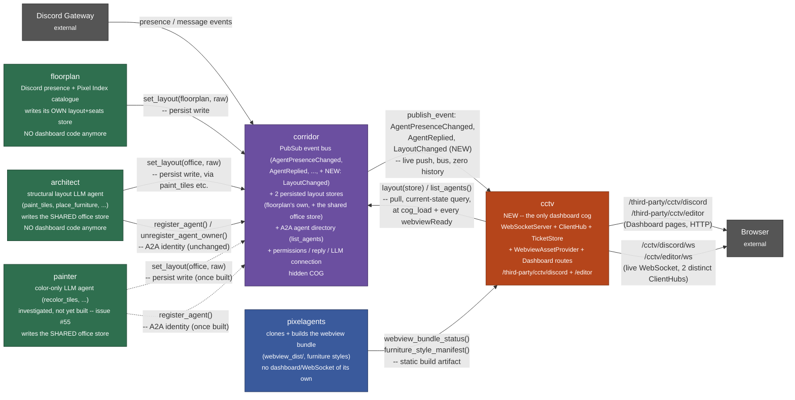
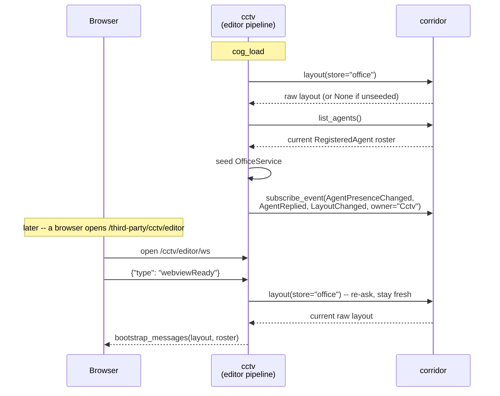
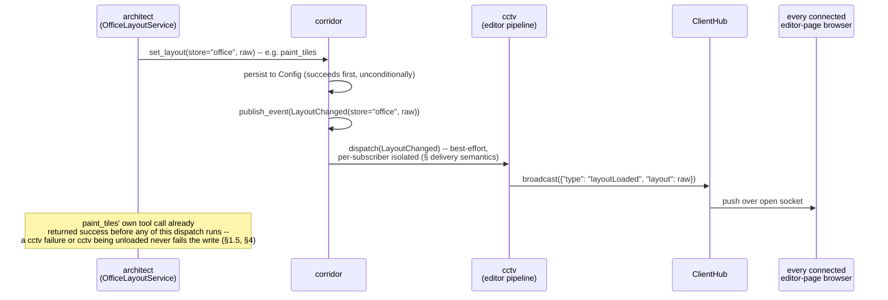

# Extracting dashboard-hosting into a new `cctv` cog

**Status: decided, not yet implemented.** §1 is the verified factual
basis (checked directly against `develop` on 2026-08-30). §2 records the
repo owner's decisions on the four open axes that basis raised. No code
has changed — this remains a design doc for a future implementation
pass, not an implementation itself. An earlier revision of this doc
listed each axis as open options; that framing is superseded below, but
the surrounding investigation (§1) is left largely intact since it still
describes today's code accurately and is exactly what motivates each
decision in §2.

The refactor: pull `WebSocketServer`/`ClientHub`/`TicketStore`/
`WebviewAssetProvider`/Red Dashboard route registration out of
`floorplan` and `architect` into a new cog, `cctv`, such that loading
`cctv` gives one unified dashboard, not loading it means no dashboard/
webview presence at all, and `floorplan`, `architect`, and (once built,
see issue #55) `painter` keep working fully — presence sync, LLM
tool-driven layout mutation — with zero dashboard code of their own.

## 1. Current state (verified)

This section is the shared factual basis §2's decisions reason from.

### 1.1 Two dashboards, two independent everything

`floorplan` and `architect` each carry a **complete, independent copy**
of the dashboard stack:

| Concern | floorplan | architect |
|---|---|---|
| Layout + seats storage | `floorplan/infrastructure/settings.py` — floorplan's own Config identifier (`8364586608`), `layout`/`seats` keys | Delegates to `pixelagents.infrastructure.office_layout_settings.RedOfficeLayoutSettings` — a *different* Config identifier, shared with `architect`'s own `OfficeLayoutRepository` and (once built) `painter`'s |
| Live WebSocket server | `floorplan/infrastructure/websocket.py` + `client_hub.py`, external path `/ws` | `architect/infrastructure/websocket.py` + `client_hub.py`, external path `/architect/ws` (deliberately distinct — see §1.2) |
| Dashboard route registration | `floorplan/adapters/dashboard.py::DashboardMixin`, route `/third-party/floorplan` | `architect/adapters/dashboard.py::DashboardMixin`, route `/third-party/architect` — a byte-for-byte parallel class, not imported |
| Static asset serving | `floorplan/infrastructure/webview.py::WebviewAssetProvider` | `architect/infrastructure/webview.py::WebviewAssetProvider` — a second, independent instantiation of the same *shape*, but a fully duplicated class, not a shared import |
| Editor auth | `TicketStore` (`floorplan/infrastructure/tickets.py`), 8h tickets, gated on bot-owner/`keyholder` capability | **None.** `architect/adapters/dashboard.py`'s own docstring: "no `/session` ticket endpoint... architect's layout has no editor-authorization concept at all" — any connected client can mutate architect's layout, by design (`docs/architect-design.md` §5.1) |
| Agent roster on the canvas | `PresenceService` fed from real Discord gateway listeners, mirrored via corridor's bus (§1.3) | `PresenceSubscriptionMixin` (`architect/adapters/presence_subscription.py`) fed from corridor's bus only, plus one hand-reconciled entry for architect's own bot account |

`docs/architecture.md` §2/§3c documents *why* this duplication exists:
`architect/infrastructure/webview.py`'s own docstring says architect
importing floorplan's class directly "would force floorplan's own
package onto disk for anyone installing architect alone," since Red's
Downloader only guarantees a cog's own `required_cogs` are installed
alongside it — `floorplan` was never one of architect's dependencies.
The floorplan/architect split was never designed as "shared library +
two consumers"; it was designed as "two consumers, deliberately
independent," and this shows up as real code duplication today (the
`WebviewAssetProvider` pair being the clearest example — same
`WEBVIEW_CACHE_CONTROL`, same `FURNITURE_KEYS`, same `resolve()`/
`content_type()`/`dashboard_static_response()` bodies, character for
character in most methods). §2.1 below removes this duplication by
retiring both copies outright, not by sharing a library between them.

### 1.2 The one genuinely shared artifact, and a real precedent for what "unify the live pages" costs

`pixelagents/infrastructure/webview_build.py` clones+builds the upstream
`pixel-agents` webview at a pinned commit into pixelagents' own
`cog_data_path`, producing `webview_dist/` (compiled JS/CSS/assets) and a
bundled `default-layout-1.json`. This *is* shared — both floorplan and
architect read it via the identical cross-cog surface,
`pixelagents.webview_bundle_status()` (`bot.get_cog("PixelAgents")`,
`docs/architecture.md` §2) — but it's a **read-only, static build
artifact**, not a live service. `cctv` keeps reading it exactly the same
way; nothing about this axis changes.

The precedent worth carrying forward into §2.4: `docs/architect-design.md`
§5/§9's own incident. The vendored bundle computes its live WebSocket URL
from `window.location.host` alone (`wss://<host>/ws`), **not the page
path**. Serving the identical static page under two different Dashboard
routes was not enough to keep two live dashboards independent — both
browser tabs silently connected to whichever cog answered the one shared
`/ws` path (floorplan's). The fix (still in place today) was architect
binding its own WebSocket server on a distinct external path
(`/architect/ws`) plus a client-side `WS_REWRITE_SHIM` patching
`window.WebSocket` before the real connection opens. **This hazard
survives the move into one `cctv` cog** — §2.4 gives `cctv` two pages
under one cog, and the bundle's host-only URL derivation doesn't know or
care that both pages now share a process; each page still needs its own
rewrite shim pointed at its own distinct `/ws` path, or the second page
to load will silently hijack the first's live connection exactly the way
architect's page once silently hijacked floorplan's.

### 1.3 The layout stores were already, and remain, two different things

- **floorplan's layout** is live, presence-mirrored, editable by any
  bot-owner/keyholder through the in-browser editor, and is the thing the
  Pixel Index catalogue (`[p]floorplan layout load`) reads/writes.
- **architect's (and, once built, painter's) layout** is a *different*,
  independent Config blob (`pixelagents.infrastructure.office_layout_settings`),
  seeded once from pixelagents' bundled default
  (`CogBase._ensure_layout_seeded()`), mutated only through architect's
  Semantic IR tools (`paint_tiles`, `place_furniture`, ...) and painter's
  color-only tools, with no editor-authorization concept at all.

**Verified consequence:** a wall architect adds via `paint_tiles` never
appears in floorplan's live view, and a layout edit made through
floorplan's in-browser editor is invisible to architect's LLM tools —
they read and write two different Config identifiers with two different
seed histories. **Decision (§2.3): this stays true.** The two stores do
not merge; `cctv` renders both, as two distinct pages (§2.4), and the two
different authorization models (keyholder-gated vs. wide open) travel
with their respective pages unchanged.

### 1.4 Presence roster reconstruction today has a real, confirmed cold-start gap

Checked directly (not inferred): `architect/adapters/presence_subscription.py`'s
`_start_presence_tracking()` — called once from `cog_load()` — does
exactly two things: subscribe to corridor's `AgentPresenceChanged`/
`AgentReplied` events, and reconcile architect's own bot account by hand.
**It never calls `corridor.list_agents()`** to seed the roster with
agents that registered *before* architect's own `cog_load` ran. Corridor's
`AgentPresenceChanged` publish happens once, synchronously, at the moment
each agent's `register_agent()` call lands (`corridor/adapters/cog_base.py`,
`docs/corridor-pubsub-design.md`) — there is no replay buffer. So: reload
architect alone while painter is already registered and running, and
architect's own dashboard's agent roster silently omits painter until
painter itself reloads. This is a real, present-day gap, not a
hypothetical — and it is exactly what motivates §2.2's decision to give
corridor a queryable current-state surface, not a bus-only one, for
`cctv` to pull from at its own `cog_load` (and at every new client's
`webviewReady`, per §2.2).

The *layout* half of this gap is addressed the same way, but for a
different underlying reason: layout was never carried on the bus at all
— it was pure Config, read fresh from storage at every bootstrap
(`_send_bootstrap`/`webviewReady` handling,
`floorplan/adapters/office_gateway.py:142-150`,
`architect/adapters/office_gateway.py:50-56`, both calling
`OfficeService.bootstrap_messages(...)` after reading their own Config
directly, never from anything the bus carried). §2.2 folds this into the
same corridor-owned query surface as the agent-presence half, so `cctv`
has one mechanism for both, instead of two different cold-start
strategies for two different kinds of state.

### 1.5 Write-tools have zero hard dependency on dashboard/broadcast succeeding — confirmed

Checked directly in `architect/application/office_layout_service.py:463-466`:

```python
async def _persist(self, office: Office, styles: FurnitureStyleManifest) -> None:
    raw = await self._repository.save(office, styles)
    if self._broadcast is not None:
        await self._broadcast(raw)
```

`self._repository.save(...)` (the real Config write) happens
unconditionally, first. `self._broadcast` (wired to
`CogBase._broadcast_layout`, `architect/adapters/cog_base.py:192-198`) is
a best-effort push to `ClientHub`, called only *after* the persist
already succeeded. `painter`'s equivalent
(`painter/application/painter_layout_service.py:197-200`) is the same
shape: persist first, then an optional `on_layout_changed` callback
(wired through `bot.get_cog("Architect")`, `painter/adapters/cog_base.py:170-184`,
already a *best-effort, may-be-`None`* cross-cog lookup). **Conclusion:
paint_tiles/recolor_tiles/place_furniture/etc. already tolerate "no
dashboard, no connected client, no architect cog even loaded" today.**
§2.2's decision to move layout persistence into corridor and have
corridor auto-publish on every write (mirroring how `register_agent`
already auto-publishes `AgentPresenceChanged`, precedent below) actually
**retires** painter's bespoke `bot.get_cog("Architect")` notify hook
entirely — see §3.3.

### 1.6 The `WebviewAssetProvider` pair was the actual reuse opportunity

`WebviewAssetProvider` (`resolve`/`content_type`/`dashboard_webview_response`/
`dashboard_static_response`/`load_assets`/`default_layout`) is pure,
stateless-per-request, framework-agnostic file-serving logic over one
immutable root directory. Under §2.1's decision, this class exists
exactly once, inside `cctv` — no duplication, no shared-library
indirection needed for it either, since there is now only one consumer.

## 2. Decisions

### 2.1 Where the dashboard-hosting code lives: fully in `cctv`

`cctv` owns `WebSocketServer`, `ClientHub`, `TicketStore`,
`WebviewAssetProvider`, and all Dashboard route registration
(`on_dashboard_cog_add`, `dashboard_page`-decorated methods). `floorplan`
loses `floorplan/infrastructure/{websocket,client_hub,tickets,webview}.py`
and `floorplan/adapters/dashboard.py` outright; `architect` loses the
equivalent five files. Neither cog keeps a parallel copy, a shared
library, or a thin re-export — this is a full extraction, not a
refactor-in-place. `cctv` depends on `pixelagents` (for
`webview_bundle_status()`/`furniture_style_manifest()`) exactly as
floorplan/architect already do today, and on `corridor` (§2.2) for
everything else it needs to render.

This also resolves the `WebviewAssetProvider` duplication (§1.6) for
real — one class, one place — without needing the "does this belong in
`pixelagents` instead" charter question a shared-library approach would
have raised. `pixelagents` keeps its existing, narrower charter ("builds
the bundle," no dashboard/WebSocket/Discord-presence surface of its
own, `docs/architecture.md` §2); `cctv` is a new, dedicated consumer of
that build output, the same relationship floorplan and architect each
had individually before.

### 2.2 Corridor gains a persisted, queryable layout store — plus this as a new bus event

Corridor already has two pieces of exactly the shape this needs, each
already precedent for the other half:

- **`EventBusService`** (`corridor/application/event_bus_service.py`) —
  push-only, no history, no replay (`docs/corridor-pubsub-design.md`).
  Good for "something changed just now," useless alone for cold start
  (§1.4).
- **`AgentDirectoryService.list_agents()`** (`corridor/application/agent_directory_service.py`) —
  a synchronous, in-memory **current-state query**, not an event. This is
  exactly the shape §1.4's gap was missing for the agent-presence half;
  architect's own subscriber simply never called it.

**Decision:** corridor gains the same current-state-query shape for
layout, and the corresponding write path publishes a new bus event as a
side effect — the union of both existing shapes, applied to layout
specifically:

1. **Two new Config-backed stores, owned by corridor** — not merged (see
   §2.3), but both physically relocated into corridor's own Config
   identifier, the same way the LLM connection moved from `pico` into
   `corridor` once `architect` needed it too
   (`docs/architect-design.md` §2 — "the shared, provider-facing piece
   lives in corridor once two dependents need the same thing"). Here the
   two dependents are `cctv` (needs to *read* both, to render both pages)
   and each store's existing owner (`floorplan` for its own layout+seats,
   `architect`/`painter` for the shared office layout) which keeps
   *writing* to it, just through corridor's surface instead of its own
   private repository:
   - the store that used to live in `floorplan/infrastructure/settings.py`'s
     `layout`/`seats` keys,
   - the store that used to live in `pixelagents.infrastructure.office_layout_settings`
     (itself already shared between `architect` and `painter`, per
     `docs/painter-design.md` part A).
2. **A synchronous query method per store**, mirroring `list_agents()`'s
   shape (`async def layout(self, store: ...) -> RawLayout | None`, or
   one typed method per store — naming/typing is an implementation
   detail this doc doesn't fix). `cctv` calls this both at its own
   `cog_load` (to seed each page's `OfficeService` roster/layout before
   any browser has connected) and to answer each new client's
   `webviewReady` handshake directly — this is the "persistence state new
   connected clients ask and receive to get the initial snapshot" the
   decision calls for: the snapshot is asked of *corridor*, not
   reconstructed from bus history, and not asked of `floorplan`/
   `architect`/`painter` directly via `bot.get_cog` either. This closes
   §1.4's gap structurally: it no longer matters whether `cctv` loaded
   before or after the cog that last wrote the layout, because the
   answer lives in corridor's own Config, not in any one cog's in-memory
   state.
3. **A new bus event, published automatically by the write path**, the
   same way `register_agent`/`unregister_agent_owner` already publish
   `AgentPresenceChanged` as a side effect of directory mutation rather
   than requiring the caller to remember to publish it separately
   (`docs/corridor-pubsub-design.md`'s "presence is no longer
   architect's own publish" migration). Whichever cog calls corridor's
   `set_layout(store, raw)`-shaped write method gets that write persisted
   *and* broadcast on the bus in one call — `cctv`, if loaded, is just
   another subscriber reacting to it, the same shape floorplan already
   reacts to `AgentPresenceChanged` today.

**This is a deliberate reversal of `docs/painter-design.md` §8's earlier
call**, which rejected a `LayoutChanged`-shaped event specifically
because corridor's event catalog (`corridor/event_catalog.py::build_contract()`)
auto-discovers its pub/sub domain model by a hardcoded filter — *"every
corridor.domain name starting with `Agent` is part of the pub/sub domain
model"* — and a data-mutation event forced into that naming convention
was judged a worse fit than the narrow `notify_shared_layout_changed()`
hook that shipped instead (§1.5). That hook is retired by this decision
(§3.3) — the concrete follow-up this reversal requires, not yet done in
this design doc, is deciding how the new event(s) fit the catalog: either
widen `build_contract()`'s filter beyond the `Agent`-prefix convention,
or give the event(s) an `Agent`-shaped name despite not being
agent-activity-shaped, or split the catalog into two reflected sets. Any
of these is a small, mechanical change — flagged here as required, not
worked out, since it's a `corridor/event_catalog.py` implementation
detail rather than a cross-cog design question.

### 2.3 The two layout stores stay separate

**Decision: no unification.** floorplan's layout+seats store and
architect's/painter's shared office-layout store remain two distinct
schemas with two distinct semantics — separately seeded, separately
validated, separately authorized (§1.3, §2.4) — exactly as they are
today. What moves is *where* they're physically persisted (into
corridor, §2.2), not *what* they are or how many of them there are. A
wall `architect` adds still does not appear on floorplan's presence
canvas, and this refactor does not change that; it was explicitly out of
scope. `cctv` renders both stores because it now hosts both pages
(§2.4), not because they've become one canonical layout.

### 2.4 `cctv`'s two Dashboard pages

`cctv` registers one Dashboard route namespace with two named pages,
the same `dashboard_page(name=..., ...)` mechanism floorplan's own
`dashboard_session`/`dashboard_static` already use for sub-pages under
one cog:

| Page | Route | Mirrors | Layout store | Auth |
|---|---|---|---|---|
| `discord` | `/third-party/cctv/discord` | floorplan's current dashboard | floorplan's layout+seats store | Ticket-gated editing (`TicketStore`, keyholder/bot-owner capability) — unchanged from floorplan's model today |
| `editor` | `/third-party/cctv/editor` | architect's current dashboard | architect's/painter's shared office layout | No authorization concept at all — unchanged from architect's model today (`docs/architect-design.md` §5.1) |

Static assets (`WebviewAssetProvider`) are shared between both pages —
one build, one root, one `dashboard_static`-equivalent route — only the
two entry-page handlers and their `base_href`/injected-shim strings
differ. Each page needs its **own** live WebSocket path (e.g.
`/cctv/discord/ws` and `/cctv/editor/ws`) and its **own** rewrite shim,
per §1.2's precedent: both pages load the identical vendored bundle,
which derives its WebSocket URL from `window.location.host` alone, with
no awareness that two different pages on that host want two different
live backends. Without two distinct shims, the second page loaded in a
browser session would silently reconnect to whichever `ClientHub` the
first page's shim already pointed at — the exact failure mode
`docs/architect-design.md` §9's incident note describes, just now
happening *inside* one cog's two pages instead of *between* two cogs'
one page each.

`cctv` therefore still runs two independent `WebSocketServer`/
`ClientHub`/`OfficeService` instances internally — one per page — even
though both are hosted by the same cog process. This is a direct
consequence of §2.3: two separate layout stores with two separate
authorization models cannot share one live connection's state without
either merging them (rejected) or multiplexing per-connection
authorization state through a single server in a way neither store's
existing model was designed for. Two internal server instances, each a
straightforward move of what `floorplan`/`architect` already run today,
is the lower-risk shape.

### 2.5 Diagrams

#### High-level design: the new cog relationships

Scoped to the cogs this refactor actually touches (`pico`/`toolbox`/
`deskutils`/`suggestionbox`/`testbench` are unaffected and omitted for
readability — see `docs/architecture.md` for the full repo graph).
Deliberately drawn with **separate arrows per kind of information**
rather than one generic edge per pair of cogs, since "corridor" now
means several different things to different callers (a write target, a
read target, and a push source, not just one relationship):



Read the two `corridor <-> cctv` arrows together: they are the whole
answer to §2.2's "how does `cctv` learn state" question — one arrow is
the **push** (bus dispatch, live deltas, zero history), the other is the
**pull** (a synchronous current-state query, used exactly at the two
moments §2.2 names: `cctv`'s own `cog_load`, and every individual
client's `webviewReady`). Neither arrow alone would be sufficient — §1.4
is the record of what goes wrong with the push-only arrow alone.

#### Low-level design: `cctv`'s internal structure

Two independent pipelines inside one cog process — §2.4's consequence
that two different layout stores with two different authorization
models cannot share one live server without merging them (rejected,
§2.3):

```mermaid
flowchart TB
    subgraph CctvCog["cctv (one Red Cog process)"]
        direction LR
        subgraph DiscordPipeline["\"discord\" page pipeline"]
            WS1["WebSocketServer<br/>external path /cctv/discord/ws"]
            Hub1["ClientHub #1"]
            Office1["OfficeService #1<br/>roster: real Discord members"]
            Ticket["TicketStore<br/>8h tickets, keyholder-gated"]
            WS1 --> Hub1 --> Office1
        end
        subgraph EditorPipeline["\"editor\" page pipeline"]
            WS2["WebSocketServer<br/>external path /cctv/editor/ws"]
            Hub2["ClientHub #2"]
            Office2["OfficeService #2<br/>roster: genuine A2A agents"]
            WS2 --> Hub2 --> Office2
        end
        Assets["WebviewAssetProvider<br/>(shared -- one build, one root)"]
        Dash["DashboardMixin<br/>routes: /third-party/cctv/discord<br/>/third-party/cctv/editor"]
        Dash --> Assets
        Dash -.->|"mint/resolve session ticket"| Ticket
        Ticket -.->|"authorize upgrade"| WS1
    end
```

Note what does **not** cross the dashed line between the two pipelines:
no shared `ClientHub`, no shared `OfficeService`, no shared auth state —
`Office1`'s roster is fed from `floorplan`'s store + corridor's
Discord-presence events, `Office2`'s roster is fed from the shared office
store + corridor's `AgentPresenceChanged`/`AgentReplied` for genuine
agents, and only the `discord` pipeline has a `TicketStore` at all.

#### Low-level design: cold-start snapshot pull

The sequence that closes §1.4's gap — shown for the `editor` pipeline;
the `discord` pipeline is the same shape, one store earlier:



`cctv` re-asks corridor at every `webviewReady`, not only once at its own
`cog_load` — a client that connects long after `cog_load` must not see a
stale snapshot from whenever `cctv` itself started, only from whenever
that specific socket opened.

#### Low-level design: live update push

Shown for an `architect` write; `floorplan`'s writes into its own store,
and (once built) `painter`'s writes into the shared store, are the same
shape:



## 3. What this means for `floorplan`/`architect`/`painter` concretely

### 3.1 `floorplan`

Loses: `infrastructure/{websocket,client_hub,tickets,webview}.py`,
`adapters/dashboard.py`, and its own `layout`/`seats` Config keys
(`infrastructure/settings.py`) — the read/write calls that used to hit
its own `Config` object now call corridor's new layout-store surface
(§2.2) instead. Keeps: everything Discord-command-driven and
presence-publishing — `admin_commands.py`, `catalogue_commands.py`,
`layout_tools.py`, `layout_views.py`, `replies.py`, Pixel Index browsing
(`pixel_index.py`, `[p]floorplan layout load`). `[p]floorplan layout
load <name>` now writes through corridor's store-write method instead of
floorplan's own `set_layout`; corridor's own auto-publish (§2.2 point 3)
means floorplan needs no broadcast-awareness at all, matching the
existing invariant (§1.5) that write-tools never needed to know whether
anything was listening.

### 3.2 `architect`

Loses: `infrastructure/{websocket,client_hub,webview}.py`,
`adapters/dashboard.py`, `adapters/presence_subscription.py`'s dashboard-
rendering half (subscribing to corridor's bus to feed a *local*
`OfficeService` — that rendering now happens inside `cctv`, not
architect). `architect`'s own genuine-agent presence *publishing*
(via `register_agent`, already corridor's job per
`docs/corridor-pubsub-design.md`) is unaffected — only the *consuming*
side (rendering it onto a locally-owned canvas) moves. `OfficeLayoutRepository`'s
`load`/`save` now delegate to corridor's new store surface instead of
`pixelagents.infrastructure.office_layout_settings` directly; `application/office_layout_service.py`'s
own validation/mutation logic (`paint_tiles`, `place_furniture`, ...) is
untouched — same shape as the pixelagents extraction in
`docs/painter-design.md` part A, which already proved this repository
swap needs zero changes to the service layer above it.

### 3.3 `painter`

Loses nothing structural — painter never had a dashboard of its own
(`docs/painter-design.md` §7.1: "no WebSocket server, webview, Dashboard
route... painter serves no browser-facing surface of its own"). What
*does* change: `PainterLayoutService`'s `on_layout_changed` callback and
`painter/adapters/cog_base.py`'s `bot.get_cog("Architect")` →
`notify_shared_layout_changed()` hook (`docs/painter-design.md` §8's
"real usage finding" fix) are **retired**. They existed only to solve
"a painter write doesn't tell any browser to refetch," and §2.2's
corridor-side auto-publish-on-write now solves that generically, for
every writer of the shared store, without any writer needing a
cross-cog notify hook of its own. This is a net simplification painter
gets for free from this refactor, not something painter's own design
needs to change to receive.

## 4. Consequences for existing invariants

- **§1.5's "write-tools tolerate no dashboard" invariant still holds,
  more simply.** Persisting is now "call corridor's write method,"
  broadcasting is now corridor's own automatic side effect (§2.2 point
  3) — no cog-local `ClientHub`/ `bot.get_cog` best-effort plumbing
  needed anywhere outside corridor and `cctv` itself. If `cctv` isn't
  loaded, corridor still publishes the event; it simply has zero
  subscribers, the same "zero recipients, not an error" shape
  `ClientHub.broadcast` already guarantees today for zero connected
  sockets.
- **§1.4's cold-start gap is closed, structurally, not just for `cctv`.**
  Because the fix is "ask corridor for current state," not "give `cctv`
  a bespoke pull method," any *future* subscriber of either layout store
  gets the same correctness for free — the same generality
  `AgentDirectoryService.list_agents()` already gives any future
  A2A-agent-roster consumer.
- **New risk, not present today:** corridor's event catalog naming
  convention (§2.2's reversal note) needs a concrete follow-up decision
  before implementation, or `corridor/corridor.yaml`'s generated contract
  and `contracts/corridor/lint_corridor_contract.py`'s cross-reference
  check will not know what to do with the new event type(s).
- **New risk, not present today:** a migration path for existing
  installations' `floorplan`-owned and `pixelagents`-owned layout Config
  data into corridor's new store. `docs/architect-design.md` §2's
  LLM-connection move ("no migration path, reconfigure once") and
  `docs/painter-design.md` part A's `CogBase._migrate_legacy_layout`
  (self-guarding-by-state, copy-once) are the two precedents on file for
  this kind of move; picking between them is implementation-pass work,
  not resolved here.

## 5. What this doc still does not decide

- The exact method names/signatures on corridor's new layout-store
  surface, and the exact new event dataclass name(s)/fields.
- How `corridor/event_catalog.py::build_contract()`'s `Agent`-prefix
  filter accommodates the new event type(s) (§2.2, §4).
- The Config migration strategy for existing installations (§4).
- `cctv`'s own `info.json`/`required_cogs` shape and command surface
  (`[p]cctv ...`, if any) — likely just `corridor` and `pixelagents`,
  mirroring floorplan's/architect's existing dependency shape, but not
  fixed here.
- Whether `painter`'s own recolor tools (still only investigated per
  issue #55, not implemented) change at all — nothing here found a
  reason they would; painter still has no dashboard of its own (§3.3),
  it only stops needing its one bespoke cross-cog notify hook.

## 6. Summary table

| Axis | Decision |
|---|---|
| 1. Where hosting code lives | Fully in `cctv` (§2.1) — `floorplan` and `architect` each lose their five dashboard-stack files outright, no shared library, no residual copy |
| 2. How `cctv` learns state | Corridor gains a persisted, queryable layout store per existing store (mirroring `list_agents()`'s current-state-query shape) plus a new bus event published automatically on every write (mirroring `register_agent`'s auto-publish of `AgentPresenceChanged`) — `cctv` pulls the snapshot from corridor at `cog_load`/`webviewReady` and subscribes to the bus for live deltas thereafter (§2.2) |
| 3. Unify the two layout stores? | No — they stay two distinct schemas/stores, just both physically relocated into corridor (§2.3) |
| 4. `cctv`'s page shape | Two named Dashboard pages under one cog — `/third-party/cctv/discord` (floorplan-style, ticket-gated) and `/third-party/cctv/editor` (architect-style, open) — sharing static assets but each with its own live WebSocket path/rewrite shim/`ClientHub` instance (§2.4) |
