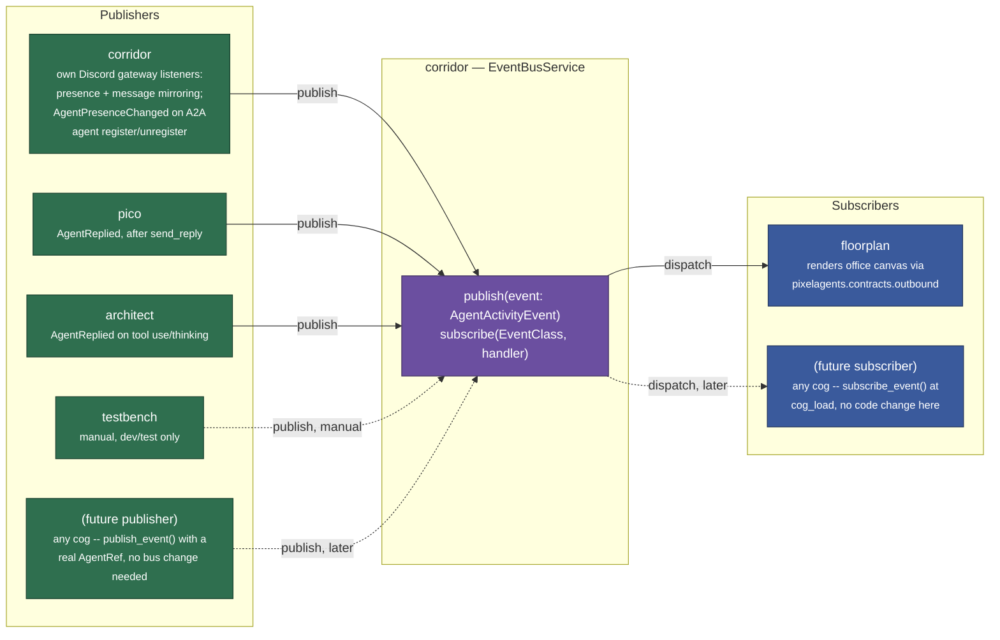
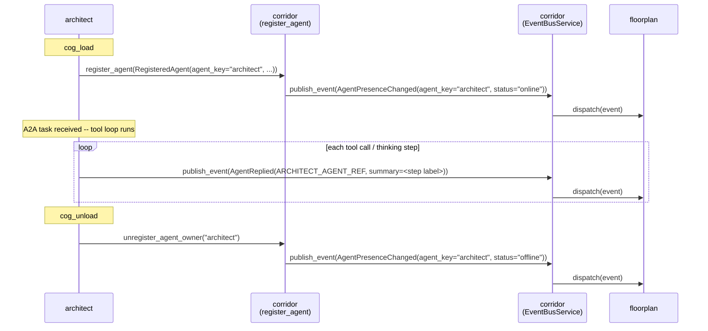
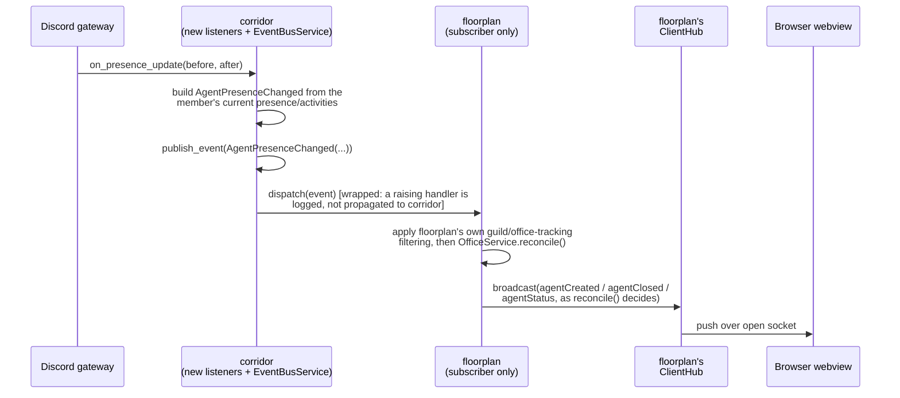
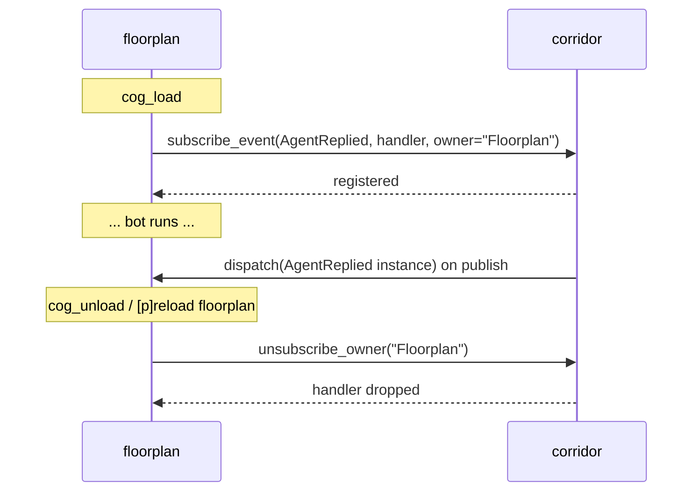

# Corridor event bus (PubSub): design

> **Status: implemented; consumer topology updated by
> [`cctv-design.md`](cctv-design.md).** The event types and Corridor publisher
> behavior below remain current. Sections that name Floorplan as the office
> subscriber describe the pre-CCTV topology; CCTV is now the single subscriber
> and owns the filtering/projection policy.
>
> | Cog | Role |
> |---|---|
> | cctv | **subscribes only** — `cctv/adapters/cog_base.py` |
> | corridor | **publishes** presence + reply-mirror events from its own Discord listeners (`corridor/adapters/discord_gateway.py`), and `AgentPresenceChanged` for any A2A agent's directory registration (`register_agent`/`unregister_agent_owner`/`unregister_agent` — `corridor/adapters/cog_base.py`) |
> | pico | publishes `AgentReplied` — `pico/tools/reply_tool.py` |
> | architect | publishes `AgentReplied` (tool use/thinking) — `architect/adapters/cog_base.py`. No longer publishes `AgentPresenceChanged` itself; corridor's own `register_agent`/`unregister_agent_owner` do that as a side effect of architect's A2A registration, see `docs/agent-directory-design.md` |
> | testbench | manual dev/test publisher, any event — unchanged |
>
> See "Migration notes" near the end for what changed at each call site.

## Motivation

corridor already exists to decouple "a cog needs something cross-cutting"
from "which specific cog provides it" — that's exactly what it does today
for permissions (`require_permission`/`capabilities_satisfy`) and reply
rendering (`send_reply`/`render_reply`). A pub/sub event bus is the same
shape of problem: a producer that shouldn't need to know who (if anyone) is
listening, and a consumer that shouldn't need to know who (if anyone)
produces.

The bus originally grew publishers organically, wherever a cog already had
a reason to know "something happened" — floorplan already listened to
Discord's gateway for its own webview-serving purposes, so it was the
natural first publisher too. That was convenient but accidental: it made
floorplan **both** the bus's reference publisher and its only subscriber,
which blurred the boundary the bus exists to enforce. It also meant every
future publisher (architect, now) had to either duplicate floorplan's
Discord-listener code or depend on floorplan directly — the exact coupling
corridor exists to prevent.

This design pulls publishing fully onto corridor, and away from any
subscriber:

- **floorplan becomes a pure subscriber.** It renders the office canvas
  from whatever the bus delivers, and never decides for itself what counts
  as "something happened."
- **corridor becomes the one cog that watches Discord's gateway on this
  bus's behalf**, the same way it's already the one cog that owns reply
  rendering and permission tiers. A publisher shouldn't need
  subscriber-specific knowledge (floorplan's `include_bots`/office-tracking
  settings) to decide what to publish — corridor publishes everything, and
  subscriber-side filtering (floorplan deciding what to render) replaces
  publisher-side gating.
- **architect joins as a second, LLM-agent-shaped publisher**, alongside
  pico. Neither imports the other, and neither imports floorplan —
  corridor stays the only edge either side gains.

## High-level architecture



`EventBusService` itself lives inside corridor (`corridor/application/event_bus_service.py`),
so "corridor publishes" means two distinct things that share one word: the
bus **is** corridor's, *and* corridor (the cog) is now also **a**
publisher onto its own bus — the same way it's already the chokepoint for
reply rendering and permissions. That dual role is intentional, not
confusing in practice: every other cog only ever calls
`corridor.publish_event(...)`/`corridor.subscribe_event(...)`, whether
corridor itself, pico, or architect is the one constructing the event.

## Domain model: a closed set of agent-activity dataclasses

Every publishable event is its own frozen dataclass, all sharing one
`AgentRef`. No generic envelope, no string tag, no untyped payload —
`corridor/domain/models.py` is the schema source of truth every publisher
and subscriber codes against.

```python
@dataclass(frozen=True, slots=True)
class AgentRef:
    """A Discord member (or a non-Discord agent, like architect)
    represented as a webview agent. `discord_user_id`/`guild_id` are
    `None` for an agent with no real Discord account or guild scope --
    architect is A2A-reachable, not a Discord bot login, and isn't scoped
    to one guild. Deliberately Optional rather than a sentinel (`0`/`-1`):
    a sentinel would type-lie (claim to be a real Discord snowflake) and
    risks colliding with an actual ID; `None` states the domain honestly.
    `is_bot` stays a plain, always-known `bool`."""

    discord_user_id: int | None
    guild_id: int | None
    is_bot: bool  # ties into floorplan's existing per-guild `include_bots` setting


@dataclass(frozen=True, slots=True)
class AgentReplied:
    """Named for corridor's own verb (`send_reply`), but deliberately
    broader than "a reply got sent": also covers an agent's tool-use or
    "thinking" step (architect). `AgentToolStarted` below looks
    purpose-built for tool-use reporting and stays unused for this by
    design -- `AgentReplied` is the one event every subscriber already
    renders as a labeled activity bubble, and a tool/thinking step is
    exactly that: a short, human-readable label attached to an agent,
    with no separate lifecycle to track. `summary` is always the full,
    untruncated text -- wire truncation/wording is the subscriber's job,
    never the publisher's."""

    agent: AgentRef
    summary: str  # -> agentToolStart's required `status` label


@dataclass(frozen=True, slots=True)
class AgentToolStarted:
    agent: AgentRef
    tool_id: str
    status: str            # required on the wire -- human-readable label
    tool_name: str | None = None   # optional on the wire


@dataclass(frozen=True, slots=True)
class AgentStatusChanged:
    agent: AgentRef
    status: Literal["active", "waiting"]   # matches AgentActivityStatus exactly
    awaiting_input: bool | None = None     # matches AgentStatus.awaitingInput


@dataclass(frozen=True, slots=True)
class AgentHighlighted:
    """-> agentSelected(id)."""

    agent: AgentRef


@dataclass(frozen=True, slots=True)
class AgentUnhighlighted:
    """-> agentDeselected(id). No-op unless this agent is still the
    highlighted one -- safe to publish even after a newer AgentHighlighted
    already moved the highlight elsewhere."""

    agent: AgentRef


AgentActivityEvent = (
    AgentReplied | AgentToolStarted | AgentStatusChanged | AgentHighlighted | AgentUnhighlighted
    | AgentPresenceChanged
)


@dataclass(frozen=True, slots=True)
class AgentActivity:
    """One Discord rich-presence activity, mirroring
    pixelagents.domain.ActivitySnapshot's shape (corridor must not import
    pixelagents types, so this is a parallel, hand-kept-in-sync copy)."""

    kind: str
    name: str | None = None
    title: str | None = None
    artist: str | None = None
    details: str | None = None
    state: str | None = None


@dataclass(frozen=True, slots=True)
class AgentPresenceChanged:
    """Enough to reconstruct pixelagents.domain.AgentSnapshot and drive
    OfficeService.reconcile() unchanged. One rich event, not four granular
    ones (join/leave/status/activity) -- every one of those needs the same
    full-snapshot reconstruction to call reconcile() anyway.

    status="offline" covers a real Discord offline/invisible status, a
    member leaving the guild, AND an agent cog unloading (architect) --
    there's no separate "member left"/"agent went away" event."""

    agent: AgentRef
    display_name: str
    status: Literal["online", "idle", "dnd", "offline"]
    activities: tuple[AgentActivity, ...] = ()
```

`AgentActivityEvent` is the closed set of types a cog `publish()`es/
`subscribe()`s to; `AgentActivity` is a value object carried *inside* one
specific member of that set (`AgentPresenceChanged.activities`) — the two
never overlap.

`EventBusService.subscribe` dispatches by concrete class
(`subscribe(AgentReplied, handler, owner="Floorplan")`), not by a string
key — a subscriber only ever registers for classes it actually knows how
to handle, and mypy can check that a handler's signature matches the class
it's registered against.

**Deliberately not included:** any of `pixelagents.contracts.outbound`'s
wire-shaped fields (no derived agent-ID, no raw message construction).
Translating an `AgentActivityEvent` into the exact canvas message stays
entirely floorplan's job — this bus only ever crosses the "something
happened to this agent" boundary, never the "here's the exact webview
message" one.

### Verified against the real wire protocol

Every field above was checked against `core/asyncapi.yaml` in
`pixel-agents-hq/pixel-agents`, at the commit this repo currently pins
(`pixelagents/infrastructure/webview_vendor.commit`):

- `agentToolStart` requires `id`, `toolId`, and `status` (a required,
  human-readable label); `toolName` is optional.
- `agentToolDone` (`id`, `toolId`) and `agentToolsClear` (`id` only —
  clears *all* foreground tools for that agent) are distinct.
  Message-mirroring's own clear path uses `agentToolsClear`, not
  `agentToolDone`.
- `agentStatus`'s `status` is `AgentActivityStatus`: `active`/`waiting`,
  matching `Literal["active", "waiting"]` exactly, plus an optional
  `awaitingInput: bool`.
- `agentSelected`/`agentDeselected` are both real and independently
  publishable — a publisher can highlight an agent without a full
  `AgentReplied`.
- `AgentCreated`/`ExistingAgents` carry an explicit `isHeadless`/
  `headlessAgents` override, driven by `AgentRef.is_bot` — architect's own
  presence, `is_bot=True`, renders headless the same way pico's bot
  account already does.

### Mapping table

| Dataclass | Published by (target) | Wire translation |
|---|---|---|
| `AgentReplied` | **corridor** (message mirroring, replacing floorplan's own `on_message`), **pico** (`ReplyTool`, after `send_reply` succeeds), **architect** (tool use/thinking steps, and see "architect" below) | `agentToolStart` (`status=summary`) then `agentSelected`, via `OfficeService.send_message_activity`. After `message_tool_clear_delay`, `OfficeService.clear_message_activity` sends `agentToolsClear` only |
| `AgentPresenceChanged` | **corridor** (member update/presence update/join/remove listeners, replacing floorplan's own; and `register_agent`/`unregister_agent_owner`/`unregister_agent`, for any A2A-registered agent — see "corridor" below) | `OfficeService.reconcile()` — spawns/closes/renames the agent, forwards each `AgentActivity` |
| `AgentStatusChanged` | manual only (`testbench`) — no automated publisher yet | `agentStatus` via `OfficeService.set_status`, gated on `is_tracked` |
| `AgentToolStarted` | manual only (`testbench`) — deliberately unused by architect's tool/thinking reporting, see the `AgentReplied` docstring above | `agentToolStart` via `OfficeService.start_tool_activity`, gated on `is_tracked` |
| `AgentHighlighted` | manual only (`testbench`) | `agentSelected(id)` via `OfficeService.highlight_agent`, gated on `is_tracked` |
| `AgentUnhighlighted` | manual only (`testbench`) | `agentDeselected(id)` via `OfficeService.unhighlight_agent`, gated on `is_tracked` |

## Publishers

The publisher set is **dynamic too, not a hardcoded list.** Any cog can
publish by calling `corridor.publish_event(event)` with a real
`AgentRef` for whatever it represents — corridor, pico, architect, and
testbench are just the publishers that exist today, the same way
floorplan is just the only subscriber that exists today. Publishing
requires no registration/lifecycle call at all (unlike subscribing) —
there's nothing to add or remove on cog load/unload, since a publisher
that stops running simply stops calling `publish_event`.

### corridor

Corridor has its own `discord.py` listeners — `on_member_update`,
`on_presence_update`, `on_member_join`, `on_member_remove`, `on_message`,
in `corridor/adapters/discord_gateway.py` — that took over the bodies of
floorplan's former `floorplan/adapters/discord_gateway.py` listeners,
publishing `AgentPresenceChanged`/`AgentReplied`. Corridor's listeners
publish unconditionally (no `include_bots`/office-tracking/
`broadcast_messages` gating) — that filtering moved to the subscriber
side (see "Migration notes").

Separately, corridor's own `register_agent`/`unregister_agent_owner`/
`unregister_agent` (`corridor/adapters/cog_base.py`, see
`docs/agent-directory-design.md`) also publish `AgentPresenceChanged` —
`status="online"` when an A2A agent registers into
`AgentDirectoryService`, `status="offline"` when it (or all of one
owner's agents) unregisters. `AgentRef.agent_key` carries the registered
`agent_key`, `discord_user_id`/`guild_id` stay `None`, `is_bot=True`
(same shape architect's own `ARCHITECT_AGENT_REF` used), and
`display_name` comes from the registered `AgentCard.name`. This means a
registering cog's directory membership and its presence-broadcast
lifecycle are the same event, not two separate things it must remember
to keep in sync — see "architect" below for the cog this replaced a
hand-rolled publisher for.

### pico

Unchanged. `pico/tools/reply_tool.py::ReplyTool._publish_agent_replied`
publishes `AgentReplied` right after a successful `corridor.send_reply`,
with `AgentRef` pointing at pico's own bot account
(`discord_user_id=self._bot_user_id`, guild-scoped to the invoking guild,
`is_bot=True`). Pico is the Discord-user-facing bot — it publishing its
own replies directly, rather than corridor inferring them from
`on_message`, stays correct and unchanged by this design.

### architect

Architect is A2A-reachable, not Discord-user-facing, and has no Discord
account or guild scope of its own — its events use a fixed identity,
`ARCHITECT_AGENT_REF = AgentRef(discord_user_id=None, guild_id=None,
is_bot=True, agent_key="architect")`, a module-level constant in
`architect/adapters/cog_base.py` reused for every event it publishes.

- **Presence is no longer architect's own publish.** architect used to
  call `self._corridor.publish_event(AgentPresenceChanged(...))` directly
  from `cog_load`/`cog_unload` (mirroring floorplan's former
  `on_member_join`/`on_member_remove`); that hand-rolled publisher is
  retired. Presence is now a side effect of `_register_with_corridor()`'s
  `self._corridor.register_agent(...)` call (`cog_load`) and
  `self._corridor.unregister_agent_owner("architect")` (`cog_unload`) —
  see "corridor" above and `docs/agent-directory-design.md`. This was a
  deliberate design choice (not architect-specific): any future
  A2A-registered agent gets this for free, without hand-rolling its own
  publish calls the way architect originally had to.
- **Tool use / thinking, per step — unchanged.** `ToolLoopService.run()`
  (`architect/application/tool_loop_service.py`) takes an optional
  `on_activity` callback, awaited once per tool call
  (`"using tool <name>"`) and once per thinking turn (the model's own text
  alongside a tool-calling turn, `"thinking: <content>"`).
  `ArchitectAgentExecutor` threads it through from a `publish_activity`
  constructor argument; `CogBase` wires `self._publish_activity` — which
  publishes `AgentReplied(agent=ARCHITECT_AGENT_REF, summary=...)` through
  corridor — into both `ArchitectAgentExecutor` and, transitively, every
  call to `tool_loop.run()`.



### testbench

Unchanged. A dev/test-only Discord UI (`testbench/adapters/views.py`)
that lets an operator manually construct and publish any event from the
closed `AgentActivityEvent` set, generated from `corridor/event_catalog.py`
— useful for exercising subscriber code before a real automated publisher
exists (`AgentStatusChanged`, `AgentToolStarted`, `AgentHighlighted`,
`AgentUnhighlighted` today).

## Subscribers

The subscriber set is **dynamic, not a hardcoded list.** Any cog can
subscribe by calling `corridor.subscribe_event(event_type, handler,
owner=...)` from its own `cog_load` — corridor's `EventBusService` (and
this doc) don't enumerate a closed set of subscribers the way they
enumerate a closed set of *event types*. floorplan is the only subscriber
that exists today, not the only one the design allows for. Unloading a
subscriber's cog removes its subscription: the subscriber calls
`corridor.unsubscribe_owner(owner)` from its own `cog_unload`
(`floorplan/adapters/event_subscriptions.py` does this for floorplan
today), and corridor also defensively drops a subscriber's registrations
via `CogBase.on_cog_remove` if the cog disappears without calling that
itself — see "Delivery semantics" below for the full mechanism.

### floorplan — the only subscriber today

floorplan subscribes to all six event types at `cog_load`
(`floorplan/adapters/event_subscriptions.py::EventSubscriptionsMixin`) and
unsubscribes at `cog_unload`, translating each into the existing
`OfficeService.reconcile`/`send_message_activity`/`clear_message_activity`
calls — unchanged mechanics. Under this design, **floorplan must not call
`publish_event` anywhere** — its own `discord_gateway.py` listener bodies
move to corridor (see "Migration notes"), and any per-subscriber filtering
floorplan used to apply before publishing (guild-enabled, office-tracking,
`broadcast_messages`) becomes filtering it applies to what it *renders*
from the events corridor now publishes unconditionally.



## Delivery semantics

- **Sync, awaited dispatch, with per-subscriber error isolation.**
  `EventBusService.publish` awaits each subscriber's handler in turn
  inside a `try`/`except`, logs and continues on failure — mirroring
  `ClientHub`'s per-socket isolation. A subscriber that raises never
  breaks the publisher's own turn.
- **Guild scoping.** Every event's `AgentRef` carries `guild_id` (now
  `int | None`); corridor's bus itself does not filter dispatch by it —
  that stays each subscriber's own responsibility. An event with
  `guild_id=None` (a genuine agent, e.g. architect) isn't guild-scoped at
  all — floorplan's subscriber handlers resolve it to a `GenuineAgentKey`
  and render it on the one shared office canvas unconditionally, rather
  than checking any guild's settings. See
  `docs/office-agent-identity-design.md`.
- **Ordering and backpressure.** Explicitly out of scope — event volume
  is bounded by Discord message/interaction rates and A2A task volume,
  nowhere near where ordering or backpressure would matter.
- **Subscription lifecycle.** The subscriber unsubscribes itself, from
  its own `cog_unload` (`corridor.unsubscribe_owner(owner)`), rather than
  corridor tracking and cascading it — the reverse direction of
  `register_dependent`/`unregister_dependent`. Corridor also defensively
  drops a subscriber's registrations if its Cog disappears without
  calling `unsubscribe_owner` itself: `CogBase.on_cog_remove` is a
  `@commands.Cog.listener()` for Red's `cog_remove` dispatch (fired
  unconditionally after every cog removal, crash-mid-`cog_unload()` or
  not), calling `unsubscribe_owner(cog.qualified_name)`.



## Migration notes

All landed:

1. **`AgentRef` field-type change.** `discord_user_id`/`guild_id` are now
   `int | None`, and `AgentRef` also gained `agent_key: str | None` for
   genuine agents (see `docs/office-agent-identity-design.md`). Every
   existing construction/pattern-match site was updated: floorplan's
   subscriber handlers resolve an `OfficeIdentity` (`_office_identity` in
   `floorplan/adapters/event_subscriptions.py`) instead of dropping an
   event with no Discord snowflakes — a genuine agent renders on the
   shared office canvas rather than being silently discarded; pico's
   `ReplyTool` and testbench's manual UI needed no change (they always
   pass real `int`s, a subtype of `int | None`).
2. **Floorplan's old publish-time gating moved to the subscriber side.**
   `_on_agent_presence_changed` already re-checked `guild_settings.enabled`;
   `_on_agent_replied` now also re-checks `guild_settings.enabled` and
   `broadcast_messages()` itself, replacing the checks corridor's own
   listeners no longer make before publishing. `include_bots` was never a
   publish-time gate (`reconcile()` has always taken it as a parameter);
   `is_tracked` was already a subscriber-side check.
3. **Architect's fixed `AgentRef`.** `ARCHITECT_AGENT_REF` is a
   module-level constant in `architect/adapters/cog_base.py`, alongside
   the `WEBVIEW_BASE_PATH` constant it's declared next to.
4. **Contract regeneration.** `corridor/corridor.yaml` was regenerated
   (`AgentRef`'s field types only) via
   `corridor/event_catalog.py::build_contract()`.
   `contracts/pixel_agents/pixel-agents-consumer-contract.yaml` needed no
   change — this design never added a new wire-protocol field, only moved
   which cog constructs the same corridor-side dataclasses.
5. **No lint config change needed.** `contracts/corridor/lint_corridor_contract.py`'s
   cross-reference check (every event name in `corridor.yaml` must stay
   mentioned in this doc's own text) still targets this same file, at the
   same path — this rewrite keeps every event name (`AgentReplied`,
   `AgentToolStarted`, `AgentStatusChanged`, `AgentHighlighted`,
   `AgentUnhighlighted`, `AgentPresenceChanged`) mentioned above.

See [`docs/contract-testing.md`](contract-testing.md) for the full
contract-generation methodology and [`contracts/README.md`](../contracts/README.md)
for local run commands.
