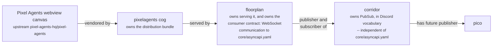
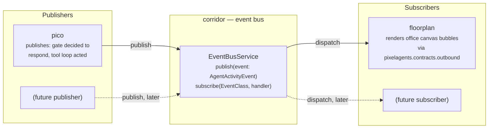
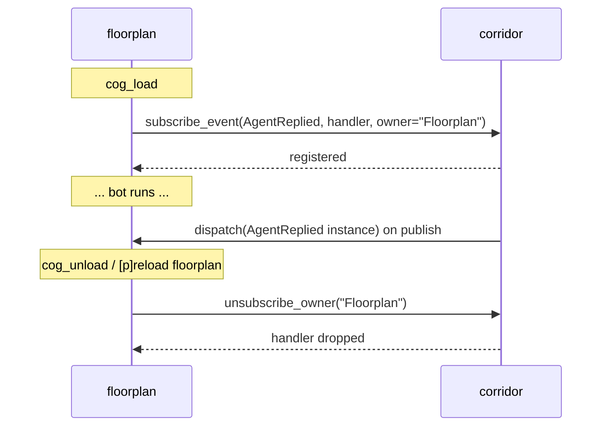
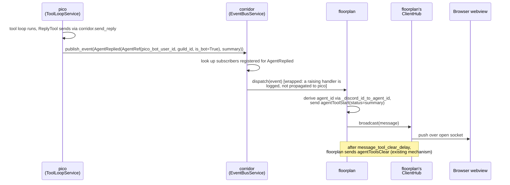
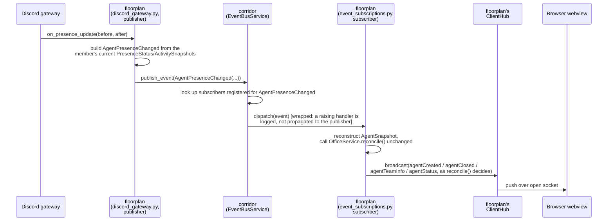
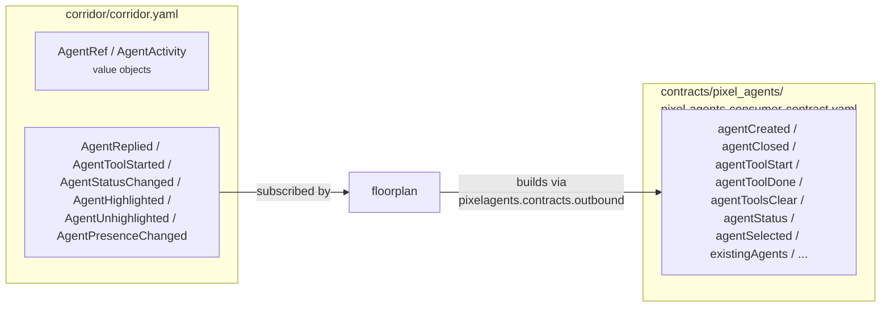

# Corridor event bus (PubSub): design

> **Status: presence path shipped, pico publishing still future work.**
> corridor's `EventBusService` (`publish`/`subscribe`/`unsubscribe_owner`)
> is implemented, and floorplan now both **publishes** onto it (Discord
> presence updates as `AgentPresenceChanged`, raw tracked-member messages
> as `AgentReplied`) and **subscribes** to its own publications to drive
> the existing webview-translation code, unchanged. `AgentReplied` is no
> longer scoped to just "a cog's `send_reply` call" — see the corrected
> docstring below. pico's own publish call (`AgentReplied`/
> `AgentStatusChanged` from the tool loop) is **not** part of this PR and
> stays exactly as this doc originally designed it: a follow-up, stacked
> on top of this one.
>
> A review pass against the real pixel-agents source found one confirmed
> error (corrected) and surfaced two follow-up requests, posted as
> [a review comment on pixel-agents-hq/pixel-agents#396](https://github.com/pixel-agents-hq/pixel-agents/pull/396#issuecomment-5385481972).
> Both shipped upstream within the day: `agentDeselected` (a real
> undo for `agentSelected`) and an explicit, protocol-level
> `isHeadless` override (no longer purely client-runtime-detected). The
> vendor pin (`pixelagents/infrastructure/webview_vendor.commit`) now
> points at that commit. See "Design review" and "Now unblocked: three
> new dataclasses" below for the domain model this adds.

## Motivation

Today, the only cog that turns "something happened" into "something
visible on the office canvas" is floorplan, and the only producer it
knows about is Discord's own gateway: `floorplan/adapters/discord_gateway.py`
listens to presence/activity/message events directly and projects them
into `ServerMessage`s itself (see
[`docs/architecture.md` §3a](architecture.md#3a-presence-mirroring-no-corridor-involvement)).
That works because there has only ever been one producer.

pico is about to become a second one. pico's tool-calling loop
(`docs/architecture.md` §4) already does something worth visualizing —
it decides to respond, then acts. Wiring that straight into floorplan
would mean either:

- floorplan grows pico-specific code (`if message came from pico, do X`),
  which breaks the exact boundary [issue #21](https://github.com/pixel-agents-hq/pixel-agents-cogs/issues/21)
  drew: floorplan owns *everything that consumes*, generically — not
  one integration per producer; or
- pico depends on floorplan directly (`required_cogs: floorplan`), which
  breaks the property [`docs/architecture.md` diagram 1](architecture.md#1-runtime-dependency-graph)
  documents today: **nothing in this repo depends on floorplan**. Adding
  that edge would make floorplan load-bearing for pico, when today it's a
  leaf.

corridor already exists to decouple "a cog needs something cross-cutting"
from "which specific cog provides it" — that's exactly what it does today
for permissions (`require_permission`/`capabilities_satisfy`) and reply
rendering (`send_reply`/`render_reply`), per
[`docs/architecture.md` §2](architecture.md#2-ownership-map-who-does-what).
A pub/sub event bus is the same shape of problem: a producer that
shouldn't need to know who (if anyone) is listening, and a consumer that
shouldn't need to know who (if anyone) produces. corridor is the natural
place for a third chokepoint like this, not a new fourth shared cog.

## Roles across the stack, and what's implemented today

| Package | Role |
|---|---|
| **pixelagents** | Owns the Pixel Agents webview **distribution bundle** — clones `pixel-agents-hq/pixel-agents` at a pinned commit and builds it into `webview_dist/`. Never talks to a browser or a Discord gateway itself. |
| **floorplan** | Owns **serving** that bundle (the Red Dashboard route) *and* owns **the communication to it** — the entire WebSocket protocol implementation against pixel-agents' real wire contract, `core/asyncapi.yaml` (vendored transitively via pixelagents). floorplan is the only package in this repo that speaks that protocol, in either direction. |
| **contracts** | CI-only. Runs consumer-driven contract tests against **pixelagents'** real build pipeline (`contracts/pixel_agents/verify.py`) and **floorplan's** real Pixel Index integration (`contracts/pixel_index/verify.py`) — both against live/pinned upstream targets. Also runs a consumer-driven contract for **corridor's** own `EventBusService` (`contracts/corridor/generate_corridor_contract.py --check`), introspecting `corridor/domain/models.py`'s real dataclasses the same way the other two check real code, plus a doc cross-reference lint (`contracts/corridor/lint_corridor_contract.py`) ensuring every declared event stays mentioned in this doc. Separately runs a static lint (`contracts/discord_replies/lint_reply_channel.py`) that AST-scans every cog's command handlers, corridor included, checking they route replies through corridor rather than a raw `ctx.send`. That lint is a boundary check on how cogs *use* corridor's existing reply chokepoint, not a consumer-driven contract against live corridor code the way the other three are. |
| **corridor** | Three responsibilities, only two shipped today: |

1. **Reply rendering** (`send_reply`/`render_reply`) — **implemented**.
   `corridor/application/reply_service.py`'s `ReplyService`, wired through
   `corridor/adapters/cog_base.py`.
2. **Permission tiers** (`require_permission`/`capabilities_satisfy`) —
   **implemented**. `corridor/application/permission_service.py`'s
   `PermissionService`, wired the same way.
3. **PubSub, in Discord vocabulary** — **implemented for the presence
   path**. `corridor/application/event_bus_service.py`'s
   `EventBusService`, wired through `corridor/adapters/cog_base.py`'s
   `publish_event`/`subscribe_event`/`unsubscribe_owner`. floorplan
   publishes (`floorplan/adapters/discord_gateway.py`) and subscribes
   (`floorplan/adapters/event_subscriptions.py`) to its own events. pico's
   publish call is still future work — see the status table below.

### corridor's PubSub is independent of pixel-agents' WebSocket protocol — deliberately

This is the single most important framing decision in this doc, and it's
easy to get wrong by analogy to floorplan's existing WebSocket work:

- corridor's bus does **not** own, wrap, or proxy pixel-agents' WebSocket
  protocol (`core/asyncapi.yaml`). That protocol has exactly one owner in
  this repo — floorplan — unchanged by anything in this doc.
- corridor's bus is its **own, independent, in-process** communication
  channel, speaking **Discord vocabulary** (`AgentRef`, `AgentReplied`,
  `AgentStatusChanged`, ...) — never webview wire vocabulary
  (`agentToolStart`, `ServerMessage`, `isExternal`, ...). See "Deliberately
  not included" in the Domain model section above.
- Because of that split, **corridor's `EventBusService` can be designed,
  built, tested, and merged completely independently of floorplan or
  pixelagents** — it needs nothing from either package, and neither needs
  anything from it until a subscriber (floorplan) chooses to wire one up.
  `PermissionService`/`ReplyService` are proof this pattern already works
  in this exact codebase: both shipped and are used by every cog without
  either service knowing anything about WebSockets, Red Dashboard, or the
  webview. The bus is the same shape of addition — no new coupling to
  floorplan's stack, just a new capability on corridor.
- floorplan is still the one piece that bridges both channels — the only
  package that both subscribes to corridor's bus *and* speaks the wire
  protocol, so it (and only it) does the translation between the two.



Two channels, one bridge: the left half of this chain (`Canvas` through
`floorplan`) is the existing, shipped webview-serving path — floorplan
speaks pixel-agents' wire protocol there. The right half (`corridor`
through `pico`) is corridor's Discord-vocabulary path — corridor speaks
nothing but its own dataclasses there. floorplan is the only node that
appears in both halves, because it's the only package with a reason to:
as of this PR, floorplan is both the bus's first publisher (its own
Discord gateway listeners) and its first subscriber (translating those
same events back into webview messages) — pico joining as a second
publisher is still future work.

### Implementation status, verified line by line

| Piece | Status | Evidence |
|---|---|---|
| Reply rendering | ✅ Implemented | `corridor/application/reply_service.py`, `corridor/adapters/cog_base.py::send_reply`/`render_reply` |
| Permission tiers | ✅ Implemented | `corridor/application/permission_service.py`, `corridor/adapters/cog_base.py::require_permission`/`capabilities_satisfy` |
| Webview bundle vendoring + build | ✅ Implemented | `pixelagents/infrastructure/webview_build.py` |
| Webview serving + WebSocket protocol | ✅ Implemented | `floorplan/infrastructure/websocket.py`, `floorplan/contracts/websocket.py` |
| Consumer-driven contract tests (pixelagents, pixel_index) | ✅ Implemented | `contracts/pixel_agents/verify.py`, `contracts/pixel_index/verify.py` |
| Reply-channel static lint (all cogs, corridor included) | ✅ Implemented | `contracts/discord_replies/lint_reply_channel.py` |
| corridor `EventBusService` (`publish`/`subscribe`) | ✅ Implemented | `corridor/application/event_bus_service.py`, `corridor/adapters/cog_base.py::publish_event`/`subscribe_event`/`unsubscribe_owner` |
| corridor domain types (`AgentRef`, `AgentReplied`, `AgentPresenceChanged`, ...) | ✅ Implemented | `corridor/domain/models.py`, exported via `corridor/domain/__init__.py` |
| floorplan publishing to the bus | ✅ Implemented | `floorplan/adapters/discord_gateway.py` publishes `AgentPresenceChanged`/`AgentReplied` |
| floorplan subscribing to the bus | ✅ Implemented, all six event types | `floorplan/adapters/event_subscriptions.py::EventSubscriptionsMixin` — `AgentPresenceChanged`/`AgentReplied` (own publications) plus `AgentHighlighted`/`AgentUnhighlighted`/`AgentToolStarted`/`AgentStatusChanged` (published by `testbench` today) |
| `testbench` manually publishing any event to the bus | ✅ Implemented | `testbench/adapters/views.py`, owner-only, UI generated from `corridor/event_catalog.py` |
| pico publishing to the bus | ❌ Not implemented, out of scope for this PR | no `publish_event` call sites in `pico/` |
| Consumer-driven contract test for corridor's bus | ✅ Implemented | `contracts/corridor/generate_corridor_contract.py --check`, generated `corridor/corridor.yaml` |

## Goals

- A publishing cog can emit a typed event without knowing whether anything
  is subscribed.
- A subscribing cog can register interest in an event type without
  knowing whether anything publishes it (yet, or ever).
- corridor stays the only new edge either side gains. **No direct
  `pico -> floorplan` dependency is ever introduced** — the dependency
  graph in `docs/architecture.md` diagram 1 does not change shape, only
  corridor's own responsibilities grow.
- A broken or slow subscriber cannot break or block a publisher. Precedent
  already exists for this in this codebase:
  `floorplan/infrastructure/client_hub.py`'s `ClientHub` isolates
  broadcast failures per socket so one dead connection doesn't stop
  delivery to the others — the bus needs the same isolation, per
  subscriber instead of per socket.

## Non-goals (for this doc, and for the first implementation)

- **No implementation in this PR.** Corridor's actual `EventBusService`,
  floorplan's subscription, and pico's `publish` call are all follow-up
  work.
- **No cross-process or persistent bus.** In-process, single event loop,
  scoped to one running bot — the same scope every other corridor service
  already has. Nothing here needs to survive a restart.
- **No free-form event shape.** A closed set of frozen dataclasses, one
  per kind of agent activity — mirroring how `ReplyField`/`PermissionGroupDef`
  are explicit domain types today, never a stringly-typed `type` tag plus
  an untyped payload dict. See "Domain model" below.
- **No guaranteed delivery, ordering, or replay.** If nothing is
  subscribed when an event publishes, it's simply dropped — the same as
  floorplan's WebSocket broadcast today drops messages when no client is
  connected.

## High-level architecture



pico is the reference publisher and floorplan the reference subscriber
for this design, because both already exist and both already have a
reason to use the bus today. Nothing about the bus itself is pico- or
floorplan-specific — `toolbox` or a future cog could publish or subscribe
the same way, which is why the diagram leaves a "future" slot on each
side.

## Where this fits in corridor's existing layering

Every cog in this repo follows the same `domain/` / `application/` /
`infrastructure/` / `adapters/` split
([`docs/AGENTS.md` "Internal layering"](AGENTS.md#internal-layering)).
The bus slots into corridor's existing layers the same way
`PermissionService`/`ReplyService` already do — no new layer, no new
cross-cutting concern:


`CogBase.__init__` would wire one `EventBusService` instance the same way
it already wires `PermissionService`/`ReplyService` today
(`corridor/adapters/cog_base.py`) — one bus per bot process, not per
guild, with guild scoping carried on each event's `AgentRef` (see below).

## Domain model: a closed set of agent-activity dataclasses

Settled direction (superseding an earlier draft of this doc that used a
generic `Event(type: str, payload: Mapping)` envelope — rejected because
it's stringly-typed, mypy-blind, and says nothing about *agents*, which is
the whole point of this bus): every publishable event is its own frozen
dataclass, all sharing one `AgentRef`. No generic envelope, no string
tag, no untyped payload.

### Verified against the real wire protocol first

Before settling field names, every dataclass below was checked against
`core/asyncapi.yaml` in `pixel-agents-hq/pixel-agents` **at the exact
commit this repo currently pins**
(`df517d19aa8a503ffa950315e51a3f200f2edf1f`, from
`pixelagents/infrastructure/webview_vendor.commit` — fetched directly from
that commit, not assumed from a newer or older checkout lying around
locally). This is the second pass at this verification: the pin moved from
`3537e14` to `df517d1` specifically because of the three commits this doc's
own review comment prompted — see "Design review" below. The
`asyncapi.yaml` channel is explicitly documented as bidirectional:
`ServerMessage` (32 variants at this pin, up from 31 — `AgentDeselected` is
new — server → client, the half a bus event ultimately has to become,
since floorplan only ever *broadcasts* to browsers, never receives
bus-originated data back from one) and `ClientMessage` (22 variants,
unchanged, browser → server, editor-gated). Every field below is taken
from the real, currently-pinned `ServerMessage` schema, not invented:

- **`agentToolStart`** requires `id`, `toolId`, **and `status`** — a
  required, human-readable label. `toolName` is *optional*, not required
  — an earlier draft of this doc had that backwards.
- **`agentToolDone`** (`id`, `toolId`) and **`agentToolsClear`** (`id`
  only — clears *all* foreground tools for that agent) are both real, and
  distinct. floorplan's own existing Discord-message handling
  (`floorplan/adapters/discord_gateway.py::_clear_tool_after_delay`)
  already uses `agentToolsClear` after `message_tool_clear_delay`, **not**
  `agentToolDone` — a second correction to an earlier draft, which claimed
  `agentToolStart → agentToolDone` for this exact path.
- **`agentStatus`**'s `status` field is `AgentActivityStatus`, a real
  two-value enum: `active` / `waiting` — matches this doc's
  `Literal["active", "waiting"]` exactly. It also carries an optional
  `awaitingInput: bool`, documented upstream as "only meaningful when
  status is waiting... True when the agent went idle waiting on the user."
  That's a CLI-coding-agent concept (blocked mid-task on a human) with no
  clean pico analogue today — included below for shape-fidelity, expected
  to stay unset until/unless something in pico actually blocks like that.
- **`agentContextUsage`** (`contextTokens`, `maxContextTokens`) is real
  and verified, and maps unusually well onto pico: pico already has a
  bounded conversation window (`HISTORY_LIMIT = 10` in
  `pico/adapters/listener.py`) and a bounded tool-call budget
  (`max_tool_calls`, `docs/architecture.md` §4). **Not** added to the
  closed set below yet — flagged as the strongest verified candidate for
  the next one, once there's an actual token-accounting story in pico to
  back it.
- **`existingAgents.externalAgents`** and **`agentCreated.isExternal`**
  are both real, and already exercised: `pixelagents/tests/test_contracts_outbound.py`
  asserts `agent_created(..., is_external=True)` today for exactly this
  kind of agent. Every Discord-derived agent (human or bot) is already
  "external" in the wire protocol's sense — this is a **constant of where
  the agent came from, not new per-event data any dataclass below needs
  to carry**.
- **Headless agents no longer require a purely client-detected heuristic.**
  As of `df517d1`, `AgentCreated` carries an optional `isHeadless: bool`
  and `ExistingAgents` a matching `headlessAgents: dict[str, bool]` — an
  explicit, protocol-level override. The webview's `resolveHeadless(isExternal,
  explicitHeadless, isBrowserRuntime)` (`webview-ui/src/office/engine/headlessAgent.ts`)
  now reads `explicitHeadless ?? (isExternal === true && !isBrowserRuntime)`
  — the override wins when a producer sends it; the old
  `isBrowserRuntime`-gated heuristic (still architecturally inert for
  floorplan's deployment, per the previous version of this bullet) is only
  the fallback now. floorplan can set `isHeadless` explicitly per agent
  going forward. See "Now unblocked" below for what floorplan should set
  it to.
- **`agentTeamInfo` is real but excluded**, per direction on this design:
  its fields (`teamName`, `isTeamLead`, `leadAgentId`, `teamUsesTmux`)
  describe CLI-agent-team concepts — a lead agent with teammates sharing a
  tmux session — with no Discord analogue.
- **`agentSelected` was wrongly excluded in an earlier draft of this doc**,
  which claimed it was "VS Code only" and had no Discord analogue. That was
  wrong, and upstream has since corrected the schema's own description to
  match: office-cogs already sends it —
  `pixelagents/application/office.py::send_message_activity` calls
  `agent_selected(agent_id)` on every tracked Discord message, specifically
  to force the label panel open. `agentSelected`'s description in
  `core/asyncapi.yaml` now reads "not VS Code-only," naming "a Discord
  bridge forcing its label panel open for an incoming message" explicitly.
  It also now has a real counterpart, **`agentDeselected`** (`id` only) —
  see "Design review" below for the full finding and "Now unblocked" for
  the dataclasses this adds.

### The dataclasses

```python
@dataclass(frozen=True, slots=True)
class AgentRef:
    """A Discord member represented as a webview agent. Deliberately holds
    the *raw* Discord user ID, not floorplan's derived, JS-safe negative
    agent ID -- that derivation (`_discord_id_to_agent_id`) stays
    floorplan's own concern, the only place that currently needs it."""

    discord_user_id: int
    guild_id: int
    is_bot: bool  # ties into floorplan's existing per-guild `include_bots` setting


@dataclass(frozen=True, slots=True)
class AgentReplied:
    """Named for corridor's own verb (`send_reply`). Originally scoped to
    "a publisher sends a reply through corridor, nothing broader" -- widened
    once floorplan's own raw Discord message mirroring became a second
    publisher alongside any cog's send_reply call. `summary` is always the
    full, untruncated text -- wire truncation/wording is the subscriber's
    job, never the publisher's."""

    agent: AgentRef
    summary: str  # -> agentToolStart's required `status` label, floorplan's own wording/truncation


@dataclass(frozen=True, slots=True)
class AgentToolStarted:
    agent: AgentRef
    tool_id: str
    status: str            # required on the wire -- human-readable label
    tool_name: str | None = None   # optional on the wire


@dataclass(frozen=True, slots=True)
class AgentStatusChanged:
    agent: AgentRef
    status: Literal["active", "waiting"]   # matches AgentActivityStatus exactly
    awaiting_input: bool | None = None     # matches AgentStatus.awaitingInput; see note above


@dataclass(frozen=True, slots=True)
class AgentHighlighted:
    """-> agentSelected(id). Named for what it does in Discord vocabulary
    (draw attention to this member's activity), not for the CLI-editor
    action (`agentSelected`'s own wire name) that happens to share the
    mechanism."""

    agent: AgentRef


@dataclass(frozen=True, slots=True)
class AgentUnhighlighted:
    """-> agentDeselected(id). Only takes effect if this agent is still
    the highlighted one -- matches agentDeselected's own no-op-if-stale
    semantics on the wire, so publishing this after a newer AgentHighlighted
    already moved the highlight elsewhere is always safe."""

    agent: AgentRef


AgentActivityEvent = (
    AgentReplied | AgentToolStarted | AgentStatusChanged | AgentHighlighted | AgentUnhighlighted
    | AgentPresenceChanged
)


@dataclass(frozen=True, slots=True)
class AgentActivity:
    """One Discord rich-presence activity, mirroring
    pixelagents.domain.ActivitySnapshot's shape (corridor must not import
    pixelagents types, so this is a parallel, hand-kept-in-sync copy).
    Includes `name` -- PresenceService.label()'s fallback for every
    non-LISTENING kind reads it; omitting it would silently break those
    rich-presence bubbles."""

    kind: str
    name: str | None = None
    title: str | None = None
    artist: str | None = None
    details: str | None = None
    state: str | None = None


@dataclass(frozen=True, slots=True)
class AgentPresenceChanged:
    """Enough to reconstruct pixelagents.domain.AgentSnapshot and drive
    OfficeService.reconcile() unchanged. One rich event, not four granular
    ones (join/leave/status/activity) -- every one of those needs the same
    full-snapshot reconstruction to call reconcile() anyway.

    status="offline" covers both a real Discord offline/invisible status
    AND a member actually leaving the guild -- on_member_remove publishes
    this same shape with status="offline"; the subscriber maps that to
    AgentSnapshot(status=None, ...), matching reconcile()'s own
    `folder is None` branch."""

    agent: AgentRef
    display_name: str
    status: Literal["online", "idle", "dnd", "offline"]
    activities: tuple[AgentActivity, ...] = ()
```

Renamed from an earlier draft's `AgentActivity` (the publish/subscribe
union) to **`AgentActivityEvent`**, once the presence work above needed
`AgentActivity` for a second, unrelated concept: a single Discord
rich-presence activity, embedded inside `AgentPresenceChanged`. The two
never overlap — `AgentActivityEvent` is the closed set of types a cog
`publish()`es/`subscribe()`s to; `AgentActivity` is a value object carried
*inside* one specific member of that set.

`is_bot` exists because both kinds of Discord member are meant to become
agents, not just bots: floorplan's own presence mirroring already treats
every guild member as an agent today, human or bot, gated only by its
per-guild `include_bots` setting. For pico specifically, `AgentRef` names
*pico's own Discord bot user* — pico is publishing "I, this bot account,
did something," the same way floorplan's existing presence path already
turns a human member's message into an `agentToolStart` bubble for that
human. A future publisher representing a human-triggered activity (not
just a bot's own) would set `is_bot=False` and reference that human's
Discord user ID instead — the dataclasses don't change, only which member
`AgentRef` points at. Every one of these events also assumes the
underlying agent already exists on the canvas (an `agentCreated` for that
`AgentRef`'s derived ID) — for pico that's already true today, since
pico's own bot account gets mirrored the same as any guild member via
floorplan's existing presence path (subject to `include_bots`); this bus
only ever adds activity on top of an agent, it never creates one itself.

`EventBusService.subscribe` dispatches by concrete class
(`subscribe(AgentReplied, handler, owner="Floorplan")`), not by a string
key — a subscriber only ever registers for classes it actually knows how
to handle, and mypy can check that a handler's signature matches the
class it's registered against.

**Deliberately not included:** any of `pixelagents.contracts.outbound`'s
wire-shaped fields (no `id` in the derived agent-ID namespace, no raw
message construction). Translating an `AgentActivityEvent` into the exact
canvas message stays entirely floorplan's job, the same way it alone owns
translating a Discord presence update into one today — this bus only ever
crosses the "something happened to this Discord member" boundary, never
the "here's the exact webview message" one. See
[floorplan's presence-mapping table](../floorplan/Architecture.md#presence-mapping)
for the shape of translation floorplan already does for raw Discord
signals; `floorplan/adapters/event_subscriptions.py`'s subscriber handlers
do the equivalent for bus-originated events.

Candidate first mapping, now against verified fields and, for the
presence path, actually shipped:

| Dataclass | Published by | Wire translation |
|---|---|---|
| `AgentReplied` | **shipped**: floorplan's own `on_message` listener, for every tracked member's Discord message (`floorplan/adapters/discord_gateway.py`). **Future**: pico, after `ToolLoopService.run` finishes via a successful `send_reply` tool call — a second producer of the same event, per the design decision above | `agentToolStart` (`status=summary`) then `agentSelected`, via the existing, unchanged `OfficeService.send_message_activity` (matches its pre-existing parity for a raw Discord message). After `message_tool_clear_delay`, `OfficeService.clear_message_activity` sends `agentToolsClear` only — **not** `agentToolDone`, and **not** `agentDeselected` either: `agentSelected`'s own no-expiry semantics mean nothing needs to actively deselect, and re-pinging a deselect at clear time was rejected as a re-ping with no visible effect (see `test_message_clear_does_not_reping`) |
| `AgentPresenceChanged` | **shipped**: floorplan's own presence/member-join/member-remove listeners (`floorplan/adapters/discord_gateway.py`) | The existing, unchanged `OfficeService.reconcile()` — spawns/closes/renames the agent and forwards each `AgentActivity` into `ActivitySnapshot` for rich-presence bubbles, exactly as it did before this event existed |
| `AgentStatusChanged` | **shipped as a subscriber, manual publisher only**: `testbench`'s owner-only UI can publish it on demand; pico's automatic publish (after `GateService.decide` returns `RESPOND` / after the tool loop finishes) is still future work | `agentStatus` (`status` ∈ `active`/`waiting`; `awaiting_input` expected unset) via `OfficeService.set_status`, gated on `is_tracked` |
| `AgentToolStarted` | **shipped as a subscriber, manual publisher only**: `testbench`; reserved for when pico grows tools beyond `send_reply` (`docs/architecture.md` §4 notes the tool-loop shape already supports more) | `agentToolStart` via `OfficeService.start_tool_activity`, gated on `is_tracked`. No paired clear event exists yet (see "Open question" below) — the bubble stays until something else sends `agentToolsClear`/a new `agentToolStart` for the same agent |
| `AgentHighlighted` | **shipped as a subscriber, manual publisher only**: `testbench` | `agentSelected(id)` via `OfficeService.highlight_agent`, gated on `is_tracked` |
| `AgentUnhighlighted` | **shipped as a subscriber, manual publisher only**: `testbench` | `agentDeselected(id)` via `OfficeService.unhighlight_agent`, gated on `is_tracked` — safe to send even if a newer highlight already moved on, since the wire message is itself a no-op unless it still matches |

Open question, unchanged by the presence path landing:
`AgentReplied`'s clear mechanism (reuse `message_tool_clear_delay` →
`agentToolsClear`) is now shipped for both a raw Discord message and (once
it lands) pico's own reply. The generic `AgentToolStarted`, reserved for a
future, possibly-longer-running pico tool, does **not** have one — a fixed
delay is a bad fit for a tool whose duration isn't known in advance. Worth
deciding whether it needs its own `AgentToolFinished`/`AgentToolCleared`
dataclass to correlate against
`tool_id` explicitly, rather than borrowing `AgentReplied`'s timer-based
approach.

## Design review: two gaps found, both resolved upstream within the day

A review pass against `~/pixel-index/vendor/pixel-agents` (the read-only
vendored source) found one confirmed error in this doc and one genuinely
open design question. Both were posted as
[a review comment on pixel-agents-hq/pixel-agents#396](https://github.com/pixel-agents-hq/pixel-agents/pull/396#issuecomment-5385481972),
and both shipped upstream the same day, as three commits
(`415856a`, `42e5140`, `df517d1` — the last is this repo's current vendor
pin). "Now unblocked," further below, covers what that adds to this
doc's domain model.

### Confirmed error: `agentSelected` is not VS-Code-only, and this doc excluded it wrongly

The claim that `agentSelected` "doesn't apply where there's no terminal to
focus" was checked against `asyncapi.yaml`'s *description* field
(`"An agent's terminal was focused (VS Code only)"`) rather than against
how this repo actually uses it. It's wrong:
`pixelagents/application/office.py::send_message_activity` already sends
`agent_selected(agent_id)` on every tracked Discord message — not to focus
a terminal, but to force the label panel open (bypassing the
hover/`alwaysShowLabels` gate) so the message text is visible immediately.
This has shipped in office-cogs for a while.

Tracing what that message actually *does* client-side surfaced something
more consequential: **until today, it didn't do anything on the real
office canvas.** `agentSelected`'s webview handler
(`useExtensionMessages.ts`) only ever updated the React state feeding
`<DebugView>` — the actual canvas (`<ToolOverlay>`) reads a *different*,
engine-level field (`officeState.selectedAgentId`) that only direct canvas
clicks ever set. So office-cogs' `send_message_activity` call has been a
no-op on the visible office this entire time. This is being fixed live,
in [pixel-agents#396](https://github.com/pixel-agents-hq/pixel-agents/pull/396)
(opened the same day as this review), which makes the `agentSelected`
handler also set `officeState.selectedAgentId` — closing exactly this gap.

That fix surfaced a second, sharper finding while tracing
`officeState.ts`: **`selectedAgentId` had no expiry and no deselect
message.** It only cleared when the referenced agent was removed, or
another selection/canvas click happened — no `agentToolsClear`-style timer,
no deselect message at all. Flagged upstream as a real UX regression
`send_message_activity`'s existing per-message call would have caused once
#396 shipped (pinning the label panel open on whichever Discord user
messaged most recently, with no release) — previously invisible only
because of the bug #396 itself fixes.

**Resolved**, same day, in
[`42e5140`](https://github.com/pixel-agents-hq/pixel-agents/commit/42e5140530086b04ad3f51a029d02414f9652514):
a new `AgentDeselected` message (`id` only — a no-op if that id isn't the
currently-selected one, so it can't race a newer selection), and
`agentSelected`'s own schema description corrected to explicitly name
"a Discord bridge forcing its label panel open for an incoming message" as
an intended producer, not just VS Code.

### Design question, now resolved: headless agents

`isHeadlessAgent()`'s blanket exemption for the entire "standalone"
runtime (`!isBrowserRuntime`, [pixel-agents#369](https://github.com/pixel-agents-hq/pixel-agents/pull/369))
was reasoned about against the lightweight `webview-ui dev` browser-preview
tool introduced in [pixel-agents#143](https://github.com/pixel-agents-hq/pixel-agents/pull/143)
("every agent would qualify and the cue would distinguish nothing") — a
throwaway dev tool, not a production third-party consumer. `isBrowserRuntime`
also covers floorplan's real deployment, where that premise doesn't
obviously hold: `isExternal=True` is already sent correctly for every
Discord-derived agent, but the ghost/headless treatment it would otherwise
drive could never engage for us, structurally, regardless of what we sent.
Flagged upstream as a request to make that behavior protocol-controllable
instead of purely client-runtime-detected.

**Resolved**, same day, in
[`df517d1`](https://github.com/pixel-agents-hq/pixel-agents/commit/df517d19aa8a503ffa950315e51a3f200f2edf1f)
(this repo's current vendor pin): `AgentCreated` gained an optional
`isHeadless: bool` and `ExistingAgents` a matching `headlessAgents: dict[str, bool]`
override, resolved as `explicitHeadless ?? (isExternal && !isBrowserRuntime)`
— an explicit per-agent value now wins over the old heuristic. This also
settled the domain-model question this doc left open: given
`AgentRef.is_bot` already exists as a durable fact about every agent this
bus describes, "headless" has a real, useful Discord-vocabulary meaning
now that it's actually settable — see "Now unblocked" below.

## Subscription lifecycle

Precedent already exists in this exact file for the *opposite* direction:
`corridor/adapters/cog_base.py`'s `register_dependent`/`unregister_dependent`
lets corridor cascade-unload a cog that depends on corridor, so a
dependent never keeps running against a corridor that's gone away. A
subscription has the reverse failure mode — corridor must not keep a
stale handler closure bound to a subscriber's now-unloaded Cog instance —
so the cleanup direction is reversed too: **the subscriber unsubscribes
itself**, from its own `cog_unload`, rather than corridor tracking and
cascading it.



Open question for the implementation PR: whether corridor should also
defensively drop an owner's subscriptions if that owner's Cog disappears
from `bot.cogs` without ever calling `unsubscribe_owner` (a crash during
`cog_unload`, say) — `register_dependent`'s cascade exists precisely
because corridor doesn't trust every dependent to clean up after itself
perfectly. The same distrust probably applies here.

## End-to-end example: pico publishes, floorplan renders it (future work)

This is the flow the whole design exists to support — closing the loop
between [`docs/architecture.md` §4](architecture.md#4-runtime-data-flow-picos-gate-then-tool-loop)
(pico's tool loop) and
[§3a](architecture.md#3a-presence-mirroring-no-corridor-involvement)
(floorplan's canvas broadcast), with corridor mediating instead of either
cog knowing about the other. **Not part of this PR** — pico's `publish_event`
call doesn't exist yet (see the checklist above); this diagram is still the
target shape for when it lands:



pico never imports anything from floorplan, and floorplan never imports
anything from pico — both only ever talk to corridor. This is the same
shape `docs/architecture.md` §1 already documents for `required_cogs`:
corridor is the one edge every other cog gets, never each other.

## Shipped example: floorplan publishes and subscribes to itself

Unlike the pico example above, this path is real, shipped by this PR, and
has a twist the pico/floorplan example doesn't: **floorplan is both the
publisher and the subscriber for `AgentPresenceChanged`.** The bus still
does real work here — it's the seam between "listening to Discord" and
"rendering to the canvas" inside floorplan itself, the same seam a future
second cog (or pico) could plug a publisher or subscriber into without
floorplan's gateway listeners or translation code changing at all:



The same shape repeats for `AgentReplied`: `on_message` publishes it for
every tracked member's Discord message, and `event_subscriptions.py`'s
`_on_agent_replied` subscribes to drive `send_message_activity`/
`clear_message_activity` unchanged (see the mapping table above for the
exact wire sequence). `on_member_remove` publishes the same
`AgentPresenceChanged(status="offline")` shape as any other presence
change — there's no separate "member left" event, matching this doc's
original one-rich-event design decision.

## Delivery semantics — settled, as shipped

- **Sync, awaited dispatch, with per-subscriber error isolation.**
  `EventBusService.publish` awaits each subscriber's handler in turn inside
  a `try`/`except`, logs and continues on failure — mirroring `ClientHub`'s
  per-socket isolation. A subscriber that raises never breaks the
  publisher's own turn (a future pico tool loop won't fail because
  floorplan's rendering threw; verified today by
  `corridor/tests/test_event_bus_service.py`'s isolation tests). Whether
  dispatch should instead be fire-and-forget (`asyncio.create_task` per
  handler) is worth revisiting once there's a second subscriber and real
  latency data — the shipped synchronous version keeps failure modes easy
  to reason about, and nothing about the presence path's latency has given
  a reason to revisit it.
- **Guild scoping.** Every event's `AgentRef` carries `guild_id`; corridor's
  bus itself does not filter dispatch by it. That stays each subscriber's
  own responsibility — floorplan's `_on_agent_presence_changed`/
  `_on_agent_replied` re-read their own per-guild `enabled` config at
  dispatch time (`floorplan/adapters/event_subscriptions.py`), the same
  gate the old direct-call code applied — so corridor doesn't need to know
  any subscriber's own guild-enablement model.
- **Ordering and backpressure.** Explicitly out of scope — event volume
  here is bounded by Discord message/interaction rates on a single guild,
  nowhere near where ordering or backpressure would matter. Revisit only
  if that assumption stops holding.
- **Testing.** Every cog's test suite already installs corridor's shared
  `redbot.core`/`discord` stubs via `corridor.testing.install_stubs()`
  (see `corridor/testing.py`, imported by `pico/conftest.py`,
  `floorplan/tests/conftest.py`, etc.). `floorplan/tests/conftest.py`'s
  `FakeCorridor` now implements a real mini pub/sub — it records every
  published event to `.published` *and* dispatches to registered
  subscribers, deliberately without corridor's own error isolation so a
  bug in a test's handler fails loudly instead of being swallowed —
  following the existing stub-set convention rather than inventing a new
  one.

## What this PR lands, and what's still follow-up

- [x] `corridor/domain/models.py`: `AgentRef` and the closed
      `AgentActivityEvent` set — `AgentReplied`/`AgentToolStarted`/
      `AgentStatusChanged`/`AgentHighlighted`/`AgentUnhighlighted`/
      `AgentPresenceChanged` — plus the `AgentActivity` value object. The
      generic `AgentToolStarted`'s paired-clear-dataclass question (below)
      stays open; `AgentReplied`'s clear mechanism is settled and shipped:
      reuse floorplan's existing `message_tool_clear_delay` →
      `agentToolsClear` (see the mapping table above for why **not** also
      `agentDeselected`).
- [x] `corridor/application/event_bus_service.py`: `EventBusService`
      (`publish`, `subscribe` keyed by concrete class, `unsubscribe_owner`),
      unit-tested in isolation the way `PermissionService`/`ReplyService`
      are.
- [x] `corridor/adapters/cog_base.py`: `publish_event`/`subscribe_event`/
      `unsubscribe_owner` chokepoint methods, wired the same way
      `send_reply`/`require_permission` are.
- [ ] pico: publish `AgentReplied`/`AgentStatusChanged` (and any other
      settled dataclasses) from the tool loop's completion path, with
      `AgentRef` pointing at pico's own bot user. **Not part of this PR** —
      the presence path below shipped first because floorplan already had
      both a producer (its own gateway listeners) and a consumer
      (`OfficeService.reconcile`) to wire together with no other cog's
      code to touch.
- [x] floorplan: publish `AgentPresenceChanged` (member update/presence
      update/join/remove listeners) and `AgentReplied` (tracked-member
      messages) at the point `discord_gateway.py` used to call
      `OfficeService`/`PresenceService` directly; subscribe at `cog_load`,
      unsubscribe at `cog_unload`
      (`floorplan/adapters/event_subscriptions.py`), translate each event
      back into the existing `OfficeService.reconcile`/
      `send_message_activity`/`clear_message_activity` calls, completely
      unchanged — see the sequence diagram below.
- [ ] Update [`docs/architecture.md`](architecture.md) once pico's publish
      lands too — the dependency graph in §1 doesn't change, but §2's
      ownership map and a new data-flow diagram closing the
      pico → corridor → floorplan loop should replace this doc's sequence
      diagrams with the real, fully-shipped shape.
- [x] `AgentHighlighted`/`AgentUnhighlighted` (map to `agentSelected`/
      `agentDeselected`) — floorplan now subscribes to both
      (`OfficeService.highlight_agent`/`unhighlight_agent`, gated on
      `is_tracked`); `agent_deselected(id)` is a new builder in
      `pixelagents/contracts/outbound.py` (it didn't exist before this).
      `AgentReplied`'s own translation still gets `agentSelected` for free
      from `OfficeService.send_message_activity`, unrelated to this
      subscription — these two are for a publisher that wants to highlight
      an agent *without* a full `AgentReplied`. No automated publisher
      exists yet; `testbench` can publish either manually today.
- [x] `AgentToolStarted`/`AgentStatusChanged` — floorplan now subscribes to
      both (`OfficeService.start_tool_activity`/`set_status`, gated on
      `is_tracked`). `AgentToolStarted`'s paired-clear-dataclass question
      (below) is still open — no automated publisher exists yet;
      `testbench` can publish either manually today.
- [ ] Headless/ghost rendering driven by `agent.is_bot` — **no new
      dataclass** (`AgentRef.is_bot` already covers it); floorplan-side
      translation work only: set `isHeadless=agent.is_bot` when building
      `agentCreated`/`existingAgents`. Still not done — verified via grep,
      `isHeadless`/`headlessAgents` appear nowhere in `pixelagents/` or
      `floorplan/` yet. This item doesn't touch corridor's bus at all,
      since `is_bot` comes from Discord directly and floorplan already has
      it independently of any `AgentActivityEvent`.
- [x] A real consumer-driven check for `corridor/corridor.yaml`:
      `corridor/event_catalog.py` introspects `corridor/domain/models.py`'s
      real dataclasses into a plain-data schema, and
      `contracts/corridor/generate_corridor_contract.py` regenerates
      `corridor.yaml` from it; CI's `--check` mode fails on any drift, the same way
      `contracts/pixel_agents/lint_outbound_contract.py` verifies
      `pixelagents.contracts.outbound` against
      `pixel-agents-consumer-contract.yaml` — see "Verifying this design:
      two committed contracts" below.

## Now unblocked: what pixel-agents-hq/pixel-agents#396 shipped

Both additions flagged during this doc's review pass are unblocked as of
the vendor pin bump to `df517d1`.

1. **`agentSelected`/`agentDeselected` → `AgentHighlighted`/`AgentUnhighlighted`.**
   Mapping: `AgentHighlighted(agent: AgentRef)` → `agentSelected(id)`,
   `AgentUnhighlighted(agent: AgentRef)` → `agentDeselected(id)`. Both are
   independently publishable — a publisher can highlight an agent without
   also faking a full `AgentReplied` — and floorplan now subscribes to
   both (`OfficeService.highlight_agent`/`unhighlight_agent`, gated on
   `is_tracked` the same way every other subscriber handler is).
   `agent_deselected(agent_id)` is a **new** builder in
   `pixelagents/contracts/outbound.py` added specifically for this —
   `agentDeselected` had no producer at all before. This is independent of
   `AgentReplied`'s own translation, which still gets `agentSelected` for
   free from `OfficeService.send_message_activity` (matching that
   method's pre-existing parity for a raw Discord message) and clears via
   `OfficeService.clear_message_activity` sending only `agentToolsClear` —
   not `agentDeselected` too, since `agentSelected` has no expiry to race
   and an unconditional deselect at clear time would be a re-ping with no
   visible effect. The unbounded-pinning risk this review originally
   flagged is closed regardless: `agentDeselected` is real, safe to send
   anytime, and reachable today by publishing `AgentUnhighlighted` — from
   `testbench`, manually, until an automated publisher exists.
2. **Headless agents: distinguishes bot accounts from human members —
   still needs no new corridor dataclass.** `AgentRef.is_bot` already
   carries the fact that drives this. What changed is that it's now
   *implementable*: floorplan's translation, wherever it builds
   `agentCreated`/`existingAgents` for any agent this bus (or its own
   presence mirroring) describes, sets the new `isHeadless` field from
   `agent.is_bot` directly. This is worth being precise about: **it
   requires zero involvement from corridor's bus.** `is_bot` is
   `discord.Member.bot`, which floorplan's own presence-mirroring code
   already reads directly from the Discord gateway
   (`floorplan/adapters/discord_gateway.py`'s `_member_snapshot`) — it
   doesn't need an `AgentActivityEvent` to learn a fact it already has.
   The domain model doesn't change; only floorplan's existing translation
   code gains one more field to set. Still not implemented as of this PR
   (verified via grep: `isHeadless`/`headlessAgents` appear nowhere in
   `pixelagents/` or `floorplan/`) — tracked in the checklist above.

## Verifying this design: two committed contracts

Everything above is a design that can drift two ways: pixel-agents' upstream
WebSocket protocol can change (it already has, twice, during this doc's own
review pass), and corridor's future implementation can drift from what this
doc says it will build. Both get a committed, CI-checked contract — one per
side of floorplan's translation boundary, matching the "two channels, one
bridge" framing from earlier in this doc. Neither contract references the
other's vocabulary; only floorplan ever touches both.



### `contracts/pixel_agents/pixel-agents-consumer-contract.yaml`

A **generated, but committed** file — unlike `contracts/pixel_index/contract.yaml`
(gitignored, rebuilt fresh every run), this one is meant to be read: it's
produced by `generate_consumer_contract.py` introspecting
`pixelagents.contracts.outbound`'s TypedDicts (via `typing.get_type_hints`/
`__required_keys__`, since they're plain `TypedDict`s, not pydantic models —
`model_json_schema()` doesn't apply here the way it does for Pixel Index),
but CI regenerates it and fails on any diff from the committed copy, so a
change to `outbound.py` always shows up as a reviewable diff to this file in
the same PR — never silent, never hand-typed. Checked two ways, matching
Pixel Index's existing offline/live split:

- **Offline** (`lint_outbound_contract.py`, every PR, no network): do
  `pixelagents.contracts.outbound`'s builders still produce exactly what
  we've committed to?
- **Live** (`verify_outbound.py`'s new `consumer_contract_drift` check,
  scheduled + PR-gated, needs the real vendor clone): does upstream's
  *actual*, currently-pinned `core/asyncapi.yaml` still support every field
  this contract declares?

**Deliberately narrower than "Verified against the real wire protocol"
above.** That section documents everything this doc has *verified against
upstream* — including `agentDeselected` and `isHeadless`/`headlessAgents`,
per "Now unblocked." This generated contract only covers what
`pixelagents.contracts.outbound` (+ `existing_agents_message`) *actually
builds today* — neither of those two appears in it yet, because no producer
exists for them. They'll appear automatically, with zero generator changes,
the moment a future PR adds real producers (floorplan's `AgentHighlighted`/
`AgentUnhighlighted` translation, most likely). Until then, this file is
narrower than the doc's own prose by design — not a gap to close, just two
different questions ("what have we verified is possible" vs. "what do we
actually send").

### `corridor/corridor.yaml`

A **generated, but committed** file, following the same pattern as
`pixel-agents-consumer-contract.yaml` above, with one difference from every
other contract in this repo: it lives inside `corridor/` itself, not
`contracts/`. `docs/corridor.md` documents `contracts/` as a
`SHARED_LIBRARY`-type package "other cogs never import at runtime" —
CI-only. That held fine while `corridor.yaml` only had CI readers
(`generate_corridor_contract.py --check`, `lint_corridor_contract.py`).
It stopped holding once `testbench` needed the same schema at *runtime*,
to build its Discord UI generically off the event set — a real cog can't
import `contracts` without breaking that rule, so the contract (and the
introspection that builds it) moved to where every cog that already
depends on corridor can reach it: `corridor/event_catalog.py` now owns
`build_contract()` (introspecting every `Agent`-prefixed name in
`corridor.domain.__all__` via `dataclasses.fields()`/`typing.get_type_hints()`
— a different introspection API than the TypedDict-based `pixel_agents`
generator, since corridor's domain types are plain dataclasses, not
TypedDicts), and `contracts/corridor/generate_corridor_contract.py`
imports that function rather than duplicating it. All eight names appear
in the rendered `version`/`status`/`events` shape: the two value objects
(`AgentRef`, `AgentActivity`) and the six `AgentActivityEvent` members
(`AgentReplied`, `AgentToolStarted`, `AgentStatusChanged`,
`AgentHighlighted`, `AgentUnhighlighted`, `AgentPresenceChanged`) —
`AgentActivityEvent` itself is skipped, since it's a union alias, not a
dataclass.

Unlike `pixel_agents`' contract, there's no separate offline-capture lint
here: corridor's domain types are plain in-process dataclasses, never
serialized to JSON, so there's no "captured wire message" to
runtime-validate the way `outbound.py`'s TypedDicts are. The generator's
own `--check` mode *is* the full consumer-driven check: CI runs
`python -m contracts.corridor.generate_corridor_contract --check` and fails
on any diff from the committed copy, so a change to
`corridor/domain/models.py` always shows up as a reviewable diff to this
file in the same PR — never silent, never hand-typed, exactly like the
`pixel_agents` contract above. `contracts/corridor/lint_corridor_contract.py`
keeps one narrower job on top: every event name in the committed
`corridor.yaml` is still mentioned in this doc's own text, so the doc can't
silently drift out of sync with the model it describes.

See [`docs/contract-testing.md`](contract-testing.md) for the full
methodology this reuses (why generate instead of hand-write, how drift
is caught, how to read a CI result) and [`contracts/README.md`](../contracts/README.md)
for local run commands.
