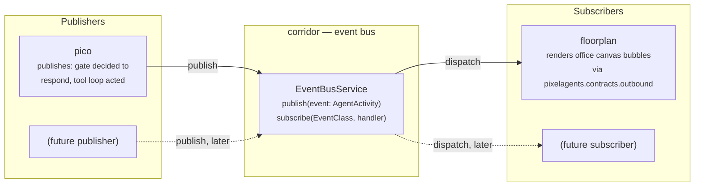
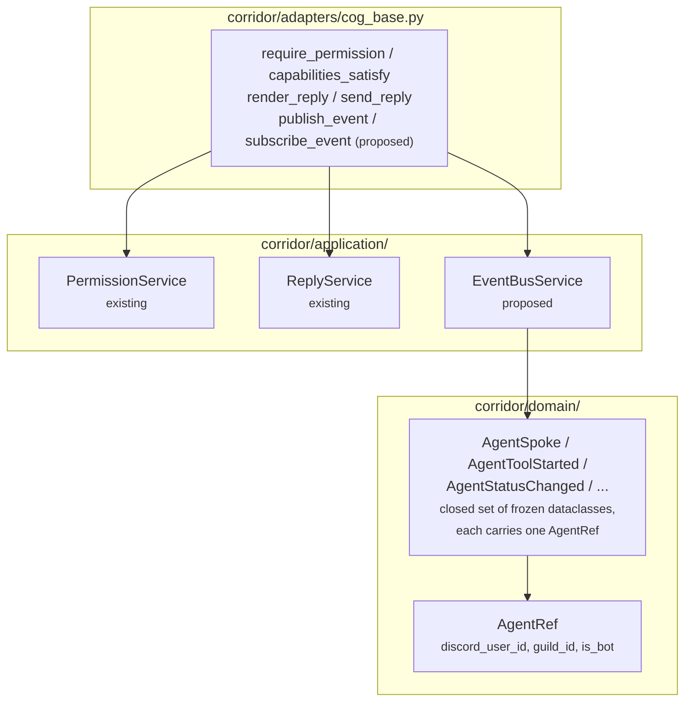
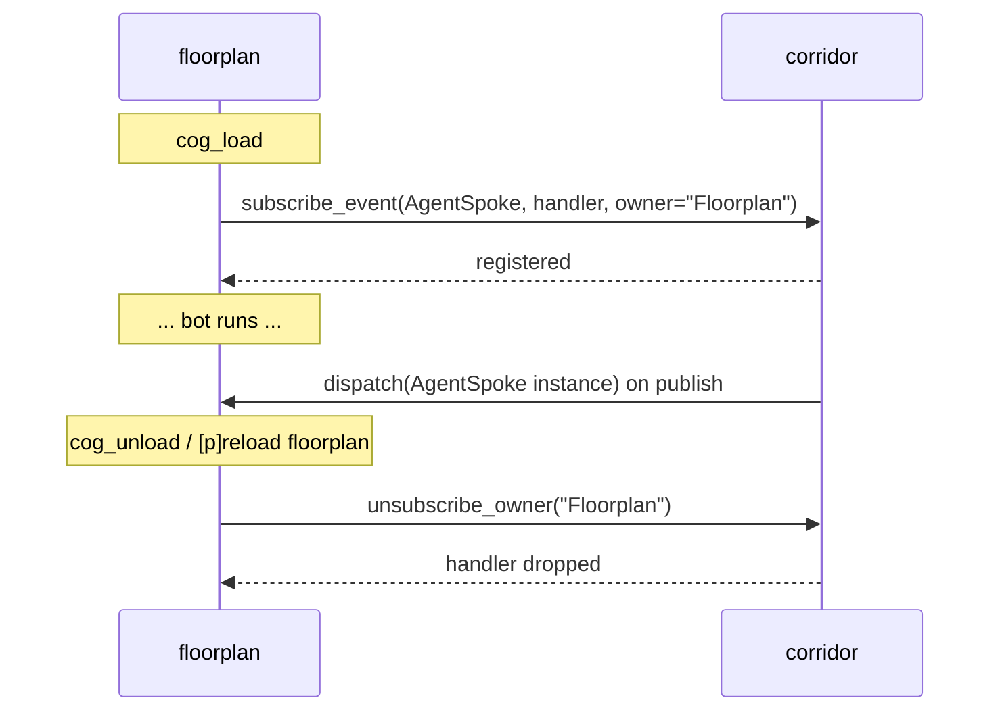
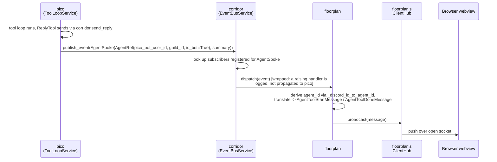

# Corridor event bus (PubSub): design

> **Status: design only.** Nothing in this doc is implemented yet — no
> `EventBusService`, no `publish`/`subscribe` methods on corridor, no
> pico or floorplan wiring. This doc exists to settle the shape and the
> open questions *before* writing that code, per
> [`docs/architecture.md`](architecture.md)'s pattern of thinking through
> the cross-cog picture on paper first. Implementation lands in a
> follow-up PR stacked on top of this one.

## Motivation

Today, the only cog that turns "something happened" into "something
visible on the office canvas" is floorplan, and the only producer it
knows about is Discord's own gateway: `floorplan/adapters/discord_gateway.py`
listens to presence/activity/message events directly and projects them
into `ServerMessage`s itself (see
[`docs/architecture.md` §3a](architecture.md#3a-presence-mirroring-no-corridor-involvement)).
That works because there has only ever been one producer.

pico is about to become a second one. pico's tool-calling loop
(`docs/architecture.md` §4) already does something worth visualizing —
it decides to respond, then acts. Wiring that straight into floorplan
would mean either:

- floorplan grows pico-specific code (`if message came from pico, do X`),
  which breaks the exact boundary [issue #21](https://github.com/pixel-agents-hq/pixel-agents-cogs/issues/21)
  drew: floorplan owns *everything that consumes*, generically — not
  one integration per producer; or
- pico depends on floorplan directly (`required_cogs: floorplan`), which
  breaks the property [`docs/architecture.md` diagram 1](architecture.md#1-runtime-dependency-graph)
  documents today: **nothing in this repo depends on floorplan**. Adding
  that edge would make floorplan load-bearing for pico, when today it's a
  leaf.

corridor already exists to decouple "a cog needs something cross-cutting"
from "which specific cog provides it" — that's exactly what it does today
for permissions (`require_permission`/`capabilities_satisfy`) and reply
rendering (`send_reply`/`render_reply`), per
[`docs/architecture.md` §2](architecture.md#2-ownership-map-who-does-what).
A pub/sub event bus is the same shape of problem: a producer that
shouldn't need to know who (if anyone) is listening, and a consumer that
shouldn't need to know who (if anyone) produces. corridor is the natural
place for a third chokepoint like this, not a new fourth shared cog.

## Goals

- A publishing cog can emit a typed event without knowing whether anything
  is subscribed.
- A subscribing cog can register interest in an event type without
  knowing whether anything publishes it (yet, or ever).
- corridor stays the only new edge either side gains. **No direct
  `pico -> floorplan` dependency is ever introduced** — the dependency
  graph in `docs/architecture.md` diagram 1 does not change shape, only
  corridor's own responsibilities grow.
- A broken or slow subscriber cannot break or block a publisher. Precedent
  already exists for this in this codebase:
  `floorplan/infrastructure/client_hub.py`'s `ClientHub` isolates
  broadcast failures per socket so one dead connection doesn't stop
  delivery to the others — the bus needs the same isolation, per
  subscriber instead of per socket.

## Non-goals (for this doc, and for the first implementation)

- **No implementation in this PR.** Corridor's actual `EventBusService`,
  floorplan's subscription, and pico's `publish` call are all follow-up
  work.
- **No cross-process or persistent bus.** In-process, single event loop,
  scoped to one running bot — the same scope every other corridor service
  already has. Nothing here needs to survive a restart.
- **No free-form event shape.** A closed set of frozen dataclasses, one
  per kind of agent activity — mirroring how `ReplyField`/`PermissionGroupDef`
  are explicit domain types today, never a stringly-typed `type` tag plus
  an untyped payload dict. See "Domain model" below.
- **No guaranteed delivery, ordering, or replay.** If nothing is
  subscribed when an event publishes, it's simply dropped — the same as
  floorplan's WebSocket broadcast today drops messages when no client is
  connected.

## High-level architecture



pico is the reference publisher and floorplan the reference subscriber
for this design, because both already exist and both already have a
reason to use the bus today. Nothing about the bus itself is pico- or
floorplan-specific — `toolbox` or a future cog could publish or subscribe
the same way, which is why the diagram leaves a "future" slot on each
side.

## Where this fits in corridor's existing layering

Every cog in this repo follows the same `domain/` / `application/` /
`infrastructure/` / `adapters/` split
([`docs/AGENTS.md` "Internal layering"](AGENTS.md#internal-layering)).
The bus slots into corridor's existing layers the same way
`PermissionService`/`ReplyService` already do — no new layer, no new
cross-cutting concern:



`CogBase.__init__` would wire one `EventBusService` instance the same way
it already wires `PermissionService`/`ReplyService` today
(`corridor/adapters/cog_base.py`) — one bus per bot process, not per
guild, with guild scoping carried on each event's `AgentRef` (see below).

## Domain model: a closed set of agent-activity dataclasses

Settled direction (superseding an earlier draft of this doc that used a
generic `Event(type: str, payload: Mapping)` envelope — rejected because
it's stringly-typed, mypy-blind, and says nothing about *agents*, which is
the whole point of this bus): every publishable event is its own frozen
dataclass, all sharing one `AgentRef`. No generic envelope, no string
tag, no untyped payload:

```python
@dataclass(frozen=True, slots=True)
class AgentRef:
    """A Discord member represented as a webview agent. Deliberately holds
    the *raw* Discord user ID, not floorplan's derived, JS-safe negative
    agent ID -- that derivation (`_discord_id_to_agent_id`) stays
    floorplan's own concern, the only place that currently needs it."""

    discord_user_id: int
    guild_id: int
    is_bot: bool  # ties into floorplan's existing per-guild `include_bots` setting


@dataclass(frozen=True, slots=True)
class AgentSpoke:
    agent: AgentRef
    summary: str  # short label -- e.g. the reply's rendered title/content


@dataclass(frozen=True, slots=True)
class AgentToolStarted:
    agent: AgentRef
    tool_id: str
    tool_name: str


@dataclass(frozen=True, slots=True)
class AgentStatusChanged:
    agent: AgentRef
    status: Literal["active", "waiting"]


AgentActivity = AgentSpoke | AgentToolStarted | AgentStatusChanged
```

`is_bot` exists because both kinds of Discord member are meant to become
agents, not just bots: floorplan's own presence mirroring already treats
every guild member as an agent today, human or bot, gated only by its
per-guild `include_bots` setting. For pico specifically, `AgentRef` names
*pico's own Discord bot user* — pico is publishing "I, this bot account,
did something," the same way floorplan's existing presence path already
turns a human member's message into an `agentToolStart` bubble for that
human. A future publisher representing a human-triggered activity (not
just a bot's own) would set `is_bot=False` and reference that human's
Discord user ID instead — the dataclasses don't change, only which member
`AgentRef` points at.

`EventBusService.subscribe` dispatches by concrete class
(`subscribe(AgentSpoke, handler, owner="Floorplan")`), not by a string
key — a subscriber only ever registers for classes it actually knows how
to handle, and mypy can check that a handler's signature matches the
class it's registered against.

**Deliberately not included:** any of `pixelagents.contracts.outbound`'s
wire-shaped fields (no `id` in the derived agent-ID namespace, no raw
`agentToolStart`/`agentToolDone` message construction). Translating an
`AgentActivity` into the exact canvas message stays entirely floorplan's
job, the same way it alone owns translating a Discord presence update
into one today — this bus only ever crosses the "something happened to
this Discord member" boundary, never the "here's the exact webview
message" one. See
[floorplan's presence-mapping table](../floorplan/Architecture.md#presence-mapping)
for the shape of translation floorplan already does for raw Discord
signals; a subscriber handler for `AgentSpoke`/`AgentToolStarted` would
do the equivalent for bus-originated ones.

Candidate first mapping (illustrative — settled for real in the
implementation PR against pico's actual `GateDecision`/`ToolLoopResult`
shapes):

| Dataclass | Published by | Roughly maps to |
|---|---|---|
| `AgentSpoke` | pico, after `ToolLoopService.run` finishes via a successful `send_reply` tool call | `agentToolStart` → `agentToolDone` bubble, the same shape floorplan already gives a Discord message today |
| `AgentStatusChanged` | pico, after `GateService.decide` returns `RESPOND` / after the tool loop finishes | `agentStatus` (`active`/`waiting`) |
| `AgentToolStarted` | reserved for when pico grows tools beyond `send_reply` (`docs/architecture.md` §4 notes the tool-loop shape already supports more) | `agentToolStart` with a real `toolName` other than the reply tool |

Open question this raises for the implementation PR: `AgentToolStarted`
has no paired "finished" event in this set. floorplan already
auto-clears message-triggered `agentToolStart` bubbles after
`message_tool_clear_delay` (2s default) without an explicit "done" signal
— worth deciding whether bus-originated tool activity reuses that same
clear-after-delay convention (no new dataclass needed) or needs its own
`AgentToolFinished` to correlate against `tool_id` explicitly.

## Subscription lifecycle

Precedent already exists in this exact file for the *opposite* direction:
`corridor/adapters/cog_base.py`'s `register_dependent`/`unregister_dependent`
lets corridor cascade-unload a cog that depends on corridor, so a
dependent never keeps running against a corridor that's gone away. A
subscription has the reverse failure mode — corridor must not keep a
stale handler closure bound to a subscriber's now-unloaded Cog instance —
so the cleanup direction is reversed too: **the subscriber unsubscribes
itself**, from its own `cog_unload`, rather than corridor tracking and
cascading it.



Open question for the implementation PR: whether corridor should also
defensively drop an owner's subscriptions if that owner's Cog disappears
from `bot.cogs` without ever calling `unsubscribe_owner` (a crash during
`cog_unload`, say) — `register_dependent`'s cascade exists precisely
because corridor doesn't trust every dependent to clean up after itself
perfectly. The same distrust probably applies here.

## End-to-end example: pico publishes, floorplan renders it

This is the flow the whole design exists to support — closing the loop
between [`docs/architecture.md` §4](architecture.md#4-runtime-data-flow-picos-gate-then-tool-loop)
(pico's tool loop) and
[§3a](architecture.md#3a-presence-mirroring-no-corridor-involvement)
(floorplan's canvas broadcast), with corridor mediating instead of either
cog knowing about the other:



pico never imports anything from floorplan, and floorplan never imports
anything from pico — both only ever talk to corridor. This is the same
shape `docs/architecture.md` §1 already documents for `required_cogs`:
corridor is the one edge every other cog gets, never each other.

## Delivery semantics — open questions for the implementation PR

- **Sync, awaited dispatch, with per-subscriber error isolation.**
  Recommended default: `publish` awaits each subscriber's handler in turn
  inside a `try`/`except`, logs and continues on failure — mirroring
  `ClientHub`'s per-socket isolation. A subscriber that raises must never
  break the publisher's own turn (pico's tool loop shouldn't fail because
  floorplan's rendering threw). Whether dispatch should instead be
  fire-and-forget (`asyncio.create_task` per handler) is worth revisiting
  once there's a second subscriber and real latency data — starting
  synchronous keeps the first implementation's failure modes easy to
  reason about.
- **Guild scoping.** Every event's `AgentRef` carries `guild_id`. Whether corridor
  itself filters dispatch (e.g. skip a subscriber if the guild has that
  cog disabled) or whether that stays each subscriber's own
  responsibility (floorplan already gates on its own per-guild `enabled`
  config today) is an open question — leaning towards the latter, so
  corridor doesn't need to know every subscriber's own guild-enablement
  model.
- **Ordering and backpressure.** Explicitly out of scope — event volume
  here is bounded by Discord message/interaction rates on a single guild,
  nowhere near where ordering or backpressure would matter. Revisit only
  if that assumption stops holding.
- **Testing.** Every cog's test suite already installs corridor's shared
  `redbot.core`/`discord` stubs via `corridor.testing.install_stubs()`
  (see `corridor/testing.py`, imported by `pico/conftest.py`,
  `floorplan/tests/conftest.py`, etc.). A subscriber cog's unit tests need
  a way to assert "my handler got called with X" without a real corridor
  instance — likely a small in-memory bus test double alongside the
  existing stub set, following that same established convention rather
  than inventing a new one.

## What the follow-up implementation PR needs to land

- [ ] `corridor/domain/models.py`: `AgentRef` and the closed
      `AgentSpoke`/`AgentToolStarted`/`AgentStatusChanged`/... dataclass
      set (settle whether `AgentToolStarted` needs a paired
      `AgentToolFinished` or reuses floorplan's existing
      clear-after-delay convention).
- [ ] `corridor/application/event_bus_service.py`: `EventBusService`
      (`publish`, `subscribe` keyed by concrete class, `unsubscribe_owner`),
      unit-tested in isolation the way `PermissionService`/`ReplyService`
      are today.
- [ ] `corridor/adapters/cog_base.py`: `publish_event`/`subscribe_event`
      chokepoint methods, wired the same way `send_reply`/
      `require_permission` are.
- [ ] pico: publish `AgentSpoke`/`AgentStatusChanged` (and any other
      settled dataclasses) from the tool loop's completion path, with
      `AgentRef` pointing at pico's own bot user.
- [ ] floorplan: subscribe at `cog_load`, unsubscribe at `cog_unload`,
      derive the canvas agent ID via its existing
      `_discord_id_to_agent_id` and translate each `AgentActivity` into
      the existing `pixelagents.contracts.outbound` message builders,
      broadcasting via the existing `ClientHub`.
- [ ] Update [`docs/architecture.md`](architecture.md) once this lands —
      the dependency graph in §1 doesn't change, but §2's ownership map
      and a new data-flow diagram closing the pico → corridor → floorplan
      loop should replace this doc's sequence diagrams with the real,
      shipped shape.
