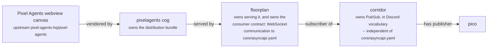
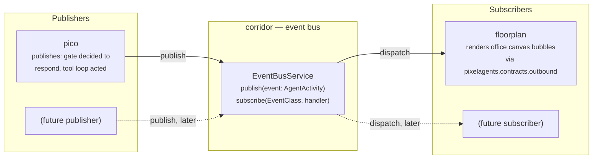
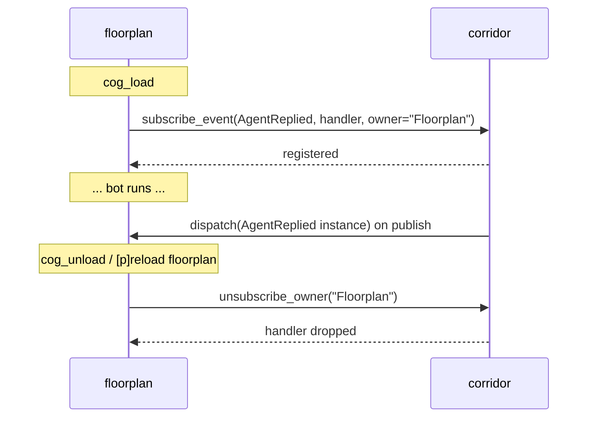
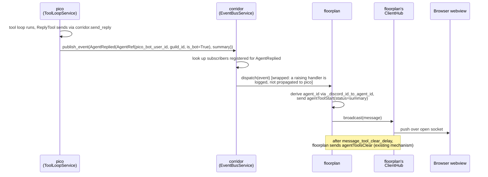

# Corridor event bus (PubSub): design

> **Status: design only.** Nothing in this doc is implemented yet — no
> `EventBusService`, no `publish`/`subscribe` methods on corridor, no
> pico or floorplan wiring. This doc exists to settle the shape and the
> open questions *before* writing that code, per
> [`docs/architecture.md`](architecture.md)'s pattern of thinking through
> the cross-cog picture on paper first. Implementation lands in a
> follow-up PR stacked on top of this one.

## Motivation

Today, the only cog that turns "something happened" into "something
visible on the office canvas" is floorplan, and the only producer it
knows about is Discord's own gateway: `floorplan/adapters/discord_gateway.py`
listens to presence/activity/message events directly and projects them
into `ServerMessage`s itself (see
[`docs/architecture.md` §3a](architecture.md#3a-presence-mirroring-no-corridor-involvement)).
That works because there has only ever been one producer.

pico is about to become a second one. pico's tool-calling loop
(`docs/architecture.md` §4) already does something worth visualizing —
it decides to respond, then acts. Wiring that straight into floorplan
would mean either:

- floorplan grows pico-specific code (`if message came from pico, do X`),
  which breaks the exact boundary [issue #21](https://github.com/pixel-agents-hq/pixel-agents-cogs/issues/21)
  drew: floorplan owns *everything that consumes*, generically — not
  one integration per producer; or
- pico depends on floorplan directly (`required_cogs: floorplan`), which
  breaks the property [`docs/architecture.md` diagram 1](architecture.md#1-runtime-dependency-graph)
  documents today: **nothing in this repo depends on floorplan**. Adding
  that edge would make floorplan load-bearing for pico, when today it's a
  leaf.

corridor already exists to decouple "a cog needs something cross-cutting"
from "which specific cog provides it" — that's exactly what it does today
for permissions (`require_permission`/`capabilities_satisfy`) and reply
rendering (`send_reply`/`render_reply`), per
[`docs/architecture.md` §2](architecture.md#2-ownership-map-who-does-what).
A pub/sub event bus is the same shape of problem: a producer that
shouldn't need to know who (if anyone) is listening, and a consumer that
shouldn't need to know who (if anyone) produces. corridor is the natural
place for a third chokepoint like this, not a new fourth shared cog.

## Roles across the stack, and what's implemented today

| Package | Role |
|---|---|
| **pixelagents** | Owns the Pixel Agents webview **distribution bundle** — clones `pixel-agents-hq/pixel-agents` at a pinned commit and builds it into `webview_dist/`. Never talks to a browser or a Discord gateway itself. |
| **floorplan** | Owns **serving** that bundle (the Red Dashboard route) *and* owns **the communication to it** — the entire WebSocket protocol implementation against pixel-agents' real wire contract, `core/asyncapi.yaml` (vendored transitively via pixelagents). floorplan is the only package in this repo that speaks that protocol, in either direction. |
| **contracts** | CI-only. Runs consumer-driven contract tests against **pixelagents'** real build pipeline (`contracts/pixel_agents/verify.py`) and **floorplan's** real Pixel Index integration (`contracts/pixel_index/verify.py`) — both against live/pinned upstream targets. Separately runs a static lint (`contracts/discord_replies/lint_reply_channel.py`) that AST-scans every cog's command handlers, corridor included, checking they route replies through corridor rather than a raw `ctx.send`. That lint is a boundary check on how cogs *use* corridor's existing reply chokepoint — it is not a consumer-driven contract *against* a live corridor the way the pixelagents/pixel_index checks are, and no `contracts/corridor/` package exists today (verified: `contracts/` has exactly three subpackages — `discord_replies/`, `pixel_agents/`, `pixel_index/`). A consumer-driven contract for corridor's own `EventBusService`, once it exists, would be a natural fourth. |
| **corridor** | Three responsibilities, only two shipped today: |

1. **Reply rendering** (`send_reply`/`render_reply`) — **implemented**.
   `corridor/application/reply_service.py`'s `ReplyService`, wired through
   `corridor/adapters/cog_base.py`.
2. **Permission tiers** (`require_permission`/`capabilities_satisfy`) —
   **implemented**. `corridor/application/permission_service.py`'s
   `PermissionService`, wired the same way.
3. **PubSub, in Discord vocabulary** — **not implemented**. This entire
   doc. Verified empty: `grep -rl` across `corridor/`, `pico/`,
   `floorplan/`, `pixelagents/`, `toolbox/` for `EventBus`,
   `publish_event`, `subscribe_event`, `AgentRef`, `AgentReplied`,
   `AgentActivity` returns nothing — every name in the "Domain model"
   section above is still just this design, not a single line of it exists
   on `develop`.

### corridor's PubSub is independent of pixel-agents' WebSocket protocol — deliberately

This is the single most important framing decision in this doc, and it's
easy to get wrong by analogy to floorplan's existing WebSocket work:

- corridor's bus does **not** own, wrap, or proxy pixel-agents' WebSocket
  protocol (`core/asyncapi.yaml`). That protocol has exactly one owner in
  this repo — floorplan — unchanged by anything in this doc.
- corridor's bus is its **own, independent, in-process** communication
  channel, speaking **Discord vocabulary** (`AgentRef`, `AgentReplied`,
  `AgentStatusChanged`, ...) — never webview wire vocabulary
  (`agentToolStart`, `ServerMessage`, `isExternal`, ...). See "Deliberately
  not included" in the Domain model section above.
- Because of that split, **corridor's `EventBusService` can be designed,
  built, tested, and merged completely independently of floorplan or
  pixelagents** — it needs nothing from either package, and neither needs
  anything from it until a subscriber (floorplan) chooses to wire one up.
  `PermissionService`/`ReplyService` are proof this pattern already works
  in this exact codebase: both shipped and are used by every cog without
  either service knowing anything about WebSockets, Red Dashboard, or the
  webview. The bus is the same shape of addition — no new coupling to
  floorplan's stack, just a new capability on corridor.
- floorplan is still the one piece that bridges both channels — the only
  package that both subscribes to corridor's bus *and* speaks the wire
  protocol, so it (and only it) does the translation between the two.



Two channels, one bridge: the left half of this chain (`Canvas` through
`floorplan`) is the existing, shipped webview-serving path — floorplan
speaks pixel-agents' wire protocol there. The right half (`corridor`
through `pico`) is this doc's entirely new, unshipped path — corridor
speaks nothing but its own Discord-vocabulary dataclasses there. floorplan
is the only node that appears in both halves, because it's the only
package with a reason to.

### Implementation status, verified line by line

| Piece | Status | Evidence |
|---|---|---|
| Reply rendering | ✅ Implemented | `corridor/application/reply_service.py`, `corridor/adapters/cog_base.py::send_reply`/`render_reply` |
| Permission tiers | ✅ Implemented | `corridor/application/permission_service.py`, `corridor/adapters/cog_base.py::require_permission`/`capabilities_satisfy` |
| Webview bundle vendoring + build | ✅ Implemented | `pixelagents/infrastructure/webview_build.py` |
| Webview serving + WebSocket protocol | ✅ Implemented | `floorplan/infrastructure/websocket.py`, `floorplan/contracts/websocket.py` |
| Consumer-driven contract tests (pixelagents, pixel_index) | ✅ Implemented | `contracts/pixel_agents/verify.py`, `contracts/pixel_index/verify.py` |
| Reply-channel static lint (all cogs, corridor included) | ✅ Implemented | `contracts/discord_replies/lint_reply_channel.py` |
| corridor `EventBusService` (`publish`/`subscribe`) | ❌ Not implemented | no matches anywhere in the repo |
| corridor domain types (`AgentRef`, `AgentReplied`, ...) | ❌ Not implemented | no matches anywhere in the repo |
| pico publishing to the bus | ❌ Not implemented | no `publish_event` call sites |
| floorplan subscribing to the bus | ❌ Not implemented | no `subscribe_event` call sites |
| Consumer-driven contract test for corridor's bus | ❌ Not implemented | no `contracts/corridor/` package exists |

## Goals

- A publishing cog can emit a typed event without knowing whether anything
  is subscribed.
- A subscribing cog can register interest in an event type without
  knowing whether anything publishes it (yet, or ever).
- corridor stays the only new edge either side gains. **No direct
  `pico -> floorplan` dependency is ever introduced** — the dependency
  graph in `docs/architecture.md` diagram 1 does not change shape, only
  corridor's own responsibilities grow.
- A broken or slow subscriber cannot break or block a publisher. Precedent
  already exists for this in this codebase:
  `floorplan/infrastructure/client_hub.py`'s `ClientHub` isolates
  broadcast failures per socket so one dead connection doesn't stop
  delivery to the others — the bus needs the same isolation, per
  subscriber instead of per socket.

## Non-goals (for this doc, and for the first implementation)

- **No implementation in this PR.** Corridor's actual `EventBusService`,
  floorplan's subscription, and pico's `publish` call are all follow-up
  work.
- **No cross-process or persistent bus.** In-process, single event loop,
  scoped to one running bot — the same scope every other corridor service
  already has. Nothing here needs to survive a restart.
- **No free-form event shape.** A closed set of frozen dataclasses, one
  per kind of agent activity — mirroring how `ReplyField`/`PermissionGroupDef`
  are explicit domain types today, never a stringly-typed `type` tag plus
  an untyped payload dict. See "Domain model" below.
- **No guaranteed delivery, ordering, or replay.** If nothing is
  subscribed when an event publishes, it's simply dropped — the same as
  floorplan's WebSocket broadcast today drops messages when no client is
  connected.

## High-level architecture



pico is the reference publisher and floorplan the reference subscriber
for this design, because both already exist and both already have a
reason to use the bus today. Nothing about the bus itself is pico- or
floorplan-specific — `toolbox` or a future cog could publish or subscribe
the same way, which is why the diagram leaves a "future" slot on each
side.

## Where this fits in corridor's existing layering

Every cog in this repo follows the same `domain/` / `application/` /
`infrastructure/` / `adapters/` split
([`docs/AGENTS.md` "Internal layering"](AGENTS.md#internal-layering)).
The bus slots into corridor's existing layers the same way
`PermissionService`/`ReplyService` already do — no new layer, no new
cross-cutting concern:


`CogBase.__init__` would wire one `EventBusService` instance the same way
it already wires `PermissionService`/`ReplyService` today
(`corridor/adapters/cog_base.py`) — one bus per bot process, not per
guild, with guild scoping carried on each event's `AgentRef` (see below).

## Domain model: a closed set of agent-activity dataclasses

Settled direction (superseding an earlier draft of this doc that used a
generic `Event(type: str, payload: Mapping)` envelope — rejected because
it's stringly-typed, mypy-blind, and says nothing about *agents*, which is
the whole point of this bus): every publishable event is its own frozen
dataclass, all sharing one `AgentRef`. No generic envelope, no string
tag, no untyped payload.

### Verified against the real wire protocol first

Before settling field names, every dataclass below was checked against
`core/asyncapi.yaml` in `pixel-agents-hq/pixel-agents` **at the exact
commit this repo currently pins**
(`3537e140c2094761beae748592aeb92ece8edfdd`, from
`pixelagents/infrastructure/webview_vendor.commit` — fetched directly from
that commit, not assumed from a newer or older checkout lying around
locally). The `asyncapi.yaml` channel is explicitly documented as
bidirectional: `ServerMessage` (36 variants, server → client — this is the
half a bus event ultimately has to become, since floorplan only ever
*broadcasts* to browsers, never receives bus-originated data back from
one) and `ClientMessage` (22 variants, browser → server, editor-gated).
Every field below is taken from the real, currently-pinned `ServerMessage`
schema, not invented:

- **`agentToolStart`** requires `id`, `toolId`, **and `status`** — a
  required, human-readable label. `toolName` is *optional*, not required
  — an earlier draft of this doc had that backwards.
- **`agentToolDone`** (`id`, `toolId`) and **`agentToolsClear`** (`id`
  only — clears *all* foreground tools for that agent) are both real, and
  distinct. floorplan's own existing Discord-message handling
  (`floorplan/adapters/discord_gateway.py::_clear_tool_after_delay`)
  already uses `agentToolsClear` after `message_tool_clear_delay`, **not**
  `agentToolDone` — a second correction to an earlier draft, which claimed
  `agentToolStart → agentToolDone` for this exact path.
- **`agentStatus`**'s `status` field is `AgentActivityStatus`, a real
  two-value enum: `active` / `waiting` — matches this doc's
  `Literal["active", "waiting"]` exactly. It also carries an optional
  `awaitingInput: bool`, documented upstream as "only meaningful when
  status is waiting... True when the agent went idle waiting on the user."
  That's a CLI-coding-agent concept (blocked mid-task on a human) with no
  clean pico analogue today — included below for shape-fidelity, expected
  to stay unset until/unless something in pico actually blocks like that.
- **`agentContextUsage`** (`contextTokens`, `maxContextTokens`) is real
  and verified, and maps unusually well onto pico: pico already has a
  bounded conversation window (`HISTORY_LIMIT = 10` in
  `pico/adapters/listener.py`) and a bounded tool-call budget
  (`max_tool_calls`, `docs/architecture.md` §4). **Not** added to the
  closed set below yet — flagged as the strongest verified candidate for
  the next one, once there's an actual token-accounting story in pico to
  back it.
- **`existingAgents.externalAgents`** and **`agentCreated.isExternal`**
  are both real, and already exercised: `pixelagents/tests/test_contracts_outbound.py`
  asserts `agent_created(..., is_external=True)` today for exactly this
  kind of agent. Every Discord-derived agent (human or bot) is already
  "external" in the wire protocol's sense — this is a **constant of where
  the agent came from, not new per-event data any dataclass below needs
  to carry**.
- **Headless agents are real upstream, but their only effect is
  architecturally inert for us.** `isHeadlessAgent` in the vendored
  webview (`webview-ui/src/hooks/useExtensionMessages.ts`) is
  `isExternal === true && !isBrowserRuntime` — and `isBrowserRuntime`
  (`webview-ui/src/runtime.ts`) is `true` whenever `acquireVsCodeApi` is
  undefined, which is unconditionally the case for the plain browser page
  floorplan serves through Red Dashboard (it's never the VS Code
  extension host). Upstream's own comment confirms this is deliberate:
  *"Standalone is exempt: that adapter has no terminals at all, so every
  agent would qualify and the cue would distinguish nothing."* That's
  exactly our situation — every Discord-derived agent already qualifies.
  Concretely: `isExternal=True` is already correct and already sent, but
  the translucent "ghost" rendering it would otherwise trigger, and the
  `setGhostHeadlessAgents` client toggle that controls it, never engage on
  our deployment — and floorplan doesn't implement that client message
  today either (absent from `floorplan/contracts/websocket.py`'s
  `_MESSAGE_MODELS`). Nothing to add here; noted so nobody goes looking
  for a missing "headless" field later.
- **`agentTeamInfo` is real but excluded**, per direction on this design:
  its fields (`teamName`, `isTeamLead`, `leadAgentId`, `teamUsesTmux`)
  describe CLI-agent-team concepts — a lead agent with teammates sharing a
  tmux session — with no Discord analogue. **`agentSelected`** is real too
  but explicitly documented upstream as "VS Code only" (focusing a
  terminal) — same story as headless: doesn't apply where there's no
  terminal to focus. Neither gets a dataclass.

### The dataclasses

```python
@dataclass(frozen=True, slots=True)
class AgentRef:
    """A Discord member represented as a webview agent. Deliberately holds
    the *raw* Discord user ID, not floorplan's derived, JS-safe negative
    agent ID -- that derivation (`_discord_id_to_agent_id`) stays
    floorplan's own concern, the only place that currently needs it."""

    discord_user_id: int
    guild_id: int
    is_bot: bool  # ties into floorplan's existing per-guild `include_bots` setting


@dataclass(frozen=True, slots=True)
class AgentReplied:
    """Named for corridor's own verb (`send_reply`), not a generic
    "spoke" -- this fires exactly when a publisher sends a reply through
    corridor, nothing broader."""

    agent: AgentRef
    summary: str  # -> agentToolStart's required `status` label, floorplan's own wording/truncation


@dataclass(frozen=True, slots=True)
class AgentToolStarted:
    agent: AgentRef
    tool_id: str
    status: str            # required on the wire -- human-readable label
    tool_name: str | None = None   # optional on the wire


@dataclass(frozen=True, slots=True)
class AgentStatusChanged:
    agent: AgentRef
    status: Literal["active", "waiting"]   # matches AgentActivityStatus exactly
    awaiting_input: bool | None = None     # matches AgentStatus.awaitingInput; see note above


AgentActivity = AgentReplied | AgentToolStarted | AgentStatusChanged
```

`is_bot` exists because both kinds of Discord member are meant to become
agents, not just bots: floorplan's own presence mirroring already treats
every guild member as an agent today, human or bot, gated only by its
per-guild `include_bots` setting. For pico specifically, `AgentRef` names
*pico's own Discord bot user* — pico is publishing "I, this bot account,
did something," the same way floorplan's existing presence path already
turns a human member's message into an `agentToolStart` bubble for that
human. A future publisher representing a human-triggered activity (not
just a bot's own) would set `is_bot=False` and reference that human's
Discord user ID instead — the dataclasses don't change, only which member
`AgentRef` points at. Every one of these events also assumes the
underlying agent already exists on the canvas (an `agentCreated` for that
`AgentRef`'s derived ID) — for pico that's already true today, since
pico's own bot account gets mirrored the same as any guild member via
floorplan's existing presence path (subject to `include_bots`); this bus
only ever adds activity on top of an agent, it never creates one itself.

`EventBusService.subscribe` dispatches by concrete class
(`subscribe(AgentReplied, handler, owner="Floorplan")`), not by a string
key — a subscriber only ever registers for classes it actually knows how
to handle, and mypy can check that a handler's signature matches the
class it's registered against.

**Deliberately not included:** any of `pixelagents.contracts.outbound`'s
wire-shaped fields (no `id` in the derived agent-ID namespace, no raw
message construction). Translating an `AgentActivity` into the exact
canvas message stays entirely floorplan's job, the same way it alone owns
translating a Discord presence update into one today — this bus only ever
crosses the "something happened to this Discord member" boundary, never
the "here's the exact webview message" one. See
[floorplan's presence-mapping table](../floorplan/Architecture.md#presence-mapping)
for the shape of translation floorplan already does for raw Discord
signals; a subscriber handler for `AgentReplied`/`AgentToolStarted` would
do the equivalent for bus-originated ones.

Candidate first mapping, now against verified fields (illustrative —
settled for real in the implementation PR against pico's actual
`GateDecision`/`ToolLoopResult` shapes):

| Dataclass | Published by | Verified wire translation |
|---|---|---|
| `AgentReplied` | pico, after `ToolLoopService.run` finishes via a successful `send_reply` tool call | `agentToolStart` (`status=summary`) then, reusing floorplan's own existing `message_tool_clear_delay` mechanism, `agentToolsClear` — **not** `agentToolDone` |
| `AgentStatusChanged` | pico, after `GateService.decide` returns `RESPOND` / after the tool loop finishes | `agentStatus` (`status` ∈ `active`/`waiting`; `awaiting_input` expected unset) |
| `AgentToolStarted` | reserved for when pico grows tools beyond `send_reply` (`docs/architecture.md` §4 notes the tool-loop shape already supports more) | `agentToolStart` with a real `toolName` other than the reply tool |

Open question this raises for the implementation PR, now sharper thanks to
the verification above: `AgentReplied` has a settled clear mechanism
(reuse `message_tool_clear_delay` → `agentToolsClear`, matching what
floorplan already does for a Discord message). The generic
`AgentToolStarted`, reserved for a future, possibly-longer-running pico
tool, does **not** have one — a fixed delay is a bad fit for a tool whose
duration isn't known in advance. Worth deciding whether it needs its own
`AgentToolFinished`/`AgentToolCleared` dataclass to correlate against
`tool_id` explicitly, rather than borrowing `AgentReplied`'s timer-based
approach.

## Subscription lifecycle

Precedent already exists in this exact file for the *opposite* direction:
`corridor/adapters/cog_base.py`'s `register_dependent`/`unregister_dependent`
lets corridor cascade-unload a cog that depends on corridor, so a
dependent never keeps running against a corridor that's gone away. A
subscription has the reverse failure mode — corridor must not keep a
stale handler closure bound to a subscriber's now-unloaded Cog instance —
so the cleanup direction is reversed too: **the subscriber unsubscribes
itself**, from its own `cog_unload`, rather than corridor tracking and
cascading it.



Open question for the implementation PR: whether corridor should also
defensively drop an owner's subscriptions if that owner's Cog disappears
from `bot.cogs` without ever calling `unsubscribe_owner` (a crash during
`cog_unload`, say) — `register_dependent`'s cascade exists precisely
because corridor doesn't trust every dependent to clean up after itself
perfectly. The same distrust probably applies here.

## End-to-end example: pico publishes, floorplan renders it

This is the flow the whole design exists to support — closing the loop
between [`docs/architecture.md` §4](architecture.md#4-runtime-data-flow-picos-gate-then-tool-loop)
(pico's tool loop) and
[§3a](architecture.md#3a-presence-mirroring-no-corridor-involvement)
(floorplan's canvas broadcast), with corridor mediating instead of either
cog knowing about the other:



pico never imports anything from floorplan, and floorplan never imports
anything from pico — both only ever talk to corridor. This is the same
shape `docs/architecture.md` §1 already documents for `required_cogs`:
corridor is the one edge every other cog gets, never each other.

## Delivery semantics — open questions for the implementation PR

- **Sync, awaited dispatch, with per-subscriber error isolation.**
  Recommended default: `publish` awaits each subscriber's handler in turn
  inside a `try`/`except`, logs and continues on failure — mirroring
  `ClientHub`'s per-socket isolation. A subscriber that raises must never
  break the publisher's own turn (pico's tool loop shouldn't fail because
  floorplan's rendering threw). Whether dispatch should instead be
  fire-and-forget (`asyncio.create_task` per handler) is worth revisiting
  once there's a second subscriber and real latency data — starting
  synchronous keeps the first implementation's failure modes easy to
  reason about.
- **Guild scoping.** Every event's `AgentRef` carries `guild_id`. Whether corridor
  itself filters dispatch (e.g. skip a subscriber if the guild has that
  cog disabled) or whether that stays each subscriber's own
  responsibility (floorplan already gates on its own per-guild `enabled`
  config today) is an open question — leaning towards the latter, so
  corridor doesn't need to know every subscriber's own guild-enablement
  model.
- **Ordering and backpressure.** Explicitly out of scope — event volume
  here is bounded by Discord message/interaction rates on a single guild,
  nowhere near where ordering or backpressure would matter. Revisit only
  if that assumption stops holding.
- **Testing.** Every cog's test suite already installs corridor's shared
  `redbot.core`/`discord` stubs via `corridor.testing.install_stubs()`
  (see `corridor/testing.py`, imported by `pico/conftest.py`,
  `floorplan/tests/conftest.py`, etc.). A subscriber cog's unit tests need
  a way to assert "my handler got called with X" without a real corridor
  instance — likely a small in-memory bus test double alongside the
  existing stub set, following that same established convention rather
  than inventing a new one.

## What the follow-up implementation PR needs to land

- [ ] `corridor/domain/models.py`: `AgentRef` and the closed
      `AgentReplied`/`AgentToolStarted`/`AgentStatusChanged`/... dataclass
      set (settle whether the generic `AgentToolStarted` needs a paired
      `AgentToolFinished`/`AgentToolCleared` — `AgentReplied` already has
      a settled answer: reuse floorplan's existing
      `message_tool_clear_delay` → `agentToolsClear` convention).
- [ ] `corridor/application/event_bus_service.py`: `EventBusService`
      (`publish`, `subscribe` keyed by concrete class, `unsubscribe_owner`),
      unit-tested in isolation the way `PermissionService`/`ReplyService`
      are today.
- [ ] `corridor/adapters/cog_base.py`: `publish_event`/`subscribe_event`
      chokepoint methods, wired the same way `send_reply`/
      `require_permission` are.
- [ ] pico: publish `AgentReplied`/`AgentStatusChanged` (and any other
      settled dataclasses) from the tool loop's completion path, with
      `AgentRef` pointing at pico's own bot user.
- [ ] floorplan: subscribe at `cog_load`, unsubscribe at `cog_unload`,
      derive the canvas agent ID via its existing
      `_discord_id_to_agent_id` and translate each `AgentActivity` into
      the existing `pixelagents.contracts.outbound` message builders,
      broadcasting via the existing `ClientHub`.
- [ ] Update [`docs/architecture.md`](architecture.md) once this lands —
      the dependency graph in §1 doesn't change, but §2's ownership map
      and a new data-flow diagram closing the pico → corridor → floorplan
      loop should replace this doc's sequence diagrams with the real,
      shipped shape.
