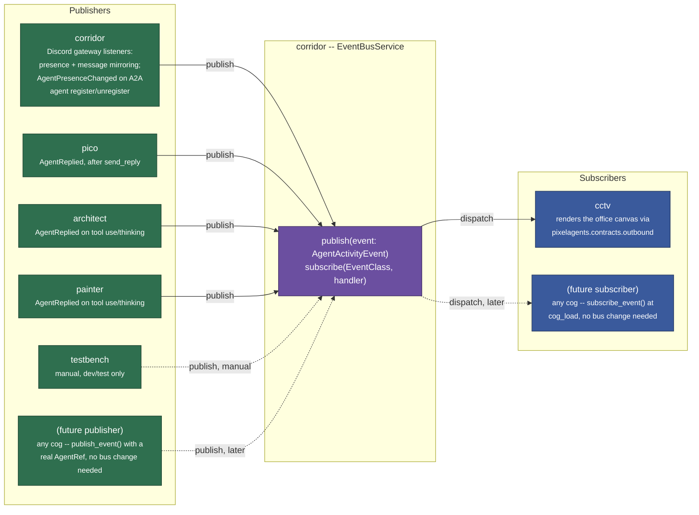
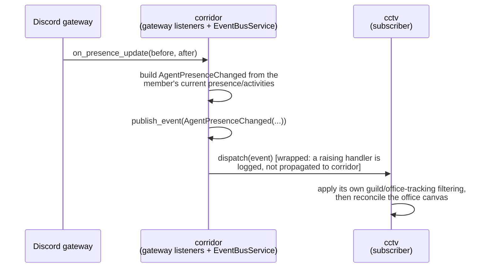
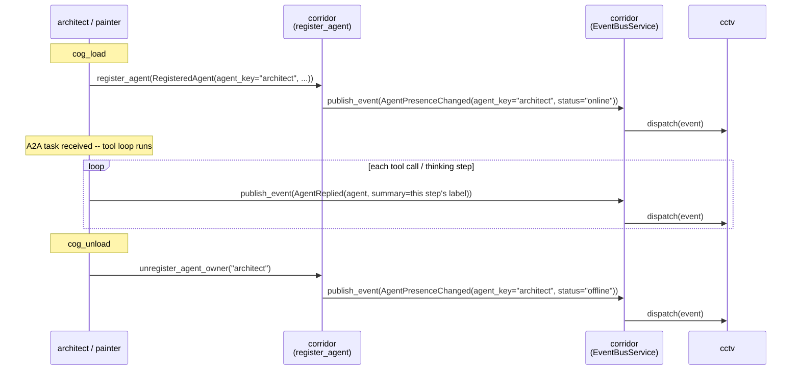
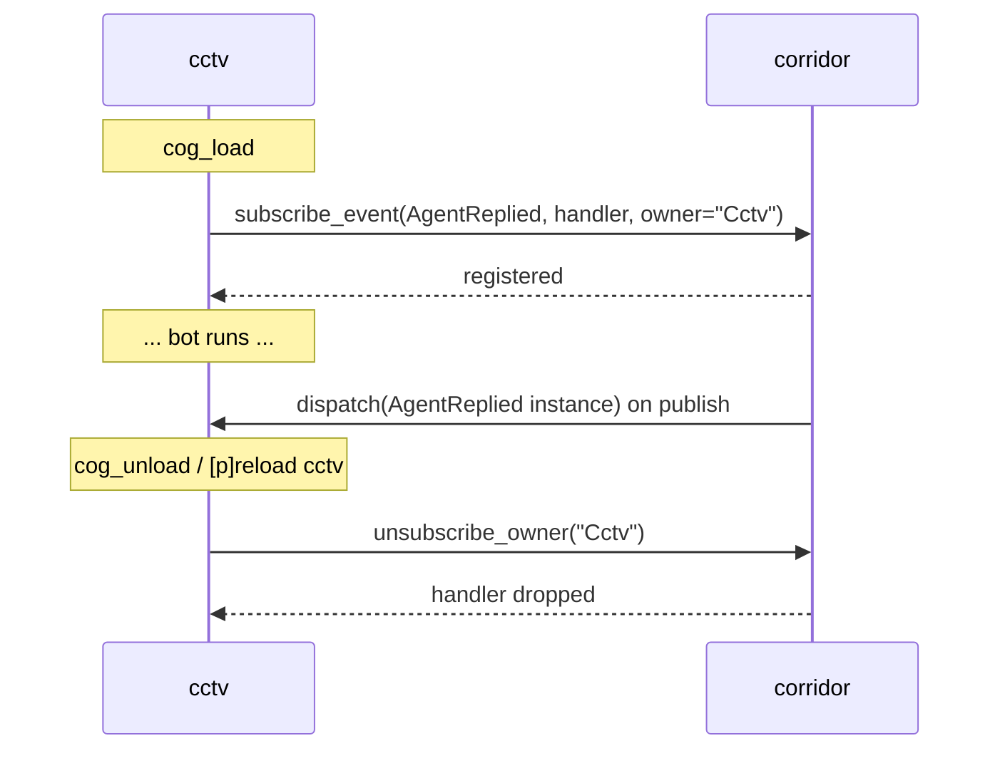
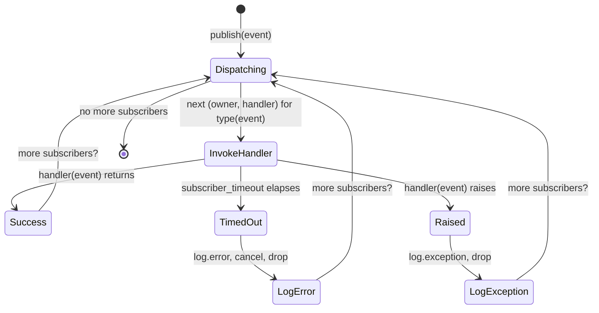

# Corridor event bus (Pub/Sub) design

## Overview

Corridor centralizes a pub/sub event bus the same way it centralizes
permissions and reply rendering: a producer that shouldn't need to know
who (if anyone) is listening, and a consumer that shouldn't need to know
who (if anyone) produces. `corridor.publish_event(event)` /
`corridor.subscribe_event(event_type, handler, owner=...)` /
`corridor.unsubscribe_owner(owner)` dispatch a closed set of `Agent*`
dataclasses by concrete type, synchronously, with per-subscriber
exception isolation.

Corridor is both the bus's host and one of its publishers: it watches
Discord's gateway on every other cog's behalf (member/presence updates,
joins, removals, message mirroring) and publishes `AgentPresenceChanged`
whenever an A2A agent registers or unregisters. `pico`, `architect`, and
`painter` publish their own activity. `cctv` is the current sole
subscriber, rendering the shared office canvas from whatever the bus
delivers.

## Architecture



`EventBusService` lives inside corridor
(`corridor/application/event_bus_service.py`) — "corridor publishes"
means two distinct things that share one word: the bus **is** corridor's,
and corridor (the cog) is also **a** publisher onto its own bus, the same
way it's already the chokepoint for reply rendering and permissions.
Every other cog only ever calls `corridor.publish_event(...)`/
`corridor.subscribe_event(...)`, whether corridor itself, pico, architect,
or painter is the one constructing the event.

Both the publisher set and the subscriber set are **dynamic, not
hardcoded lists.** Any cog can publish by calling `corridor.publish_event(event)`
with a real `AgentRef` for whatever it represents — corridor, pico,
architect, painter, and testbench are just the publishers that exist
today. Publishing requires no registration/lifecycle call at all (unlike
subscribing): there's nothing to add or remove on cog load/unload, since a
publisher that stops running simply stops calling `publish_event`. Any cog
can subscribe by calling `corridor.subscribe_event(event_type, handler,
owner=...)` from its own `cog_load`; `cctv` is the only subscriber that
exists today, not the only one the design allows for.

## Domain model: a closed set of agent-activity dataclasses

Every publishable event is its own frozen dataclass, all sharing one
`AgentRef`. No generic envelope, no string tag, no untyped payload —
`corridor/domain/models.py` is the schema source of truth every publisher
and subscriber codes against.

```python
@dataclass(frozen=True, slots=True)
class AgentRef:
    """A Discord member, or a genuine (non-Discord) agent like architect or
    painter, represented as a webview agent. discord_user_id/guild_id are
    None for an agent with no real Discord account or guild scope.
    Deliberately Optional rather than a sentinel (0/-1): a sentinel would
    type-lie (claim to be a real Discord snowflake) and risks colliding
    with an actual ID; None states the domain honestly. agent_key is a
    stable slug ("architect", "painter") identifying a genuine agent --
    required exactly when discord_user_id/guild_id are both None."""

    discord_user_id: int | None
    guild_id: int | None
    is_bot: bool
    agent_key: str | None = None


@dataclass(frozen=True, slots=True)
class AgentReplied:
    """Named for corridor's own verb (send_reply), but broader than "a
    reply got sent": also covers an agent's tool-use or "thinking" step
    (architect, painter). summary is always the full, untruncated text --
    wire truncation/wording is the subscriber's job, never the
    publisher's."""

    agent: AgentRef
    summary: str


@dataclass(frozen=True, slots=True)
class AgentToolStarted:
    agent: AgentRef
    tool_id: str
    status: str            # required on the wire -- human-readable label
    tool_name: str | None = None   # optional on the wire


@dataclass(frozen=True, slots=True)
class AgentStatusChanged:
    agent: AgentRef
    status: Literal["active", "waiting"]   # matches AgentActivityStatus exactly
    awaiting_input: bool | None = None     # matches AgentStatus.awaitingInput


@dataclass(frozen=True, slots=True)
class AgentHighlighted:
    """-> agentSelected(id)."""

    agent: AgentRef


@dataclass(frozen=True, slots=True)
class AgentUnhighlighted:
    """-> agentDeselected(id). No-op unless this agent is still the
    highlighted one -- safe to publish even after a newer AgentHighlighted
    already moved the highlight elsewhere."""

    agent: AgentRef


@dataclass(frozen=True, slots=True)
class AgentActivity:
    """One Discord rich-presence activity, carried inside
    AgentPresenceChanged.activities."""

    kind: str
    name: str | None = None
    title: str | None = None
    artist: str | None = None
    details: str | None = None
    state: str | None = None


@dataclass(frozen=True, slots=True)
class AgentPresenceChanged:
    """Enough to reconstruct a full agent snapshot and drive the
    subscriber's own reconcile() unchanged. One rich event, not four
    granular ones (join/leave/status/activity) -- every one of those needs
    the same full-snapshot reconstruction anyway.

    status="offline" covers a real Discord offline/invisible status, a
    member leaving the guild, AND an agent cog unloading (architect,
    painter) -- there's no separate "member left"/"agent went away"
    event."""

    agent: AgentRef
    display_name: str
    status: Literal["online", "idle", "dnd", "offline"]
    activities: tuple[AgentActivity, ...] = ()


AgentActivityEvent = (
    AgentReplied | AgentToolStarted | AgentStatusChanged | AgentHighlighted | AgentUnhighlighted
    | AgentPresenceChanged
)
```

`AgentActivityEvent` is the closed set of types a cog `publish()`es/
`subscribe()`s to; `AgentActivity` is a value object carried *inside* one
specific member of that set (`AgentPresenceChanged.activities`) — the two
never overlap, and neither is published/subscribed to on its own.
`EventBusService.subscribe` dispatches by concrete class
(`subscribe(AgentReplied, handler, owner="Cctv")`), not by a string key —
a subscriber only ever registers for classes it actually knows how to
handle, and mypy can check that a handler's signature matches the class
it's registered against.

Deliberately not included: any of `pixelagents.contracts.outbound`'s
wire-shaped fields (no derived agent-ID, no raw message construction).
Translating an `AgentActivityEvent` into the exact canvas message stays
entirely the subscriber's job — this bus only ever crosses the "something
happened to this agent" boundary, never the "here's the exact webview
message" one.

## Domain model / schema

| Dataclass | Fields | Published by | Wire translation (subscriber's job) |
|---|---|---|---|
| `AgentRef` | `discord_user_id`, `guild_id`, `is_bot`, `agent_key` | *(value object — carried by every event below)* | identifies the agent a snapshot belongs to |
| `AgentActivity` | `kind`, `name`, `title`, `artist`, `details`, `state` | *(value object — carried inside `AgentPresenceChanged.activities`)* | one Discord rich-presence entry |
| `AgentReplied` | `agent`, `summary` | corridor (message mirroring), pico (`ReplyTool`), architect and painter (tool use/thinking) | `agentToolStart` then `agentSelected`, later `agentToolsClear` |
| `AgentPresenceChanged` | `agent`, `display_name`, `status`, `activities` | corridor (gateway listeners; `register_agent`/`unregister_agent_owner`/`unregister_agent`) | spawns/closes/renames the agent, forwards each activity |
| `AgentStatusChanged` | `agent`, `status`, `awaiting_input` | manual only (testbench) | `agentStatus` |
| `AgentToolStarted` | `agent`, `tool_id`, `status`, `tool_name` | manual only (testbench) | `agentToolStart` |
| `AgentHighlighted` | `agent` | manual only (testbench) | `agentSelected(id)` |
| `AgentUnhighlighted` | `agent` | manual only (testbench) | `agentDeselected(id)` |

## Key flows

### Publish and dispatch (corridor's own gateway listeners)



Corridor's listeners publish unconditionally, for every guild and every
member — no guild-enabled/include-bots/office-tracking gating. That
filtering is entirely the subscriber's own concern; corridor is a leaf
package (empty `required_cogs`) and never depends on a subscriber cog to
decide what counts as "something happened."

### Agent registration doubling as presence



A registered A2A agent's directory membership and its presence-broadcast
lifecycle are the same event, not two separate things a cog must
remember to keep in sync: `corridor.register_agent`/
`unregister_agent_owner`/`unregister_agent` publish `AgentPresenceChanged`
as a side effect, so `architect` and `painter` never hand-roll a presence
publisher of their own. `AgentRef.agent_key` carries the registered
`agent_key`, `discord_user_id`/`guild_id` stay `None`, `is_bot=True`, and
`display_name` comes from the registered `AgentCard.name`.

Each publisher's own activity reporting:

- **pico** — `ReplyTool._publish_agent_replied` publishes `AgentReplied`
  right after a successful `corridor.send_reply`, with `AgentRef` pointing
  at pico's own bot account (real `discord_user_id`, guild-scoped,
  `is_bot=True`). Pico is the Discord-user-facing bot — publishing its own
  replies directly is correct, rather than corridor inferring them from
  `on_message`.
- **architect** — a fixed `ARCHITECT_AGENT_REF` module-level constant in
  `architect/adapters/cog_base.py`, reused for every event it publishes.
  `ToolLoopService.run()` takes an optional `on_activity` callback,
  awaited once per tool call (`"using tool <name>"`) and once per thinking
  turn (`"thinking: <content>"`); `_publish_activity` wraps that into
  `AgentReplied(agent=ARCHITECT_AGENT_REF, summary=...)` through corridor.
- **painter** — the identical shape: a fixed `PAINTER_AGENT_REF` constant
  in `painter/adapters/cog_base.py`, no self-published
  `AgentPresenceChanged` (register/unregister covers it), and its own
  `_publish_activity` publishing `AgentReplied(agent=PAINTER_AGENT_REF,
  summary=...)` per tool call/thinking step from its own tool loop. No
  bus-side code changes to add a new A2A-only publisher this way — the
  same registration hook that gives architect its presence-publishing for
  free gives painter the same thing.
- **testbench** — a dev/test-only Discord UI that lets an operator
  manually construct and publish any event from the closed
  `AgentActivityEvent` set, generated from `corridor/event_catalog.py` —
  useful for exercising subscriber code before a real automated publisher
  exists for `AgentStatusChanged`, `AgentToolStarted`, `AgentHighlighted`,
  and `AgentUnhighlighted`.

### Subscription lifecycle



`cctv` subscribes to all six event types at `cog_load`
(`cctv/adapters/cog_base.py`) and unsubscribes at `cog_unload`,
translating each into its own office-canvas reconcile/activity calls. The
subscriber unsubscribes itself from its own `cog_unload`
(`corridor.unsubscribe_owner(owner)`) — the reverse direction of
`register_dependent`/`unregister_dependent`. Corridor also defensively
drops a subscriber's registrations if its Cog disappears without calling
that itself: `CogBase.on_cog_remove` is a `@commands.Cog.listener()` for
Red's `cog_remove` dispatch, fired unconditionally after every cog
removal (crash-mid-`cog_unload()` or not), calling
`unsubscribe_owner(cog.qualified_name)`.

## API / command reference

| API | Called from | Purpose |
|---|---|---|
| `corridor.publish_event(event)` | any publisher, whenever something happens | Dispatches `event` to every subscriber registered for its concrete type. Never raises. |
| `corridor.subscribe_event(event_type, handler, owner=...)` | subscriber's `cog_load` | Registers `handler` for exactly `event_type`. |
| `corridor.unsubscribe_owner(owner)` | subscriber's `cog_unload` | Drops every handler `owner` registered, across every event type. |
| `corridor.watch_agent_events(subscriptions, owner=...)` | subscriber's `cog_load` | Subscribes to several event types and snapshots `corridor.list_agents()` in one event-loop turn, so a subscriber never races a registration that happened before its own subscribe call. |

## Validation & error handling



Delivery is **synchronous, awaited dispatch, with per-subscriber error
isolation** — `EventBusService.publish` awaits each subscriber's handler
in turn inside a `try`/`except`, logs and continues on failure, mirroring
`ClientHub`'s per-socket isolation. A subscriber that raises never breaks
the publisher's own turn, and one subscriber's failure never prevents
dispatch to the next. Every publish on this bus — `corridor.publish_event`
(the six `AgentActivityEvent` types) and `OfficeStateService`'s own
`OfficeStateChanged` publishes — passes the same
`DEFAULT_SUBSCRIBER_TIMEOUT` (five seconds,
`corridor/application/event_bus_service.py`), so a hung watcher is
cancelled and logged rather than blocking the call that triggered it
(a gateway listener, a tool call, or an office-state mutation) forever.

Guild scoping is deliberately not the bus's job: every event's `AgentRef`
carries `guild_id: int | None`, but `EventBusService` does not filter
dispatch by it — that stays each subscriber's own responsibility. An
event with `guild_id=None` (a genuine agent, e.g. architect or painter)
isn't guild-scoped at all; a subscriber resolves it to its own identity
concept and renders it on the one shared office canvas unconditionally,
rather than checking any guild's settings. Ordering and backpressure are
explicitly out of scope — event volume is bounded by Discord message/
interaction rates and A2A task volume, nowhere near where either would
matter.

## Design rationale

**A closed set of typed dataclasses, not a generic envelope.** A generic
`Event(type: str, payload: dict)` shape would push every subscriber back
into runtime type-checking a string tag and hand-parsing a dict — exactly
the ambiguity a Python type checker exists to catch. `AgentActivityEvent`
being a literal `Union` of six frozen dataclasses lets mypy verify a
`subscribe(AgentReplied, handler)` call's handler signature actually
matches `AgentReplied`, and lets a publisher's constructor call be checked
the same way a Discord command's arguments are.

**Synchronous, awaited dispatch, not fire-and-forget or a task queue.**
Event volume here (Discord gateway events, A2A tool-loop steps) is nowhere
near a scale where ordering or backpressure matter, and every subscriber
today is a fast, in-process render onto a websocket hub. Awaiting each
handler keeps failures visible to the publisher's own call stack (as a
log line, never as a swallowed background-task exception) without adding
queue infrastructure that has no problem to solve yet.

**Per-subscriber exception isolation, not a single try/except around the
whole dispatch loop.** A single wrapping `try/except` would let the first
raising subscriber's exception (if it somehow escaped) or its side effects
block every subscriber registered after it. Isolating each `(owner,
handler)` pair's invocation means a crashing subscriber only ever loses
its own delivery, never someone else's.

**Corridor publishes Discord gateway events itself, rather than each
publisher watching the gateway independently.** Every future publisher
(architect, then painter) would otherwise have to either duplicate
gateway-listener code or depend on whichever cog wrote it first — exactly
the coupling corridor exists to prevent. Corridor becomes the one cog that
watches Discord's gateway on this bus's behalf, the same way it's already
the one cog that owns reply rendering and permission tiers.

**Registration doubling as presence, not a separate publish call per
agent.** Folding `AgentPresenceChanged` into `register_agent`/
`unregister_agent_owner` means every future A2A-registered agent gets
correct presence lifecycle for free, without hand-rolling its own publish
calls at `cog_load`/`cog_unload` the way an agent would otherwise have to
remember to do — and get right on both the join and leave path.

**A dynamic publisher/subscriber set, not a hardcoded list either
direction.** Neither `EventBusService` nor this doc enumerates a closed
set of *cogs* — only a closed set of *event types*. Any cog can publish
with zero registration, and any cog can subscribe with one `cog_load`
call; the bus's job is to make that possible, not to know in advance who
will use it.
