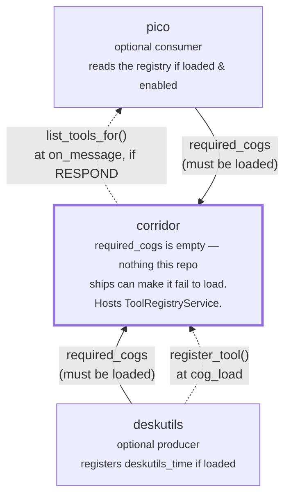

# Corridor cross-cog tool registry: design

> **Status: shipped.** `corridor.application.ToolRegistryService`
> (`register`/`unregister_owner`/`list_tools`) is implemented and wired onto
> `Corridor` as `register_tool`/`unregister_tool_owner`/`list_tools`/
> `list_tools_for`, with the same `on_cog_remove` defensive-cleanup backstop
> the Pub/Sub bus gets. `deskutils` registers its `time` command's logic as
> the first (and, as of this doc, only) tool; `pico` is the first (and only)
> consumer, adapting a registration into its own `ToolSpec` at
> `pico/tools/cross_cog.py`.

## Motivation

`deskutils` ships `[p]deskutils time`, a Discord command a human runs by
hand. `pico` is an LLM-backed cog that can *only* act through a bounded
tool-calling loop (`docs/architecture.md` §4) — it never sends raw text,
only pre-declared tool calls. Making pico able to answer "what time is it?"
in chat means giving its tool loop access to the same time logic the
Discord command uses.

Wiring that directly would mean either `deskutils` depending on `pico`
(wrong: `deskutils` should work standalone, pico is one of potentially many
optional consumers) or `pico` hardcoding a `deskutils`-shaped tool itself
(wrong: `pico`'s tool loop shouldn't need to know every cog that might ever
want to offer it a tool). This is the same problem corridor's PubSub event
bus already solves for "floorplan wants to hear about things pico does, and
vice versa, without either depending on the other" — see
[`docs/corridor-pubsub-design.md`](corridor-pubsub-design.md). A tool
registry is that same shape (register/list, owner-scoped cleanup, silent
no-op with zero consumers), applied to LLM tool-calling instead of Discord
events, so it's implemented as a second corridor-hosted service rather than
a new architectural pattern.

**Does this make corridor a general shared-code library?**
[`docs/corridor.md`](corridor.md#what-this-is-not) is explicit that
corridor isn't one — extracting shared UI/business logic was deliberately
rejected as premature abstraction. The tool registry doesn't cross that
line for the same reason the event bus doesn't: corridor stores and filters
*registrations*, it never contains a tool's actual behavior. `deskutils`'
`handler` closure still lives entirely in `deskutils/adapters/tools.py`,
calling into `deskutils`' own `TimeService` — corridor only ever sees a
name, a description, a JSON-Schema dict, an opaque callable, and a
permission-group key.

## Topology: corridor is the only piece that must be loaded

Every cog in this repo is a genuine Red-DiscordBot plugin — installable,
loadable, and unloadable independently — and this feature is designed so
that stays true. `deskutils` and `pico` each declare `corridor` in
`required_cogs` (the one thing they cannot function without); neither
declares the other, and neither imports so much as a type from the other's
package. The only edge between them is mediated entirely through corridor,
at runtime, through the registry described below:



Solid arrows are the only ones Red actually enforces (`required_cogs` —
corridor refuses to let a dependent load without it, via
`ensure_corridor_loaded`). Dashed arrows are the tool-registry traffic this
doc describes, and they are the *only* place `deskutils` and `pico` come
anywhere near each other — there is deliberately no dashed (or any) edge
drawn directly between them. Remove either dashed arrow's endpoint cog from
the bot entirely and the other endpoint keeps working exactly as it did
before this feature existed; remove corridor and neither `deskutils` nor
`pico` can even load, tool registry or not — that dependency predates this
feature and would exist with zero cogs ever touching `register_tool`.

| Installed | `[p]deskutils time` (Discord command) | pico answers "what time is it?" |
|---|---|---|
| `corridor` only | n/a (deskutils not installed) | n/a (pico not installed) |
| `corridor` + `deskutils` | ✅ works | n/a (pico not installed) |
| `corridor` + `pico` | n/a (deskutils not installed) | pico responds via its native reply tool only — `list_tools_for` returns `()`, exactly as if this feature didn't exist |
| `corridor` + `deskutils` + `pico` | ✅ works | ✅ pico calls `deskutils_time` directly |

## The contract: framework-neutral, not pydantic

`pico`'s own `ToolSpec` Protocol (`pico/tools/base.py`) is pydantic-typed —
`Input`/`Output` are `type[BaseModel]`. That's an internal implementation
detail of how `pico/infrastructure/llm_client.py` talks to an
OpenAI-compatible endpoint, not a repo-wide convention: corridor's domain
layer has zero pydantic (or discord.py) imports by design, matching every
other type in `corridor/domain/models.py`. Requiring every registering cog
to build real pydantic models just to participate would force a new
runtime dependency (`pydantic`) onto cogs like `deskutils` that otherwise
need nothing beyond `redbot`/`corridor` — for a purely *optional*
integration that may never be exercised on a given install.

So `corridor.domain.RegisteredTool` is plain data:

```python
ToolHandler = Callable[[Mapping[str, object]], Awaitable[Mapping[str, object]]]

@dataclass(frozen=True, slots=True)
class RegisteredTool:
    name: str
    description: str
    parameters: Mapping[str, object]   # OpenAI-style JSON Schema
    handler: ToolHandler               # dict in, dict out
    required_group: str | None = None  # corridor permission-group key
```

`parameters` is handed to the LLM byte-for-byte as-is; `handler` takes and
returns a plain JSON-object-shaped `Mapping` — no schema reconstruction, no
type mapping. The one side that *does* need pydantic (`pico`, which already
depends on it) does the bridging itself, entirely inside its own package —
see "The pico-side adapter" below. No other cog, and no future registering
cog, needs to know pydantic exists.

## Lifecycle (mirrors `EventBusService` exactly)

- **Register**: a cog calls `corridor.register_tool(tool, owner="<CogClassName>")`
  from its own `cog_load`, after `register_dependent`. Re-registering the
  same name under the same `owner` overwrites (idempotent across repeat
  `cog_load`s); a name collision from a *different* owner raises — a real
  authoring conflict, not something to silently shadow.
- **Unregister**: the registering cog calls `corridor.unregister_tool_owner("<CogClassName>")`
  from its own `cog_unload` — the reverse direction of
  `register_dependent`/`unregister_dependent` (corridor doesn't
  track/cascade a *registrant's* lifecycle the way it does a *dependent's*).
- **Defensive backstop**: `Corridor.on_cog_remove` (dispatched by Red
  unconditionally after every cog removal, even one whose own `cog_unload`
  raised partway through) also calls `unregister_owner(cog.qualified_name)`,
  so a registration can never leak past its owning cog's actual removal.
- **Owner-string convention**: `register_dependent`/`unregister_dependent`
  use the lowercase *extension* name (`"deskutils"` — what
  `bot.unload_extension` needs); `owner=` here (like `subscribe_event`)
  uses the capitalized *Cog class* name (`"Deskutils"`, matching
  `cog.qualified_name`) so the `on_cog_remove` backstop lines up with a
  registrant's own manual `unregister_tool_owner` call.
- **Scope**: one registry per bot process, not per guild — same as
  `EventBusService`. A tool with guild-specific behavior would encode that
  entirely inside its own `handler`, the same way it always would have as
  a Discord command.

## Permission gating

`RegisteredTool.required_group` reuses corridor's existing permission-group
vocabulary (`PermissionGroupDef.key` / `EMPLOYEE_KEY` / ...) rather than
inventing a parallel one. `Corridor.list_tools_for(member)` — the one call
a consumer needs — filters `list_tools()` through the same
`capabilities_satisfy` a Discord command's `require_permission` call
already uses, so a tool is offered to an LLM call under exactly the tier a
human running the equivalent command would need. `deskutils`' `time` tool
is gated on `EMPLOYEE_KEY` — the same tier the `[p]deskutils time` command
itself now explicitly checks (`corridor.require_permission(ctx, EMPLOYEE_KEY)`),
a single shared source of truth for "who can do this," whether by command
or by tool call.

Filtering happens *before* the LLM ever sees the tool (it's excluded from
`tools=[...]` entirely for a member who doesn't satisfy the gate), not
inside the handler — so an unauthorized user's LLM call never attempts,
and never gets a confusing "permission denied" tool result; the tool
simply isn't part of that turn's vocabulary at all.

## The pico-side adapter

`pico/tools/cross_cog.py`'s `CrossCogTool` wraps one `RegisteredTool` as a
`ToolSpec`, entirely additively — zero changes to `pico/tools/base.py`,
`reply_tool.py`, or `application/tool_loop_service.py`. Its synthetic
`Input` class overrides the `model_json_schema()` classmethod to return the
tool's own `parameters` dict verbatim (instead of pydantic's usual
field-derived schema), and both `Input`/`Output` set
`model_config = ConfigDict(extra="allow")` so any JSON object round-trips
through them unvalidated — argument *validation* stays exactly where it
always was, in the registering cog's own `handler`.

`pico/adapters/listener.py`'s `on_message` builds this turn's tool list
(`_cross_cog_tools`) only after the gate has already decided `RESPOND` —
i.e. only when pico is loaded *and* enabled for the guild *and* the LLM is
configured. If `deskutils` (or any registering cog) isn't installed,
`list_tools_for` simply returns `()` and pico behaves exactly as it does
today. If `pico` isn't installed, `deskutils.cog_load()` still calls
`register_tool` unconditionally — it just sits in corridor's registry,
unread by anyone. Neither side needs to know or check whether the other is
loaded.

## Example: one full turn

```mermaid
sequenceDiagram
    participant U as Discord user
    participant P as pico<br/><small>(if loaded &amp; enabled)</small>
    participant C as corridor<br/><small>(always loaded)</small>
    participant D as deskutils<br/><small>(if loaded)</small>

    Note over D,C: cog_load -- runs whether or not pico is ever installed
    D->>C: register_tool(deskutils_time, owner="Deskutils")

    U->>P: "what time is it?"
    P->>P: GateService.decide() -> RESPOND
    P->>C: list_tools_for(ctx.author)
    alt deskutils loaded and member satisfies "employee"
        C-->>P: (deskutils_time,)
    else deskutils not loaded
        C-->>P: ()
    end
    P->>P: ToolLoopService.run(tools=[ReplyTool, CrossCogTool(...)?])
    opt LLM chooses to call deskutils_time
        P->>D: CrossCogTool.handler(args)
        D->>D: TimeService.now() / resolve_zone()
        D-->>P: {utc_iso, epoch_seconds, discord_markup, ...}
    end
    opt LLM chooses to reply
        P->>C: send_reply(...) via ReplyTool
        C-->>U: rendered reply
    end
```

If `pico` is never installed, nothing right of `deskutils`' own `cog_load`
ever runs — the registration still happened and simply sits unread. If
`deskutils` is never installed, the `alt` above always takes the "not
loaded" branch and pico behaves exactly as it did before this feature
existed, using only its native `ReplyTool`.

Spelled out:

1. `GateService.decide()` → `RESPOND`.
2. `ctx = await bot.get_context(message)` → `ctx.author` is a real
   `discord.Member`.
3. `corridor.list_tools_for(ctx.author)` → `(deskutils_time,)` (`employee`
   never restricts).
4. `ToolLoopService.run(tools=[ReplyTool(...), CrossCogTool(deskutils_time)])`
   → the LLM sees both in its tool list, calls `deskutils_time`.
5. `CrossCogTool.handler` → `deskutils`' own handler → `TimeService.now()`
   → a plain dict (UTC ISO string, epoch seconds, Discord markup) comes
   back to the LLM as the tool result.
6. The LLM decides whether/how to answer, and if so calls `send_reply`
   (pico's only other tool) with a human-readable message.
