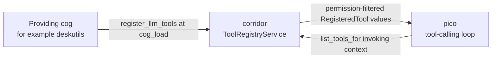
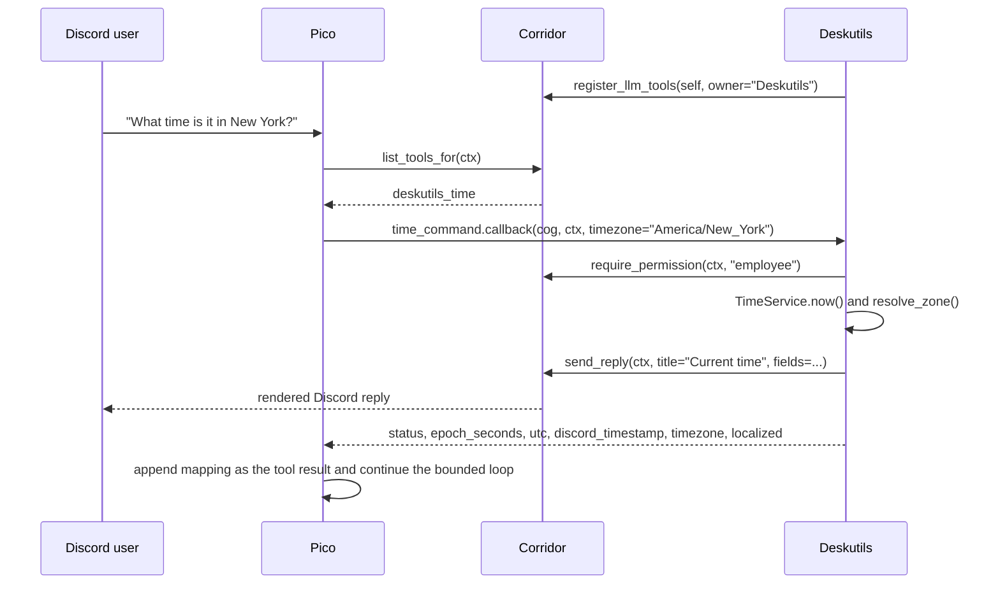

# Corridor cross-cog LLM tool registry

## Overview

Corridor hosts an in-process registry of tools that optional LLM consumers
can discover without depending directly on the cogs that provide them.
Today, Pico is the consumer and `deskutils_time` is a production example,
but neither side imports the other:



Both the provider and consumer depend only on Corridor. If Pico is absent,
registrations remain inert. If a provider is absent, Pico simply receives
fewer tools. The registry is process-scoped, while each invocation still
receives the triggering Discord context and can perform guild-specific
work.

## Registry contract

The shared contract is deliberately framework-neutral. Corridor's domain
layer imports neither discord.py nor pydantic:

```python
ToolHandler = Callable[
    [object, Mapping[str, object]],
    Awaitable[Mapping[str, object]],
]
ToolAvailabilityCheck = Callable[[object], Awaitable[bool]]


@dataclass(frozen=True, slots=True)
class RegisteredTool:
    name: str
    description: str
    parameters: Mapping[str, object]
    handler: ToolHandler
    required_group: str | None = None
    availability_check: ToolAvailabilityCheck | None = None
```

- `name` is globally unique within the bot process.
- `description` and `parameters` are sent to the LLM as the function-tool
  description and input JSON Schema.
- `handler(ctx, arguments)` receives the original Discord context and a
  JSON-object-shaped mapping, then returns a JSON-object-shaped mapping.
- `required_group` uses Corridor's permission-group keys. `None` means the
  registry adds no group gate.
- `availability_check(ctx)` is an optional second gate. Decorated commands
  use it to run their native Red/discord.py checks when no explicit
  `required_group` was supplied.

`Corridor.register_tool(tool, owner=...)` is the low-level API for tools
that are not Discord commands. Most providers should use decorated command
registration instead.

## Turning a Discord command into a tool

Apply `@corridor.domain.llm_tool` directly to the callback, below the
Discord command decorator. All arguments are optional:

```python
@deskutils_group.command(name="count")
@llm_tool()
async def count_command(self, ctx: commands.Context, *, text: str) -> dict[str, object]:
    """Count all characters and whitespace-delimited words in text."""
    ...
```

At registration this becomes `deskutils_count`, uses the cleaned docstring
as its tool description, describes `text` as `value for text`, and uses the
Discord command's own checks for availability. Supply any of the arguments
when richer metadata or an explicit Corridor group is needed:

```python
from typing import Annotated

from corridor.domain import EMPLOYEE_KEY, ToolDescription, llm_tool


@counter_group.command(name="project")
@llm_tool(
    name="counter_project",
    description="Project the count after future increments without changing it.",
    required_group=EMPLOYEE_KEY,
)
async def project(
    self,
    ctx: commands.Context,
    amount: Annotated[
        int,
        ToolDescription(
            "The number of increments to project.",
            minimum=1,
            maximum=10,
        ),
    ],
) -> dict[str, object]:
    if not await self._corridor.require_permission(ctx, EMPLOYEE_KEY):
        return {"status": "error", "error": "permission_denied"}

    # Tool calls invoke this callback directly, so validate raw values even
    # though Discord converts arguments for human command invocations.
    if isinstance(amount, bool) or not isinstance(amount, int) or not 1 <= amount <= 10:
        message = "Amount must be a whole number from 1 through 10."
        await self._corridor.send_reply(ctx, title="Projection", description=message)
        return {"status": "error", "error": "invalid_amount", "message": message}

    snapshot = await self._service.show(ctx.guild.id)
    projected = snapshot.count + amount
    await self._corridor.send_reply(
        ctx,
        title="Projection",
        description=f"Current: {snapshot.count}; after {amount}: {projected}",
    )
    return {
        "status": "ok",
        "current_count": snapshot.count,
        "amount": amount,
        "projected_count": projected,
    }
```

The callback remains one implementation for both invocation paths:

- A human runs the Discord command; discord.py converts the arguments and
  ignores the callback's return value.
- An LLM calls the registered tool; Corridor invokes the same callback
  with the same `ctx`, preserves its Discord side effects, and forwards its
  returned mapping to the LLM.

Decorated callbacks may return a string-keyed `Mapping[str, object]` for an
informational tool result. Returning `None` produces the backward-compatible
`{"status": "ok"}` acknowledgement. Any other return type, or a mapping
with non-string keys, raises `TypeError` as an authoring error.

## Input schema inference

`llm_tool` skips the leading `self` and `ctx` parameters and infers an
object schema from the remaining callback signature.

Supported parameter types are:

| Python annotation | JSON Schema type |
|---|---|
| `str` | `string` |
| `int` | `integer` |
| `float` | `number` |
| `bool` | `boolean` |
| any supported type `| None` | the same schema type |

A parameter without a default is included in `required`; a parameter with
a default is optional. Unsupported annotations fail immediately when the
module is imported and the decorator runs.

Parameters without a `ToolDescription` receive the generic description
`value for <parameter name>`. `ToolDescription` remains the way to replace
that text or add bounds/enums:

Use one `ToolDescription` inside `typing.Annotated` to enrich a property:

```python
amount: Annotated[
    int,
    ToolDescription(
        "How many items to process.",
        minimum=1,
        maximum=20,
        enum=(1, 5, 10, 20),
    ),
]

style: Annotated[
    str,
    ToolDescription(
        "How much detail to include.",
        enum=("compact", "detailed"),
    ),
] = "compact"
```

`ToolDescription` supports:

- required `description` text;
- numeric `minimum` and `maximum` for `int` or `float` parameters;
- a non-empty tuple of primitive `enum` values matching the inferred JSON
  type.

The decorator rejects incompatible bounds, non-finite or reversed bounds,
empty or duplicate enums, enum values of the wrong type, enum values
outside configured bounds, and multiple `ToolDescription` objects on one
parameter. Raw string metadata is not a description shorthand and is
ignored.

### Schema constraints are not runtime validation

Pico intentionally passes registered input schemas through verbatim. Its
synthetic pydantic input model uses `extra="allow"`; it does not reconstruct
or enforce the schema. The schema guides the LLM, but model-generated
arguments still arrive at the callback as raw JSON values.

That has two practical consequences for every decorated callback:

1. Validate expected types, ranges, and enum membership in the callback.
2. Do not rely only on discord.py converters or `@commands.check`
   decorators. Tool invocation calls `.callback(cog, ctx, **arguments)`
   directly and bypasses Discord's dispatch/conversion/check pipeline.

An explicit `required_group` filters tool visibility before the LLM call.
When it is omitted, registration attaches a context-based availability
check that calls `command.can_run(ctx, check_all_parents=True)`, covering
global, cog, parent, disabled-command, and local checks. An explicit
`require_permission` inside the callback remains appropriate for custom
Corridor permissions and defense in depth because tool execution calls the
callback directly.

### Why `Annotated` is stripped in place

discord.py assigns its own converter meaning to `Annotated[X, metadata]`.
If `ToolDescription` reached command construction, Discord would attempt
to use it as a converter. `llm_tool` therefore reads the metadata for the
LLM schema and replaces the callback's annotation with its bare type in
`func.__annotations__` before the command decorator runs.

Mutating the callback annotations, rather than temporarily overriding
`__signature__`, is required because hybrid-command construction and Cog
copying repeatedly derive fresh command parameters. The in-place bare type
survives every derivation and keeps prefix, slash-command, help, and tool
schema behavior aligned.

## Registration, permissions, and cleanup

A providing cog owns registration for its lifetime:

```python
async def cog_load(self) -> None:
    self._corridor = await ensure_corridor_loaded(self.bot)
    self._corridor.register_dependent("my_cog")
    self._corridor.register_llm_tools(self, owner="MyCog")


async def cog_unload(self) -> None:
    self._corridor.unregister_tool_owner("MyCog")
    self._corridor.unregister_dependent("my_cog")
```

`register_llm_tools` scans attributes exposing `.callback`, reads each
`LLMToolSpec` marker, and registers one tool per callback identity.
Re-registering the same name for the same owner replaces it. Registering
the same name for another owner raises `ValueError` instead of shadowing.

The owner string is the Cog class name, matching `cog.qualified_name`.
Manual unload removes all tools for that owner, and Corridor's
`on_cog_remove` listener provides defensive cleanup if the provider's
teardown does not complete.

Consumers should call `await corridor.list_tools_for(ctx)`, not the
unfiltered `list_tools()`. Corridor evaluates explicit groups against
`ctx.author` and inferred command checks against the full context, omitting
unauthorized tools from the LLM's vocabulary entirely. A check that raises
is logged and fails closed for that tool without dropping other tools.

## Pico adaptation and invocation flow

Pico adapts every allowed `RegisteredTool` into `CrossCogTool`:

- The synthetic `Input.model_json_schema()` returns `parameters` verbatim.
- The input model passes the JSON object through without enforcing its
  constraints.
- The output model accepts the provider's arbitrary string-keyed mapping
  and serializes it as the tool-result message for the next LLM iteration.
- A malformed registration is logged and skipped without taking down the
  rest of the turn.

For `deskutils_time`, one complete turn looks like this:



The time command deliberately both replies in Discord and returns semantic
information. The Discord user gets the answer immediately, while the LLM
receives the same computed values for context. Expected failures return
`status="error"` with a stable code and readable message while preserving
the command's normal Discord warning or denial behavior.

There is no output JSON Schema in `RegisteredTool`; only the input schema
is advertised. Providers should therefore keep result mappings small,
stable, JSON-serializable, and self-explanatory.

## Author checklist

When adding a decorated command:

1. Put `@llm_tool()` immediately above the callback and below the Discord
   command decorator.
2. Confirm the inferred qualified-command name is globally distinctive;
   override `name` only when it is not.
3. Use only supported primitive input annotations and add one
   `ToolDescription` wherever the name/type is insufficient.
4. Treat schema constraints as guidance and validate raw tool arguments in
   the callback.
5. Let native Discord checks be inferred, or pair an explicit
   `required_group` with the same callback permission check.
6. Send Discord output through Corridor and return an informational mapping
   when the LLM needs to know what happened.
7. Return structured error mappings for expected failures; reserve raised
   exceptions for authoring/programming errors.
8. Test the inferred schema, callback behavior, mapping output, permission
   denial, invalid raw arguments, registration lifecycle, and real
   discord.py annotation/converter compatibility.

The generated cog template contains no-input, bounded-integer, and string-
enum command examples following this checklist.
