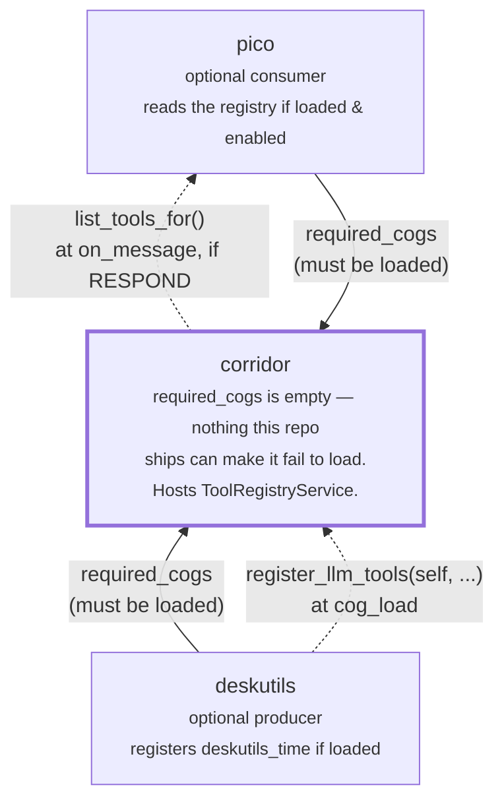

# Corridor cross-cog tool registry: design

> **Status: shipped.** `corridor.application.ToolRegistryService`
> (`register`/`unregister_owner`/`list_tools`) is implemented and wired onto
> `Corridor` as `register_tool`/`unregister_tool_owner`/`list_tools`/
> `list_tools_for`, with the same `on_cog_remove` defensive-cleanup backstop
> the Pub/Sub bus gets. The recommended way to register a tool is the
> `@corridor.adapters.llm_tool` decorator (`corridor/adapters/llm_tools.py`)
> applied directly to a command's callback, scanned and registered
> automatically by `CogBase.register_llm_tools()`
> (`corridor/adapters/llm_tool_registration.py`) at the registering cog's
> own `cog_load` -- `register_tool` itself stays the lower-level primitive
> underneath it. `deskutils` registers its `time` command this way, the
> first (and, as of this doc, only) tool in a shipped cog; `pico` is the
> first (and only) consumer, adapting a registration into its own
> `ToolSpec` at `pico/tools/cross_cog.py`. `.cookiecutter/cog-cookiecutter`
> also generates a decorated example (`bump`) by default, so every new cog
> starts from a working pattern instead of copying one in from `deskutils`.
>
> `llm_tool` lives in `corridor/adapters/`, not `corridor/domain/` where it
> started out -- it has a genuine, load-bearing dependency on discord.py's
> own `Parameter`/`Signature` machinery (see "Per-parameter descriptions:
> `typing.Annotated`, made safe" below for why), unlike `RegisteredTool`/
> `ToolHandler`/`ToolRegistryService`, which stay framework-neutral. The
> shared discord.py/redbot test stub (`corridor/testing.py`) was extended
> with a small, behaviorally-faithful fake `discord.ext.commands.Parameter`/
> `Signature` pair specifically so `llm_tool`'s own tests (and every
> dependent cog's) keep working without a real discord.py installed.

## Motivation

`deskutils` ships `[p]deskutils time`, a Discord command a human runs by
hand. `pico` is an LLM-backed cog that can *only* act through a bounded
tool-calling loop (`docs/architecture.md` §4) — it never sends raw text,
only pre-declared tool calls. Making pico able to answer "what time is it?"
in chat means giving its tool loop access to the same time logic the
Discord command uses.

Wiring that directly would mean either `deskutils` depending on `pico`
(wrong: `deskutils` should work standalone, pico is one of potentially many
optional consumers) or `pico` hardcoding a `deskutils`-shaped tool itself
(wrong: `pico`'s tool loop shouldn't need to know every cog that might ever
want to offer it a tool). This is the same problem corridor's PubSub event
bus already solves for "floorplan wants to hear about things pico does, and
vice versa, without either depending on the other" — see
[`docs/corridor-pubsub-design.md`](corridor-pubsub-design.md). A tool
registry is that same shape (register/list, owner-scoped cleanup, silent
no-op with zero consumers), applied to LLM tool-calling instead of Discord
events, so it's implemented as a second corridor-hosted service rather than
a new architectural pattern.

**Does this make corridor a general shared-code library?**
[`docs/corridor.md`](corridor.md#what-this-is-not) is explicit that
corridor isn't one — extracting shared UI/business logic was deliberately
rejected as premature abstraction. The tool registry doesn't cross that
line for the same reason the event bus doesn't: corridor stores, scans for,
and filters *registrations*, it never contains a tool's actual behavior.
`deskutils`' `time_command` body still lives entirely in
`deskutils/adapters/commands.py`, calling into `deskutils`' own
`TimeService` — corridor only ever sees a name, a description, a
JSON-Schema dict inferred from the callback's own signature, a reference to
the callback itself, and a permission-group key. The *decorator*
(`@llm_tool`) itself is cog-agnostic the same way — it has no idea
`deskutils` or `time_command` exist, it only inspects whatever function
it's applied to — though, unlike the registry it feeds, it is *not*
framework-neutral: it needs discord.py's own `Parameter`/`Signature`
classes to do its job safely (see "Per-parameter descriptions:
`typing.Annotated`, made safe" below), which is why it lives in
`corridor/adapters/`, not `corridor/domain/`.

## Topology: corridor is the only piece that must be loaded

Every cog in this repo is a genuine Red-DiscordBot plugin — installable,
loadable, and unloadable independently — and this feature is designed so
that stays true. `deskutils` and `pico` each declare `corridor` in
`required_cogs` (the one thing they cannot function without); neither
declares the other, and neither imports so much as a type from the other's
package. The only edge between them is mediated entirely through corridor,
at runtime, through the registry described below:



Solid arrows are the only ones Red actually enforces (`required_cogs` —
corridor refuses to let a dependent load without it, via
`ensure_corridor_loaded`). Dashed arrows are the tool-registry traffic this
doc describes, and they are the *only* place `deskutils` and `pico` come
anywhere near each other — there is deliberately no dashed (or any) edge
drawn directly between them. Remove either dashed arrow's endpoint cog from
the bot entirely and the other endpoint keeps working exactly as it did
before this feature existed; remove corridor and neither `deskutils` nor
`pico` can even load, tool registry or not — that dependency predates this
feature and would exist with zero cogs ever touching `register_tool`.

| Installed | `[p]deskutils time` (Discord command) | pico answers "what time is it?" |
|---|---|---|
| `corridor` only | n/a (deskutils not installed) | n/a (pico not installed) |
| `corridor` + `deskutils` | ✅ works | n/a (pico not installed) |
| `corridor` + `pico` | n/a (deskutils not installed) | pico responds via its native reply tool only — `list_tools_for` returns `()`, exactly as if this feature didn't exist |
| `corridor` + `deskutils` + `pico` | ✅ works | ✅ pico calls `deskutils_time` directly |

## The registry contract: framework-neutral, not pydantic

This section is about `RegisteredTool`/`ToolHandler` -- the *registry's*
contract, which stays framework-neutral regardless of how a given tool got
registered. `llm_tool`, the decorator most tools go through to get there,
is a different story -- see "Per-parameter descriptions" below.

`pico`'s own `ToolSpec` Protocol (`pico/tools/base.py`) is pydantic-typed —
`Input`/`Output` are `type[BaseModel]`. That's an internal implementation
detail of how `pico/infrastructure/llm_client.py` talks to an
OpenAI-compatible endpoint, not a repo-wide convention: corridor's domain
layer has zero pydantic (or discord.py) imports by design, matching every
other type in `corridor/domain/models.py`. Requiring every registering cog
to build real pydantic models just to participate would force a new
runtime dependency (`pydantic`) onto cogs like `deskutils` that otherwise
need nothing beyond `redbot`/`corridor` — for a purely *optional*
integration that may never be exercised on a given install.

So `corridor.domain.RegisteredTool` is plain data:

```python
ToolHandler = Callable[[object, Mapping[str, object]], Awaitable[Mapping[str, object]]]

@dataclass(frozen=True, slots=True)
class RegisteredTool:
    name: str
    description: str
    parameters: Mapping[str, object]   # OpenAI-style JSON Schema
    handler: ToolHandler               # (ctx, args) in, dict out
    required_group: str | None = None  # corridor permission-group key
```

`parameters` is handed to the LLM byte-for-byte as-is; `handler` takes an
opaque per-invocation `ctx` (typed `object` here so this module never
imports discord.py — see "Why `handler` needs a `ctx`" below) plus a plain
JSON-object-shaped `Mapping` of arguments, and returns one — no schema
reconstruction on pico's side, no type mapping. The one side that *does*
need pydantic (`pico`, which already depends on it) does the bridging
itself, entirely inside its own package — see "The pico-side adapter"
below. No other cog, and no future registering cog, needs to know pydantic
exists.

### Building one by hand is rare — `@llm_tool` is the normal path

Nothing stops a cog from hand-building a `RegisteredTool` and calling
`corridor.register_tool(tool, owner=...)` directly (useful for a tool
that isn't really a Discord command at all), but the normal, expected path
— since registering tools this way is meant to happen often, across many
cogs, not just once for `deskutils` — is the `@corridor.adapters.llm_tool`
decorator, applied directly to a command's own callback:

```python
from corridor.adapters import llm_tool
from corridor.domain import EMPLOYEE_KEY

@deskutils_group.command(name="time")
@llm_tool(
    name="deskutils_time",
    description="Get the current date and time. Optionally pass an IANA "
                "timezone name (e.g. 'America/New_York') to also get it "
                "localized to that zone.",
    required_group=EMPLOYEE_KEY,
)
async def time_command(
    self,
    ctx: commands.Context,
    timezone: Annotated[str | None, "An IANA time zone name, e.g. 'America/New_York'."] = None,
) -> None:
    ...  # unchanged -- require_permission, TimeService, send_reply
```

`@llm_tool` is the *innermost* decorator, directly above `async def` —
applied to the plain callback before `@deskutils_group.command(...)` wraps
it into a discord.py `Command`. It infers `parameters`'s JSON Schema from
the callback's own signature (skipping the leading `self`/`ctx` every Red
command has: `str`/`int`/`float`/`bool`, optionally `| None`, map directly;
anything else raises `TypeError` immediately, at decoration/import time,
not later at registration or consumption time) and attaches everything as
an `LLMToolSpec` marker on the function object itself. Nothing is
registered yet at this point — decoration just tags the function; see
"Lifecycle" below for when the tag actually turns into a live
`RegisteredTool`.

`corridor.adapters.llm_tool_spec(func)` reads that marker back — used both
by corridor's own scanner and by a decorated cog's own tests (see
`deskutils/tests/test_cog_commands.py::TestTimeCommandIsAnLLMTool`) to
assert a command really did get tagged correctly, without needing
corridor's adapter-layer scanning machinery at all.

### Per-parameter descriptions: `typing.Annotated`, made safe

An earlier version of this decorator took a separate `parameter_descriptions=
{"timezone": "..."}` keyword instead, specifically to avoid a real,
verified hazard: `timezone`'s annotation is read by *two* different
things — `llm_tool`, for the LLM's schema, and discord.py's own
command-parameter parser, for real command dispatch. Against the installed
`discord.py==2.7.1`, `discord.utils.evaluate_annotation` already gives
`Annotated[X, Y]` a meaning of its own: `Y` is treated as the actual
type/converter to use, not descriptive metadata about `X`. A plain
description string there makes discord.py try to `eval()` it as Python
source at cog load:

```python
>>> discord.utils.evaluate_annotation("An IANA time zone name.", {}, {}, {})
SyntaxError: invalid syntax
```

and a custom, non-string sentinel object there (`Annotated[str, ToolDescription(...)]`)
avoids that crash only to fail every real invocation instead — discord.py
resolves the parameter's *converter* to the sentinel instance itself, which
isn't callable, so `[p]deskutils time America/New_York` raises
`BadArgument: Converting to "ToolDescription" failed for parameter "timezone".`
every single time (confirmed by driving `discord.ext.commands.converter._actual_conversion`
directly). Neither failure mode is caught by this repo's own test
convention of calling `command.callback(cog, ctx, ...)` directly, which
bypasses discord.py's real parameter conversion entirely — the SyntaxError
surfaces at cog *load*, so it is at least loud, but the BadArgument case
would only ever show up against a live bot.

**The fix that makes natural `Annotated` syntax genuinely safe:** `@llm_tool`
reads `Annotated[X, "description"]` for its own purposes, then — before
returning — patches the callback's `__signature__` to a version with
`Annotated` stripped back down to the bare `X`, so discord.py's own command
construction (which runs *next*, when the outer `@x.command(...)` decorator
wraps this same function) never sees `Annotated` at all. This isn't a
discord.py-specific trick: `inspect.Signature.from_callable()` has always
honored an explicit `__signature__` attribute over introspecting a
callable's raw code — confirmed directly against CPython's `inspect`
module — and discord.py's command construction goes through exactly that
call (`discord.ext.commands.parameters.Signature`, a thin `inspect.Signature`
subclass). The patched parameters have to be built from discord.py's own
`Parameter` class, not bare `inspect.Parameter` — verified that a bare
`inspect.Parameter` in the patched signature lets a real `Command()`
*construct* without error, but crashes with `AttributeError: 'Parameter'
object has no attribute 'converter'` the moment the command is actually
*invoked*, since discord.py's real `Command.transform()` depends on that
property existing on whatever it finds there.

This is why `llm_tool` needs `discord.ext.commands.Parameter` (public API)
and `discord.ext.commands.parameters.Signature` (not exposed at the public
`discord.ext.commands` namespace, only reachable via that internal path) —
and why it now lives in `corridor/adapters/`, which already has a real
discord.py dependency throughout, rather than `corridor/domain/`. The
shared test stub (`corridor/testing.py`) gained a small, behaviorally
faithful fake of both (`required`/`converter` properties, a
`_parameter_cls`-driven `Signature` subclass) specifically so `llm_tool`'s
own decoration logic — which runs at cog *import* time, in every test
process, not just in production — has something real to import and patch
against under this repo's stub-based test suite.

Verified end to end, not just read from source: decorating a callback with
`Annotated[str | None, "An IANA time zone name."]`, wrapping it in a real
`@discord.ext.commands.command(...)`, and constructing the `Command`
produces `Command.params['timezone'].converter == Optional[str]`,
`required == False`, a clean auto-generated help string
(`<ctx> [timezone]`, no `Annotated`/description leakage), correct real
argument conversion through `run_converters`, and the original callback
still fully callable with its own business logic intact.

## Lifecycle (mirrors `EventBusService` exactly)

- **Register**: a cog calls `corridor.register_llm_tools(self, owner="<CogClassName>")`
  from its own `cog_load`, after `register_dependent`. This scans `self`
  (`corridor/adapters/llm_tool_registration.py::collect_registered_tools`)
  for every command whose callback carries an `@llm_tool` marker and
  registers one `RegisteredTool` per match, via the same underlying
  `corridor.register_tool(tool, owner=...)` primitive a hand-built tool
  would use. Re-registering the same name under the same `owner` overwrites
  (idempotent across repeat `cog_load`s); a name collision from a
  *different* owner raises — a real authoring conflict, not something to
  silently shadow.
- **Unregister**: the registering cog calls `corridor.unregister_tool_owner("<CogClassName>")`
  from its own `cog_unload` — the reverse direction of
  `register_dependent`/`unregister_dependent` (corridor doesn't
  track/cascade a *registrant's* lifecycle the way it does a *dependent's*).
  This half doesn't change whether the tool was registered by hand or via
  `register_llm_tools` — it's still owner-scoped, one call.
- **Defensive backstop**: `Corridor.on_cog_remove` (dispatched by Red
  unconditionally after every cog removal, even one whose own `cog_unload`
  raised partway through) also calls `unregister_owner(cog.qualified_name)`,
  so a registration can never leak past its owning cog's actual removal.
- **Owner-string convention**: `register_dependent`/`unregister_dependent`
  use the lowercase *extension* name (`"deskutils"` — what
  `bot.unload_extension` needs); `owner=` here (like `subscribe_event`)
  uses the capitalized *Cog class* name (`"Deskutils"`, matching
  `cog.qualified_name`) so the `on_cog_remove` backstop lines up with a
  registrant's own manual `unregister_tool_owner` call.
- **Scope**: one registry per bot process, not per guild — same as
  `EventBusService`. A tool with guild-specific behavior would encode that
  entirely inside its own `handler`, the same way it always would have as
  a Discord command.

## Why `handler` needs a `ctx` — and what that means for "does it reply?"

`collect_registered_tools`'s handler for an `@llm_tool`-decorated command
is, deliberately, `await callback(cog, ctx, **raw_args)` — it invokes the
*exact same callback* Red would invoke for a real `[p]deskutils time`, with
the *exact same* `ctx` object pico already built for this turn
(`pico/adapters/listener.py`'s `ctx = await self.bot.get_context(message)`).
**Calling this tool is invoking the command** — same `require_permission`
check, same `corridor.send_reply` call, same everything. This is a direct,
necessary consequence of decorating `time_command` itself rather than a
separate data-returning function: the callback body needs a real `ctx` to
do any of what it does, so `ToolHandler`'s signature carries one.

That's *why* invoking `deskutils_time` from pico now sends the Discord
reply directly, as a side effect of the callback running — not "the tool
returns data, and the LLM decides whether to compose a reply from it." The
`{"status": "ok"}` the handler returns to the LLM is just an
acknowledgement; the actual user-facing output already happened by the
time the LLM sees that result.

Verified against the installed `discord.py==2.7.1` (not assumed):
`Command.__init__` sets `self.callback = func` — literally the same
function object `@llm_tool` marked, so the marker survives discord.py
wrapping it into a `Command`/`HybridCommand` and copying it per cog
instance. `collect_registered_tools` calls `.callback` directly with an
explicit `cog` argument — not `command(ctx, ...)` — because real
discord.py's `Command.__call__` auto-binds `self.cog`, but the redbot test
stub's `_FakeCommand.__call__` (`corridor/testing.py`) does **not**;
calling `.callback(cog, ctx, ...)` explicitly is the one invocation shape
that behaves identically in both environments (and matches this repo's own
existing test pattern, `cog.time_command.callback(cog, ctx, ...)`). The
scanner also duck-types via `.callback` rather than discord.py's
`Cog.walk_commands()`/`__cog_commands__`, since the test stub implements
neither — relying on them would make this untestable under this repo's
stub-based suite.

One more consequence worth flagging explicitly: `.callback(cog, ctx, ...)`
bypasses whatever `@commands.check`-style decorators (`guild_only`,
`is_owner`, ...) the command might also carry — corridor never goes
through discord.py's own dispatch/check pipeline. `time_command` has none
of those (only its own explicit `require_permission` call), so this is a
non-issue here, but any future `@llm_tool`-decorated command that *does*
rely on a `@commands.check` for access control needs to move that check
into the callback's own body (or `required_group`) to have it actually
enforced when invoked as a tool.

## Permission gating

`RegisteredTool.required_group` reuses corridor's existing permission-group
vocabulary (`PermissionGroupDef.key` / `EMPLOYEE_KEY` / ...) rather than
inventing a parallel one. `Corridor.list_tools_for(member)` — the one call
a consumer needs — filters `list_tools()` through the same
`capabilities_satisfy` a Discord command's `require_permission` call
already uses, so a tool is offered to an LLM call under exactly the tier a
human running the equivalent command would need. `deskutils`' `time` tool
is gated on `EMPLOYEE_KEY` — the same tier the `[p]deskutils time` command
itself now explicitly checks (`corridor.require_permission(ctx, EMPLOYEE_KEY)`),
a single shared source of truth for "who can do this," whether by command
or by tool call.

Filtering happens *before* the LLM ever sees the tool (it's excluded from
`tools=[...]` entirely for a member who doesn't satisfy the gate), not
inside the handler — so an unauthorized user's LLM call never attempts,
and never gets a confusing "permission denied" tool result; the tool
simply isn't part of that turn's vocabulary at all.

## The pico-side adapter

`pico/tools/cross_cog.py`'s `CrossCogTool` wraps one `RegisteredTool` as a
`ToolSpec`, entirely additively — zero changes to `pico/tools/base.py`,
`reply_tool.py`, or `application/tool_loop_service.py`. It closes over the
triggering turn's `ctx` (constructed as `CrossCogTool(tool, ctx)`, mirroring
`ReplyTool`'s own per-turn `ctx`) and passes it straight through to
`tool.handler(ctx, args)` — see "Why `handler` needs a `ctx`" above for
why that's there at all. Its synthetic `Input` class overrides the
`model_json_schema()` classmethod to return the tool's own `parameters`
dict verbatim (instead of pydantic's usual field-derived schema), and both
`Input`/`Output` set `model_config = ConfigDict(extra="allow")` so any JSON
object round-trips through them unvalidated — argument *validation* stays
exactly where it always was, in the registering cog's own `handler`.

`pico/adapters/listener.py`'s `on_message` builds this turn's tool list
(`_cross_cog_tools(corridor, ctx)`) only after the gate has already decided
`RESPOND` — i.e. only when pico is loaded *and* enabled for the guild
*and* the LLM is configured. If `deskutils` (or any registering cog) isn't
installed, `list_tools_for` simply returns `()` and pico behaves exactly as
it does today. If `pico` isn't installed, `deskutils.cog_load()` still
calls `register_llm_tools` unconditionally — it just sits in corridor's
registry, unread by anyone. Neither side needs to know or check whether the
other is loaded.

## Example: one full turn

```mermaid
sequenceDiagram
    participant U as Discord user
    participant P as pico<br/><small>(if loaded &amp; enabled)</small>
    participant C as corridor<br/><small>(always loaded)</small>
    participant D as deskutils<br/><small>(if loaded)</small>

    Note over D,C: cog_load -- runs whether or not pico is ever installed
    D->>C: register_llm_tools(self, owner="Deskutils")
    Note over D,C: scans self for @llm_tool commands -> registers deskutils_time

    U->>P: "what time is it?"
    P->>P: GateService.decide() -> RESPOND
    P->>P: ctx = await bot.get_context(message)
    P->>C: list_tools_for(ctx.author)
    alt deskutils loaded and member satisfies "employee"
        C-->>P: (deskutils_time,)
    else deskutils not loaded
        C-->>P: ()
    end
    P->>P: ToolLoopService.run(tools=[ReplyTool, CrossCogTool(deskutils_time, ctx)?])
    opt LLM chooses to call deskutils_time
        P->>D: CrossCogTool.handler(args) -> time_command.callback(cog, ctx, **args)
        D->>D: require_permission(ctx, "employee") -- already known True, checked again
        D->>D: TimeService.now() / resolve_zone()
        D->>C: send_reply(ctx, ...) -- the actual, user-facing Discord reply
        C-->>U: rendered reply
        D-->>P: {"status": "ok"}
    end
```

If `pico` is never installed, nothing right of `deskutils`' own `cog_load`
ever runs — the registration still happened and simply sits unread. If
`deskutils` is never installed, the `alt` above always takes the "not
loaded" branch and pico behaves exactly as it did before this feature
existed, using only its native `ReplyTool`. Notice there's no longer a
separate "LLM chooses to reply" step for this tool specifically — calling
`deskutils_time` *is* the reply, sent from inside `time_command` itself
(see "Why `handler` needs a `ctx`" above); the LLM only sees
`{"status": "ok"}` back, an acknowledgement, not data to compose an answer
from.

Spelled out:

1. `GateService.decide()` → `RESPOND`.
2. `ctx = await bot.get_context(message)` → `ctx.author` is a real
   `discord.Member`.
3. `corridor.list_tools_for(ctx.author)` → `(deskutils_time,)` (`employee`
   never restricts).
4. `ToolLoopService.run(tools=[ReplyTool(...), CrossCogTool(deskutils_time, ctx)])`
   → the LLM sees both in its tool list, calls `deskutils_time`.
5. `CrossCogTool.handler` → `collect_registered_tools`'s handler →
   `time_command.callback(cog, ctx, timezone=...)` — the *real* command
   body: `require_permission`, `TimeService.now()`/`resolve_zone()`, and
   `corridor.send_reply(ctx, ...)`, which is what the Discord user actually
   sees. The LLM gets back only `{"status": "ok"}`.
6. The LLM may still call `send_reply` (pico's native `ReplyTool`)
   separately if it wants to say something *else* — but the time answer
   itself already went out in step 5.
