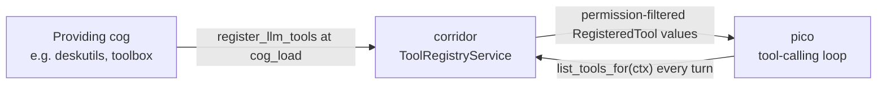
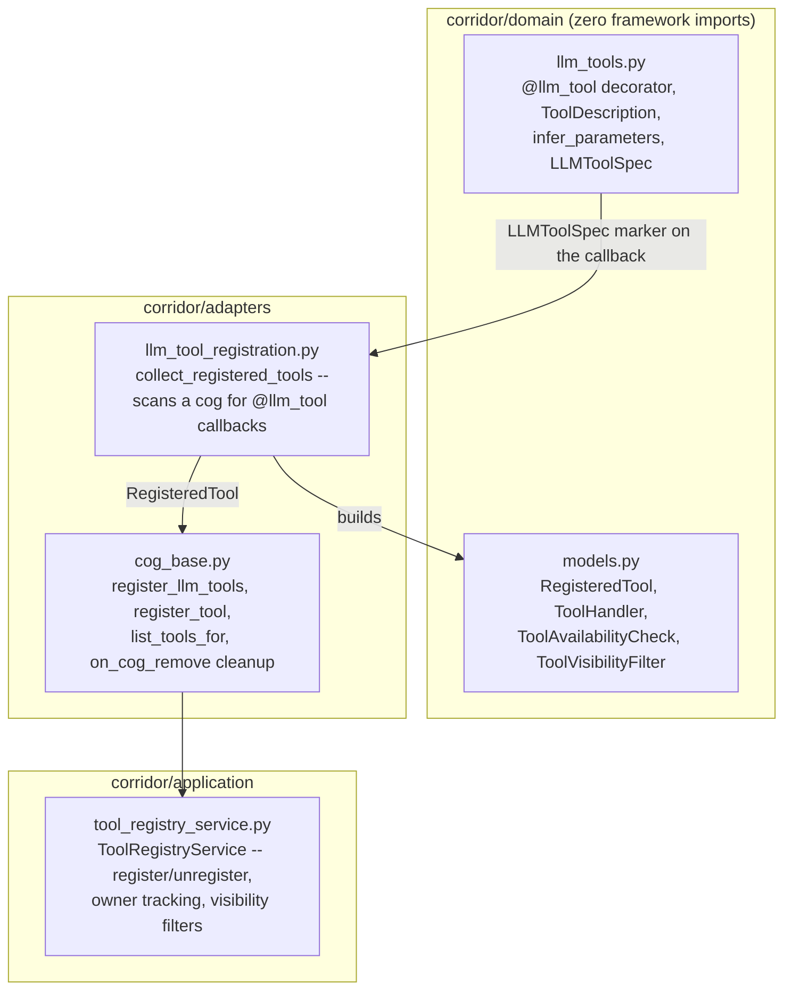
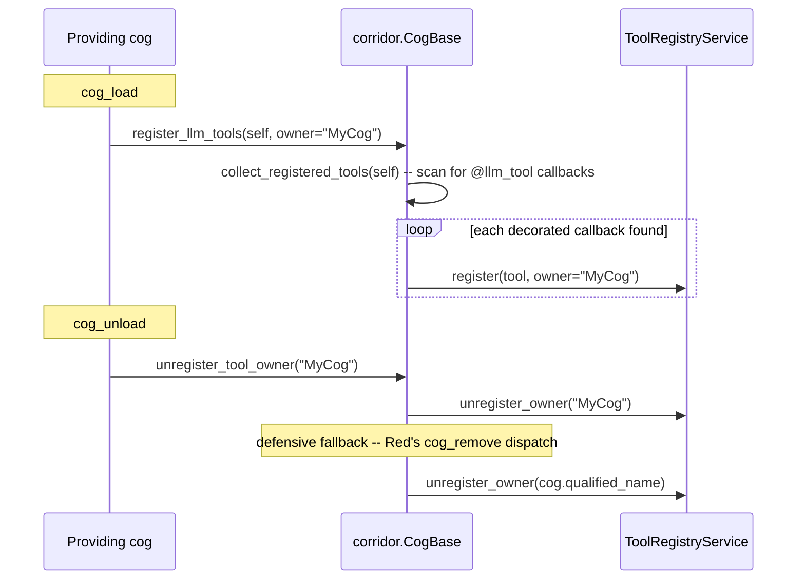
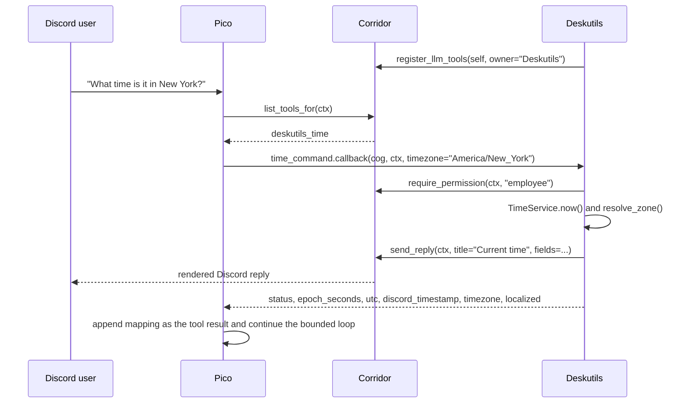
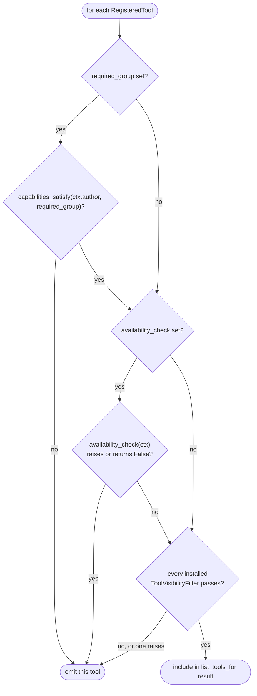

# Corridor cross-cog LLM tool registry

## Overview

Corridor hosts an in-process registry of tools that optional LLM consumers
can discover without depending directly on the cogs that provide them.
`pico` is the consumer; `deskutils_time` is a production example of a
provided tool. Neither side imports the other — both depend only on
corridor.



If pico is absent, registrations remain inert. If a provider is absent,
pico simply receives fewer tools. The registry is process-scoped, while
each invocation still receives the triggering Discord context and can
perform guild-specific work.

## Architecture

Three modules own three separate concerns, each with a single
responsibility:



`llm_tools.py` and `models.py` know nothing about discord.py or Red — a
`RegisteredTool.handler` takes an opaque `ctx: object` and a plain JSON
mapping, so the registry itself never needs a framework import. Only
`llm_tool_registration.py`, at the adapter boundary, understands what a
real Discord `Command` object looks like.

## Domain model: the registry contract

The shared contract is deliberately framework-neutral. Corridor's domain
layer imports neither discord.py nor pydantic:

```python
ToolHandler = Callable[
    [object, Mapping[str, object]],
    Awaitable[Mapping[str, object]],
]
ToolAvailabilityCheck = Callable[[object], Awaitable[bool]]
ToolVisibilityFilter = Callable[[object, "RegisteredTool"], Awaitable[bool]]


@dataclass(frozen=True, slots=True)
class RegisteredTool:
    name: str
    description: str
    parameters: Mapping[str, object]
    handler: ToolHandler
    required_group: str | None = None
    availability_check: ToolAvailabilityCheck | None = None
```

| Field | Meaning |
|---|---|
| `name` | Globally unique within the bot process. |
| `description` / `parameters` | Sent to the LLM as the function-tool description and input JSON Schema. |
| `handler(ctx, arguments)` | Receives the original Discord context and a JSON-object-shaped mapping, returns one. |
| `required_group` | A corridor permission-group key. `None` means the registry adds no group gate. |
| `availability_check(ctx)` | An optional second gate — decorated commands use it to run their native Red/discord.py checks when no explicit `required_group` was supplied. |

`Corridor.register_tool(tool, owner=...)` is the low-level API for tools
that are not Discord commands. Most providers use decorated command
registration instead (below). `register_tool_visibility_filter(predicate,
owner=...)` installs one more gate `list_tools_for` evaluates for every
tool, after `required_group`/`availability_check` — `toolbox` is the
intended installer, layering owner-configured enable/disable and
per-guild overrides on top of the registry without corridor persisting
any of that state itself.

## Turning a Discord command into a tool

Apply `@corridor.domain.llm_tool` directly to the callback, below the
Discord command decorator. All arguments are optional:

```python
@deskutils_group.command(name="count")
@llm_tool()
async def count_command(self, ctx: commands.Context, *, text: str) -> dict[str, object]:
    """Count all characters and whitespace-delimited words in text."""
    ...
```

At registration this becomes `deskutils_count`, uses the cleaned docstring
as its tool description, describes `text` as `value for text`, and uses
the Discord command's own checks for availability. Supply any of the
arguments when richer metadata or an explicit corridor group is needed:

```python
from typing import Annotated

from corridor.domain import EMPLOYEE_KEY, ToolDescription, llm_tool


@counter_group.command(name="project")
@llm_tool(
    name="counter_project",
    description="Project the count after future increments without changing it.",
    required_group=EMPLOYEE_KEY,
)
async def project(
    self,
    ctx: commands.Context,
    amount: Annotated[
        int,
        ToolDescription(
            "The number of increments to project.",
            minimum=1,
            maximum=10,
        ),
    ],
) -> dict[str, object]:
    if not await self._corridor.require_permission(ctx, EMPLOYEE_KEY):
        return {"status": "error", "error": "permission_denied"}

    # Tool calls invoke this callback directly, so validate raw values even
    # though Discord converts arguments for human command invocations.
    if isinstance(amount, bool) or not isinstance(amount, int) or not 1 <= amount <= 10:
        message = "Amount must be a whole number from 1 through 10."
        await self._corridor.send_reply(ctx, title="Projection", description=message)
        return {"status": "error", "error": "invalid_amount", "message": message}

    snapshot = await self._service.show(ctx.guild.id)
    projected = snapshot.count + amount
    await self._corridor.send_reply(
        ctx,
        title="Projection",
        description=f"Current: {snapshot.count}; after {amount}: {projected}",
    )
    return {
        "status": "ok",
        "current_count": snapshot.count,
        "amount": amount,
        "projected_count": projected,
    }
```

The callback stays one implementation for both invocation paths: a human
runs the Discord command (discord.py converts the arguments and ignores
the callback's return value), or an LLM calls the registered tool
(corridor invokes the same callback with the same `ctx`, preserving its
Discord side effects, and forwards its returned mapping to the LLM).
Returning a string-keyed `Mapping[str, object]` gives the LLM an
informational result; returning `None` produces the acknowledgement
`{"status": "ok"}`. Any other return type, or a mapping with non-string
keys, raises `TypeError` as an authoring error.

## Input schema inference

`llm_tool` skips the leading `self` and `ctx` parameters and infers an
object schema from the remaining callback signature.

| Python annotation | JSON Schema type |
|---|---|
| `str` | `string` |
| `int` | `integer` |
| `float` | `number` |
| `bool` | `boolean` |
| any supported type `\| None` | the same schema type |

A parameter without a default is included in `required`; one with a
default is optional. Unsupported annotations fail immediately when the
module is imported and the decorator runs. Parameters without a
`ToolDescription` receive the generic description `value for <parameter
name>`. Use one `ToolDescription` inside `typing.Annotated` to enrich a
property — required `description` text, numeric `minimum`/`maximum` for
`int`/`float` parameters, and a non-empty tuple of primitive `enum` values
matching the inferred JSON type:

```python
amount: Annotated[
    int,
    ToolDescription(
        "How many items to process.",
        minimum=1,
        maximum=20,
        enum=(1, 5, 10, 20),
    ),
]

style: Annotated[
    str,
    ToolDescription(
        "How much detail to include.",
        enum=("compact", "detailed"),
    ),
] = "compact"
```

### Why `Annotated` is stripped in place

discord.py assigns its own converter meaning to `Annotated[X, metadata]`.
If `ToolDescription` reached command construction, Discord would attempt
to use it as a converter. `llm_tool` therefore reads the metadata for the
LLM schema and replaces the callback's annotation with its bare type in
`func.__annotations__` before the command decorator runs. Mutating the
callback's own annotations, rather than temporarily overriding
`__signature__`, is required because hybrid-command construction and Cog
copying repeatedly derive fresh command parameters — the in-place bare
type survives every derivation and keeps prefix, slash-command, help, and
tool-schema behavior aligned; a transient `__signature__` override does
not survive discord.py's own borrow-then-delete step while building a
slash-command equivalent.

## Key flows

### Registration and cleanup



`register_llm_tools` scans attributes exposing `.callback`, reads each
`LLMToolSpec` marker, and registers one tool per callback identity.
Re-registering the same name for the same owner replaces it;
registering the same name for a *different* owner raises `ValueError`
instead of shadowing. The owner string is the Cog class name, matching
`cog.qualified_name`. Manual unload removes all tools for that owner, and
corridor's `on_cog_remove` listener provides defensive cleanup if the
provider's own teardown does not complete.

### Tool lookup and invocation (pico)



The time command deliberately both replies in Discord and returns
semantic information — the Discord user gets the answer immediately, and
the LLM receives the same computed values for context. Expected failures
return `status="error"` with a stable code and readable message while
preserving the command's normal Discord warning or denial behavior.
Pico adapts every allowed `RegisteredTool` into `CrossCogTool`: its
synthetic input model passes the JSON object through without enforcing
its constraints, and the output model accepts the provider's arbitrary
string-keyed mapping and serializes it as the tool-result message for the
next LLM iteration. A malformed registration is logged and skipped
without taking down the rest of the turn. There is no output JSON Schema
in `RegisteredTool` — only the input schema is advertised, so providers
should keep result mappings small, stable, JSON-serializable, and
self-explanatory.

## API / command reference

| API | Called from | Purpose |
|---|---|---|
| `@corridor.domain.llm_tool(name=, description=, required_group=)` | module scope, decorating a command callback | Marks the callback for later registration; infers name/description/schema/availability from the command where not overridden. |
| `corridor.register_llm_tools(self, owner=...)` | `cog_load` | Scans `self` and registers every `@llm_tool`-decorated command found. |
| `corridor.register_tool(tool, owner=...)` | `cog_load` | Registers one hand-built `RegisteredTool`, not backed by a Discord command. |
| `corridor.unregister_tool_owner(owner)` | `cog_unload` | Removes every tool registered under `owner`. |
| `corridor.unregister_tool(name)` | anywhere | Removes one tool by name, regardless of owner. |
| `corridor.register_tool_visibility_filter(predicate, owner=...)` | `cog_load` | Installs an additional visibility gate evaluated for every tool. |
| `corridor.unregister_visibility_filter_owner(owner)` | `cog_unload` | Removes `owner`'s installed filter. |
| `corridor.list_tools()` | anywhere | Every registered tool, unfiltered. |
| `await corridor.list_tools_for(ctx)` | pico's tool-calling loop | Every tool `ctx.author` is currently allowed to invoke. |

## Validation & error handling

`list_tools_for` evaluates three gates in order, short-circuiting on the
first failure for that tool — a failure never removes other tools from
the list:



A check that raises is logged (`log.warning`, with `exc_info=True`) and
fails closed for that tool only. Schema constraints (`minimum`/`maximum`/
`enum`) are guidance for the LLM, never runtime validation: pico's
synthetic input model uses `extra="allow"` and does not reconstruct or
enforce the schema, and tool invocation calls `.callback(cog, ctx,
**arguments)` directly, bypassing Discord's dispatch/conversion/check
pipeline entirely. Every decorated callback must therefore validate
expected types, ranges, and enum membership itself, and should not rely
only on discord.py converters or `@commands.check` decorators for
protection against a malformed tool call.

## Design rationale

**A plain JSON-Schema dict, not pydantic, as the parameter contract.**
Corridor's domain layer has zero framework imports; requiring every
provider to build a pydantic model would force a dependency the registry
itself doesn't need and couple the contract to one consumer's (pico's)
internal implementation choice. A consumer that wants richer typing
adapts this shape at its own boundary instead.

**Mutating `__annotations__` in place, not overriding `__signature__`.**
Only the former survives every future re-derivation of the callback's
signature that discord.py performs during Cog copying and hybrid-command
construction — verified directly against a real production incident
where a `__signature__` override did not survive that path.

**Inferred metadata with explicit overrides, not one or the other.** Most
tools are a thin wrapper around an existing, well-named, well-documented
Discord command — inferring name/description/availability from it avoids
duplicating that metadata. An explicit `required_group`/`name`/
`description` argument remains available for the tools where the command
metadata isn't the right LLM-facing text.

**Per-agent tool gating lives in the registering cog, not corridor.**
`toolbox`'s enable/disable panel and per-guild overrides are installed as
a `ToolVisibilityFilter`, a predicate corridor merely evaluates — corridor
itself persists none of that state. The registry's job is discovery and
dispatch; deciding *which* discovered tools an operator wants active is
policy that belongs with the cog that owns the policy UI.

**Owner-scoped collision policy, not silent shadowing.** Re-registering
the same tool name under the *same* owner is a normal `cog_load` re-run
and overwrites; the same name from a *different* owner is treated as a
real authoring conflict and raises `ValueError` — a naming collision
between two cogs is a bug to surface immediately, not a runtime ambiguity
to resolve by insertion order.
