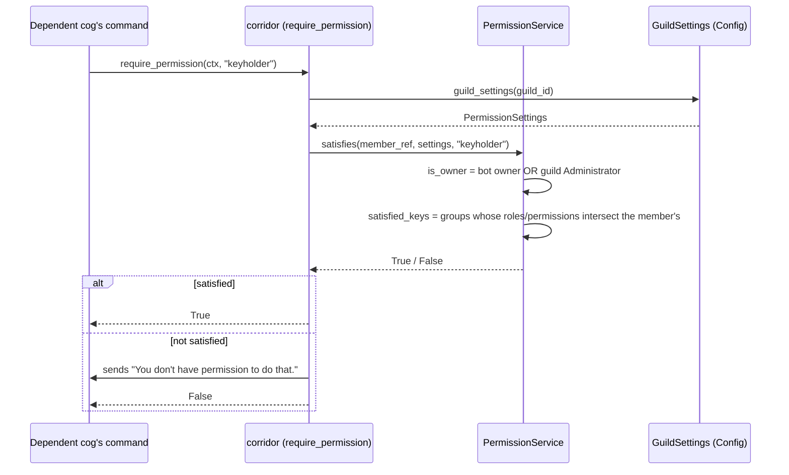
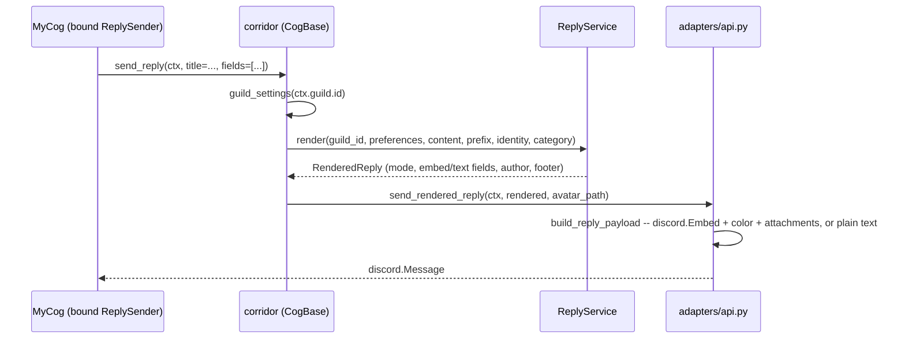
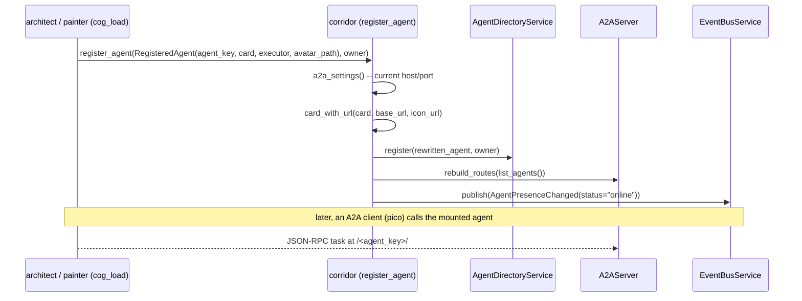
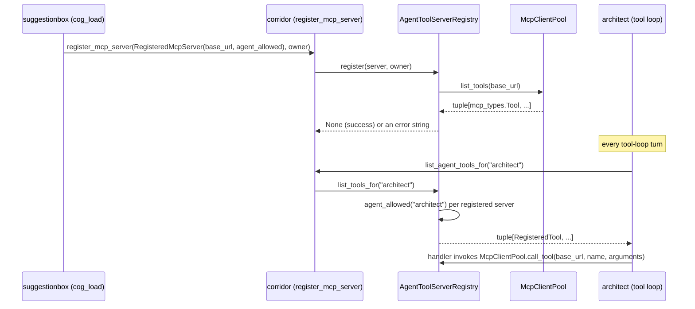
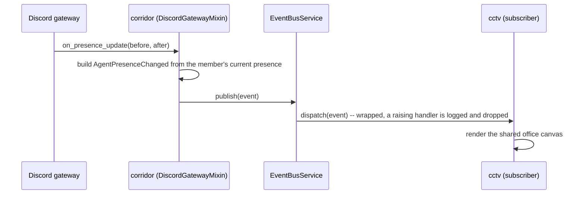
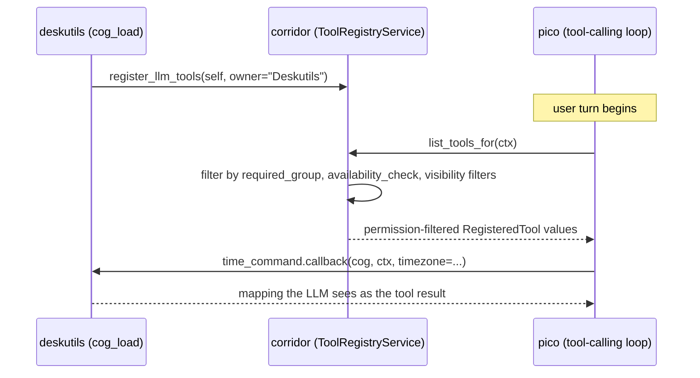
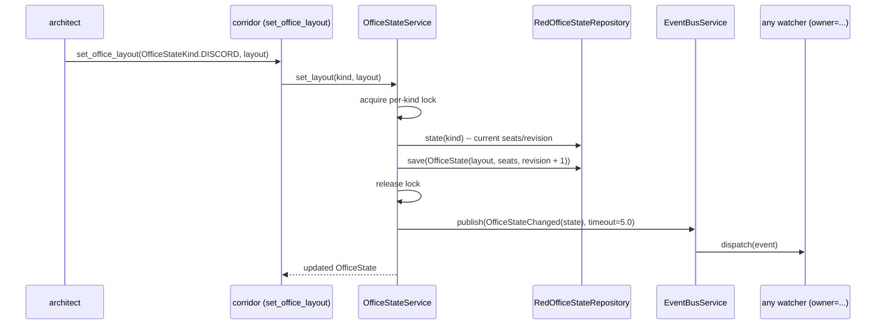

# corridor: shared infrastructure reference

[`corridor/`](../corridor/) is a hidden, `COG`-type cog — loaded and
running, unlike [`contracts/`](../contracts/), a `SHARED_LIBRARY`-type
consumer-driven-contract *testing* package other cogs never import at
runtime. Every cog generated from
[`.cookiecutter/cog-cookiecutter`](../.cookiecutter/cog-cookiecutter)
declares corridor as a `required_cogs` dependency and loads it via
`corridor.dependency_loader.ensure_corridor_loaded()`.

corridor centralizes eight things every other cog would otherwise
reinvent or hand-couple to a sibling cog: permissions, reply rendering
(with per-cog identity and embed colors), the shared LLM connection, the
A2A agent directory, an MCP tool-server bridge, a pub/sub event bus, a
cross-cog LLM tool registry, and revisioned office-state persistence. Each
is a genuinely guild-wide or process-wide piece of *state*, not merely
reusable code — that is what justifies the `required_cogs` coupling this
one cog carries.

## Overview

```mermaid
flowchart TB
    subgraph Corridor["corridor"]
        direction TB
        Perm["PermissionService<br/>+ settings_ui.py"]
        Reply["ReplyService<br/>+ ReplySender + reply_colors"]
        LLMConn["LiteLLMClient<br/>+ llm settings"]
        Dir["AgentDirectoryService<br/>+ A2AServer"]
        McpBridge["AgentToolServerRegistry<br/>+ McpClientPool"]
        Bus["EventBusService"]
        ToolReg["ToolRegistryService<br/>+ llm_tool decorator"]
        Office["OfficeStateService<br/>+ RedOfficeStateRepository"]
    end

    Corridorsettings["[p]corridorsettings<br/>guild admins"] --> Perm
    Corridorsettings --> Reply
    AllCogs["every dependent cog<br/>(require_permission)"] --> Perm
    AllCogs2["every dependent cog<br/>(send_reply / render_reply)"] --> Reply

    Pico["pico"] --> LLMConn
    Architect["architect"] --> LLMConn
    Painter["painter"] --> LLMConn

    Architect -->|register_agent| Dir
    Painter -->|register_agent| Dir
    Pico -->|list_agents -> consult_&lt;agent_key&gt;| Dir

    Suggestionbox["suggestionbox"] -->|register_mcp_server| McpBridge
    Architect -->|list_agent_tools_for| McpBridge
    Painter -->|list_agent_tools_for| McpBridge

    Corridor -->|publish presence/replies| Bus
    Pico -->|publish AgentReplied| Bus
    Architect -->|publish AgentReplied| Bus
    Painter -->|publish AgentReplied| Bus
    Cctv["cctv"] -->|subscribe_event| Bus

    Deskutils["deskutils"] -->|register_llm_tools| ToolReg
    Toolbox["toolbox"] -->|register_tool_visibility_filter| ToolReg
    Pico -->|list_tools_for| ToolReg

    Architect -->|set_office_layout / set_office_seats| Office
    Painter -->|set_office_layout / set_office_seats| Office
    Pixelagents["pixelagents<br/>(Semantic IR facade)"] --> Office
```

## Permissions

Defined in [`corridor/domain/models.py`](../corridor/domain/models.py) as
an open, admin-configurable group model rather than a fixed enum:
`PermissionGroupDef` (`key`/`label`/`role_ids`/`permission_names`) is one
tier satisfied by role membership and/or a Discord permission, and
`PermissionSettings` holds a per-guild, admin-managed tuple of those groups
plus the two reserved keys below.

| Group | Key | Who satisfies it |
|---|---|---|
| Owner | `owner` (reserved) | The bot owner, or a member with guild Administrator permission. |
| Employee | `employee` (reserved) | Everyone. Never restricts. |
| Building Manager *(default)* | `building_manager` | Members holding one of the roles, or one of the Discord permissions, an admin assigned to this group. |
| Keyholder *(default)* | `keyholder` | Members holding one of the roles, or one of the Discord permissions, an admin assigned to this group. |
| *(any admin-added group)* | *(chosen at creation, stable thereafter)* | Members holding one of the roles, or one of the Discord permissions, an admin assigned to that group. |

Dependent cogs reference a group by its plain string `key` (e.g.
floorplan hardcodes `"keyholder"`), not an enum member. Groups are
**independent, unranked tiers** — holding one does not imply another.
`owner` bypasses every check regardless of group; `employee` never
restricts. Roles and permissions are **two independent, OR'd criteria**: a
member satisfies a group by matching either one, not both.

Each group's role set is a `frozenset[int]` of Discord role IDs, and its
permission set a `frozenset[str]` of `discord.Permissions` flag names kept
as plain strings — the domain layer stays free of discord.py imports;
translation to/from real `discord.Permissions` happens only at the adapter
boundary. `permission_names` is drawn from a curated list of eight flags
relevant to a moderation/management tier (`kick_members`, `ban_members`,
`moderate_members`, `manage_messages`, `manage_roles`, `manage_channels`,
`manage_guild`, `mention_everyone`) — not all of `discord.Permissions`'
~40 flags, both because a single Discord select maxes out at 25 options
and because most flags don't fit this use case.

`MemberCapabilities` is computed once per check by the pure
`PermissionService`, from a member's role IDs, granted permission names,
and the bot's owner ID set:

## Reply rendering, identity, and embed colors

Also guild-wide: whether replies go out as plain text or a rich embed, and
if embed, whether it shows a timestamp, a footer, and where its icon comes
from (`ReplyPreferences` in `corridor/domain/models.py`). The pure
`ReplyService` turns preferences plus message content into a
`RenderedReply` DTO; only the adapter layer
(`corridor/adapters/api.py::build_reply_payload`) turns that into a real
`discord.Embed`/`ctx.send()` call.

Every reply also carries a per-cog **identity**. A dependent cog calls
`corridor.reply_sender(owner="MyCog", avatar_path=<cog>/assets/avatar.png,
category=...)` once, typically in `cog_load`, and gets back a bound
`ReplySender` whose `send_reply`/`render_reply` forward to `CogBase`'s own
methods with that identity attached. In `ReplyMode.EMBED` the owner name
always shows as the embed author; `avatar_path` is a conventional path
whose existence is checked fresh on every send and, when present,
attached as a real `discord.File` for the author icon. In `ReplyMode.TEXT`
the owner name instead prefixes the content (`"**MyCog:** ..."`).
`pico`'s `ConsultAgentTool` additionally passes a one-off
`FooterOverride(name, icon_filename)` per call, replacing the guild's
configured footer for that one message with the identity of the agent it
just consulted (architect or painter) — distinct from pico's own author
identity on the same message.

An embed's accent color comes from `ReplyCategory` — `AGENT` (Discord
blurple, `0x5865F2`), `ROOM` (Discord teal, `0x1ABC9C`), or `FURNITURE`
(Discord gold, `0xF1C40F`) — resolved through `REPLY_CATEGORY_COLORS` in
`corridor/domain/reply_colors.py`. `category=None` (the default) leaves
Discord's own gray; a cog that doesn't fit the scheme (deskutils,
pixelagents) simply stays uncategorized. corridor binds its own identity
the same way every dependent does (`owner="Corridor"`, `category=ReplyCategory.ROOM`).

Both `send_reply` and `render_reply` also take
`fields=[ReplyField(name, value, inline, code), ...]` —
`discord.Embed.add_field`'s shape, framework-neutral. In `ReplyMode.EMBED`
each becomes a real embed field; in `ReplyMode.TEXT` each becomes an extra
`**name:** value` line. `code=True` renders that value in its own fenced
Discord code block (giving the client's native copy button) instead of
inline text, and forces the field non-inline in embed mode. `render_reply`
and `send_reply` resolve `ctx.clean_prefix` and substitute it for any
literal `[p]` in title/description/content/field values — Red only
expands `[p]` in command docstrings, never in hand-built reply text.
`render_channel_reply`/`send_channel_reply` are the same rendering keyed
by an explicit `guild_id` and a resolved `channel`, for a caller with no
live `ctx` (e.g. an MCP tool call).

## Shared LLM connection

`corridor/infrastructure/llm_client.py`'s `LiteLLMClient` is the one
shared LiteLLM/OpenAI-compatible chat-completions client every LLM-backed
cog (`pico`, `architect`, `painter`) reads through
`corridor.llm_settings()`/`corridor.llm_client()`. It always requests
`stream=True` and reassembles the SSE chunks into a single response —
working around a LiteLLM bug where the non-streaming path returns an
empty output array for the `chatgpt/*` provider. `[p]corridor llm
endpoint`/`key`/`model` (bot owner only) configure `llm_base_url`/
`llm_api_key`/`llm_model`; `LLMSettings.ready` is `False` until both a key
and a model are set, so a consumer stays idle rather than guessing
defaults for either. Per-agent behavior (max tool calls, system prompt)
stays with each consuming cog — only the connection itself is shared.

## A2A agent directory and shared listener

Corridor runs **one process-wide A2A listener**
(`corridor/infrastructure/a2a_server.py`, a `uvicorn`/Starlette server)
instead of every LLM agent binding a socket of its own. An agent cog calls
`corridor.register_agent(RegisteredAgent(agent_key=..., card=...,
executor=..., avatar_path=...), owner=...)` from its own `cog_load` and
`corridor.unregister_agent_owner(owner)` from `cog_unload`. Corridor
rewrites the card's `supported_interfaces[0].url` (and `icon_url`, when an
avatar path was given) to its own configured host/port plus `/<agent_key>/`
before storing it and mounting the agent's real `AgentExecutor` — the
registering agent has no way to know that address itself. `[p]corridor
a2a host`/`port` (bot owner only) reconfigure and live-restart the shared
listener, re-mounting every already-registered agent via
`A2AServer.rebuild_routes`.

Three A2A agents exist: `architect` (every structural layout mutation) and
`painter` (every color mutation on the same shared layout) are both
A2A-only — no Discord bot login, no guild scope — and reachable as
`consult_architect`/`consult_painter` tools pico builds fresh every turn
from `corridor.list_agents()`. `pico` is the sole A2A **coordinator**, the
one agent with a real Discord bot login, consulting the other two rather
than being consulted itself.

Registering or unregistering an agent also publishes `AgentPresenceChanged`
on corridor's own event bus — a directory membership and an office-canvas
presence stay one event, not two things a cog must remember to keep in
sync.

## MCP tool-server bridge

Distinct from the LLM tool registry below (which exposes *Discord
commands* as tools): corridor also bridges a cog-owned **MCP tools
server** into a registered A2A agent's own tool-calling loop, so e.g.
`suggestionbox`'s `report_error`/`suggest_improvement` tools reach
architect's and painter's tool loops without either cog importing the
other. A providing cog calls `corridor.register_mcp_server(RegisteredMcpServer(
owner=..., base_url=..., agent_allowed=...), owner=...)` from its own
`cog_load`; corridor connects to that server's Streamable HTTP endpoint
via `McpClientPool` and caches its tool list at registration time (not
re-fetched on a schedule). An agent's own tool loop calls
`corridor.list_agent_tools_for(agent_key)` fresh every turn to get every
tool it's currently allowed to use — gated per `agent_key` by the
*registering* cog's own `agent_allowed` check, not by corridor's Discord
permission groups.

## Pub/Sub event bus

`corridor.publish_event(event)`/`corridor.subscribe_event(event_type,
handler, owner=...)` dispatch a closed set of `Agent*` dataclasses
(`AgentReplied`, `AgentToolStarted`, `AgentStatusChanged`,
`AgentHighlighted`, `AgentUnhighlighted`, `AgentPresenceChanged`, all
referencing the shared `AgentRef` and `AgentActivity` value objects) by
concrete type, synchronously, with per-subscriber error isolation — a
raising handler is logged, never propagated back to the publisher.
Corridor itself publishes presence (its own Discord gateway listeners,
plus `register_agent`/`unregister_agent_owner` for any A2A agent) and
message-mirrored `AgentReplied`; `pico`/`architect`/`painter` publish
`AgentReplied` for their own replies and tool-use/thinking steps; `cctv`
is the current sole subscriber, rendering the shared office canvas from
whatever the bus delivers. See
[`docs/corridor-pubsub-design.md`](corridor-pubsub-design.md) for the full
design and event catalog, generated into
[`corridor/corridor.yaml`](../corridor/corridor.yaml) by
`corridor/event_catalog.py`.

## Cross-cog LLM tool registry

Same in-process-registry shape as the event bus and A2A directory: any cog
can register a command as an LLM-callable tool, normally by applying
`@corridor.domain.llm_tool()` to the command's callback and calling
`corridor.register_llm_tools(self, owner=...)` from `cog_load`, so `pico`
(if loaded) can invoke it directly from its tool-calling loop instead of a
user needing to run the command by hand — without `pico` and the
registering cog ever depending on each other. `deskutils_time` is a
production example. `ToolRegistryService` holds the registrations;
`ToolAvailabilityCheck`/`required_group` gate which invoking member's LLM
call is even offered a tool, and an externally-installed
`ToolVisibilityFilter` (`toolbox`'s enable/disable panel) can add a final
gate on top. See
[`docs/corridor-tool-registry-design.md`](corridor-tool-registry-design.md)
for the full inferred-metadata rules, schema constraints, and lifecycle.

## Revisioned office state

Corridor persists two independent, opaque-to-corridor aggregates,
`discord` and `editor` (`OfficeStateKind`) — each a Pixel Agents layout,
avatar-seat records, and a monotonically increasing revision — behind
their own fresh `Config` identity
(`corridor/infrastructure/office_state_repository.py`), unrelated to
corridor's own settings `Config`. `OfficeStateService` makes each kind's
reads/writes atomic per-kind (one `asyncio.Lock` per kind, not one lock
shared across both) and publishes a complete `OfficeStateChanged` after
every successful mutation, once the lock is released — subscribers are
awaited sequentially with exception isolation and a five-second timeout.
A failed subscriber never rolls back persisted state.

Corridor never interprets either JSON schema itself —
[`pixelagents`](../pixelagents) owns the Semantic IR domain model and is
the one facade `architect`/`painter` actually call through
(`office_state`/`set_office_layout`/`set_office_seats`, delegating
straight into corridor underneath). Its generated contract is committed
as [`corridor/office_state.yaml`](../corridor/office_state.yaml).

## Command reference

| Command | Access | Description |
|---|---|---|
| `[p]corridorsettings` | Manage Server / admin role / owner | Opens the shared Components V2 panel for permission groups and reply style. |
| `[p]corridor` | anyone | Base group; shows help. |
| `[p]corridor llm endpoint <url>` | bot owner | Sets the shared LiteLLM proxy base URL. |
| `[p]corridor llm key <key>` | bot owner | Sets the shared LiteLLM virtual key; deletes the invoking message. |
| `[p]corridor llm model <model>` | bot owner | Sets the model name passed to the LLM endpoint. |
| `[p]corridor a2a host <host>` | bot owner | Sets and live-restarts the shared A2A listener's bind host. |
| `[p]corridor a2a port <port>` | bot owner | Sets and live-restarts the shared A2A listener's bind port. |
| `[p]corridor status` | anyone | Shows LLM endpoint/model/key state, A2A listener host/port and running state, and every registered agent key. |

A user without the required permission for `[p]corridorsettings` gets no
response and no error message — that is Red's default behavior for a
failed `@commands.admin_or_permissions` check, not a bug.

## What this is not

corridor doesn't touch Discord's own permission system — a group's
`permission_names` is an optional extra way to satisfy an office-cogs
tier, read-only off `member.guild_permissions`, never a mechanism for
managing Discord permissions themselves. It is also not a general
shared-code library for UI or business logic: every other cog-specific
concern stays in that cog's own domain/application/infrastructure layers.
What justifies corridor is that every subsystem above is genuinely
guild-wide or process-wide *state* — not merely reusable code.
