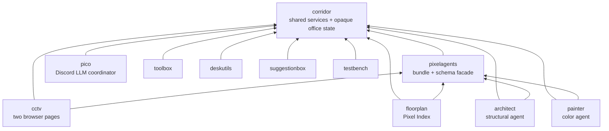
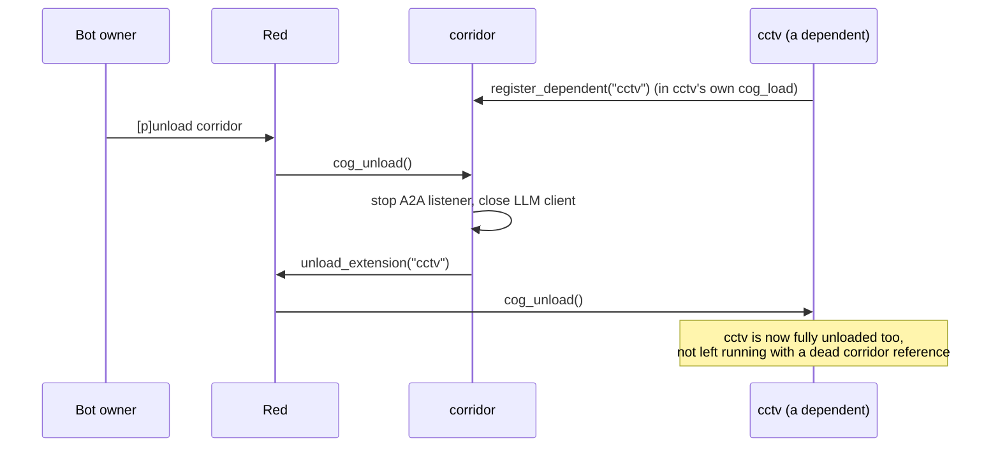
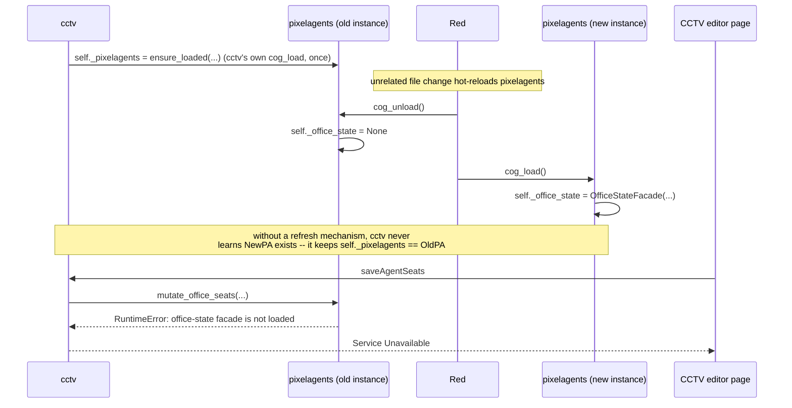
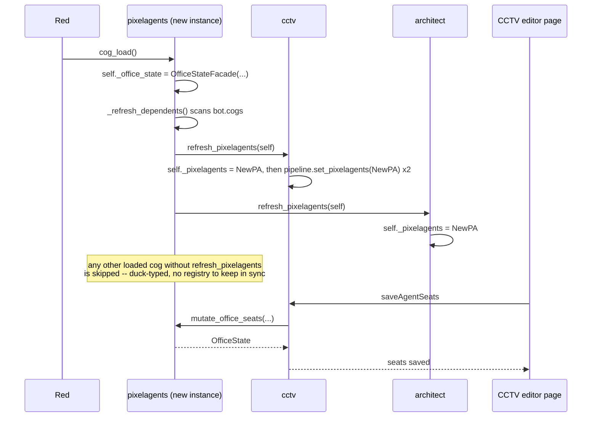

# Runtime dependency cascades: unload and refresh

## Overview

[`dependency-loading.md`](dependency-loading.md) covers how a dependent cog
*acquires* a live reference to a dependency it needs
(`ensure_loaded`/`ensure_importable`). This doc covers the other half: what
happens to that reference *after* acquisition, when the dependency's own
lifecycle changes underneath the dependent — because in this repo it can,
and each of the two cogs every other cog is built on (`corridor` and
`pixelagents`) handles it differently, for a reason grounded in what a
dependent can and can't tolerate.

## The dependency graph

Same relationships as [`architecture.md`](architecture.md)'s own diagram —
kept here too because the two runtime behaviors below only make sense in
light of *where* `corridor` and `pixelagents` sit in it: both are two-hop
hubs, not leaves, so a dependent five minutes into being loaded can still be
holding a reference to a `corridor`/`pixelagents` instance that has since
been discarded and replaced.



Every cog except `corridor` itself depends on `corridor` — that's ten
dependents. Four of those ten (`cctv`, `architect`, `painter`, `floorplan`)
also depend on `pixelagents`, which itself depends on `corridor`. That
second layer is what makes `pixelagents` special: it is simultaneously a
dependency (to those four) *and* a dependent (of `corridor`), and it needed
its own answer to "what happens to a cached reference when the thing it
points to reloads" — separate from, and different to, `corridor`'s answer.

## Why a cached reference goes stale at all

Every dependent resolves its dependency exactly once, synchronously, inside
its own `cog_load()`:

```python
self._corridor = await ensure_corridor_loaded(self.bot)
self._pixelagents = await ensure_loaded(self.bot, "pixelagents", "PixelAgents")
```

That call never re-runs on its own. Red's cog reload
(`[p]reload <cog>`, or this repo's hotreload file-watcher) unloads the old
Cog instance and constructs a brand-new one — `bot.get_cog(name)` afterward
returns the *new* object, but any dependent that resolved its reference
*before* that reload is still holding the *old* one, and nothing tells it
to look again. What happens next depends on which of the two cogs reloaded.

## `corridor`: reload of a dependent is fine, unload of corridor is not

A dependent cog cannot do anything useful without `corridor` — every
permission check, reply, and cross-cog call goes through it. So `corridor`
doesn't attempt to hand dependents a fresh reference; instead it tracks who
depends on it and cascades a full **unload** onto every one of them the
moment it unloads itself, rather than leaving them running against nothing:

```python
# corridor/adapters/cog_base.py
def register_dependent(self, extension_name: str) -> None:
    self._dependents.add(extension_name)

def unregister_dependent(self, extension_name: str) -> None:
    self._dependents.discard(extension_name)

async def cog_unload(self) -> None:
    await self._a2a_server.stop()
    await self._llm_client.close()
    dependents, self._dependents = self._dependents, set()
    for extension_name in dependents:
        try:
            await self.bot.unload_extension(extension_name)
        except Exception:
            log.exception("Failed to cascade-unload dependent cog %r", extension_name)
```



Every dependent calls `register_dependent(name)` in its own `cog_load()` and
`unregister_dependent(name)` in its own `cog_unload()` — all ten of
`architect`, `cctv`, `deskutils`, `floorplan`, `painter`, `pico`,
`pixelagents`, `suggestionbox`, `testbench`, `toolbox` (and the
`.cookiecutter` template new cogs are generated from). This is why every
one of those `cog_load()` methods has the same two-line shape near the top:
resolve `corridor`, then immediately register with it — it isn't
boilerplate to trim, it's what makes `corridor`'s own unload safe.

Note the direction: this cascade only fires on `corridor`'s **unload**, and
it **unloads** the dependent rather than refreshing it — a `corridor`
*reload* (unload immediately followed by load) unloads every dependent too,
same as a plain unload, since `cog_unload` always runs first regardless of
what follows it. There is no "corridor reloaded, please just take the new
reference" path, because there's nothing a dependent could safely keep
doing in the gap.

## `pixelagents`: a dependent can survive a reload if it gets a fresh reference

`pixelagents` is different: a dependent that's momentarily out of sync with
it (a stale Cog reference) isn't broken *yet* — it's only broken the next
time it actually calls through that reference. That's a strictly better
failure mode than being force-unloaded, provided something eventually hands
the dependent the fresh instance — which is exactly what the push mechanism
below does. Without it, a dependent has no way to notice `pixelagents` was
replaced underneath it.

### Example: a stale reference survives an unrelated reload

`architect`'s hotreload (triggered by an unrelated file edit) ran `Red`'s
own `_reload(["architect"])`. `cctv` had last resolved its own
`self._pixelagents` reference over 55 minutes earlier and hadn't reloaded
since. When `pixelagents` itself got reloaded independently sometime after
that — a brand-new `PixelAgents` instance replaced the old one under
`bot.get_cog("PixelAgents")` — `cctv` kept talking to the discarded old
instance. That old instance's `cog_unload()` had already set its
`_office_state` to `None`, and since nothing was ever going to call
`cog_load()` on it again (it wasn't the registered instance any more),
every subsequent call through `cctv`'s stale reference hit:

```
File ".../cctv/application/pipeline.py", line 168, in handle_message
    await self._pixelagents.mutate_office_seats(self.kind, merge)
File ".../pixelagents/adapters/cog_base.py", line 146, in _states
    raise RuntimeError("pixelagents office-state facade is not loaded")
RuntimeError: pixelagents office-state facade is not loaded
```

surfaced to a user as `https://pico.nntin.xyz/third-party/cctv/editor`
returning "Service Unavailable" — and it would have stayed broken until
`cctv` itself happened to reload for an unrelated reason, since nothing
was watching for `pixelagents` reloading out from under it.



### The fix: `pixelagents` pushes, dependents pull nothing

Rather than each of the four dependents polling or re-resolving on every
call, `pixelagents` pushes its new instance to whoever's listening, at the
end of its own `cog_load()`:

```python
# pixelagents/adapters/cog_base.py
async def cog_load(self) -> None:
    ...
    self._office_state = OfficeStateFacade(...)
    await self._refresh_dependents()
    ...

async def _refresh_dependents(self) -> None:
    for cog in list(self.bot.cogs.values()):
        refresh = getattr(cog, "refresh_pixelagents", None)
        if refresh is None:
            continue
        try:
            await refresh(self)
        except Exception:
            log.exception("pixelagents: failed to refresh dependent cog %r", type(cog).__name__)
```



This is deliberately **duck-typed against `bot.cogs`**, not a
`register_dependent`-style name registry like `corridor`'s. A
name-registry would face the same problem it's solving: the registry would
live on the `PixelAgentsBase` instance itself, which is exactly what gets
discarded and replaced on reload — a fresh instance would start with an
empty registry and have no way to learn who to notify, unless dependents
re-registered with it after every `pixelagents` reload, which is the same
"something has to re-run on its own" problem this exists to avoid. Scanning
`bot.cogs` instead needs no persisted state: it's always current, and a
future dependent only needs to define `refresh_pixelagents` — no wiring
here by name.

Each dependent implements `refresh_pixelagents(pixelagents)` to update
whatever it cached:

| Cog | What `refresh_pixelagents` does | Why |
|---|---|---|
| `architect` | `self._pixelagents = pixelagents` | `_style_loader`/`_office_layout_repository` both already read `self._pixelagents` lazily, through a closure (`_LazyPixelAgents(lambda: self._pixelagents)`) — updating the attribute is the whole fix. |
| `painter` | `self._pixelagents = pixelagents` | Same lazy-closure shape as `architect`. |
| `floorplan` | `self._pixelagents = pixelagents` | Only ever reads `self._pixelagents` directly at the call site — no separate object captured a copy. |
| `cctv` | `self._pixelagents = pixelagents`, then `pipeline.set_pixelagents(pixelagents)` for every live `CctvPipeline` | `_create_pipelines()` hands each `CctvPipeline` its own copy of `self._pixelagents` at construction time — updating the cog-level attribute alone would leave the two already-built pipelines (`OfficeStateKind.DISCORD`/`EDITOR`) still pointing at the old instance. This is the one dependent where the fix needed two lines instead of one. |

`architect` and `painter`'s lazy-closure pattern (`_LazyPixelAgents`,
`OfficeLayoutRepository(lambda: self._pixelagents)`) already existed for an
unrelated reason — `self._pixelagents` is still `None` at `__init__` time,
before `cog_load()` has resolved it, and these lazy wrappers let
`__init__` build the rest of the object graph without needing that value
yet. It turned out to double as exactly the shape a refresh mechanism
needs: read the attribute fresh on every call, never capture it once. Any
object that instead captures `self._pixelagents` by value at construction
time — as `CctvPipeline` does — needs its own explicit setter reachable
from `refresh_pixelagents`, the same way `cctv` needed one.

### Why `pixelagents` doesn't cascade-unload its own dependents

Unlike `corridor`, `pixelagents`'s `cog_unload()` does not walk a
dependents registry and unload them:

```python
async def cog_unload(self) -> None:
    self._office_state = None
    if self._corridor is not None:
        self._corridor.unregister_dependent("pixelagents")
```

This is intentional, not a gap to close. A dependent holding a stale
`pixelagents` reference degrades gracefully (an error on next use, not an
immediate crash) and self-heals the moment `pixelagents` finishes reloading
— `_refresh_dependents()` runs unconditionally at the end of every
`cog_load()`, whether that's a fresh load or the tail end of a reload. Only
the small window *during* which `pixelagents` is unloaded (between its
`cog_unload()` and the matching `cog_load()`) leaves dependents temporarily
stale; forcibly unloading `cctv`/`architect`/`painter`/`floorplan` for that
window would be strictly worse than letting them ride it out. `corridor`
doesn't have that option — there is no well-defined "degraded but working"
state for a cog with no permission/reply/A2A layer underneath it at all.

## Summary: two different cascades for two different failure semantics

| | `corridor` | `pixelagents` |
|---|---|---|
| Direction | Push an **unload** | Push a **fresh reference** |
| Fires on | `corridor.cog_unload()` | `pixelagents.cog_load()` |
| Bookkeeping | `_dependents: set[str]`, explicit `register_dependent`/`unregister_dependent` | None — scans live `bot.cogs` by duck type instead |
| Dependent's contribution | Call `register_dependent(name)`/`unregister_dependent(name)` in its own `cog_load`/`cog_unload` | Define `refresh_pixelagents(pixelagents)` |
| Rationale | A dependent cannot function at all without `corridor` — force it offline rather than leave it silently broken. | A dependent can tolerate `pixelagents` being briefly gone or stale — hand it the fresh instance instead of taking it down too. |

If you're adding a new cog that depends on `pixelagents`, it needs a
`refresh_pixelagents` method — grep this repo for `refresh_pixelagents` to
see the four existing implementations. If it depends on `corridor` (every
cog does), it needs the `register_dependent`/`unregister_dependent` pair in
`cog_load`/`cog_unload`; the `.cookiecutter` template already generates
this for you.

## Related docs

- [`dependency-loading.md`](dependency-loading.md) — how a dependent
  acquires its `corridor`/`pixelagents` reference in the first place.
- [`architecture.md`](architecture.md) — the full cross-cog dependency
  graph reproduced at the top of this doc.
- [`corridor.md`](corridor.md) — the permission/reply/A2A services that
  make `corridor` the one dependency no cog can run without.
