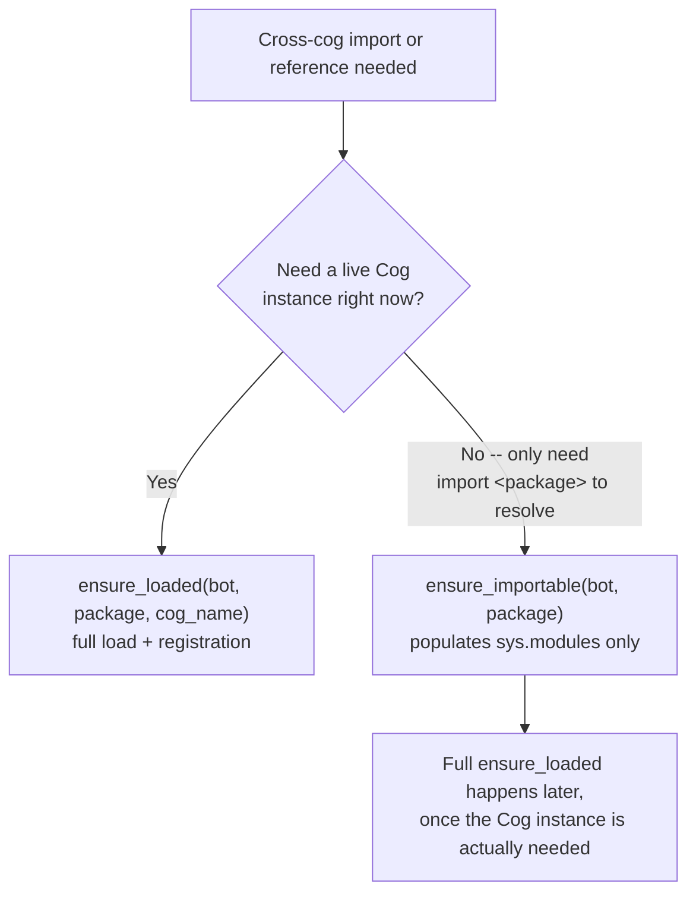
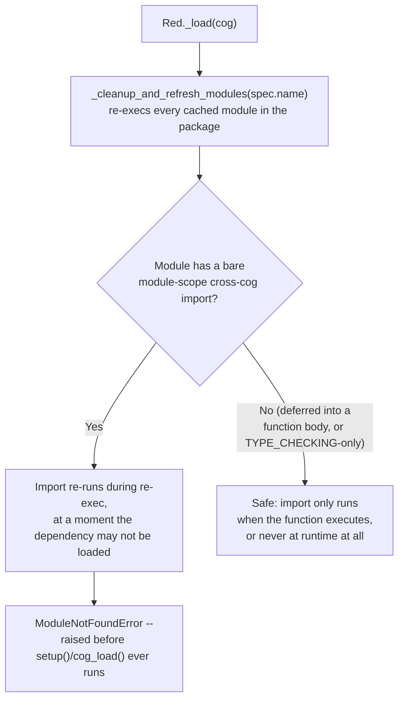
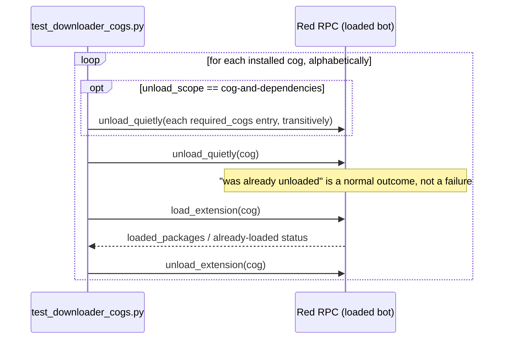

# Cross-cog dependency loading

## Overview

Every cog in this repo except `corridor` depends on at least one other cog
in the same repo (`pixelagents` needs `corridor`; `floorplan` needs both).
Red-DiscordBot has no built-in mechanism for this — confirmed against Red's
own source (`redbot/core/bot.py`'s `load_extension`/`_pre_connect`,
`redbot/core/core_commands.py`'s `_load`/`_reload`, and the entire
`redbot/core/_downloader/` package never read `required_cogs` at load or
install time). Red's own cog-creator docs say so explicitly:

> `required_cogs` (dict mapping a cog name to repo URL) — a dict of required
> cogs that this cog depends on... **Downloader will not deal with this
> functionality but it may be useful for other cogs.**

So `required_cogs` in `info.json` is descriptive metadata for humans, not
something Red enforces. Every cog here hand-rolls its own dependency
loading in `setup()`/`cog_load()`, via `bot._cog_mgr.find_cog(name)` +
`bot.load_extension(spec)` — the same two calls Red's own loader uses
internally. This doc is the single place that explains the resulting
pattern.

This doc only covers *acquiring* a dependency reference. What happens to
that reference afterward, if the dependency itself reloads independently of
the dependent that holds it, is covered separately in
[`dependency-cascades.md`](dependency-cascades.md).

## The two dependency-loading tools

Both live in `corridor/dependency_loader.py`, with one exception for
bootstrapping corridor itself (see the next section):

| Tool | What it does | When to use it |
|---|---|---|
| `ensure_loaded(bot, package, cog_name)` | Fully loads the dependency as a registered Red Cog (`bot.load_extension` + `bot.add_loaded_package`). Returns the live Cog. | Whenever you have a synchronous need for a live instance — which in practice is every cross-cog dependency here: corridor (every dependent calls `register_dependent` synchronously in its own `cog_load()`) and pixelagents-from-floorplan alike. |
| `ensure_importable(bot, package)` | Makes `import <package>` resolvable (`spec.loader.load_module()`, the same step `load_extension` does internally) *without* registering it as a loaded Cog. | You need cross-module imports at `setup()` time (e.g. `from pixelagents.application.office import OfficeService` at the top of `floorplan/adapters/cog_base.py`) but the full Cog load itself needs to happen elsewhere/later. floorplan's `setup()` uses this for pixelagents before importing `.floorplan` (which pulls in that module-scope import), then `cog_load()` separately does the real `ensure_loaded` once the Cog instance is actually needed. |

The choice comes down to one question — does the caller need a live Cog
instance right now, synchronously?

`ensure_importable` exists specifically for a dependency the Downloader RPC
smoke test (below) loads *after* the caller in its alphabetical run: a full
`ensure_loaded` there would leave that dependency registered as
already-loaded by the time the smoke test tries to load it on its own turn,
turning a genuine fresh-load check into a false pass/fail. Reach for
`ensure_loaded` for everything else.

## The module-scope-import landmine

Red's `_load` always calls `_cleanup_and_refresh_modules(spec.name)`
*before* `bot.load_extension(spec)` — this re-execs every already-cached
`sys.modules` entry matching the package or its submodules, unconditionally,
regardless of whether this is a fresh load or a reload.

Concretely: a heavily-cached module (e.g. a Cog's own `adapters/cog_base.py`,
imported by every other adapter file) with a hard
`from corridor.domain import X` at module scope re-runs that import on every
reload attempt — including one made at a moment corridor isn't currently
loaded — and crashes with `ModuleNotFoundError` before `setup()` ever gets a
chance to load it. This is exactly the shape of the trace in
`pixelagents/__init__.py`'s module docstring: a module-scope
`from corridor.domain import ReplyField` in
`pixelagents/adapters/replies.py`, used only in type annotations, hit it for
real.

The fix has two forms, both already used in this repo:

- **Annotation-only use** (a name that's never constructed, only referenced
  in a type hint): move the import under `if TYPE_CHECKING:` — see
  `pixelagents/adapters/replies.py`, `floorplan/adapters/replies.py`.
  `TYPE_CHECKING`-guarded imports are unaffected by any of this because
  they never execute at runtime, so they stay at the top of the file.
- **Runtime construction** (a name actually built, not just annotated): defer
  the import into the function body that needs it instead of module scope —
  see the `ensure_corridor_loaded`/`ensure_loaded` imports inside
  `floorplan/adapters/cog_base.py`'s `cog_load()` rather than its top-level
  import block.

`floorplan/adapters/admin_commands.py` takes a different route to the same
safety: its `ReplyField` (constructed, not just annotated, inside
`cmd_status`) is imported at plain module scope, not deferred into the
function body. That's only safe because `floorplan/__init__.py` wraps the
whole `from .floorplan import Floorplan as Floorplan` chain — which
transitively imports `admin_commands.py` — in a bare `try/except
ImportError`, so contract tooling can import the `floorplan` package
without Red/discord.py installed. A corridor-import failure during a
cache-refresh re-exec is caught by that same except clause and silently
swallowed, leaving `Floorplan` unbound until `__getattr__` (or `setup()`,
which redoes the import once corridor is actually loaded) resolves it
lazily. This works today, but it's a broader, coarser safety net than the
deferred-import pattern used elsewhere in this doc — don't assume a bare
`except ImportError` wrapping an unrelated concern will always happen to sit
between a module-scope cross-cog import and Red's loader; the
deferred-import-in-the-function-body pattern is the one to copy for a new
cog.

**This can't be fixed by making corridor "not unloadable while dependents
exist."** Red's own startup autoload order is not guaranteed — a bot's own
log can show corridor getting side-effect-loaded out of its configured
autoload slot by a dependent's own bootstrap, producing a harmless but real
`PackageAlreadyLoaded` message. A plain `[p]load floorplan` (or Red's own
autoload) can try to exec floorplan's module before corridor has ever been
imported at all in that process — and Python evaluates top-level import
statements before `setup()`/`cog_load()` even exists as a callable, so no
async bootstrap logic can run first no matter what. Deferred (function-body)
imports of anything that touches corridor at runtime are load-bearing for
this reason, not coding debt to remove.

## The corridor bootstrap duplication pattern

You cannot `from corridor.dependency_loader import ensure_loaded` before
corridor itself is loaded and importable, so every dependent needs its own
minimal, hand-rolled way to get corridor loaded in the first place. Once
corridor *is* loaded, everything else goes through the shared
`corridor.dependency_loader` tools above instead.

| Cog | Has its own `dependency_loader.py`? | How it bootstraps corridor |
|---|---|---|
| `architect`, `deskutils`, `floorplan`, `painter`, `pico`, `pixelagents`, `suggestionbox`, `testbench`, `toolbox`, and the `.cookiecutter/cog-cookiecutter` template | Yes | A local `ensure_corridor_loaded` (hand-rolled `find_cog`/`load_extension`, not going through `corridor.dependency_loader`), duplicated verbatim across all of them — this is structural, not an oversight. |
| `cctv` | No | Calls `from corridor.dependency_loader import ensure_loaded` directly, in both `setup()` and `cog_load()`, instead of hand-rolling a local `ensure_corridor_loaded`. |

`cctv`'s shortcut only works because, on every path this repo currently
exercises, something else has already caused `corridor` (and therefore
`corridor.dependency_loader`) to be imported into `sys.modules` before
cctv's own `setup()` runs. If cctv were ever the very first cog Red
attempted to load in a fresh process, that import would raise
`ModuleNotFoundError` before `ensure_loaded` had a chance to load corridor
at all — the same landmine described above, just one step earlier in the
sequence. Treat this as a known fragility specific to cctv, not a second
supported pattern to copy into a new cog.

## The CI smoke test's unload-then-test mechanism

The `.github/workflows/check-cogs.yml` job runs
`.github/actions/test-red-discordbot-downloader-local` — a copy of
`nntin/d-flows/actions/test-red-discordbot-downloader` vendored into this
repo (pinned at `NNTin/d-flows@873892e7d5f5fa19737b93e01f608f52a8f65a0f`)
so this repo can iterate on CI behavior without waiting on upstream. It
installs and loads/unloads every non-shared-library cog in the repo,
**alphabetically**: `architect` → `cctv` → `corridor` → `deskutils` →
`floorplan` → `painter` → `pico` → `pixelagents` → `suggestionbox` →
`testbench` → `toolbox` (`contracts` is a `SHARED_LIBRARY`-type
installable, so Downloader's own `available_cogs` excludes it from this
list).

Before testing a cog, `test_downloader_cogs.py` (`exercise_cogs()`)
unconditionally `unload_quietly()`s that cog by name first, tolerating "was
already unloaded" as a normal outcome, not an error (see
`redbot.core.core_commands.CoreLogic._unload`'s `notloaded_packages`). That
way, its own `load_cog()` check always sees a genuine, fresh load
regardless of what an earlier cog's turn left loaded — an earlier cog's own
`cog_load()` may have already pulled a later, alphabetically-later cog in
as a real dependency side effect (e.g. `floorplan`'s `cog_load()` does a
plain, synchronous `ensure_loaded(bot, "pixelagents", ...)`, which would
otherwise make `pixelagents`'s own turn see it as already loaded). A
matrixed `unload_scope` input (`cog` vs. `cog-and-dependencies`)
additionally forces every cog named in the target's `required_cogs`
(transitively) unloaded first too, exercising a genuine cold-start
dependency bootstrap rather than only ever warm-starting off whatever an
earlier cog's turn left in place.

## No asyncio-level lock guards the webview build

`pixelagents/infrastructure/webview_build.py::ensure_webview_built` takes a
real OS-level lock (`fcntl.flock` on a `webview_build.lock` file in the
cog's data directory) around the actual `git`/`npm`/`vite` steps, not an
`asyncio.Lock`. The build runs inside `asyncio.to_thread` — a blocking
subprocess on a real OS thread — and `asyncio.Task.cancel()` can only stop
the coroutine awaiting that thread; it cannot kill the thread or the
subprocess already running inside it. An `asyncio.Lock` releases the moment
its `async with` block unwinds on `CancelledError`, which would let a
second caller start a second, genuinely concurrent build against the same
git working tree while the first (cancelled-but-still-running) build is
still in flight. A `flock` is held by the OS against the open file
descriptor for as long as the process holding it is alive, independent of
what happens to any asyncio Task above it, so a second caller queues
instead of racing.

## Related docs

- [`dependency-cascades.md`](dependency-cascades.md) — what happens to an
  already-acquired dependency reference when the dependency itself reloads.
- [`architecture.md`](architecture.md) — the full cross-cog dependency
  graph these tools resolve at load time.
- [`corridor.md`](corridor.md) — the permission/reply/A2A services every
  dependent resolves corridor for in the first place.
