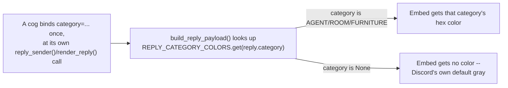

# Embed colors: a shared category scheme

## Overview

Every cog's `discord.Embed` replies are built at one shared place —
`build_reply_payload` in `corridor/adapters/api.py` — so a `color` set
there applies consistently across the whole repo instead of being a
per-cog, one-off choice. Cogs are grouped into three visual categories,
each mapped to one Discord accent color. A cog with no clear category gets
no color at all — Discord's own default gray — rather than being forced
into a bucket that doesn't fit. Uncategorized is a valid, deliberate choice
for a cog, not a gap to close.



## Domain model

`corridor/domain/models.py` defines `ReplyCategory`, a `StrEnum` with three
members, and a `category: ReplyCategory | None` field on `RenderedReply`.
`None` means "no opinion" — the absence of a category, not a fourth
category.

`corridor/domain/reply_colors.py` holds the actual mapping:

```python
REPLY_CATEGORY_COLORS: dict[ReplyCategory, int] = {
    ReplyCategory.AGENT: 0x5865F2,      # Discord blurple
    ReplyCategory.ROOM: 0x1ABC9C,       # Discord teal
    ReplyCategory.FURNITURE: 0xF1C40F,  # Discord gold
}
```

| Category  | Color           | Hex       |
|-----------|-----------------|-----------|
| Agent     | Discord blurple | `#5865F2` |
| Room      | Discord teal    | `#1ABC9C` |
| Furniture | Discord gold    | `#F1C40F` |
| *(none)*  | Discord default gray | —   |

Both the enum and the mapping live in `corridor/domain`, which has zero
framework imports by design (see `agent_directory.py`'s docstring for the
one deliberate exception) — `REPLY_CATEGORY_COLORS` stores plain hex ints,
not `discord.Colour`. `corridor/adapters/api.py`'s `build_reply_payload` is
the only place that turns a `category` into a real embed `color`, via
`REPLY_CATEGORY_COLORS.get(reply.category)`.

Both the enum and the mapping are corridor's to own: corridor already is
"shared reply style and permission tiers for office-cogs"
(`corridor/info.json`), and every category color is applied through
corridor's one shared `build_reply_payload`.

## Category assignments

| Category  | Cogs                              |
|-----------|------------------------------------|
| Agent     | `pico`, `architect`, `painter`     |
| Room      | `corridor`, `floorplan`, `cctv`    |
| Furniture | `toolbox`, `testbench`, `deskutils` |
| *(none)*  | `pixelagents`, `suggestionbox`     |

`deskutils`' commands are utilities (time, text-counting, message-quoting)
in the same vein as `toolbox`/`testbench`, so it sits in Furniture.
`painter` (a color-only A2A agent) and `cctv` (the office dashboards)
each pass their own `category=` at their own binding site, exactly like
every other cog in the table — adding a category to a new cog is always
this same one-line change, never a structural one.

`pixelagents` (vendors/builds the webview for CCTV to serve, with almost
no chat-facing surface of its own) and `suggestionbox` (an MCP feedback
server, likewise reply-light) don't clearly fit Agent, Room, or Furniture,
so both stay uncategorized rather than being guessed into a bucket. Either
can be folded into a category later without any structural change — just
pass `category=` at its own binding site (see API below).

Discord's Components V2 UI surfaces (e.g. `discord.ui.Container`'s
`accent_colour`) are a separate rendering path from `discord.Embed` and
are out of scope here — this scheme covers `discord.Embed` colors only.

## API: how a cog binds its category

`category` and `ReplyIdentity` (owner name + avatar) are independent
parameters throughout the reply pipeline (`ReplyService.render`,
`CogBase.render_reply`/`send_reply`, `ReplySender`) — one is never derived
from the other. Every cog binds its own category exactly once, at the same
place it already binds everything else about how its replies render, so no
call site repeats it:

- **`ReplySender`** (`corridor/adapters/reply_sender.py`) binds `category`
  once per cog, alongside `owner`/`avatar_path`, via
  `CogBase.reply_sender(owner=..., avatar_path=..., category=...)`. `pico`,
  `architect`, `painter`, `testbench`, `toolbox`, `deskutils`, and
  **corridor itself** (bound in `CogBase.__init__`, since corridor is a
  Room cog like `floorplan`) each pass their own category at that one
  binding site. corridor's own commands (`corridor/adapters/commands.py`)
  go through `self._reply.send_reply(...)` the same way every dependent
  cog's commands go through their own bound `self._reply` — not
  `self.send_reply(...)` directly — so `category=` is never repeated
  across its reply call sites. `suggestionbox` also binds via
  `reply_sender` but passes no `category`, staying uncategorized.
- **`floorplan/adapters/replies.py`** and **`cctv/adapters/replies.py`**
  both bypass `ReplySender` (each needs interaction-aware dispatch) but
  still bind `category=ReplyCategory.ROOM` at the one `render_reply(...)`
  call every one of their commands funnels through.
- **`pixelagents/adapters/replies.py`** passes no `category`, so its
  replies stay the default gray — the same neutral default any omitted
  `category` argument produces, not a special case.

`category` is `None` in `ReplyMode.TEXT`, the same as
`author_name`/`author_icon_attachment` — there's no embed to color in that
mode.

## Design rationale

`category` is kept independent of `ReplyIdentity` rather than folded into
it because the two answer different questions: identity is "who is
sending this," color is "what visual bucket does this cog belong to." A
cog can bind one without the other — `pixelagents` binds an identity with
no category and stays uncategorized, and nothing stops a future cog from
wanting a category with no author identity. Collapsing `category` into
`ReplyIdentity` would make that combination impossible.

Leaving a cog uncategorized is a first-class outcome of this design, not a
placeholder waiting to be filled in: `pixelagents` and `suggestionbox`
don't map cleanly onto "agent," "room," or "furniture," and forcing a fit
would make the scheme less meaningful for the cogs that do fit cleanly.
