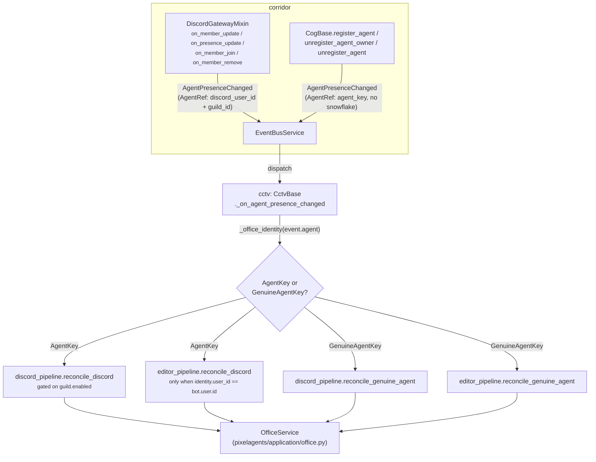
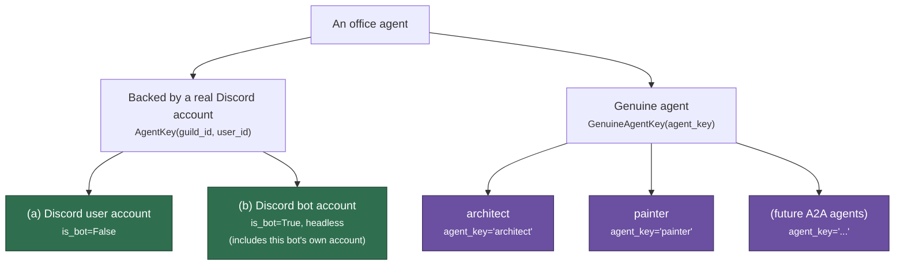
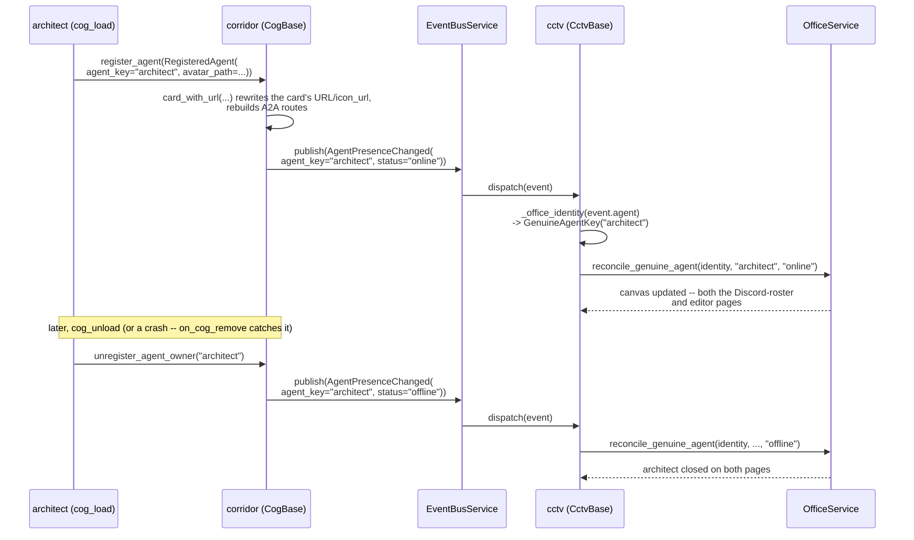
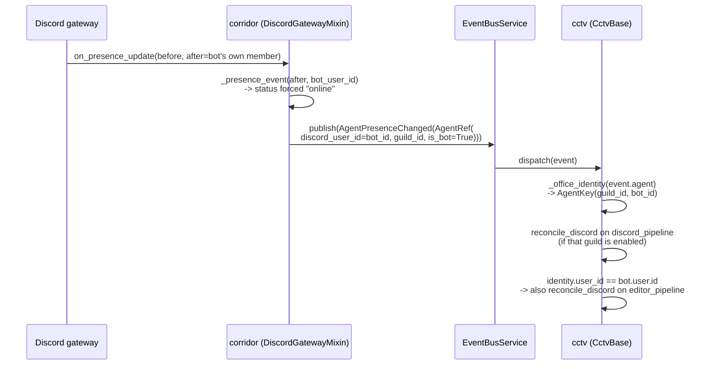

# Office agent identity: genuine agents alongside Discord accounts

## Overview

CCTV's office canvas (`cctv/`, see `docs/cctv-design.md`) renders every
entity a guild might see as "present" in one shared roster: real Discord
members, and A2A agents that have no Discord account at all (architect,
painter). Both kinds are identified, reconciled, and rendered through the
same `AgentPresenceChanged` event and the same `OfficeService`
(`pixelagents/application/office.py`) — a Discord member and a genuine
agent are structurally different identities, but neither gets a special
canvas, a special wire message, or a per-guild copy of anything.

A **genuine agent** is an LLM agent reachable over A2A, registered into
corridor's `AgentDirectoryService`. It has no Discord snowflake and no
guild scope — it's visible on the canvas unconditionally, the moment it
registers, everywhere the canvas is rendered. Registering it (via
`corridor.register_agent`) is the only step its own cog performs; presence
publishing and canvas visibility follow automatically.

## There is only one canvas

`OfficeService` is instantiated once per pixelagents-backed pipeline
(`cctv/adapters/cog_base.py`'s `_create_pipelines`, one per
`OfficeStateKind` — `DISCORD` and `EDITOR`), not once per guild. Its
outward-facing methods take no guild parameter and apply no guild filter:
a human present in two guilds is one merged entry on the canvas, keyed by
their bare Discord user ID. A genuine agent, having no guild membership at
all, needs exactly one entry — never a per-guild replica, never a fan-out
step.

## Architecture

Two independent publishers feed the same `AgentPresenceChanged` event
into corridor's event bus:

- **`corridor/adapters/discord_gateway.py`'s `DiscordGatewayMixin`**
  normalizes raw Discord gateway callbacks (`on_member_update`,
  `on_presence_update`, `on_member_join`, `on_member_remove`) into
  `AgentPresenceChanged`, for every guild member — humans, other bots,
  and the bot's own account alike. It publishes unconditionally: no
  guild-enabled or include-bots filtering happens here, since corridor is
  a leaf package with no knowledge of any subscriber's display policy.
  The bot's own account gets no special identity — it's a real Discord
  member with a real snowflake, `_presence_event` only forces its status
  to `"online"` rather than reading the bot's own (usually absent)
  presence.
- **`corridor/adapters/cog_base.py`'s `CogBase.register_agent` /
  `unregister_agent_owner` / `unregister_agent`** publish
  `AgentPresenceChanged` for a genuine agent's directory membership
  itself — registering *is* going online, unregistering (explicitly, or
  via `on_cog_remove`'s defensive cleanup when a registrant's cog is
  pulled without a clean `cog_unload`) *is* going offline. No agent cog
  calls `publish_event` for its own presence.

Both land on the same corridor event bus, and cctv's one subscriber
resolves whichever identity shape the event carries:



A genuine agent reaches both the Discord-roster page and the editor page
unconditionally (it has no guild to gate against). A Discord identity
reaches the editor page only when it's the bot's own account — every
other Discord member appears on the Discord-roster page alone.

## The three categories

| | Identity | Guild scope | `is_bot` | `AgentRef` shape |
|---|---|---|---|---|
| **(a) Discord user account** | `AgentKey(guild_id, user_id)` | Per-guild membership, merged cross-guild into one canvas entry | `False` | `discord_user_id`/`guild_id` set, `agent_key=None` |
| **(b) Discord bot account** (including this bot's own account) | `AgentKey(guild_id, user_id)` — same shape as (a) | Same as (a) | `True`, rendered headless/"ghost" | `discord_user_id`/`guild_id` set, `agent_key=None` |
| **(c) Genuine agent** | `GenuineAgentKey(agent_key)` — no Discord snowflake | None — visible on the one shared canvas unconditionally | `True` (not a rendering flag here, just the value corridor's own presence-publisher sets) | `discord_user_id=None`, `guild_id=None`, `agent_key="architect"` (etc.) |

(a) and (b) are the same identity shape — `is_bot` is a rendering flag on
top of an otherwise-identical Discord-account identity. (c) is
structurally different: it isn't a Discord account with a flag toggled,
it's a different *kind* of entity with no snowflake to key off at all.
`AgentKey`'s fields are non-nullable Discord snowflakes by construction,
so a genuine agent gets its own parallel identity type rather than
`AgentKey(guild_id=None, user_id=None)` or an overloaded `is_bot`.



## Domain model / schema

**`pixelagents/domain/office.py`** — the identity types `OfficeService`
accepts:

```python
@dataclass(frozen=True, slots=True)
class AgentKey:
    guild_id: SnowflakeId
    user_id: SnowflakeId


@dataclass(frozen=True, slots=True)
class GenuineAgentKey:
    """Identity of a genuine agent -- one with no Discord account.
    `agent_key` is a short, stable slug ("architect"), built from
    corridor's AgentRef.agent_key."""

    agent_key: str


OfficeIdentity: TypeAlias = AgentKey | GenuineAgentKey
```

Every `OfficeService` entry point that once took only `AgentKey` accepts
`OfficeIdentity`: `is_tracked`, `highlight_agent`, `unhighlight_agent`,
`start_tool_activity`, `set_status`. Two pairs stay Discord-only vs.
genuine-only rather than sharing one signature, since only a genuine agent
has no real Discord message to key an activity bubble off of:
`send_message_activity`/`clear_message_activity` (Discord,
`MessageSnapshot`-keyed) vs. `reconcile_genuine_agent`/
`close_genuine_agent`/`send_genuine_agent_activity`/
`clear_genuine_agent_activity` (genuine, `GenuineAgentKey`-keyed).

**Webview agent-ID derivation is disjoint by sign, not by registry.**
`to_agent_id(user_id)` always returns a negative JS-safe integer. A
genuine agent gets a positive one instead, derived from a stable hash of
its `agent_key`:

```python
def to_genuine_agent_id(agent_key: str) -> int:
    digest = hashlib.sha256(agent_key.encode()).digest()
    mapped = int.from_bytes(digest[:8], "big") % JS_MAX_SAFE
    return mapped if mapped != 0 else JS_MAX_SAFE
```

Disjointness by sign needs no collision registry: a genuine agent's ID can
never collide with a real Discord user's, and adding a third or fourth
genuine agent requires no coordination — each is hashed independently.

**`corridor/domain/models.py`'s `AgentRef`** — the wire shape both
publishers above construct:

```python
@dataclass(frozen=True, slots=True)
class AgentRef:
    discord_user_id: int | None
    guild_id: int | None
    is_bot: bool
    agent_key: str | None = None
```

`agent_key` is set exactly when `discord_user_id`/`guild_id` are both
`None`, and `None` whenever they're set — an `AgentRef` is either a
Discord account (identified by its snowflakes) or a genuine agent
(identified by `agent_key`), never a mix of both identity schemes.

**`AgentPresenceChanged`** — one full presence snapshot per change, for
either identity shape:

```python
@dataclass(frozen=True, slots=True)
class AgentPresenceChanged:
    agent: AgentRef
    display_name: str
    status: Literal["online", "idle", "dnd", "offline"]
    activities: tuple[AgentActivity, ...] = ()
```

One rich event per presence change, not four granular ones
(join/leave/status/activity-change): every one of those needs the same
full-snapshot reconstruction to call `reconcile()`/`reconcile_genuine_agent()`
anyway, so a granular split would only add event types without adding
information. `status="offline"` covers both a real Discord
offline/invisible status *and* a member actually leaving the guild — there
is no separate "member left" event.

`cctv/adapters/cog_base.py`'s `_office_identity` is the one resolver every
subscriber handler calls before dispatching:

```python
def _office_identity(agent: AgentRef) -> OfficeIdentity | None:
    if agent.guild_id is not None and agent.discord_user_id is not None:
        return AgentKey(agent.guild_id, agent.discord_user_id)
    if agent.agent_key is not None:
        return GenuineAgentKey(agent.agent_key)
    return None  # neither shape present -- malformed AgentRef
```

## Key flows

A registered agent's presence, from `cog_load` through to the canvas:



The bot's own Discord presence updates flow the identical event path, just
resolving to the ordinary Discord identity shape instead:



## API reference

**`corridor.adapters.cog_base.CogBase`** (reached through
`self._corridor` in a dependent cog):

- `async register_agent(agent: RegisteredAgent, *, owner: str) -> None` —
  rewrites the card's URL/`icon_url`, stores it, rebuilds A2A routes, and
  publishes `AgentPresenceChanged(status="online")` for it.
- `async unregister_agent_owner(owner: str) -> None` — removes every agent
  `owner` registered and publishes `status="offline"` for each.
- `async unregister_agent(agent_key: str) -> None` — removes one agent by
  key and publishes `status="offline"` for it, a no-op if absent.
- `list_agents() -> tuple[RegisteredAgent, ...]` — every currently
  registered agent; pico calls this once per turn to build one
  `consult_<agent_key>` tool per entry.
- `watch_agent_events(subscriptions, *, owner) -> tuple[RegisteredAgent, ...]`
  — subscribes to the given `(event_type, handler)` pairs and snapshots
  the directory in one event-loop turn, so cctv's startup never misses an
  agent that registered between the subscribe call and the snapshot read.

**`pixelagents.application.office.OfficeService`** — the genuine-agent
surface: `reconcile_genuine_agent(identity, display_name, status,
activities=())`, `close_genuine_agent(identity)`,
`send_genuine_agent_activity(identity, content)`,
`clear_genuine_agent_activity(identity)`, plus the shared
`OfficeIdentity`-typed `is_tracked`/`highlight_agent`/`unhighlight_agent`/
`start_tool_activity`/`set_status`.

## Design rationale

**Presence-publishing lives in corridor's `register_agent`, not in each
agent's own `cog_load`/`cog_unload`.** A registered A2A agent's directory
membership *is* its office-canvas presence — there is no independent
"presence" concept to hand-roll. Publishing it at the one place that
already knows the full lifecycle (`register_agent`, `unregister_agent_owner`,
`unregister_agent`, and the defensive `on_cog_remove` path) means a
registering cog cannot forget to publish, cannot publish a stale snapshot,
and cannot leak an "online" agent behind after its own `cog_unload` throws
partway through — `on_cog_remove` fires unconditionally regardless.
`architect/adapters/cog_base.py` and `painter/adapters/cog_base.py` both
confirm this: neither has a `_publish_presence` method of its own: each
calls `corridor.register_agent(...)` and corridor does the rest.

**Activity-publishing does not live there — each agent hand-writes its
own `_publish_activity` today.** `architect/adapters/cog_base.py` and
`painter/adapters/cog_base.py` each define their own
`_publish_activity(summary: str)`, publishing `AgentReplied(agent=<their
own AGENT_REF>, summary=summary)` directly onto corridor's bus, wrapped in
its own try/except. Unlike presence — one shape, one trigger
(registered/unregistered) — an activity event fires many times per turn
with content only the agent's own tool-execution loop has (what it just
said, which tool it just ran), so there is no shared lifecycle moment for
corridor to hook the way `register_agent` hooks presence. Each agent
publishing its own `AgentReplied` at the moment it actually has something
to report is the current, complete design, not a placeholder for a future
extraction.

## Non-goals

- **No per-guild fan-out or replication.** A genuine agent needs exactly
  one canvas entry, not one per guild — see "There is only one canvas"
  above.
- **No change to how Discord user/bot accounts are identified or
  rendered.** `AgentKey`/`is_bot`/headless semantics for (a) and (b) are
  unchanged by any of the above; genuine agents add a third, parallel
  identity shape alongside them.
- **No `isExternal`/`isHeadless` distinction for genuine agents.** A
  genuine agent renders with the same `isExternal=True`/`isHeadless=True`
  ghost treatment a Discord bot gets — the safe, already-shipped default,
  not a value locked in as a deliberate design statement about what a
  genuine agent visually *should* be.
