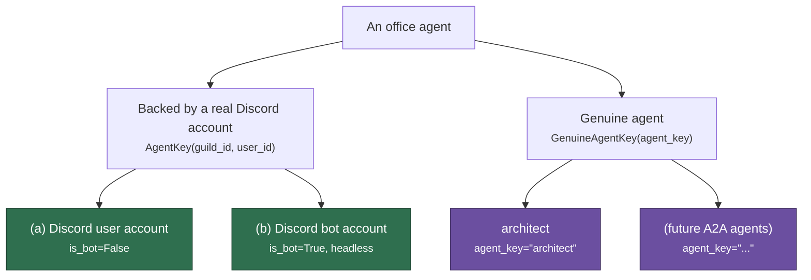
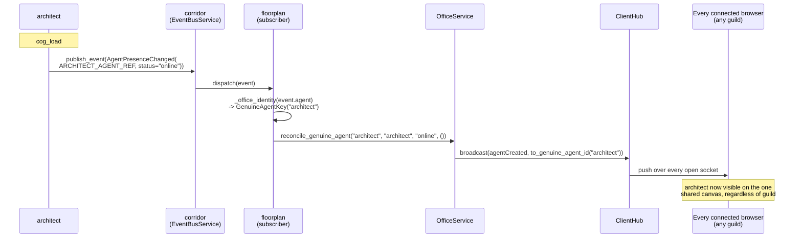

# Office agent identity: genuine agents alongside Discord accounts

> **Status: implemented.** Written after discovering that architect's
> `AgentPresenceChanged(agent=ARCHITECT_AGENT_REF, ...)` (see
> `docs/corridor-pubsub-design.md`) was published successfully but
> silently dropped by floorplan's subscriber, since
> `pixelagents.domain.office`'s `AgentKey`/`AgentSnapshot`/`OfficeService`
> were Discord-snowflake-shaped by construction and had no representation
> for an agent that isn't a Discord account at all. Every item in the
> "Implementation checklist" below has landed.
>
> **Consumer topology updated by [`cctv-design.md`](cctv-design.md).** CCTV now
> owns both rosters and uses this same identity model. The Discord page includes
> enabled-guild members plus registered agents; the editor page includes
> registered agents plus the bot account. Former Floorplan/Architect subscriber
> paths below are historical.
>
> **Extended by architect's own dashboard consuming this too.** Originally
> this doc only covered floorplan's canvas gaining genuine-agent support.
> `architect/adapters/presence_subscription.py` now reconciles the same
> `AgentPresenceChanged` events onto architect's own, separate
> `OfficeService` instance (`docs/architect-design.md` §5/§9 item 11),
> plus one entry with no corridor/`AgentDirectoryService` involvement at
> all: the bot's own Discord account, represented as a synthetic
> `GenuineAgentKey`, since it was never an A2A agent. `AgentPresenceChanged`
> is now also published by corridor itself (`register_agent`/
> `unregister_agent_owner`/`unregister_agent`), not just by architect's own
> `cog_load`/`cog_unload` — see `docs/agent-directory-design.md`.
> `reconcile_genuine_agent`'s own signature and folding behavior
> (described below) are unchanged by this — only a second consumer was
> added.

## Motivation

architect is the first **genuine agent**: an LLM agent reachable over A2A,
with no Discord account and no guild scope. It won't be the last — more
agents will join over A2A/agent cards. Today, the only way an entity shows
up on floorplan's office canvas is by being a Discord guild member
(human or bot). Genuine agents need a real place in that model, not a
one-off workaround bolted onto architect specifically — this needs to be
a clean, reusable identity concept from the start, since "many
expansions" are coming.

## The surprising part: there is already only one canvas

Before designing anything, it's worth stating a finding that simplifies
this considerably. It reads as though floorplan renders one *isolated*
office canvas per guild — it does not:

- `OfficeService` (`pixelagents/application/office.py`) is instantiated
  **once per floorplan Cog process**
  (`floorplan/adapters/cog_base.py::PixelAgentsBase.__init__`), shared
  across every guild floorplan serves — not one instance per guild.
- Its outward-facing methods (`existing_agents_message`,
  `bootstrap_messages`, and the `_send` broadcast callback `OfficeService`
  is constructed with) take **no guild parameter** and apply **no guild
  filter**. `_representative_agents()` collapses the whole
  `self._agents: dict[(guild_id, user_id), ...]` down to one roster keyed
  by bare `user_id` (`office.py`), before any of that data reaches a
  browser.
- `ClientHub` (`floorplan/infrastructure/client_hub.py`) has no concept of
  guild at all — `ClientState` tracks only `socket`/`user_id`/`is_editor`.
  `ClientHub.broadcast()` sends to every connected socket, unconditionally.
- `to_agent_id(user_id)` (`pixelagents/application/office.py`) derives the
  webview-safe agent ID from the bare Discord `user_id` alone — no guild
  dimension. A human present in two guilds already renders as **one**
  merged agent, today, by design (`is_user_active_in_other_guild` guards
  `spawn`/`close` from double-emitting for exactly this reason).

So floorplan already renders **one global, cross-guild-merged office**,
not N per-guild dashboards. This is confirmed intentional —
`floorplan/Architecture.md` describes a single, public, unauthenticated
dashboard page with no guild-context parameter.

**Consequence for this design:** "architect appears in every guild" does
not require any per-guild replication, fan-out, or synthetic per-guild
identity. It only requires that a genuine agent be representable in the
one shared roster at all. Once that's true, it's visible to every
connected browser exactly the way any Discord member already is — for
free. This ruled out the fan-out approach discussed before this doc
(previously "Option 1") — it was solving a per-guild problem that doesn't
actually exist.

## The three categories

| | Identity | Guild scope | `is_bot`/headless | corridor `AgentRef` shape |
|---|---|---|---|---|
| **(a) Discord user account** | `AgentKey(guild_id, user_id)` — a real Discord snowflake | Per-guild membership (merged across guilds into one canvas entry, per above) | `is_bot=False`, rendered as a normal sprite | `discord_user_id`/`guild_id` set, `is_bot=False` |
| **(b) Discord bot account** | `AgentKey(guild_id, user_id)` — same shape as (a), e.g. pico's own bot login | Same as (a) — a bot is a guild member like any other | `is_bot=True`, rendered headless/"ghost" (`isHeadless`) | `discord_user_id`/`guild_id` set, `is_bot=True` |
| **(c) Genuine agent** | **no Discord snowflake at all** — architect, and future A2A agents | None — not a guild member, visible on the one shared canvas unconditionally | Not modeled via `is_bot` (see below) | `discord_user_id=None`, `guild_id=None`, `is_bot=True`, `agent_key="architect"` |

(a) and (b) are **the same identity shape** today — `is_bot` is a rendering
flag on top of an otherwise-identical Discord-account identity. That's
correct and doesn't change. (c) is structurally different: it isn't a
Discord account with a flag toggled, it's a different *kind* of entity
with no snowflake to key off at all. Modeling it as
`AgentKey(guild_id=None, user_id=None)` (or reusing `is_bot=True` as a
stand-in) would be the wrong shape — `AgentKey`'s fields are
non-nullable `SnowflakeId`s for a reason, and "genuine agent" isn't "a bot
with no ID," it's a category of its own. This doc gives it a real,
parallel identity type instead of overloading `AgentKey`.



## Domain model changes

### `pixelagents/domain/office.py`: a parallel identity type

```python
@dataclass(frozen=True, slots=True)
class GenuineAgentKey:
    """Identity of a genuine agent -- one with no Discord account, e.g.
    architect. Parallel to AgentKey, never a variant of it: AgentKey's
    fields are real Discord snowflakes by construction, and a genuine
    agent doesn't have one to supply. `agent_key` is a short, stable slug
    ("architect") -- see corridor's AgentRef.agent_key, the field this is
    built from."""

    agent_key: str


# The identity shape every OfficeService entry point that used to take
# only AgentKey now accepts -- is_tracked, highlight_agent,
# unhighlight_agent, start_tool_activity, set_status, send_message_activity,
# clear_message_activity.
OfficeIdentity = AgentKey | GenuineAgentKey
```

### Webview agent-ID derivation: disjoint by sign, not by registry

`to_agent_id(user_id)` (`pixelagents/application/office.py`) always
returns a **negative** JS-safe integer (`-(user_id % JS_MAX_SAFE or
JS_MAX_SAFE)`). Genuine agents get a **positive** JS-safe integer instead,
derived from a stable hash of `agent_key`:

```python
def to_genuine_agent_id(agent_key: str) -> int:
    """Positive JS-safe integer, disjoint from to_agent_id's negative
    range by construction -- no collision registry needed. A stable hash
    (not Python's randomized hash()) so the same agent_key always maps to
    the same webview ID across restarts."""

    digest = hashlib.sha256(agent_key.encode()).digest()
    mapped = int.from_bytes(digest[:8], "big") % JS_MAX_SAFE
    return mapped if mapped != 0 else JS_MAX_SAFE
```

Disjointness by sign is deliberately simpler than trying to carve out a
sub-range of one shared ID space: zero risk of a genuine agent's ID ever
colliding with a real Discord user's, with no coordination required as
more genuine agents are added.

### `OfficeService`: a second, parallel roster

`OfficeService` gains a second internal store, alongside `self._agents`:

```python
self._genuine_agents: dict[str, GenuineAgentState] = {}
# GenuineAgentState: display_name, status ("online"/"offline"/...),
# activities -- mirrors what self._agents holds for Discord agents,
# minus anything guild-specific (there is none to hold).
```

New methods, mirroring the existing Discord-agent ones but without the
cross-guild merge logic (a genuine agent has exactly one entry, full
stop — there's no second guild's copy to reconcile against):

- `reconcile_genuine_agent(agent_key, display_name, status, activities)` —
  spawns/updates/closes based on `status`, the same shape as `reconcile()`
  for a Discord `AgentPresenceChanged`. `status="offline"` closes it,
  exactly like a Discord member going offline or leaving.
- `is_tracked`/`highlight_agent`/`unhighlight_agent`/`start_tool_activity`/
  `set_status`/`send_message_activity`/`clear_message_activity` change
  their parameter type from `AgentKey` to `OfficeIdentity`, branching
  internally (`isinstance(identity, GenuineAgentKey)`) only where the two
  paths differ (agent-ID derivation, and skipping the guild-merge checks
  that don't apply).

`_representative_agents()`'s output (consumed by `existing_agents_message`/
`bootstrap_messages`) is extended to fold `self._genuine_agents` into the
same roster every connecting browser already receives — no separate
bootstrap path, no separate wire message type. A genuine agent is just
another entry in `agents`/`agentMeta`/`folderNames`, keyed by its positive
`to_genuine_agent_id(agent_key)` instead of a negative Discord-derived one.

### `externalAgents`/`isHeadless`: an open question, deliberately not locked here

Every Discord-derived agent is unconditionally `isExternal=True` today —
the load-bearing comment in `office.py` explains why: this office
projection only ever mirrors real Discord accounts, which are external to
whatever "native" agent concept the webview's upstream wire protocol
(`core/asyncapi.yaml`, pixel-agents-hq/pixel-agents) originally modeled.
A genuine agent is arguably the *opposite* case — an actual LLM agent,
closer to what the wire protocol's `isExternal=False` path was designed
for than a mirrored Discord human ever was. Recommendation for v1:
**reuse `isExternal=True`/`isHeadless=True`** (the same ghost rendering a
Discord bot gets) as the safe, already-shipped default, and revisit with
upstream pixel-agents once there's real visual feedback on whether a
genuine agent deserves its own distinct treatment — the same
"verify against the real wire protocol, file findings upstream" process
`docs/corridor-pubsub-design.md`'s original design review followed. Not
resolved in this doc; flagged so it isn't silently decided by whichever
value is easiest to type at implementation time.

## corridor's `AgentRef` gains `agent_key`

`ARCHITECT_AGENT_REF = AgentRef(discord_user_id=None, guild_id=None,
is_bot=True)` (`architect/adapters/cog_base.py`) was a placeholder — it
has no way to distinguish one genuine agent from a second one that also
has no Discord account. corridor's `AgentRef` (the schema source of truth
for this bus, per `docs/corridor-pubsub-design.md`) gains a new field:

```python
@dataclass(frozen=True, slots=True)
class AgentRef:
    discord_user_id: int | None
    guild_id: int | None
    is_bot: bool
    agent_key: str | None = None
    """A stable slug identifying a genuine agent (e.g. "architect").
    Required (non-None) exactly when discord_user_id/guild_id are both
    None; must be None whenever they're set -- an AgentRef is either a
    Discord account (identified by its snowflakes) or a genuine agent
    (identified by agent_key), never a mix of both identity schemes."""
```

Additive field, default `None` — every existing `AgentRef(...)`
construction site (floorplan's subscriber guards, pico's `ReplyTool`,
testbench's manual UI) is unaffected. `ARCHITECT_AGENT_REF` becomes:

```python
ARCHITECT_AGENT_REF = AgentRef(
    discord_user_id=None, guild_id=None, is_bot=True, agent_key="architect"
)
```

## floorplan's subscriber: resolve an identity instead of dropping one

The former `_agent_key()` (`floorplan/adapters/event_subscriptions.py`)
returned `AgentKey | None`, and every handler treated `None` as "nothing
to do." It's now `_office_identity()`, an `OfficeIdentity | None`
resolver:

```python
def _office_identity(agent: AgentRef) -> OfficeIdentity | None:
    if agent.guild_id is not None and agent.discord_user_id is not None:
        return AgentKey(guild_id=agent.guild_id, user_id=agent.discord_user_id)
    if agent.agent_key is not None:
        return GenuineAgentKey(agent_key=agent.agent_key)
    return None  # neither shape present -- malformed AgentRef, not a real case
```

Each `_on_agent_*` handler dispatches to the Discord-shaped or
genuine-agent-shaped `OfficeService` call based on `type(identity)`,
instead of unconditionally calling the Discord-only methods. The
`None` case (an `AgentRef` with no Discord identity *and* no
`agent_key`) becomes the actual "nothing to render" case — no longer the
common path architect's every event took.



## Path to more agents

Today, architect hand-writes its own `_publish_presence`/`_publish_activity`
in `architect/adapters/cog_base.py`. That's fine for the first genuine
agent; it isn't a pattern worth making every future one re-derive.
**Recommendation, not designed in full here:** once a second genuine
agent exists, extract a small reusable helper (plausibly living in
corridor, since corridor already owns the event schema) that a new
A2A-agent cog can adopt with a few lines — given an `agent_key` and
`display_name`, wire the load/unload presence publish and an activity
callback for its own tool loop, the same shape `ToolLoopService.run`'s
`on_activity` already established for architect. Deferred until there's a
second real caller to design the extraction point against, rather than
guessing its shape from one example.

Separately, and explicitly **out of scope for this doc**: nothing here
designs *discovery* of genuine agents (how pico or a human finds a second
A2A agent's endpoint) — that was, at the time this doc was written, a
bot-owner manually pasting a URL into Red config (`[p]pico architecturl
<url>`), with no existing agent-identity registry anywhere in this codebase
to build on. That discovery story has since been solved: see
`docs/agent-directory-design.md` for corridor's `AgentDirectoryService`,
which pico now queries (`list_agents()`) instead of reading one
owner-configured URL. A different problem from the one this doc solves
(making a *known* genuine agent visible on the canvas) either way.

## Non-goals

- **No per-guild fan-out or replication.** Ruled out by the "only one
  canvas" finding above — a genuine agent needs exactly one entry, not
  one per guild.
- **No change to how Discord user/bot accounts are identified or
  rendered.** `AgentKey`/`is_bot`/headless semantics for (a) and (b) are
  unchanged; this doc only adds a third, parallel identity shape.
- **No A2A agent discovery/registry design.** See "Path to more agents"
  above.
- **No `isExternal`/`isHeadless` value locked in for genuine agents** —
  ships with the same safe default a Discord bot gets, revisited with
  upstream pixel-agents once there's real visual feedback.

## Implementation checklist

- [x] `pixelagents/domain/office.py`: `GenuineAgentKey`, `OfficeIdentity` union.
- [x] `pixelagents/application/office.py`: `to_genuine_agent_id`,
      `self._genuine_agents` store, `reconcile_genuine_agent`/
      `close_genuine_agent`, and the `OfficeIdentity`-typed variants of
      `is_tracked`/`highlight_agent`/`unhighlight_agent`/
      `start_tool_activity`/`set_status`. `send_message_activity`/
      `clear_message_activity` stayed `MessageSnapshot`/`AgentKey`-shaped
      (Discord-only); genuine agents got parallel
      `send_genuine_agent_activity`/`clear_genuine_agent_activity`
      instead, since they have no real Discord message to key off.
      Genuine agents fold into `existing_agents_message`/
      `bootstrap_messages`'s roster.
- [x] `corridor/domain/models.py`: `AgentRef.agent_key: str | None = None`;
      regenerated `corridor/corridor.yaml`
      (`corridor/event_catalog.py::build_contract()`).
- [x] `architect/adapters/cog_base.py`: `ARCHITECT_AGENT_REF` gained
      `agent_key="architect"`.
- [x] `floorplan/adapters/event_subscriptions.py`: `_agent_key` became
      `_office_identity` (returns `OfficeIdentity | None`); each
      `_on_agent_*` handler dispatches on the resolved identity's type.
- [x] Updated `docs/corridor-pubsub-design.md`'s guild-scoping note to
      describe the resolved behavior instead of an open gap.
- [x] Tests: `pixelagents` application tests for the new identity, ID
      derivation, and roster folding (`TestGenuineAgents`); floorplan
      subscriber tests for genuine-agent dispatch
      (`TestGenuineAgentDispatch`); architect's presence/activity tests
      assert `agent.agent_key == "architect"`.
