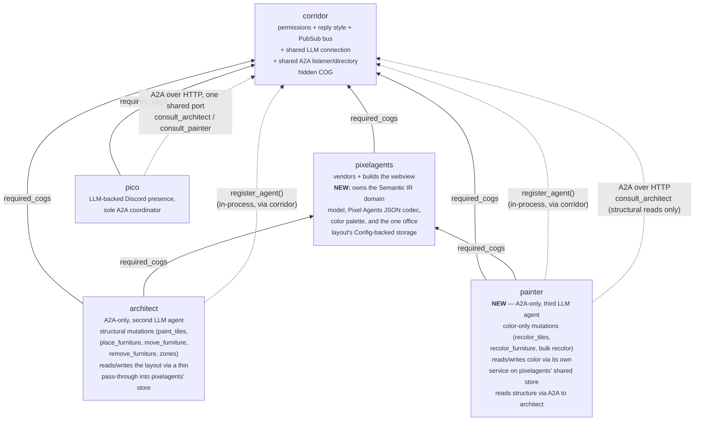
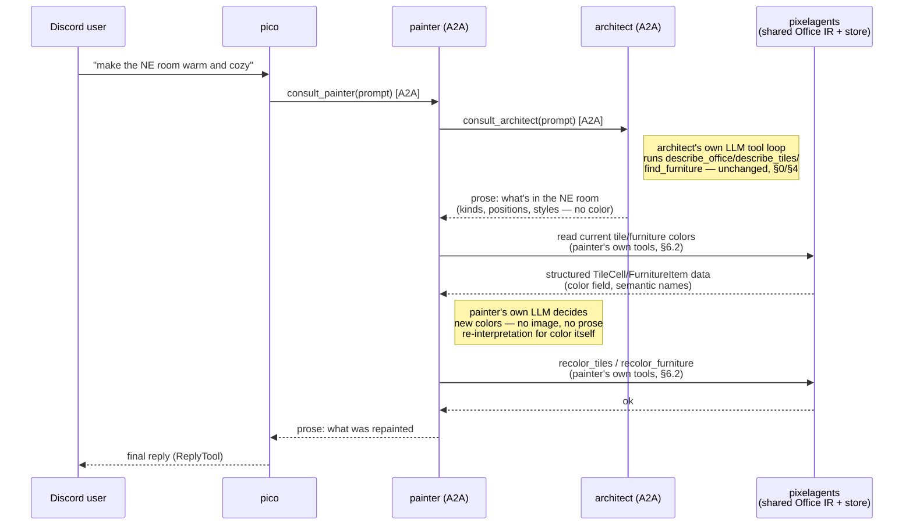

# painter design

Tracks [issue #55](https://github.com/pixel-agents-hq/pixel-agents-cogs/issues/55),
"Add new cog 'painter'". This doc covers the whole change as agreed with
the repo owner during design review — a single PR, in three parts that
must land together: (A) extracting architect's Semantic IR out of
`architect` into `pixelagents` so a second cog can reach it, (B) adding
wall color to that IR, and (C) the new `painter` cog itself. See
[`docs/architect-semantic-ir-design.md`](architect-semantic-ir-design.md)
for the IR as it exists today (pre-extraction) and
[`docs/architecture.md`](architecture.md) for the cross-cog picture this
doc extends.

## 0. Deliberate departures from the issue as filed

Two decisions here contradict the issue's own text. Recorded explicitly,
not silently reconciled:

- **No model vision in v1.** The issue frames painter as fetching
  `preview.png` and visually judging color from the rendered image.
  Confirmed with the repo owner: v1 has no vision capability at all.
  Painter infers/reads color entirely through tool calls against
  structured data (§3), never an image. This makes the issue's own open
  question ("clarify if it makes sense to implement this as an LLM tool
  response... painter's context is the image and a description") moot —
  there is no image in this iteration.
- **A2A-only, not Discord-facing.** The issue says painter "may answer
  the discord user" directly. That conflicts with this repo's documented
  convention (`docs/AGENTS.md`, `docs/architecture.md`): pico is "the
  sole A2A coordinator," and every other agent (today just `architect`)
  is A2A-only, invoked by pico, never Discord-facing itself. Confirmed
  with the repo owner: painter follows architect's shape — A2A-only,
  registered on corridor's shared A2A listener, invoked via pico's
  `consult_painter` tool exactly the way `consult_architect` already
  works. Pico still composes the Discord-facing reply.

## 1. Scope for v1

In scope:

- Recolor a single floor tile / region of floor tiles.
- Recolor a single wall tile / region of wall tiles (§5 — new capability,
  the underlying format already supports it, architect's decoder just
  discards it today).
- Recolor a single furniture item.
- Bulk recolor: every furniture item of a given kind+style at once (from
  the issue comment's tool ideas).
- Read tools sufficient for painter's own LLM to reason about "what
  colors are currently in use" without any image.

Out of scope for v1 (candidates for later issues):

- Any vision/image capability (`preview.png` fetch, pixel index API
  integration) — v1 attaches no image to its answer.
- Anything structural: adding/removing/moving furniture, converting
  floor↔wall, resizing/creating zones. Painter never gets architect's
  `paint_tiles`/`place_furniture`/`move_furniture`/`remove_furniture`
  tools or their shape — see §6.3 for why `paint_tiles` specifically
  can't just be narrowed and handed to painter.
- Discord-facing conversation loop, its own presence/appearance
  configuration beyond what corridor's agent directory already gives
  every registered agent.
- Any change to what architect's own LLM does or which tools it calls —
  see §0 and §4.

## 2. Package relationships

Notes:

- `painter -> pixelagents` and `architect -> pixelagents` are both
  `required_cogs` (in-process import + `ensure_loaded`), same pattern
  architect already uses for pixelagents' webview build today.
  `painter -> architect` is deliberately **not** a `required_cogs` edge —
  it is a networked A2A call, the same "networked, not coded" shape
  `pico -> architect` already is (`docs/architect-design.md` §7):
  painter degrades to "the `consult_architect` tool errors" if architect
  is unloaded/unreachable, it does not fail to load.
- This is a real (small) expansion of `pixelagents`' documented charter.
  Its own `Architecture.md` says it "owns nothing runtime-facing... those
  all moved to `floorplan`" (issue #21's split: vendor+build vs.
  consume). This doc's plan gives it a genuine runtime Config store and
  domain model. That's a deliberate choice, confirmed with the repo
  owner, made because: (a) it's already the one cog both `architect` and
  `painter` need as a dependency regardless, (b) unlike floorplan's
  office (which mirrors Discord presence and is fed by the pixel index
  API), architect's/painter's shared office is a distinct, independent
  layout with no presence-mirroring concerns, and (c) the alternative
  (painter reaching into architect's private Config identifier directly,
  or a new fourth package) was explicitly rejected in review.

## 3. End-to-end flow

Example: a Discord user asks pico to make the northeast room "warm and
cozy."

Key property this preserves: **color judgment happens entirely inside
painter's own LLM, against structured data painter reads/writes itself.**
Architect is only ever asked "what/where," never "what color," and never
gains new tools or new judgment calls — it stays exactly as described in
§0.

## 4. What does *not* change in architect

Confirmed explicitly with the repo owner: architect's own LLM, system
prompt, and tool surface (`describe_office`, `describe_tiles`,
`find_furniture`, `paint_tiles`, `place_furniture`, `move_furniture`,
`remove_furniture`, `create_zone`, ...) are unchanged. It remains
"colorblind" — painter never delegates a color decision to it. The only
change on architect's side at all is mechanical: `office_layout_repository.py`
becomes a thin pass-through to pixelagents' store (§5.3) instead of
architect's own private Config identifier, and its decode/encode calls
resolve to pixelagents' module instead of a local one. No new architect
tools, no system-prompt changes, no new A2A behavior.

## 5. Part A — extract the Semantic IR into `pixelagents`

### 5.1 What moves

| Today (architect) | Moves to (pixelagents) | Why |
|---|---|---|
| `architect/domain/office_ir.py` | `pixelagents/domain/office_ir.py` | The `Office`/`TileCell`/`FurnitureItem`/`Zone`/`Seat`/... dataclasses `decode`/`encode` produce and consume — can't move the codec without the types it speaks. |
| `architect/infrastructure/pixel_agents_adapter.py` | `pixelagents/infrastructure/pixel_agents_adapter.py` | The `decode`/`encode` functions themselves — the actual Pixel Agents JSON ⟷ IR codec. |
| `architect/infrastructure/color_names.py` | `pixelagents/infrastructure/color_names.py` | `decode()` calls `nearest_name()` directly; the semantic palette is intrinsic to the codec, not architect-specific. |
| Layout half of `architect/infrastructure/settings_repository.py` (`layout()`/`set_layout()` + the Config identifier's layout keys) | `pixelagents/infrastructure/office_layout_settings.py` (new) | The raw JSON blob's storage location — needs a home neither cog privately owns, so both can reach it without one depending on the other's Config partition. |

**Stays in architect** (nothing here moves): `architect/application/office_layout_service.py`
(structural mutation logic — `paint_tiles`, `place_furniture`,
`move_furniture`, `remove_furniture`, `create_zone`, etc.), `architect/tools/office_tools.py`
(architect's own LLM tool wrappers), `architect/infrastructure/furniture_styles.py`
(furniture style manifest — architect-specific, painter only needs style
*names* it already gets from architect's A2A reads, not the manifest
itself), architect's own non-layout settings (`max_tool_calls`,
`system_prompt`, `ws_host`/`ws_port`, `debug_logging`).

### 5.2 New pixelagents layering

Following this repo's standard `domain/`/`application/`/`infrastructure/`/`adapters/`
split (`pixelagents` currently has no `application/` layer of its own for
this — it's added here):

- `pixelagents/domain/office_ir.py` — moved as-is (plus the wall-color
  field, §6).
- `pixelagents/infrastructure/pixel_agents_adapter.py` — moved as-is
  (plus the wall-color decode/encode fix, §6).
- `pixelagents/infrastructure/color_names.py` — moved as-is.
- `pixelagents/infrastructure/office_layout_settings.py` — new. Owns the
  Config identifier for the one office layout blob (`layout()`/`set_layout()`,
  same shape architect's today), rolled fresh per the cookiecutter's
  identifier convention.
- `pixelagents/application/office_repository.py` — new. The
  cog-agnostic equivalent of architect's current `OfficeLayoutRepository`:
  `load()`/`save()`/`decode_raw()` against the moved codec + the new
  settings module. Both architect's and painter's own repositories
  compose this rather than duplicating Config access.

### 5.3 Architect's side after extraction

`architect/infrastructure/office_layout_repository.py` keeps its current
public shape (`OfficeLayoutRepository.load`/`save`/`decode_raw`,
`OfficeLayoutNotSeededError`) so `application/office_layout_service.py`
needs **zero changes** — it becomes a thin delegate to
`pixelagents.application.office_repository`. `architect/infrastructure/settings_repository.py`
drops its `layout()`/`set_layout()` methods (moved out) and keeps
everything else (`max_tool_calls`, `system_prompt`, `ws_host`/`ws_port`,
`debug_logging`).

**Migration**: existing installs have their office layout stored under
architect's `CONFIG_IDENTIFIER`. This PR includes a one-time migration
(on `architect`'s `cog_load`, guarded so it only runs once) that reads
any existing layout blob from architect's old Config location, writes it
into pixelagents' new one, and clears the old key — so upgrading doesn't
lose an already-built office.

### 5.4 Painter's side

`painter/infrastructure/office_repository.py` (or painter simply imports
`pixelagents.application.office_repository` directly — a design-time
choice for implementation, not this doc) gives painter the same
`load()`/`decode_raw()` access as architect, read-only for structural
fields and read/write for color fields only (enforced by painter's own
application-layer service, §6.2 — the repository itself doesn't know
about "color-only," that restriction lives in painter's service, the
same way architect's own restrictions live in its service, not its
repository).

## 6. Part B — wall color

### 6.1 The gap

`TileCell.color` is documented as floor-only
(`docs/architect-semantic-ir-design.md` §6.3, and `TileCell.wall()`
hard-codes `color=None`). `pixel_agents_adapter.py`'s `_build_grid()`
never reads `tile_colors[i]` for a `WALL` cell. This was verified against
the actual upstream renderer
(`~/pixel-agents/webview-ui/src/office/wallTiles.ts`,
`.../engine/renderer.ts`): walls read `tileColors[colorIdx]` at the exact
same index as floor tiles, same `{h,s,b,c}` shape, same colorize sprite
pipeline (`getColorizedWallSprite`/`wallColorToHex`). Wall color is real
and renders; architect's decoder just discards it. The semantic design
doc's "`null` on walls/void" note is stale relative to the current
upstream format and should be corrected in the same PR.

### 6.2 The fix (in `pixelagents/domain/office_ir.py` + `.../infrastructure/pixel_agents_adapter.py`, post-move)

- `TileCell.color`/`raw_color` become populated for `WALL` cells too —
  `TileCell.wall()` gains an optional `color`/`raw_color` parameter
  (defaulting to `None`, so every existing call site that doesn't pass
  one is unaffected).
- `_build_grid()`'s `if value == _WALL:` branch reads `tile_colors[i]`
  exactly like the floor branch already does, instead of always passing
  `zone_label` only.
- The encode direction (`office_ir.py` → raw JSON) writes wall cells'
  `color`/`raw_color` into `tileColors[i]` the same way floor cells'
  already are, instead of unconditionally emitting `null` for wall
  positions.
- Lossless round-trip contract (`docs/architect-semantic-ir-design.md`
  §6.1/§10, `architect/tests/test_lossless_round_trip.py`): an untouched
  wall cell with an existing color must re-encode to the exact original
  hex, via the same `raw_color`-preservation mechanism floor cells
  already use. This needs the round-trip test extended with a
  colored-wall fixture.

### 6.3 Why architect's own `paint_tiles` still can't be reused as-is

`paint_tiles(kind: "floor"|"wall", ...)` is architect's *structural*
primitive — it converts a region between floor and wall, i.e. it can
build and destroy walls. Painter must never do that (§1). Painter's own
recolor tool is new, narrower service logic (§7) that requires the
target cells already be the kind being recolored (floor stays floor,
wall stays wall) and only ever touches `color`/`raw_color` — it has no
`kind` or `material` parameter at all.

## 7. Part C — the `painter` cog

### 7.1 Scaffold

Generated from `.cookiecutter/cog-cookiecutter` (never hand-written, per
this repo's CLAUDE.md), `cog_name=painter`. `required_cogs`: `corridor`,
`pixelagents`. Standard layering:

- `painter/domain/` — pure logic: color-selection helpers if any turn out
  not to be pure LLM judgment (e.g. "suggest a warm palette" heuristics),
  otherwise this layer may end up thin/empty for v1 and that's fine.
- `painter/application/painter_layout_service.py` — the color-only
  mutation surface (§7.3), built on `pixelagents`' shared `Office`
  IR/repository (§5.4).
- `painter/infrastructure/architect_client.py` — an `AgentAsker`
  mirroring pico's `ArchitectClient`/`ArchitectAsker` exactly (same A2A
  transport, `ask(base_url=..., text=...)` shape) — painter's own LLM
  tool loop gets a `consult_architect`-equivalent tool for structural
  reads (§7.2).
- `painter/adapters/cog_base.py` — composition root: `ensure_loaded` for
  `pixelagents`, `ensure_corridor_loaded`, builds+registers painter's
  `AgentCard`/`AgentExecutor` with corridor (`agent_key="painter"`,
  mirrors `architect/adapters/cog_base.py`'s `_register_with_corridor`
  exactly).
- `painter/infrastructure/a2a_server.py` — `PainterAgentExecutor`,
  mirrors `architect/infrastructure/a2a_server.py`'s shape (runs
  painter's own bounded tool-calling loop per inbound A2A message from
  pico).
- `painter/tools/painter_tools.py` — the LLM tool wrappers (§7.2/§7.3).

Once painter registers with corridor, pico picks it up automatically —
`ConsultAgentTool` already builds one instance per entry in
`corridor.list_agents()` each turn (`pico/adapters/listener.py`), so
`consult_painter` requires zero pico-side code changes, same as every
future agent.

### 7.2 Read tools (structural, via A2A to architect)

Painter's tool loop gets one tool, `consult_architect` — structurally
identical to pico's `ConsultAgentTool`/`ArchitectAsker` (`prompt: str` in,
`answer: str | None` out), reused as its own `AgentAsker` Protocol
implementation against the same architect A2A endpoint. Painter's system
prompt teaches its LLM to use this for "what furniture/tiles/walls exist
and where," never for color (architect has none to give, §4).

### 7.3 Read/write tools (color, direct via pixelagents)

New tools, painter-owned, no architect equivalent:

| Tool | Shape | Notes |
|---|---|---|
| `describe_colors` | Input: optional area/furniture filter. Output: per-tile and per-furniture `color` (semantic name), mirroring `DescribeTilesOutput`/`FindFurnitureOutput`'s existing `color` field shape. | Painter's structured, no-vision color read — the direct replacement for the issue's image-based color judgment. |
| `recolor_tiles` | Input: area (col/row + width/height or end_col/end_row, same shape as `PaintTilesInput` minus `kind`/`material`), `color: str`. | Refuses if any cell in the area isn't already the kind it currently is meant to stay (floor stays floor, wall stays wall) — no structural conversion possible, by construction (no `kind` param exists). |
| `recolor_furniture` | Input: `furniture_id: str`, `color: str`. | New service method — `FurnitureItem.color` has no writer anywhere today (§ investigation finding); this is genuinely new capability, not a narrowed existing one. |
| `recolor_furniture_by_style` | Input: `kind`, `style`, `color: str`. | Bulk recolor, from the issue comment's tool ideas — every placed item of that kind+style at once. |

All four validate `color` against the same `known_names()` palette
architect's `paint_tiles`/`create_zone` already validate against
(moved to `pixelagents/infrastructure/color_names.py`, §5.1) — painter
never invents colors outside that palette.

### 7.4 What painter's tool surface deliberately excludes

No `place_furniture`, `move_furniture`, `remove_furniture`, or any
`kind`/`material` parameter anywhere — painter cannot add, remove, move,
or structurally convert anything, enforced by the tool schemas
themselves having no such fields, not just by prompt instruction.

## 8. Open risks / follow-ups

- **Concurrent writes.** Architect and painter now both read/write the
  same pixelagents-owned Config blob independently (no shared in-process
  lock beyond whatever `Config`'s own driver already serializes). A race
  between an architect structural edit and a painter recolor landing at
  the same moment is a last-write-wins overwrite of the whole blob, same
  as today's single-writer architect-only case just now with two
  writers. Acceptable for v1 (matches the "no session/lock concept"
  decision already made for the in-browser editor,
  `docs/architect-design.md` §5.1), flagged here for whoever revisits it.
- **Migration correctness** (§5.3) needs a real test against a
  pre-extraction Config snapshot, not just unit tests of the new code.
- **Wall-color palette UX**: once painter can set arbitrary
  `known_names()` colors on walls, worth eyeballing the rendered result
  in `~/pixel-agents`'s webview during implementation — the wall sprite's
  colorize pipeline was built for the wall texture's own tone range, not
  validated against every semantic palette entry.
- pixelagents' `Architecture.md`/`README.md` need a documentation update
  reflecting its new IR/storage ownership (§2's charter note) — tracked
  as a checklist item below, not done in this design doc.

## 9. Implementation checklist

### Part A — extract Semantic IR into pixelagents
- [ ] Move `office_ir.py` to `pixelagents/domain/`
- [ ] Move `pixel_agents_adapter.py` to `pixelagents/infrastructure/`
- [ ] Move `color_names.py` to `pixelagents/infrastructure/`
- [ ] New `pixelagents/infrastructure/office_layout_settings.py` (Config identifier + `layout()`/`set_layout()`)
- [ ] New `pixelagents/application/office_repository.py`
- [ ] `architect/infrastructure/office_layout_repository.py` becomes a thin delegate; `application/office_layout_service.py` unchanged
- [ ] `architect/infrastructure/settings_repository.py` drops layout keys, keeps the rest
- [ ] One-time migration on architect `cog_load` (old Config key → new, guarded to run once)
- [ ] `architect`'s `required_cogs` gains nothing new (already depends on pixelagents); update `dependency_loader` call sites if the pixelagents surface used changes
- [ ] Update `pixelagents/Architecture.md` and `README.md` for the new IR/storage ownership
- [ ] Update `docs/architecture.md` and `docs/AGENTS.md` dependency graph/descriptions
- [ ] All existing architect tests (`test_office_ir.py`, `test_office_tools.py`, `test_office_layout_service.py`, `test_office_layout_repository.py`, `test_lossless_round_trip.py`, `test_pixel_agents_adapter.py`) pass unmodified against the moved code (import paths updated only)
- [ ] New pixelagents-side tests for the moved codec/repository

### Part B — wall color
- [ ] `TileCell.wall()` accepts optional `color`/`raw_color`
- [ ] `_build_grid()` reads `tile_colors[i]` for `WALL` cells
- [ ] Encode direction writes wall `color`/`raw_color` back into `tileColors[i]`
- [ ] `docs/architect-semantic-ir-design.md` §6.3's "FLOOR only" note corrected
- [ ] `test_lossless_round_trip.py` gains a colored-wall fixture
- [ ] Manual check against `~/pixel-agents` webview that a repainted wall actually renders the new color

### Part C — painter cog
- [ ] Scaffold via `.cookiecutter/cog-cookiecutter`
- [ ] `painter/infrastructure/architect_client.py` (`AgentAsker`, mirrors pico's)
- [ ] `painter/application/painter_layout_service.py` (color-only mutation surface)
- [ ] `painter/tools/painter_tools.py`: `describe_colors`, `recolor_tiles`, `recolor_furniture`, `recolor_furniture_by_style`
- [ ] `painter/infrastructure/a2a_server.py` (`PainterAgentExecutor`)
- [ ] `painter/adapters/cog_base.py`: registers `agent_key="painter"` with corridor
- [ ] Painter's system prompt: use `consult_architect` for structure, own tools for color, never invent colors outside `known_names()`
- [ ] Verify `consult_painter` appears in pico automatically once painter registers (no pico code changes expected)
- [ ] `contracts/pixel-agents-consumer-contract.yaml` / corridor's agent-directory contract updated if painter's registration changes what's contract-tested
- [ ] `docs/architecture.md`, `docs/AGENTS.md`, `docs/agent-directory-design.md` updated to list painter as a third A2A agent
- [ ] New `painter/README.md`, `painter/Architecture.md` (cookiecutter-generated, filled in)
- [ ] Full test suite for painter (cookiecutter starter suite extended)
