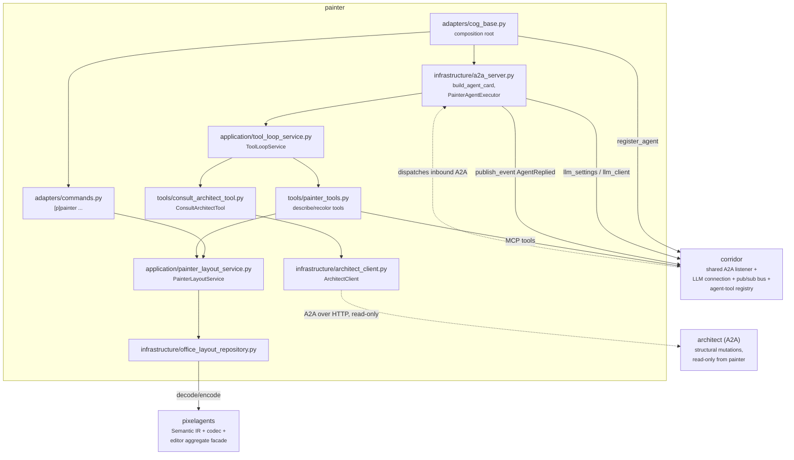
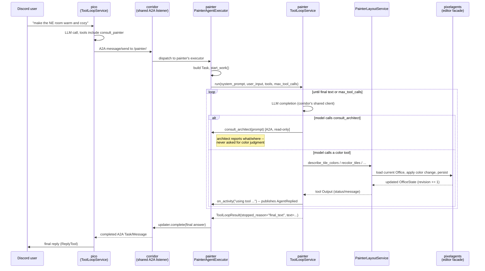
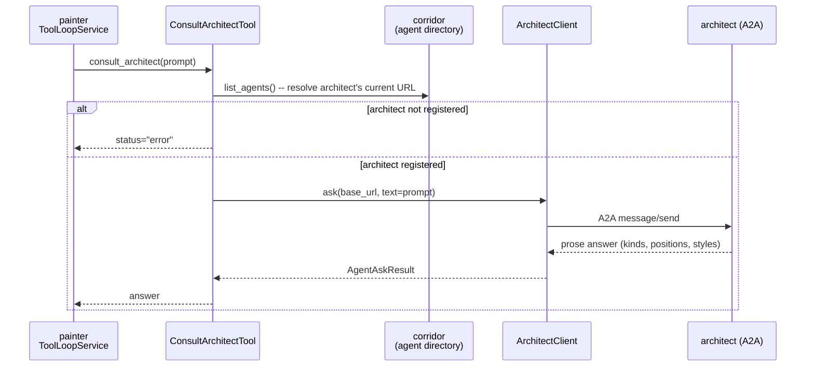
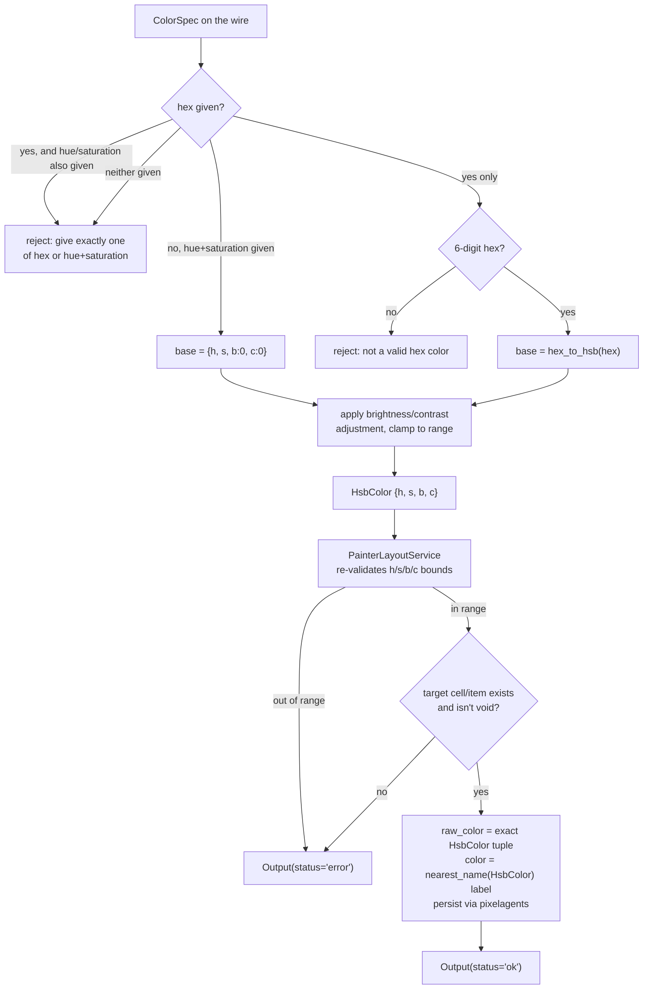

# The `painter` cog

## Overview

`painter` is a third, independent LLM agent in this repo, reachable only
over the [A2A (Agent2Agent) protocol](https://a2a-protocol.org/) -- no
Discord user ever talks to it directly. `pico` is the sole A2A
coordinator: a Discord message gates it in, and its `consult_painter`
tool sends painter a prompt and folds the answer back into pico's own
reply, exactly the way `consult_architect` already works. Painter owns
every **color** mutation on the shared editor office layout: floor tiles,
wall tiles, and furniture. It never adds, removes, moves, resizes, or
otherwise restructures anything -- that is
[`architect`](architect-design.md)'s domain, not painter's.

Painter and architect read and write the same revisioned `editor`
aggregate through [`pixelagents`](../pixelagents), which owns the shared
Semantic IR, its Pixel Agents JSON codec, and the color palette both cogs
use for read-side summaries. See
[`docs/architect-semantic-ir-design.md`](architect-semantic-ir-design.md)
for that shared model in full; this document covers only painter's own
tools, its A2A registration, and its color-input validation on top of it.

Painter can consult architect over A2A for structural context -- what
tiles, walls, and furniture exist and where -- but that consultation is
strictly read-only: painter has no tool that can ask architect to change
anything, and architect has no tool that accepts a color. Painter has no
Dashboard route, WebSocket listener, or browser client of its own;
[`cctv`](cctv-design.md) serves the editor page and renders whatever
state painter (or architect) changes.

## Architecture

Painter uses the official `a2a-sdk` (PyPI), the same as architect and
pico. It registers an `AgentCard` and `AgentExecutor` with corridor's
shared A2A listener at `cog_load` instead of binding a listener of its
own -- corridor owns the one process-wide `uvicorn`/Starlette server and
mounts every registered agent under its own path (`/<agent_key>/`). See
[`docs/agent-directory-design.md`](agent-directory-design.md) for that
shared listener and directory in full.



Both the tool-loop surface (`tools/painter_tools.py`) and painter's
Discord status command call into the same repository/service pair, so
there is exactly one path a color mutation can take: load the current
`Office`, apply the change to a new value (the IR dataclasses are
frozen), and persist through pixelagents' `set_office_layout`. Painter's
own hand-written `_publish_activity` (`adapters/cog_base.py`) reports
each tool-use step as an `AgentReplied` event on corridor's pub/sub bus,
implementing the same shape as architect's own `_publish_activity` -- a
separate implementation per agent, not a shared helper.

## Domain model / schema

Painter has no IR of its own -- `pixelagents.domain` (`Office`,
`FurnitureItem`, `TileCell`, `GridPosition`, `GridRect`, `FurnitureKind`,
`TileKind`, ...) is imported directly. See
[`docs/architect-semantic-ir-design.md`](architect-semantic-ir-design.md)
for that model and its codec; this section covers only the shapes
painter's own tool layer adds on top of it.

Painter's only genuinely own domain type is its tool-loop configuration
(`painter/domain/models.py`):

```python
@dataclass(frozen=True, slots=True)
class GlobalSettings:
    max_tool_calls: int
    system_prompt: str
    debug_logging: bool
    request_timeout_seconds: float | None = None  # always None here -- see below
```

`request_timeout_seconds` always stays `None` -- painter has no per-agent
settings surface of its own to configure it from. It exists only so this
dataclass keeps structurally satisfying corridor's shared
`SupportsAgentSettings` protocol (`corridor/domain/agent_executor.py`),
which [`bootcamp`](bootcamp-design.md)'s own per-agent-configurable
`CustomAgent` also implements, this time with a real bot-owner-set
override.

Every color-read tool reports the exact current color through
`pixelagents.infrastructure.color_summary.ColorSummary` -- a shape shared
byte-for-byte with architect's own read tools:

```python
class ColorSummary(BaseModel):
    hex: str
    hue: int
    saturation: int
    brightness: int
    contrast: int
    closest_named_color: str
```

`closest_named_color` is the nearest of pixelagents' fixed twelve-name
palette, informational only -- painter's own writes are never constrained
to that palette (see Validation & error handling below).

Every color-write tool accepts a `ColorSpec` (`painter/tools/painter_tools.py`),
painter's own input shape with no architect equivalent:

```python
class ColorSpec(BaseModel):
    hex: str | None = None            # give exactly one of hex,
    hue: int | None = None            # or hue+saturation together
    saturation: int | None = None
    brightness: int = 0               # -100..100 adjustment, either way
    contrast: int = 0                 # -100..100 adjustment, either way
```

`hex` and `hue`+`saturation` are alternative ways to name a base color --
give exactly one of the two shapes, the same "give exactly one" contract
`recolor_tiles`' own `width`/`height`-vs-`end_col`/`end_row` region
parameters use. `brightness`/`contrast` always apply as an adjustment on
top of whichever base color that resolves to, so an LLM that already read
a tile's current hue/saturation via `describe_tile_colors` can ask for
"a bit darker" by resubmitting that hue/saturation with an adjusted
`brightness`.

## Key flows

### Pico consults painter over A2A



`context.get_user_input()` (the inbound A2A message's text, joined) is
the tool loop's entire user turn -- there is no persisted multi-turn
conversation, mirroring architect's and pico's own no-session design.
Color judgment happens entirely inside painter's own LLM, against
structured data painter reads and writes itself; architect is only ever
asked "what/where," never "what color."

### Painter recolors and persists

Every write method in `PainterLayoutService` follows the same shape:
load the current `Office`, check the target cells/items are eligible
(no void tiles, no unknown furniture id), replace only the `color`/
`raw_color` fields on a new `Office` value, and persist. `recolor_tiles`
resolves its color once and applies it to every position in the region in
a single `grid.replacing(...)` call; `recolor_furniture_by_style` matches
every item of the given kind+style before applying the same color to all
of them and returns how many were recolored (`0` is a normal result, not
an error, when nothing currently matches).

### Painter consults architect for structural context



Unlike pico's `ConsultAgentTool` (one instance built per currently
registered agent, each turn), painter only ever consults one specific,
known agent, so `ConsultArchitectTool` resolves architect's current A2A
URL from `corridor.list_agents()` itself on every call rather than being
handed a fixed `base_url` at construction time. This means painter
degrades to a normal tool error, not a crash, the moment architect is
unloaded or unregistered.

## API / tool reference

| Tool | Params | Behavior | Errors |
|---|---|---|---|
| `consult_architect` | `prompt: str` | Delegates a structural question to architect over A2A and returns its prose answer | architect not registered with corridor; the underlying A2A request fails |
| `describe_tile_colors` | `col, row, width, height` | Per-tile `color` (`ColorSummary`: hex, hue, saturation, brightness, contrast, closest_named_color) for every floor/wall tile in a bounded region | region extends outside the grid |
| `describe_furniture_colors` | `kind?, style?` | Same `ColorSummary` shape, per matching furniture item | -- |
| `recolor_tiles` | `col, row, width/height` or `end_col/end_row`, `color: ColorSpec` | Recolors every floor and wall tile in the region without changing kind, material, or anything structural | region includes a void tile; region out of bounds; both/neither of width-height and end_col/end_row given; malformed `ColorSpec` |
| `recolor_furniture` | `furniture_id: str, color: ColorSpec` | Recolors one furniture item by id, without moving or replacing it | unknown furniture id; malformed `ColorSpec` |
| `recolor_furniture_by_style` | `kind, style, color: ColorSpec` | Recolors every placed item of that kind+style at once; `recolored_count` is `0`, not an error, when nothing matches | malformed `ColorSpec` |

Painter additionally adapts, at every A2A turn, whatever MCP tools are
currently enabled for it in corridor's agent-tool registry -- for example
Suggestionbox's `report_error`/`suggest_improvement`, gated per agent via
`[p]suggestionbox agents` (see
[`docs/suggestionbox-design.md`](suggestionbox-design.md)) -- fetched
fresh rather than cached, so an owner's toggle takes effect on the very
next consultation.

Every tool's `Output` carries `status: "ok" | "error"` and an optional
`message`; `recolor_furniture_by_style`'s `Output` additionally carries
`recolored_count`.

## Validation & error handling



There is no fixed color palette anywhere on painter's write path. Every
recolor stores the caller's exact `HsbColor` as `raw_color`, so an
arbitrary painter-chosen color round-trips losslessly on future reads and
re-encodes rather than snapping to the nearest of pixelagents' twelve
named colors (`raw_color` always takes precedence over the semantic
`color` name on encode -- see
[`docs/architect-semantic-ir-design.md`](architect-semantic-ir-design.md)
§5.3). `color` is still set, via `nearest_name()`, purely as a
best-effort human-readable label for later `describe_tile_colors`/
`describe_furniture_colors` calls.

`ColorSpec` resolution happens at the tool layer
(`painter/tools/painter_tools.py`'s `_resolve_color`); `PainterLayoutService`
re-checks the resolved `HsbColor`'s bounds itself as defense in depth,
the same way architect's own service re-checks `material`'s 1-9 bound
rather than trusting the tool layer alone. Structural rejection is
enforced by construction, not by a runtime check: no tool input model
anywhere in `painter_tools.py` has a `kind` or `material` field, so there
is no code path through which painter's LLM could even attempt to
convert a cell between floor, wall, and void, or add, move, or remove
furniture. `recolor_tiles` still rejects a region that contains a void
tile, since a void tile has no sprite to color at all.

Two error paths sit above the tool layer, in the A2A executor itself,
identical in shape to architect's own:

- **LLM not configured.** If corridor's shared LLM connection isn't ready
  when a turn starts, the executor fails the A2A task immediately with an
  explanation, before any tool call is attempted.
- **Unhandled exception during the tool loop.** A2A's SSE transport
  silently drops the connection on an uncaught exception with no
  traceback logged anywhere else, so the executor's `except Exception`
  around the whole turn is the only place this failure mode is ever
  logged (`log.exception`, kept noisy on purpose). The message returned
  to the caller is generic -- it never echoes exception text, since that
  could leak secrets (API keys, internal paths) into a channel or another
  agent's context.

## Design rationale

- **A separate agent from architect, not one agent with two tool sets.**
  Painter and architect are independent A2A consultations with
  independent system prompts, independent per-turn tool-call budgets, and
  independent skill sets advertised on their agent cards. Splitting them
  keeps each system prompt focused -- architect's LLM never has to weigh
  "should I also consider color" against a structural decision, and
  painter's LLM never has to weigh a color choice against a structural
  side effect. A caller (pico) that only needs a recolor invokes exactly
  one focused consultation instead of one broad agent whose tool listing
  covers both concerns.
- **Painter's tools can only recolor, never restructure.** No tool input
  model in `painter/tools/painter_tools.py` accepts a `kind` or
  `material` parameter, so a structural change is not a validation rule
  painter's service happens to enforce -- it is a request shape that does
  not exist. This is a stronger guarantee than a prompt instruction: a
  prompt-injected or hallucinated attempt to "convert this wall to floor"
  has no matching tool call to make.
- **`consult_architect` is read-only by construction.** Painter's one
  structural tool exists purely to learn what/where; architect has no
  tool that accepts a color, and painter has no tool that asks architect
  to mutate anything. Color judgment stays entirely inside painter's own
  LLM, reasoning over structured data it reads and writes itself, so
  there is exactly one place a color decision gets made and exactly one
  place it gets applied.
- **No fixed color palette on painter's write path.** Architect's
  `paint_tiles`/`create_zone` validate `color` against a deliberately
  coarse, closed set of names -- right for a structural tool whose LLM
  only needs to express "paint this zone warm beige." Painter's entire
  purpose is translating open-ended natural language ("blue," "a lighter
  shade," "#3b5a7a") into color, so it reasons in hue/saturation/
  brightness/contrast (or hex) directly and stores the result as an exact
  `raw_color`, never snapped to the nearest of a dozen named colors.
- **A parallel tool-loop implementation, not a shared library.** Pico,
  architect, and painter each keep their own copy of the bounded
  tool-calling loop shape. They are independent agents with independent
  tool sets and independent per-turn budgets; the only thing they share
  is corridor's LLM connection.

See [`docs/agent-directory-design.md`](agent-directory-design.md) for how
painter registers with corridor and gets discovered by pico,
[`docs/architect-semantic-ir-design.md`](architect-semantic-ir-design.md)
for the shared Semantic IR and its codec, and
[`docs/cctv-design.md`](cctv-design.md) for how the editor state painter
changes gets rendered in a browser.
