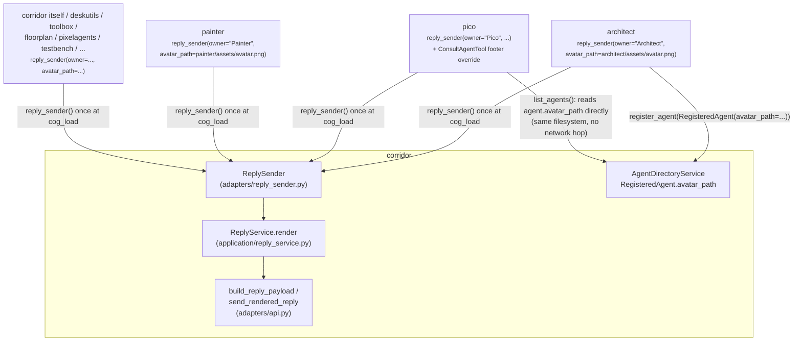
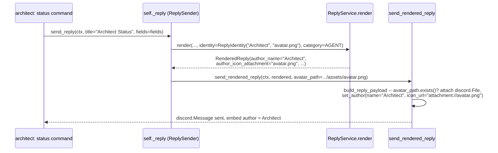
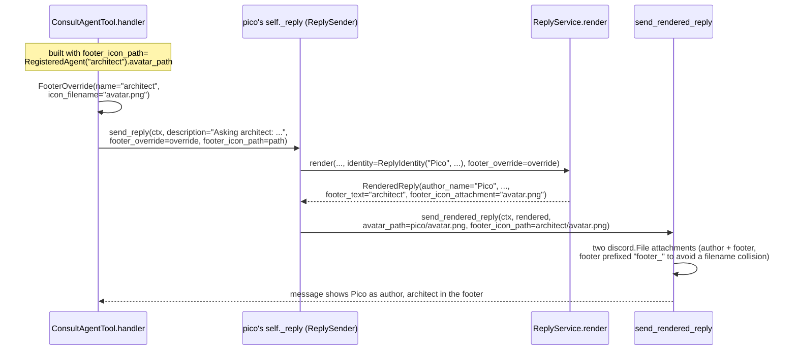

# Reply identity: per-cog author names/avatars and consulted-agent footer identity

## Overview

`corridor.send_reply`/`render_reply` is the one path every dependent cog
uses to post a Discord reply, respecting a guild's configured `ReplyMode`
(`EMBED` or `TEXT`). Every dependent cog binds its own `ReplyIdentity` once
— a name plus an optional bundled avatar — via `CogBase.reply_sender()`,
and every reply that cog sends through the resulting `ReplySender` carries
that identity as the embed's author line (or a text prefix in `TEXT`
mode), with zero per-call-site repetition across the 60+ places
`send_reply`/`render_reply` are called.

A second, narrower identity concept — `FooterOverride` — lets one message
show a *different* party's identity in its footer, distinct from the
sending cog's own author line and from the guild's configured footer.
`pico/tools/consult_agent_tool.py`'s `ConsultAgentTool` is the one real
consumer: when pico relays an A2A exchange, the footer shows the
*consulted* agent's name and avatar, not pico's own.

## Architecture

`ReplyIdentity`, `FooterOverride`, and `ReplyCategory` are plain,
framework-neutral dataclasses/enums in `corridor/domain/models.py` — zero
discord.py imports, matching every other domain type in that module. Each
dependent cog obtains one bound `ReplySender` (`corridor/adapters/reply_sender.py`)
from `CogBase.reply_sender()` at its own `cog_load`, alongside its existing
`register_dependent`/`register_agent` calls, and stores it — every one of
that cog's own `send_reply`/`render_reply` call sites then calls the bound
sender instead of the raw `corridor` reference, with no other argument
changes.



`ReplySender` lives in the adapters layer, not application, alongside
`CogBase` itself: both eventually hand a real `discord.File`/attachment to
`send_rendered_reply` and resolve `Path.exists()` against the actual
filesystem, framework/infrastructure concerns
`corridor/application/reply_service.py` (pure, zero discord.py imports)
stays free of.

Each cog's own bundled avatar ships as `<cog_package>/assets/avatar.png`,
committed to git, optional, attached fresh via `discord.File` on every
message that needs it and referenced as `attachment://<filename>` — never
served over HTTP, never cached across sends. A cog passes its
*conventional* path (`Path(__file__).resolve().parent.parent / "assets" /
"avatar.png"`) to `reply_sender()` regardless of whether the file
currently exists — existence is checked fresh on every send
(`build_reply_payload`), so dropping a real PNG at that exact path is the
entire change needed to light up that cog's author icon, no code change
required. Today, real `avatar.png` files exist for architect, corridor,
deskutils, floorplan, pico, pixelagents, testbench, and toolbox; `painter`
passes the same conventional path but has no file there yet, so its
replies show the "Painter" author name with no icon — the ordinary,
zero-regression state for a cog that hasn't dropped its image in.

## Domain model / schema

```python
# corridor/domain/models.py

@dataclass(frozen=True, slots=True)
class ReplyIdentity:
    """Which cog is sending -- bound once per cog via CogBase.reply_sender,
    not repeated at each send_reply/render_reply call site.

    `avatar_filename` is a bare filename (e.g. "avatar.png"), not a path --
    this module has zero framework/filesystem-aware imports. The adapter
    layer (ReplySender) resolves it against the cog's actual bundled asset
    path and checks the file exists fresh on every send; None here means
    "no avatar filename was ever configured," not "the file happens to be
    missing right now.\""""

    owner: str
    avatar_filename: str | None = None


@dataclass(frozen=True, slots=True)
class FooterOverride:
    """Overrides a guild's own configured footer for one message --
    ConsultAgentTool's only consumer today: the *consulted* agent's
    name+avatar, distinct from the calling cog's own author identity and
    from the guild's footer_text/icon preference.

    `icon_filename` is a bare filename, like ReplyIdentity.avatar_filename
    -- not a URL. The consulted agent's avatar is always on the same
    filesystem as the consulting cog (every agent in this repo runs in the
    same bot process), so the adapter layer attaches it as a Discord
    attachment the same reliable way it already does the calling cog's own
    avatar."""

    name: str
    icon_filename: str | None = None


@dataclass(frozen=True, slots=True)
class RenderedReply:
    mode: ReplyMode
    content: str | None
    embed_title: str | None
    embed_description: str | None
    fields: tuple[ReplyField, ...]
    footer_text: str | None
    footer_icon_url: str | None          # guild-configured footer icon (a real URL)
    show_timestamp: bool
    author_name: str | None              # ReplyIdentity.owner, or None if unbound
    author_icon_attachment: str | None   # bare filename, set only when
                                          # identity.avatar_filename was given
    category: ReplyCategory | None = None
    footer_icon_attachment: str | None = None
    # Mutually exclusive with footer_icon_url -- set instead of it when the
    # footer comes from a FooterOverride with an icon_filename.
```

`author_name`/`author_icon_attachment` and `footer_text`/`footer_icon_url`
(or `footer_icon_attachment`) are four fields that each answer one of two
questions — "who is this reply from" and "whose identity does the footer
show" — mirroring how `ReplyField`'s own four fields (`name`/`value`/
`inline`/`code`) all answer "what does one embed field look like."

`ReplyCategory` (`AGENT`/`ROOM`/`FURNITURE`) selects an embed's accent
color via `REPLY_CATEGORY_COLORS` (`corridor/domain/reply_colors.py`);
`None` — the default, and what deskutils and pixelagents deliberately keep
— means "no opinion," Discord's own gray, not a fourth category.

**`corridor/domain/agent_directory.py`'s `RegisteredAgent`** gains the
field that lets a registered A2A agent's avatar reach both this doc's
consulted-agent footer path and the A2A protocol's own `icon_url`:

```python
@dataclass(frozen=True, slots=True)
class RegisteredAgent:
    agent_key: str
    card: AgentCard
    executor: AgentExecutor
    avatar_path: Path | None = None
```

`card_with_url(card, url, *, icon_url=None)` rewrites the registering
agent's card at the same call site corridor already uses to rewrite
`supported_interfaces[0].url` to its own host/port — the registering agent
has no way to know either URL ahead of time, since every agent's A2A
surface is mounted on corridor's one shared listener rather than a
listener of its own.

## Key flows

A plain command reply through a cog's own bound sender:



`ConsultAgentTool` announcing an A2A exchange, with pico's own author
identity and the consulted agent's footer identity both visible on one
message:



## API reference

**`corridor.adapters.cog_base.CogBase`**:

```python
def reply_sender(
    self, *, owner: str, avatar_path: Path | None = None, category: ReplyCategory | None = None,
) -> ReplySender: ...

async def render_reply(
    self, ctx, *, title=None, description=None, content=None, fields=(), code=(),
    identity: ReplyIdentity | None = None, footer_override: FooterOverride | None = None,
    category: ReplyCategory | None = None,
) -> RenderedReply: ...

async def send_reply(
    self, ctx, *, title=None, description=None, content=None, fields=(), code=(),
    identity: ReplyIdentity | None = None, footer_override: FooterOverride | None = None,
    category: ReplyCategory | None = None,
) -> discord.Message: ...
```

**`corridor.adapters.reply_sender.ReplySender`** — the bound, per-cog
object every call site actually uses; `identity`/`category` are captured
at construction and threaded through every call automatically:

```python
class ReplySender:
    def __init__(
        self, cog_base: CogBase, *, owner: str,
        avatar_path: Path | None = None, category: ReplyCategory | None = None,
    ) -> None: ...

    async def render_reply(self, ctx, *, title=None, description=None,
                            content=None, fields=(), code=()) -> RenderedReply: ...

    async def send_reply(
        self, ctx, *, title=None, description=None, content=None, fields=(), code=(),
        footer_override: FooterOverride | None = None, footer_icon_path: Path | None = None,
    ) -> discord.Message: ...

    async def render_channel_reply(self, guild_id: int, *, ...) -> RenderedReply: ...
    async def send_channel_reply(self, channel, guild_id: int, *, ...) -> discord.Message: ...
    async def publish_event(self, event: object) -> None: ...
```

`render_channel_reply`/`send_channel_reply` are `render_reply`/`send_reply`'s
twin for a caller with no live `ctx` (e.g. a proactive notification into a
configured channel). `publish_event` is forwarded, not duplicated —
`ReplyTool` needs both this and `send_reply` from one object it's handed.

**`corridor.adapters.api`**:

```python
def build_reply_payload(
    reply: RenderedReply, *, avatar_path: Path | None = None, footer_icon_path: Path | None = None,
) -> tuple[dict[str, Any], list[discord.File]]: ...

async def send_rendered_reply(
    ctx: commands.Context, reply: RenderedReply, *,
    avatar_path: Path | None = None, footer_icon_path: Path | None = None,
) -> discord.Message: ...

async def send_rendered_reply_to_channel(
    channel: discord.abc.Messageable, reply: RenderedReply, *,
    avatar_path: Path | None = None, footer_icon_path: Path | None = None,
) -> discord.Message: ...
```

`build_reply_payload` is the single place that turns a `RenderedReply`
into embed/content kwargs plus attachments — shared by
`send_rendered_reply`/`send_rendered_reply_to_channel` and by floorplan's
and pixelagents' own interaction-aware `ReplyMixin`s (which need
ephemeral-response/hybrid-command-followup dispatch `ctx.send` doesn't
support, but the identical embed-building logic).

## Design rationale

**Identity and category are independent parameters, not fused into one
object.** `ReplyIdentity` answers "which cog sent this" (name + avatar);
`ReplyCategory` answers "which visual accent bucket does this belong to"
(agent/room/furniture, or none). A cog's identity never changes across its
own calls, but its category can — architect might send one reply
categorized `AGENT` and, in principle, another with no category at all.
Fusing them would force every identity to carry exactly one fixed color,
when the two questions are genuinely independent: `reply_sender()` accepts
both as separate keyword arguments precisely so a cog's bound sender can
default a category (most do, once, at construction) without that becoming
part of what "being this cog" means.

**Footer icons are Discord attachments from a local `avatar_path`, not the
A2A card's `icon_url`.** Corridor's shared A2A listener does serve a real
`/<agent_key>/avatar.png` route, and does set `AgentCard.icon_url` to that
address — genuine, correct A2A protocol infrastructure for an external A2A
client that doesn't share this process's filesystem. But that address is
only ever reachable from wherever corridor's `a2a_host`/`a2a_port`
actually bind — `127.0.0.1` by default — which works fine for this same
process's own agent-to-agent calls but means Discord's own servers can
never fetch it: a footer built from `icon_url` shows the consulted agent's
*name* correctly but never its icon. Since every agent in this repo shares
pico's own filesystem and process, `ConsultAgentTool` instead reads
`RegisteredAgent.avatar_path` directly and attaches it as a Discord
attachment — `FooterOverride.icon_filename` plus a `footer_icon_path`
threaded through `ReplySender.send_reply`/`build_reply_payload`, the exact
same reliable attachment mechanism already used for a cog's own author
icon. The footer attachment is filename-prefixed (`footer_<name>`) because
Discord requires unique filenames among one message's attachments, and
every cog's own avatar is conventionally also named `avatar.png` — without
the prefix, a message carrying both the sending cog's author icon and a
consulted agent's footer icon would collide.

**No new cross-cog registry for reply identity.** Unlike
`AgentDirectoryService`/`ToolRegistryService`, which other cogs genuinely
query at runtime, nothing but the registering cog itself ever needs to
look up its own reply identity later — `ReplySender` is held directly by
the cog that created it, never looked up by name elsewhere.

**Call-site ergonomics: a bound sender obtained once, not a repeated
`owner` kwarg.** Every dependent cog's `cog_load` calls
`self._corridor.reply_sender(owner=..., avatar_path=...)` once and stores
the result as `self._reply`; every existing `send_reply`/`render_reply`
call site keeps its exact signature (title/description/content/fields/code)
— only *which object* receives the call changes, from `self._corridor` to
`self._reply`. Repeating an explicit `owner: str` kwarg at every call site
was considered and rejected: it means touching every call site's
*arguments*, not just which object they call, and risks a future call
site simply forgetting to pass it.

## Non-goals

- **TEXT-mode footer identity.** `ReplyService.render`'s `TEXT` branch
  drops `footer_override` entirely — a footer is strictly an embed
  concept. A guild running `TEXT` mode sees the sending cog's own
  `"**Pico:** ..."` prefix on `ConsultAgentTool`'s announcements, and the
  announcement text itself already names the consulted agent in prose
  ("Asking **architect**: ..."), so only the *icon* is unavailable there,
  never the attribution.
- **Avatar caching/CDN-fronting.** Both the `discord.File` re-upload path
  and corridor's `/avatar.png` A2A route re-read from disk on every single
  call/request — a small avatar re-uploaded on every reply that needs it
  is an accepted, deliberate cost over premature caching.
- **Avatar auth/access control on corridor's A2A listener.** The avatar
  route shares the same trust model as every other route corridor's
  shared A2A listener serves — no auth. Serving a static PNG adds no
  attack surface beyond "an unauthenticated network peer can read this
  small public-facing image," categorically less sensitive than the
  JSON-RPC surface already accepted there.
- **A `[p]<cog> avatar` upload/management command.** Avatars are a
  git-committed asset, not admin-configurable at runtime — no owner-facing
  command changes one without editing the repo.
- **A guild-configurable "hide cog author lines" toggle.** The author name
  always shows once an identity is bound; there is no `ReplyPreferences`
  field to suppress it.
