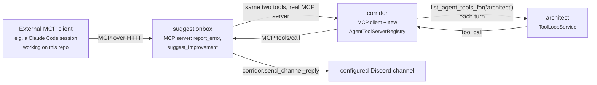
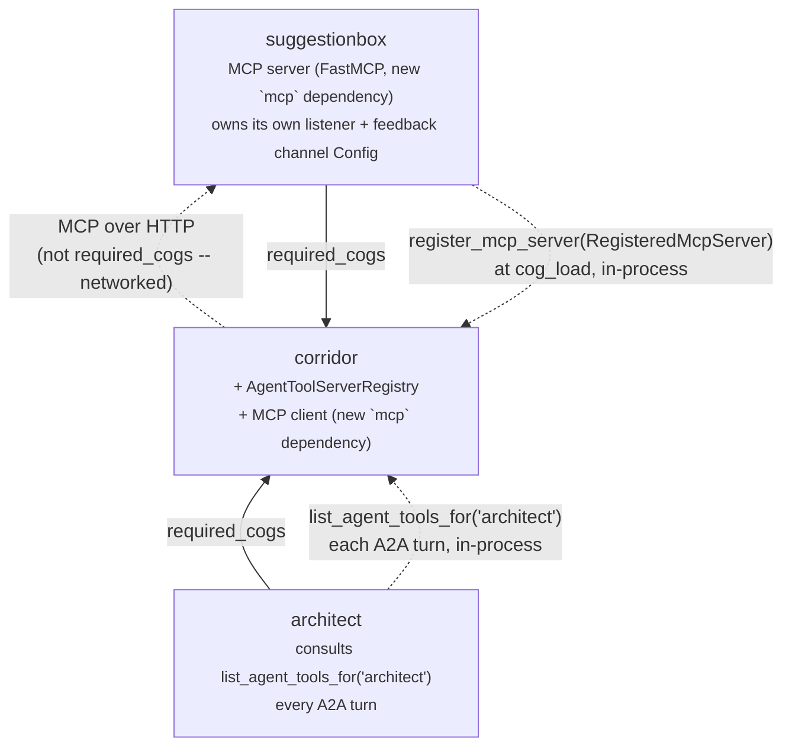

# suggestionbox: an MCP feedback server, mediated by corridor for A2A agents

**Status: implemented.** See the implementation checklist (§10) and this
repo's own PRs for what actually landed; a follow-up review pass may note
small deviations from the plan below (e.g. `render_channel_reply` reusing
corridor's existing `default_prefix()` helper instead of skipping prefix
substitution outright, and an unrelated `typing-inspection<0.4.3`
packaging pin discovered while wiring CI) -- this doc is left as originally
written rather than retouched to match, so a review comparing the two is
meaningful.

## 1. Problem

Architect (and any future A2A agent registered in corridor's
`AgentDirectoryService`) has no channel to say "I misunderstood a tool" or
"this took far more reasoning than it should have" — feedback about its own
operation just evaporates at the end of the tool loop. Separately, an
external coding agent working on this very repository (a Claude Code
session, or similar tooling) has no structured way to report a bug or
friction point it hit into this project's own Discord either.

`suggestionbox` is a new cog that answers both with one MCP (Model Context
Protocol) tools server exposing two tools — `report_error` and
`suggest_improvement` — that post to a bot-owner-configured Discord channel.
Two different kinds of caller reach it:

1. **Genuinely external MCP clients** (a coding-agent CLI, an IDE
   integration — anything that speaks MCP and is pointed at this bot's
   host) connect straight to suggestionbox's own MCP endpoint.
2. **A2A agents already registered in corridor** (architect today, more
   later) reach the same two tools through their own in-process
   tool-calling loop, mediated entirely by corridor.

The design work is almost entirely in path 2: nothing in this repo speaks
MCP anywhere today (`grep -ri mcp` across every cog and every `info.json`
returns nothing), corridor's LLM client is a bespoke OpenAI-compatible
`aiohttp` POST to LiteLLM's `/chat/completions` (`corridor/infrastructure/
llm_client.py`), and architect's `ToolLoopService` only ever calls a fixed,
pydantic-typed `Sequence[ToolSpec]` built once in `CogBase.__init__`
(`architect/adapters/cog_base.py:108-119`) — it never consults corridor's
existing `ToolRegistryService`/`list_tools_for(ctx)` the way pico does,
because architect has no `commands.Context` to filter against at all: it's
driven by A2A `RequestContext`, not a Discord command invocation.



## 2. Locked decisions

Decided explicitly for this design (mirroring the "Locked decisions"
convention in `architect-design.md`/`agent-directory-design.md`):

- **Real MCP end to end, not a protocol shortcut.** suggestionbox runs an
  actual MCP server (via the official `mcp` Python SDK's `FastMCP`, HTTP
  transport). Corridor runs an actual MCP *client* (`mcp.client.
  streamable_http` + `ClientSession`) against it — even for architect's
  in-process consumption. This was a deliberate choice over the cheaper
  "dual registration" alternative (suggestionbox's handlers registered
  twice: once behind real MCP, once as a plain corridor `RegisteredTool`)
  specifically so there is exactly one implementation of "what does
  `report_error` mean" and every caller, internal or external, is proven
  to go through the identical protocol surface.
- **A new corridor registry, parallel to `ToolRegistryService`/
  `AgentDirectoryService`, not a reuse of either.** `ToolRegistryService`
  filters by a live `commands.Context` (`required_group`/`can_run`)
  architect doesn't have; `AgentDirectoryService` stores A2A-reachable
  agents, the opposite direction of this data flow (agents *offering*
  themselves to pico, not agents *consuming* a tool server). This is a
  third, genuinely different shape — corridor holding a live MCP client
  session per registered server, gated per `agent_key` — so it gets its
  own service, `AgentToolServerRegistry`, following the same
  register/unregister_owner/list convention the other two already
  establish.
- **Visibility is the registering server's own concern, not a third-party
  filter hook.** Toolbox's `ToolVisibilityFilter` precedent
  (`docs/toolbox-command-tool-toggle-design.md`) exists because *other*
  cogs opine on tools they don't own. Here there is exactly one owner
  per registered MCP server, deciding which agents may use its own tools
  — so the gate is a plain callable supplied at registration time
  (`RegisteredMcpServer.agent_allowed`), not a second registration step.
- **The per-agent toggle is global (bot-wide), owner-only, and off by
  default for a newly-registered agent.** Matches `AgentDirectoryService`/
  `ToolRegistryService` both being one-per-bot-process, not one-per-guild;
  matches toolbox's global tool-selection panel being
  `@commands.is_owner()`-gated; and defaults closed so a bot owner must
  deliberately opt each agent in, consistent with this repo's general bias
  toward explicit grants for cross-cutting capability surface.
- **The feedback destination is one global channel, not per-guild.**
  Neither an external MCP client (no Discord identity at all) nor an A2A
  agent's own `AgentRef` (architect's is `guild_id=None`, see
  `corridor/adapters/cog_base.py`'s `ARCHITECT_AGENT_REF`) carries guild
  context to key a per-guild channel choice off of. `[p]suggestionbox
  channel <#channel>` is bot-owner-only and stores exactly one
  `(guild_id, channel_id)` pair in global Config.
- **Two distinct tools, not one generic `submit_feedback`.** `report_error`
  and `suggest_improvement` get their own schemas — a caller (human-written
  agent prompt or external tool) should not have to encode "which kind of
  feedback is this" as a free-text field when MCP already lets each tool
  advertise its own shape.
- **No auth/signing on the MCP transport**, mirroring
  `agent-directory-design.md` §7's identical non-goal for A2A — the same
  trusted-network assumption applies here; if suggestionbox's MCP endpoint
  is ever exposed outside a trusted network, that's its own follow-up
  design.

## 3. `suggestionbox`: the MCP server, Discord command, and Config

Scaffolded from `.cookiecutter/cog-cookiecutter` (standard `domain/`/
`application/`/`infrastructure/`/`adapters/` layering, its own rolled
Config identifier from the post-gen hook).

### The two tools

```python
# suggestionbox/domain/feedback.py -- pure logic, no discord/redbot/mcp import
class Severity(StrEnum):
    LOW = "low"
    MEDIUM = "medium"
    HIGH = "high"

@dataclass(frozen=True, slots=True)
class ErrorReport:
    source: str          # free text identifying the reporter -- "architect",
                          # "claude-code session on pixel-agents-cogs", etc.
                          # MCP carries no caller identity of its own on this
                          # transport, so the schema asks for it explicitly.
    what_happened: str
    expected: str
    actual: str
    severity: Severity

@dataclass(frozen=True, slots=True)
class ImprovementSuggestion:
    source: str
    area: str             # e.g. "tool descriptions", "docs", "office layout"
    observation: str
    suggestion: str
```

`FeedbackService` (application layer) turns either into a rendered Discord
message via a new corridor primitive (§5) and returns a small
JSON-serializable status mapping — same "informational mapping back to the
caller" convention `corridor-tool-registry-design.md`'s `deskutils_time`
example already sets. An unconfigured channel is an expected failure
(`LLMSettings.ready`'s own "stay silent/idle until configured" precedent),
reported back as an MCP tool error, not a raised exception.

### The MCP server itself

`suggestionbox/infrastructure/mcp_server.py` wraps `mcp.server.fastmcp.
FastMCP`, registering `report_error`/`suggest_improvement` as its two
tools (docstrings/pydantic field descriptions become the MCP tool
descriptions/schemas the SDK generates automatically — no hand-written
JSON Schema, unlike corridor's `RegisteredTool.parameters`). Runs over
MCP's Streamable HTTP transport (not `stdio`: this is a long-running cog
inside the bot process, not a spawnable subprocess) on a host/port
suggestionbox owns itself — mirroring architect's/floorplan's own
pre-centralization pattern of a cog binding its own `aiohttp`/websocket
listener (`architect/infrastructure/websocket.py`,
`floorplan/infrastructure/websocket.py`), not corridor's shared A2A
listener. This is deliberately *not* folded into corridor's shared A2A
`Starlette` app (§7): MCP and A2A are different wire protocols serving
different audiences, and there is exactly one MCP-serving cog today —
the "N+1 duplicated ports" pressure that justified centralizing A2A
(`agent-directory-design.md` §1) doesn't yet exist here. `[p]suggestionbox
mcp host/port` (bot owner), same bind-probe-and-report-failure shape
`corridor`'s `A2AServer`/`architect`'s former listener already use, started
from suggestionbox's own `cog_load`.

### The feedback-channel command

```
[p]suggestionbox channel <#channel>
```

Bot-owner-only (`@commands.is_owner()`). Stores `(ctx.guild.id,
channel.id)` in global Config, overwriting any previous value — exactly
one destination process-wide, per the locked decision above.

### Config shape

```python
# suggestionbox/infrastructure/settings_repository.py
GLOBAL_DEFAULTS = {
    "mcp_host": "127.0.0.1",
    "mcp_port": 8934,
    "feedback_guild_id": None,
    "feedback_channel_id": None,
    "mcp_enabled_agents": {},   # dict[str, bool], agent_key -> allowed; missing key = False
}
```

No per-guild Config at all — every piece of this cog's own state is
global, consistent with §2's locked decisions.

## 4. corridor: `AgentToolServerRegistry` + a real MCP client

### The registry

```python
# corridor/application/agent_tool_server_registry.py
# same register/unregister_owner/unregister/list shape
# ToolRegistryService/AgentDirectoryService already follow.

@dataclass(frozen=True, slots=True)
class RegisteredMcpServer:
    """One MCP tools server another cog owns, registered into corridor so
    an A2A agent's own tool loop can reach it without either cog importing
    the other. `agent_allowed` is that owner's own gate -- see §2 on why
    this isn't a separate filter-registration step the way toolbox's
    ToolVisibilityFilter is."""

    owner: str
    base_url: str  # e.g. "http://127.0.0.1:8934/mcp"
    agent_allowed: Callable[[str], Awaitable[bool]]  # agent_key -> may use this server


class AgentToolServerRegistry:
    """One registry per bot process, not per guild -- same scoping as
    AgentDirectoryService/ToolRegistryService."""

    def __init__(self, client_pool: McpClientPool) -> None: ...
    async def register(self, server: RegisteredMcpServer, *, owner: str) -> None:
        """Connects (or reconnects) `client_pool`'s session for this
        server and caches its `tools/list` result -- registration means
        'this server is reachable right now', the same 'not necessarily
        still reachable later' caveat agent-directory-design.md §7
        already accepts for A2A liveness."""

    def unregister_owner(self, owner: str) -> None: ...
    def unregister(self, base_url: str) -> None: ...
    async def list_tools_for(self, agent_key: str) -> tuple[RegisteredTool, ...]:
        """Every tool from every registered server whose `agent_allowed
        (agent_key)` returns True, each wrapped as corridor's existing,
        framework-neutral `RegisteredTool` (domain/models.py) -- the same
        shape ToolRegistryService already hands consumers, reused rather
        than inventing a fourth tool-description type. `handler` ignores
        its `ctx` argument entirely (there is no Discord ctx for an A2A
        call) and closes over `client_pool.call_tool(base_url, name,
        arguments)` instead."""
```

`CogBase` gains `register_mcp_server`/`unregister_mcp_server_owner`/
`unregister_mcp_server`/`list_agent_tools_for`, plus `on_cog_remove`'s
existing defensive cleanup gains `self._agent_tool_servers.unregister_owner
(cog.qualified_name)` alongside the tool registry's and agent directory's
own entries.

### The MCP client

`corridor/infrastructure/mcp_client.py`: one `mcp.client.streamable_http`
session per registered server, opened at `register()`, closed at
`unregister()`/`unregister_owner()` — the same "one reusable session per
lifetime, idempotent start/close" shape `LiteLLMClient` already documents
for exactly the same reason (`corridor/infrastructure/llm_client.py`'s own
module docstring). `call_tool(base_url, name, arguments)` invokes
`ClientSession.call_tool` and converts the MCP `CallToolResult`'s content
blocks back into the plain JSON-object-shaped mapping `RegisteredTool.
handler` already promises its callers.

Corridor's `info.json` gains `mcp` (the official Python SDK) as a
`requirements` entry, the same way it already gained `a2a-sdk[http-server]`
+ `uvicorn` when it centralized the A2A listener.

## 5. corridor: a new ctx-less reply primitive

Every existing `send_reply`/`render_reply` call site in this repo is
reached from a live `commands.Context` (`render_reply` asserts `ctx.guild
is not None` and calls `ctx.clean_prefix`; `send_rendered_reply` calls
`ctx.send(...)` — `corridor/adapters/cog_base.py:185-253`,
`corridor/adapters/api.py:113-123`). suggestionbox's post to its configured
feedback channel is the first *proactive* Discord send in this codebase —
triggered by an MCP tool call, not a Discord command or interaction, so
there is no `ctx` to hand corridor at all.

Rather than fabricate a fake `commands.Context` (the "no Discord ctx"
case already trips up permission/tool-visibility code that assumes one
exists — see `ToolLoopService`/A2A having exactly this same problem one
layer up), corridor gains a parallel, explicit primitive:

```python
# corridor/adapters/cog_base.py
async def render_channel_reply(
    self, guild_id: int, *, title=None, description=None, content=None,
    fields=(), code=(), identity=None, category=None,
) -> RenderedReply:
    """render_reply's twin for a caller with no live ctx -- same
    ReplyMode/identity/category handling, keyed by an explicit guild_id
    instead of ctx.guild.id. Skips `[p]` prefix substitution entirely:
    there is no invoking command, so no real prefix to substitute -- a
    literal `[p]` in text reaching this path is a caller bug, not
    something to guess a default prefix for."""

async def send_channel_reply(
    self, channel: discord.abc.Messageable, guild_id: int, *, ..., 
) -> discord.Message:
    """send_reply's twin: renders via render_channel_reply, then sends
    directly to `channel` (resolved by the caller from configured
    guild_id/channel_id via bot.get_channel) instead of ctx.send."""
```

`contracts/discord_replies/lint_reply_channel.py` only starts its call-graph
crawl from Red command handlers (`.command()`/`.group()`/
`.hybrid_command()`/`.hybrid_group()` decorators) — an MCP tool handler has
none of those, so it is invisible to the lint by construction, the same way
Components V2 interaction callbacks already are (per that script's own
"deliberately NOT flagged" section). This is a real, documented gap this
design accepts rather than silently ignores: routing through
`send_channel_reply` is enforced by convention/review for this cog, not by
the existing static check. Extending the lint to also crawl MCP tool
handlers is a reasonable, separate follow-up (§7), not required to ship
this design.

## 6. architect: consulting corridor's registry every turn

Architect's own tool list is currently fixed once, in `CogBase.__init__`
(`self._tools = [ReviewDesignTool(), BreakDownTaskTool(), *build_office_
tools(...)]`), before `self._executor = ArchitectAgentExecutor(tools=self.
_tools, ...)` is even built — corridor isn't resolved yet at `__init__`
time. Two ways to add suggestionbox's tools on top of that were
considered:

- Mutate `self._tools` in place (it's a plain `list`, shared by reference
  with the executor) once at `cog_load`, after `register_agent` gives
  architect a live corridor reference. Cheapest change, but frozen at
  load time — a bot owner flipping the new panel's toggle while architect
  is already running would need a cog reload to take effect.
- **Fetch fresh every turn (chosen).** `ArchitectAgentExecutor.execute()`
  already resolves `settings`/`llm_settings` via callables evaluated per
  call, not cached at construction (`settings: Callable[[], Awaitable[
  GlobalSettings]]`, `llm_settings: Callable[[], Awaitable[LLMSettings]]`)
  — this is the exact same shape pico's own `_agent_tools`/`_cross_cog_
  tools` already use (`corridor.list_agents()`/`corridor.list_tools_for
  (ctx)`, rebuilt every turn, per `corridor-tool-registry-design.md`).
  Matching it here means the owner's toggle takes effect on architect's
  very next A2A message, no reload required, and there's no local cache
  to invalidate.

```python
# architect/adapters/cog_base.py -- __init__ keeps self._tools as today's
# *fixed* office/placeholder tools only; a new callable is threaded
# through instead of appending to that list.
self._executor = ArchitectAgentExecutor(
    tool_loop=self._tool_loop_service,
    fixed_tools=self._tools,
    mcp_tools=lambda: self._corridor.list_agent_tools_for("architect"),
    settings=self._repository.global_settings,
    llm_settings=lambda: self._corridor.llm_settings(),
    publish_activity=self._publish_activity,
)
```

`ArchitectAgentExecutor.execute()` builds `tools = [*self._fixed_tools,
*await self._adapt(await self._mcp_tools())]` before calling `self.
_tool_loop.run(..., tools=tools, ...)`. `_adapt` wraps each corridor
`RegisteredTool` as architect's own `ToolSpec` — structurally identical to
`pico/tools/cross_cog.py`'s `CrossCogTool` (synthetic `Input`/`Output`
pydantic models with `extra="allow"`, `model_json_schema()` returning
`tool.parameters` verbatim) but implementing architect's own `ToolSpec`
Protocol instead of pico's. This is a **new, deliberately duplicated**
adapter (`architect/tools/agent_tool_server.py`), not a shared import —
matching `architect/tools/base.py`'s own documented precedent that
architect's `ToolSpec` is "a deliberate parallel copy of pico/tools/
base.py's ToolSpec ... not a shared import." Same per-entry try/except-
and-skip shape `_cross_cog_tools`/`_agent_tools` already use, so one
malformed tool from corridor never takes down architect's whole turn.

Any future A2A agent that registers into `AgentDirectoryService` gets this
for free the moment its own `CogBase` follows the same
`corridor.list_agent_tools_for(<its own agent_key>)` shape — nothing here
is architect-specific beyond the one hardcoded `"architect"` string in its
own `cog_load`.

## 7. The Components V2 panel: per-agent MCP access

`suggestionbox/adapters/agent_access_panel.py`, a `discord.ui.LayoutView`
structurally cloned from toolbox's `ToolSelectionView`/`ToolGuildOverrideView`
(`toolbox/adapters/tool_panel.py`) — paginated rows (`corridor/ui_limits.py`'s
existing helpers), one row per agent currently in `corridor.list_agents()`
(the *existing* `AgentDirectoryService`, read-only from here), each a
`Section`/`TextDisplay` + `ActionRow` toggle `Button`, rebuild-and-replace-
view on click. Simpler than toolbox's two-tier panel: no per-guild override
view at all, since §2 locks this toggle as global-only — just one page,
one bot-owner-gated (`@commands.is_owner()`) view.

```
┌─────────────────────────────────────────────┐
│ MCP tool access — 1 agent(s)                 │
│                                               │
│ architect                                    │
│ May use suggestionbox's MCP tools: NO        │
│ [ Enable ]                                   │
│                                               │
│ [ ◀ Prev ]              [ Next ▶ ]           │
└─────────────────────────────────────────────┘
```

Opened via `[p]suggestionbox agents` (bot owner). Toggling a row writes
directly to suggestionbox's own `mcp_enabled_agents` Config dict — the
same dict `RegisteredMcpServer.agent_allowed` (registered once, at
suggestionbox's own `cog_load`) reads from on every corridor lookup, so no
re-registration is needed when the owner flips a toggle; the *next* call to
`list_tools_for(agent_key)` simply evaluates the closure fresh, matching
§6's "no cache, fetched every turn" design on the architect side.

## 8. Dependency graph



`suggestionbox -> corridor` for registration is a normal `required_cogs`
entry (in-process call, same as any other provider). `corridor ->
suggestionbox` for the actual MCP traffic is deliberately *not* — same
"networked, not coded" reasoning `agent-directory-design.md` §6 gives for
`pico -> corridor`'s A2A edge, now applied to corridor calling out over
MCP instead of a plain Python call.

## 9. Out of scope for this pass

- **Any MCP transport auth/signing.** Same explicit non-goal as
  `agent-directory-design.md` §7 for A2A — trusted-network assumption only.
- **Persisting submitted feedback anywhere beyond the Discord message
  itself.** Confirmed explicitly: the posted message is the only record;
  no Config-backed feedback log, no list/query command.
- **Per-guild scoping of anything in this design** — the MCP-access toggle,
  the feedback channel, and suggestionbox's own Config are all global,
  confirmed explicitly.
- **A general-purpose MCP tool surface beyond error/feedback reporting.**
  `report_error`/`suggest_improvement` are the only two tools; nothing here
  is designed to make adding arbitrary future MCP tools to suggestionbox
  free — a third tool is a new, small design decision of its own, not a
  gap this pass tries to pre-empt.
- **Centralizing MCP hosting into corridor's shared listener** the way A2A
  was centralized. Revisit if and when a second cog wants to run its own
  MCP server — the "N+1 duplicated ports" pressure that justified doing it
  for A2A doesn't exist yet with exactly one provider.
- **Extending `lint_reply_channel.py` to crawl MCP tool handlers.** Flagged
  as a real, accepted gap in §5; worth a follow-up, not required to ship.
- **Health-checking / re-fetching a registered MCP server's tool list on
  a schedule.** `register()` fetches `tools/list` once, at registration —
  a dead-but-still-registered server behaves like today's unreachable A2A
  agent case: the next `call_tool` fails, surfaced as a tool error to
  whichever agent's loop invoked it.

## 10. Implementation checklist

1. Scaffold `suggestionbox` via `cookiecutter .cookiecutter/cog-cookiecutter`
   (`cog_name=suggestionbox`).
2. `suggestionbox/domain/feedback.py`: `Severity`, `ErrorReport`,
   `ImprovementSuggestion`, pure dataclasses.
3. `suggestionbox/application/feedback_service.py`: turns either into a
   `corridor.send_channel_reply(...)` call against the configured channel;
   returns a status mapping; fails closed (structured error, not a raised
   exception) when unconfigured.
4. `suggestionbox/infrastructure/mcp_server.py`: `FastMCP` instance,
   `report_error`/`suggest_improvement` tools, Streamable HTTP transport,
   bind-probe-and-report lifecycle mirroring corridor's `A2AServer`.
5. `suggestionbox/infrastructure/settings_repository.py`: global Config
   (`mcp_host`/`mcp_port`/`feedback_guild_id`/`feedback_channel_id`/
   `mcp_enabled_agents`).
6. `suggestionbox/adapters/commands.py`: `[p]suggestionbox channel
   <#channel>`, `[p]suggestionbox mcp host/port` (bot owner).
7. `suggestionbox/adapters/agent_access_panel.py`: the Components V2 panel
   (§7), opened via `[p]suggestionbox agents`.
8. `corridor/domain/agent_tool_server.py` (or extend `agent_directory.py`):
   `RegisteredMcpServer` dataclass.
9. `corridor/infrastructure/mcp_client.py`: `McpClientPool` wrapping
   `mcp.client.streamable_http` + `ClientSession`, one session per
   registered server, `call_tool`, idempotent connect/close.
10. `corridor/application/agent_tool_server_registry.py`:
    `AgentToolServerRegistry` (register/unregister_owner/unregister/
    list_tools_for), wired into `CogBase.__init__`/`cog_load`/
    `on_cog_remove`.
11. `corridor/adapters/cog_base.py`: `render_channel_reply`/
    `send_channel_reply` (§5); `register_mcp_server`/
    `unregister_mcp_server_owner`/`unregister_mcp_server`/
    `list_agent_tools_for`.
12. Add `mcp` to both `corridor/info.json`'s and `suggestionbox/info.json`'s
    `requirements`.
13. `architect/tools/agent_tool_server.py`: the `CrossCogTool`-shaped
    adapter from corridor's `RegisteredTool` to architect's `ToolSpec`.
14. `architect/adapters/cog_base.py`/`architect/infrastructure/
    a2a_server.py`: thread `mcp_tools` callable through
    `ArchitectAgentExecutor`, fetched fresh in `execute()` (§6).
15. Tests: `AgentToolServerRegistry` unit tests (register/collision/
    unregister/list_tools_for gating, mirroring `tool_registry_service`'s
    own test shape); `McpClientPool` against a real (not mocked) local
    `FastMCP` test server, matching this repo's existing "loopback A2A is
    real, not network-mocked" bar (`corridor`'s own test suite); a real
    end-to-end test posting `report_error` through suggestionbox's MCP
    server and asserting the Discord send happened; architect offering
    zero extra tools when suggestionbox is absent or the toggle is off,
    and the adapted tools appearing/disappearing on the very next A2A turn
    after a toggle flip, with no cog reload in between.
16. Update `docs/architecture.md`'s dependency graph and ownership map.
