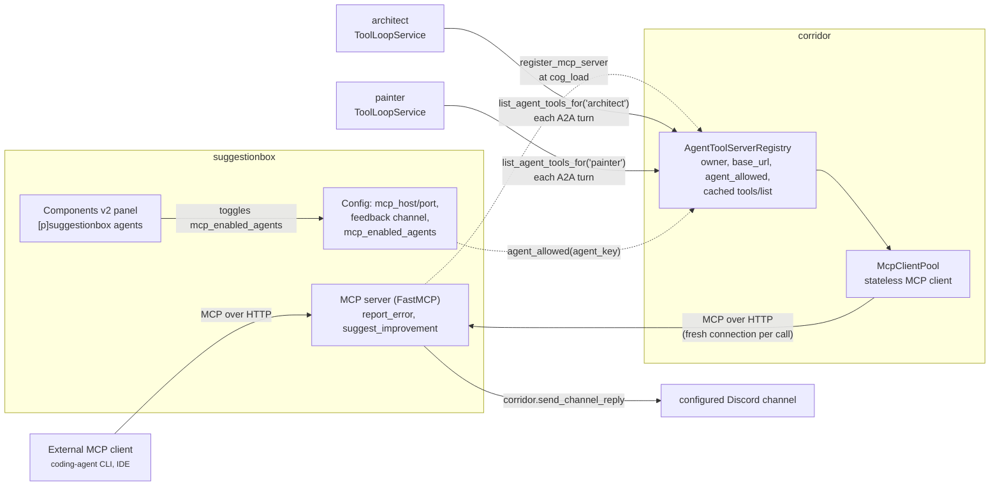
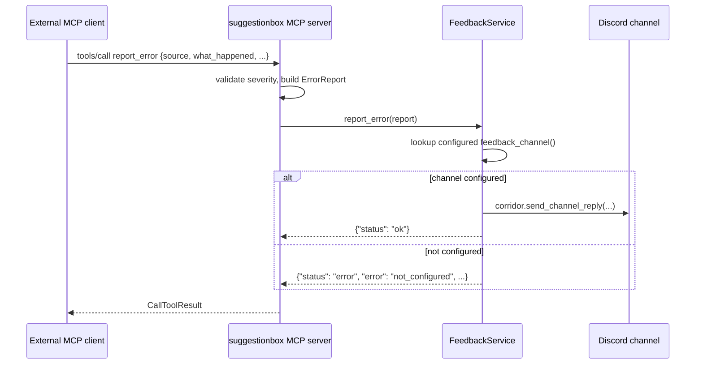
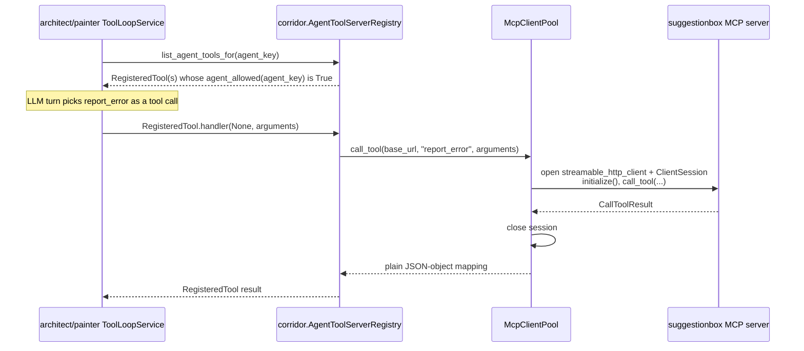

# suggestionbox: an MCP feedback server, mediated by corridor for A2A agents

## 1. Overview

`suggestionbox` is an MCP (Model Context Protocol) tools server exposing
two tools -- `report_error` and `suggest_improvement` -- that post to a
bot-owner-configured Discord channel. It gives every A2A agent registered
in corridor's `AgentDirectoryService` (`architect`, `painter`) a channel
to say "I misunderstood a tool" or "this took far more reasoning than it
should have" mid tool-loop, and gives anything else that speaks MCP --
a coding-agent CLI or IDE integration working on this repository -- a
structured way to report a bug or friction point into the same Discord
channel.

Two different kinds of caller reach it:

1. **Genuinely external MCP clients** (a coding-agent CLI, an IDE
   integration -- anything that speaks MCP and is pointed at this bot's
   host) connect straight to suggestionbox's own MCP endpoint.
2. **A2A agents already registered in corridor** (`architect`, `painter`)
   reach the same two tools through their own in-process tool-calling
   loop, mediated entirely by corridor.

Corridor runs a real MCP client end to end -- even for an in-process A2A
agent's own consumption -- rather than a protocol shortcut (e.g.
suggestionbox's handlers registered a second time as a plain corridor
`RegisteredTool`). That keeps exactly one implementation of "what does
`report_error` mean," and every caller, internal or external, goes
through the identical protocol surface.

## 2. Architecture



`AgentToolServerRegistry` is a third corridor registry, parallel to
`ToolRegistryService` and `AgentDirectoryService`, not a reuse of either:

- `ToolRegistryService` filters by a live `commands.Context`
  (`required_group`/`can_run`) -- neither architect nor painter has one,
  since each is driven by an A2A `RequestContext`, not a Discord command
  invocation.
- `AgentDirectoryService` stores A2A-reachable agents -- the opposite
  direction of this data flow (agents *offering* themselves to pico, not
  agents *consuming* a tool server).

`AgentToolServerRegistry` holds a live MCP client's cached tool list per
registered server, gated per `agent_key` rather than per Discord
permission group -- following the same
`register`/`unregister_owner`/`unregister`/`list_*` convention the other
two registries already establish.

Visibility is the registering server's own concern, not a third-party
filter hook: toolbox's `ToolVisibilityFilter`
(`docs/toolbox-command-tool-toggle-design.md`) exists because *other*
cogs opine on tools they don't own. Here there is exactly one owner per
registered MCP server, deciding which agents may use its own tools -- so
the gate is a plain callable supplied at registration time
(`RegisteredMcpServer.agent_allowed`), not a second registration step.

suggestionbox runs its own MCP listener rather than folding into
corridor's shared A2A `Starlette` app: MCP and A2A are different wire
protocols serving different audiences, and there is exactly one
MCP-serving cog. It binds its own `aiohttp`/uvicorn listener the way
architect's and floorplan's own websocket listeners do, on a host/port it
owns itself (`127.0.0.1:8934` by default), started from its own
`cog_load` and restarted whenever `[p]suggestionbox mcp host/port`
changes.

## 3. Domain model / schema

```python
# suggestionbox/domain/feedback.py -- pure logic, no discord/redbot/mcp import
class Severity(StrEnum):
    LOW = "low"
    MEDIUM = "medium"
    HIGH = "high"

@dataclass(frozen=True, slots=True)
class ErrorReport:
    source: str          # free text identifying the reporter -- "architect",
                          # "painter", "a Claude Code session on this repo",
                          # etc. Neither transport carries a stronger caller
                          # identity, so the schema asks for it explicitly.
    what_happened: str
    expected: str
    actual: str
    severity: Severity

@dataclass(frozen=True, slots=True)
class ImprovementSuggestion:
    source: str
    area: str             # e.g. "tool descriptions", "docs", "office layout"
    observation: str
    suggestion: str
```

`FeedbackService` (application layer) turns either into a rendered
Discord message via corridor's `send_channel_reply` and returns a small
JSON-serializable status mapping -- the same "informational mapping back
to the caller" convention `corridor-tool-registry-design.md`'s
`deskutils_time` example sets. An unconfigured channel is an expected
failure, reported back as a structured `{"status": "error", ...}` result,
not a raised exception.

The MCP server itself (`suggestionbox/infrastructure/mcp_server.py`)
wraps `mcp.server.fastmcp.FastMCP`, registering `report_error`/
`suggest_improvement` as its two tools; docstrings and the function
signatures become the MCP tool descriptions/schemas the SDK generates
automatically -- no hand-written JSON Schema, unlike corridor's
`RegisteredTool.parameters`. It runs `stateless_http=True`: each MCP
request is independent, matching corridor's `McpClientPool` opening a
fresh connection per call rather than holding one open.

### Config shape

```python
# suggestionbox/infrastructure/settings_repository.py
GLOBAL_DEFAULTS = {
    "mcp_host": "127.0.0.1",
    "mcp_port": 8934,
    "feedback_guild_id": None,
    "feedback_channel_id": None,
    "mcp_enabled_agents": {},   # dict[str, bool], agent_key -> allowed; missing key = False
}
```

Every piece of this cog's own state is global -- no per-guild Config at
all. Neither an external MCP client (no Discord identity at all) nor an
A2A agent's own `AgentRef` (architect's and painter's are both
`guild_id=None`) carries guild context to key a per-guild channel choice
off of, so `[p]suggestionbox channel <#channel>` is bot-owner-only and
stores exactly one `(guild_id, channel_id)` pair in global Config, and
the per-agent toggle is likewise global, owner-only, and off by default
for a newly-registered agent.

### `RegisteredMcpServer`

```python
# corridor/domain/agent_tool_server.py
AgentAllowedCheck = Callable[[str], Awaitable[bool]]

@dataclass(frozen=True, slots=True)
class RegisteredMcpServer:
    owner: str
    base_url: str  # e.g. "http://127.0.0.1:8934/mcp"
    agent_allowed: AgentAllowedCheck  # agent_key -> may use this server
```

`base_url` is that server's own Streamable HTTP endpoint. Corridor never
rewrites it -- the registering cog binds and owns its own listener, so it
already knows its own reachable address.

## 4. Key flows

### An external MCP client calling a tool directly



### An A2A agent's tool loop calling the same tool through corridor's bridge



`list_agent_tools_for` is fetched fresh every turn rather than cached at
tool-loop construction time, so a bot owner flipping the Components v2
toggle takes effect on that agent's very next A2A message with no cog
reload. Both `architect/adapters/cog_base.py` and
`painter/adapters/cog_base.py` build their own `_mcp_tools()` helper this
way, each calling `corridor.list_agent_tools_for(<its own agent_key>)`
(`"architect"` / `"painter"`) and adapting the result through its own
`AgentToolServerTool` (`architect/tools/agent_tool_server.py`,
`painter/tools/agent_tool_server.py` -- structurally identical, each
implementing that cog's own `ToolSpec` Protocol rather than a shared
import, matching architect's and painter's own precedent of deliberately
parallel, non-shared tool-adapter code). `RegisteredTool.handler` takes
an opaque per-invocation `ctx: object`; there is no Discord ctx for an
A2A call, so both adapters pass `None`, and every handler reachable
through `AgentToolServerRegistry` ignores that argument entirely.

Each per-entry adaptation is wrapped in its own try/except-and-skip, so
one malformed tool from corridor never takes down an agent's whole turn.

## 5. API / tool / command reference

### MCP tools (suggestionbox's own server)

| Tool | Fields | Returns |
|---|---|---|
| `report_error` | `source`, `what_happened`, `expected`, `actual`, `severity` (`low`\|`medium`\|`high`, default `medium`) | `{"status": "ok"}` or `{"status": "error", "error": ..., "message": ...}` |
| `suggest_improvement` | `source`, `area`, `observation`, `suggestion` | `{"status": "ok"}` or `{"status": "error", "error": ..., "message": ...}` |

`source` is free text identifying the reporter (`"architect"`,
`"painter"`, or a description of an external tool/session) -- neither
transport carries a stronger caller identity.

### corridor primitives this design adds

| Primitive | Shape | Purpose |
|---|---|---|
| `register_mcp_server(server, *, owner)` | `RegisteredMcpServer -> str \| None` | Registers a server, fetches and caches its `tools/list`; returns an error string on failure |
| `unregister_mcp_server_owner(owner)` | `str -> None` | Drops every server registered by `owner` |
| `unregister_mcp_server(base_url)` | `str -> None` | Drops one server by URL |
| `list_agent_tools_for(agent_key)` | `str -> tuple[RegisteredTool, ...]` | Every tool from every registered server whose `agent_allowed(agent_key)` is `True`, fetched fresh on each call |
| `render_channel_reply(guild_id, ...)` | `-> RenderedReply` | `render_reply`'s ctx-less twin, keyed by an explicit `guild_id` |
| `send_channel_reply(channel, guild_id, ...)` | `-> discord.Message` | Renders via `render_channel_reply`, then sends directly to `channel` |

`render_channel_reply`/`send_channel_reply` exist because every other
`send_reply`/`render_reply` call site in this repo is reached from a live
`commands.Context` (`render_reply` asserts `ctx.guild is not None` and
calls `ctx.clean_prefix`; `send_rendered_reply` calls `ctx.send(...)`).
suggestionbox's post to its configured feedback channel is a *proactive*
Discord send -- triggered by an MCP tool call, not a Discord command or
interaction, so there is no `ctx` to hand corridor. Rather than fabricate
a fake `commands.Context`, corridor exposes this parallel, explicit
primitive: same `ReplyMode`/identity/category handling, keyed by an
explicit `guild_id` instead of `ctx.guild.id`, and it skips `[p]` prefix
substitution entirely -- there is no invoking command, so a literal `[p]`
reaching this path is a caller bug, not something to guess a default
prefix for.

`contracts/discord_replies/lint_reply_channel.py` only starts its
call-graph crawl from Red command handlers (`.command()`/`.group()`/
`.hybrid_command()`/`.hybrid_group()` decorators) -- an MCP tool handler
has none of those, so it is invisible to the lint by construction, the
same way Components v2 interaction callbacks already are. Routing
through `send_channel_reply` is enforced by convention/review for this
cog, not by the existing static check.

### Discord commands

| Command | Description |
|---|---|
| `[p]suggestionbox channel <#channel>` | Set the feedback channel (bot owner) |
| `[p]suggestionbox mcp host <host>` | Set the MCP listener's bind host and restart it (bot owner) |
| `[p]suggestionbox mcp port <port>` | Set the MCP listener's bind port and restart it (bot owner) |
| `[p]suggestionbox agents` | Open the per-agent MCP access panel (bot owner) |

### The Components v2 panel

`suggestionbox/adapters/agent_access_panel.py`, a `discord.ui.LayoutView`
structurally cloned from toolbox's `ToolSelectionView`
(`toolbox/adapters/tool_panel.py`) -- paginated rows
(`corridor/ui_limits.py`'s existing helpers), one row per agent currently
in `corridor.list_agents()` (the *existing* `AgentDirectoryService`,
read-only from here), each a `Section`/`TextDisplay` plus an `ActionRow`
toggle `Button`, rebuild-and-replace-view on click. Simpler than
toolbox's two-tier panel: no per-guild override view, since this toggle
is global-only -- just one page, bot-owner-gated
(`@commands.is_owner()`).

```
┌─────────────────────────────────────────────┐
│ MCP tool access — 2 agent(s)                 │
│                                               │
│ architect                                    │
│ May use suggestionbox's MCP tools: NO        │
│ [ Enable ]                                   │
│                                               │
│ painter                                      │
│ May use suggestionbox's MCP tools: NO        │
│ [ Enable ]                                   │
│                                               │
│ [ ◀ Prev ]              [ Next ▶ ]           │
└─────────────────────────────────────────────┘
```

Opened via `[p]suggestionbox agents`. Toggling a row writes directly to
suggestionbox's own `mcp_enabled_agents` Config dict -- the same dict
`RegisteredMcpServer.agent_allowed` (registered once, at suggestionbox's
own `cog_load`) reads from on every corridor lookup, so no
re-registration is needed when the owner flips a toggle; the *next* call
to `list_tools_for(agent_key)` simply evaluates the closure fresh.

## 6. Validation & error handling

- **Invalid `severity`.** `report_error`'s own MCP handler validates
  `severity` against `Severity`'s values before constructing an
  `ErrorReport`, returning `{"status": "error", "error":
  "invalid_severity", "message": ...}` rather than letting a bad enum
  value reach the domain layer.
- **No feedback channel configured.** `FeedbackService._submit` checks
  `feedback_channel()` first and returns
  `{"status": "error", "error": "not_configured", "message": ...}` if a
  bot owner hasn't run `[p]suggestionbox channel` yet.
- **Configured channel no longer reachable.** If `bot.get_channel(...)`
  can't resolve the stored `channel_id` (deleted channel, bot removed
  from the guild), the post fails closed with
  `{"status": "error", "error": "channel_unavailable", "message": ...}`.
- **MCP listener fails to bind.** `McpListener.start` never raises: a
  bind failure (`OSError`, or the uvicorn server task failing before it
  reports started) returns an error string. `cog_load` and
  `[p]suggestionbox mcp host/port` both surface it -- `cog_load` DMs
  every bot owner (best-effort, itself wrapped in try/except so a failed
  DM can't fail cog load), the command replies with the error inline.
  suggestionbox stays loaded either way; only report_error/
  suggest_improvement become unreachable until the listener is fixed.
- **Registering a server already owned by someone else.**
  `AgentToolServerRegistry.register` raises `ValueError` if `base_url` is
  already registered under a different `owner` -- a real authoring
  conflict, not something to silently let one registration shadow the
  other. Re-registering the same `base_url` under the *same* owner
  re-fetches and overwrites, so a `cog_load` retry or a host/port change
  is idempotent.
- **A registered server can't be reached at registration time.**
  `AgentToolServerRegistry.register` catches `McpRequestError` from
  `McpClientPool.list_tools`, logs a warning, and returns the error
  string instead of raising -- registration simply fails for that call.
- **A registered server's `agent_allowed` check itself raises.**
  `list_tools_for` catches any exception from an individual server's
  `agent_allowed(agent_key)`, logs a warning, and omits that server's
  tools rather than failing the whole lookup for every other registered
  server.
- **A tool call to a registered server fails or comes back flagged as an
  error.** `McpClientPool.call_tool` raises `McpRequestError` on any
  connection/protocol failure or `CallToolResult.isError`; the wrapping
  `RegisteredTool.handler` built by `AgentToolServerRegistry._wrap_tool`
  catches it and returns `{"status": "error", "error": str(exc)}` to the
  calling agent's tool loop, rather than raising into it.
- **One malformed adapted tool.** Both architect's and painter's
  `_mcp_tools()` wrap each `AgentToolServerTool(...)` construction in its
  own try/except, logging and skipping just that tool so one bad schema
  never takes down the rest of that turn's tool list.
- **No transport auth/signing.** Same trusted-network assumption as A2A:
  if suggestionbox's MCP endpoint is ever exposed outside a trusted
  network, that's its own follow-up design.
- **No persistence beyond the Discord post itself.** The posted message
  is the only record of a submission -- no Config-backed feedback log, no
  list/query command.
- **No scheduled re-check of a registered server's tool list.**
  `register()` fetches `tools/list` once, at registration time. A
  dead-but-still-registered server behaves like an unreachable A2A agent:
  the next `call_tool` simply fails, surfaced as a tool error to whichever
  agent's loop invoked it.

## 7. Design rationale

**Why a new `AgentToolServerRegistry` + MCP client, rather than reusing
`ToolRegistryService`.** `ToolRegistryService` filters tools by a live
`commands.Context` (`required_group`/`can_run`); architect and painter
have no such context at all, since each is driven by an A2A
`RequestContext`, not a Discord command invocation. `AgentDirectoryService`
solves the opposite data-flow direction -- agents *offering* themselves to
pico, not agents *consuming* a tool server. This is a genuinely third
shape: corridor holding a live MCP client's cached tool list per
registered server, gated per `agent_key`. Reusing either existing
registry would mean bolting an unrelated filtering axis onto a service
that isn't shaped for it; a small, parallel registry following the same
register/unregister_owner/list convention keeps each registry's
filtering semantics honest to what it actually stores.

**Why real MCP end to end, not a protocol shortcut.** suggestionbox runs
an actual MCP server (the official `mcp` Python SDK's `FastMCP`, HTTP
transport). Corridor runs an actual MCP *client*
(`mcp.client.streamable_http` + `ClientSession`) against it -- even for
an in-process A2A agent's own consumption. The cheaper alternative --
registering suggestionbox's handlers a second time as a plain corridor
`RegisteredTool` -- would mean two implementations of "what does
`report_error` mean" that could drift. Going through real MCP for every
caller, internal or external, proves both take the identical protocol
surface.

**Why the MCP client is stateless.** `McpClientPool.list_tools`/
`call_tool` each open and tear down their own
`streamable_http_client`/`ClientSession` pair per call, rather than
holding one reusable session open the way `LiteLLMClient` holds one
reusable `aiohttp.ClientSession` for corridor's other outbound client.
`LiteLLMClient` reuses a session because pico's and architect's chat
completions are frequent, latency-sensitive traffic; a registered
server's tools are called rarely -- an agent reporting one error, a bot
owner running a suggestion through once -- so the per-call connection
setup cost is a good trade for never needing reconnect-on-drop or
session-id bookkeeping across arbitrarily long idle gaps.
`AgentToolServerRegistry.register()` correspondingly only fetches and
caches a `tools/list` snapshot at registration time; it holds no live
connection to close later, so `unregister()`/`unregister_owner()` simply
drop that cached entry.

**Why the per-agent toggle is a plain callable at registration time, not
a third-party filter hook.** Toolbox's `ToolVisibilityFilter` exists
because *other* cogs opine on tools they don't own. Here there is exactly
one owner per registered MCP server, deciding which agents may use its
own tools -- so `RegisteredMcpServer.agent_allowed` is supplied directly
by the owning cog at registration time, not a second registration step
some other cog could also hook into.

**Why the toggle and feedback channel are global, not per-guild.**
`AgentDirectoryService`/`ToolRegistryService` are both one-per-bot-process,
not one-per-guild; toolbox's own global tool-selection panel is
`@commands.is_owner()`-gated the same way. Defaulting a newly-registered
agent to disabled matches this repo's general bias toward explicit grants
for cross-cutting capability surface. Neither an external MCP client (no
Discord identity at all) nor an A2A agent's own `AgentRef`
(`guild_id=None` for both architect and painter) carries guild context to
key a per-guild channel choice off of, so `[p]suggestionbox channel` is
bot-owner-only and stores exactly one `(guild_id, channel_id)` pair.

**Why tools are fetched fresh every A2A turn instead of cached at tool-loop
construction.** Architect's and painter's tool loops resolve corridor only
after `register_agent` gives them a live corridor reference at
`cog_load` -- corridor isn't resolved yet at `__init__` time, when each
cog's fixed tool list is built. Fetching `list_agent_tools_for(agent_key)`
fresh inside `execute()` (the same shape pico's own
`_agent_tools`/`_cross_cog_tools` already use for `corridor.list_agents()`/
`corridor.list_tools_for(ctx)`) means a bot owner's toggle flip takes
effect on that agent's very next A2A message, with no cog reload and no
local cache to invalidate.

**Why `report_error` and `suggest_improvement` are two distinct tools,
not one generic `submit_feedback`.** Each gets its own schema -- a caller
(a human-written agent prompt, or an external tool) shouldn't have to
encode "which kind of feedback is this" as a free-text field when MCP
already lets each tool advertise its own shape.
