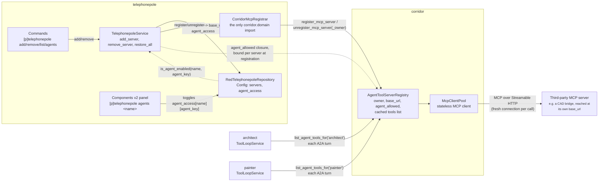
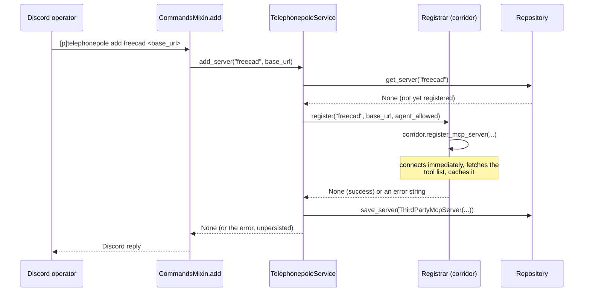

# telephonepole: dynamic third-party MCP server registration

## 1. Overview

`telephonepole` lets a bot owner register/unregister **third-party MCP
servers** at runtime, via Discord commands, and gates their tools per
registered A2A agent (`architect`, `painter`). It generalizes
[`suggestionbox`](suggestionbox-design.md)'s own pattern -- suggestionbox
runs its own in-process MCP server and registers exactly that one fixed
`base_url` with corridor -- to any number of external MCP endpoints a bot
owner adds after the fact, none of which telephonepole runs or owns
itself.

A concrete example: a bot owner might run a separate MCP server bridging
to a CAD application (e.g. [`freecad-mcp`](https://github.com/neka-nat/freecad-mcp),
reachable at some `http://<host>:<port>/mcp` endpoint) and register it with
`[p]telephonepole add freecad http://<host>:<port>/mcp`. Once registered,
`architect`/`painter`'s own tool-calling loop can call that server's tools
exactly as if they were corridor's own -- telephonepole never sees a tool
call after registration; it only manages the registration lifecycle.
Nothing about where that server runs, how it's deployed, or how it's
network-reachable is telephonepole's concern -- it treats every registered
server as an opaque `base_url` corridor's `McpClientPool` already knows how
to speak Streamable HTTP to.

## 2. Architecture



telephonepole is a pure consumer of corridor's existing
`AgentToolServerRegistry` -- the same registry suggestionbox registers its
own server into (see [`suggestionbox-design.md`](suggestionbox-design.md)
§2 for why that registry exists as a third one, parallel to
`ToolRegistryService`/`AgentDirectoryService`, rather than a reuse of
either). No corridor change was needed to support telephonepole: the
registry was already generic to "any owner, any `base_url`" -- telephonepole
is simply the first cog that registers more than one, and the first whose
servers are added by a bot owner at runtime rather than fixed at `cog_load`
time from the registering cog's own settings.

## 3. Domain model / schema

```python
# domain/models.py
@dataclass(frozen=True, slots=True)
class ThirdPartyMcpServer:
    name: str        # telephonepole's own primary key
    base_url: str     # that server's Streamable HTTP endpoint, used verbatim
```

`name` and `base_url` are deliberately two different keys. Corridor's
`AgentToolServerRegistry` is keyed by `base_url` (one owner per URL,
enforced by a `ValueError` on collision -- see §6). telephonepole's own
`name` is what a bot owner actually types (`[p]telephonepole remove
freecad`), and lets the same URL be re-added under a new name later
without colliding with corridor's own base_url-keyed bookkeeping mid-swap.

Persisted in Red `Config` (global, not per-guild -- an agent's own tool
call carries no guild context, same rationale suggestionbox's own
`mcp_enabled_agents` uses):

```python
GLOBAL_DEFAULTS = {
    "servers": {},        # name -> base_url
    "agent_access": {},   # name -> {agent_key: enabled}
}
```

## 4. Key flows

### Adding a server



`add_server` only persists the entry if registration actually succeeded --
a name collision (checked first, without calling the registrar again), a
connection failure, or a `base_url` already owned by a different cog all
come back as an error string instead of a silent no-op or a stale,
unreachable persisted entry.

### Restoring on cog_load

Corridor's `AgentToolServerRegistry` is in-process, in-memory state -- it
does not survive a bot restart, even though telephonepole's own `Config`
does. `cog_load` calls `TelephonepoleService.restore_all()`, which
re-registers every persisted server and collects `{name: error}` for any
that fail (network down, server no longer reachable, etc.) without
raising -- a failed entry stays in `Config` (so `[p]telephonepole list`
still shows it and a bot owner can see something needs attention) and the
bot owner is notified by DM.

### Removing a server

`remove_server(name)` looks the server up, calls the registrar's
`unregister(base_url)` (corridor's `unregister_mcp_server`, a synchronous
no-op if absent), then deletes it from `Config`. An unknown `name` returns
an error without touching corridor at all.

### Per-agent access toggle

Every newly-added server starts with **no** agent able to use its tools --
same "off by default" rule suggestionbox's own single global toggle uses,
generalized here to per-server. `[p]telephonepole agents <name>` opens a
Components V2 panel (paginated, one row per agent currently registered in
corridor's `AgentDirectoryService`) to flip `agent_access[name][agent_key]`
in `Config`. That flag is read fresh by the `agent_allowed` closure bound
at registration time (`TelephonepoleService._agent_allowed_for`), which
corridor's registry calls on every agent's tool-loop turn -- so a toggle
takes effect on that agent's very next turn, no cog reload or
re-registration required.

## 5. Command reference

All bot-owner-only (`@commands.is_owner()`) -- this is bot-wide capability
configuration, not guild content.

| Command | Description |
|---|---|
| `[p]telephonepole add <name> <base_url>` | Register a third-party MCP server's Streamable HTTP endpoint under `name` |
| `[p]telephonepole remove <name>` | Unregister a previously-added server |
| `[p]telephonepole list` | List every registered server and its `base_url` |
| `[p]telephonepole agents <name>` | Open the per-agent access panel for one registered server |

## 6. Validation & error handling

`TelephonepoleService` never raises out to its caller -- every failure
mode returns an error string (or, for `restore_all`, a `{name: error}`
mapping), matching corridor's own `AgentToolServerRegistry.register`
never-raise convention:

- **Name already in use** -- checked against telephonepole's own
  repository *before* calling the registrar, so a duplicate `add` never
  triggers a redundant registration attempt.
- **Registrar connection failure** (the third-party server is unreachable,
  refuses the connection, etc.) -- corridor's `McpClientPool.list_tools`
  raises `McpRequestError` internally; `AgentToolServerRegistry.register`
  catches it and returns the message as a string, which `add_server`
  passes straight through, unpersisted.
- **Cross-owner `base_url` collision** -- corridor's registry deliberately
  *raises* `ValueError` (not an error string) when the same `base_url` is
  already registered by a different owner, treating it as a real authoring
  conflict rather than something to silently paper over.
  `TelephonepoleService.add_server`/`restore_all` catch that `ValueError`
  and fold it into the same string-error return, so a bot owner sees one
  consistent failure surface regardless of which layer rejected the
  request.
- **`restore_all` on `cog_load`** -- a per-server failure is collected,
  not fatal to the cog's own load; the bot owner is notified by DM (a
  best-effort send, itself wrapped so a DM failure can't fail `cog_load`).

## 7. Design rationale

**Why a separate cog instead of extending suggestionbox.** suggestionbox
owns and runs its own MCP server -- its `info.json` requirements
(`mcp>=1.29,<2`, `uvicorn`) reflect that. telephonepole never runs an MCP
server or imports `mcp` types at all; it only calls out to servers other
processes run. Folding both into one cog would mix "I am an MCP server"
and "I register other MCP servers" into one Config schema and one command
surface for no shared benefit -- the only thing they actually share is
corridor's registry, which both already reach through the same public
`register_mcp_server`/`unregister_mcp_server(_owner)` surface.

**Why `owner="Telephonepole"` for every server.** Corridor's registry
scopes unregistration by owner (`unregister_owner`), letting a cog drop
everything it registered in one call on `cog_unload` -- the same
convention `ToolRegistryService`/`AgentDirectoryService` already establish.
Every server telephonepole adds shares that one owner string regardless of
which bot-owner-chosen `name` it's stored under, so `cog_unload` can call
`unregister_mcp_server_owner("Telephonepole")` once instead of tracking
and individually unregistering each `base_url` it currently holds.

**Why `ServerRepository`/`McpRegistrar` protocols instead of calling
corridor directly from `application/service.py`.** Keeping
`TelephonepoleService` framework-agnostic (no `corridor`/`redbot`/`discord`
import) means its registration-lifecycle logic -- the name-collision check,
the persist-only-on-success ordering, the `ValueError`-to-string folding --
is unit-testable with plain in-memory fakes, no Red `Config` stub or a real
corridor instance required. `adapters/cog_base.py`'s `CorridorMcpRegistrar`
is the only place in this cog that imports `corridor.domain` or calls
corridor's registration methods, mirroring the same
"corridor-agnostic business logic, corridor-aware adapter" split
`suggestionbox/application/feedback_service.py` already uses for its own
corridor integration.

**Why per-server `agent_allowed`, not one global toggle.** suggestionbox
only ever registers one server, so a single `mcp_enabled_agents` dict is
enough. telephonepole manages an open-ended set of third-party servers,
each potentially trusted differently -- a bot owner may want `architect`
to use one server's tools but not another's. `agent_access` is keyed by
server `name` first, agent key second, and the closure bound at
registration time (`_agent_allowed_for`) reads it by that server's own
name, so each registered server's access is independent of every other's.
