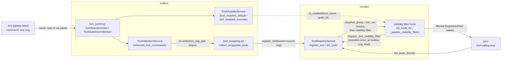
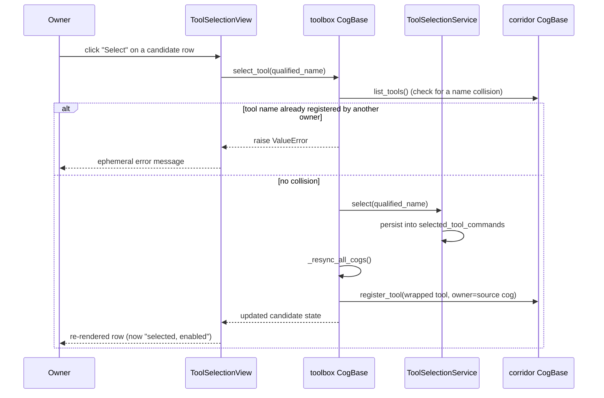
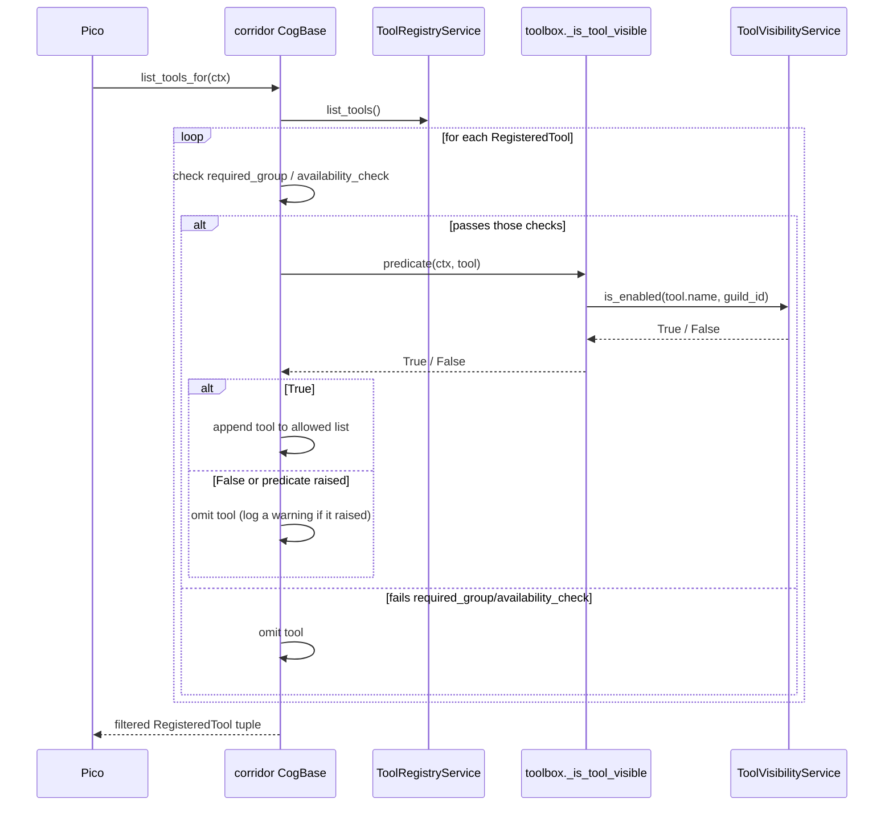
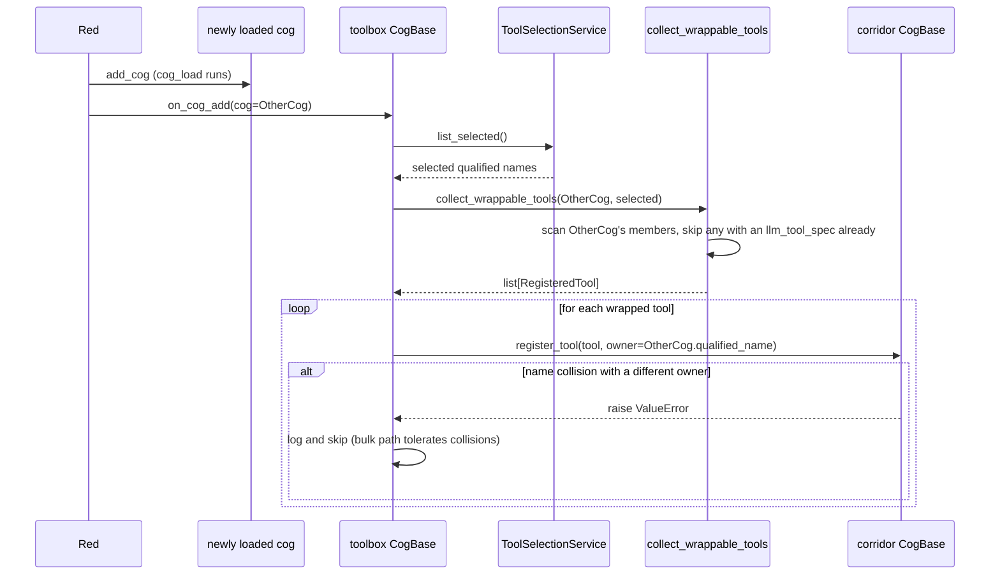
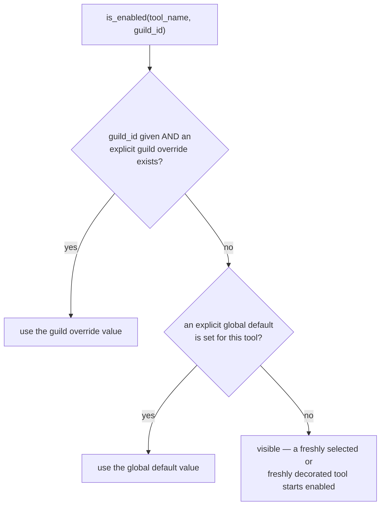

# Toolbox: turning any Discord command into an LLM tool

## Overview

[`corridor`'s cross-cog tool registry](corridor-tool-registry-design.md) lets
a cog opt one of its own commands into LLM visibility at authoring time, via
`@llm_tool()`. That's a per-command decision made in code and shipped with
the cog.

`toolbox` adds a second, orthogonal path: the **bot owner** picks, at
runtime, from *any* command listed in `[p]help` — including commands their
author never decorated — and turns it into an LLM tool, per guild, through
a Components v2 UI. Neither path replaces the other; a command is
tool-eligible because its author wrote `@llm_tool()`, or because the bot
owner opted it in through toolbox, or both — toolbox can also hide an
already-decorated tool a guild doesn't want exposed.

Ownership is split deliberately:

- **corridor** stays the single in-memory enforcement point and the only
  thing Pico ever talks to. It exposes one extensibility primitive for this
  feature — a visibility filter hook — and nothing else. It persists
  nothing: a provider registers, a consumer lists, and nothing in between
  remembers anything across a restart.
- **toolbox** owns every runtime decision: which commands are candidates,
  which the owner selected, which are enabled globally vs. per guild, and
  the UI to manage all of it. It's the only package that talks Red Config
  for this feature, matching its existing global-Config precedent for
  host-wide, owner-gated settings (`toolbox/infrastructure/settings_repository.py`).

## Architecture



`toolbox` never bypasses corridor's registry: every tool it produces —
whether wrapped from an undecorated command or already `@llm_tool`-decorated
by its own author — is a plain `RegisteredTool` entry that goes through the
exact same `list_tools_for` path. The only thing toolbox adds to that path
is one more gate, installed as a predicate corridor calls for every tool on
every listing.

## Domain model/schema

Toolbox keeps two independent pieces of state apart, because conflating
"should this command ever be wrapped as a tool" with "is that tool
currently visible" produces broken state across a cog reload:

1. **Selection** (global Config): the set of command qualified names
   (`"deskutils count"`, not the Python identifier) the owner has chosen to
   expose as a tool. This persists independent of whether the source cog
   happens to be loaded right now — it's a decision about the command, not
   about the current registry contents.
2. **Visibility** (global default, plus a per-guild override): whether a
   selected — or already `@llm_tool`-decorated — tool is currently enabled.
   The global default applies everywhere; a guild override, when present,
   wins for that guild. This is what toolbox's visibility filter consults.

A command can be selected but disabled (the owner picked it, then turned it
off everywhere or in one guild); it can never be enabled without being
either selected or already decorated — there's nothing to enable.

```python
# toolbox/infrastructure/settings_repository.py -- node-install keys
GLOBAL_DEFAULTS = {"installed_version": None, "installed_dir": None}

# toolbox/infrastructure/tool_selection_repository.py
GLOBAL_DEFAULTS = {
    "selected_tool_commands": [],       # list[str] of qualified names
}

# toolbox/infrastructure/tool_visibility_repository.py
GLOBAL_DEFAULTS = {
    "tool_enabled_default": {},         # dict[str, bool], tool name -> default
}
GUILD_DEFAULTS = {
    "tool_enabled_override": {},        # dict[str, bool], tool name -> override
}
```

The visibility repository is keyed by `RegisteredTool.name` (e.g.
`deskutils_time`, `other_greet` — the qualified name with spaces replaced by
underscores), not the space-separated command qualified name selection uses:
that's the same string corridor's visibility filter predicate receives on
every `list_tools_for` call, so no reverse lookup is needed at filter time.

All three repository classes (`RedNodeRepository`, `RedToolSelectionRepository`,
`RedToolVisibilityRepository`) call `Config.get_conf(cog, identifier=CONFIG_IDENTIFIER,
...)` against the same identifier constant, re-exported from
`settings_repository.py`. Red's `Config` is a singleton per (cog name,
identifier) pair, and `register_global`/`register_guild` accumulate keys
across separate calls, so splitting one cog's Config surface across several
repository files this way is safe. `register_guild` is exclusive to
`RedToolVisibilityRepository` — the node-install state and the selection set
are deliberately global-only; visibility is the one concern here that's
genuinely guild-scoped.

## Key flows

### An owner selects a command through the panel



### `list_tools_for` applies the visibility filter at listing time



No filter installed at all (toolbox not loaded) means no behavior change:
every tool that already passes the existing `required_group`/`can_run`
checks stays visible exactly as it does without this feature.

### A new cog loads and resyncs its selected-but-undecorated commands



`on_cog_add` is Red's own cog-lifecycle event (dispatched from
`Red.add_cog`), not stock discord.py, and it fires for every cog Red loads —
including ones that finish loading after toolbox itself. Toolbox's own
`cog_load` also calls this resync once for every already-loaded cog, so
commands selected before toolbox restarts are re-wrapped without needing an
"all cogs are up" signal; it reacts to each cog exactly as it appears,
mirroring how `redbot/cogs/permissions/permissions.py` resyncs its own
derived state on `on_cog_add`.

Cleanup needs no handler at all on the unload side: toolbox registers each
wrapped tool under `owner=cog.qualified_name` — the *source* cog's name, not
`"Toolbox"` — so corridor's own defensive `on_cog_remove` listener, which
already calls `unregister_owner(cog.qualified_name)` unconditionally on
every cog removal, does the cleanup for free.

## API/command reference

| Command | Permission | UI/service invoked |
|---|---|---|
| `[p]toolbox tools` | Bot owner | Opens `ToolSelectionView`: select/deselect a candidate command, toggle a tool's global enabled default |
| `[p]toolbox tools guild` | Guild admin (`manage_guild` or Administrator) | Opens `ToolGuildOverrideView`: enable/disable, or reset to default, any currently registered tool's visibility for this guild |

Both commands carry `@commands.guild_only()`, so neither panel can be opened
in a DM — the owner manages the global default from inside a guild they can
run `[p]toolbox tools` in.

Candidates for `[p]toolbox tools` are enumerated with `bot.walk_commands()`
and filtered by `list_candidate_commands`, the same way Red's own help
formatter filters commands for `[p]help`: skip `hidden`, skip a command
that's `not enabled`, skip one the invoking owner can't `can_run`. Each
resulting row shows the command's qualified name, its `short_doc`, its
current state (`already an @llm_tool` / `selected, enabled` / `selected,
disabled` / `not selected`), and one action appropriate to that state. Both
views paginate a fixed `PAGE_SIZE = 5` slice of an already-computed
in-memory list — page state lives on the view instance and is rebuilt in
place on prev/next, never by re-walking commands or re-reading Config
mid-pagination.

Underlying service methods, called from the panel's button callbacks:

- `CogBase.select_tool(qualified_name)` — checks for a tool-name collision
  against every currently registered tool (`corridor.list_tools()`) and
  raises `ValueError` if one exists, otherwise persists the selection and
  re-syncs every loaded cog immediately so the tool becomes usable right
  away.
- `CogBase.deselect_tool(qualified_name)` — persists the deselection and
  calls `corridor.unregister_tool(tool_name)` directly, since deselection
  can't wait for the next resync and `unregister_owner` would be the wrong
  shape (it would also drop the same cog's other selected tools).
- `ToolVisibilityService.set_default` / `.set_override` / `.clear_override`
  — back the enabled-by-default and per-guild toggle/reset buttons.

Wrapping an undecorated command reuses corridor's own parameter-inference
core rather than a second, parallel schema builder. `corridor/domain/llm_tools.py`'s
`infer_parameters(func, *, strict)` builds the same `{"type": "object",
"properties": ..., "required": ...}` shape `@llm_tool` always produces;
`strict=True` (what `@llm_tool` itself uses) raises `TypeError` on an
unsupported annotation at import time, an authoring error the cog's own
author is right there to fix. `strict=False` (what toolbox's
`collect_wrappable_tools` uses) has no author to hand that error to, so it
falls back to a generic `{"type": "string", "description": "raw value for
<param>, as you would type it in Discord"}` for just that one parameter
instead of raising. Toolbox's wrapper builds a `RegisteredTool` whose
`handler` invokes the target command the same way decorated tools already
do (`callback(cog, ctx, **arguments)`) and whose `name` follows the exact
same qualified-name-with-underscores convention `@llm_tool` uses by
default, so a decorated tool and a toolbox-wrapped tool for the same command
produce indistinguishable names.

The panel views send themselves with `ctx.send(view=...)` — a Components v2
dispatch with no `content=`/`embed=` alongside it — rather than through
`corridor.send_reply()`/`render_reply()`. Components v2 cannot be mixed with
plain content or an embed, so a `view=`-only send is structurally unable to
honor a guild's configured `ReplyMode` either way; the confirmation and
error messages the node-install commands send (`[p]toolbox node install`,
etc.) do go through `corridor.send_reply()` like every other cog's plain
replies.

## Validation & error handling

**Toggle precedence.** `ToolVisibilityService.is_enabled(tool_name,
guild_id)` resolves one tool's visibility for one guild (or `None` for a
DM-less/global check) in a fixed order:



A guild override always wins over the global default for that guild; no
override and no explicit default means visible — the owner opts a tool
*out*, not in. This is why `ToolVisibilityRepository.get_default`/
`get_override` return `bool | None` rather than defaulting to `False`
themselves: the service, not the repository, is what distinguishes "no
explicit decision yet" from "explicitly disabled."

**Name collisions.** `ToolRegistryService.register` raises `ValueError` on a
cross-owner name clash. The two toolbox call sites treat that differently
by context: `CogBase.select_tool` — a single, explicit user action —
propagates the error so the panel can surface it as an ephemeral message
instead of silently no-opping; `CogBase._resync_tool_registrations` — a bulk
path that runs for every cog on every load, not just the one command a user
just selected — catches it, logs a warning, and continues with the rest of
that cog's wrappable commands.

**Filter and availability-check failures fail closed.** If toolbox's
visibility predicate (or any `RegisteredTool.availability_check`) raises
during `list_tools_for`, corridor logs a warning and omits that tool rather
than propagating the exception — one broken check can't take down the whole
tool listing for an LLM turn, and a tool an owner cannot currently evaluate
the visibility of is treated as not visible rather than as visible.

**Wrapper contract.** A dynamically wrapped tool's `handler` must invoke the
exact callback Red would invoke for that command, including any
parent-group `cog_load`/permission wiring the callback itself performs —
`collect_wrappable_tools` calls `command.callback` directly, so it inherits
whatever validation that callback already does, and adds only a generic
result-shape check: a `None` return becomes `{"status": "ok"}`, any other
non-mapping return raises `TypeError` before it reaches the calling LLM.
Toolbox never mutates a command's own `@llm_tool` decoration or its
registration; the visibility filter can only hide a decorated tool, never
remove or replace its `RegisteredTool` entry.

## Design rationale

**A visibility filter hook, not a mutated registry.** Corridor's
`ToolRegistryService` stores exactly one thing per name: an owner and a
`RegisteredTool`. Adding toolbox-specific enabled/disabled state directly to
that dict would mean every consumer of `list_tools()`/`register_tool()`
needs to understand toolbox's guild-override semantics, and corridor would
have to start persisting something across restarts — the one property that
keeps it a pure, stateless enforcement point today. A predicate registered
through `register_tool_visibility_filter` keeps corridor's contract
unchanged (`RegisteredTool` gains no new field, `register_tool` and
`register_llm_tools` are untouched) while giving toolbox a normal place, in
its own Config, to persist admin decisions. A decorated tool and a
toolbox-selected tool are indistinguishable once registered — both are just
`RegisteredTool` entries in the same dict, and both pass through the same
filter, so hiding one never requires knowing which path produced it.

**Enumeration mirrors `[p]help`'s own filtering.** `list_candidate_commands`
applies the same `hidden`/`enabled`/`can_run` checks Red's help formatter
uses to decide what `[p]help` shows a given invoker. Toolbox's candidate
list could apply a different, toolbox-specific eligibility rule instead, but
that would mean explaining two overlapping definitions of "commands this
bot owner can currently reach" — one for `[p]help`, one for the tool panel.
Matching `[p]help`'s own rule means "what toolbox offers to wrap" is always
exactly "what `[p]help` would show that owner," with no separate mental
model to maintain.
