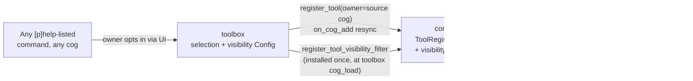

# Toolbox: turning any Discord command into an LLM tool

## Overview

[`corridor`'s cross-cog tool registry](corridor-tool-registry-design.md) lets
a cog opt one of its own commands into LLM visibility at authoring time, via
`@llm_tool()`. That's a deliberate, per-command decision made in code and
shipped with the cog.

This doc adds a second, orthogonal path: letting the **bot owner** pick,
at runtime, from *any* command listed in `[p]help` — including commands
their author never decorated — and turn it into an LLM tool, per guild,
through a Components v2 UI in `toolbox`. Neither path replaces the other;
a command can be tool-eligible because its author wrote `@llm_tool()`, or
because the bot owner opted it in through toolbox, or both (toolbox can
also hide an already-decorated tool a guild doesn't want exposed).



Ownership is split deliberately:

- **corridor** stays the single in-memory enforcement point and the only
  thing Pico ever talks to. It gains one new extensibility primitive — a
  visibility filter hook — and nothing else. It still persists nothing;
  that design constraint from the original registry doc is unchanged.
- **toolbox** owns every runtime decision: which commands are candidates,
  which the owner selected, which are enabled globally vs. per guild, and
  the UI to manage all of it. It's the only package that talks Red Config
  for this feature.

This split keeps corridor exactly as pure as it is today — a provider
registers, a consumer lists, nothing in between remembers anything across
a restart — while giving toolbox a normal, self-contained place to persist
admin decisions, matching its existing global-Config precedent for
host-wide, owner-gated settings (`toolbox/infrastructure/settings_repository.py`).

## Two independent pieces of state

Conflating "should this command ever be wrapped as a tool" with "is that
tool currently visible" leads to broken state on cog reload, so toolbox
keeps them apart:

1. **Selection** (global Config): the set of command qualified names
   (`"deskutils count"`, not the Python identifier) the owner has chosen to
   expose as a tool. This persists independent of whether the source cog
   happens to be loaded right now — it's a decision about the command, not
   about the current registry contents.
2. **Visibility** (global default Config, plus a per-guild override
   Config): whether a selected — or already `@llm_tool`-decorated — tool is
   currently enabled. Global default applies everywhere; a guild override,
   when present, wins for that guild. This is what toolbox's visibility
   filter actually consults.

A command can be selected but disabled (owner picked it, then turned it
off everywhere or in one guild); it can never be enabled without being
either selected or already decorated — there's nothing to enable.

## Corridor's one new primitive: a visibility filter hook

```python
# corridor/domain/models.py
ToolVisibilityFilter = Callable[[commands.Context, RegisteredTool], Awaitable[bool]]

# corridor/adapters/cog_base.py
def register_tool_visibility_filter(self, predicate: ToolVisibilityFilter, *, owner: str) -> None:
    """Install an additional visibility gate evaluated inside
    `list_tools_for`, after the existing `required_group`/`can_run` checks.
    At most one filter is expected in practice (toolbox), but this takes
    `owner` and supports many, cleaned up via the same `on_cog_remove`
    defensive path as tools and event subscriptions."""

def unregister_visibility_filter_owner(self, owner: str) -> None:
    ...
```

`list_tools_for(ctx)` (`corridor/adapters/cog_base.py:594-622`) gets one
more step per tool, after the existing group/`can_run` checks and before
`allowed.append(tool)`: run every registered filter, short-circuit to
"omit" on the first `False`, and — matching the existing
`availability_check` behavior — log and omit (never raise) if a filter
throws. No filter installed (toolbox not loaded) means no behavior change
at all: every currently-registered tool stays visible exactly as it is
today.

This is deliberately the *only* corridor change. `RegisteredTool` gains no
new field; `ToolRegistryService` gains no persistence; `register_tool` and
`register_llm_tools` are untouched. A decorated tool and a
toolbox-selected tool are indistinguishable once registered — both are
just `RegisteredTool` entries in the same dict, both pass through the same
filter.

## Wrapping an undecorated command

Toolbox needs a `RegisteredTool` for a command whose author never wrote
`@llm_tool()`. Rather than a second, parallel schema inference, the
per-parameter inference core in `corridor/domain/llm_tools.py:167-223` is
extracted into a shared, strictness-parameterized helper:

```python
# corridor/domain/llm_tools.py
def infer_parameters(
    func: Callable[..., object], *, strict: bool
) -> dict[str, object]:
    """Build the same {"type": "object", "properties": ..., "required": ...}
    shape `@llm_tool` always has. `strict=True` (used by `@llm_tool` itself)
    raises `TypeError` on an unsupported annotation, at import time -- an
    authoring error. `strict=False` (used by toolbox's dynamic wrapper)
    instead falls back to a generic `{"type": "string", "description":
    "raw value for <param>, as you would type it in Discord"}` for just
    that one parameter, since there's no author to hand the error to."""
```

`@llm_tool()` becomes a thin caller of `infer_parameters(func, strict=True)`
plus its existing `ToolDescription`/`Annotated` handling (unchanged).
Toolbox's wrapper calls `infer_parameters(func, strict=False)` against the
target command's raw callback, builds a `RegisteredTool` whose `handler`
invokes the command the same way decorated tools already do
(`.callback(cog, ctx, **arguments)`), and whose `name` follows the exact
same qualified-name-with-underscores convention as `@llm_tool`'s default,
so the two paths produce indistinguishable names for the same command.

Toolbox pre-checks for a name collision (`corridor.list_tools()`, by name)
before calling `register_tool` and surfaces a collision as a UI error —
`ToolRegistryService.register` raises `ValueError` on a cross-owner name
clash, and a raised error from inside a button callback is a dead end for
the person clicking it, not a state worth reaching blind.

## Registering and re-syncing across cog load/unload

Toolbox registers wrapped tools the same way any provider does — `owner=
cog.qualified_name`, the *source* cog's name, not `"Toolbox"`. That one
choice is what makes cleanup free: corridor's own defensive
`on_cog_remove` listener (`corridor/adapters/cog_base.py:506-524`) already
calls `unregister_owner(cog.qualified_name)` unconditionally on every cog
removal. Toolbox never needs to react to unload at all.

Toolbox only needs the load side, using Red's own cog lifecycle event —
not corridor's PubSub bus, which is for domain events between cogs that
already know about each other, not bot-lifecycle plumbing:

```python
# toolbox/adapters/cog_base.py
@commands.Cog.listener()
async def on_cog_add(self, cog: commands.Cog) -> None:
    """Red-specific event (redbot/core/bot.py, dispatched from
    `Red.add_cog` after every `bot.add_cog`), including cogs loaded after
    toolbox itself. Re-wrap every selected-but-undecorated command the
    newly (re)loaded cog provides. Mirrors redbot/cogs/permissions/
    permissions.py's own on_cog_add resync for the same reason: derived
    state has to notice every cog it didn't load first."""
    if cog is self:
        return
    await self._resync_tool_registrations(cog)
```

`_resync_tool_registrations(cog)` -- a `CogBase` method, not a call onto
`NodeService`/`ToolSelectionService` -- delegates the actual command scan
to `collect_wrappable_tools(cog, selected)` in
`toolbox/adapters/tool_wrapping.py`: it walks `cog`'s members (mirroring
corridor's own `collect_registered_tools` scanner), and for each command
whose qualified name is in toolbox's selection Config and that has no
`llm_tool_spec()` already (an author-decorated command re-registers itself
at its own `cog_load` and needs no help from toolbox), synthesizes a
`RegisteredTool`; `_resync_tool_registrations` then calls
`self._corridor.register_tool(tool, owner=cog.qualified_name)` for each
one, tolerating (and logging) a name collision here since this bulk path
runs for every cog on every load, not just the one command a user just
selected.

Startup ordering is a non-issue: `on_cog_add` fires once per cog for every
cog Red loads, including ones that finish loading after toolbox, so
toolbox never needs an "all cogs are up" signal — it reacts to each cog as
it actually appears, exactly like `permissions` does today.

## The UI

Two separate `discord.ui.LayoutView`s in `toolbox/adapters/tool_panel.py`
— `ToolSelectionView` (global panel, `[p]toolbox tools`) and
`ToolGuildOverrideView` (per-guild panel, `[p]toolbox tools guild`) —
structurally cloned from `corridor/adapters/settings_ui.py`'s
`SharedSettingsView`/`build_shared_settings_container()`: a `Container` of
rows, one per candidate command or registered tool, each row a
`TextDisplay` plus an `ActionRow` of toggle `Button`s. Pagination is
toolbox's own fixed `PAGE_SIZE = 5` slice of an already-computed
in-memory list, with page state living on the view instance and rebuilt
in place on prev/next — closer to floorplan's `LayoutBrowseView` shape
than a `Select`-driven one. Neither view uses a `discord.ui.Select` at
all, so `corridor/ui_limits.py`'s 25-option-`Select` limit doesn't apply
here; its component-count checker (`check_ui_tree`) does validate both
views' rendered component trees, but only in tests
(`toolbox/tests/test_discord_ui_limits.py`), not as a runtime pagination
helper the views themselves call. No new interaction pattern beyond that;
this is the fourth cog to use the `LayoutView` shape.

Candidates are enumerated with `bot.walk_commands()`, filtered the same
way Red's own help formatter filters (`redbot/core/commands/help.py:
717-746`): skip `hidden`, skip a command that's `not enabled`, skip one
`ctx.author` (the owner opening the panel) can't `can_run`. This keeps
"what toolbox offers to wrap" identical to "what `[p]help` would show that
owner" — no separate, harder-to-explain eligibility rule.

Each row shows: command qualified name, short doc (`command.short_doc`),
current state (`already an @llm_tool` / `selected, enabled` / `selected,
disabled` / `not selected`), and one action appropriate to that state.
The guild-override rows are not a conditional section rendered inside the
global panel; they live entirely in the separate `ToolGuildOverrideView`,
reached only through the separate, admin-gated `[p]toolbox tools guild`
command. Both `tools` and `tools guild` (like every `toolbox` command)
carry `@commands.guild_only()`, so neither panel can actually be opened in
DMs at all — the owner manages the global default from inside a guild
they can run `[p]toolbox tools` in, not from DMs as an earlier draft of
this design assumed.

## Config shape

```python
# toolbox/infrastructure/settings_repository.py -- unchanged, node-install keys only
GLOBAL_DEFAULTS = {"installed_version": None, "installed_dir": None}

# toolbox/infrastructure/tool_selection_repository.py -- new file
GLOBAL_DEFAULTS = {
    "selected_tool_commands": [],       # list[str] of qualified names
}

# toolbox/infrastructure/tool_visibility_repository.py -- new file
GLOBAL_DEFAULTS = {
    "tool_enabled_default": {},         # dict[str, bool], qualified name -> default
}
GUILD_DEFAULTS = {
    "tool_enabled_override": {},        # dict[str, bool], qualified name -> override
}
```

Shipped as two new `infrastructure/` repository files rather than growing
`settings_repository.py` itself, each with its own repository class
(`RedToolSelectionRepository`, `RedToolVisibilityRepository`) -- but all
three files call `Config.get_conf(cog, identifier=CONFIG_IDENTIFIER, ...)`
against the *same* identifier constant, re-exported from
`settings_repository.py`, since Red's Config is a singleton per
(cog name, identifier) pair and `register_global`/`register_guild`
accumulate keys across separate calls.

`register_guild` is new for toolbox (today the node-install state and the
selection set are global-only, deliberately); this feature's visibility
layer is the first toolbox concern that's genuinely guild-scoped, so
`RedToolVisibilityRepository` gets its own `register_guild` call alongside
`register_global`, not a repurposing of the existing one.

## What does *not* change

- `RegisteredTool`, `register_tool`, `register_llm_tools`,
  `unregister_owner`, `list_tools` — untouched. `ToolRegistryService` gains
  exactly one more small addition beyond the visibility-filter hook above:
  `unregister(name)` / `CogBase.unregister_tool(name)`, removing one tool
  regardless of owner. Toolbox needs this because deselecting a single
  dynamically-wrapped command must not touch its sibling tools registered
  under the same owner — `unregister_owner`'s all-or-nothing cascade is
  the wrong shape for that one case.
- `@llm_tool()`'s own behavior, its `strict` error-at-import-time
  contract, `ToolDescription`, and the `Annotated`-stripping mechanism —
  untouched; `infer_parameters` extraction is a refactor with the same
  observable behavior at `strict=True`.
- Pico's adaptation of `RegisteredTool` into `CrossCogTool` — untouched;
  it already treats every `RegisteredTool` identically regardless of
  where it came from.
- corridor's PubSub event bus — not used by this feature at all.

## Author/operator checklist

1. A dynamically-wrapped tool's `handler` must invoke the *exact* callback
   Red would invoke for that command, including any parent-group
   `cog_load`/permission wiring the callback itself performs — no
   shortcuts around a command's own internal checks.
2. Toolbox never mutates a command's own `@llm_tool` decoration or its
   registration; it can only hide a decorated tool via the visibility
   filter, never remove or replace its `RegisteredTool` entry.
3. A collision between a decorated tool's default name and a
   toolbox-synthesized name for a *different* command is a toolbox-side
   UI error at selection time, not a corridor-side crash at registration
   time.
4. Every new toolbox command/view in this feature stays owner-gated
   (`@commands.is_owner()` for the global default panel) or admin-gated
   per-guild, matching corridor's own settings-UI permission story — this
   is bot-configuration surface, not a general utility.
5. `send_reply`/Components v2 output goes through corridor exactly like
   every other cog's UI; no raw `ctx.send`/`interaction.response.
   send_message`.
