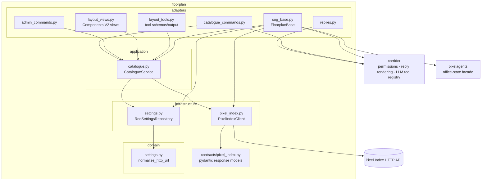
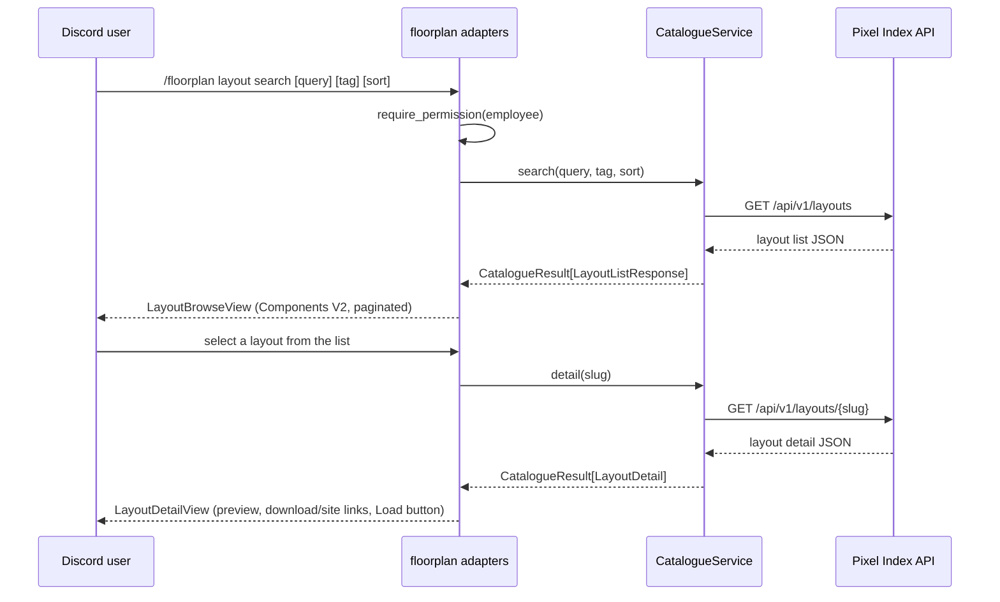
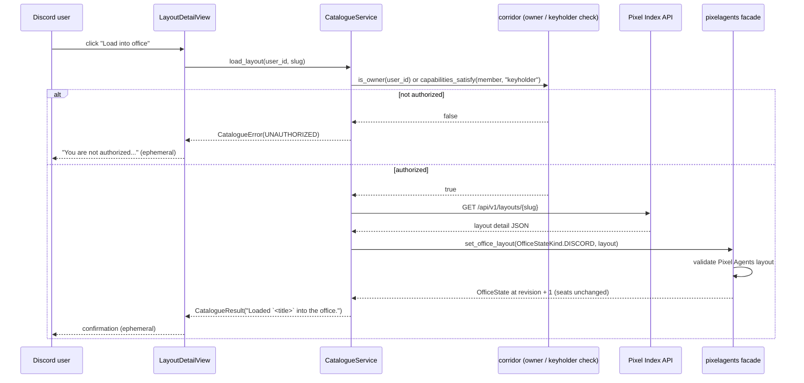

# Floorplan architecture

Floorplan is the Pixel Index HTTP adapter cog. It normalizes and stores the
two Pixel Index endpoint URLs, wraps the public Pixel Index REST API behind
one lifecycle-managed `aiohttp` client, serves catalogue search/detail as
Discord commands and Corridor LLM tools, and authorizes + applies a selected
layout into Pixelagents' `discord` office-state aggregate. `cctv` owns every
browser-facing office responsibility (Dashboard pages, WebSocket transport,
guild scanning, presence projection); floorplan carries none of that.

## Components and dependencies

`application/catalogue.py` depends only on the `PixelIndexGateway` and
`CatalogueRepository` protocols it defines, plus two injected callables
(`can_edit_layout`, `apply_layout`) — it never imports `discord`, `redbot`,
or `corridor` directly. `adapters/cog_base.py` supplies those callables at
composition time: `_can_edit_layout_user` checks bot ownership then
Corridor's `keyholder` capability across every guild the bot can resolve the
member in, and `_apply_catalogue_layout` calls
`pixelagents.set_office_layout(OfficeStateKind.DISCORD, layout)` — always the
`DISCORD` aggregate, never the `EDITOR` aggregate that Architect and Painter
write.

`adapters/replies.py` renders every reply through Corridor's
`render_reply` (a `RenderedReply` DTO, not a raw send) and then does its own
ctx/interaction dispatch on top of that, because floorplan's hybrid
slash-command flows need ephemeral responses and deferred followups that
Corridor's higher-level `send_reply` doesn't cover. A command that replies
with a Components V2 `view=` (the catalogue browse/detail views) bypasses
rendering entirely and is sent as-is, since Discord rejects mixing
Components V2 with plain content or an embed.

## Key flows

### Catalogue search and view

Both commands are also registered as Corridor LLM tools
(`floorplan_layout_search`, `floorplan_layout_view`) under the same
`employee` requirement; the tool handler returns the same JSON-safe summary
it renders into Discord, with the full layout blob omitted from the detail
output.

### Loading a layout into the Discord aggregate

The write touches only the `discord` aggregate's `layout` field; `seats` is
carried over unchanged, and the `editor` aggregate is never read or written.
If `cctv` is loaded, it receives the resulting `OfficeStateChanged` event
from Corridor and pushes the update to connected browsers over its own
WebSocket transport — that delivery path is entirely outside floorplan.

An invalid layout (rejected by Pixelagents' validation) or an unreachable/
malformed Pixel Index response surfaces as a `CatalogueError` with a stable
`CatalogueErrorCode` (`timeout`, `transport`, `http_status`, `invalid_json`,
`invalid_response`, `unauthorized`, `invalid_layout`), which every adapter —
Discord reply, Components V2 view, and LLM tool output — renders as the same
user-safe message.

## Configuration and the Pixel Index contract

The Config repository stores exactly `pixel_index_api_url` and
`pixel_index_web_url` under a Config identity scoped to this cog. The Pixel
Index consumer contract is generated from `floorplan/contracts/pixel_index.py`
and the endpoint registry under `contracts/pixel_index/`; see
[`docs/contract-testing.md`](../docs/contract-testing.md).

See [PERMISSIONS.md](PERMISSIONS.md) for exactly which permission tier each
command and the load button require.
