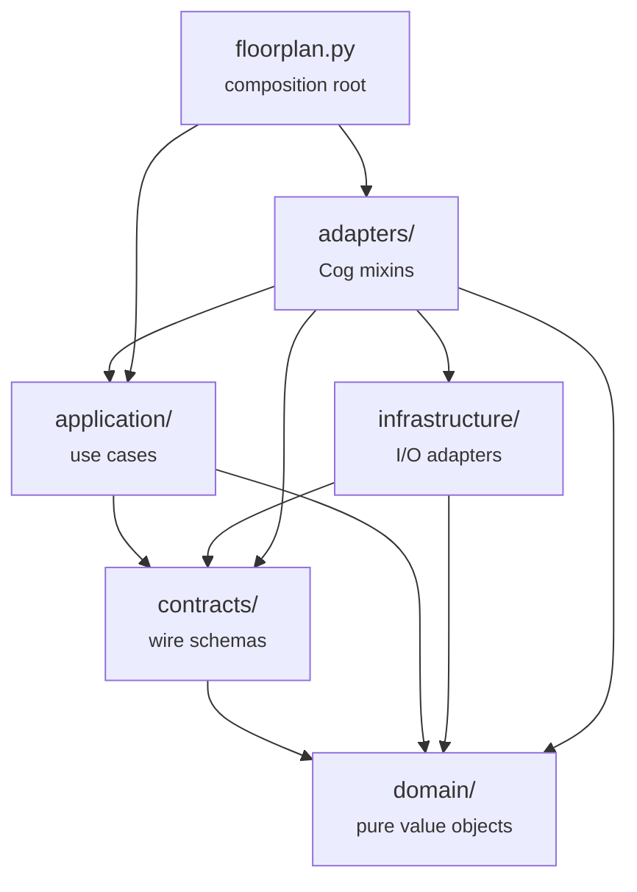
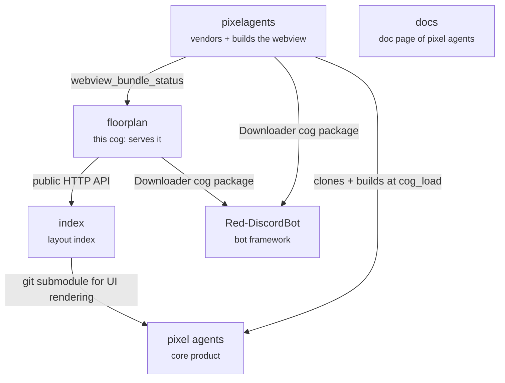
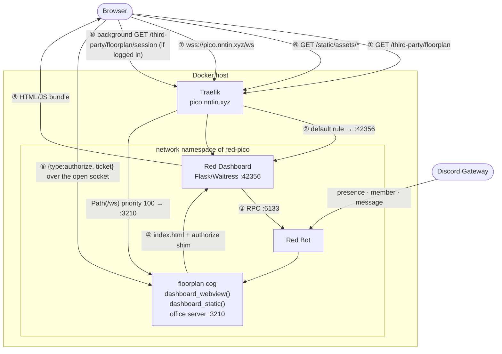

# Floorplan Architecture

`floorplan` is a Red DiscordBot cog that does three things:

1. **Serves the Pixel Agents office** — hosts the browser bundle
   [`pixelagents`](../pixelagents) builds, through the Red Web Dashboard
   third-party page system, and serves the office WebSocket protocol
   itself.
2. **Mirrors Discord presence** — turns guild presence, activity, and message
   events into the office's `ServerMessage` protocol.
3. **Integrates with Pixel Index** — browses the public layout catalogue from
   Discord and loads selected layouts into the shared office.

floorplan is the Pixel Agents runtime adapter for Red: it serves the
browser bundle and implements the office WebSocket protocol directly. It
does not build that bundle itself — see "The webview bundle" below — and it
does not depend on a separate producer-ingress service.

This cog, and [`pixelagents`](../pixelagents), used to be one combined Cog.
[Issue #21](https://github.com/pixel-agents-hq/pixel-agents-cogs/issues/21)
split it: pixelagents kept vendoring and building the webview; floorplan —
scaffolded from `.cookiecutter/cog-cookiecutter` — inherited everything
else. floorplan declares `pixelagents` in `required_cogs` and depends on it
at runtime.

## Internal structure

`floorplan.py` is deliberately only the stable composition entrypoint.
Runtime behavior is organized by responsibility:

| Area | Responsibility |
|---|---|
| `domain/` | Immutable, framework-free agent, activity, message, seat, and settings snapshots |
| `contracts/` | Validated WebSocket ingress, outbound message builders, layout schema, and Pixel Index response models |
| `application/` | Office reconciliation, presence projection, settings side effects, catalogue use cases, and supervised tasks |
| `infrastructure/` | Red Config, Discord normalization, aiohttp/WebSocket lifecycle, connected clients, tickets, Pixel Index HTTP, and webview assets |
| `adapters/` | Red commands, Discord listeners, Dashboard routes, Discord views, WebSocket application dispatch, and response policy |
| `floorplan.py` | The `Floorplan` Cog composition |

`adapters/cog_base.py` is the composition root. It constructs each
long-lived service once and coordinates `cog_load`/`cog_unload`; the other
adapter mixins contain only their framework-facing surface.

Resource ownership is intentionally singular:

| Resource | Owner |
|---|---|
| Red `Config` | `RedSettingsRepository` |
| Pixel Index `ClientSession` | `PixelIndexClient` |
| Office listener and connected sockets | `WebSocketServer` and `ClientHub` |
| Delayed clears and initial synchronization | `TaskSupervisor` |
| Decoded bundle assets | `WebviewAssetProvider` |
| Editor session tickets | `TicketStore` |

Shutdown first prevents new sends, then cancels and awaits supervised tasks,
closes the office listener and sockets, and finally closes the shared Pixel
Index client. This keeps reloads from leaking sessions, ports, or delayed
work.

### Layer boundaries



`floorplan/tests/test_architecture.py` enforces the one rule that actually
matters for keeping this acyclic: it AST-walks every file directly under
`application/` and fails if any has a two-level relative import (`from
..infrastructure ...` / `from ..adapters ...`) reaching outward into a
layer meant to depend on it, not the other way around.

## The webview bundle

`floorplan` does not vendor or build the Pixel Agents webview — that's
[`pixelagents`](../pixelagents)'s job entirely (see its own
Architecture.md). floorplan only ever reads the result, through a small
cross-cog surface:

```python
status = self._pixelagents.webview_bundle_status()  # WebviewBundleStatus
# status.dist_path, status.ready, status.detail, status.built_commit
```

`adapters/cog_base.py::_sync_webview_assets` calls this at `cog_load` and
before every public webview page render, points `WebviewAssetProvider` at
`status.dist_path`, and reloads its decoded sprite assets only when
`status.built_commit` changes — so `[p]pixelagents webview rebuild`
(pixelagents-only; floorplan has no rebuild trigger of its own) is picked
up without a floorplan reload. `[p]floorplan status`'s Assets field and the
public office page's "not installed yet" message both read
`status.detail` this way.

`self._pixelagents` is resolved once at `cog_load`, the same way corridor
is, via `dependency_loader.ensure_pixelagents_loaded` — `required_cogs` in
`info.json` is only a Downloader install hint, so this pulls pixelagents
back in if it was ever unloaded independently.

## Ecosystem integration



Pixel Agents supplies the office UI and WebSocket message contract. Pixel
Index pins that UI as a git submodule so its gallery can render layouts with
the same code as the core product. The docs site describes the core product
but is not part of the office-cogs runtime path.

At runtime, floorplan integrates with Pixel Index over its public HTTP API;
it does not connect to the index database or renderer directly:

```text
[p]floorplan layout search
  -> GET <pixel_index_api_url>/api/v1/layouts

[p]floorplan layout view <slug>
  -> GET <pixel_index_api_url>/api/v1/layouts/<slug>
  -> use <pixel_index_web_url>/layouts/<slug> for "View on site"

authorized "Load layout"
  -> validate the layout returned by Pixel Index
  -> persist it in Red's cog configuration
  -> broadcast layoutLoaded to every connected office client
```

Browsing is public. Loading a layout uses the same editor authorization as
local layout changes. The API and web origins are separate configuration
keys, so deployments can point the cog at production, staging, or a
self-hosted Pixel Index without rebuilding it.

One public entry point:

```text
https://pico.nntin.xyz/third-party/floorplan
```



## Routing

| Router | Rule | Target |
|---|---|---|
| `red-pico` | ``Host(`pico.nntin.xyz`)`` | `:42356` Red Dashboard |
| `red-pico-ws` | ``Host(`pico.nntin.xyz`) && Path(`/ws`)`` — priority 100 | `:3210` this cog |

Both routers point at the same container: `red-dashboard-pico` runs with
`network_mode: "service:red-pico"`, so the dashboard and the cog share one
network namespace.

`/ws` has to sit at the origin root because upstream's webview hardcodes
`<origin>/ws` (`webview-ui/src/transport/index.ts`) and is not subpath-aware.

> **Both routers must name their service explicitly.** Once a container
> declares two Traefik services, Traefik cannot infer a default and silently
> drops the router that lacks `traefik.http.routers.<name>.service=`. The
> symptom is the dashboard 404ing on every path, which reads like a dead app
> rather than a routing problem.

## Serving the bundle

```text
GET /third-party/floorplan            (public — no login required)
  → third_parties_blueprint.third_party
  → DASHBOARDRPC_THIRDPARTIES__DATA_RECEIVE over RPC
  → dashboard_webview() → index.html + authorize shim
  → rendered with standalone: true

GET /third-party/floorplan/session    (login required)
  → dashboard_session(user_id=…) → {"ticket": "…"} as JSON
  → fetched in the background by the shim, not navigated to directly

GET /third-party/floorplan/static/<asset_path>
  → third_party_static()  (a redstack patch, not upstream reddash)
  → dashboard_static() → base64 of webview_dist/<asset_path>
  → Cache-Control: public, max-age=3600
```

`/third-party/floorplan` — not `pixelagents` — because Red Dashboard's
third-party router derives the base path from the serving Cog's own name,
and floorplan is the Cog that registers `dashboard_page`/`on_dashboard_cog_add`.
pixelagents' Vite build is rooted at this same path (`--base
/third-party/floorplan/static/`, see pixelagents' Architecture.md) so the
two stay in sync without floorplan needing to tell pixelagents its route
name at runtime.

`_resolve_webview_asset` enforces a path-traversal guard
(`candidate.relative_to(root)`), so a crafted `asset_path` cannot escape
`webview_dist/`.

> **`dashboard_page` infers `context_ids` from the function signature**: any
> parameter with no default named `user_id` (or `guild_id`, `member_id`, …)
> becomes a context ID, which makes the dashboard require login before
> serving that page and hand back the visitor's Discord ID. `dashboard_webview`
> deliberately has no such parameter — that's what keeps the office public.
> `dashboard_session` deliberately does — that's the only login-gated route.
> Never pass `context_ids` explicitly to the decorator: it skips the
> inference branch and files the same-named parameter under
> `required_kwargs` instead, which 404s unless the caller appends the id as a
> query string (e.g. `?user_id=`).

## The `webviewReady` bootstrap

Order matters and mirrors upstream's `handleWebviewReady`:

```text
providerCapabilities
  → characterSpritesLoaded → floorTilesLoaded → wallTilesLoaded
  → carpetTilesLoaded → furnitureAssetsLoaded
  → settingsLoaded → areaMappingsLoaded
  → existingAgents → agentTeamInfo…
  → layoutLoaded            ← LAST
  → agentToolStart…         ← after the layout flush
```

`layoutLoaded` must come after `existingAgents`: the webview buffers agents and
only materializes characters when the layout arrives, so a layout-first
bootstrap renders an empty office. Activity bubbles reference those characters,
so they are replayed after it.

`petSpritesLoaded` is not sent — upstream's pet decoder lives in `server/`
rather than `core/`, so the build-time emitter does not cover it. The bundled
default layout has no pets.

## Editor authorization

The office page (`dashboard_webview`) is public — anyone can load it without a
dashboard login, and every socket starts out as a read-only viewer. Knowing
who a visitor *is* still requires a dashboard login, though, so identifying an
editor happens out-of-band:

1. The injected shim opens the office `/ws` socket immediately (viewers never
   wait on anything).
2. In parallel, the shim does a background `fetch()` of the `session` page.
   That page is login-gated (`dashboard_session(user_id=…)`), so an
   already-logged-in visitor gets back `{"ticket": "…"}` (8 h TTL, minted
   bound to their Discord ID); an anonymous visitor's fetch gets redirected to
   the dashboard's login HTML, which fails to parse as the expected JSON and
   is swallowed silently — no navigation, no prompt.
3. If a ticket comes back, the shim sends `{"type": "authorize", "ticket":
   "…"}` over the already-open socket.

Upstream offers no hook for a credential, and Traefik routes `/ws` past the
dashboard so the session cookie never reaches the socket — the ticket is the
only channel. The vendored bundle stays byte-identical to upstream's build;
none of this touches it.

On receiving `authorize` the cog resolves the ticket and applies:

```text
Allow if ANY of:
  1. the user is a bot owner
  2. the user satisfies corridor's "keyholder" permission group in an
     enabled guild (corridor's Owner tier -- bot owner or guild
     Administrator permission -- always satisfies this)
Deny otherwise
```

Permission configuration (which Discord roles count as Keyholder, and the
Owner/Employee tier display names) lives entirely in corridor, configured
via `[p]corridorsettings`; floorplan holds no role IDs of its own and
depends on corridor (`required_cogs`) to resolve the check. See
[PERMISSIONS.md](PERMISSIONS.md) for the full tier breakdown.

Sockets that never authorize (or fail the check above) stay **read-only
viewers**; `saveLayout`, `saveAgentSeats`, and `importLayout` are dropped
server-side regardless of what the client claims.

## Configuration

Global:

| Key | Default | Description |
|---|---|---|
| `ws_host` | `0.0.0.0` | Office server bind address |
| `ws_port` | `3210` | Office server port (must match the Traefik `/ws` route) |
| `message_tool_clear_delay` | `2.0` | Seconds the message bubble stays visible |
| `broadcast_rich_presence` | `True` | Send Spotify/game activity as bubbles |
| `broadcast_messages` | `True` | Send messages as bubbles |
| `layout` | `None` | The office layout; falls back to the bundled default |
| `seats` | `{}` | agent ID → `{palette, hueShift, seatId}` |
| `pixel_index_api_url` | `https://pixel-index-api-staging.nntin.xyz` | Pixel Index API used for health checks, search, and layout retrieval |
| `pixel_index_web_url` | `https://pixel-index.vercel.app` | Pixel Index frontend used for layout links |

Guild: `enabled` (`False`), `include_bots` (`True`). No user-scoped values are
registered.

This is a fresh Config store (own identifier, `cog_name="floorplan"`),
separate from pixelagents' — a pre-split installation's guild-enabled,
layout, and seats data does not carry over automatically.

## Agent identity

```python
def _discord_id_to_agent_id(user_id: int) -> int:
    mapped = user_id % _JS_MAX_SAFE
    return -(mapped if mapped != 0 else _JS_MAX_SAFE)
```

Always negative, stable across restarts, JavaScript-safe. The negative
namespace keeps Discord agents clear of upstream's sub-agent IDs (−1 downward)
and shadow-store IDs (1 000 000 up). Collisions are logged at WARNING.

## Presence mapping

| Discord signal | Office effect |
|---|---|
| `online` / `idle` / `dnd` | `agentCreated` (with palette) → `agentTeamInfo` → `agentStatus` |
| `offline` / `invisible` / left / excluded | `agentClosed` |
| status change | `agentClosed` + fresh `agentCreated` (`folderName` is immutable) |
| display-name change | `agentTeamInfo` |
| non-custom rich presence | `agentStatus: "active"` + `agentToolStart` |
| no rich presence | `agentStatus: "waiting"` |
| message sent | `agentToolStart` (`msg-<id>`, 40 chars), cleared after the delay |

After every change the cog re-broadcasts `existingAgents`.

Palettes follow upstream's diverse assignment: count the palettes in use, pick
randomly among the least-used, and hue-shift once all six are taken.

## Commands

| Command | Description |
|---|---|
| `[p]floorplan status` | Configuration, client count, asset state |
| `[p]floorplan settings` | Components V2 administration panel for all settings and runtime status |
| `[p]floorplan enable` / `disable` | Guild mirroring on/off |
| `[p]floorplan sync` / `despawnall` | Reconcile / clear agents |
| `[p]floorplan includebots <bool>` | Mirror bot users |
| `[p]floorplan wsport <port>` | Office server port |
| `[p]floorplan toolcleardelay <s>` | Message bubble duration |
| `[p]floorplan richpresence <bool>` | Activity bubbles |
| `[p]floorplan messages <bool>` | Message bubbles |
| `[p]corridorsettings` | Configure the Keyholder role (and other permission tiers) that gates layout editing |
| `[p]floorplan index` | Pixel Index endpoints and API health |
| `[p]floorplan index set <url>` / `setweb <url>` | Configure the Pixel Index API/frontend |
| `[p]floorplan layout search [query] [tag] [sort]` | Browse Pixel Index layouts |
| `[p]floorplan layout view <slug>` | View and optionally load a Pixel Index layout |
| `[p]pixelagents webview rebuild` | Rebuild the webview bundle (pixelagents-owned; see its own docs) |

Loading a Pixel Index layout writes it to the shared configuration and
broadcasts `layoutLoaded` to every open tab.

The settings panel and individual settings commands call the same
`SettingsService`; neither writes Config directly. Changes that affect live
state are applied immediately: guild enable/disable synchronizes or despawns,
editor authorization is refreshed, and disabling rich presence clears visible
and cached activity.

## Boundary enforcement and validation

[`.github/workflows/cogs-quality.yml`](../.github/workflows/cogs-quality.yml)
runs on every push/PR touching `floorplan/**/*.py`, `contracts/pixel_index/**`,
or `pyproject.toml`. It is the CI check that verifies the boundaries described
above — `check-cogs.yml` is a separate Red-downloader load smoke test and does
not run any of this.

| Rule (in `floorplan/tests/test_architecture.py`) | Checks | Mechanism |
|---|---|---|
| `test_composition_entrypoint_is_genuinely_thin` | `floorplan.py` stays under 200 lines | line count |
| `test_split_did_not_create_a_replacement_adapter_monolith` | no file under `adapters/` exceeds 260 lines | line count |
| `test_framework_resources_have_one_owner` | `Config.get_conf(`, `aiohttp.ClientSession`, and `asyncio.create_task(` are each constructed in exactly one file | source-text scan |
| `test_application_layer_does_not_import_infrastructure_or_adapters` | `application/*.py` never reaches into `infrastructure/` or `adapters/` | AST (`ast.ImportFrom.level == 2`) |
| `test_production_config_access_does_not_bypass_repository` | no file outside `infrastructure/settings.py` calls `something.config.xxx(...)` directly | AST (`ast.Call` on a `.config` attribute) |
| `test_discord_cogmeta_reverse_mro_scan_finds_each_listener_once` / `test_command_root_and_dashboard_routes_are_inherited_once` | each listener/command-tree root/dashboard route is owned exactly once across the mixin MRO | MRO reflection |

The local quality gate is:

```sh
python -m pytest -q floorplan/tests
python -m ruff format --check floorplan
python -m ruff check floorplan
python -m mypy floorplan
python -m contracts.pixel_index.lint_endpoints
python -m contracts.pixel_index.lint_model_usage
python -m unittest discover -s contracts/pixel_index/tests
```

## Rebuilding after changes

| What changed | Action |
|---|---|
| Python under `floorplan/` | None — `/cogs` is bind-mounted; hot-reload or `[p]reload floorplan` |
| `vendor/pixel-agents` (webview source) | `[p]pixelagents webview rebuild` — see pixelagents' own docs |
| `vendor/red-web-dashboard` (routes patch) | `docker compose build red-dashboard-pico && docker compose up -d red-dashboard-pico` |
| Traefik labels / instance env | `./scripts/update-compose && docker compose up -d` |

Third-party registration is cached by the dashboard process: after changing a
`dashboard_page` signature, restart `red-dashboard-pico` so its
`app.variables["third_parties"]` resyncs.
