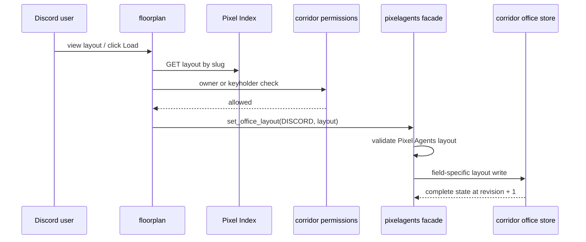

# Floorplan architecture

Floorplan is the Pixel Index adapter. The browser runtime formerly in this cog
was extracted to CCTV.

## Components

| Component | Responsibility |
|---|---|
| `domain/settings.py` | Normalize Pixel Index API and web URLs |
| `contracts/pixel_index.py` | Runtime response models shared with contract generation |
| `application/catalogue.py` | Health, search, detail, and authorized-load use cases |
| `infrastructure/settings.py` | Fresh two-field Red Config repository |
| `infrastructure/pixel_index.py` | Lifecycle-owned aiohttp client |
| `adapters/catalogue_commands.py` | Index configuration, catalogue UI, load callbacks, and LLM tools |
| `adapters/cog_base.py` | Corridor/Pixelagents loading and Pixel Index client lifecycle |

There are no webview, WebSocket, Dashboard, ticket, presence, seat, client-hub,
or guild-display modules in Floorplan.

## Load flow

The write changes only `layout`; it preserves `seats`. CCTV is not in this
request path. If loaded, CCTV receives the resulting `OfficeStateChanged` event
and updates connected browsers.

## Configuration and compatibility

The Config repository stores only `pixel_index_api_url` and
`pixel_index_web_url` under a fresh identifier. No old Floorplan configuration,
layout, seats, route, or listener setting is read. Old Dashboard and WebSocket
routes have no alias.

The Pixel Index consumer contract is generated from
`floorplan/contracts/pixel_index.py` and the endpoint registry under
`contracts/pixel_index/`; see
[`docs/contract-testing.md`](../docs/contract-testing.md).
