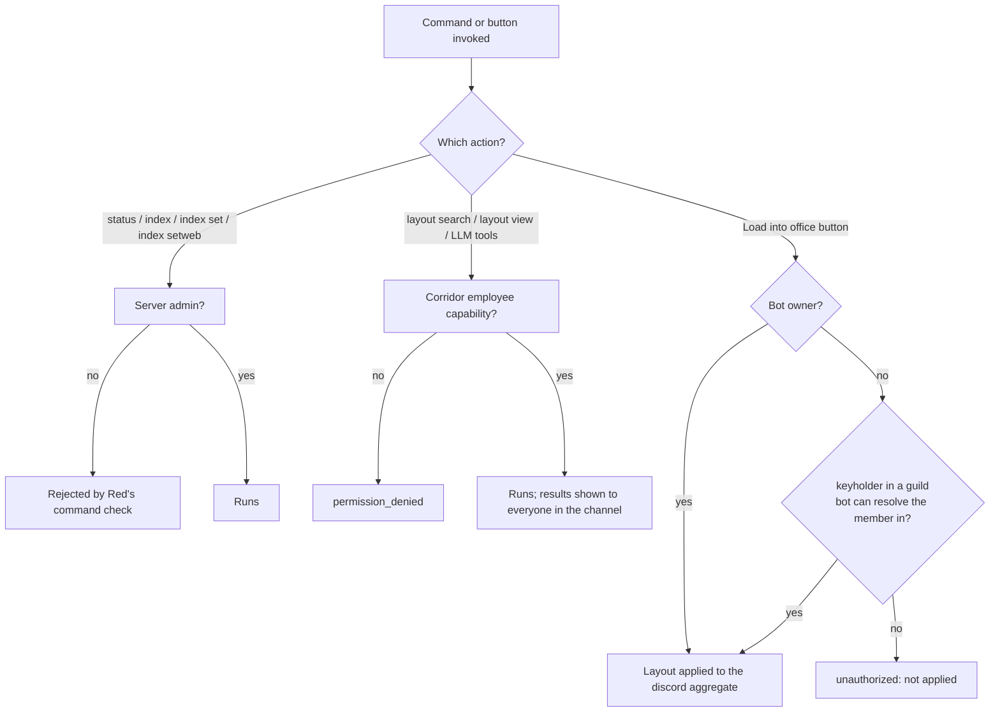

# Floorplan permissions

Floorplan delegates every authorization decision to Corridor and stores no
role configuration of its own. Two tiers apply, plus a plain Discord
permission check on the endpoint-configuration commands.

## Tiers by command

| Command / action | Required tier | Checked via |
|---|---|---|
| `[p]floorplan status` | Server admin (`administrator` permission) | `commands.admin_or_permissions(administrator=True)` |
| `[p]floorplan index` / `index set` / `index setweb` | Server admin (`administrator` permission) | `commands.admin_or_permissions(administrator=True)` |
| `[p]floorplan layout search` | Corridor `employee` | `corridor.require_permission(ctx, EMPLOYEE_KEY)` |
| `[p]floorplan layout view` | Corridor `employee` | `corridor.require_permission(ctx, EMPLOYEE_KEY)` |
| `floorplan_layout_search` / `floorplan_layout_view` LLM tools | Corridor `employee` | `required_group=EMPLOYEE_KEY` on `@llm_tool`, enforced again inside the handler |
| "Load into office" button (on a viewed layout) | Bot owner, **or** Corridor `keyholder` in a guild where the clicking user resolves to a member | `CatalogueService.load_layout` → `_can_edit_layout_user` |

Capability groups are configured with `[p]corridorsettings` and are
independent of each other: membership in `building_manager` does not imply
`keyholder`, and `keyholder` does not imply `employee`.

## Design rationale

Catalogue search and detail are read-only lookups against a public API and
carry no write risk, so they sit at the same `employee` tier as other
low-stakes bot features — open to any member Corridor considers staff,
without requiring elevated capability.

Loading a layout is a write to the shared `discord` office-state aggregate
that every member in an enabled guild sees rendered on `cctv`'s Discord page,
so it requires the same `keyholder` bar that `cctv` itself uses to gate
writes to that page — one write policy for one shared resource, whichever
cog is the one performing the write. The load button re-checks
`keyholder`/ownership at click time inside `CatalogueService.load_layout`
rather than trusting the `employee` gate already passed to reach
`layout view`: viewing a layout and being allowed to apply it are different
privileges, and the view that renders the button is shared by every viewer
regardless of their own capability. The check resolves the *clicking* user
across every guild the bot can see them in — not just the guild the command
was run in — because the Discord aggregate `cctv` renders is not scoped to a
single guild either.

Floorplan never authorizes edits to any browser page: `cctv` separately
authorizes writes to its own Discord and editor pages using its own
policies (bot-owner/keyholder for the Discord page, open for the editor
page).
