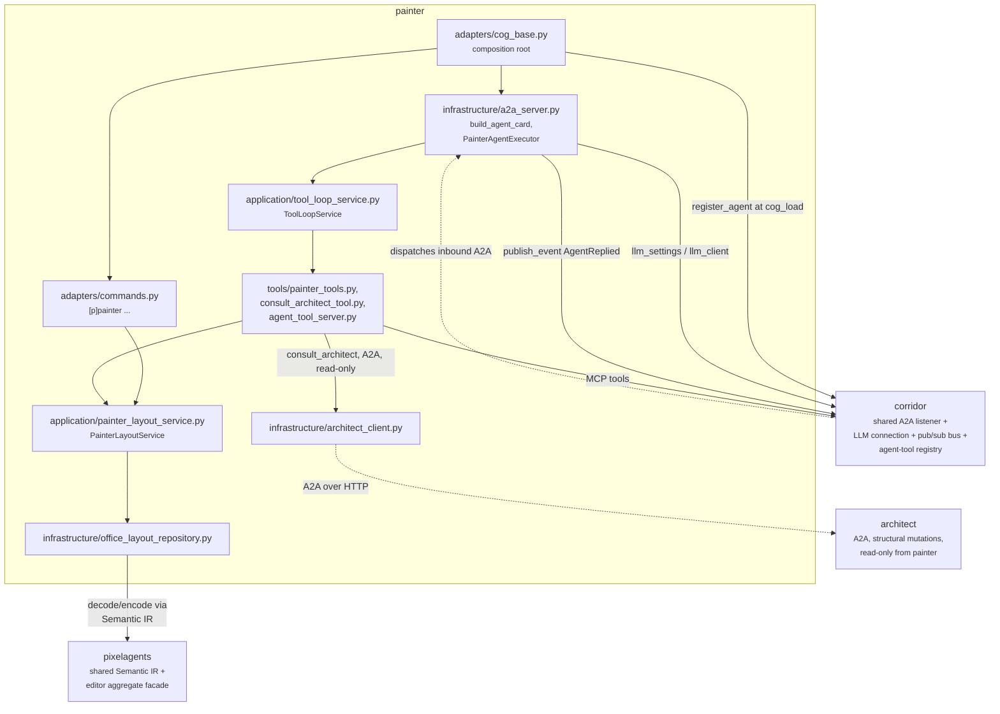
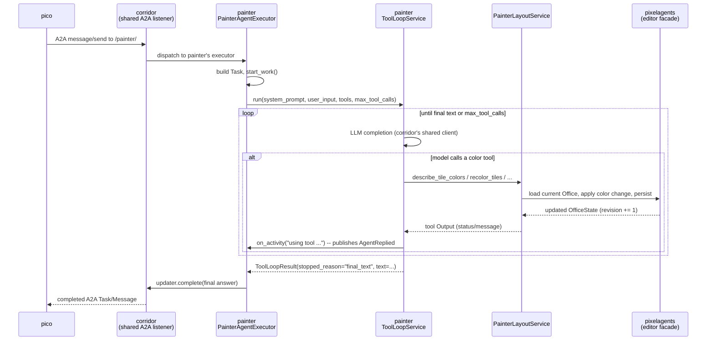
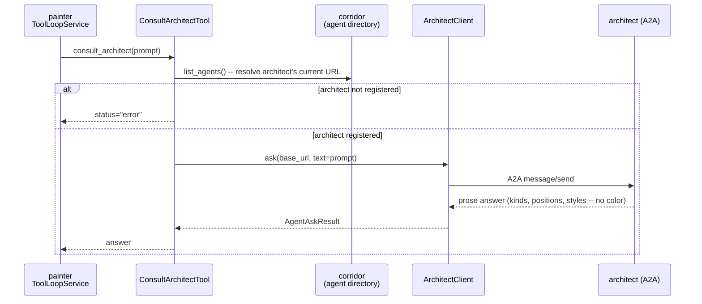

# Painter architecture

Painter is an A2A agent with a deliberately color-only office mutation
surface. Its A2A/tool-loop shape parallels Architect's; its state adapter
is a thin client of Pixelagents' shared editor aggregate.

## Overview

Painter registers an `AgentCard`/`AgentExecutor` with Corridor's shared
A2A listener at `cog_load` instead of binding a listener of its own.
Corridor mounts painter under its own path alongside every other
registered agent, and Pico picks it up automatically the moment it
registers -- no Pico-side code names Painter specifically. Every inbound
A2A message runs Painter's own bounded `ToolLoopService` against
Corridor's shared LLM connection, adapting whatever MCP tools Corridor's
agent-tool registry currently enables for Painter on top of its own five
color tools and its one read-only structural tool.

The repository always selects `OfficeStateKind.EDITOR`. It reads the
current aggregate, decodes the layout into the shared Semantic IR
(`pixelagents.domain.Office`), applies a color mutation, encodes it, and
calls `set_office_layout`. Pixelagents preserves seats and Corridor
increments the revision atomically. There is no whole-aggregate write.

Painter has no Dashboard route, WebSocket listener, presence listener,
Discord conversation loop, or structural mutation tool. CCTV can be
absent without blocking reads or writes; it is only an observer of
persisted state, and notices a new revision independently -- Painter has
no notification hook of its own. Painter has its own hand-written
`_publish_activity` (`adapters/cog_base.py`), reporting each tool-use step
as an `AgentReplied` on Corridor's pub/sub bus, implementing the same
shape as Architect's own `_publish_activity` rather than sharing one
implementation.

## Key flows

### Pico consults painter over A2A

### Painter consults architect for structural context

Painter resolves architect's A2A URL fresh on every call rather than
caching a fixed `base_url`, so it degrades to a normal tool error -- not a
crash -- the moment architect is unloaded or unregistered. Architect can
report exact tile/furniture color too, but painter's own
`describe_tile_colors`/`describe_furniture_colors` reach the same data
directly, without a round trip through architect's tool loop.

See [`docs/painter-design.md`](../docs/painter-design.md) for painter's
full tool/schema reference, color validation model, and design rationale.
