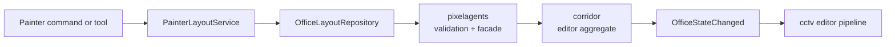

# Painter architecture

Painter is an A2A agent with a deliberately color-only office mutation surface.
Its A2A/tool-loop shape parallels Architect, while its state adapter is a thin
client of Pixelagents.

## Components

| Component | Responsibility |
|---|---|
| `domain/models.py` | Prompt, debug, and maximum-tool-call settings |
| `application/tool_loop_service.py` | Bounded LLM tool loop |
| `application/painter_layout_service.py` | Color reads and color-only layout mutations |
| `infrastructure/settings_repository.py` | Painter-owned Config settings |
| `infrastructure/office_layout_repository.py` | Decode/encode the Pixelagents `editor` aggregate |
| `infrastructure/architect_client.py` | Optional A2A structural query to Architect |
| `infrastructure/a2a_server.py` | Agent card and executor registered with Corridor |
| `tools/` | Painter tools and Corridor MCP-tool adapters |
| `adapters/cog_base.py` | Dependency loading, composition, and A2A registration |
| `adapters/commands.py` | Status, prompt, debug, and tool-limit commands |

## Editor-state flow

The repository always selects `OfficeStateKind.EDITOR`. It reads the current
aggregate, decodes the layout into the shared Semantic IR, applies a color
mutation, encodes it, and calls `set_office_layout`. The facade preserves seats
and Corridor increments the revision atomically. There is no whole-aggregate
write and no notification callback.

Painter has no Dashboard route, WebSocket listener, presence listener, Discord
conversation loop, or structural mutation tool. CCTV can be absent without
blocking reads or writes; it is only an observer of persisted state.
