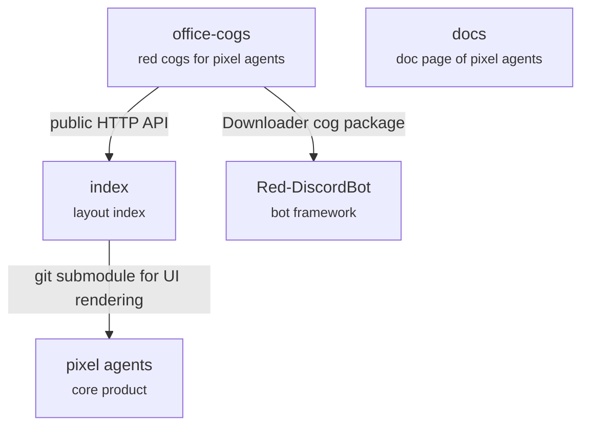
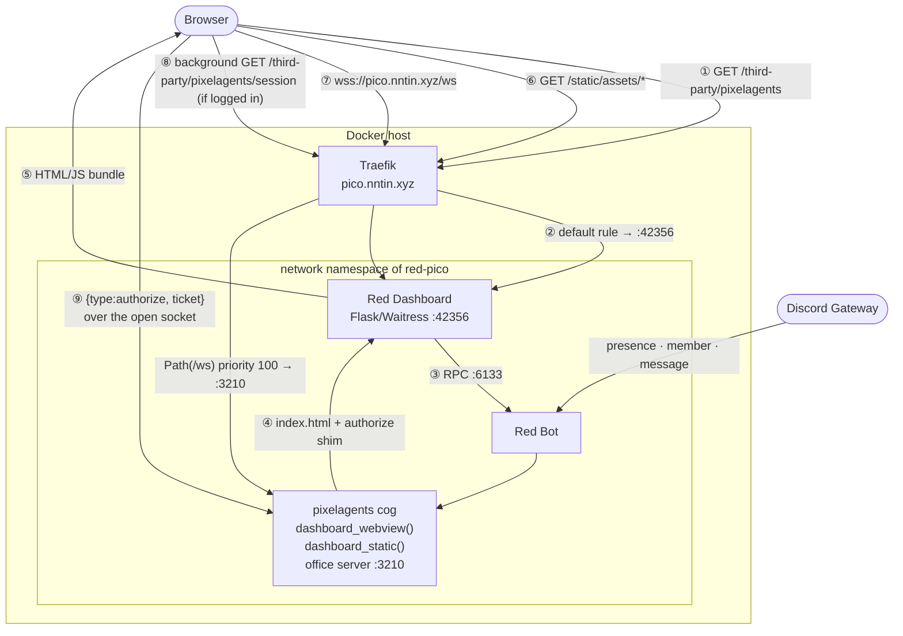

# Pixelagents Architecture

`pixelagents` is a Red DiscordBot cog that does three things:

1. **Serves the Pixel Agents office** — hosts the pre-built browser bundle
   through the Red Web Dashboard third-party page system, and serves the office
   WebSocket protocol itself.
2. **Mirrors Discord presence** — turns guild presence, activity, and message
   events into the office's `ServerMessage` protocol.
3. **Integrates with Pixel Index** — browses the public layout catalogue from
   Discord and loads selected layouts into the shared office.

The cog is the Pixel Agents runtime adapter for Red: it serves the browser
bundle and implements the office WebSocket protocol directly. It does not
depend on a separate producer-ingress service.

## Ecosystem integration



Pixel Agents supplies the office UI and WebSocket message contract. Pixel
Index pins that UI as a git submodule so its gallery can render layouts with
the same code as the core product. The docs site describes the core product
but is not part of the office-cogs runtime path.

office-cogs itself currently has no git submodules. Red's Downloader can clone
a cog repository containing submodules, but it does not recursively update
them on every revision checkout and it copies only the selected cog directory
to Red's install path. The exact behavior and its build implications are
documented in [Downloader and Git submodules](../docs/red-downloader-submodules.md).

At runtime, office-cogs integrates with Pixel Index over its public HTTP API;
it does not connect to the index database or renderer directly:

```text
[p]pixelagents layout search
  -> GET <pixel_index_api_url>/api/v1/layouts

[p]pixelagents layout view <slug>
  -> GET <pixel_index_api_url>/api/v1/layouts/<slug>
  -> use <pixel_index_web_url>/layouts/<slug> for "View on site"

authorized "Load layout"
  -> validate the layout returned by Pixel Index
  -> persist it in Red's cog configuration
  -> broadcast layoutLoaded to every connected office client
```

Browsing is public. Loading a layout uses the same editor authorization as
local layout changes. The API and web origins are separate configuration keys,
so deployments can point the cog at production, staging, or a self-hosted
Pixel Index without rebuilding it.

One public entry point:

```text
https://pico.nntin.xyz/third-party/pixelagents
```



## Routing

| Router | Rule | Target |
|---|---|---|
| `red-pico` | ``Host(`pico.nntin.xyz`)`` | `:42356` Red Dashboard |
| `red-pico-ws` | ``Host(`pico.nntin.xyz`) && Path(`/ws`)`` — priority 100 | `:3210` this cog |

Both routers point at the same container: `red-dashboard-pico` runs with
`network_mode: "service:red-pico"`, so the dashboard and the cog share one
network namespace.

`/ws` has to sit at the origin root because upstream's webview hardcodes
`<origin>/ws` (`webview-ui/src/transport/index.ts`) and is not subpath-aware.

> **Both routers must name their service explicitly.** Once a container
> declares two Traefik services, Traefik cannot infer a default and silently
> drops the router that lacks `traefik.http.routers.<name>.service=`. The
> symptom is the dashboard 404ing on every path, which reads like a dead app
> rather than a routing problem.

## Serving the bundle

```text
GET /third-party/pixelagents            (public — no login required)
  → third_parties_blueprint.third_party
  → DASHBOARDRPC_THIRDPARTIES__DATA_RECEIVE over RPC
  → dashboard_webview() → index.html + authorize shim
  → rendered with standalone: true

GET /third-party/pixelagents/session    (login required)
  → dashboard_session(user_id=…) → {"ticket": "…"} as JSON
  → fetched in the background by the shim, not navigated to directly

GET /third-party/pixelagents/static/<asset_path>
  → third_party_static()  (a redstack patch, not upstream reddash)
  → dashboard_static() → base64 of webview_dist/<asset_path>
  → Cache-Control: public, max-age=3600
```

`_resolve_webview_asset` enforces a path-traversal guard
(`candidate.relative_to(root)`), so a crafted `asset_path` cannot escape
`webview_dist/`.

> **`dashboard_page` infers `context_ids` from the function signature**: any
> parameter with no default named `user_id` (or `guild_id`, `member_id`, …)
> becomes a context ID, which makes the dashboard require login before
> serving that page and hand back the visitor's Discord ID. `dashboard_webview`
> deliberately has no such parameter — that's what keeps the office public.
> `dashboard_session` deliberately does — that's the only login-gated route.
> Never pass `context_ids` explicitly to the decorator: it skips the
> inference branch and files the same-named parameter under
> `required_kwargs` instead, which 404s unless the caller appends the id as a
> query string (e.g. `?user_id=`).

## Building `webview_dist`

Built from the `vendor/pixel-agents` submodule in redstack:

```sh
./scripts/build-webview
```

which runs a subpath Vite build (`--base /third-party/pixelagents/static/`,
supported upstream and covered by its `build-subpath` test) plus
`scripts/emit-decoded-assets.ts`, then syncs into `webview_dist/`.

The production bundle decodes **no** assets itself — `initBrowserMock()` is
DEV-gated in `main.tsx` — so sprites must arrive over the socket as pixel
arrays. Upstream decodes PNGs in Node; rather than port that to Python, the
build runs upstream's own decoders and writes `assets/decoded/*.json`, which
the cog reads at load and forwards verbatim.

## The `webviewReady` bootstrap

Order matters and mirrors upstream's `handleWebviewReady`:

```text
providerCapabilities
  → characterSpritesLoaded → floorTilesLoaded → wallTilesLoaded
  → carpetTilesLoaded → furnitureAssetsLoaded
  → settingsLoaded → areaMappingsLoaded
  → existingAgents → agentTeamInfo…
  → layoutLoaded            ← LAST
  → agentToolStart…         ← after the layout flush
```

`layoutLoaded` must come after `existingAgents`: the webview buffers agents and
only materializes characters when the layout arrives, so a layout-first
bootstrap renders an empty office. Activity bubbles reference those characters,
so they are replayed after it.

`petSpritesLoaded` is not sent — upstream's pet decoder lives in `server/`
rather than `core/`, so the build-time emitter does not cover it. The bundled
default layout has no pets.

## Editor authorization

The office page (`dashboard_webview`) is public — anyone can load it without a
dashboard login, and every socket starts out as a read-only viewer. Knowing
who a visitor *is* still requires a dashboard login, though, so identifying an
editor happens out-of-band:

1. The injected shim opens the office `/ws` socket immediately (viewers never
   wait on anything).
2. In parallel, the shim does a background `fetch()` of the `session` page.
   That page is login-gated (`dashboard_session(user_id=…)`), so an
   already-logged-in visitor gets back `{"ticket": "…"}` (8 h TTL, minted
   bound to their Discord ID); an anonymous visitor's fetch gets redirected to
   the dashboard's login HTML, which fails to parse as the expected JSON and
   is swallowed silently — no navigation, no prompt.
3. If a ticket comes back, the shim sends `{"type": "authorize", "ticket":
   "…"}` over the already-open socket.

Upstream offers no hook for a credential, and Traefik routes `/ws` past the
dashboard so the session cookie never reaches the socket — the ticket is the
only channel. The vendored bundle stays byte-identical to upstream's build;
none of this touches it.

On receiving `authorize` the cog resolves the ticket and applies:

```text
Allow if ANY of:
  1. the user is a bot owner
  2. the user is an administrator in an enabled guild
  3. editor_role_id is set and the user holds it in an enabled guild
Deny otherwise
```

Sockets that never authorize (or fail the check above) stay **read-only
viewers**; `saveLayout`, `saveAgentSeats`, and `importLayout` are dropped
server-side regardless of what the client claims.

## Configuration

Global:

| Key | Default | Description |
|---|---|---|
| `ws_host` | `0.0.0.0` | Office server bind address |
| `ws_port` | `3210` | Office server port (must match the Traefik `/ws` route) |
| `message_tool_clear_delay` | `2.0` | Seconds the message bubble stays visible |
| `editor_role_id` | `None` | Role granting editor access |
| `broadcast_rich_presence` | `True` | Send Spotify/game activity as bubbles |
| `broadcast_messages` | `True` | Send messages as bubbles |
| `layout` | `None` | The office layout; falls back to the bundled default |
| `seats` | `{}` | agent ID → `{palette, hueShift, seatId}` |
| `pixel_index_api_url` | `https://pixel-index-api-staging.nntin.xyz` | Pixel Index API used for health checks, search, and layout retrieval |
| `pixel_index_web_url` | `https://pixel-index.vercel.app` | Pixel Index frontend used for layout links |

Guild: `enabled` (`False`), `include_bots` (`True`). User: `layouts`.

## Agent identity

```python
def _discord_id_to_agent_id(user_id: int) -> int:
    mapped = user_id % _JS_MAX_SAFE
    return -(mapped if mapped != 0 else _JS_MAX_SAFE)
```

Always negative, stable across restarts, JavaScript-safe. The negative
namespace keeps Discord agents clear of upstream's sub-agent IDs (−1 downward)
and shadow-store IDs (1 000 000 up). Collisions are logged at WARNING.

## Presence mapping

| Discord signal | Office effect |
|---|---|
| `online` / `idle` / `dnd` | `agentCreated` (with palette) → `agentTeamInfo` → `agentStatus` |
| `offline` / `invisible` / left / excluded | `agentClosed` |
| status change | `agentClosed` + fresh `agentCreated` (`folderName` is immutable) |
| display-name change | `agentTeamInfo` |
| non-custom rich presence | `agentStatus: "active"` + `agentToolStart` |
| no rich presence | `agentStatus: "waiting"` |
| message sent | `agentToolStart` (`msg-<id>`, 40 chars), cleared after the delay |

After every change the cog re-broadcasts `existingAgents`.

Palettes follow upstream's diverse assignment: count the palettes in use, pick
randomly among the least-used, and hue-shift once all six are taken.

## Commands

| Command | Description |
|---|---|
| `[p]pixelagents status` | Configuration, client count, asset state |
| `[p]pixelagents enable` / `disable` | Guild mirroring on/off |
| `[p]pixelagents sync` / `despawnall` | Reconcile / clear agents |
| `[p]pixelagents includebots <bool>` | Mirror bot users |
| `[p]pixelagents wsport <port>` | Office server port |
| `[p]pixelagents toolcleardelay <s>` | Message bubble duration |
| `[p]pixelagents richpresence <bool>` | Activity bubbles |
| `[p]pixelagents messages <bool>` | Message bubbles |
| `[p]pixelagents editorrole [role]` | Editor role |
| `[p]pixelagents index` | Pixel Index endpoints and API health |
| `[p]pixelagents index set <url>` / `setweb <url>` | Configure the Pixel Index API/frontend |
| `[p]pixelagents layout search [query] [tag] [sort]` | Browse Pixel Index layouts |
| `[p]pixelagents layout view <slug>` | View and optionally load a Pixel Index layout |

Loading a Pixel Index layout writes it to the shared configuration and
broadcasts `layoutLoaded` to every open tab.

## Rebuilding after changes

| What changed | Action |
|---|---|
| `pixelagents.py` or `webview_dist/` | None — `/cogs` is bind-mounted; hot-reload or `[p]reload pixelagents` |
| `vendor/pixel-agents` (webview source) | `./scripts/build-webview`, then reload the cog |
| `vendor/red-web-dashboard` (routes patch) | `docker compose build red-dashboard-pico && docker compose up -d red-dashboard-pico` |
| Traefik labels / instance env | `./scripts/update-compose && docker compose up -d` |

Third-party registration is cached by the dashboard process: after changing a
`dashboard_page` signature, restart `red-dashboard-pico` so its
`app.variables["third_parties"]` resyncs.
