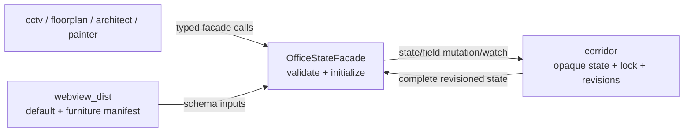

# Pixelagents architecture

Pixelagents separates Pixel Agents schema knowledge from persistence and browser
hosting. Corridor stores opaque JSON-compatible aggregates; CCTV owns the live
browser runtime.

## Components

| Component | Responsibility |
|---|---|
| `domain/office_ir.py` | Framework-free Semantic IR shared by Architect and Painter |
| `contracts/layout.py` | Pydantic model for raw Pixel Agents layouts |
| `contracts/outbound.py` | Typed outbound browser messages |
| `application/office_state.py` | Validation, lazy initialization, field-specific state facade, seat repository adapter |
| `application/office.py` / `presence.py` | Framework-free roster and activity projection used by CCTV |
| `infrastructure/pixel_agents_adapter.py` | Raw layout to/from Semantic IR codec |
| `infrastructure/furniture_styles.py` | Generated furniture manifest and cache |
| `infrastructure/settings.py` | Webview commit override; Pixelagents' only Config identity |
| `infrastructure/webview_build.py` | Clone, build, cache markers, and bundled-default loading |
| `adapters/cog_base.py` | Bundle lifecycle and public cross-cog facade |

## State boundary



`OfficeStateFacade` is the single schema-aware path. `set_layout` reads or
initializes the selected state, validates the candidate, and asks Corridor for a
layout-field update. `set_seats` and `mutate_seats` do the equivalent for seats.
Corridor performs the locked read-modify-write, preserves the other field,
increments the revision, then publishes the complete post-write state.

For `OfficeStateKind.EDITOR`, layout validation also decodes and re-encodes the
Semantic IR using the current furniture manifest. This makes malformed or
unsupported editor state fail before persistence. The Discord state needs the
wire-layout validation only.

Both states initialize independently. If Corridor has no value, the facade reads
the bundled default, validates it for the chosen kind, and calls Corridor's
idempotent initializer. If the bundle/default is unavailable, it raises
`OfficeStateUnavailableError`. Existing invalid state raises
`OfficeStateValidationError`; neither case resets data.

## Building `webview_dist`

The build pipeline is:

```text
ensure_webview_built(cog_data_path)
  -> use cache when commit, base marker, and manifest version match
  -> clone/fetch pixel-agents-hq/pixel-agents at the selected commit
  -> npm ci --workspace=webview-ui --ignore-scripts
  -> vite build --base ./
  -> decode sprite assets and generate furniture-styles.json
  -> remove and rebuild <cog_data_path>/webview_dist in place
```

The last step is not an atomic rename/swap: `_sync_dist` removes the
existing `webview_dist` (if any) and repopulates it file by file. An
`fcntl`-based file lock (`_build_lock`) still serializes concurrent build
attempts against the same `cog_data_path` so two builds never interleave
their writes, but a process crash mid-`_sync_dist` can leave a partial
`webview_dist` behind rather than rolling back to the previous build.

The relative `./` asset base lets CCTV serve one build beneath its own static
Dashboard route. `webview_bundle_status()` is a read-only surface and never
triggers a rebuild.

## Contracts

`contracts/pixel_agents/verify.py` executes the real build into a temporary
directory, hands it to CCTV's production `WebviewAssets`, verifies assets and
the default layout, and checks outbound messages against the pinned upstream
AsyncAPI schema. The committed consumer contract is generated from
`pixelagents/contracts/outbound.py` and checked separately for drift.

Pixelagents has exactly one Red Config factory: the commit override repository.
Office state uses Corridor's separate fresh Config identity.
