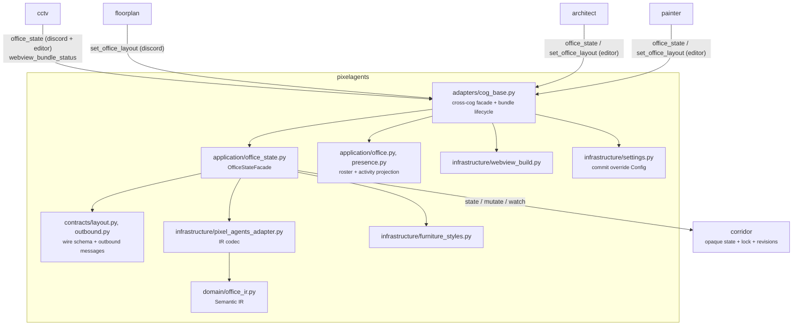
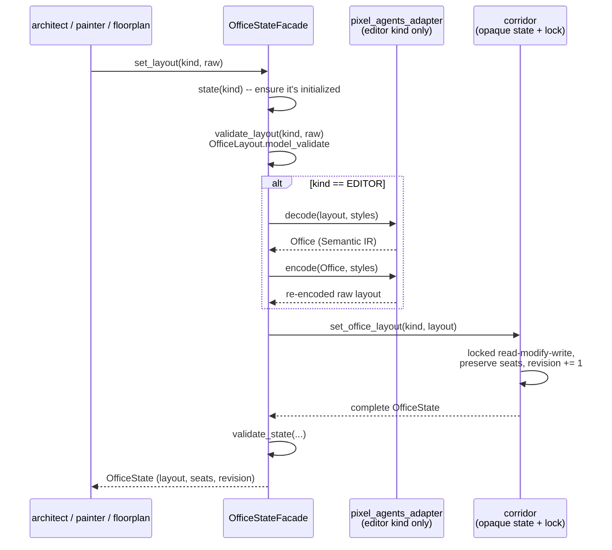
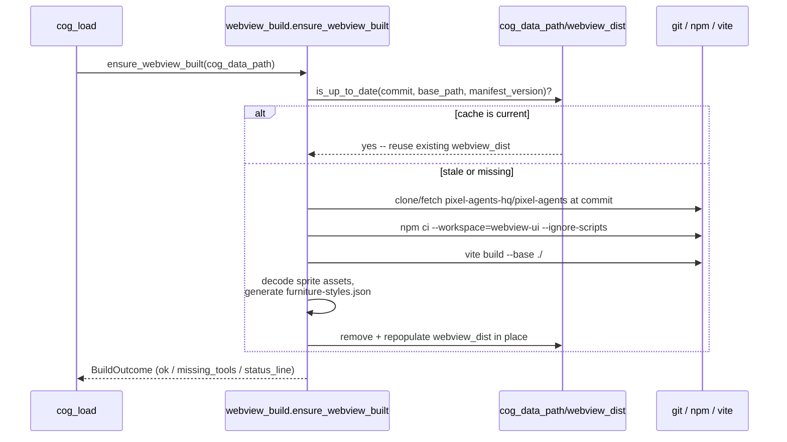

# Pixelagents architecture

Pixelagents separates Pixel Agents schema knowledge from persistence and
browser hosting. Corridor stores opaque JSON-compatible aggregates;
CCTV owns the live browser runtime built from Pixelagents' bundle.

## Overview

Pixelagents is a leaf dependency four other cogs build on: Architect and
Painter mutate the `editor` aggregate through it, Floorplan mutates the
`discord` aggregate through it, and CCTV reads both kinds and serves the
webview bundle Pixelagents builds. None of the four ever reads or writes
Corridor's aggregate directly -- every access goes through Pixelagents'
`OfficeStateFacade`, so schema validation and the Semantic IR round-trip
happen exactly once, regardless of which cog is calling.

## Components and dependents

`OfficeStateFacade` is the single schema-aware path. `set_layout` reads or
initializes the selected state, validates the candidate, and asks Corridor
for a layout-field update. `set_seats` and `mutate_seats` do the
equivalent for seats. Corridor performs the locked read-modify-write,
preserves the other field, increments the revision, then publishes the
complete post-write state.

For `OfficeStateKind.EDITOR`, layout validation also decodes and
re-encodes the Semantic IR using the current furniture manifest. This
makes malformed or unsupported editor state fail before persistence. The
Discord state needs the wire-layout validation only.

Both states initialize independently. If Corridor has no value, the
facade reads the bundled default, validates it for the chosen kind, and
calls Corridor's idempotent initializer. If the bundle/default is
unavailable, it raises `OfficeStateUnavailableError`. Existing invalid
state raises `OfficeStateValidationError`; neither case resets data.

## Key flows

### Office-state facade: validate, then delegate

Every write goes through the same read-current -> validate-candidate ->
delegate-to-Corridor shape, whether the caller is Architect placing
furniture or Floorplan saving a Discord layout:

A validation failure at any step raises before Corridor's
`set_office_layout` is ever called, so a rejected mutation never touches
persisted state.

### Webview build

`cog_load` builds the webview off the event loop, on a worker thread, the
first time it's needed:

The last step is not an atomic rename/swap: `_sync_dist` removes the
existing `webview_dist` (if any) and repopulates it file by file. An
`fcntl`-based file lock (`_build_lock`) still serializes concurrent build
attempts against the same `cog_data_path` so two builds never interleave
their writes, but a process crash mid-`_sync_dist` can leave a partial
`webview_dist` behind rather than rolling back to the previous build. A
failed build never fails `cog_load`: `webview_bundle_status()` reports the
failure and the owner is notified best-effort, but the cog stays loaded.

The relative `./` asset base lets CCTV serve one build beneath its own
static Dashboard route. `webview_bundle_status()` is a read-only surface
and never triggers a rebuild on its own.

## Contracts

`contracts/pixel_agents/verify.py` executes the real build into a
temporary directory, hands it to CCTV's production `WebviewAssets`,
verifies assets and the default layout, and checks outbound messages
against the pinned upstream AsyncAPI schema. The committed consumer
contract is generated from `pixelagents/contracts/outbound.py` and
checked separately for drift.

## Related docs

- [`README.md`](README.md) -- commands and configuration.
- [`docs/architect-semantic-ir-design.md`](../docs/architect-semantic-ir-design.md)
  -- the Semantic IR and Pixel Agents JSON codec this facade wraps.
- [`docs/architect-design.md`](../docs/architect-design.md) and
  [`docs/painter-design.md`](../docs/painter-design.md) -- how Architect
  and Painter each use the editor-kind facade.
- [`docs/cctv-design.md`](../docs/cctv-design.md) -- browser hosting built
  on `webview_bundle_status()` and both office-state kinds.
- [`docs/contract-testing.md`](../docs/contract-testing.md) -- how the
  build pipeline and outbound schema are contract-tested.
