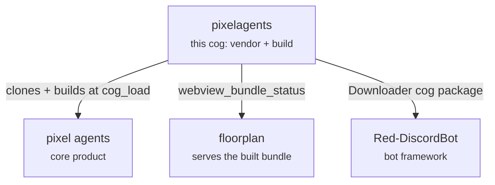

# Pixelagents Architecture

`pixelagents` is a small Red DiscordBot utility cog, the same shape as
[`toolbox`](../toolbox): it vendors and builds the
[Pixel Agents](https://github.com/pixel-agents-hq/pixel-agents) webview so
[`floorplan`](../floorplan) can serve it. It owns nothing runtime-facing —
no dashboard routes, no Discord presence mirroring, no WebSocket protocol,
no Pixel Index integration. Those all moved to `floorplan` in
[issue #21](https://github.com/pixel-agents-hq/pixel-agents-cogs/issues/21),
which split the original combined cog along exactly this line: "owns the
vendor and the build" vs. "owns everything that consumes the result."

## Internal structure

| File | Responsibility |
|---|---|
| `domain/settings.py` | `parse_commit_ref` — validates a user-supplied commit hash/link |
| `infrastructure/settings.py` | `RedSettingsRepository` — the one Config key this cog owns, `webview_commit_override` |
| `infrastructure/webview_build.py` | Clone-and-build orchestration: `ensure_webview_built`, `build_webview`, `built_commit` |
| `infrastructure/webview_build_scripts/` | Upstream's own PNG-decoder script, invoked against the runtime clone |
| `adapters/cog_base.py` | Composition root: wires the repository, runs the build at `cog_load`, exposes `webview_bundle_status()` |
| `adapters/commands.py` | The whole `[p]pixelagents webview ...` command surface |
| `adapters/replies.py` | Interaction-aware reply dispatch through corridor's `ReplyMode` (`[p]pixelagents webview rebuild` defers, then follows up) |
| `pixelagents.py` | Cog composition plus the historical lowercase-alias export |

`required_cogs: corridor` stays declared, purely so replies respect
whatever `ReplyMode` a guild has configured — pixelagents holds no
permission checks of corridor's, unlike floorplan's Keyholder-gated layout
editing.

## The `webview_bundle_status()` cross-cog surface

`floorplan` depends on this cog (`required_cogs`) and resolves it at
`cog_load` via `dependency_loader.ensure_pixelagents_loaded` (mirroring how
every cog here resolves corridor). It never triggers a build itself —
rebuilding stays `[p]pixelagents webview rebuild`-only — it only reads:

```python
@dataclass(frozen=True)
class WebviewBundleStatus:
    dist_path: Path  # <pixelagents cog_data_path>/webview_dist
    ready: bool  # index.html present on disk
    detail: str  # human-readable status line
    built_commit: str | None  # the commit actually on disk, if ready
```

`floorplan/adapters/cog_base.py::_sync_webview_assets` re-reads this before
every public webview page render (and at its own `cog_load`) rather than
caching a snapshot, and reloads its decoded sprite assets only when
`built_commit` changes — so a `[p]pixelagents webview rebuild` to a new
commit is picked up without floorplan needing a reload of its own.

## Ecosystem integration



office-cogs pins the upstream commit
(`pixelagents/infrastructure/webview_vendor.commit`) but cannot vendor it as
a submodule the way [Pixel Index](https://github.com/pixel-agents-hq/index)
does: Red's Downloader clones a cog repository with `--recurse-submodules`,
but it does not recursively update submodules on later revision checkouts,
has no hook to run a frontend build, and copies only the selected cog
directory (`pixelagents/`) to Red's install path — a top-level `vendor/`
submodule would not even be copied, and nothing would ever build it for an
installed cog. So instead of vendoring the source, this cog vendors *the
build*: `infrastructure/webview_build.py` clones the pinned commit and runs
the same subpath Vite build directly from inside the installed cog, the
first time `cog_load` runs, into Red's per-cog data directory (see
"Building `webview_dist`" below) — never into the installed package tree,
which stays read-only from Downloader's point of view. The exact Downloader
behavior this works around is documented in
[Downloader and Git submodules](../docs/red-downloader-submodules.md).

## `pixelagents/` and the repo-root `contracts/`

There are two differently-scoped things named "contracts" in this repo, and
they are not the same thing:

- **`floorplan/contracts/`** — the office WebSocket protocol and Pixel
  Index wire-schema layer, part of floorplan's own runtime now. This cog
  has no `contracts/` package of its own — it has nothing to model, only
  files to build.
- **`contracts/`** (repo root) — a separate top-level package that exists
  purely for CI. `contracts/pixel_agents/` generates and checks a
  consumer-driven contract for the vendored Pixel Agents webview, running
  the exact `ensure_webview_built` path this cog runs at `cog_load`, then
  handing the result to floorplan's `WebviewAssetProvider` the same way
  floorplan itself would. It ships in this repo but is never loaded by
  Red — `contracts/info.json` declares `"type": "SHARED_LIBRARY"`
  specifically so Red's Downloader excludes it from cog discovery.

See [`docs/contract-testing.md`](../docs/contract-testing.md) for how that
contract-testing methodology works.

## Building `webview_dist`

`webview_dist/` is not committed and does not exist anywhere in this
repository's tree. It is cloned and built at runtime, the first time
`cog_load` runs on a given bot host, by `infrastructure/webview_build.py`:

```text
ensure_webview_built(cog_data_path(self))
  → already built at the pinned commit? return -- see is_up_to_date()
  → git missing/node missing/npm missing? raise WebviewBuildError
  → git clone/fetch + checkout <pinned commit>   → <data>/vendor/pixel-agents
  → npm ci --workspace=webview-ui --ignore-scripts
  → vite build --base /third-party/floorplan/static/
  → emit_decoded_assets.ts (upstream's own PNG decoders)
  → sync the trimmed result                      → <data>/webview_dist
```

`<data>` is `redbot.core.data_manager.cog_data_path(self)` — Red's per-cog
data directory, writable and persisted across cog reloads/updates, *not*
the installed `pixelagents/` package tree Downloader manages.

The Vite build's `--base` is rooted at floorplan's own third-party
Dashboard route (`/third-party/floorplan/static/`, derived from the
`Floorplan` Cog's name), not this cog's — the bundle is built here but
served there, and its asset URLs have to be rooted wherever it actually
ends up.

The sync step trims Vite's output to what `WebviewAssetProvider` (floorplan)
and the served bundle actually read: the entry HTML, the hashed JS/CSS
bundle, the font it references, and the specific `assets/*.json` files
below. Vite's `public/` passthrough also copies upstream's raw per-tile
PNGs and unrelated promo images that nothing here serves; `_sync_dist` drops
them rather than copying everything.

Two failure modes both have to leave the cog usable rather than breaking
`cog_load`, since a bot host may simply not have Node.js:

- **A required tool is missing.** `webview_bundle_status().detail` names
  which one (surfaced by floorplan's own status field); the bot owner gets
  an unsolicited DM (`Red.send_to_owners`) the first time this happens,
  since a silently-broken webview is easy to miss.
- **The build itself fails** (network, a broken npm registry, upstream
  shipping something the pinned Vite/tsx can't parse) — same DM, with the
  captured error instead of a tool name.

`[p]pixelagents webview rebuild` re-runs the same `ensure_webview_built`
routine (forced, bypassing the already-built check), off the event loop —
useful after installing a missing build tool, or to pick up a pin bump
without a full cog reload.

The production bundle decodes **no** assets itself — `initBrowserMock()` is
DEV-gated in `main.tsx` — so sprites must arrive over the socket as pixel
arrays. Upstream decodes PNGs in Node; rather than port that to Python, the
build runs upstream's own decoders
(`infrastructure/webview_build_scripts/emit_decoded_assets.ts`, invoked
against the runtime clone) and writes `assets/decoded/*.json`, which
floorplan reads at load and forwards verbatim.

## Configuration

Global: `webview_commit_override` (`None` by default) — an admin-set
override of `webview_vendor.commit`, set via
`[p]pixelagents webview setcommit`.

## Boundary enforcement and validation

[`.github/workflows/cogs-quality.yml`](../.github/workflows/cogs-quality.yml)
runs on every push/PR touching `pixelagents/**/*.py`,
`contracts/pixel_agents/**`, or `pyproject.toml`. It is the CI check that
verifies the boundaries described above — `check-cogs.yml` is a separate
Red-downloader load smoke test and does not run any of this.

| Rule (in `pixelagents/tests/test_architecture.py`) | Checks |
|---|---|
| `test_composition_entrypoint_is_genuinely_thin` | `pixelagents.py` stays under 200 lines |
| `test_framework_resources_have_one_owner` | `Config.get_conf(` is constructed in exactly one file |
| `test_pascalcase_and_lowercase_public_classes_are_identical` | `PixelAgents`/`pixelagents` aliases are the same object |
| `test_command_root_is_inherited_once` | `pixelagents_group` is owned exactly once across the mixin MRO |
| `test_production_config_access_does_not_bypass_repository` | no file outside `infrastructure/settings.py` calls `something.config.xxx(...)` directly |
| `test_no_leftover_runtime_dependency_on_aiohttp_or_pydantic` | nothing under production code still imports `aiohttp`/`pydantic` — those moved to floorplan with the office runtime |

The local quality gate is:

```sh
python -m pytest -q pixelagents/tests
python -m ruff format --check pixelagents
python -m ruff check pixelagents
python -m mypy pixelagents
```

## Rebuilding after changes

| What changed | Action |
|---|---|
| Python under `pixelagents/` | None — `/cogs` is bind-mounted; hot-reload or `[p]reload pixelagents` |
| `vendor/pixel-agents` (webview source) | `[p]pixelagents webview rebuild`, or wait for the next `cog_load` |
