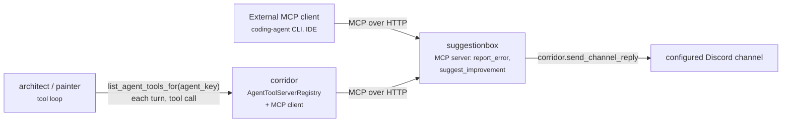

# suggestionbox

MCP feedback server for reporting errors/improvements, per-agent gated.

## Overview

`suggestionbox` runs an MCP ([Model Context Protocol](https://modelcontextprotocol.io/))
tools server exposing two tools -- `report_error` and
`suggest_improvement` -- that post to a bot-owner-configured Discord
channel. Two kinds of caller reach these tools:

- A genuinely external MCP client (a coding-agent CLI, an IDE
  integration) connects to suggestionbox's own MCP endpoint directly.
- A registered A2A agent in corridor's `AgentDirectoryService`
  (`architect` and `painter` today) reaches the same tools from its own
  in-process tool-calling loop, mediated entirely by corridor's
  `AgentToolServerRegistry` and MCP client.



Neither transport carries a Discord identity, so every tool call carries
its own `source` field identifying the reporter (`"architect"`,
`"painter"`, or a description of an external tool/session).

## Installing

Requires [`corridor`](../corridor) (auto-loaded on `cog_load` via
`dependency_loader.ensure_corridor_loaded()` -- `required_cogs` is only a
Downloader install hint):

```
[p]repo add pixel-agents-cogs https://github.com/pixel-agents-hq/pixel-agents-cogs
[p]cog install pixel-agents-cogs suggestionbox
[p]load suggestionbox
```

## Commands

All commands are bot-owner-only -- this is bot-wide capability
configuration, not guild content.

| Command | Description |
|---|---|
| `[p]suggestionbox channel <#channel>` | Set the feedback channel |
| `[p]suggestionbox mcp host <host>` | Set the MCP listener's bind host and restart it |
| `[p]suggestionbox mcp port <port>` | Set the MCP listener's bind port and restart it |
| `[p]suggestionbox agents` | Open the per-agent MCP access panel (Components v2) |

### MCP tools

| Tool | Fields |
|---|---|
| `report_error` | `source`, `what_happened`, `expected`, `actual`, `severity` (low/medium/high) |
| `suggest_improvement` | `source`, `area`, `observation`, `suggestion` |

Both post a message to the configured feedback channel and return a small
`{"status": "ok" | "error", ...}` mapping to the caller.

## Configuration

All of this cog's own state is global (bot-wide), not per-guild: neither
an external MCP client nor a registered A2A agent's call carries guild
context.

1. `[p]suggestionbox channel <#channel>` -- set the one Discord channel
   `report_error`/`suggest_improvement` post to.
2. `[p]suggestionbox mcp host <host>` / `[p]suggestionbox mcp port <port>`
   -- configure and restart this cog's own MCP listener (`127.0.0.1:8934`
   by default). Add a reverse-proxy rule if it needs to be reachable from
   outside the bot's own host.
3. `[p]suggestionbox agents` -- open the Components v2 panel and enable
   MCP tool access for whichever registered A2A agents should have it.
   Off by default for a newly-registered agent.

Config keys (global only, `suggestionbox/infrastructure/settings_repository.py`):

| Key | Default | Meaning |
|---|---|---|
| `mcp_host` | `"127.0.0.1"` | MCP listener bind host |
| `mcp_port` | `8934` | MCP listener bind port |
| `feedback_guild_id` / `feedback_channel_id` | `None` / `None` | Configured feedback channel |
| `mcp_enabled_agents` | `{}` | `agent_key -> allowed`; a missing key means disabled |

## Related docs

See [`docs/suggestionbox-design.md`](../docs/suggestionbox-design.md) for
the full design: why corridor has a dedicated `AgentToolServerRegistry`
and MCP client rather than reusing `ToolRegistryService`, the ctx-less
`render_channel_reply`/`send_channel_reply` primitives corridor uses for
this cog's proactive channel posts, and how architect's and painter's own
tool loops each consult `corridor.list_agent_tools_for(<their own agent
key>)` fresh every A2A turn. See [`docs/corridor.md`](../docs/corridor.md)
for how `required_cogs` and corridor's dependency-loading work in general.
